[TOC]


# Git学习


## 第一章、Git概述

​		Git是一个[免费的开源](https://git-scm.com/about/free-and-open-source)分布式版本控制系统，旨在快速高效地处理从小型到非常大的项目的所有内容。

​		Git [易于学习，](https://git-scm.com/doc)占用[空间小，性能快如闪电](https://git-scm.com/about/small-and-fast)。它超越了SCM工具，如Subversion，CVS，Perforce和ClearCase，具有[廉价的本地分支](https://git-scm.com/about/branching-and-merging)，方便[的暂存区域](https://git-scm.com/about/staging-area)和[多个工作流程](https://git-scm.com/about/distributed)等功能

### 1.1Git的工作机制

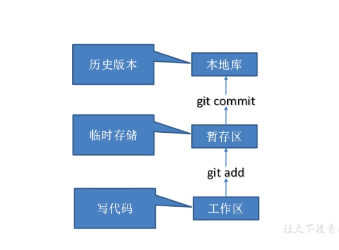

### 1.2Git和代码托管中心

代码托管中心是基于网络服务器的远程代码仓库，一般我们简单称为**远程库**。

➢  **局域网**

✓  GitLab

➢  **互联网**

✓  GitHub（外网）

✓  Gitee 码云（国内网站）

## 第二章、Git安装


## 第三章、Git常用命令

| **命令****名称**                     | **作用**           |
| ------------------------------------ | ------------------ |
| git config --global user.name 用户名 | 设置用户签名       |
| git config --global user.email 邮箱  | 设置用户签名       |
| **git init**                         | **初始化本地库**   |
| **git status**                       | **查看本地库状态** |
| **git add 文件名**                   | **添加到暂存区**   |
| **git commit -m "日志信息" 文件名**  | **提交到本地库**   |
| **git reflog**                       | **查看历史记录**   |
| **git reset --hard 版本号**          | **版本穿梭**       |

样例

```
git config --global user.name dhf
git config --global user.email xx@xx.com //该邮箱为虚拟邮箱
//查看
$ cat ~/.gitconfig 
[user]
name  =  dhf
email = xx@xx.com

lenvoo@LAPTOP-SGUISALP MINGW64 /d/git-workspace/git-demo (master)
$ cat ~/
cat: /c/Users/lenvoo/: Is a directory
```

#### 3.1初始化本地库

语法：**git init**

```
lenvoo@LAPTOP-SGUISALP MINGW64 /d/git-workspace/git-demo
$ git init
Initialized empty Git repository in D:/git-workspace/git-demo/.git/
//生成的.git目录默认是隐藏的【.git】
```

```
使用ll命令查看文件，
隐藏文件为 ll -a
cd .. 返回上一级
```

#### 3.2查看本地库状态

语法：**git status**

```
lenvoo@LAPTOP-SGUISALP MINGW64 /d/git-workspace/git-demo (master)
$ git status
On branch master

No commits yet //没有提交过

nothing to commit (create/copy files and use "git add" to track)

```

##### vim 编辑命令

系统提供了可用的命令能够从一般模式切换到插入模式，且每个命令在键盘上均分配有一个不同的键：

| 按键 | 执行结果                                                     |
| ---- | ------------------------------------------------------------ |
| i    | 切换到插入模式，并在当前光标位置之***\*前\****开始插入（插入） |
| I    | 将光标移至当前行的***\*开头\****位置，并切换至插入模式       |
| a    | 切换到插入模式，并在当前光标位置之***\*后\****开始插入（附加） |
| A    | 将光标移至当前行的***\*结尾\****位置，并切换至插入模式       |
| R    | 从光标下的字符开始，切换到插入模式。处于插入模式时，不会插入文本，此时输入的每个字符均将***\*替换\****掉当前文档的字符。（vim和vi也具有更多更强大的替换命令，***\*详细见第三章第8\**节**） |
| o    | 在当前行的***\*下方\****新打开一个行，并切换到插入模式       |
| O    | 在当前行的***\*上方\****新打开一个行，并切换到插入模式       |

在一般模式中移动光标可以使用多个按键，这些按键执行效果见下，移动好光标后再进入插入模式进行编辑会非常方便：

| 按键 | 在一般模式中光标移动结果 |
| ---- | ------------------------ |
| h    | 光标向左移动一个位置     |
| l    | 光标向右移动一个位置     |
| j    | 光标向下移动一行         |
| k    | 光标向上移动一行         |
| ^    | 移至当前行的开头位置     |
| $    | 移至当前行的结尾位置     |
| gg   | 移至文档的第一行         |
| G    | 移至文档的最后一行       |

说明：Esc将会取消当前命令，或者返回至一般模式。常见的做法是按两下Esc(或者按更多下)，以确保返回至命令模式。

以下简要列出从命令模式保存并推出当前文件时可使用的命令。

| 按键 | 执行结果                                   |
| ---- | ------------------------------------------ |
| :wq  | 保存并退出当前文件                         |
| :w   | 保存当前文件并留在编辑器中                 |
| :w！ | 若文本为只读模式，强制保存                 |
| :q   | 退出当前文件（仅在没有未保存更改的情况下） |
| :q!  | 退出当前文件，忽略任何未保存的修改         |


##### 3.2.1新增文件


```
vim命令 
创建文件 ： vim hello.txt
编辑文件 ： 一般模式变成插入模式：i
		  插入模式返回一般模式： Esc
		  复制当前行： 一般模式下 yy
		  粘贴： 一般模式下 p
		  保存： :wq
```


查看文件： **cat  xx.xx**

```
lenvoo@LAPTOP-SGUISALP MINGW64 /d/git-workspace/git-demo (master)
$ cat hello.txt
hello world
hello world
hello world

```

再次查看状态

```
lenvoo@LAPTOP-SGUISALP MINGW64 /d/git-workspace/git-demo (master)
$ git status
On branch master

No commits yet //没有提交

Untracked files: //没有追踪的文件，没有添加到暂存区，只是在工作区
  (use "git add <file>..." to include in what will be committed)
        hello.txt

nothing added to commit but untracked files present (use "git add" to track)

```

#### 3.3 添加暂存区

命令：**git add <file>**

```
lenvoo@LAPTOP-SGUISALP MINGW64 /d/git-workspace/git-demo (master)
$ git add hello.txt
warning: LF will be replaced by CRLF in hello.txt.
The file will have its original line endings in your working directory
//警告，替换了换行...
```

查看状态

```
lenvoo@LAPTOP-SGUISALP MINGW64 /d/git-workspace/git-demo (master)
$ git status
On branch master

No commits yet

Changes to be committed: //在暂存区了
  (use "git rm --cached <file>..." to unstage)//使用git rm --cached <file>...删除
        new file:   hello.txt

```

```
lenvoo@LAPTOP-SGUISALP MINGW64 /d/git-workspace/git-demo (master)
$ git rm --cached hello.txt
rm 'hello.txt'//删除了暂存区，工作区还是有的

```

#### 3.4提交本地库

基本语法：**git commit -m”日志信息”  文件名**

```
lenvoo@LAPTOP-SGUISALP MINGW64 /d/git-workspace/git-demo (master)
$ git commit -m"my first commit" hello.txt
warning: LF will be replaced by CRLF in hello.txt.
The file will have its original line endings in your working directory//他改变了换行符
[master (root-commit) 54676ff版本号] my first commit // 	54676ff版本号
 1 file changed, 3 insertions(+) //一个文件被改变，3行内容被提交
 create mode 100644 hello.txt

```

再次查看本地库状态

```
lenvoo@LAPTOP-SGUISALP MINGW64 /d/git-workspace/git-demo (master)
$ git status
On branch master
nothing to commit, working tree clean

```

**查看历史记录**

基本语法：**git reflog**

```
lenvoo@LAPTOP-SGUISALP MINGW64 /d/git-workspace/git-demo (master)
$ git reflog
54676ff (HEAD -> master) HEAD@{0}: commit (initial): my first commit

```

```
lenvoo@LAPTOP-SGUISALP MINGW64 /d/git-workspace/git-demo (master)
$ git log
commit 54676ff6b6cd9fff00e6bc91eb7f3ba4579770b9 (HEAD -> master)//完整的版本号
Author: dhf <1049334207@qq.com>
Date:   Sat Jun 25 23:17:59 2022 +0800

    my first commit

```

#### 3.5修改文件

对hello.txt文件修改后查看本地库状态

```
lenvoo@LAPTOP-SGUISALP MINGW64 /d/git-workspace/git-demo (master)
$ git status
On branch master
Changes not staged for commit:
  (use "git add <file>..." to update what will be committed)
  (use "git restore <file>..." to discard changes in working directory)
        modified:   hello.txt// 被修改的hello.txt

no changes added to commit (use "git add" and/or "git commit -a")

```

再次添加到暂存区，提交

```
lenvoo@LAPTOP-SGUISALP MINGW64 /d/git-workspace/git-demo (master)
$ git add hello.txt
warning: LF will be replaced by CRLF in hello.txt.
The file will have its original line endings in your working directory

lenvoo@LAPTOP-SGUISALP MINGW64 /d/git-workspace/git-demo (master)
$ git status
On branch master
Changes to be committed:
  (use "git restore --staged <file>..." to unstage)
        modified:   hello.txt


lenvoo@LAPTOP-SGUISALP MINGW64 /d/git-workspace/git-demo (master)
$ git commit -m"second commit" hello.txt
warning: LF will be replaced by CRLF in hello.txt.
The file will have its original line endings in your working directory
[master f796e66] second commit
 1 file changed, 9 insertions(+)//一个文件被修改，9行新增
//git是以行为单位的，修改一行会提示，新增一行，删除一行
```

查看

```
lenvoo@LAPTOP-SGUISALP MINGW64 /d/git-workspace/git-demo (master)
$ git reflog
f796e66 (HEAD -> master) HEAD@{0}: commit: second commit
54676ff HEAD@{1}: commit (initial): my first commit

```

#### 3.6历史版本

##### 3.6.1 查看历史版本

基本语法：**git reflog 查看版本信息**

**git log 产看版本详细信息** 

```
lenvoo@LAPTOP-SGUISALP MINGW64 /d/git-workspace/git-demo (master)
$ git log
commit f796e66e603d944d716bcc523490051ef20c201f (HEAD -> master)
Author: dhf <1049334207@qq.com>
Date:   Sat Jun 25 23:31:01 2022 +0800

    second commit

commit 54676ff6b6cd9fff00e6bc91eb7f3ba4579770b9
Author: dhf <1049334207@qq.com>
Date:   Sat Jun 25 23:17:59 2022 +0800

    my first commit

```

##### 3.6.2 版本穿梭

基本语法：**git reset --hard 版本号**

```
lenvoo@LAPTOP-SGUISALP MINGW64 /d/git-workspace/git-demo (master)
$ git reset --hard 54676ff //版本穿梭
HEAD is now at 54676ff my first commit

lenvoo@LAPTOP-SGUISALP MINGW64 /d/git-workspace/git-demo (master)
$ git reflog
54676ff (HEAD -> master) HEAD@{0}: reset: moving to 54676ff
f796e66 HEAD@{1}: commit: second commit
54676ff (HEAD -> master) HEAD@{2}: commit (initial): my first commit

lenvoo@LAPTOP-SGUISALP MINGW64 /d/git-workspace/git-demo (master)
$ cat hello.txt
hello world
hello world
hello world

```

```
.get文件中的HEAD显示当前指针指向什么位置 ref: refs/heads/master
.get文件中refs中heads中master文件显示当前版本号76ff6b6cd9fff00e6bc91eb7f3ba4579770b9
```

**git版本切换**

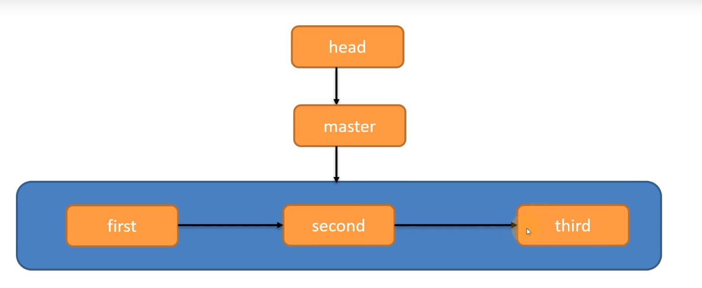

**通过指针head指向master分支，master指向版本来进行切换版本**

## 第四章、Git分支操作

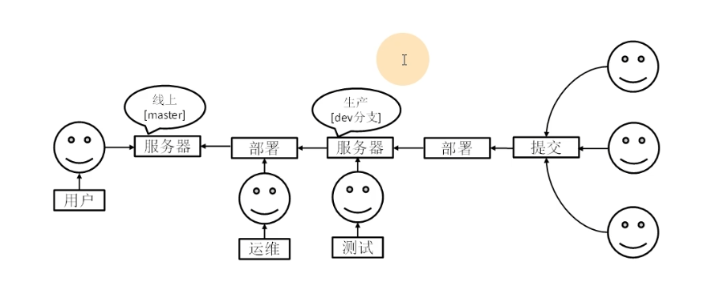

### 4.1 什么是分支

​        在版本控制过程中，同时推进多个任务，为每个任务，我们就可以创建每个任务的单独分支。使用分支意味着程序员可以把自己的工作从开发主线上分离开来，开发自己分支的时候，不会影响主线分支的运行。对于初学者而言，分支可以简单理解为副本，一个分支就是一个单独的副本。（分支底层其实也是指针的引用）

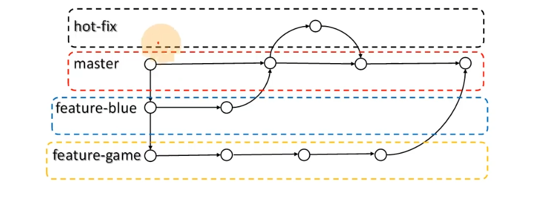


### 4.2 分支好处

```
同时推进多个功能的开发，提高工作效率
如果某个分支开发失败，不回对其他分支产生影响，失败的分支删除重来即可
```


### 4.3 分支的操作

| **命令****名称**    | **作用**                     |
| ------------------- | ---------------------------- |
| git branch 分支名   | 创建分支                     |
| git branch -v       | 查看分支                     |
| git checkout 分支名 | 切换分支                     |
| git merge 分支名    | 把指定的分支合并到当前分支上 |

#### 4.3.1查看分支

基本语法：  **git branch -v**  

```
lenvoo@LAPTOP-SGUISALP MINGW64 /d/git-workspace/git-demo (master)
$ git branch -v
* master 54676ff my first commit

```

#### 4.3.2 创建分支

基本语法：**git branch 分支名 **

```
lenvoo@LAPTOP-SGUISALP MINGW64 /d/git-workspace/git-demo (master)
$ git branch hot-fix //创建分支

lenvoo@LAPTOP-SGUISALP MINGW64 /d/git-workspace/git-demo (master)
$ git branch -v  //查看分支
  hot-fix 54676ff my first commit//刚创建的新分支，并将主分支 master的内容复制了一份
* master  54676ff my first commit

```

#### 4.3.3切换分支

基本语法：**git checkout 分支名**

```
lenvoo@LAPTOP-SGUISALP MINGW64 /d/git-workspace/git-demo (master)
$ git checkout hot-fix
Switched to branch 'hot-fix'

lenvoo@LAPTOP-SGUISALP MINGW64 /d/git-workspace/git-demo (hot-fix)
$ git branch -v
* hot-fix 54676ff my first commit //当前分支
  master  54676ff my first commit

```

#### 4.3.4 修改分支

```
lenvoo@LAPTOP-SGUISALP MINGW64 /d/git-workspace/git-demo (hot-fix)
$ vim hello.txt  //在hot-fix分支修改了hello.txt文件

lenvoo@LAPTOP-SGUISALP MINGW64 /d/git-workspace/git-demo (hot-fix)
$ git status //查看本地库状态
On branch hot-fix
Changes not staged for commit:
  (use "git add <file>..." to update what will be committed)
  (use "git restore <file>..." to discard changes in working directory)
        modified:   hello.txt //更新了

no changes added to commit (use "git add" and/or "git commit -a")//没有提交

lenvoo@LAPTOP-SGUISALP MINGW64 /d/git-workspace/git-demo (hot-fix)
$ git add hello.txt //添加到暂存区

lenvoo@LAPTOP-SGUISALP MINGW64 /d/git-workspace/git-demo (hot-fix)
$ git commit -m"hot-fix first commit" hello.txt //提交
[hot-fix 8805d0e] hot-fix first commit
 1 file changed, 1 insertion(+)

lenvoo@LAPTOP-SGUISALP MINGW64 /d/git-workspace/git-demo (hot-fix)
$ cat hello.txt //查看文件
hello world
hello world
hello world
hot-fix up

```

**查看历史记录**

```
lenvoo@LAPTOP-SGUISALP MINGW64 /d/git-workspace/git-demo (hot-fix)
$ git reflog
8805d0e (HEAD -> hot-fix) HEAD@{0}: commit: hot-fix first commit
54676ff (master) HEAD@{1}: checkout: moving from master to hot-fix
54676ff (master) HEAD@{2}: reset: moving to 54676ff
f796e66 HEAD@{3}: commit: second commit
54676ff (master) HEAD@{4}: commit (initial): my first commit

```


#### 4.3.5 合并分支

基于语法：**git merge 分支名  **【指定分支合并到当前分支】

```
lenvoo@LAPTOP-SGUISALP MINGW64 /d/git-workspace/git-demo (hot-fix)
$ git checkout master //切换为master分支
Switched to branch 'master'

lenvoo@LAPTOP-SGUISALP MINGW64 /d/git-workspace/git-demo (master)
$ git reflog //查看历史记录
54676ff (HEAD -> master) HEAD@{0}: checkout: moving from hot-fix to master
8805d0e (hot-fix) HEAD@{1}: commit: hot-fix first commit
54676ff (HEAD -> master) HEAD@{2}: checkout: moving from master to hot-fix
54676ff (HEAD -> master) HEAD@{3}: reset: moving to 54676ff
f796e66 HEAD@{4}: commit: second commit
54676ff (HEAD -> master) HEAD@{5}: commit (initial): my first commit

lenvoo@LAPTOP-SGUISALP MINGW64 /d/git-workspace/git-demo (master)
$ cat hello.txt //查看文件，发现在hot-fix修改的文件对master分支未产生影响
hello world
hello world
hello world

```

**进行合并**

```
lenvoo@LAPTOP-SGUISALP MINGW64 /d/git-workspace/git-demo (master)
$ git merge hot-fix //合并分支
Updating 54676ff..8805d0e
Fast-forward
 hello.txt | 1 +
 1 file changed, 1 insertion(+)

lenvoo@LAPTOP-SGUISALP MINGW64 /d/git-workspace/git-demo (master)
$ cat hello.txt //查看，发现被修改了
hello world
hello world
hello world
hot-fix up

```

#### 4.3.6 合并冲突

​    分支合并时，两个分支在**同一个文件的同一个位置**有两套完全不同的修改，Git无法替我们决定使用哪一个，必须人为决定使用哪一个。

【实例】

```
lenvoo@LAPTOP-SGUISALP MINGW64 /d/git-workspace/git-demo (master)
$ vim hello.txt //【在master修改hello.txt文件】

lenvoo@LAPTOP-SGUISALP MINGW64 /d/git-workspace/git-demo (master)
$ git add hello.txt //【添加到暂存区】

lenvoo@LAPTOP-SGUISALP MINGW64 /d/git-workspace/git-demo (master)
$ git commit -m"master upload" hello.txt //【提交到本地库】
[master 9ea545f] master upload
 1 file changed, 1 insertion(+)

lenvoo@LAPTOP-SGUISALP MINGW64 /d/git-workspace/git-demo (master)
$ git checkout hot-fix //【更改成hot-fix分支】
Switched to branch 'hot-fix'

lenvoo@LAPTOP-SGUISALP MINGW64 /d/git-workspace/git-demo (hot-fix)
$ vim hello.txt //【修改hello.txt文件】

lenvoo@LAPTOP-SGUISALP MINGW64 /d/git-workspace/git-demo (hot-fix)
$ git add hello.txt //【添加到暂存区】

lenvoo@LAPTOP-SGUISALP MINGW64 /d/git-workspace/git-demo (hot-fix)
$ git commit -m"hot-fix upload" hello.txt //【提交到本地库】
[hot-fix 876e058] hot-fix upload
 1 file changed, 1 insertion(+)

lenvoo@LAPTOP-SGUISALP MINGW64 /d/git-workspace/git-demo (hot-fix)
$ git checkout master //【更换到master分支】
Switched to branch 'master'

lenvoo@LAPTOP-SGUISALP MINGW64 /d/git-workspace/git-demo (master)
$ git merge hot-fix //【与hot-fix分支合并】
Auto-merging hello.txt
CONFLICT (content): Merge conflict in hello.txt //【合并冲突在hello.txt】
Automatic merge failed; fix conflicts and then commit the result.
//【自动合并失败；修复冲突，然后提交结果。】
```

**【手动合并代码】**

vim hello.txt查看

```
vim hello.txt查看

hello world
hello world
hello world
hot-fix up
<<<<<<< HEAD
master branch upload
=======
hot-fix upload
>>>>>>> hot-fix
~
~
~
```

选择需要的进行保存

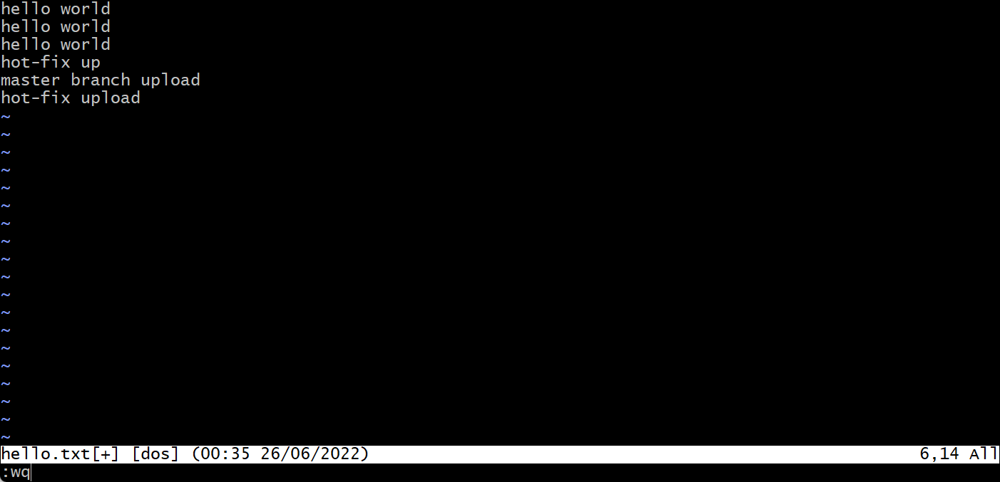

```
lenvoo@LAPTOP-SGUISALP MINGW64 /d/git-workspace/git-demo (master|MERGING)
$ vim hello.txt //修改结束

lenvoo@LAPTOP-SGUISALP MINGW64 /d/git-workspace/git-demo (master|MERGING)
$ git add hello.txt //再次添加到暂存区

lenvoo@LAPTOP-SGUISALP MINGW64 /d/git-workspace/git-demo (master|MERGING)
$ git commit -m"meger" //再次提交【不带文件名】
[master b2de1f3] meger

lenvoo@LAPTOP-SGUISALP MINGW64 /d/git-workspace/git-demo (master)

```

**合并只修改master分支，不会改变hot-fix分支**


## 第五章、Git团队协作机制

#### 5.1 团队内协作

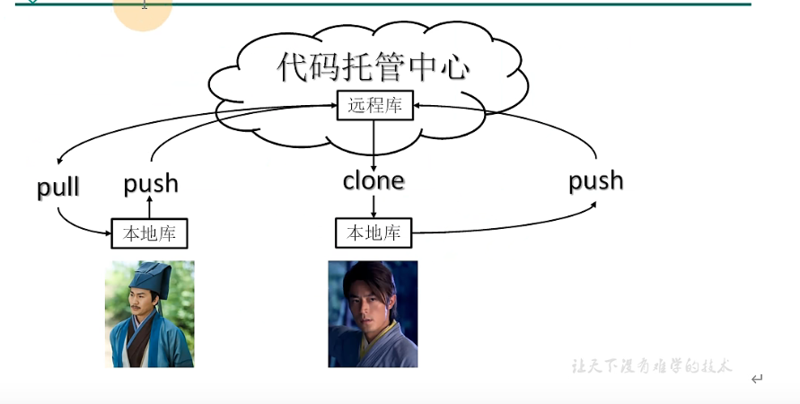


| 命令      | 作用 |
| :-------- | ---- |
| **push**  | 推送 |
| **clone** | 克隆 |
| **pull**  | 拉取 |


#### 5.2 跨团队协作

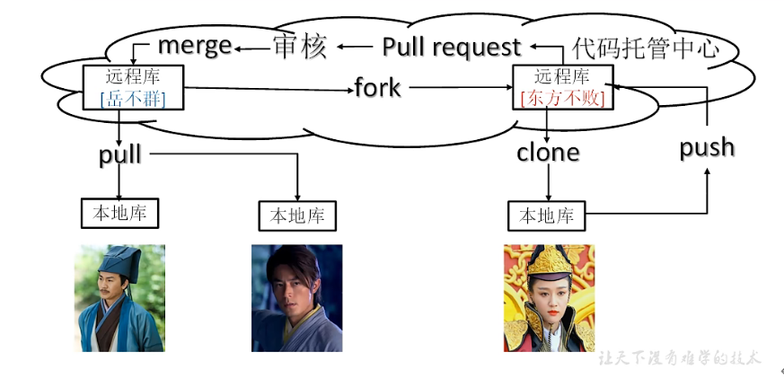

| 命令             | 作用                           |
| ---------------- | ------------------------------ |
| **fork**         | 将一个远程库复制到另一个远程库 |
| **pull request** | 拉取请求                       |


## 第六章、GitHub操作

GitHub 网址：https://github.com/

Ps:全球最大同性交友网站，技术宅男的天堂，新世界的大门，你还在等什么?

| 用户        | 邮箱              | 密码      |
| ----------- | ----------------- | --------- |
| zhaodid     | 2569243347@qq.com | dhf200827 |
| dangHuifeng | 1049334207@qq.com | dhf200827 |
| liHonglind  | 2324419359@qq.com | dhf200827 |

#### 6.1 创建远程库

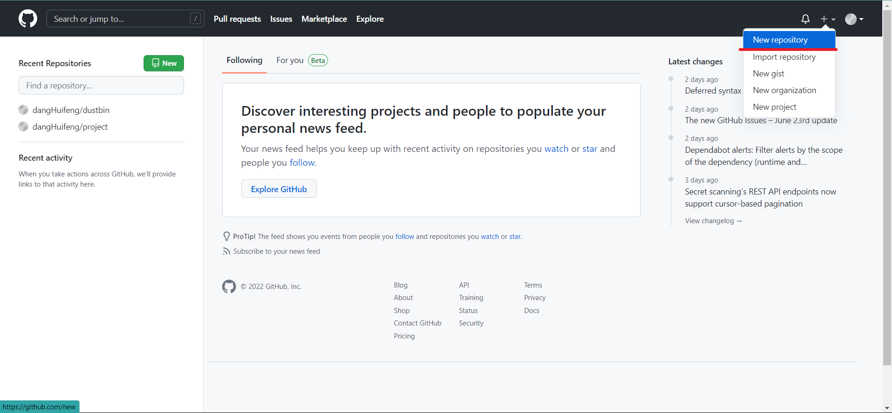

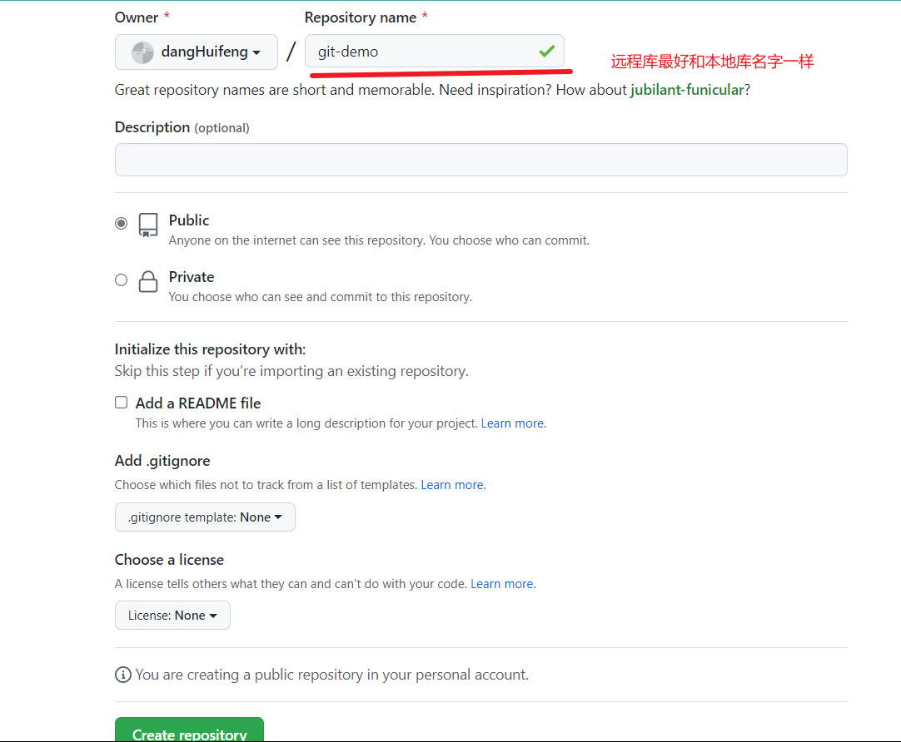

**远程库链接**


#### 6.2 远程库操作

##### 6.2.1 创建别名

**查看别名**

```
lenvoo@LAPTOP-SGUISALP MINGW64 /d/git-workspace/git-demo (master)
$ git remote -v
			//没有别名
lenvoo@LAPTOP-SGUISALP MINGW64 /d/git-workspace/git-demo (master)

```

**创建别名**

基于语法：**git remote add 别名 链接**

```
lenvoo@LAPTOP-SGUISALP MINGW64 /d/git-workspace/git-demo (master)
$ git remote git-demo https://github.com/dangHuifeng/goy-demo.git //创建别名

lenvoo@LAPTOP-SGUISALP MINGW64 /d/git-workspace/git-demo (master)
$ git remote -v  //查看别名
git-demo        https://github.com/dangHuifeng/git-demo.git (fetch) //拉取
git-demo        https://github.com/dangHuifeng/git-demo.git (push) //推送

```

##### 6.2.2 推送本地分支到远程仓库

基本语法：**git push 别名 分支**

###### 6.2.1 使用ssh形式推送

【**创建私钥和公钥**】

```

lenvoo@LAPTOP-SGUISALP MINGW64 /d/git-workspace/git-demo (master)
【$ ssh-keygen -t rsa -C "1049334207@qq.com"】 //【创建】
Generating public/private rsa key pair.
Enter file in which to save the key (/c/Users/lenvoo/.ssh/id_rsa)://【空】
Enter passphrase (empty for no passphrase): //【密码可以为空】
Enter same passphrase again:
Your identification has been saved in /c/Users/lenvoo/.ssh/id_rsa //【私钥】
Your public key has been saved in /c/Users/lenvoo/.ssh/id_rsa.pub //【公钥】
The key fingerprint is:
SHA256:HIX7WC6XUJpL9al6P96vmvzOM+n7Y7l04RUrbm4Yo0I 1049334207@qq.com
The key's randomart image is:
+---[RSA 3072]----+
|         ..      |
|        ..o      |
|        .* . . . |
|       .*.. o   o|
|       .SB o . o.|
|       E+ *o. o o|
|      .  +. +o +o|
|       ....o+==+.|
|        .. oBBXO=|
+----[SHA256]-----+

```

【**添加ssh key到github**】

【github-》setting-》SSH】

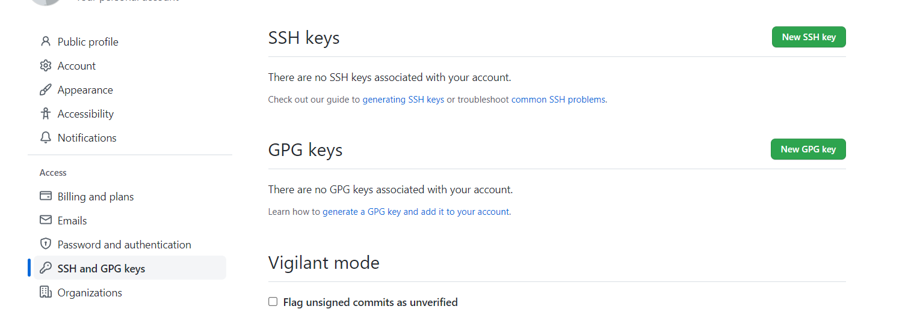

【**添加.ssh下的公钥**】

【Title随便写】


【**测试ssh keys是否设置成功。**】

```
lenvoo@LAPTOP-SGUISALP MINGW64 /d/git-workspace/git-demo (master)
$ ssh -T git@github.com
The authenticity of host 'github.com (140.82.114.4)' can't be established.
ED25519 key fingerprint is SHA256:+DiY3wvvV6TuJJhbpZisF/zLDA0zPMSvHdkr4UvCOqU.
This key is not known by any other names
Are you sure you want to continue connecting (yes/no/[fingerprint])? yes
//【是否继续关联】
Warning: Permanently added 'github.com' (ED25519) to the list of known hosts.
Hi dangHuifeng! You've successfully authenticated, but GitHub does not provide shell access. //【成功】


```

【**本地提交**】

```
lenvoo@LAPTOP-SGUISALP MINGW64 /d/git-workspace/git-demo (master)
$ git remote add git-demo-ssh git@github.com:dangHuifeng/git-demo.git//【别名】

lenvoo@LAPTOP-SGUISALP MINGW64 /d/git-workspace/git-demo (master)
$ git push git-demo-ssh master//【提交】
Enumerating objects: 24, done.
Counting objects: 100% (24/24), done.
Delta compression using up to 8 threads
Compressing objects: 100% (14/14), done.
Writing objects: 100% (24/24), 1.83 KiB | 623.00 KiB/s, done.
Total 24 (delta 4), reused 0 (delta 0), pack-reused 0
remote: Resolving deltas: 100% (4/4), done.
To github.com:dangHuifeng/git-demo.git
 * [new branch]      master -> master

```

【**提交成功**】


##### 6.2.3 拉取远程库到本地库

基本语法：**git pull 别名 分支**

```
lenvoo@LAPTOP-SGUISALP MINGW64 /d/git-workspace/git-demo (master)
$ git pull git-demo-ssh master
remote: Enumerating objects: 5, done.
remote: Counting objects: 100% (5/5), done.
remote: Compressing objects: 100% (2/2), done.
Unpacking objects: 100% (3/3), 681 bytes | 113.00 KiB/s, done.
remote: Total 3 (delta 1), reused 0 (delta 0), pack-reused 0
From github.com:dangHuifeng/git-demo
 * branch            master     -> FETCH_HEAD
   84642ad..049ba77  master     -> git-demo-ssh/master
Updating 84642ad..049ba77
Fast-forward
 hello.txt | 1 +
 1 file changed, 1 insertion(+) //【一行修改了】

lenvoo@LAPTOP-SGUISALP MINGW64 /d/git-workspace/git-demo (master)
$ git status //【查看状态】
On branch master
nothing to commit, working tree clean //【pull后自动提交】

```


##### 6.2.4 克隆远程仓库到本地

基本语法：**git clone 远程地址**

```
lenvoo@LAPTOP-SGUISALP MINGW64 /d/git-workspace/git-clone
$ git clone git@github.com:dangHuifeng/git-demo.git //【命令】
Cloning into 'git-demo'...
remote: Enumerating objects: 27, done.
remote: Counting objects: 100% (27/27), done.
remote: Compressing objects: 100% (12/12), done.
remote: Total 27 (delta 5), reused 23 (delta 4), pack-reused 0
Receiving objects: 100% (27/27), done.
Resolving deltas: 100% (5/5), done.

// git clone
//1、替你初始化 git init
//2、自动设置别名 默认origin
//3、拉取文件
```

```
lenvoo@LAPTOP-SGUISALP MINGW64 /d/git-workspace/git-clone/git-demo (master)
$ git remote -v //【查看别名】
origin  git@github.com:dangHuifeng/git-demo.git (fetch)
origin  git@github.com:dangHuifeng/git-demo.git (push)

```

【**修改后提交**】

```
lenvoo@LAPTOP-SGUISALP MINGW64 /d/git-workspace/git-clone/git-demo (master)
$ git push origin master
Enumerating objects: 5, done.
Counting objects: 100% (5/5), done.
Delta compression using up to 8 threads
Compressing objects: 100% (2/2), done.
Writing objects: 100% (3/3), 288 bytes | 288.00 KiB/s, done.
Total 3 (delta 1), reused 0 (delta 0), pack-reused 0
remote: Resolving deltas: 100% (1/1), completed with 1 local object.
To github.com:dangHuifeng/git-demo.git
   049ba77..520a13f  master -> master

```

【**不同的人需要邀请进入团队**】


#### 6.3 跨团队协作

登录zhaodid的github


点击**fork**，查看自己的本地库


【已经有了】


【点击pull requests】

**创建pull request**

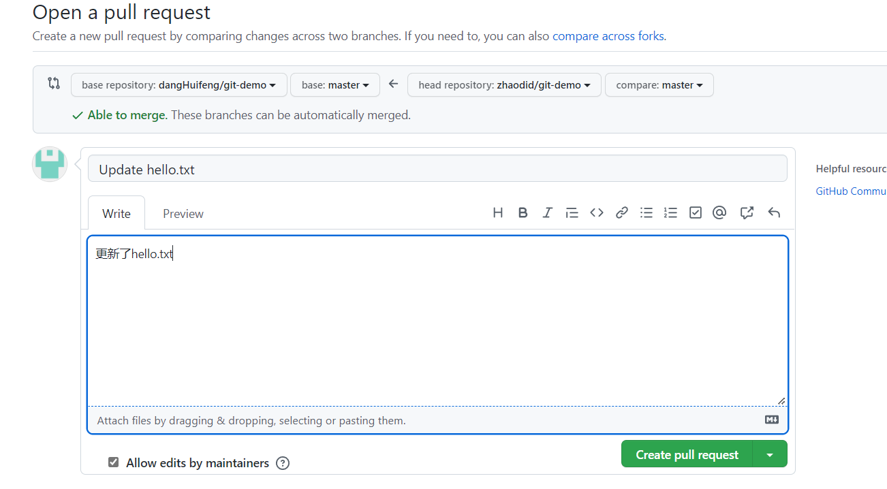

【在dangHuifeng的Github上】


## 第七章、IDEA集成Git

#### 7.1 配置git忽略文件

【我们只需要pom文件和代码】

**方法：**

创建git.ignore文件，文件放在任何地方都行，建议放在家目录下【C:/user/lever/git.ignore】

```
# Compiled class file
*.class

# Log file
*.log

# BlueJ files
*.ctxt

# Mobile Tools for Java (J2ME)
.mtj.tmp/# Package Files #
*.jar
*.war
*.nar
*.ear
*.zip
*.tar.gz
*.rar

hs_err_pid*

.classpath
.project
.settings
target
.idea
*.iml
```

.gitconfig文件中

```
[user]
	name = dhf
	email = 1049334207@qq.com
[core]
	excludesfile=C:/Users/lenvoo/git.ignore
```


#### 7.2 定位Git程序


#### 7.3 初始化本地库


#### 7.4 添加提交到本地库

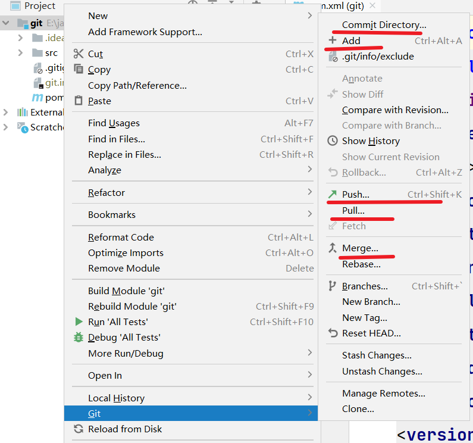


#### 7.5 切换版本


#### 7.6 创建分支


#### 7.7 合并分支


#### 7.8 合并冲突

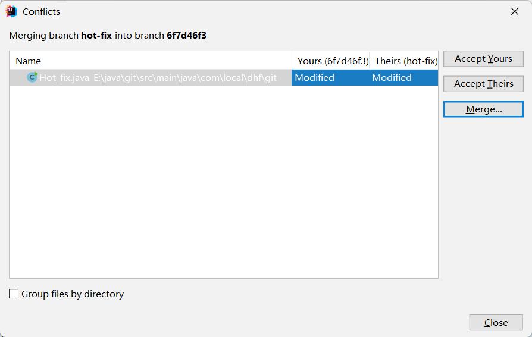


## 第八章、IDEA集成GitHub


### 8.1 IDEA登录GitHub


### 8.2 push本地库到远程库


### 8.3 推送代码到远程库


### 8.4 拉取远程库


### 8.5 克隆

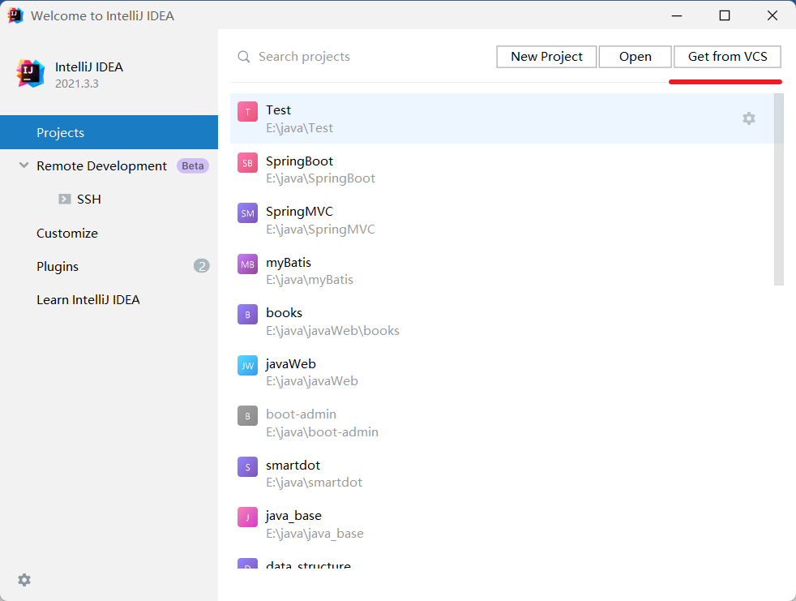


## 第九章、国内托管平台Gitee码云

### 9.1 IDEA集成码云

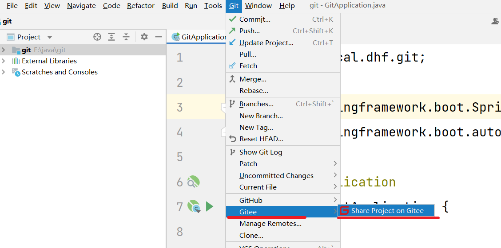


### 9.2 push gitee

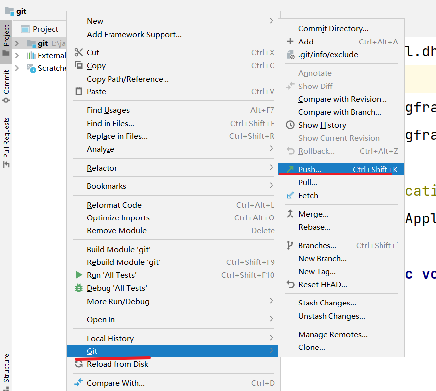


### 9.3 码云复制GitHub


## 第十章、自建代码托管平台GitLab

### **10.1** **GitLab** **简介**

GitLab 是由 GitLabInc.开发，使用 [MIT](https://baike.baidu.com/item/MIT许可证) 许可证的基于网络的 [Git](https://baike.baidu.com/item/Git) 仓库管理工具，且具有[wiki](https://baike.baidu.com/item/wiki) 和 issue 跟踪功能。使用 [Git](https://baike.baidu.com/item/Git) 作为代码管理工具，并在此基础上搭建起来的 web 服务。

GitLab 由乌克兰程序员 DmitriyZaporozhets 和 ValerySizov 开发，它使用 [Ruby](https://baike.baidu.com/item/Ruby语言) [语言写](https://baike.baidu.com/item/Ruby语言)成。后来，一些部分用 [Go](https://baike.baidu.com/item/Go语言) 语言重写。截止 2018 年 5 月，该公司约有 290 名团队成员，以及 2000 多名开源贡献者。GitLab 被 IBM，Sony，JülichResearchCenter，NASA，Alibaba，Invincea，O’ReillyMedia，Leibniz-Rechenzentrum(LRZ)，CERN，SpaceX 等组织使用。

### **10.2** **GitLab** 官网地址

官网地址：https://about.gitlab.com/

安装说明：https://about.gitlab.com/installation/

 

### **10.3** **GitLab** **安装**

 

**10.3.1**  **服务器准备**

 

准备一个系统为 CentOS7 以上版本的服务器，要求内存 4G，磁盘 50G。关闭防火墙，并且配置好主机名和 IP，保证服务器可以上网。

此教程使用虚拟机：主机名：gitlab-server  IP 地址：192.168.6.200


