[TOC]


# 1、初识

```
JUC  java.util.concurrent
```


## 1.1、第一个程序

```java
public class Test01 {
    public static void main(String[] args) {
        new Thread(() -> {
            System.out.println("hello world");
        }, "text").start();
    }
}
```

> ```
> 调用start()方式，实际上是调用start0()方法
> 	private native void start0(); // 底层是 c 操作系统多线程
> ```


```java
public synchronized void start() {
    if (threadStatus != 0)
        throw new IllegalThreadStateException();
    group.add(this);

    boolean started = false;
    try {
        start0();
        started = true;
    } finally {
        try {
            if (!started) {
                group.threadStartFailed(this);
            }
        } catch (Throwable ignore) {
        }
    }
}
```


## 1.2、java多线程相关概念

```
1把锁：
	synchronized
	
2个并：
	并发（concurrent）：一台处理器处理多个任务
	并行（parallel）：多台处理器上同时处理多个任务
	
3个程：
	进程：一个应用程序
	线程：一个程序会有多个线程
	管程：（Monitor）监视器，也就是我们平时说的锁，是一种同步机制，保证同一时间只有一个线程可以访问被保护的数据和代码
	
	JVM中同步是基于进入和退出监视器对象Monitor来实现的，【每个对象实例都会有一个Monitor对象】
	Monitor对象会和Java对象同一时间创建和销毁，底层是c++实现
```


## 1.3、守护线程和用户线程

```
用户线程（User Thread）

守护线程（Daemon Thread）
	守护线程作为一个服务线程，当用户线程结束，守护线程会自动结束(gc)

isDaemon()   true 守护线程， false 用户现场

setDaemon(boolean) set为守护线程(true)或者用户线程(false)
```


```
setDaemon()在start()之前调用
	否则抛出IllegalThreadStateException异常
```


```java
public class Test01 {
    public static void main(String[] args) {
        Thread thread = new Thread(() -> {
            while (true) {
                System.out.println(Thread.currentThread().getName() + "hello");
            }
        }, "text");
        thread.setDaemon(true);
        thread.start();
        for (int i = 0; i < 10; i++) {
            System.out.println(
                    Thread.currentThread().getName()+i
            );
        }
    }
}
```


# 2、CompletableFuture

```java

public class CompletableFuture<T> implements Future<T>, CompletionStage<T>

public interface RunnableFuture<V> extends Runnable, Future<V>

public class FutureTask<V> implements RunnableFuture<V>
```


## 2.1、Future接口

```
Future接口（FutureTask实现）定义了操作异步任务执行一些方法，如获取异步任务的执行结果，取消任务的执行，判断任务是否被取消，判断任务是否执行完毕
```

```
Future可以为主线程开启一个分支任务，专门处理主线程费时费力的任务
```


### 2.1.1、FutureTask实现

Callable接口

```java
class MyCallable implements Callable<String> {
    @Override
    public String call() throws Exception { // 异常
        return "hello";
    }
}
```


FutureTask实现类

```java
public FutureTask(Callable<V> callable) {
        if (callable == null)
            throw new NullPointerException();
        this.callable = callable;
        this.state = NEW;       // ensure visibility of callable
    }

public FutureTask(Runnable runnable, V result) {
        this.callable = Executors.callable(runnable, result);
        this.state = NEW;       // ensure visibility of callable
    }
```


Demo

```java
public static void main(String[] args) throws Exception {
        FutureTask<String> futureTask = new FutureTask<>(new MyCallable());
        Thread thread = new Thread(futureTask);
        thread.start();
        String str = futureTask.get();
        System.out.println("str:"+str); // 获取返回值
    }
```


### 2.1.2、Future结合线程池


```java
public static void main(String[] args) throws Exception {
    // 线程池
    ThreadPoolExecutor threadPoolExecutor = new ThreadPoolExecutor(
            5,
            10,
            10,
            TimeUnit.SECONDS,
            new LinkedBlockingDeque<>(10),
            Executors.defaultThreadFactory(),
            new ThreadPoolExecutor.AbortPolicy()
    );
    // 创建FutureTask任务
    FutureTask<String> futureTask = new FutureTask<>(() -> {
        return "hello FutureTask";
    });
    threadPoolExecutor.submit(futureTask);// submit( Runnable task )
    String s = futureTask.get();
    System.out.println(s);
    threadPoolExecutor.shutdown();
}
```


### 2.1.3、Future缺点

```
	任务比较耗时时
	get()方法容易阻塞，一定要等到计算结果才会离开

```

```java

String s = futureTask.get(3, TimeUnit.SECONDS);// get( long timeout, TimeUnit unit ) // 如果3s内没有得到结果，抛出超时异常 TimeoutException
```


```
轮询耗费CPU
```

```java
while (true){
    if(futureTask.isDone()){ // 判断是否执行完
        System.out.println(futureTask.get());
        System.out.println("over");
        break;
    }else {
        TimeUnit.SECONDS.sleep(3);
        System.out.println("执行中");
    }
}
```


> ```
> Future获取结果只能通过阻塞或者轮询得到
> ```


## 2.2、CompletableFuture


### 2.2.1、CompleteableFuture对Future的改建

```
对于真正的异步处理我们希望是可以通过传入回调函数，在Future结束时自动调用该回调函数，这样，我们就不用等待结果。
```


```java
public class CompletableFuture<T> implements Future<T>, CompletionStage<T>
```


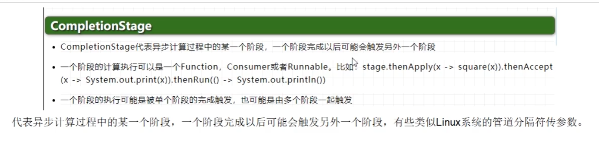


### 2.2.2、CompletableFuture的四大静态方法


```java
public static CompletableFuture<Void> runAsync(Runnable runnable) // 无返回值
public static CompletableFuture<Void> runAsync(Runnable runnable,
                                                   Executor executor)
    
public static <U> CompletableFuture<U> supplyAsync(Supplier<U> supplier)// 有返回值
public static <U> CompletableFuture<U> supplyAsync(Supplier<U> supplier,
                                                       Executor executor)

// 不指定线程，使用默认的线程池 ForkJoinPool
```


```java
public interface Supplier<T> {

    /**
     * Gets a result.
     *
     * @return a result
     */
    T get();
}
```


```java
CompletableFuture<Void> voidCompletableFuture = CompletableFuture.runAsync(()->{
    System.out.println("runAsync  runnable");
}); // Runnable 接口
ExecutorService executorService = Executors.newFixedThreadPool(5);
CompletableFuture<Void> voidCompletableFuture1 = CompletableFuture.runAsync(()->{// Runnable 接口
    System.out.println("runAsync  runnable");

}, executorService); // Runnable 接口, Executors线程池
executorService.shutdown();
```


```java
CompletableFuture<Object> objectCompletableFuture1 = CompletableFuture.supplyAsync(()->{
    return "hello CompletableFuture";
});
System.out.println(objectCompletableFuture1.get()); // 获取返回值
CompletableFuture<Object> objectCompletableFuture2 = CompletableFuture.supplyAsync(() -> {
    return "hello CompletableFuture";
},executorService); // 指定线程池
System.out.println(objectCompletableFuture2.get()); // 获取返回值
```


### 2.2.3、Code

```java
public CompletableFuture<T> whenComplete(
        BiConsumer<? super T, ? super Throwable> action)
    
public interface BiConsumer<T, U> 
    void accept(T t, U u);


```


```java
CompletableFuture<String> objectCompletableFuture;
try {
    objectCompletableFuture = CompletableFuture.supplyAsync(() -> {
        try {
            TimeUnit.SECONDS.sleep(5);
        } catch (InterruptedException e) {
            e.printStackTrace();
        }
        String result = "hello";
        return result;
    }, executorService).whenComplete((result, exception) -> { // 当任务完成时
        System.out.println(executorService);
        System.out.println(executorService);
        if (exception == null) { // 没有异常
            System.out.println("没有异常，得到结果");
            System.out.println(Thread.currentThread().getName() + ":whenComplete:" + result);
        }
    }).exceptionally(exception -> { // 异常处理
        System.out.println("异常");
        return null;
    });
} catch (Exception e) {
    e.printStackTrace();
} finally {
    executorService.shutdown();
}
```


### 2.2.4、join 获取返回值

```java
public static void main(String[] args) {
    CompletableFuture<String> stringCompletableFuture = CompletableFuture.supplyAsync(() -> {
        try {
            TimeUnit.SECONDS.sleep(5);
        } catch (InterruptedException e) {
            e.printStackTrace();
        }
        return "hello";
    });
    System.out.println(stringCompletableFuture.join()); // 获取返回值，没有异常
}
```


### 2.2.5、链式编程


```java
@AllArgsConstructor
@NoArgsConstructor
@Data
@Accessors(chain = true) // 链式
class Student {
    private String name;
    private Integer age;

    public static void main(String[] args) {
        Student student = new Student();
        student.setName("张三").setAge(18); // 链式编程
    }
}
```


### 2.2.6、CompletableFuture常用API

#### 2.2.6.1、获取结果和触发计算

```java
completableFuture.get(); // 抛出异常
completableFuture.get(2L, TimeUnit.SECONDS); // 超时时间
completableFuture.join(); // 等待结果 没有异常
completableFuture.getNow("dhf");  // 获取结果，没有结果时，返回默认值
```


```java
public boolean complete(T value) {
    boolean triggered = completeValue(value);
    postComplete();
    return triggered;
}
```

```java
boolean complete = completableFuture.complete("hello"); // 触发计算，打断get或join方法
```

```java
boolean complete = completableFuture.complete("hello"); // 触发计算，打断get或join方法
System.out.println(completableFuture.get()); // 获取的是 “hello”
```


#### 2.2.6.2、处理计算结果

```java
thenApply(Function<? super T,? extends U> fn)

    // 得到上一步的运算结果，进行 计算 返回
    
public <U> CompletableFuture<U> handle(
        BiFunction<? super T, Throwable, ? extends U> fn)
```


```java
// 2. 对计算结果进行处理
String completableFuture2 = CompletableFuture.supplyAsync(() -> {
    try {
        TimeUnit.SECONDS.sleep(3);
    } catch (InterruptedException e) {
        e.printStackTrace();
    }
    return "hello";
}).thenApply((result) -> {
    return result + 2;
}).get();
System.out.println(completableFuture2);
// thenApply由于相互依赖关系，当前步骤有异常就停
```


```java
val handle = CompletableFuture.supplyAsync(() -> {
    return "hello";
}).handle((result, exception) -> { // handle可以带这异常
    if (exception == null) {
        System.out.println(result);
    } else {
        exception.printStackTrace();
    }
    return "hello";
});
System.out.println(handle.get());

// 可以带着异常处理
```


#### 2.2.6.3、消费处理结果

```java
public CompletableFuture<Void> thenAccept(Consumer<? super T> action)
    // 消费结果，没有返回值

thenAccept() 任务A执行完后执行B，B需要A的结果
    
thenRun(Runnabler runnable)  任务A执行完后执行B，B不需要A的结果
    
thenApply(Function fn) 任务A执行完后执行B，B需要A的结果，B有返回值
```


```java
// 3 消费处理结果
        // null
System.out.println(CompletableFuture.supplyAsync(() -> "result").thenRun(()->{}).join());
        // null
System.out.println(CompletableFuture.supplyAsync(() -> "result").thenAccept(r->{}).join());
        // result
System.out.println(CompletableFuture.supplyAsync(() -> "result").thenApply(r->r).join());
```

备注

```java
thenRunAsync()  和 thenRun()区别

使用默认的线程池时：
    都会使用ForkJoinPool
    
当传入自定义线程池时：
thenRun()下一个任务和上一个任务使用的同一个线程池

thenRunAsync()下一个任务和上一个任务使用的不同的线程池
```


#### 2.2.6.4、对计算速度进行选择

```java
public <U> CompletableFuture<U> applyToEither(
    CompletionStage<? extends T> other, Function<? super T, U> fn) {
    return orApplyStage(null, other, fn);
}
```


```java
// 4 对计算速度进行选择

CompletableFuture<String> completableFuture1 = CompletableFuture.supplyAsync(() -> {
    return "playA";
});
CompletableFuture<String> completableFuture3 = CompletableFuture.supplyAsync(() -> "playB");
String winner = completableFuture1.applyToEither(completableFuture3, (result) -> {
    return result + " is win";
}).join();
```


#### 2.2.6.5、计算结果合并

```java
public <U,V> CompletableFuture<V> thenCombine(
        CompletionStage<? extends U> other,
        BiFunction<? super T,? super U,? extends V> fn) {
        return biApplyStage(null, other, fn);
    }
```

```java
// 5 对计算结果进行合并
        CompletableFuture<Integer> integerCompletableFuture = CompletableFuture.supplyAsync(() -> 1);
        CompletableFuture<Integer> integerCompletableFuture2 = CompletableFuture.supplyAsync(() -> 2);
        // 先完成的要等待后完成的结果
        Integer join = integerCompletableFuture.thenCombine(integerCompletableFuture2, (result, result2) -> {
            return result + result2;
        }).join();
        System.out.println(join);
```


# 3、线程锁


## 3.1、乐观锁和悲观锁

```
悲观锁：认为自己在使用数据的时候一定有别的线程来修改数据，因此在获取数据的时候会先加锁，确保数据不会被别的线程修改。
	synchronized关键字和Lock的实现类都是悲观锁
	
	适合写操作多的场景
```


```
乐观锁适合读操作多的场景
```


## 3.2、为什么任何一个对象都可以成为一个锁


> ```
> Object.java -> ObjectMonitor.java(cpp) -> VmObject.java(cpp)
> ```


```
每个对象都带有一个对象监视器，每一个被锁住的对象都会和monitor关联起来
```


## 3.3、公平锁和非公平锁

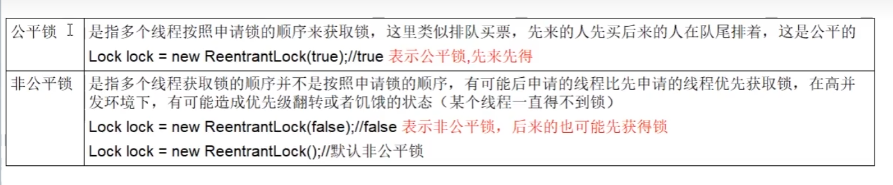


```java
class SaleTicketDemo {
    static class Ticket { // 资源类
        private int ticket = 50;
        ReentrantLock lock = new ReentrantLock(); // 非公平锁
        ReentrantLock lock1 = new ReentrantLock(true); // 公平锁
        public void sale(){
            while (true){
                lock.lock();
                try {
                    if (ticket > 0) {
                        System.out.println(Thread.currentThread().getName() + "正在卖第" + (ticket--) + "张票");
                        Thread.sleep(100);
                    }else {
                        System.out.println("票已卖完");
                        break;
                    }
                } catch (InterruptedException e) {
                    e.printStackTrace();
                } finally {
                    lock.unlock();
                }
            }
        }
    }
    static ExecutorService executorService = Executors.newFixedThreadPool(5);
    public static void main(String[] args) {
        Ticket ticket = new Ticket();
        for (int i = 0; i < 3; i++) { // 三个线程卖票
            executorService.execute(() -> {
                ticket.sale(); // 开始买票
            });
        }
    }
}
```


```
1
恢复挂起的线程到真正锁的获取还是有时间差的，从开发人员来看这个时间微乎其微，但是从CPU的角度来看，这个时间差存在的还是很明显的。所以非公平锁能更充分的利用CPU的时间片，尽量减少CPU空闲状态时间。
2
使用多线程很重要的考量点是线程切换的开销，当采用非公平锁时，当1个线程请求雠获取同步状态，然后释放同步状态，所以刚释放锁的线程在此刻再次获取同步状态的概率就变得非常大，所以就减少了线程的开销。

```


## 3.4、可重入锁（递归锁）


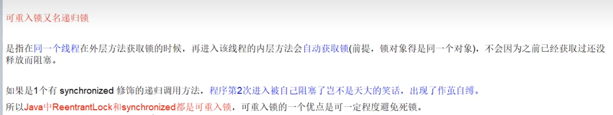


```java
// 可重用锁
class RecursionLock {
    static ExecutorService executorService = Executors.newFixedThreadPool(5);
    public static void main(String[] args) {
        final Object o = new Object();
        executorService.execute(()->{
            synchronized (o) {
                System.out.println("线程1");
                synchronized (o){
                    System.out.println("doSomeThing");
                }
            }
        }); 
    }
}
```


### 3.4.1、synchronized可重用锁机制


### 3.4.2、显式可重用锁锁Lock

> ```
> 调用几次，就要释放几次
> ```


```java
ReentrantLock lock = new ReentrantLock();
        executorService.execute(() -> {
            lock.lock(); // 计数器 +1 
            try {
                System.out.println("dosomething");
                lock.lock(); // 计数器 +1
                try {
                    System.out.println("dosome");
                }finally {
                    lock.unlock(); // 计数器 -1 
                }
            }finally {
                lock.unlock(); // 计数器 -1
            }

        });
```


## 3.5、死锁


排查死锁

```
jsp -l    # 查看java进程 java 	ps -ef

jstack 进程号 # 查看堆栈信息
```

```
jconsole
```


## 3.6、写锁（独占锁）/读锁（共享锁）

## 3.7、自旋锁SpinLock

## 3.8、无锁->独占锁->读写锁->邮戳所

## 3.9、无锁->偏向锁->轻量锁->重量所


# 4、LockSupport与线程中断


## 4.1、中断机制


## 4.2、中断三大方法

```
void interrupt() 中断这个线程
	仅仅设置线程的中断状态为true，发起一个协商而不会立刻停止线程
	
static boolean interrupted()  测试当前线程是否中断。
	判断是否被中断 并 清除当前中断状态（设置为false）
	
boolean isInterrupted()  测试这个线程是否被中断。
	检查中断标志
```


### 4.2.1、如何停止中断运行的线程

1、volatile关键字

```java
public class ThreadInterrupt {
    private volatile static boolean flag = true;
    private static ExecutorService executor = Executors.newFixedThreadPool(10);
    public static void main(String[] args) {
        executor.execute(() -> {
            while (flag) {
                System.out.println(Thread.currentThread().getName() + "正在执行");
                try {
                    Thread.sleep(1000);
                } catch (InterruptedException e) {
                    e.printStackTrace();
                }
            }
            System.out.println(Thread.currentThread().getName() + "结束执行"+"flag:"+flag);
        });

        executor.execute(() -> {
            try {
                TimeUnit.SECONDS.sleep(2);
            } catch (InterruptedException e) {
                e.printStackTrace();
            }
            flag = false; // 停止执行
        });

    }
}
```


2、AtomicBoolean

```java
class AtomicBooleanDemo { // 原子布尔型
    private static AtomicBoolean flag = new AtomicBoolean(true);
    private static ExecutorService executor = Executors.newFixedThreadPool(10);
    public static void main(String[] args) {
        executor.execute(() -> {
            while (flag.get()) {
                System.out.println(Thread.currentThread().getName() + "正在执行");
                try {
                    Thread.sleep(1000);
                } catch (InterruptedException e) {
                    e.printStackTrace();
                }
            }
            System.out.println(Thread.currentThread().getName() + "结束执行"+"flag:"+flag);
        });

        executor.execute(() -> {
            try {
                TimeUnit.SECONDS.sleep(2);
            } catch (InterruptedException e) {
                e.printStackTrace();
            }
            flag.set(false); // 停止执行
        });
    }
}
```


3、Thread自带API（interrupt，... ）


```java
public static void main(String[] args) throws Exception {
    Thread t1 = new Thread(() -> {
        while (true) {
            if (Thread.currentThread().isInterrupted()) { // 检查线程是否被中断
                System.out.println("线程被中断");
                break;
            }
            System.out.println("线程1执行" + Thread.currentThread().isInterrupted());
        }
        System.out.println("线程1结束执行");
    }, "t1");
    t1.start(); // 线程一开启
    new Thread(t1::interrupt).start(); // 线程二开启，并且协商中断线程一

    TimeUnit.SECONDS.sleep(2);
}
```

备注

```apl
interrupt() 中断线程，如果线程处于阻塞状态(sleep，wait,join等状态)
会打断线程的阻塞状态， 中断状态被清除，  抛出InterruptedException

中断不活动的线程没有任何作用
```


### 4.2.2、interrupt会立即中断线程吗


```apl
实例方法 interrupt()仅仅是设置线程的中断状态设置为false，不会停止线程
```


## 4.3、LockSupport


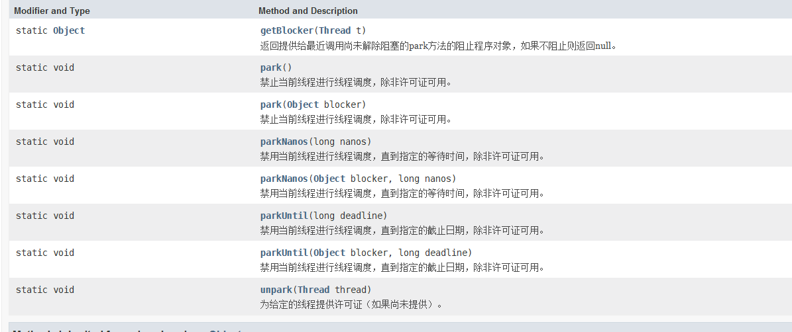

```apl
构造私有
```

```
LockSupport可以阻塞当前线程，并且可以唤醒指定线程。
```


### 4.3.1、awit，notify

```
wait和notify不能脱离synchronized使用
必须先 notify 后 wait
```


```java
public static void main(String[] args) throws InterruptedException {
    Object objectLock = new Object();
    new Thread(() -> {
        synchronized (objectLock){
            try {
                objectLock.wait();
            } catch (InterruptedException e) {
                e.printStackTrace();
            }
            System.out.println("线程1开始等待");
            System.out.println("线程1结束等待");
        }
    },"t1").start();
    TimeUnit.SECONDS.sleep(2);
    new Thread(()->{
        synchronized (objectLock){
            objectLock.notify();
            System.out.println("线程2发出");
        }
    },"t2").start();
}
```


### 4.3.2、await、signal

```
java.util.concurrent.locks.Condition

Condition中的线程等待一定要放在锁块中
先await后signal
```


```java
public static void main(String[] args) throws InterruptedException {
    ReentrantLock lock = new ReentrantLock();
    Condition condition = lock.newCondition(); // 获取监视器
    new Thread(() -> {
        lock.lock(); // 获取锁
        try {
            System.out.println("线程1开始等待");
            condition.await(); // 等待
            System.out.println("线程1结束等待");
        } catch (InterruptedException e) {
            e.printStackTrace();
        } finally {
            lock.unlock(); // 释放锁
        }
    }, "t1").start();
    TimeUnit.SECONDS.sleep(2);
    new Thread(() -> {
        lock.lock();
        condition.signal();
        System.out.println("线程2发出");
        lock.unlock();
    }, "t2").start();
}
```


### 4.3.3、park等待，unpark唤醒

```
    这个类与每个使用它的线程相关联，一个许可证（在Semaphore类的意义上）。 如果许可证可用，则呼叫park将park返回，在此过程中消耗它; 否则可能会阻止。 致电unpark使许可证可用，如果尚不可用。 （与信号量不同，许可证不能累积，最多只有一个。）
```


```java
public static void park() {
    UNSAFE.park(false, 0L);
}

public static void unpark(Thread thread) {
        if (thread != null)
            UNSAFE.unpark(thread);
    }
```


```java
public static void main(String[] args) throws InterruptedException {
    val thread = new Thread(() -> {
        System.out.println("线程1开始等待");
        LockSupport.park(); // 阻塞当前线程
        System.out.println("线程1结束等待");
    }, "t1");
    thread.start();
    TimeUnit.SECONDS.sleep(2);
    new Thread(()->{
        System.out.println("线程2发出");
        LockSupport.unpark(thread); // 唤醒线程1
    },"t2").start();
}
```


```
1、无锁块要求
2、可以先唤醒unpark后等待park（提起买好通行证）
```


## 4.4、LockSupport


```java
public static void main(String[] args) throws InterruptedException {
    val thread = new Thread(() -> {
        System.out.println("线程1开始等待");
        LockSupport.park(); // 阻塞当前线程
        LockSupport.park();
        System.out.println("线程1结束等待");
    }, "t1");
    thread.start();
    TimeUnit.SECONDS.sleep(2);
    new Thread(()->{
        System.out.println("线程2发出");
        LockSupport.unpark(thread); // 唤醒线程1
        LockSupport.unpark(thread);
    },"t2").start();
}
```


```
会阻塞，多次的unpark并没有用，因为许可证最多只能有一个，不会累计
```


# 5、Java内存模型JMM


## 5.1、计算机硬件


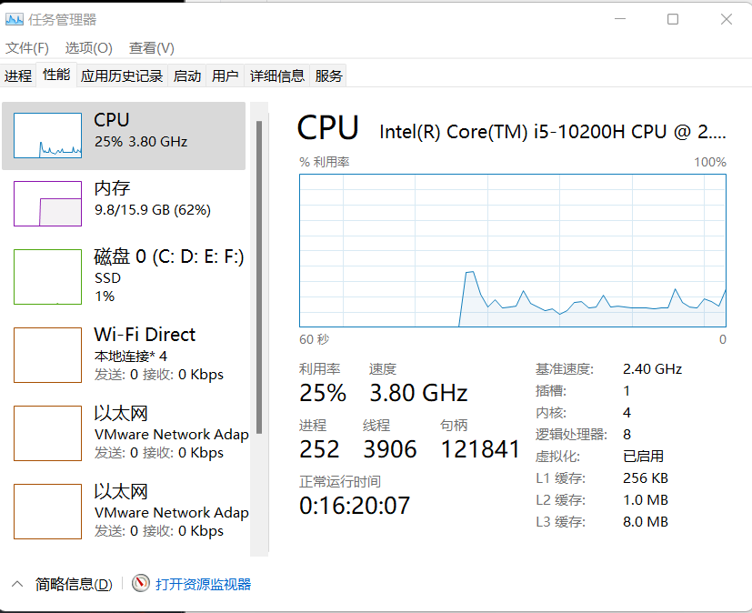


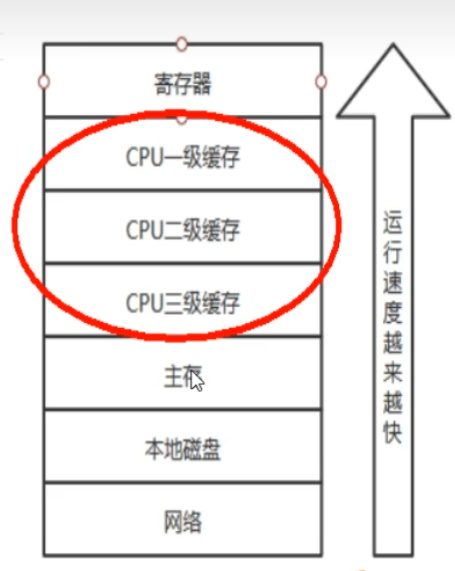


## 5.2、JMM（Java Memory Model）


```apl
  JMM(Java内存模型Java Memory Model，简称JMM)本身是一种抽象的概念并不真实存在它仅仅描述的是一组约定或规范，通过这组规范定义了程序中(尤其是多线程)各个变量的读写访问方式并决定一个线程对共享变量的写入何时以及如何变成对另一个线程可见，关键技术点都是围绕多线程的原子性、可见性和有序性展开的。I
原则:|
  JMM的关键技术点都是围绕多线程的  原子性、可见性和有序性   展开的
能干嘛?
  1、通过JMM来实现  线程 和 主内存 之间的抽象关系。·	
  2、屏蔽各个 硬件平台 和 操作系统 的内存访问差异以实现让Java程序在各种平台下都能达到一致的内存访问效果。

```


## 5.3、JMM三大特性

- 可见性：是指当一个线程修改了某一个共享变量的值，其他线程是否能够立即知道该变更，JMM规定了所有的变量都存储在主内存中.


```
系统主内存共享变量数据修改被写入的时机是不确定的，多线程并发下很可能出现"脏读"﹐所以每个线程都有自己的工作内存、线程自己的工作内存中保存了该线程使用到的变量的主内存副本拷贝，线程对变量的所有操作《（读取，赋值等）都必需在线程自己的工作内存中进行，而不能够直接读写主内存中的变量。不同线程之间也无法直接访问对方工作内存中的变量，线程间变量值的传递均需要通过主内存来完成
```


- 原子性：指一个操作是不可打断的，即多线程环境下，操作不能被其他线程干扰
- 有序性：对于一个线程的执行代码而言，我们总是习惯性认为代码的执行总是从上到下，有序执行。但为了提升性能，编译器和处理器通常会对指令序列进行重新排序。Java规范规定JVM线程内部维持顺序化语义，即只要程序的最终结果与它顺序化执行的结果相等，那么指令的执行顺序可以与代码顺序不一致，此过程叫指令的重排序。


```
优缺点
JVM能根据处理器特性（CPU多级缓存系统、多核处理器等）适当的对机器指令进行重排序，使机器指令能更符合CPU的执行特性，最大限度的发挥机器性能。但是，
指令重排可以保证串行语义一致，但没有义务保证多线程间的语义也一致(即可能产生"脏读")，简单说，两行以上不相干的代码在执行的时候有可能先执行的不是第一条，不见得是从上到下顺序执行，执行顺序会被优化。

```


## 5.4、缓存一致性


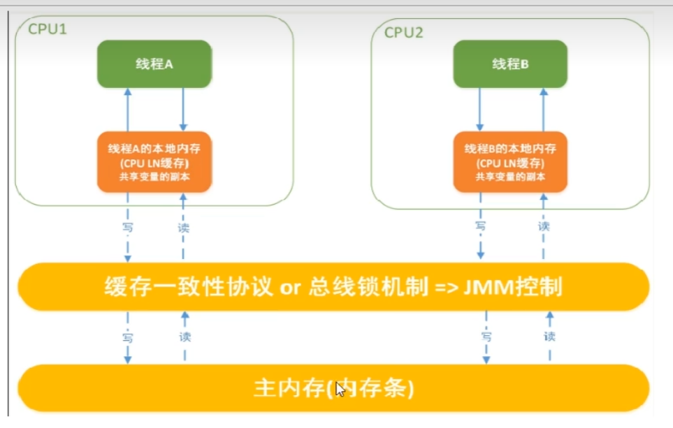


## 5.5、先行发生原则happens-before

1. 次序规则：一个线程内，按照代码顺序，写在前面的操作先行发生于写在后面的操作;
2. 锁定规则：一个unLock操作先行发生于后面((这里的“后面”是指时间上的先后))对同一个锁的lock操作;
3. volatile变量规则：对一个volatile变量的写操作先行发生于后面对这个变量的读操作，**前面的写对后面的读是可见的**，这里的“后面”同样是指时间上的先后。
4. 传递规则：如果操作A先行发生于操作B，而操作B又先行发生于操作c，则可以得出操作A先行发生于操作C;
5. 线程启动规则：Thread对象的start()方法先行发生于此线程的每一个动作
6. 线程中断规则：对线程interrupt()方法的调用先行发生于被中断线程的代码检测到中断事件的发生;
7. 线程终止规则：线程中的所有操作都先行发生于对此线程的终止检
   测，我们可以通过isAlive()等手段检测线程是否已经终止执行。
8. 对象方法：一个对象的初始化完成（构造函数执行结束）先行发生于它的finalize()方法的开始


# 6、volatile


## 6.1、volatile两大特点

1. 可见性
2. 有序性【禁重排】

【不支持原子性】

```
    当写一个volatile变量时，JMM会把该线程对应的本地内存中的共享变量值立即刷新回主内存中。
    当读一个volatile变量时，JMM会把该钱程对应的本地内存设置为无效，重新回到主内存中读取最新共享变量所以volatile的写内存语义是直接刷新到主内存中，读的内存语义是直接从主内存中读取。

```


## 6.2、内存屏障

```apl
    内存屏障（也称内存栅栏，屏障指令等，是一类同步屏障指令，是CPU或编译器在对内存随机访问的操作中的一个同步点，使得此点之前的所有读写操作都执行后才可以开始执行此点之后的操作)，避免代码重排序。内存屏障其实就是一种JVM指令，Java内存模型的重排规则会要求Java编译器在生成JVM指令时插入特定的内存屏障指令，通过这些内存屏障指令，volatile实现了Java内存模型中的可见性和有序性(禁重排)，但volatile无法保证原子性。
```

- 内存屏障之前的所有写操作都要回写到主内存，
- 内存屏障之后的所有读操作都能获得内存屏障之前的所有写操作的最新结果(实现了可见性)。


​     因此重排序时，不允许把内存屏障之后的指令重排序到内存屏障之前。一句话:对一个volatile变量的写,先行发生于任意后续对这个volatile变量的读，也叫写后读。


### 6.2.1、读屏障

​      在读指令之前插入读屏障，让工作内存或CPU高速缓存当中的缓存数据失效，重新回到主内存中获取最新数据


### 6.2.2、写屏障

​     在写指令之后插入写屏障，强制把写缓冲区的数据刷回到主内存中


### 6.2.3、屏障类型

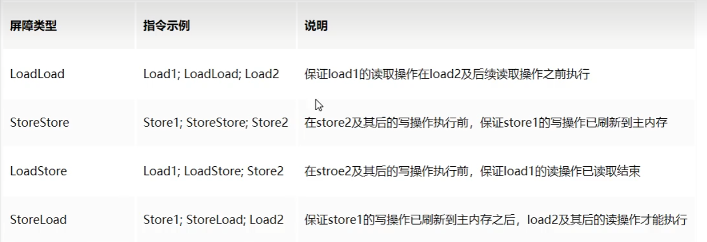


- 重排序

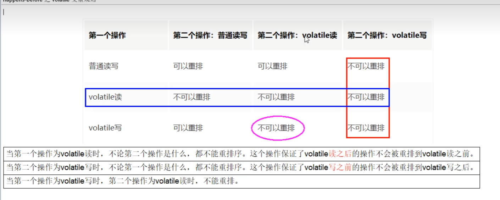


```java
 public void println(String x) {
	    synchronized (this) {
	        print(x);
	        newLine();
	    }
 }

// sout也会影响内存可见性
	1.上锁
    2.清空工作内存
    3.从主内存拷贝对象副本到工作内存
    4.执行代码
    5.刷新主内存数据
    6.释放锁
```


### 6.2.4、static变量读写过程


## 6.3、不保证原子性


```java
volatile static int num = 0;

    public static void main(String[] args) {
        for (int i = 0; i < 10; i++) {
            new Thread(() -> {
                for (int i1 = 0; i1 < 100; i1++) {
                    double random = Math.random();
                    try {
                        TimeUnit.MICROSECONDS.sleep((long) random);
                    } catch (InterruptedException e) {
                        e.printStackTrace();
                    }
                    num++;
                }
            }).start();
        }
        try {
            TimeUnit.SECONDS.sleep(1);
        } catch (InterruptedException e) {
            e.printStackTrace();
        }
        System.out.println(num);
    }
```


## 6.4、禁止指令重排


# 7、CAS


## 7.1、原子类


> ```
> java.util.concurrent.atomic
> ```


## 7.2、CAS简介


compare and swap的缩写，中文翻译成比较并交换,实现并发算法时常用到的一种技术。
它包含三个操作数——**内存位置、预期原值及更新值。**
执行CAS操作的时候，将内存位置的值与预期原值比较:

- 如果相匹配，那么处理器会自动将该位置值更新为新值，
- 如果不匹配，处理器不做任何操作，多个线程同时执行CAS操作只有一个会成功。


```java
public class CASDemo {
    public static void main(String[] args) {
        // 创建一个原子类型的变量
        AtomicInteger atomicInteger = new AtomicInteger();
        // public final boolean compareAndSet(int expect, int update)
        // expect : 期望的值  update : 更新的值
        boolean b = atomicInteger.compareAndSet(0, 2022);
        System.out.println(atomicInteger.get());
        // 第一次修改后，原来的值变成 2022 了，export = 5 ，return false 修改失败
        boolean b1 = atomicInteger.compareAndSet(5, 2023);
        System.out.println(atomicInteger.get());
    }
}
```


​        CAS是JDK提供的非阻塞原子性操作，它通过硬件保证了比较-更新的原子性。
它是非阻塞的且自身具有原子性，也就是说这玩意效率更高且通过硬件保证，说明这玩意更可靠。
​		CAS是一条CPU的原子指令(cmpxchg指令），不会造成所谓的数据不一致问题，Unsafe提供的CAS方法（如compareAndSwapXXX）底层实现即为CPU指令cmpxchg。
​		执行cmpxchg指令的时候，会判断当前系统是否为多核系统，如果是就给总线加锁，只有一个线程会对总线加锁成功，加锁成功之后会执行cas操作，也就是说CAS的原子性实际上是CPU实现独占的，比起用synchronized重量级锁，这里的排他时间要短很多，所以在多线程情况下性能会比较好。


## 7.3、CAS—UnSafe

// cas 底层是 unsafe

```java
unsafe.compareAndSwapInt(this, valueOffset, expect, update);
```


```java
public final native boolean compareAndSwapObject(Object var1, long var2, Object var4, Object var5);

public final native boolean compareAndSwapInt(Object var1, long var2, int var4, int var5);

public final native boolean compareAndSwapLong(Object var1, long var2, long var4, long var6);
```


```
var1：要操作的对象
var2：表示要操作对象属性地址的偏移量
var4：表示需要修改数据的期望值
var5/var6：表示要修改为的新值
```


```java
public class AtomicInteger extends Number implements java.io.Serializable {
    private static final long serialVersionUID = 6214790243416807050L;

    // setup to use Unsafe.compareAndSwapInt for updates
    private static final Unsafe unsafe = Unsafe.getUnsafe();
    private static final long valueOffset;
    private volatile int value;
```


当AtomicInteger类调用 getAndIncrement()方法时，会调用Unsafe中的getAndAddInt()

1. unsafe通过 getIntVolatile（）通过对象和偏移量获取内存中的值
2. 判断是否修改成功，如果期望值var5 和 内存中的实际值还一样，就用var5 + var4修改主内存中的值，否则重新读取主内存中的值（自旋），直到修改成功
3. 返回 主内存中的值（修改前的值，旧值）


## 7.4、原子引用 AtomicReference<<V>>

```java
public class AtomicReference<V> implements java.io.Serializable{
    // ... 
}
```


```java
public class AtomicUSer {
    public static void main(String[] args) {
        AtomicReference<User> userAtomicReference = new AtomicReference<>();
        User old = new User("张三", 18);
        userAtomicReference.set(old);

        boolean b = userAtomicReference.compareAndSet(old,new User("张三", 19));
        System.out.println(userAtomicReference.get());
        // 修改失败
        boolean v = userAtomicReference.compareAndSet(old, new User("张三", 20));
        System.out.println(userAtomicReference.get());
    }
}

@Data
@AllArgsConstructor
class User{
    private String name;
    private int age;
}
```


## 7.5、自旋锁spinlock

自旋锁(spinlock)
		CAS是实现自旋锁的基础，CAS利用CPU指令保证了操作的原子性，以达到锁的效果，至于自旋呢，看字面意思也很明白，自己旋转·是指尝试获取锁的线程不会立即阻塞，而是采用循环的方式去尝试获取锁，当线程发现锁被占用时，会不断循环判断锁的状态，直到获取。这样的好处是减少线程上下文切换的消耗，缺点是循环会消耗CPU


```java
public class SpinLockDemo {
    private AtomicReference<Thread> atomicReference = new AtomicReference<>();
    public void lock(){ // 获取锁
        // 获取当前线程
        Thread currentThread = Thread.currentThread();
        // 如果当前为空，直接获取锁，否则自选
        while (!atomicReference.compareAndSet(null,currentThread)){
            // 一直获取
        }
    }
    public void unlock(){ // 释放锁
        Thread thread = Thread.currentThread();
        atomicReference.compareAndSet(thread,null);
    }
    public static void main(String[] args) {
        SpinLockDemo lock = new SpinLockDemo();
        new Thread(()->{
            lock.lock();
            try {
                System.out.println("A获取锁");
                Thread.sleep(5000);
            } catch (InterruptedException e) {
                e.printStackTrace();
            }
            lock.unlock();
            System.out.println("A释放锁");
        },"A").start();

        new  Thread(()->{
            lock.lock();
            try {
                System.out.println("B获取锁");
                Thread.sleep(5000);
            } catch (InterruptedException e) {
                e.printStackTrace();
            }
            lock.unlock();
            System.out.println("B释放锁");
        },"B").start();
    }
}
```


## 7.6、CAS缺点

### 7.6.1、循环时间长，开销大

```
如果一个线程一直枪锁失败，一直进行自旋，会给CPU带来很大开销
```


### 7.6.2、ABA问题

​		CAS算法实现一个重要前提需要取出内存中某时刻的数据并在当下时刻比较并替换，那么在这个时间差类会导致数据的变化。
​		比如说一个线程1从内存位置V中取出A，这时候另一个线程2也从内存中取出A，并且线程2进行了一些操作将值变成了B，然后线程2又将V位置的数据变成A，这时候线程1进行CAS操作发现内存中仍然是A，预期OK，然后线程1操作成功。
​		尽管线程1的CAS操作成功，但是不代表这个过程就是没有问题的。


#### 7.6.2.1 解决ABA问题 AtomicStampedReference<V>

 

```
使用版本号解决ABA问题
```


```java
public AtomicStampedReference(V initialRef, int initialStamp) {
    pair = Pair.of(initialRef, initialStamp);
}

// initialStamp 版本号
```


```java
public class ABADemo {
    public static void main(String[] args) {
        Book book = new Book("疯狂Java讲义");
        // 初始化，(对象，版本号)
        AtomicStampedReference<Book> bookAtomicStampedReference = new AtomicStampedReference<Book>(book,1);
        int stamp = bookAtomicStampedReference.getStamp(); // 获取当前版本号
        System.out.println(bookAtomicStampedReference.getReference()+" "+stamp);

        Book java = new Book("java");
        // 更新，并且更新版本号
        boolean b = bookAtomicStampedReference.compareAndSet(book, java, bookAtomicStampedReference.getStamp(), bookAtomicStampedReference.getStamp() + 1);
        System.out.println(bookAtomicStampedReference.getReference()+" "+bookAtomicStampedReference.getStamp());

        // 换回来
        boolean b1 = bookAtomicStampedReference.compareAndSet(java, book, bookAtomicStampedReference.getStamp(), bookAtomicStampedReference.getStamp()+1);
        System.out.println(bookAtomicStampedReference.getReference()+" "+bookAtomicStampedReference.getStamp());
    }
}
@AllArgsConstructor
@ToString
class Book{
    public String name;
}
```


# 8、原子类

[java8PAI文档](https://www.matools.com/api/java8)

## 8.1、基本类型原子类

```java
AtomicInteger
AtomicLong	
AtomicBoolean
```

常用api

``` java
get() // 获取当前值
getAndIncrement() // 为当前值 + 1 ，并且返回旧值
```


```java
public class AtomicIntegerDemo {
    public static void main(String[] args) throws InterruptedException {
        int threadSize = 50;
        AtomicInteger atomicInteger = new AtomicInteger(0);
        CountDownLatch countDownLatch = new CountDownLatch(threadSize); // 计数，当所有线程都执行完毕后，才执行后面的其他内容
        for (int i = 0; i < threadSize; i++) {
            new Thread(() -> {
                for (int j = 0; j < 10; j++) {
                    atomicInteger.getAndIncrement();
                }
                // 每个线程做完
                countDownLatch.countDown();
            }).start();
        }
        countDownLatch.await();
        System.out.println(atomicInteger.get());
    }
}
```


## 8.2、数组类型原子类

```
AtomicIntegerArray

AtomicLongArray

AtomicReferenceArray
```


```java
public class AtomicArrayDemo {
    public static void main(String[] args) {
        AtomicIntegerArray atomicIntegerArray = new AtomicIntegerArray(new int[]{1,2,3,4,5});
        for (int i = 0; i < atomicIntegerArray.length(); i++) {
            System.out.println(atomicIntegerArray.get(i));
        }
        int andSet = atomicIntegerArray.getAndSet(0, 1022); // 第一个参数是下标
        System.out.println(andSet);
        System.out.println(atomicIntegerArray.get(0)); // 1022
        int andIncrement = atomicIntegerArray.getAndIncrement(0);
        System.out.println(atomicIntegerArray.get(0)); // 1023
    }
}
```


## 8.3、引用类型原子类

```
AtomicReference // 原子引用
AtomicStampedReference // 带时间戳(版本号) ABA问题
AtomicMarkableReference // 带标记位的引用类型

/*
* AtomicStampedReference 修改 根据版本号 version + 1
* AtomicMarkableReference  是否修改过  true | false 适用于资源只操作一次的
*/
```


```java
public class AtomicReferenceDemo {
    static AtomicMarkableReference<Integer> reference = new AtomicMarkableReference<>(0,false);
    public static void main(String[] args) throws InterruptedException {
        new Thread(()->{
            boolean marked = reference.isMarked();
            try {
                Thread.sleep(100);
            } catch (InterruptedException e) {
                e.printStackTrace();
            }
            boolean b = reference.compareAndSet(0, 1, marked, !marked);
            System.out.println(Thread.currentThread().getName()+"\t"+marked+"\t"+b);
            },"t1").start();
        new Thread(()->{
            boolean marked = reference.isMarked();
            System.out.println(Thread.currentThread().getName()+"\t"+marked);
            boolean b = reference.compareAndSet(0, 2, marked, !marked); // 是否修改成功
            System.out.println(Thread.currentThread().getName()+"\t"+marked+"\t"+b);
        },"t2").start();
        Thread.sleep(1000);
        System.out.println(reference.getReference());
    }
}
```


## 8.4、对象属性修改原子类


```
AtomicIntegerFieldUpdater
// 以线程安全的方式去操作非线程安全类的某些字段
AtomicLongFieldUpdater

AtomicReferenceFieldUpdater
```

**使用要求**

- 因为对象的属性修改类型原子类都是抽象类，所以每次使用都必须
  使用静态方法newUpdater()创建一个更新器，并且需要设置想要更新的类和属性
- 更新的对象必须使用public volatile修饰
- `基于反射的实用程序，可以对指定类的指定的volatile引用字段进行原子更新`

```java
public class AtomicFieldUpdater {
    public static volatile User user = new User("张三", 0);

    public static void main(String[] args) throws Exception {
        //修改年龄
        AtomicIntegerFieldUpdater<User> atomicIntegerFieldUpdater =
                AtomicIntegerFieldUpdater.newUpdater(User.class, "age");
        CountDownLatch countDownLatch = new CountDownLatch(50);
        for (int i = 0; i < 50; i++) {
            new Thread(() -> {
                for (int i1 = 0; i1 < 10; i1++) {
                    atomicIntegerFieldUpdater.getAndIncrement(user);
                }
                countDownLatch.countDown();
            }).start();
        }
        countDownLatch.await();
        System.out.println(user.getAge());
    }
}

@Data
@AllArgsConstructor
@NoArgsConstructor
class User {
    private String name;
    public volatile int age;
}
```


AtomicReferenceFieldUpdater

```java
class Res{
    public volatile Boolean flag = false;
}
class Demo2{
    public static void main(String[] args) {
        Res res = new Res();
        AtomicReferenceFieldUpdater<Res,Boolean> reference =
                AtomicReferenceFieldUpdater.newUpdater(Res.class,Boolean.class,"flag");
        //public abstract boolean compareAndSet(T obj, V expect, V update);
        boolean b = reference.compareAndSet(res, false, true);
        System.out.println(b+"\t"+res.flag);
    }
}
```


## 8.5、原子操作增强类


```java
DoubleAccumulator
DoubleAdder
LongAccumulator
LongAdder
```

### 8.5.1、LongAdder

​		这个类是通常优选[`AtomicLong`](https://www.matools.com/file/manual/jdk_api_1.8_google/java/util/concurrent/atomic/AtomicLong.html)当多个线程更新时使用，用于诸如收集统计信息，不用于细粒度同步控制的共同总和。 在低更新争议下，这两类具有相似的特征。 但是，在高度争议的情况下，这一类的预期吞吐量明显高于牺牲更高的空间消耗。


| Modifier and Type | Method and Description                                       |
| :---------------- | :----------------------------------------------------------- |
| `void`            | `add(long x)`添加给定值。                                    |
| `void`            | `decrement()`相当于 `add(-1)` 。                             |
| `double`          | `doubleValue()`返回 [`sum()`](https://www.matools.com/file/manual/jdk_api_1.8_google/java/util/concurrent/atomic/LongAdder.html#sum--)为 `double`一个宽元转换后。 |
| `float`           | `floatValue()`返回 [`sum()`](https://www.matools.com/file/manual/jdk_api_1.8_google/java/util/concurrent/atomic/LongAdder.html#sum--)为 `float`一个宽元转换后。 |
| `void`            | `increment()`相当于 `add(1)` 。                              |
| `int`             | `intValue()`在 [缩小原始](https://www.matools.com/file/manual/jdk_api_1.8_google/java/util/concurrent/atomic/LongAdder.html#sum--) `int`后返回 [`sum()`](https://www.matools.com/file/manual/jdk_api_1.8_google/java/util/concurrent/atomic/LongAdder.html#sum--)作为int。 |
| `long`            | `longValue()`相当于 [`sum()`](https://www.matools.com/file/manual/jdk_api_1.8_google/java/util/concurrent/atomic/LongAdder.html#sum--) 。 |
| `void`            | `reset()`将保持总和的变量重置为零。                          |
| `long`            | `sum()`返回当前总和。                                        |
| `long`            | `sumThenReset()`相当于 [`sum()`](https://www.matools.com/file/manual/jdk_api_1.8_google/java/util/concurrent/atomic/LongAdder.html#sum--)后跟 [`reset()`](https://www.matools.com/file/manual/jdk_api_1.8_google/java/util/concurrent/atomic/LongAdder.html#reset--) 。 |
| `String`          | `toString()`返回 `sum()`的String表示 [形式](https://www.matools.com/file/manual/jdk_api_1.8_google/java/util/concurrent/atomic/LongAdder.html#sum--) |


```java
public class AdderDemo {
    public static void main(String[] args) {
        LongAdder longAdder = new LongAdder(); // 创建一个初始为 0 的累加器
        longAdder.increment();// + 1
        longAdder.increment();// + 1
        longAdder.add(10);// + 10
        System.out.println(longAdder.floatValue()); // 返回float 12.0
        System.out.println(longAdder.longValue()); // 相当于 sum()  12
        System.out.println(longAdder.sum());// 返回当前总和  12
        System.out.println(longAdder.sumThenReset());//重置为0  12
        System.out.println(longAdder.longValue()); // 0

    }
}
```


### 8.5.2、LongAccumulator

```java
LongAccumulator(LongBinaryOperator accumulatorFunction, long identity)
```

使用给定的累加器函数和identity元素创建一个新的实例。


| Modifier and Type | Method and Description                                       |
| :---------------- | :----------------------------------------------------------- |
| `void`            | `accumulate(long x)`具有给定值的更新。                       |
| `double`          | `doubleValue()`返回 [current value](https://www.matools.com/file/manual/jdk_api_1.8_google/java/util/concurrent/atomic/LongAccumulator.html#get--)为 `double`一个宽元转换后。 |
| `float`           | `floatValue()`返回 [current value](https://www.matools.com/file/manual/jdk_api_1.8_google/java/util/concurrent/atomic/LongAccumulator.html#get--)为 `float`一个宽元转换后。 |
| `long`            | `get()`返回当前值。                                          |
| `long`            | `getThenReset()`相当于 [`get()`](https://www.matools.com/file/manual/jdk_api_1.8_google/java/util/concurrent/atomic/LongAccumulator.html#get--)其次是 [`reset()`](https://www.matools.com/file/manual/jdk_api_1.8_google/java/util/concurrent/atomic/LongAccumulator.html#reset--) 。 |
| `int`             | `intValue()`在 [缩小原始](https://www.matools.com/file/manual/jdk_api_1.8_google/java/util/concurrent/atomic/LongAccumulator.html#get--) `int`后返回 [current value](https://www.matools.com/file/manual/jdk_api_1.8_google/java/util/concurrent/atomic/LongAccumulator.html#get--)作为int。 |
| `long`            | `longValue()`相当于 [`get()`](https://www.matools.com/file/manual/jdk_api_1.8_google/java/util/concurrent/atomic/LongAccumulator.html#get--) 。 |
| `void`            | `reset()`重置维持更新到标识值的变量。                        |
| `String`          | `toString()`返回当前值的String表示形式。                     |


```java
public class LongAccumulatorDemo {
    public static void main(String[] args) {
        LongAccumulator longAccumulator = new LongAccumulator(new LongBinaryOperator() {
            @Override
            public long applyAsLong(long left, long right) {
                // 累加器的累加方法 left 当前值  right 增加的值
                return left + right;
            }
        }, 0); // 初始值为 0
        longAccumulator.accumulate(1);// + 1    1
        longAccumulator.accumulate(2);// + 2    3
        System.out.println(longAccumulator.get()); // 返回当前总和  3
    }
}
```


## 8.6、LongAdder 高性能分析


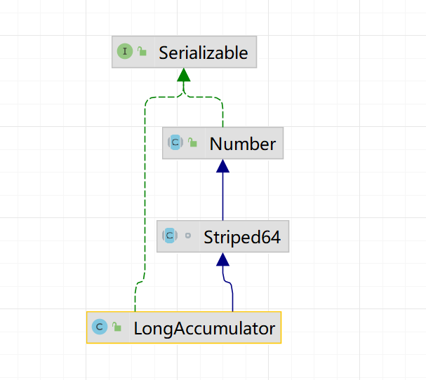


### 8.6.1、前置  Striped64

```java

    @sun.misc.Contended static final class Cell {
        volatile long value;
        Cell(long x) { value = x; }
        final boolean cas(long cmp, long val) {
            return UNSAFE.compareAndSwapLong(this, valueOffset, cmp, val);
        }

        private static final sun.misc.Unsafe UNSAFE;
        private static final long valueOffset;
        static {
            try {
                UNSAFE = sun.misc.Unsafe.getUnsafe();
                Class<?> ak = Cell.class;
                valueOffset = UNSAFE.objectFieldOffset
                    (ak.getDeclaredField("value"));
            } catch (Exception e) {
                throw new Error(e);
            }
        }
    }

    /** CPU数量，cells[]的最大长度 */
    static final int NCPU = Runtime.getRuntime().availableProcessors();

    /**
     * 数组，大小为 2 的幂.
     */
    transient volatile Cell[] cells;

    /**
     * Base value, used mainly when there is no contention, but also as
     * a fallback during table initialization races. Updated via CAS.
     */
    transient volatile long base;
    // 创建或者扩容cells数组时使用的自旋锁变量跳转单元格大小
    transient volatile int cellsBusy;
```


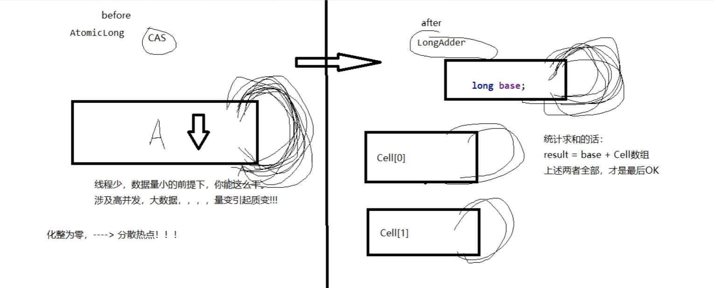


- LongAdder的基本思路就是分散热点，将value值分散到一个Cell数组中，不同线程会命中到数组的不同槽中，各个线程只对自己槽中的那个值进行CAS操作，这样热点就被分散了，冲突的概率就小很多。如果要获取真正的long值，只要将各个槽中的变量值累加返回。
- sum()会将所有Cell数组中的value和base累加作为返回值，核心的思想就是将之前AtomicLong一个rvalue的更新压力分散到多个vaue中去，从而降级更新热点。


### 8.6.2、LongAdder源码分析

```java
/**
 * Equivalent to {@code add(1)}.
 */
public void increment() {
    add(1L);
}

/**
 * Equivalent to {@code add(-1)}.
 */
public void decrement() {
    add(-1L);
}
final boolean casBase(long cmp, long val) {
        return UNSAFE.compareAndSwapLong(this, BASE, cmp, val);
    }
public void add(long x) {
    // as 表示 cells
    // b 表示 base 值
    // v 表示期望值
    // m 表示数组长度
    // a 表示当前cell位置
    Cell[] as; long b, v; int m; Cell a;
    // (as = cells) != null 是多线程争抢的话， true，无争抢，false
    // !casBase(b = base, b + x) 争抢，true，无争抢cas成功，false，结束了，下面不执行
    if ((as = cells) != null || !casBase(b = base, b + x)) {
        // 有争抢进入 ...
        // 根据有咩有冲突进行扩容，默认没用冲突
        boolean uncontended = true;
        if (as == null || (m = as.length - 1) < 0 || //刚开始，as == null
            (a = as[getProbe() & m]) == null || // 初始化后的cells，如果a为null
            !(uncontended = a.cas(v = a.value, v + x))) // 对a位置继续做cas，不扩容
            longAccumulate(x, null, uncontended);
    }
}


final void longAccumulate(long x, LongBinaryOperator fn,
                              boolean wasUncontended) {
        int h;
        if ((h = getProbe()) == 0) {
            ThreadLocalRandom.current(); // 强制初始化force initialization
            h = getProbe();
            wasUncontended = true;
        }
        boolean collide = false;                // True if last slot nonempty
        for (;;) {
            Cell[] as; Cell a; int n; long v;
            // 已经初始化
            if ((as = cells) != null && (n = as.length) > 0) {
                if ((a = as[(n - 1) & h]) == null) {
                    if (cellsBusy == 0) {       // Try to attach new Cell
                        Cell r = new Cell(x);   // Optimistically create
                        if (cellsBusy == 0 && casCellsBusy()) {
                            boolean created = false;
                            try {               // Recheck under lock
                                Cell[] rs; int m, j;
                                if ((rs = cells) != null &&
                                    (m = rs.length) > 0 &&
                                    rs[j = (m - 1) & h] == null) {
                                    rs[j] = r;
                                    created = true;
                                }
                            } finally {
                                cellsBusy = 0;
                            }
                            if (created)
                                break;
                            continue;           // Slot is now non-empty
                        }
                    }
                    collide = false;
                }
                else if (!wasUncontended)       // CAS already known to fail
                    wasUncontended = true;      // Continue after rehash
                else if (a.cas(v = a.value, ((fn == null) ? v + x :
                                             fn.applyAsLong(v, x))))
                    break;
                else if (n >= NCPU || cells != as)
                    collide = false;            // At max size or stale
                else if (!collide)
                    collide = true;
                else if (cellsBusy == 0 && casCellsBusy()) {
                    try {
                        if (cells == as) {      // Expand table unless stale
                            Cell[] rs = new Cell[n << 1];
                            for (int i = 0; i < n; ++i)
                                rs[i] = as[i];
                            cells = rs;
                        }
                    } finally {
                        cellsBusy = 0;
                    }
                    collide = false;
                    continue;                   // Retry with expanded table
                }
                h = advanceProbe(h);
            }
            // 进行初始化
            // cellsBusy 0 表示无锁，
            else if (cellsBusy == 0 && cells == as && casCellsBusy()) {
                boolean init = false;
                try { // Initialize table 初始化table
                    if (cells == as) {
                        Cell[] rs = new Cell[2]; // 新建
                        rs[h & 1] = new Cell(x);
                        cells = rs;
                        init = true;
                    }
                } finally {
                    cellsBusy = 0;
                }
                if (init)
                    break;
            }
            else if (casBase(v = base, ((fn == null) ? v + x :
                                        fn.applyAsLong(v, x))))
                break;                          // Fall back on using base
        }
    }
```


1. 当无线程竞争时，直接更新base值
2. 更新base失败时，新建一个Cell[] cells
3. 当多个线程竞争同一个cell时，就进行扩容


# 9、ThreadLocal

`这个类提供线程局部变量。 这些变量与其正常的对应方式不同，因为访问一个的每个线程（通过其`get`或`set`方法）都有自己独立初始化的变量副本。 `ThreadLocal`实例通常是希望将状态与线程关联的类中的私有静态字段（例如，用户ID或事务ID）。`


## 9.1、简单api

| Modifier and Type           | Method and Description                                       |
| :-------------------------- | :----------------------------------------------------------- |
| `T`                         | `get()`返回当前线程的此线程局部变量的副本中的值。            |
| `protected T`               | `initialValue()`返回此线程局部变量的当前线程的“初始值”。     |
| `void`                      | `remove()`删除此线程局部变量的当前线程的值。                 |
| `void`                      | `set(T value)`将当前线程的此线程局部变量的副本设置为指定的值。 |
| `static <S> ThreadLocal<S>` | `withInitial(Supplier<? extends S> supplier)`创建线程局部变量。 |


```java
class House{ // 资源类
    private LongAdder salve = new LongAdder();
    public synchronized void add(){ // 售卖
        salve.increment(); // + 1
    }
    public long get(){
        return salve.sum();
    }
//    ThreadLocal<Integer> salveCount = new ThreadLocal<Integer>(){
//        @Override
//        protected Integer initialValue(){ // 设置初始值
//            return 0;
//        }
//    };
    ThreadLocal<Integer> salveCount = ThreadLocal.withInitial(() -> { // 设置初始值
        return 0;
    });
    public void addSalve(){
        salveCount.set(salveCount.get() + 1);
    }
}
public class ThreadLocalDemo {
    public static void main(String[] args) throws InterruptedException {
        extracted1();
    }
    // 每个线程的销售额度
    private static void extracted1() throws InterruptedException {
        House house = new House();
        CountDownLatch countDownLatch = new CountDownLatch(5);
        for (int i = 0; i < 5; i++) {
            new Thread(() -> {
                int i1 = new Random().nextInt(5);
                for (int i2 = 0; i2 < i1; i2++) {
                    house.add();
                    house.addSalve();
                }
                System.out.println(Thread.currentThread().getName()+"  卖出  " + house.salveCount.get());
                countDownLatch.countDown();
            }).start();
        }
        countDownLatch.await();
        System.out.println("共计 "+house.get());
    }

    // 需求一、一共销售多少房子(所以线程的和)
    private static void extracted() throws InterruptedException {
        House house = new House();
        CountDownLatch countDownLatch = new CountDownLatch(5);
        for (int i = 0; i < 5; i++) {
            new Thread(() -> {
                int i1 = new Random().nextInt(5);
                System.out.println(i1);
                for (int i2 = 0; i2 < i1; i2++) {
                    house.add();
                }
                countDownLatch.countDown();
            }).start();
        }
        countDownLatch.await();
        System.out.println("共计 "+house.get());
    }
}
```


## 9.2、remove使用

```
【强制】必须回收自定义的ThreadLocal 变量，尤其在线程池场景下，线程经常会被复用，如果不清理自定义的 ThreadLocal变量，可能会影响后续业务逻辑和造成内存泄露等问题。尽量在代理中使用
try-finally块进行回收。
```


```java
class MyData{
    public Integer get(){
        return threadLocal.get();
    }
    ThreadLocal<Integer> threadLocal = ThreadLocal.withInitial(()->0);
    public void add(){
        threadLocal.set(threadLocal.get() + 1);
    }
}

/**
 * 【强制】必须回收自定义的ThreadLocal 变量，尤其在线程池场景下，线程经常会被复用，
 * 如果不清理自定义的 ThreadLocal变量，可能会影响后续业务逻辑和造成内存泄露等问题。尽量在代理中使用
 * try-finally块进行回收。
 */
public class ThreadLocalDemo2 {
    public static void main(String[] args) {
        MyData myData = new MyData();
        ThreadPoolExecutor poolExecutor = new ThreadPoolExecutor(5, 10, 3L, TimeUnit.SECONDS,
                new LinkedBlockingDeque<>(10), Executors.defaultThreadFactory(),
                new ThreadPoolExecutor.AbortPolicy());
        try {
            for (int i = 0; i < 10; i++) {
                poolExecutor.execute(() -> {
                    Integer before = myData.get();
                    myData.add();
                    Integer after = myData.get();
                    System.out.println(Thread.currentThread().getName()+"\tbefore: "+before+"\tafter: "+after);
                });
            }

        }catch (Exception e){
            e.printStackTrace();
        }finally {
            poolExecutor.shutdown();
        }
    }
}
```

结果：

pool-1-thread-2	before: 0	after: 1
pool-1-thread-3	before: 0	after: 1
pool-1-thread-2	before: 1	after: 2
pool-1-thread-4	before: 0	after: 1
pool-1-thread-5	before: 0	after: 1
pool-1-thread-1	before: 0	after: 1
pool-1-thread-5	before: 1	after: 2
pool-1-thread-2	before: 2	after: 3
pool-1-thread-4	before: 1	after: 2
pool-1-thread-3	before: 1	after: 2

Process finished with exit code 0


```
出现问题原因：线程池的线程进行了复用，上次的数据没remove，从而影响到这次
```


## 9.2、ThreadLocal内存泄漏问题


【强制】必须回收自定义的ThreadLocal 变量，尤其在线程池场景下，线程经常会被复用，如果不清理自定义的 ThreadLocal变量，可能会影响后续业务逻辑和造成内存泄露等问题。尽量在代理中使用
try-finally块进行回收。

### 9.2.1、什么是内存泄漏

不再会被使用的对象或者变量占用的内存不能被回收，就是内存泄漏

```java
class ThreadLocal{
    ...
    static class ThreadLocalMap {
        static class Entry extends WeakReference<java.lang.ThreadLocal<?>> {
        /** The value associated with this ThreadLocal. */
            Object value;
            Entry(java.lang.ThreadLocal<?> k, Object v) {
                super(k);
                value = v;
            }
        }
        ...
    }
    ...
}
```


**ThreadLocalMap 和WeakReference**
ThreadLocalMap从字面上就可以看出这是一个保存ThreadLocal对象的map(以ThreadLocal为gKey)，不过是经过了两层包装的ThreadLocal对象:

(1〉第一层包装是使用WeakReference<ThreadLocal<?>>将ThreadLocal对象变成一个弱引用的对象;
(2）第二层包装是定义了一个专门的类Entry来扩展WeakReference<ThreadLocal<?>>:


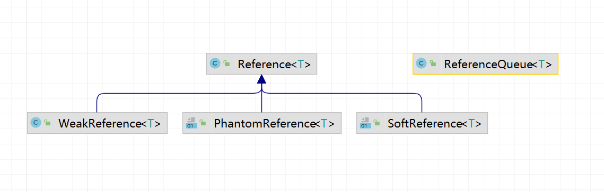

- Reference：强引用 （默认支持强引用）
- SoftReference：软引用
- WeakReference：弱引用
- PhantomReference：虚引用


| `protected void` | `finalize()`当垃圾收集确定不再有对该对象的引用时，垃圾收集器在对象上调用该对象。 |
| ---------------- | ------------------------------------------------------------ |
|                  |                                                              |

当垃圾收集确定不再有对该对象的引用时，垃圾收集器在对象上调用该对象。 一个子类覆盖了处理系统资源或执行其他清理的`finalize`方法。


### 9.2.2、强引用

​		当内存不足，JVM开始垃圾回收，对于强引用的对象，就算是出现了OOM【是一个错误，表示虚拟机内存用完了】也不会对该对象进行回收，死都不收。
​		强引用是我们最常见的普通对象引用，只要还有强引用指向一个对象，就能表明对象还“活着”，垃圾收集器不会碰这种对象。在Java中最常见的就是强引用，把一个对象赋给一个引用变量，这个引用变量就是一个强引用
​		当一个对象被强引用变量引用时，它处于可达状态，它是不可能被垃圾回收机制回收的，
​		即使该对象以后永远都不会被用到，JVM也不会回收。因此强引用是造成Java内存泄漏的主要原因之一。
​		对于一个普通的对象，如果没有其他的引用关系，只要超过了引用的作用域或者显式地将相应（强）引用赋值为null一般认为就是可以被垃圾收集的了(当然具体回收时机还是要看垃圾收集策略)。


```java
public class ReferenceDemo{
    @Override
    protected void finalize() throws Throwable {
        System.out.println(" ---- 垃圾回收");
    }

    public static void main(String[] args) {
        // 强引用，不会被gc回收
        ReferenceDemo referenceDemo = new ReferenceDemo();
        // 置为 null，可以被回收
        referenceDemo = null;
        System.gc();
    }
}
```


### 9.2.3、软引用

​		软引用是一种相对强引用弱化了一些的引用，需要用java.lang.ref.SoftReference类来实现，可以让对象豁免一些垃圾收集。
对于只有软引用的对象来说：

- 当系统内存  充足时  它不会被回收，
- 当系统内存  不足时  它会被回收。

​		软引用通常用在对内存敏感的程序中，比如高速缓存就有用到软引用，内存够用的时候就保留，不够用就回收!


`修改虚拟机内存为 10m`

```java
public static void main(String[] args) throws InterruptedException {
        SoftReference<ReferenceDemo> softReference = new SoftReference<ReferenceDemo>(new ReferenceDemo());
        // com.dhf.threadLocal.ReferenceDemo@1540e19d
        System.out.println("-----softReference " + softReference.get());
        System.gc();
        TimeUnit.SECONDS.sleep(1);
        //  com.dhf.threadLocal.ReferenceDemo@1540e19d
        System.out.println("-----after gc【内存充足】 " + softReference.get());
        try {
            byte[] bytes = new byte[20 * 1024 * 1024]; // 20MB
        }catch (Exception e){
            e.printStackTrace();
        }finally {
            // null
            System.out.println("-----after gc【内存不够】 " + softReference.get());
        }
    }
```

-----softReference com.dhf.threadLocal.ReferenceDemo@1540e19d
-----after gc【内存充足】 com.dhf.threadLocal.ReferenceDemo@1540e19d
-----after gc【内存不够】 null
 ---- 垃圾回收
Exception in thread "main" java.lang.OutOfMemoryError: Java heap space
	at com.dhf.threadLocal.ReferenceDemo.main(ReferenceDemo.java:27)


### 9.2.4、弱引用

​		弱引用需要用java.lang.ref.WVeakReference类来实现，它比软引用的生存期更短，
​		对于只有弱引用的对象来说，只要垃圾回收机制一运行，不管JVM的内存空间是否足够，都会回收该对象占用的内存。


```java
public static void main(String[] args) throws InterruptedException {
    WeakReference<ReferenceDemo> weakReference = new WeakReference<>(new ReferenceDemo());
    // com.dhf.threadLocal.ReferenceDemo@1540e19d
    System.out.println("before gc " + weakReference.get());
    System.gc();
    // null
    System.out.println("after gc " + weakReference.get());
}
```


### 9.2.5、虚引用

1. 虚引用必须和引用队列(ReferenceQueue)联合使用

   ​		虚引用需要java.lang.ref.PhantomReference类来实现,顾名思义，就是形同虚设，与其他几种引用都不同，虚引用并不会决定对象的生命周期。如果一个对象仅持有虚引用，那么它就和没有任何引用一样，**在任何时候都可能被垃圾回收器回收**，它不能单独使用也不能通过它访问对象，**虚引用必须和引用队列(ReferenceQueue)联合使用**。

2.  PhantomReference的get方法总是返回null

   ​		虚引用的主要作用是跟踪对象被垃圾回收的状态。仅仅是提供了一种确保对象被finalize以后，做某些事情的通知机制。**PhantomReference的get方法总是返回null**，因此无法访问对应的引用对象。

3. 处理监控通知使用

   ​		换句话说，**设置虚引用关联对象的唯一目的，就是在这个对象被收集器回收的时候收到一个系统通知或者后续添加进一步的处理**，用来实现比finalize机制更灵活的回收操作


```java
public static void main(String[] args) throws InterruptedException {
    // 引用对象
    ReferenceDemo referenceDemo = new ReferenceDemo();
    // 引用队列
    ReferenceQueue<ReferenceDemo> queue = new ReferenceQueue<>();
    PhantomReference<ReferenceDemo> phantomReference = new PhantomReference<>(referenceDemo, queue);
    // null get()不能获取虚引用对象
    ArrayList<Object> objects = new ArrayList<>();
    System.out.println(phantomReference.get());
    new Thread(() -> {
        while (true) {
            byte[] bytes = new byte[1024 * 1024]; // 1MB
            objects.add(bytes);
            try {
                TimeUnit.MILLISECONDS.sleep(500);
            } catch (InterruptedException e) {
                e.printStackTrace();
            }
            System.out.println("---有新对象加入");
        }
    },"t1").start();
    new Thread(() -> {
        while (true){
            Reference<? extends ReferenceDemo> poll = queue.poll();
            if (poll != null){
                System.out.println("有虚对象加入队列");
                break;
            }
        }
    },"t2").start();
}
```


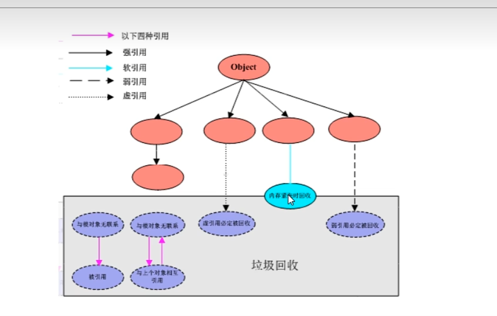


### 9.2.6、为什么源代码用弱引用?

为什么源代码用弱引用?
		当fuctionot方法执行完毕后，栈帧销毁强引用tl也就没有了。但此时线程ThreadLocalMap里某个entry的key引用还指向这个对象

- 若这个key引用是强引用，就会导致key指向的ThreadLocal对象及v指向的对象不能被gc回收，造成内存泄漏;
- 若这个key引用是弱引用就大概率会减少内存泄漏的问题(还有一个key为nulI的雷，第2个坑后面讲)。使用弱引用，就可以使ThreadLocal对象在方法执行完毕后顺利被回收且Entry的key引用指向为null。


## 9.3、清除脏Entry

**第二个雷**

1. 当我们为threadLocal变量赋值，实际上就是当前的Entry(threadLocal实例为key，值为value)往这个threadLocaMap中存放。Entry中的key是弱引用，当threadLocal外部强引用被置为null(tl=null),那么系统GC的时候，根据可达性分析，这个threadLocal实例就没有任何一条链路能够引用到它，这个ThreadLocal势必会被回收。这样一来，ThreadLocalMap中就会出现key为null的Entry，就没有办法访问这些key为null的Entry的value,如果当前线程再迟迟不结束的话，这些key为null的Entry的value就会一直存在一条强引用链:Thread Ref -> Thread > ThreaLocalNap →>Entry->value永远无法回收，造成内存泄漏。
2. 当然，如果当前thread运行结束，threadLocal，threadLocalMap,Entry没有引用链可达，在垃圾回收的时候都会被系统进行回收。
3. 但在实际使用中我们有时候会用线程池去维护我们的线程，比如在Executors.newFixedThreadPool()时创建线程的时候，为了复用线程是不会结束的，所以threadLocal内存泄漏就值得我们小心


​		虽然弱引用，保证了key指向的ThreadLoca对象能被及时回收，但是v指向的value对象是需要**ThreadLocalMap调用get、set发现key 为null才会去回收整个entry、value**，因此弱引用不能100%保证内存不泄露。我们要在不使用某个ThreadLocal对象后，手动调remove方法来剧除它，尤其是在线程池中，不仅仅是内存泄露的问题，因为线程池中的线程是重复使用的，意味着这个线程的ThreadLocalMap对象也是重复使用的，如果我们不手动调用remove方法，那么后面的线程就有可能获取到上个线程遗留下来的value值，造成bug。


ThreadLocal（Thread）-> ThreadMap -> Entry（ThreadLocal，V）  


```java
if (k == null) { // 发现key 为 null
    replaceStaleEntry(key, value, i); // 清除Entry
    return;
}
```


# 10、java对象内存布局和对象头


## 10.1、对象布局简介

​		在HotSpot虚拟机里，对象在堆内存中的存储布局可以划分为三个部分:**对象头**(Header)、**实例数据**( Instance Data）和**对齐填充**(Paading) 。


1. 对象头（16位）：对象头由**对象标记**（Mark Word）和类元信息（又叫类型指针）组成

   1. 对象标记（Mark Word8 位）：

      `默认存储对象的HashCode、分代年龄和锁标志位等信息。这些信息都是与对象自身定义无关的数据，所以MarkWord被设计成一个非固定的数据结构以便在极小的空间内存存储尽量多的数据。它会根据对象的状态复用自己的存储空间，也就是说在运行期间MarkWord里存储的数据会随着锁标志位的变化而变化。`

      1. 哈希码
      2. GC标记
      3. GC次数
      4. 同步锁标记
      5. 偏向锁持有者

   2. 类型指针（8位）:

      `对象指向它的类元信息的指针，虚拟机通过这个指针来确定这个对象是哪个类的实例，相同类的不同对象的类型指针是相同的`

2. 实例数据：存放类的属性(Field)数据信息，包括父类的属性信息

3. 对齐填充：虚拟机要求对象起始地址必须是8字节的整数倍。填充数据不是必颂存在的，仅仅是为了字节对齐这部分内存按8字节补充对齐。


## 10.2、Mark Word


## 10.3、java内存布局值 JOL

`java object layout`


```xml
<dependency>
    <groupId>org.openjdk.jol</groupId>
    <artifactId>jol-core</artifactId>
    <version>0.16</version>
</dependency>
```


```java
public class JOLDemo {
    public static void main(String[] args) {
        // vm 虚拟机详情细节
//        System.out.println(VM.current().details());
        Object o = new Object();
        System.out.println(ClassLayout.parseInstance(o).toPrintable());
    }
}
```

java.lang.Object object internals:
OFF  SZ   TYPE DESCRIPTION               VALUE
  0   8        (object header: mark)     0x0000000000000001 (non-biasable; age: 0)
  8   4        (object header: class)    0xf80001e5
 12   4        (object alignment gap)   `对齐，目前只有12位，不是8的倍数，加4位`
Instance size: 16 bytes `实例大小，16字节，新建一个对象，默认16字节`
Space losses: 0 bytes internal + 4 bytes external = 4 bytes total

|               |                                          |
| ------------- | ---------------------------------------- |
| OFF（OFFSET） | 偏移量，也就是到这个字段位置需要的byte数 |
| SZ（SIZE）    | 类型的字节大小                           |
| TYPE          | CLASS中定义的类型                        |
| DESCRIPTION   | DESCRIPTION是类型的描述                  |
| VALUE         | 是TYPE在内存中的值                       |
|               |                                          |


```java
class Customer{
    private String id;
    private boolean flag;
}
public class JOLDemo {
    public static void main(String[] args) {
        // vm 虚拟机详情细节
//        System.out.println(VM.current().details());
//        Object o = new Object();
        Object o = new Customer();
        System.out.println(ClassLayout.parseInstance(o).toPrintable());
    }
}
```


com.dhf.jol.Customer object internals:
OFF  SZ               TYPE DESCRIPTION               VALUE
  0   8                    (object header: mark)     0x0000000000000001 (non-biasable; age: 0)
  8   4                    (object header: class)    0xf800c143
 12   1            boolean Customer.flag             false
 13   3                    (alignment/padding gap)   
 16   4   java.lang.String Customer.id               null
 20   4                    (object alignment gap)    
Instance size: 24 bytes
Space losses: 3 bytes internal + 4 bytes external = 7 bytes total


Process finished with exit code 0


## 10.4、对象分代年龄

对象分代年龄占 4 个字节

从 0000  ----  1111

即 0 - 15


添加虚拟机参数：`-XX:MaxTenuringThreshold=16`

Error: Could not create the Java Virtual Machine.
Error: A fatal exception has occurred. Program will exit.
MaxTenuringThreshold of 16 is invalid; must be between 0 and 15


## 10.5、java内存布局之压缩指针参数说明


java -XX:+PrintCommandLineFlags -version

查看java虚拟机启动参数


PS E:\java\JUC> java -XX:+PrintCommandLineFlags -version
-XX:InitialHeapSize=266924800 -XX:MaxHeapSize=4270796800 -XX:+PrintCommandLineFlags -XX:+UseCompressedClassPointers【 使用压缩指针】-XX:+UseCompressedOops -XX:-UseLargePagesIndividualAllocation -XX:+UseParallelGC 
java version "1.8.0_111"
Java(TM) SE Runtime Environment (build 1.8.0_111-b14)
Java HotSpot(TM) 64-Bit Server VM (build 25.111-b14, mixed mode)


# 11、Synchronized与锁升级


- 锁的升级过程

无锁—>偏向锁—>轻量级锁(cas)—>重量级锁	


**锁指向：**

- 偏向锁:MarkWord存储的是偏向的线程ID;
- 轻量锁:MarkWord存储的是指向**线程栈**中Lock Record（锁的记录）的指针;
- 重量锁:MarkWord存储的是指向**堆**中的monitor对象的指针;


## 11.1、Synchronized锁升级之无锁


```java
public class SynchronizedUpDemo {
    public static void main(String[] args) {
        Object o = new Object(); // Object heard
        System.out.println(ClassLayout.parseInstance(o).toPrintable());
    }
}
```

java.lang.Object object internals:
OFF  SZ   TYPE DESCRIPTION               VALUE
  0   8        (object header: mark)     0x0000000000000001 (non-biasable; age: 0)
  8   4        (object header: class)    0xf80001e5
 12   4        (object alignment gap)    
Instance size: 16 bytes
Space losses: 0 bytes internal + 4 bytes external = 4 bytes total


VALUE是两位两位看的

such as：mark，0x0000000000000001

=>

00	00	00	00	00	00	00	01

00000000  00000000  00000000  00000000                                                                                 00000000  00000000  00000000  00000**001**【001无锁】

**hashcode**

```java
public class SynchronizedUpDemo {
    public static void main(String[] args) {
        Object o = new Object(); // Object heard
        System.out.println(ClassLayout.parseInstance(o).toPrintable());
        int i = o.hashCode();
        System.out.println("------------- 调用hashcode ------------");
      System.out.println(ClassLayout.parseInstance(o).toPrintable());
    }
}
```


java.lang.Object object internals:
OFF  SZ   TYPE DESCRIPTION               VALUE
  0   8        (object header: mark)     0x0000000000000001 (non-biasable; age: 0)
  8   4        (object header: class)    0xf80001e5
 12   4        (object alignment gap)    
Instance size: 16 bytes
Space losses: 0 bytes internal + 4 bytes external = 4 bytes total

---------------- 调用hashcode ---------------------
java.lang.Object object internals:
OFF  SZ   TYPE DESCRIPTION               VALUE
  0   8        (object header: mark)     0x00000020fa23c101 (hash: 0x20fa23c1; age: 0)
  8   4        (object header: class)    0xf80001e5
 12   4        (object alignment gap)    
Instance size: 16 bytes
Space losses: 0 bytes internal + 4 bytes external = 4 bytes total


Process finished with exit code 0


两次mark的value不同，`只有调用hashcode才会记录hashcode编码`

hashcode是 26bit - （26 + 31）bit

//  0x00000020fa23c101  value

00 00 00 20 fa 23 c1 01

hashcode ：553264065


## 11.2、synchronized偏向锁


### 11.2.1、什么是偏向锁

**介绍：**

偏向锁：单线程竞争

当线程A第一次竞争到锁时，通过操作修改Mark Word中的偏向线程ID、偏向模式。如果不存在其他线程竞争，那么持有偏向锁的线程将永远不需要进行同步。


**主要作用：**

​		当一段同步代码一直被同一个线程多次访问，由于只有一个线程那么该线程在后续访向时便会自动获得锁	


```java
class Ticket {
    private int number = 50;
    final Object lock = new Object();

    public void sale() {
        while (true) {
            synchronized (lock) {
                if (number > 0) {
                    System.out.println(Thread.currentThread().getName() + "\t卖出第" + (Math.abs(number - 50) + 1) + "张票");
                    number--;
                } else {
                    break;
                }
            }
        }
    }
}

public class SynchronizedUpDemo {
    public static void main(String[] args) throws InterruptedException {
        Ticket ticket = new Ticket();
        for (int i = 0; i < 3; i++) {
            new Thread(ticket::sale).start();
        }
    }
}
```


`发现大部分时候，都是Thread-0获得锁`


多线程的情况下，锁不仅不存在多线程竞争，还存在锁由同一个线程多次获得的情况，
偏向锁就是在这种情况下出现的，它的出现是为了解决只有在一个线程执行同步时提高性能。

偏向锁会偏向于第一个访问锁的线程，如果在接下来的运行过程中，该锁没有被其他的线程访问，则持有偏向锁的线程将永远不需要触发属步。也即偏向锁在资源没有竞争情况下消除了同步语句，懒的连CAS操作都不做了，直接提高程序性能


### 11.2.2、偏向锁的持有

**理论落地:**
		在实际应用运行过程中发现，“锁总是同一个线程持有，很少发生竞争”，也就是说锁总是被第一个占用他的线程拥有，这个线程就是锁的偏向线程。
		那么只需要在锁第一次被拥有的时候，记录下偏向线程ID。这样偏向线程就一直持有着锁(后续这个线程进入和退出这段加了同步锁的代码块时，不需要再次加锁和释放锁。而是直接会去检查锁的MarkWord里面是不是放的自己的线程ID)。
		如果相等，表示偏向锁是偏向于当前线程的，就不需要再尝试获得锁了，直到竞争发生才释放锁。以后每次同步，检查锁的偏向线程ID与当前线程ID是否一致，如果一致直接进入同步。无需每次加锁解锁都去CAS更新对象头。如果自始至终使用锁的线程只有一个，很明显偏向锁几乎没有额外开销，性能极高。
		如果不等，表示发生了竞争，锁己经不是总是偏向于同一个线程了，这个时候会尝试使用CAS来替换MarkWord里面的线程ID为新线程的ID，
		竞争成功，表示之前的线程不存在了，MarkWord里面的线程ID为新线程的ID，锁不会升级，仍然为偏向锁;竞争失败，这时候可能需要升级变为轻量级锁，才能保证线程间公平竞争锁。
		注意，偏向锁只有遇到其他线程尝试竞争偏向锁时，持有偏向锁的线程才会释放锁，线程是不会主动释放偏向锁的。

**技术实现:**
		一个synchronized方法被一个线程抢到了锁时，那这个方法所在的对象就会在其所在的Mark Word中将偏向锁修改状态位，同时还会有占用前54位来存储线程指针作为标识。若该线程再次访问同一个synchronized方法时，该线程只需去对象头的Mark Word中去判断一下是否有偏向锁指向本身的ID，无需再进入 Monitor去竞争对象了。


### 11.2.3、参数启动偏向锁

**偏向锁jvm命令【linux】**

`java -XX:+PrintFlagsInitial | grep BiasedLock*`


lenvoo@LAPTOP-SGUISALP MINGW32 ~/Desktop
$ java -XX:+PrintFlagsInitial | grep BiasedLock*
     intx BiasedLockingBulkRebiasThreshold  =  20   
     intx BiasedLockingBulkRevokeThreshold   =  40            
     intx BiasedLockingDecayTime    =  25000              
     intx BiasedLockingStartupDelay    =  4000        偏向锁启动延时 4s
     bool TraceBiasedLocking    =  false                      
     bool UseBiasedLocking     =  true         是否使用偏向锁


**开启偏向锁**

`-XX:+UseBiasedLocking -XX:BiasedLockingStartupDelay=0`

**关闭偏向锁**

`-XX:-UseBiasedLocking`


```java
// vm 参数 -XX:BiasedLockingStartupDelay=0
public static void main(String[] args) throws InterruptedException {
    Object o = new Object();
    synchronized (o){
      System.out.println(ClassLayout.parseInstance(o).toPrintable());
    }
}
```

java.lang.Object object internals:
OFF  SZ   TYPE DESCRIPTION               VALUE
  0   8        (object header: mark)     0x00000000032e2805 (biased: 0x000000000000cb8a; epoch: 0; age: 0)
  8   4        (object header: class)    0xf80001e5
 12   4        (object alignment gap)    
Instance size: 16 bytes
Space losses: 0 bytes internal + 4 bytes external = 4 bytes total

`查看mark VALUE`

最后一位是 05 =>  0000 0101 【101表示偏向锁】


### 11.2.4、偏向锁的撤销

当有另外线程逐步来竞争锁的时候，就不能再使用偏向锁了，要升级为轻量级锁

​		竞争线程尝试CAS更新对象头失败，会等待到**全局安全点**（此时不会执行任何代码）
撤销偏向锁。

​		偏向锁是用一种等到竞争出现才释放锁的机制，只有当其他线程竞争锁时，持有偏向锁的原来线程才会被撤销。

​		<span style="color:red">撤销需要等待全局安全结点（该时间上没有字节码正在执行）</span>，同时检查持有偏向锁的线程是否还在执行

1. 当第一个线程正在执行synchronized方法时【<span style="color:red">处于同步块</span>】，他还没有执行完，其他线程来抢夺，该偏向锁会被取消掉并出现锁升级。此时轻量锁由原持有偏向锁的线程持有，继续执行其同步代码，而正在竞争的其他线程会进入自旋等待获得该轻量锁
2. 第一个线程执行完synchronized方法时（<span style="color:red">退出同步块</span>），则将对象头设置成无锁状态并撤销偏向锁，重新偏向。


**锁的升级过程**

[锁的升级过程](http://www.soolco.com/group1/M00/03/27/rBAADF8yFDaATTYJAAIGB8MZJhQ536.png)


### 11.2.5、java15偏向锁撤销


## 11.3、轻量级锁

`轻量级锁：多线程竞争，但是任意时刻最多只有一个线程竞争，即不存在锁竞争太过激烈的情况，也就是没有线程阻塞，（最后三位 000）`


### 11.3.1、什么是轻量锁

轻量级锁是为了在线程<span style="color:red">近乎交替</span>执行同步块时提高性能。
主要目的：在没有多线程竞争的前提下，<span style="color:red">通过CAS减少</span>重量级锁使用操作系统互斥量产生的性能消耗，说白了先自旋，不行才升级阻塞。

升级时机：当关闭偏向锁功能或多线程竞争偏向锁会导致偏向锁升级为轻量级锁
		假如线程A已经拿到锁，这时线程B又来抢该对象的锁，由于该对象的锁已经被线程A拿到，当前该锁已是偏向锁了。
		而线程B在争抢时发现对象头Mark Word中的线程ID不是线程B自己的线程ID(而是线程A)，那线程B就会进行CAS操作希望能获得锁。**此时线程B操作中有两种情况:**
		<span style="color:blue">如果锁获取成功</span>，直接替换Mark Word中的线程ID为B自己的ID(A→B)，重新偏向于其他线程(即将偏向锁交给其他线程，相当于当前线程"被"释放了锁)，该锁会保持偏向锁状态，A线程Over，B线程上位;

​		<span style="color:blue">如果锁获取失败</span>，则偏向锁升级为轻量级锁(设置偏向锁标识为0并设置锁标志位为00)，此时轻量级锁由原持有偏向锁的线程持有，继续执行其同步代码，而正在竞争的线程B会进入自旋等待获得该轻量级锁。


**demo**

`-XX:-UseBiasedLocking 关闭偏向锁，关闭之后直接进入轻量锁`

```java
public static void main(String[] args) throws InterruptedException {
    Object o = new Object();
    synchronized (o){   System.out.println(ClassLayout.parseInstance(o).toPrintable());
    }
}
```

OFF  SZ   TYPE DESCRIPTION               VALUE
  0   8        (object header: mark)     0x0000000002b3f158 (thin lock: 0x0000000002b3f158)
  8   4        (object header: class)    0xf80001e5
 12   4        (object alignment gap)    
Instance size: 16 bytes
Space losses: 0 bytes internal + 4 bytes external = 4 bytes total


末尾：58：0101 1000  【000，代表轻量锁】


- java6之前：
  - 默认启用，默认自旋次数是10次，`-XX:PreBlockSpin=10修改`
  - 或者自旋线程数超过cpu核数一半
- java6之后：
  - 自适应自旋锁


### 11.3.2、自适应自旋锁

自适应自旋锁的大致原理：
		线程如果自旋成功了，那下次自旋的最大次数会增加，,因为JVM认为既然上次成功了，那么这一次也很大概率会成功。反之如果很少会自旋成功，那么下次会减少自旋的次数甚至不自旋，避免CPU空转。


### 11.3.3、偏向锁和轻量锁的区别

1. 争夺轻量锁失败时，自旋尝试抢锁
2. 轻量锁每次退出同步块都需要释放锁资源，而偏向锁只有在发生竞争时才释放锁资源


## 11.4、synchronized锁升级之重量锁


有大量线程参与锁竞争，冲突性很高


<span style="color:blue">重量级锁原理</span>：
	Java中synchronized的重量级锁，是基于进入和退出Monitor对象实现的。在编译时会将同步块的开始位置插入monitor enter指争，。在结束位置插入monitor exit指令。
当线程执行到monitor enter指令时，会尝试获取对象所对应的Monitor所有权，如果获取到了，即获取到了锁，会在Monitor的owner中存放当前线程的id，这样它将处于锁定状态，除非退出同步块，否则其他线程无法获取到这个Monitor。


**demo**

```java
public static void main(String[] args) throws InterruptedException {
    Object o = new Object();
    for (int i = 0; i < 3; i++) {
        new Thread(() -> {
            synchronized (o){
                System.out.println(Thread.currentThread().getName()+":");
                System.out.println(ClassLayout.parseInstance(o).toPrintable());
            }
        }).start();
    }
}
```


Thread-0:
java.lang.Object object internals:
OFF  SZ   TYPE DESCRIPTION               VALUE
  0   8        (object header: mark)     0x00000000030f79ea (fat lock: 0x00000000030f79ea)
  8   4        (object header: class)    0xf80001e5
 12   4        (object alignment gap)    
Instance size: 16 bytes
Space losses: 0 bytes internal + 4 bytes external = 4 bytes total


Mark Word ： VALUE： ...... ea  => ...1110 1010

【010，重量级锁】


## 11.5、synchronized锁升级和hashcode关系

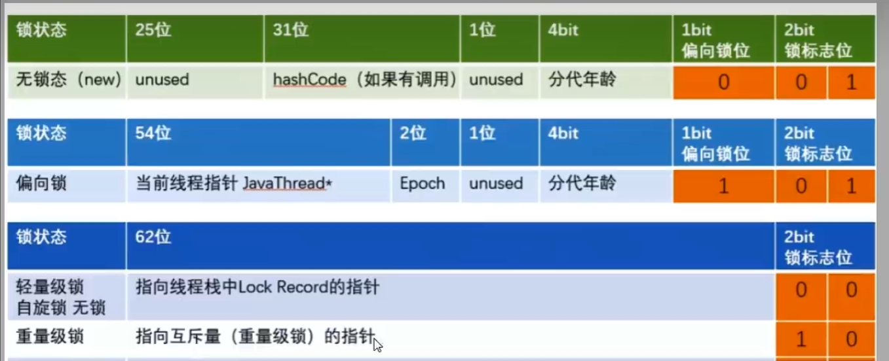


### 11.5.1、锁升级后hashcode到哪了

​		锁升级为轻量级或重量级锁后，Mark Word中保存的分别是<span style=color:red>线程栈帧里的锁记录指针</span>和<span style=color:red>重量级锁指针</span>，已经没有位置再保存哈希码,GC年龄了，<span style=color:red>那么这些信息被移动到哪里去了呢?</span>


**锁和hashcode的关系**

​		在Java语言里面一个对象如果计算过哈希码，就应该一直保持该值不变（强烈推荐但不强制，因为用户可以重载hashCode()方法按自己的意愿返回哈希码），否则很多依赖对象哈希码的API都可能存在出错风险。而作为绝大多数对象哈希码来源的Object:hashCode()方法，返回的是对象的一致性哈希码(ldentity Hash Code)，这个值是能强制保证不变的，它通过在对象头中存储计算结果来保证第一次计算之后，再次调用该方法取到的哈希码值永远不会再发生改变。**因此，当一个对象已经计算过一致性哈希码后，它就再也无法进入偏向锁状态了；而当一个对象当前正处于偏向锁状态，又收到需要计算其一致性哈希码请求时，它的偏向状态会被立即撤销，并且锁会膨胀为重量级锁。**在重量级锁的实现中，对象头指向了重量级锁的位置，代表重量级锁的ObjectMonitor类里有字段可以记录非加锁状态（标志位为“01”）下的Mark Word，其中自然可以存储原来的哈希码。


<span style=color:blue>在无锁状态下</span>，Mark Word中可以存储对象的identity hash code值。当对象hashCode()方法第一次被调用时，JVM会生成对应的identity hash code值并将该值存储到Mark Word中。
<span style=color:blue>对于偏向锁</span>，在线程获取偏向锁时，会用Thread lD和epoch值覆盖identity hash code所在的位置。如果一个对象的hashCode()方法已经被调用过一次之后，这个对象不能被设置偏向锁。因为如果可以的话，那Mark Word中的identity hash code必然会被偏向线程ld给覆盖，这就会造成同一个对象前后两次调用hashCode()方法得到的结果不一致。

<span style=color:blue>升级为轻量级锁时</span>，JVM会在当前线程的战帧中创建一个锁记录(Lock Record)空间，用于存储锁对象的Mark Word拷贝，该拷贝中可以包含identity hash code，所以轻量级锁可以和identity hash code共存，哈希码和GC年龄自然保存在此，释放锁后会将这些信息写回到对象头。

<span style=color:blue>升级为重量级锁后</span>，Mark Word保存的重量级锁指针，代表重量级锁的ObjectMonitor类里有字段记录非加锁状态下的Mark Word，锁释放后也会将信息写回到对象头。


**demo**

```java
public static void main(String[] args) throws InterruptedException {
//     TimeUnit.SECONDS.sleep(5); // 睡眠 5s 开启偏向锁
//     Object o = new Object();
//     System.out.println("轻量锁：");
//     System.out.println(ClassLayout.parseInstance(o).toPrintable());// 0000 0101
//     o.hashCode(); // 计算hash
//     synchronized (o){
//     System.out.println("变成轻量锁：");
//     System.out.println(ClassLayout.parseInstance(o).toPrintable());//1101 1000
//     }
        TimeUnit.SECONDS.sleep(5);
        Object o = new Object(); // 偏向锁
        synchronized (o){
            o.hashCode();
            System.out.println("偏向锁过程中，计算一致性哈希，膨胀成重量锁");
            System.out.println(ClassLayout.parseInstance(o).toPrintable());//..0100 1010
        }
    }
```


## 11.6、JIT编译器堆锁的优化


`JIT   Just In Time Compiler，一般翻译为即使编译器`


### 11.6.1、锁消除


```java
public class LockClearDemo {
    public final Object lock = new Object();
    public void m(){
//        synchronized (lock){
//            System.out.println("hello ----- Lock");
//        }
        // 锁消除问题，JIT编译器会无视它，
        Object o = new Object();
        synchronized (o){
            System.out.println("hello ----- Lock"+" -- "+o.hashCode()+" -- "+lock.hashCode());
        }
    }
    public static void main(String[] args) {
        LockClearDemo lockClearDemo = new LockClearDemo();
        for (int i = 0; i < 10; i++) {
            new Thread(() -> {
                lockClearDemo.m();
            }).start();
        }
    }
}
```


### 11.6.1、锁粗化

假如方法中首尾相接，前后相邻的都是同一个锁对象，那JIT编译器就会把这几个synchronized块合并成一个大块,加粗加大范围，一次申请锁使用即可，避免次次的申请和释放锁，提升了性能

```java
public class LockBigDemo {
    static final Object lock = new Object();
    public static void main(String[] args) {
        new Thread(() -> {
            synchronized (lock){
                System.out.println("hello1");
            }
            synchronized (lock){
                System.out.println("hello2");
            }
            synchronized (lock){
                System.out.println("hello3");
            }
        }).start();
    }
}
```


# 12、AbstractQueuedSynchronizer之AQS


## 12.1、AQS是什么


**技术解释：**

​		是用来实现锁或者其它同步器组件的公共基础部分的抽象实现，是<span style=color:red>重量级基础框架及整个JUC体系的基石，主要用于解决锁分配给"谁"的问题</span>，


**官方解释：**

​	为实现阻塞锁和相关的同步器提供一个框架，它是依赖于先进先出的一个等待队列，依靠单个原子int值来表示状态，通过占用和释放方法，改变状态值


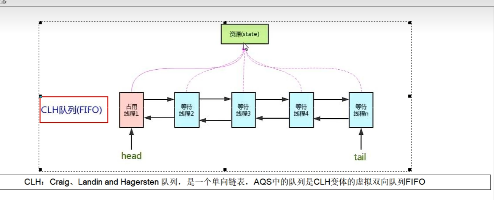


**AQS框架：**

1. CountDownLatch
2. ReentrantLock
3. ReentrantReadWriteLock
4. Semaphore信号量
5. CyclicBarrier


**解释说明**

​		抢到资源的线程直接使用处理业务，抢不到资源的必然涉及一种排队等候机制。抢占资源失败的线程继续去等待(类似银行业务办理窗口都满了，暂时没有受理窗口的顾客只能去候客区排队等候)，但等候线程仍然保留获取锁的可能且获取锁流程仍在继续(候客区的顾客也在等着叫号，轮到了再去受理窗口办理业务)。
​		既然说到了排队等候机制，那么就一定会有某种队列形成，这样的队列是什么数据结构呢?
​		如果共享资源被占用，<span style=color:blue>就需要一定的阻塞等待唤醒机制来保证锁分配</span>。这个机制主要用的是CLH队列的变体实现的，将暂时获取不到锁的线程加入到队列中，这个队列就是AQS同步队列的抽象表现。它将要请求共享资源的线程及自身的等待状态封装成队列的结点对象（Node)，通过CAS、自旋以及LockSupport.park()的方式，维护state变量的状态，使并发达到同步的效果。


​		AQS使用一个volatile的int类型的成员变量来表示同步状态，通过内置的FIFO队列来完成资源获取的排队工作将每条要去抢占资源的线程封装成一个Node结点来实现锁的分配，通过CAS完成对state的修改


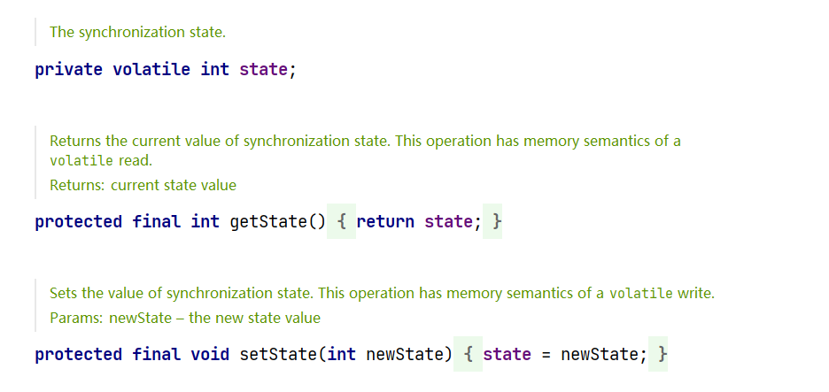


**AQS内部结构**

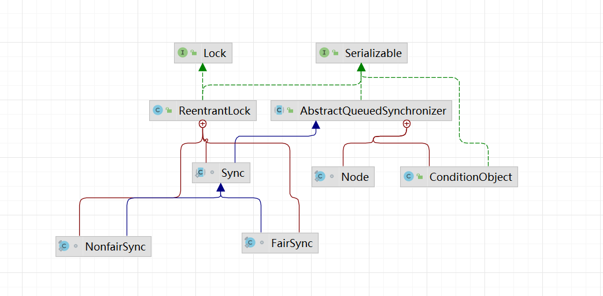


## 12.2、AQS自身属性和Node结点

```java
AQS：
	int state
	getState()
	setState()
	class Node{
    	// 通过自旋等待
        // state变量判断是否堵塞
        // 尾部入队
        // 头部出队
        /** 指示节点在共享模式下等待的标记*/
        static final Node SHARED = new Node();
        /** 指示节点以独占模式等待的标记*/
        static final Node EXCLUSIVE = null;
        /**表示线程取消*/
        static final int CANCELLED =  1;
        /** 表示后继线程需要unparking */
        static final int SIGNAL    = -1;
        /** condition需要被唤醒 */
        static final int CONDITION = -2;
        /**共享同步状态将会无条件传播下去*/
        static final int PROPAGATE = -3;
        // 状态，初始值为 0，
        volatile int waitStatus;
        volatile Node prev;
        volatile Node next;
        volatile Thread thread;
    }
	
```


### 12.3、AQS源码解析

[146_AQS之源码分析01_哔哩哔哩_bilibili](https://www.bilibili.com/video/BV1ar4y1x727?p=146&spm_id_from=pageDriver)


# 13、读写锁ReentrantReadWriteLock和StampedLock

`读写锁定义为：一个资源能被多个读线程访问，或者被一个写线程访问，但不能够同时存在读写线程`

- 读写互斥
- 读读可以共享
- 读多写少，非常适合

缺点：

1. 写锁饥饿问题
2. 锁降级


## 13.1、读写锁简介


```java
package com.dhf.readWriteLock;

import java.util.Hashtable;
import java.util.concurrent.TimeUnit;
import java.util.concurrent.locks.ReentrantLock;
import java.util.concurrent.locks.ReentrantReadWriteLock;

/**
 * @author 党
 * @version 1.0
 * 2022/9/12   10:45
 */
class Resource {
    Hashtable<String, Object> map = new Hashtable<>();
    // 独占锁
    private final ReentrantLock lock = new ReentrantLock();
    private final ReentrantReadWriteLock readWriteLock = new ReentrantReadWriteLock();

    public void write(String k, Object v) {
        readWriteLock.writeLock().lock();
        try {
            Thread thread = Thread.currentThread();
            System.out.println(thread.getName() + "正在写入");
            TimeUnit.MILLISECONDS.sleep(500);
            map.put(k, v);
            System.out.println(thread.getName() + "写入完成");
        } catch (Exception e) {
            e.printStackTrace();
        } finally {
            readWriteLock.writeLock().unlock();
        }
    }

    public void read(String key) {
        readWriteLock.readLock().lock();
        try {
            String name = Thread.currentThread().getName();
            System.out.println(name + "正在读");
            TimeUnit.MILLISECONDS.sleep(500);
            System.out.println(name + "读取完成" + map.get(key));
        } catch (Exception e) {
            e.printStackTrace();
        } finally {
            readWriteLock.readLock().unlock();
        }
    }

    public void writeOnly(String k, Object v) {
        lock.lock();
        try {
            Thread thread = Thread.currentThread();
            System.out.println(thread.getName() + "正在写入");
            TimeUnit.MILLISECONDS.sleep(500);
            map.put(k, v);
            System.out.println(thread.getName() + "写入完成");
        } catch (Exception e) {
            e.printStackTrace();
        } finally {
            lock.unlock();
        }
    }

    public void readOnly(String key) {
        lock.lock();
        try {
            String name = Thread.currentThread().getName();
            System.out.println(name + "正在读");
            TimeUnit.MILLISECONDS.sleep(500);
            System.out.println(name + "读取完成" + map.get(key));
        } catch (Exception e) {
            e.printStackTrace();
        } finally {
            lock.unlock();
        }
    }
}

public class Demo {
    public static void main(String[] args) {
        Resource resource = new Resource();
        // 写
//        for (int i = 0; i < 10; i++) {
//            int finalI = i;
//            new Thread(() -> {
//                resource.writeOnly(String.valueOf(finalI), finalI);
//            }).start();
//        }
//
//        // 读
//        for (int i = 0; i < 10; i++) {
//            int finalI = i;
//            new Thread(() -> {
//                resource.readOnly(String.valueOf(finalI));
//            }).start();
//        }
        for (int i = 0; i < 10; i++) {
            int finalI = i;
            new Thread(() -> {
                resource.write(String.valueOf(finalI), finalI);
            }).start();
        }

        // 读
        for (int i = 0; i < 10; i++) {
            int finalI = i;
            new Thread(() -> {
                resource.read(String.valueOf(finalI));
            }).start();
        }
    }
}

```


使用独占锁时，无论是都还是写，都不允许其他线程加入

使用读写锁是，写的时候其他线程不能进入，但是读的时候，允许其他线程进入

读没有完成时，其他线程不能获取写锁


### 13.1.1、读写锁之锁降级

`锁降级：遵循获取，写锁，获取读锁再释放写锁的次序，写锁能够降级成读锁`


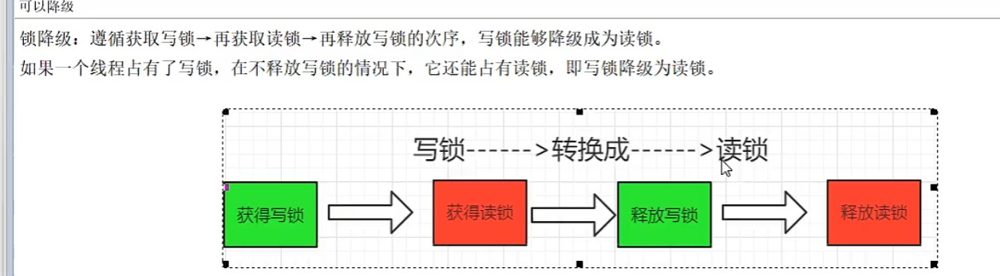


```java
public static void main(String[] args) {
        ReentrantReadWriteLock lock = new ReentrantReadWriteLock();
        ReentrantReadWriteLock.WriteLock writeLock = lock.writeLock();
        ReentrantReadWriteLock.ReadLock readLock = lock.readLock();

        writeLock.lock();
        System.out.println("写入上锁");
        readLock.lock();
        System.out.println("读 上锁");
        writeLock.unlock();
        System.out.println("释放写锁");
        System.out.println("成为读锁");
        readLock.unlock();
        System.out.println("释放读锁");
    }
```


读锁不能升级成写锁


## 13.2、邮戳锁StampedLock锁简介

```java
StampedLock stampedLock = new StampedLock();
long l = stampedLock.writeLock();
```


stamp（戳记，long类型）代表了锁的状态。当stamp返回零时，表示线程获取锁失败。
并且，当释放锁或者转换锁的时候，都要传入最初获取的stamp值。


### 13.2.1、锁饥饿问题

​		ReentrantReadWriteLock实现了读写分离，但是一旦读操作比较多的时候，想要获取写锁就变得比较困难了，假如当前1000个线程，999个读，1个写，有可能999个读取线程长时间抢到了锁，那1个写线程就悲剧了
​		因为当前有可能会一直存在读锁，而无法获得写锁，根本没机会写，o(一一)o


​		ReentrantReadWriteLock的读锁被占用的时候，其他线程尝试获取写锁的时候会被阻塞。但是，StampedLock采取乐观获取锁后，其他线程尝试获取写锁时不会被阻塞，这其实是对读锁的优化，所以，在获取乐观读锁后，还需要对结果进行校验。


### 13.2.2、StampedLock   code


1. 所以获取锁的方法，都返回一个邮戳（Stamp），stamp为0表示失败，其余都表示成功
2. 所以释放锁的方法，都需要一个邮戳（Stamp），这个stamp必须和成功获取时的邮戳一样
3. StampedLock是<span style=color:red>不可重入锁</span>，如果一个线程已经持有写锁，再去获取写锁，会造成死锁
4. StampedLock有三种访问模式：
   1. Reading（读悲观模式）：和ReentrantReadWriteLock的读锁类似
   2. Writing（写模式）：和ReentrantReadWriteLock的写锁类似
   3. optimistic reading（乐观读模式）


```java
public class StampedLockDemo {
    private static class Resource{
        private static int num = 20;
        StampedLock stampedLock = new StampedLock();

        public void write() { // ReentrantReadWriteLock的写
            long stamp = stampedLock.writeLock();
            System.out.println(Thread.currentThread().getName() + "准备修改");
            try {
                num = num + (int) (Math.random() * 10);
            } catch (Exception e) {
                e.printStackTrace();
            } finally {
                stampedLock.unlockWrite(stamp);
            }
            System.out.println(Thread.currentThread().getName() + "结束修改");
        }

        public void read() { // ReentrantReadWriteLock 的读
            long stamp = stampedLock.readLock();
            try {
                System.out.println(Thread.currentThread().getName() + "正在读取");
                TimeUnit.MILLISECONDS.sleep(500);
                for (int i = 0; i < 3; i++) {
                    System.out.println(Thread.currentThread().getName() + ": " + num);
                }
            } catch (Exception e) {
                e.printStackTrace();
            } finally {
                stampedLock.unlockRead(stamp);
            }
        }
    }


    public static void main(String[] args) throws Exception{
        Resource resource = new Resource();
        new Thread(resource::read,"readThread").start();
        TimeUnit.SECONDS.sleep(1);
        new Thread(resource::write,"writeThread").start();
        TimeUnit.SECONDS.sleep(1);
        resource.read();
    }
}
```


上述：StampedLock完全替代了ReentrantReadWriteLock


`读锁没释放，写锁介入`

乐观读code

```java
public class StampedLockDemo {
    private static class Resource{
        private static int num = 20;
        StampedLock stampedLock = new StampedLock();

        public void write() { // ReentrantReadWriteLock的写
            long stamp = stampedLock.writeLock();
            System.out.println(Thread.currentThread().getName() + "准备修改");
            try {
                num = num + (int) (Math.random() * 10);
            } catch (Exception e) {
                e.printStackTrace();
            } finally {
                stampedLock.unlockWrite(stamp);
            }
            System.out.println(Thread.currentThread().getName() + "结束修改");
        }
        // 悲观读，都没有完成的时候，无法获取写锁
        public void read() { // ReentrantReadWriteLock 的读
            long stamp = stampedLock.readLock();
            try {
                System.out.println(Thread.currentThread().getName() + "正在读取");
                TimeUnit.MILLISECONDS.sleep(500);
                for (int i = 0; i < 3; i++) {
                    System.out.println(Thread.currentThread().getName() + ": " + num);
                }
            } catch (Exception e) {
                e.printStackTrace();
            } finally {
                stampedLock.unlockRead(stamp);
            }
        }

        // 乐观读，读的过程中可以写锁介入
        public void tryOptimisticRead(){
            // 乐观锁
            long stamp = stampedLock.tryOptimisticRead();
            int res = num;
            // 乐观认为，读取过程中，没有线程修改num
            boolean validate = stampedLock.validate(stamp);
            System.out.println("after 4s stampedLock.validate(stamp)【true无修改,false有修改】\t" + validate);
            for (int i = 0; i < 4; i++) {
                try {
                    TimeUnit.SECONDS.sleep(1);
                }catch (Exception e){
                    e.printStackTrace();
                }
                System.out.println(Thread.currentThread().getName()+"\t正在读取 " +i+"次"+
                        " stampedLock.validate: "+stampedLock.validate(stamp));
            }
            if (!stampedLock.validate(stamp)){ // 有修改
                System.out.println("有人修改，升级悲观锁");
                this.read();
            }
            System.out.println(Thread.currentThread().getName()+" finish " + num);
        }

    }


    public static void main(String[] args) throws Exception{
        Resource resource = new Resource();
        new Thread(() -> {
            resource.tryOptimisticRead();
        },"read").start();
        TimeUnit.SECONDS.sleep(2);
        new Thread(resource::write,"write").start();
    }

    private static void ReentrantLockDemo() throws InterruptedException {
        Resource resource = new Resource();
        new Thread(resource::read,"readThread").start();
        TimeUnit.SECONDS.sleep(1);
        new Thread(resource::write,"writeThread").start();
        TimeUnit.SECONDS.sleep(1);
        resource.read();
    }
}
```


### 13.2.3、StampedLock锁缺点

1. StampedLock不支持重入，没有Re开头
2. StampedLock悲观读锁和写锁都不支持条件变量
3. 使用StampedLock一定不要调用中断操作，不要调用interrupt()方法


