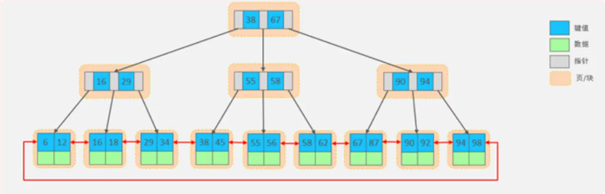

[TOC]

# MySQL-基础

## MySQL-简介

### 数据库三层结构

1. 所谓安装Mysql数据库，就是在主机安装一个数据库管理系统(DBMS)，这个管理程序可以管理多个数据库。DBMS(database manage system)
2. 一个数据库中可以创建多个表,以保存数据(信息)。
3. 数据库管理系统(DBMS)、数据库和表的关系如图所示:示意图


### 数据在数据库中的存储方式


### SQL语句分类

- DDL:数据定义语句[create表，库...]
- DML:数据操作语句[增加insert,修改update，删除delete]
- DQL:数据查询语句[select ]
- DCL:数据控制语句[管理数据库:比如用户权限grant revoke ]


### 创建数据库

```sql
#演示数据库的操作
# 创建一个名称为frx_db01的数据库。[图形化和指令 演示]

CREATE DATABASE IF NOT EXISTS db_name;
#使用指定创建数据库
CREATE DATABASE frx_db01;

#删除数据库
DROP DATABASE frx_db01;

# 创建一个使用utf8字符集的frx_db02数据库
CREATE DATABASE frx_db02  CHARACTER SET utf8

# 创建一个使用utf8字符集，并带校队规则的frx_db03数据库
CREATE DATABASE frx_db03 CHARACTER SET utf8 COLLATE utf8_bin
# 校对规则 utf8_bin 区分大小写 默认utf8_general_ci 不区分大小写
# 如果数据库下面的表没有指定字符集和校对规则，以它的数据库校对规则为准
# 下面是一条SQL语句，select 查询 * 表示所有字段
SELECT * FROM t1 
WHERE NAME='tom'
```


### 查看、删除数据库

```sql
# 演示删除和查询数据库
# 查看当前数据库服务器中的所有数据库
SHOW DATABASES

#查看前面创建的frx_db01数据库的定义信息
SHOW CREATE DATABASE frx_db01

#说明 在创建数据库，表的时候，为了规避关键字，可以使用反引号解决
CREATE DATABASE `CREATE`

#删除前面创建的frx_db01数据库
DROP DATABASE frx_db01

```


### 备份恢复数据库

```sql
#练习：database03.sq1 备份hsp_db02 和 hsp_db03 库中的数据，并恢复

#备份，要在Dos下执行mysqldump指令其实在mysql安装目录\bin
#这个备份文件，就是对应的sql语句
mysqldump -u root -p -B frx_db02 frx_db03 >d:\\bak.sql

DROP DATABASE frx_db03;

#恢复数据库(注意：使用 mysql -u root -p  进入Mysql命令行执行)
source d:\\bak.sql
#第二个恢复方法，直接将bak.sql的内容放到查询编辑器中，执行
```


### 创建表

```sql
CREATE TABLE table_name
(
    field1 datatype,
    field2 datatype
)CHARACTER SET 字符集 COLLATE 校对规则 ENGINE 存储引擎
#指令创建表
#注意：hsp_db02创建表时，要根据需保存的数据创建相应的列，并根据数据的类型定义相应的列类
#id           整形
#name         字符串
#password     字符串
#birthday     日期
CREATE TABLE `USER`(
	id INT,
	`name` VARCHAR(255),
	`password` VARCHAR(255),
	`birthday` DATE)
	CHARACTER SET utf8 COLLATE utf8_bin ENGINE INNODB;

```


### MySQL常用数据类型（列类型）


## MySQL-CURD

### 数据库 CURD 语句

```sh
# 创建（Create）、更新（Update）、读取（Read）和删除（Delete）
```

1. **Insert语句 (添加数据)**
2. **Update语句 (更新数据)**
3. **Delete语句 (删除语句)**
4. **Select语句 (查找语句)**


### INSERT 语句

- **基本语法**

```sh
# INSEET INTO table_name [(column [, column... ])]
# VALUES (value [, value...]);
```


```sql
# 练习insert语句
-- 创建一张商品表 goods(id int,goods_name varchar(10),price double);
-- 添加2条记录
CREATE TABLE goods(
	id INT,
	goods_name VARCHAR(10),
	price DOUBLE);
-- 添加数据
INSERT INTO goods( id,goods_name,price)
	VALUES(10,'华为手机',2000);

INSERT INTO goods(id,goods_name,price)
	VALUES(20,'苹果手机',3000);

SELECT * FROM goods

```


- **细节说明**

```sql
# 说明insert 语句的细节
-- 1.插入的数据应与字段的数据类型相同
-- 比如把'abc'添加到int 类型会错误
INSERT INTO `goods` (id,goods_name,price)
	VALUES('30','小米手机',2000);
	
-- 2.数据的长度应在列的规定范围内，例如：不能将一个长度为80的字符串加入到长度为40的列中。
INSERT INTO `goods` (id,goods_name,price)
	VALUES(40,'vivo手机vivo手机',3000);
	
-- 3.在values中列出的数据位置必须与被加入的列的位置相对应。
INSERT INTO `goods` (id,goods_name,price)
	VALUES('vivo手机',40,2000);
	
-- 4.字符和日期型数据应包含在单引号中。
INSERT INTO `goods` (id,goods_name,price)
	VALUES(40,'vivo手机',3000);
	
-- 5.列可以插入空值[前提是该字段允许为空],insert into table value(null)
INSERT INTO `goods` (id,goods_name,price)
	VALUES(40,'vivo手机',NULL);
	
-- 6.insert into tab_name(列名...) values (),(),() 形式添加多条记录
INSERT INTO `goods` (id,goods_name,price)

	VALUES(40,'三星手机',2300), VALUES(40,'海尔手机',1800);
-- 7.如果是给表中的所有字段添加数据，可以不写前面的字段名称
INSERT INTO `goods` VALUES (45,'华为手机',1500);

-- 8.默认值的使用，当不给某个字段值时，如果有默认值就会添加，否则报错
--   如果某个字段没有指定 not null,那么当添加数据时，没有给定值，则会给默认值
--   如果我们希望指定某个列默认值，
INSERT INTO `goods` (id,goods_name)
	VALUES (80,'格力手机');
SELECT * FROM goods;
INSERT INTO `goods2` (id,goods_name)
	VALUES (80,'格力手机');
SELECT * FROM goods2;

```


### UPDATE 语句

- **基本语法**

```sh
# UPDATE tab1_name 
#   set col_name1 = expr1 [, col_name2 = expr2 ...]
#   [where where_definition]
```


```sql
-- 演示update语句
-- 要求：在上面创建的employee表中修改表中的记录

-- 1.将所有员工薪水修改为5000元[如果没有带where条件，会修改所有的记录，因此要小心]
UPDATE employee SET salary =5000

-- 2.将姓名为 小妖怪 的员工薪水修改为3000元
UPDATE employee 
	SET salary = 3000 
	WHERE user_name='小妖怪';
	
-- 3.将老妖怪 的薪水在原有基础上增加1000元
INSERT INTO employee 
	VALUES(200,'老妖怪','男','2001-02-11','2021-01-05 10:10:10','寻路的',5000,'哈哈','e:\\b.jpg');
UPDATE employee
	SET salary=salary+1000
	WHERE user_name='老妖怪';
	
-- 可以修改多个列
UPDATE employee
	SET salary=salary+1000,job='出主意'
	WHERE user_name='老妖怪';
SELECT * FROM employee;

```


- **使用细节**

1. UPDATE语法可以用新值更新原有表行中的各列。
2. SET子句指示要修改哪些列和要给予哪些值。
3. WHERE子句指定应更新哪些行。如没有WHERE子句,则更新所有的行(记录)，因此老师提醒一定小心。
4. 如果需要修改多个字段,可以通过set字段1=值1,字段2=值2.…


### DELETE 语句

- **基本语法**

```sh
# DELETE FROM tab1_name 
#   [where where_definition]
```


```sql
 -- delete 语句演示
 -- 删除表中名称为'老妖怪'的记录
 DELETE FROM employee
	WHERE user_name='老妖怪'
	
 -- 删除表中所有记录
 DELETE FROM employee;
 
 -- delete语句不能删除某一列的值(可使用update 设为null或者'')
 UPDATE employee SET job ='' WHERE user_name='老妖怪';
 SELECT * FROM employee;
 
 -- 要删除表 
 DROP TABLE employee;

```


- **使用细节**

1. 如果不使用where子句，将删除表中所有数据。
2. Delete语句不能删除某一列的值(可使用update设为null或者“ ”)
3. 使用delete语句仅删除记录，不删除表本身。如要删除表，使用drop table语句。drop table表名;


### SELECT 语句

- **基本语法**

```sh
# SELECT [DISTINCT] * | {column1, column2, column3, ...}
#        FROM table_name;
```


- **注意事项**

1. Select 指定查询哪些列的数据。
2. column指定列名。
3. *号代表查询所有列。
4. From指定查询哪张表。
5. DISTINCT可选，指显示结果时，是否去掉重复数据


```sql
-- select 语句
CREATE TABLE student(
	id INT NOT NULL DEFAULT 1,
	NAME VARCHAR(20) NOT NULL DEFAULT '',
	chinese FLOAT NOT NULL DEFAULT 0.0,
	english FLOAT NOT NULL DEFAULT 0.0,
	math FLOAT NOT NULL DEFAULT 0.0);
INSERT INTO student(id,NAME,chinese,english,math) VALUES(1,'jack',89,78,90);
INSERT INTO student(id,NAME,chinese,english,math) VALUES(2,'张飞',67,98,56);
INSERT INTO student(id,NAME,chinese,english,math) VALUES(3,'宋江',87,78,77);
INSERT INTO student(id,NAME,chinese,english,math) VALUES(4,'关羽',85,78,90);
INSERT INTO student(id,NAME,chinese,english,math) VALUES(5,'赵云',89,78,94);
INSERT INTO student(id,NAME,chinese,english,math) VALUES(6,'欧阳锋',69,76,90);
INSERT INTO student(id,NAME,chinese,english,math) VALUES(7,'黄蓉',59,73,96);

SELECT * FROM student

-- 查询表中所有学生的信息
SELECT * FROM student;

-- 查询表中所有学生的姓名和对应的英语成绩
SELECT `name`,english FROM student;

-- 过滤表中重复数据 distinct
SELECT DISTINCT english FROM student;

-- 要查询的记录，每个字段都相同，才会去重
SELECT DISTINCT `name`,english FROM student;

```


- **使用表达式对查询的列进行运算**

```sh
# SELECT [DISTINCT] * | {column1 | expression,column2,|expression...}
#        FROM table_name;
```


- **在SELECT语句中可以使用 AS 语句**

```sh
# SELECT column_name AS 别名 FROM table_name
```


```sql
-- select 语句使用
-- 统计每个学生的总分
SELECT `name`,(chinese+english+math) FROM student;

-- 在所有学生总分加10分的情况
SELECT `name`,(chinese+english+math+10) AS total_score FROM student;
-- 使用别名表示学生分数

SELECT `name` AS '名字',(chinese+english+math) AS total_score FROM student;

SELECT `name`,(chinese+english+math)*1.6 AS total_score FROM student
 WHERE `name`='赵云';

SELECT `name`,(chinese+english+math) AS total_score FROM student
 WHERE `name`='关羽';
 
 
SELECT `math` AS`Math` FROM student

```


- **在where字句中经常使用的运算符**

```sql
-- select语句
-- 查询姓名为赵云的学生成绩
SELECT * FROM student
	WHERE `name`='赵云'

-- 查询英语成绩大于90分的同学
SELECT * FROM student
	WHERE english>90
	
-- 查询总分大于200分的所有同学
SELECT * FROM student
	WHERE (chinese+english+math)>200
	
-- 查询math大于60 并且(and) id大于4的学生成绩
SELECT * FROM student
	WHERE math>60 AND id>4
	
-- 查询英语成绩大于语文成绩的同学
SELECT * FROM student
	WHERE english>chinese
	
-- 查询总分大于200 分并且数学成绩小于语文成绩 的姓张的学生
-- % ：表示任意0个或多个字符
-- _ ： 表示任意单个字符
SELECT * FROM student
	WHERE (chinese+math+english)>200 AND 
	math<chinese AND `name` LIKE'张%';
	
-- 查询英语分数为80-90之间的同学
SELECT * FROM student
	WHERE english>=80 AND english<=90
	
-- 查询数学分数为89，90，91的同学
SELECT * FROM student
	WHERE math IN(89,90,91);
	
-- 查询所有姓李的学生
SELECT * FROM student
	WHERE `name` LIKE '李%';

```


- **使用 ORDER BY 子句排序查询结果**

```sh
# SELECT column1, column2, ...
# FROM table
# ORDER BY column1 ASC | DESC, ...
```

> ```
> ASC 升序[默认] DESC 降序
> ORDER BY 子句应该位于 SELECT 语句的结尾
> ```


```sql
-- 演示order by使用
-- 对数学成绩排序后输出【升序】
SELECT * FROM student
	ORDER BY math;
	
-- 对总分按从高到低的顺序输出[降序]
SELECT  `name`,(chinese+math+english) AS total_score FROM student
	ORDER BY total_score DESC;
	
-- 对姓李的学生成绩排序输出(升序)
SELECT `name`,(chinese+math+english) AS total_score FROM student
	WHERE `name` LIKE '李%'
	ORDER BY total_score;

```


## MySQL-函数

### 合计/统计函数

#### COUNT

```sh
# Select count(*) | count(列名) from table_name [WHERE where_definition]
# SELECT COUNT(DISTINCT column_name) FROM table_name
```


```sql
-- 演示mysql的统计函数的使用
-- 统计一个班级有多少学生
SELECT COUNT(*) FROM student;

-- 统计数学成绩大于90的学生有多少个
SELECT COUNT(*) FROM student
	WHERE math>90
	
-- 统计总分大于250的人数有多少
SELECT COUNT(*) FROM student
	WHERE (chinese+math+english)>250;
	
-- count(*)和count(列)的区别
-- 解释：conut(*)返回满足条件记录的总行数
-- count(列)：统计满足条件的某列有多少个，但是会排除为 null
CREATE TABLE t15(
	`name` VARCHAR(15));
INSERT INTO t15 VALUES('tom');
INSERT INTO t15 VALUES('jack');
INSERT INTO t15 VALUES('mary');
INSERT INTO t15 VALUES(NULL);

SELECT * FROM t15;

SELECT COUNT(*) FROM t15;-- 4
SELECT COUNT(`name`) FROM t15; -- 3

```


#### SUM

```sh
# SELECT SUM(column_name1), {SUM(...)} FROM table_name WHERE ...
```


```sql
-- 演示sum函数的使用
-- 统计一个班级数学总成绩
SELECT SUM(math) FROM student;
-- 统计一个班级语文、英语、数学各科的总成绩
SELECT SUM(chinese),SUM(math),SUM(english) FROM student;
-- 统计一个班级语文、英语、数学各科的总成绩
SELECT SUM(chinese+math+english) AS total_score FROM student
-- 统计一个班级语文成绩平均分
SELECT SUM(chinese)/COUNT(*) FROM student;

```


#### AVG

```sh
# AVG函数返回满足where条件的一列的平均值

# SELECT AVG(列名) {AVG(列名)...} from tablename [WHERE where_definition]
```


```sql
-- 演示avg的使用
-- 求一个班级数学平均分
SELECT AVG(math) FROM student;
-- 求一个班级总分平均分
SELECT AVG(chinese+math+english) FROM student;

```


#### MAX/MIN

```sh
# MAX/MIN 返回满足where条件的一列的最大/最小值
# SELECT MAX(列名) from tablename [WHERE where_definition]
```


```sql
-- 演示max和min的使用
-- 求班级最高分和最低分(数值范围在统计中特别有用)
SELECT MAX(math+chinese+english) FROM student;

	
-- 求出班级数学最高分和最低分
SELECT MAX(math),MIN(math) 
	FROM student;

```


#### GROUP BY

```sh
# SELECT column1, column2, .. FROM table GROUP BY column1
```


#### HAVING

```sql
CREATE TABLE dept( /*部门表*/
deptno MEDIUMINT   UNSIGNED  NOT NULL  DEFAULT 0,
dname VARCHAR(20)  NOT NULL  DEFAULT "",
loc VARCHAR(13) NOT NULL DEFAULT ""
) ;
INSERT INTO dept VALUES
	(10,'ACCOUNTING','NEW YORK'),
	(20,'RESEARCH','DALLAS'),
	(30,'SALES','CHICAGO'),
	(40,'OPERATIONS','BOSTON');
SELECT * FROM dept;


-- 员工表
# 创建表EMP成员
CREATE TABLE emp
(empno  MEDIUMINT UNSIGNED  NOT NULL  DEFAULT 0, /*编号*/
ename VARCHAR(20) NOT NULL DEFAULT "", /*名字*/
job VARCHAR(9) NOT NULL DEFAULT "",/*工作*/
mgr MEDIUMINT UNSIGNED ,/*上级编号*/
hiredate DATE NOT NULL,/*入职时间*/
sal DECIMAL(7,2)  NOT NULL,/*薪水*/
comm DECIMAL(7,2) ,/*奖金*/
deptno MEDIUMINT UNSIGNED NOT NULL DEFAULT 0 /*部门编号*/
) ;

-- 添加测试数据
INSERT INTO emp VALUES
	(7369, 'SMITH', 'CLERK', 7902, '1990-12-17', 800.00,NULL , 20), 
	(7499, 'ALLEN', 'SALESMAN', 7698, '1991-2-20', 1600.00, 300.00, 30), 
	(7521, 'WARD', 'SALESMAN', 7698, '1991-2-22', 1250.00, 500.00, 30), 
	(7566, 'JONES', 'MANAGER', 7839, '1991-4-2', 2975.00,NULL,20), 
	(7654, 'MARTIN', 'SALESMAN', 7698, '1991-9-28',1250.00,1400.00,30),
	(7698, 'BLAKE','MANAGER', 7839,'1991-5-1', 2850.00,NULL,30), 
	(7782, 'CLARK','MANAGER', 7839, '1991-6-9',2450.00,NULL,10), 
	(7788, 'SCOTT','ANALYST',7566, '1997-4-19',3000.00,NULL,20), 
	(7839, 'KING','PRESIDENT',NULL,'1991-11-17',5000.00,NULL,10),
	(7844, 'TURNER', 'SALESMAN',7698, '1991-9-8', 1500.00, NULL,30), 
	(7900, 'JAMES','CLERK',7698, '1991-12-3',950.00,NULL,30), 
	(7902, 'FORD', 'ANALYST',7566,'1991-12-3',3000.00, NULL,20), 
	(7934,'MILLER','CLERK',7782,'1992-1-23', 1300.00, NULL,10);
	
	SELECT * FROM emp;

-- 工资级别表
CREATE TABLE salgrade
(
grade MEDIUMINT UNSIGNED NOT NULL DEFAULT 0,
losal DECIMAL(17,2)  NOT NULL,
hisal DECIMAL(17,2)  NOT NULL
);

#测试数据
INSERT INTO salgrade VALUES (1,700,1200);
INSERT INTO salgrade VALUES (2,1201,1400);
INSERT INTO salgrade VALUES (3,1401,2000);
INSERT INTO salgrade VALUES (4,2001,3000);
INSERT INTO salgrade VALUES (5,3001,9999);	

SELECT * FROM salgrade;

# 演示group by+having
GROUP BY 用于对查询结果分组统计，
-- having子句用于限制分组显示结果
-- 如何显示每个部门的平均工资和最高工资
# 按照部门来分组查询
SELECT AVG(sal),MAX(sal),deptno
	FROM emp GROUP BY deptno;
	
-- 显示每个部门的每种岗位的平均工资和最低工资
-- 1.显示每个部门的平均工资和最低工资
-- 2.显示每个部门的每种岗位的平均工资和最低工资
SELECT AVG(sal),MIN(sal),deptno,job
	FROM emp GROUP BY deptno,job;
	
-- 显示平均工资低于2000的部门号和他的平均工资
-- 1.显示各个部门的平均工资和部门号和它的平均工资
-- 2.在1的结果基础上，进行过滤，保留 avg(sal)<2000
-- 3.使用别名进行过滤
SELECT AVG(sal),deptno
	FROM emp GROUP BY deptno
	HAVING AVG(sal)<2000;
	
-- 使用别名 
SELECT AVG(sal) AS avg_sal,deptno
	FROM emp GROUP BY deptno
		HAVING avg_sal<2000;

```


### 字符串相关函数

```sql
-- 演示字符串相关函数的使用
-- CHARSET(str) 返回字串字符集
SELECT CHARSET(ename) FROM emp;

-- CONCAT(string2 [,....]) 连接字串
SELECT CONCAT(ename,' 工作是',job) FROM emp;

-- INSTR (string,substring )返回substring在string中出现的位置，没有返回0
-- dual 亚元表，系统表 可以作为测试表使用
SELECT INSTR('hanshunping','ping')FROM DUAL;

-- UCASE(string2) 转换成大写
SELECT UCASE(ename)FROM emp;

-- LCASE(string2) 转换成小写
SELECT LCASE(ename) FROM emp;

-- LEFT (string2,length) 从string2中的左边起取length个字符
-- RIGTH(string2,length)
SELECT LEFT(ename,2) FROM emp;

-- LENGTH (string) string 长度[按照字节]
SELECT LENGTH(ename) FROM emp;

-- REPLACE (str,serch_str,replace_str)
-- 在str中用replace_str替换search_str
-- 如果是manager 就替换成经理
SELECT ename,REPLACE(job,'MANAGER','经理') FROM emp;

-- STRCMP(string1,string2) 涿字符比较俩字串大小
SELECT STRCMP('hsp','Jsp')FROM DUAL;

-- SUBSTRING(str,position [length]) 
-- 从str的position开始【从1开始计算】，取length个字符
-- 从ename列的第一个位置 开始取出2个字符
SELECT SUBSTRING(ename,1,2)FROM emp;

-- LTRTM(string2)RTRIM(string2) TRIM(string)
-- 去除前段空格后端空格
SELECT LTRIM(' 韩顺平教育')FROM DUAL;
SELECT RTRIM('韩顺平教育 ')FROM DUAL;
SELECT TRIM(' 韩顺平教育 ')FROM DUAL;


```


### 数学相关函数

```sql
-- 演示数学相关函数

-- ABS(num) 绝对值
SELECT ABS(10) FROM DUAL;

-- BIN(decimal_number)   十进制转二进制
SELECT BIN(10) FROM DUAL;

-- CEILING(number2 )向上取整 ，得到比num2 大的最小整数
SELECT CEILING(1.1) FROM DUAL;

-- CONV(number2,from_base,to base)  进制转化
-- 下面的含义是 8 是十进制的8 转成2进制输出
SELECT CONV(8,10,2) FROM DUAL;

-- 下面的含义是 16 是十六进制的16 转成10进制输出
SELECT CONV(16,16,10) FROM DUAL;

-- FLOOR(number2)    向下取整，得到比 num2小的最大整数
SELECT FLOOR(-1.1) FROM DUAL;

-- FORMAT (number,decial_places) 保留小数位数,四舍五入
SELECT FORMAT(78.125458,2) FROM DUAL;

-- HEX(DeciamlNumber )转十六进制
SELECT HEX(5) FROM DUAL;

-- LEAST(number,number2[...]) 求最小值
SELECT LEAST(0,1,-10,4) FROM DUAL;

-- MOD(nuerator,denominator)  求余
SELECT MOD(10,3) FROM DUAL;

-- RAND([seed]) RAND([seed])  返回随机数 其范围为 0<=v<=1.0
-- 如果使用rand() 每次返回不同的随机数，在0<=v<=1.0,如果seed不变，该随机数也不变了
SELECT RAND() FROM DUAL;


```


### 日期事件相关函数

```sql
-- 日期时间相关函数

-- CURRENT_DATE( )        当前日期
SELECT CURRENT_DATE FROM DUAL;

-- CURRENT_TIME( )        当前时间
SELECT CURRENT_TIME FROM DUAL;

-- CURRENT_TIMESTAMP( )   当前时间戳
SELECT CURRENT_TIMESTAMP() FROM DUAL;

-- 创建测试表 信息表
CREATE TABLE mes(
	id INT,
	content VARCHAR(30),
	send_time DATETIME);


-- 添加一条记录
INSERT INTO mes
	VALUES(1,'北京新闻',CURRENT_TIMESTAMP());

INSERT INTO mes VALUE(2,'上海新闻',NOW());
INSERT INTO mes VALUE(3,'广州新闻','2020-11-11');
	

SELECT *FROM mes;
SELECT NOW() FROM DUAL;

-- 上应用案例
-- 显示所有新闻信息，发布日期只显示日期，不用显示时间
SELECT id,content,DATE(send_time)
	FROM mes;
	
-- 请查询在10分钟内发布的帖子
SELECT  * FROM mes -- 发送时间加上10分钟 开是否大于或等于当前时间
	WHERE DATE_ADD(send_time,INTERVAL 10 MINUTE)>=NOW()
	
SELECT * FROM mes --  现在时间减去10分钟 看是否在发送时间之前
	WHERE send_time>= DATE_SUB(NOW(),INTERVAL 10 MINUTE)
	

-- 请在mysql的sql语句中求出 2011-11-11 和 1990-1-1 相差多少天
SELECT DATEDIFF('2011-11-11','1990-01-01') FROM DUAL;

-- 请用mysql的 sql语句求出你活了多少天？[练习]
SELECT DATEDIFF('2021-08-11','2001-01-01') FROM DUAL

-- 如果你能活80岁，求出你还能活多少天
-- year可以是年月日时分秒都行 ，'2001-01-05'可以是date,datetime timestamp
SELECT DATEDIFF(DATE_ADD('2001-01-05',INTERVAL 80 YEAR),NOW()) FROM DUAL

SELECT TIMEDIFF('10:11:11','06:10:10') FROM DUAL;

-- YEAR|Month|DAY|DATE|(datetime)
SELECT YEAR(NOW()) FROM DUAL;
SELECT MONTH(NOW()) FROM DUAL;
SELECT DAY(NOW()) FROM DUAL;
SELECT YEAR('2013-11-10') FROM DUAL;

-- unix_timestamp()1970-1-1 到现在的秒数
SELECT UNIX_TIMESTAMP()/(24*3600*365) FROM DUAL;

-- FROM_UNIXTIME()  可以把一个unix_timestamp秒数，转成指定格式的日期

-- %Y-%m-%d 格式是规定好的，表示年月日
SELECT FROM_UNIXTIME(1618483484,'%Y-%m-%d') FROM DUAL;
SELECT FROM_UNIXTIME(1618493484,'%Y-%m-%d %H:%i:%s')FROM DUAL;
-- 意义：在开发中，可以存放一个整数，然后表示时间，通过FROM_UNIXTIME转换


```


### 加密和系统函数

```sql
-- 演示加密函数和系统函数

-- USER()  查询用户
-- 可以查看登录到mysql的有哪些用户，以及登录的ip
SELECT USER() FROM DUAL; -- 用户@ip地址

-- DATABASE() 查询当前使用数据库名称
SELECT DATABASE();

-- MD5(str)   为字符串算出一个 MD5 32的字符串，常用(用户密码)加密
-- root 密码是 hsp -> 加密md5 ->在数据库中存放的是加密后的密码
SELECT MD5('hsp') FROM DUAL;
SELECT LENGTH(MD5('hsp')) FROM DUAL;

-- 演示用户表，存放密码时，是md5
CREATE TABLE users(
	id INT,
	NAME VARCHAR(32) NOT NULL DEFAULT'',
	pwd CHAR(32) NOT NULL DEFAULT '');

INSERT INTO users
	VALUES(100,'冯荣旭',MD5('hsp'));
	
SELECT *FROM users;

SELECT * FROM users -- SQL 注入问题
	WHERE `name`='冯荣旭' AND pwd =MD5('hsp')
	
-- PASSWORD(str) -- 加密函数，MySQL数据库的用户密码就是 PASSWORD函数加密

SELECT PASSWORD('hsp') FROM DUAL;

-- select * from mysql.user \G 从原文密码str 计算并返回密码字符串
-- 通常用于对mysql数据库的用户密码加密
-- mysql.user 表示  数据库.表
SELECT *FROM mysql.user


```


### 流程控制函数

```sql
 #演示流程控制语句
 
 # IF(expr1,expr2,expr3) 如果expr1为True,则返回expr2 否则返回expr3
 SELECT IF(TRUE,'北京','上海') FROM DUAL;
 
 #IFNULL(expr1,expr2)  如果expr1不为空null,则返回expr1,否则返回expr2
 SELECT IFNULL('jack','韩顺平教育') FROM DUAL;
 
 # SELECT CASE WHEN expr1 THEN expr2 WHEN expr3 THEN expr4 ELSE expr5 END;[类似多重分支]
 # 如果expr1 为TRUE,则返回expr2,如果 expr2 为t，返回 expr4,否则返回 expr5
 SELECT CASE 
	WHEN TRUE THEN 'jack' 
	WHEN FALSE THEN 'tom' 
	ELSE 'mary' END

-- 1.查询emp 表，如果comm 是null 则显示0.0
--  老师说明,判断是否为null 要使用 is null,判断不为空 使用 is not
SELECT ename,IF (comm IS NULL,0.0,comm)
	FROM emp;
SELECT ename,IFNULL(comm,0.0)
	FROM emp;
	
-- 2.如果emp 表的 job 是 CLERK 则显示职员，如果是 MANAGER 则显示经理
--   如果是SALESMAN 则显示 销售人员，其他正常显示
SELECT ename,(
	SELECT CASE
	WHEN job ='CLERK' THEN '职员' 
	WHEN job ='manager' THEN '经理' 
	WHEN job ='SALESMAN'THEN'销售人员'
	ELSE job END) AS 'job',job
	FROM emp;

```


## MySQL-多表查询

### 多表查询

> ```sh
> # 多表查询是指基于两个和两个以上的表查询.在实际应用中,查询单个表可能不能满足你的需求.
> ```


```sql
-- 多表查询
-- 显示雇员名，雇员工资及所在部门的名字【笛卡尔积】
SELECT * FROM salgrade
SELECT * FROM emp
SELECT * FROM dept
/*
   分析
   1.雇员名，雇员工资 来自 emp表
   2.部门的名字，来自dept表
   (1)从第一张表中，取出一行和第二张表的每一行进行组合，返回结果[含有两张表的所有列]
   (2)一共返回的记录数第一张表行数*第二张表的行数
   (3)这样多表查询默认处理返回的结果，称为【笛卡尔积】
   (4)解决这个多表的关键就是要写出正确的过滤条件 where
   3.当我们需要指定显示某个表的列时，需要 表.列名
   
   
*/
SELECT  ename,sal,dname,emp.deptno 
	FROM emp,dept
	WHERE emp.deptno=dept.deptno
-- 小技巧：多表查询的条件下不能少于 表的个数-1，否则会出现笛卡尔积

-- 如何显示部门号为10的部门名、员工名和工资
SELECT  ename,sal,dname,emp.deptno 
	FROM emp,dept
	WHERE emp.deptno=dept.deptno AND emp.deptno=10
	
-- 显示各个员工的姓名，工资，及其工资的级别
SELECT ename,sal,grade
	FROM emp,salgrade
	WHERE sal >= losal AND sal<=hisal;
	
-- 显示雇员名，雇员工资及所在部门的名字，并按部门排序
  SELECT ename,sal,dname,emp.deptno
		FROM emp,dept
		WHERE emp.deptno=dept.deptno
		ORDER BY emp.deptno DESC

```


- **自连接**

> ```sh
> # 自连接是指在同一张表的连接查询[将同一张表看做两张表].
> ```


```sql
-- 多表查询的 自连接

-- 思考题：显示公司员工名字和他的上级名字
SELECT *FROM emp
-- 分析：员工名字 在emp,上级的名字 emp
-- 员工和上级是通过 emp表的 mgr 列并联
-- 小结：1.把同一张表当做两张表来使用
--       2.需要给表取别名[表别名]
--       3.列名不明确，可以指定列的别名，列名 AS 列的别名
SELECT worker.ename AS '职员名',boss.ename AS '上级名'
	FROM emp worker,emp boss
	WHERE worker.mgr=boss.empno;

```


### MySQL表子查询

> ```sh
> # 子查询是指嵌入在其它 SQL 语句中的 SELETE 语句,也叫嵌套查询
> ```


```sh
# 单行子查询
# 单行子查询是指只返回一行数据的子查询语句
# 多行子查询
# 多行子查询指返回多行数据的子查询 ,使用关键字 in
```


```sql
-- 子查询的演示
-- 请思考：如何显示与SMITH 同一部门的所有员工

/*
  1.先查询到SMITH的部门号得到
  2.把上面的select语句当做一个子查询来使用
*/
SELECT deptno
	FROM emp
	WHERE ename='SMITH'
	
SELECT *
	FROM emp
	WHERE deptno =(
		SELECT deptno
		FROM emp
		WHERE ename='SMITH'
	)
-- 课堂练习：如何查询和部门10的工作相同的雇员的
--   名字、岗位、工资、部门号、但是不含10部门自己的

/*
   1.查询到10号部门有哪些工作
   2.把上面查询的结果当做子查询
*/
SELECT DISTINCT job 
	FROM emp
	WHERE deptno=10;
	
-- 下面语句完整
SELECT ename,job,sal,deptno
	FROM emp
	WHERE job IN (
		SELECT DISTINCT job 
		FROM emp
		WHERE deptno=10
	)AND deptno !=10

```


```sql
-- all 和 any 的使用

-- 请思考：显示工资比部门30的所有员工的工资高的员工的姓名、工资和部门号

SELECT ename,sal,deptno
	FROM emp
	WHERE sal> ALL(
		SELECT sal
		FROM emp
		WHERE deptno =30)
		
-- 可以这样写
SELECT ename,sal,deptno
	FROM emp
	WHERE sal> (
		SELECT MAX(sal)
		FROM emp
		WHERE deptno =30)
		

-- 请思考：如何显示工资比部门30的其中一个员工的工资高的员工的姓名、工资和部门号

SELECT ename,sal,deptno
	FROM emp
	WHERE sal> ANY(
		SELECT sal
		FROM emp
		WHERE deptno =30)
-- 可以这样写
SELECT ename,sal,deptno
	FROM emp
	WHERE sal> (
		SELECT MIN(sal)
		FROM emp
		WHERE deptno =30)

```


- **多列子查询**

> ```sh
> # 多列子查询是指查询返回多个列数据的子查询语句。
> ```


```sql
-- 多列子查询
-- 请思考如何查询与allen的部门和岗位完全相同的所有雇员(并且不含smith本人)
-- (字段1，字段2...)=(select 字段1 ，字段2 from...)

-- 分析：1.得到allen的部门和岗位

SELECT deptno,job
	FROM emp
	WHERE ename='ALLEN'
	
-- 分析：2.把上面的查询当做子查询来使用，并且使用多列子查询的语法进行匹配
SELECT * 	
	FROM emp
	WHERE (deptno,job)=(
		SELECT deptno,job
		FROM emp
		WHERE ename='ALLEN'
		)AND ename != 'ALLEN'
		
-- 请查询和宋江同学数学，英语，语文
-- 成绩完全相同的同学		
SELECT *
	FROM student
	WHERE (chinese,english,math)=(	
		SELECT chinese,english,math 
		FROM student
		WHERE `name`='宋江');

```


- **在 from 子句中使用子查询**

```sql
-- 子查询 练习

-- 请思考：查找每个部门工资高于本部门平均工资的人的资料
-- 这里要用到数据查询的小技巧，把一个子查询当做一个临时表使用

-- 1.先得到每个部门的 部门号和对应的平均工资
SELECT deptno,AVG(sal)
	FROM emp
	GROUP BY deptno
	
	
-- 2.把上面的结果当做子查询，和emp进行多表查询
SELECT  ename,sal,temp.avg_sal,emp.deptno
	FROM emp,(
		SELECT deptno,AVG(sal) AS avg_sal
		FROM emp
		GROUP BY deptno
		)temp
		WHERE emp.deptno=temp.deptno AND emp.sal>temp.avg_sal
		
-- 查找每个部门工资最高的人详细资料
SELECT  ename,sal,temp.max_sal,emp.deptno
	FROM emp,(
		SELECT deptno,MAX(sal) AS max_sal
		FROM emp
		GROUP BY deptno
		)temp
		WHERE emp.deptno=temp.deptno AND emp.sal=temp.max_sal
		
-- 查询每个部门的信息(包括：部门名，编号，地址)和人员数量
-- 1.部门名，编号，地址
-- 2.各个部门的数量
SELECT COUNT(*),deptno 
	FROM emp
	GROUP BY deptno
	
	
	
SELECT dname,dept.deptno ,loc,tmp.per_num AS '人数'
	FROM dept,(
		SELECT COUNT(*) AS per_num,deptno 
		FROM emp
		GROUP BY deptno
		) tmp
		WHERE tmp.deptno=dept.deptno
		
-- 还有一种写法 表.* 表示将该所有列都显示出来
-- 在多表查询中，当多个表的列不重复时，才可以直接写列名

SELECT tmp.* ,dname,loc
	FROM dept,(
		SELECT COUNT(*) AS per_num,deptno
		FROM emp
		GROUP BY deptno
		) tmp
		WHERE tmp.deptno=dept.deptno	


```


### 表复制

- **自我复制数据(蠕虫复制)**

```sql
-- 表的复制
-- 为了对某个sql语句进行效率测试，我们需要海量数据时，可以使用此法为表创建海量数据

CREATE TABLE my_tab01(
	id INT,
	`name` VARCHAR(32),
	sal DOUBLE,
	job VARCHAR(32),
	deptno INT);
DESC my_tab01
SELECT * FROM my_tab01

-- 演示如何自我复制
-- 1.先把emp表的记录复制到my_tab01
INSERT INTO my_tab01
	(id,`name`,sal,job,deptno)
	SELECT empno,ename,sal,job,deptno FROM emp;
	
-- 2.自我复制
INSERT INTO my_tab01
	SELECT * FROM my_tab01;
	
-- 如何删除一张表重复记录
-- 1.先创建一张表 my_tab02,
-- 2.让 my_tab02 有重复的记录

CREATE TABLE my_tab02 LIKE emp;-- 这个语句把emp表的结构(列)，复制到my_tab02

DESC my_tab02; 

INSERT INTO my_tab02
	SELECT * FROM emp;
	
SELECT * FROM my_tab02;
-- 3.考虑去重
/*
	(1)先创建一张临时表，my_tmp,该表的结构和 my_tab02一样
	(2)把my_tmp的记录通过 distinct关键字 处理后，把记录复制到my_tmp
	(3)清除掉my_tab02 记录
	(4)把 my_tmp 表的记录复制到my_tab02
	(5)drop 掉 临时表my_tmp
*/
DROP TABLE my_tmp
-- (1)先创建一张临时表，my_tmp,该表的结构和 my_tab02一样
CREATE TABLE my_tmp LIKE my_tab02
-- (2)把my_tmp的记录通过 distinct关键字 处理后，把记录复制到my_tmp
INSERT INTO my_tmp
	SELECT DISTINCT * FROM my_tab02
-- (3)清除掉my_tab02 记录
DELETE FROM my_tab02
-- (4)把 my_tmp 表的记录复制到my_tab02
INSERT INTO my_tab02
	SELECT * FROM my_tmp
-- (5)drop 掉 临时表my_tmp
DROP TABLE my_tmp

SELECT * FROM my_tab02


```


### 合并查询

- **介绍**

```sh
# 有时在实际应用中，为了合并多个select语句的结果，可以使用集合操作符号union , union all

# nuion all
# 该操作符用于取得两个结果集的并集。当使用该操作符时，不会取消重复行。
# union
# 该操作赋与union all相似,但是会自动去掉结果集中重复行。
```

```sql
-- 合并查询

SELECT ename,sal,job FROM emp WHERE sal>2500; -- 5

SELECT ename,sal,job FROM emp WHERE job='MANAGER'; -- 3

-- union all 就是将两个查询结果合并，不会去重
SELECT ename,sal,job FROM emp WHERE sal>2500
UNION ALL
SELECT ename,sal,job FROM emp WHERE job='MANAGER';-- 8

-- union  就是两个查询结果合并，会去重，不会出现同步记录
SELECT ename,sal,job FROM emp WHERE sal>2500
UNION 
SELECT ename,sal,job FROM emp WHERE job='MANAGER';-- 6

```


- **外连接**

1. 左外连接(如果左侧的表完全显示我们就说是左外连接) select...from 表1 left join 表2 on条件 [表1：左表 表2：右表]
2. 右外连接(如果右侧的表完全显示我们就说是右外连接) select...from 表1 rigth join 表2 on条件 [表1：左表 表2：右表]


```sql
-- 外连接
-- 比如:列出部门名称和这些部门的员工名称和工作，同时要求 显示出那些没有员工的部门

-- 使用我们学习过的多表查询的sql,看看效果

SELECT dname,ename,job 
	FROM emp,dept
	WHERE emp.deptno=dept.deptno
	ORDER BY dname
	
-- 先创建 stu
CREATE TABLE stu(
	id INT,
	`name` VARCHAR(32));
INSERT INTO stu VALUES(1,'Jack'),(2,'tom'),(3,'kity'),(4,'nono');
SELECT * FROM stu;

-- 创建exam
CREATE TABLE exam(
	id INT,
	grade INT);
INSERT INTO exam VALUES(1,56),(2,76),(11,8);
SELECT * FROM exam;


-- 使用左连接
-- (显示所有人的成绩，如果没有成绩，也要显示该人的姓名和id号，成绩显示为空)
SELECT `name`,stu.id,grade
	FROM stu,exam
	WHERE stu.id=exam.id;
	
-- 改成左外连接
SELECT `name`,stu.id,grade
	FROM stu LEFT JOIN exam
	ON stu.id=exam.id;
	
-- 使用右外连接(显示所有人的成绩，如果没有名字匹配，显示为空)
-- 即：右边的表(exam)和左表没有匹配的记录，也会把右表的记录显示出来
SELECT `name`,stu.id,grade
	FROM stu RIGHT JOIN exam
	ON stu.id=exam.id;

```


## MySQL-约束与自增长

### MySQL约束

- **基本介绍**

```sh
# 约束用于确保数据库的数据满足特定的商业规则。在mysql中，约束包括: 
# not null、unique,primary key,foreign key,和check五种。
```


### PRIMART KEY(主键)-基本使用

- **细节说明**

1. primary key不能重复而且不能为null。
2. 一张表最多只能有一个主键,但可以是复合主键主键的指定方式有两种
3. 直接在字段名后指定:字段名primakry key在表定义最后写primary key(列名);
4. 使用desc表名，可以看到primary key的情况.
5. 在实际开发中，每个表往往都会设计一个主键.


```sql
-- 主键使用


-- id name email
CREATE TABLE t17(
	id INT PRIMARY KEY,-- 表示id列是主键
	`name` VARCHAR(32),
	email VARCHAR(32));
	
-- 主键列的值是不可以为 空
INSERT INTO t17
	VALUES(1,'jack','jack@sohu.com')
INSERT INTO t17
	VALUES(2,'tom','tom@sohu.com')
INSERT INTO t17(
	VALUES(1,'frx','frx@sohu.com')
		
SELECT * FROM t17

-- 主键使用的细节讨论
-- primary key 不能重复且不能为null
INSERT INTO t17(
	VALUES(NULL,'frx','frx@sohu.com')
	
-- 一张表最多只能有一个主键，但可以是复合主键(比如 id+name)
-- 演示复合主键
CREATE TABLE t18(
	id INT ,
	`name` VARCHAR(32) ,
	email VARCHAR(32),
	PRIMARY KEY(id,`name`));-- 这里就是复合主键

INSERT INTO t18
	VALUES(1,'tom','tom@sohu.com');
INSERT INTO t18
	VALUES(1,'jack','jack@sohu.com');
SELECT * FROM t18

-- 主键的指定方式 有两种
-- 直接在字段名后指定：字段名 primary key
CREATE TABLE t19(
	id INT,
	`name` VARCHAR(32) PRIMARY KEY,
	email VARCHAR(32));
	
-- 在表定义最后写 primary key(列名);
CREATE TABLE t20(
	id INT,
	`name` VARCHAR(32) ,
	email VARCHAR(32),
	PRIMARY KEY(`name`));
	
-- 使用desc 表名，可以看到primary key的情况下
DESC t20 -- 查看t20 表的结果，显示约束情况
DESC t18

```


### NOT NULL和UNIQUE(唯一)

```sh
# NOT NULL 非空，当插入数据时，必须提供数据
# UNIQUE 唯一，该列不可重复，若没有指定 NOT NULL，则可以有多个 NULL
```


```sql
-- unique的使用

CREATE TABLE t21(
	id INT UNIQUE,-- 表示id列是不可以重复的
	`name` VARCHAR(32),
	email VARCHAR(32)
	);
	
INSERT INTO t21
	VALUES(1,'jack','jack@sohu.com');
INSERT INTO t21
	VALUES(1,'tom','tom@sohu.com');	
	
-- unique的使用细节
-- 1.如果没有指定 not null,则unique字段可以有多个null
-- 如果一个列(字段)，是unique not null 使用效果类似 primary key
INSERT INTO t21
	VALUES(NULL,'tom','tom@sohu.com');
-- 2.一张表可以有多个unique字段
CREATE TABLE t22(
	id INT UNIQUE,-- 表示id列是不可以重复的
	`name` VARCHAR(32) UNIQUE, -- 表示name不可以重复
	email VARCHAR(32)
	);
DESC t22

```


### FOREIGN KEY （外键）


```sql
-- 外键演示

-- 创建 主表 my_class
CREATE TABLE my_class(
	id INT PRIMARY KEY, -- 班级编号
	`name` VARCHAR(32) NOT NULL DEFAULT '');
	
-- 创建 从表 my_stu
CREATE TABLE my_stu(
	id INT PRIMARY KEY,-- 学生编号
	`name` VARCHAR(32) NOT NULL DEFAULT '',
	class_id INT, -- 学生所在班级编号 
	-- 下面指定外键关系
	FOREIGN KEY (class_id) REFERENCES my_class(id))
	
-- 测试数据
INSERT INTO my_class
	VALUES(100,'java'),(200,'web');
SELECT * FROM my_class	

INSERT INTO my_stu
	VALUES(1,'tom',100);
INSERT INTO my_stu
	VALUES(2,'jack',200);
INSERT INTO my_stu
	VALUES(4,'marry',NULL);	-- 可以。外键没有写 not null
INSERT INTO my_stu
	VALUES(3,'frx',300);-- 添加失败 300号班机不存在
SELECT * FROM my_stu
SELECT * FROM my_class

-- 一旦建立主外键关系，数据不能随意删除了
DELETE FROM my_class
	WHERE id=100 -- 没有任何一条记录指向 主表100,就可以删去

```


### check

```sql
-- 演示check的使用

-- mysql5.7目前还不支持check,只做语法校验，但不会生效

-- 测试
CREATE TABLE t23(
	id INT PRIMARY KEY,
	`name` VARCHAR(32),
	sex VARCHAR(6) CHECK (sex IN('man','woman')),
	sal DOUBLE CHECK(sal>1000 AND sal<2000));
	
-- 添加数据
INSERT INTO t23
	VALUES(1,'jack','mid',1);
SELECT * FROM t23

```


### 自增长


- **使用细节**

1. 一般来说自增长是和primary key配合使用的
2. 自增长也可以单独使用[但是需要配合一个unique]
3. 自增长修饰的字段为整数型的(虽然小数也可以但是非常非常少这样使用)
4. 自增长默认从1开始,你也可以通过如下命令修改 [altertable表名auto increment=新的开始值] ;
5. 如果你添加数据时，给自增长字段(列)指定的有值，则以指定的值为准,如果指定了自增长，一般来说，就按照自增长的规则来添加数据


```sql
-- 演示自增长的使用
-- 创建表
CREATE TABLE t24(
	id INT PRIMARY KEY AUTO_INCREMENT,
	email VARCHAR(32) NOT NULL DEFAULT '',
	`name` VARCHAR(32) NOT NULL DEFAULT '');
DESC t24

-- 测试自增长的使用
INSERT INTO t24
	VALUES(NULL,'jack@qq.com','jack')
	
INSERT INTO t24
	(email,`name`)VALUES('jack@qq.com','jack');

SELECT * FROM t24

-- 修改默认的自增长开始值
ALTER TABLE t25 AUTO_INCREMENT =100
CREATE TABLE t25(
	id INT PRIMARY KEY AUTO_INCREMENT,
	email VARCHAR(32) NOT NULL DEFAULT '',
	`name` VARCHAR(32) NOT NULL DEFAULT '');
INSERT INTO t25
	VALUES(NULL,'jack@qq.com','jack');
INSERT INTO t25
	VALUES(666,'jack@qq.com','jack');
INSERT INTO t25
	VALUES(NULL,'mary@qq.com','mary');
SELECT * FROM t25;

-- 如果指定了自增长，一般来说，就按照自增长的规则来添加数据

```


## MySQL-索引与事务

### MySQL索引（index）

#### 索引快速入门

1. 说起提高数据库性能,索引是最物美价廉的东西了。不用加内存，不用改程序,不用调sql，查询速度就可能提高百倍干倍。
2. 没有建立索引的字段，查询起来依旧很慢


#### 索引的原理


1. 没有索引为什么会慢?因为全表扫描.
2. 使用索引为什么会快?形成一个索引的数据结构，比如二叉树


- **索引的代价**

1. 磁盘占用
2. 对dml(update delete insert)语句的效率影响


#### 索引的类型


#### 索引的使用

- **添加索引**

```sql
-- 1.添加PRIMARY KEY（主键索引） 
ALTER TABLE `table_name` ADD PRIMARY KEY ( `column` ) 
-- 2.添加UNIQUE(唯一索引) 
ALTER TABLE `table_name` ADD UNIQUE ( 
`column` 
) 
-- 3.添加INDEX(普通索引) 
ALTER TABLE `table_name` ADD INDEX index_name ( `column` ) 
-- 4.添加FULLTEXT(全文索引) 
ALTER TABLE `table_name` ADD FULLTEXT ( `column`) 
-- 5.添加多列索引 
ALTER TABLE `table_name` ADD INDEX index_name ( `column1`, `column2`, `column3` )
```


- **删除索引**

```sql
-- 删除索引
DROP INDEX index_name ON `table_name`
ALTER TABLE `table_name` DROP INDEX index_name;

-- 删除主键索引
ALTER table `table_name` DROP PRIMARY KEY;
```


- **查询索引**

```sql
SHOW INDEX DROM table_name;

SHOW INDEXES DROM table_name;

SHOW KEYS FROM table_name;

DESC table_name
```


```sql
-- 演示mysql的索引的使用
-- 创建索引
CREATE TABLE t25(	
	id INT,
	`name` VARCHAR(32));
	
	
-- 查询表是否有索引
SHOW INDEXES FROM t25;

-- 添加索引
-- 添加唯一索引
CREATE UNIQUE INDEX id_index ON t25(id);

-- 添加普通索引方式1
CREATE INDEX id_index ON t25(id);

-- 如何选择
-- 1.如果某列的值，是不会重复的，则优先考虑使用unique索引,否则使用普通索引

-- 添加普通索引方式2
ALTER TABLE t25 ADD INDEX id_index(id)

-- 添加主键索引
CREATE TABLE t26(	
	id INT ,-- 1. primary key
	`name` VARCHAR(32));
-- 2.
ALTER TABLE t26 ADD PRIMARY KEY(id)

SELECT * FROM t26

-- 删除索引
SELECT * FROM t25
DROP INDEX id_index ON t25


-- 删除主键索引
ALTER TABLE t26 DROP PRIMARY KEY


-- 修改索引，先删除，在添加新的索引
-- 查询索引
-- 1.方式
SHOW INDEX FROM t25
-- 2.方式
SHOW INDEXES FROM t25
-- 3.方式
SHOW KEYS FROM t25
-- 4.方式
DESC t25

-- 创建一张订单表order (id号，商品名,订购人，数量).
-- 要求id号为主键，请使用2种方式来创建主键.
-- (提示:为练习方便，可以是order1 , order2 )
CREATE TABLE ORDER
	( id INT PRIMARY KEY,
	`goods_name` VARCHAR(32),
	person VARCHAR(32),
	num INT);-- 方式一
	
ALTER TABLE ORDER ADD PRIMARY KEY(id) -- 方式二

-- 创建一张特价菜谱表menu(id号，菜谱名,厨师，点餐人身份证，价格).
-- 要求id号为主键，点餐人身份证是unique请使用两种方式
-- 来创建unique.(提示:为练习方便，可以是menu1 , menu2

CREATE TABLE menu(
	id INT,
	`name` VARCHAR(32),
	 厨师 VARCHAR(32),
	身份证 CHAR(18) UNIQUE ,
	price DOUBLE); -- 方式一
CREATE UNIQUE INDEX 身份证 ON menu (身份证)
SHOW INDEX FROM menu


-- 创建一张运动员表sportman (id号，名字，特长).
-- 要求id号为主键，名字为普通索引，
-- 请使用2种方式来创建索引
-- (提示:为练习方便，可以是不同表名sportman1 , sportman2

CREATE TABLE sportman(
	id INT PRIMARY KEY,
	`name` VARCHAR(32),
	hobby VARCHAR(32));
	
CREATE INDEX name_index ON sportman(NAME) -- 方式一
ALTER TABLE sportman ADD INDEX name_index(NAME)-- 方式二

```


#### 哪些列适合使用索引

1. 较频繁的作为查询条件字段应该创建索引
2. 唯一性太差的字段不适合单独创建索引
3. 更新非常频繁的字段不适合创建索引
4. 不会出现在WHERE子句中字段不应该创建索引


### MySQL事务


#### 什么是事务

```sh
# 事务用于保证数据的一致性,它由一组相关的dml语句组成,该组的dml语句要么全部成功，要么全部失败。如:转账就要用事务来处理,用以保证数据的一致性
```


#### 事务和锁

```sh
# 当执行事务操作时（DML语句），MySQL会在表上加锁，防止其他用户更改表的数据
```


- **基本操作**

```sql
-- 开始一个事务
START TRANSACTION;

-- 设置一个保存点
SAVEPOINT save_point_name;

-- 回退事务
ROLLBACK TO save_ponit_name;

-- 回退全部事务
ROLLBACK;

-- 提交事务，所有操作生效，不能回退
COMMIT;
```


```sql
-- 事务的一个重要的概念和具体操作
-- 演示
-- 1.创建一张测试表
CREATE TABLE t27(
	id INT,
	`name` VARCHAR(32));

-- 2.开始事务
START TRANSACTION
-- 3.设置保存点
SAVEPOINT a
-- 执行dml操作
INSERT INTO t27 VALUES(100,'tom');
SELECT * FROM t27;

SAVEPOINT b
-- 执行dml操作
INSERT INTO t27 VALUES(200,'jack');

-- 回退到b
ROLLBACK TO b
-- 继续回退 a
ROLLBACK TO a
-- 如果这样，表示直接回退到事务开始的状态
ROLLBACK
COMMIT 
```


#### 回退事务

在介绍回退事务前，先介绍一下保存点(savepoint).保存点是事务中的点.用于取消部分事务，当结束事务时(commit),会自动的删除该事务所定义的所有保存点.当执行回退事务时，通过指定保存点可以回退到指定的点。


#### 提交事务

使用commit语句可以提交事务.当执行了commit语句子后,会确认事务的变化、结金事除徨专野放锁数据生效。当使用commit语句结束事务子后，其它会话[其他连接]将可以查着到事务变化后的新数据[所有数据就正式生效.]


```sql
-- 讨论事务细节
-- 1.如果不开始事务，默认情况下，dml操作是自动提交的，不能回滚
INSERT	INTO t27 VALUES(300,'milan'); -- 自动提交commit

SELECT * FROM t27


-- 2.如果开始一个事务，你没有创建保存点.你可以执行rollback,
-- 默认就是回退到你事务开始的状态.
START	TRANSACTION
INSERT INTO t27 VALUES(400,'king');
INSERT INTO t27 VALUES(500,'scott')
ROLLBACK -- 表示直接回退到事务开始的状态

-- 3.你也可以在这个事务中(还没有提交时),创建多个保存点.
-- 比如: savepoint aaa;执行dml , savepoint bbb;


-- 4.你可以在事务没有提交前，选择回退到哪个保存点.

-- 5.mysql的事务机制需要innodb的存储引擎才可以使用,myisam不支持.
-- 6.开始一个事务start transaction, set autocommit=off;


```


### MySQL事务隔离级别

#### 事务隔离级别介绍

1. 多个连接开启各自事务操作数据库中数据时，数据库系统要负责隔离操作，以保证各个连接在获取数据时的准确性。（通俗解释)
2. 如果不考虑隔离性,可能会引发如下问题:
   - 脏读
   - 不可重复读
   - 幻读

- **介绍**

1. 脏读（dirty read）：当一个事务读取另一个事务尚未提交的改变（update，insert，delete），产生脏读
2. 不可重复读（nonrepeatable read）：同一查询在同一事务中多次进行，由于其他提事务所做的**修改**，每次返回不同的结果集
3. 幻读（phantom read）：同一查询结果在同一事务中多次进行，由于其他提交事务所作的**插入或删除**操作，每次返回不同的结果集


#### 事务隔离级别

| Mysql隔离级别(4种)        | 脏读 | 不可重复读 | 幻读 | 加锁读 |
| ------------------------- | ---- | ---------- | ---- | ------ |
| 读未提交(Read uncommited) | √    | √          | √    | 不加锁 |
| 读已提交(Read commited)   | ×    | √          | √    | 不加锁 |
| 可重复读(Repeatable)      | ×    | ×          | √    | 不加锁 |
| 可串行化(Serializable)    | ×    | ×          | ×    | 加锁   |


### 设置事务隔离级别

```sql
-- 查看当前会话隔离级别
select @@tx_isolation
-- mysql> select @@tx_isolation;
-- +-----------------+
-- | @@tx_isolation  |
-- +-----------------+
-- | REPEATABLE-READ |
-- +-----------------+
-- 1 row in set (0.00 sec)

-- 查看系统当前隔离级别
select @@global.tx_isolation;
-- mysql> select @@global.tx_isolation;
-- +-----------------------+
-- | @@global.tx_isolation |
-- +-----------------------+
-- | REPEATABLE-READ       |
-- +-----------------------+
-- 1 row in set (0.00 sec)

-- 设置当前会话隔离级别
set session transaction isolation level READ COMMITTED;
SET [SESSION | GLOBAL] TRANSACTION ISOLATION LEVEL {READ UNCOMMITTED | READ COMMITTED | REPEATABLE READ | SERIALIZABLE}

# SESSION：表示修改的事务隔离级别将应用于当前 session（当前 cmd 窗口）内的所有事务；
# GLOBAL：表示修改的事务隔离级别将应用于所有 session（全局）中的所有事务，且当前已经存在的 session 不受影响；
```

```sql
-- 演示mysql的事务隔离级别

-- 1.开启两个mysql的控制台
-- 2.查看当前mysql的隔离级别
SELECT @@tx_isolation;

-- mysql> SELECT @@tx_isolation;
-- +-----------------+
-- | @@tx_isolation  |
-- +-----------------+
-- | REPEATABLE-READ |
-- +-----------------+

-- 3.把其中一个控制台的隔离级别设置 Read uncommitted
SET SESSION TRANSACTION ISOLATION LEVEL READ UNCOMMITTED
-- mysql> SELECT @@tx_isolation;
-- +------------------+
-- | @@tx_isolation   |
-- +------------------+
-- | READ-UNCOMMITTED |
-- +------------------+
-- 1 row in set (0.00 sec)

-- 4.创建表
CREATE TABLE `account`(
	id INT,
	`name` VARCHAR(32),
	money INT);
	
	
-- 查看当前会话隔离级别
SELECT @@tx_isolation;
-- 查看系统当前隔离级别
SELECT @@ global.tx_isplation
-- 设置当前会话隔离级别
SET SESSION TRANSACTION ISOLATION LEVEL READ UNCOMMITTED
-- 设置系统当前隔离级别
SET GLOBAL TRANSACTION ISOLATION LEVEL [设置你想设置的级别]

```


- **演示脏读、不可重复读、幻读**

> ```
> 两个窗口，一个窗口进行查询，一个进行 增删改
> ```

**脏读**

```
设置窗口均为 读未提交
set session transaction isolation level READ UNCOMMITTED;
```


> ```
> 提升隔离级别后，不会出现
> ```


**不可重复读**


**解决不可重复读  -- 隔离级别设置可重复读**


**幻读**

> ```
> MySQL的读已提交没有完全解决 幻读问题
> ```


### MySQL事务 ACID

#### 事务的 ACID 特性

1. 原子性(Atomicity) 原子性是指事务是一个不可分割的工作单位，事务中的操作要么都发生，要么都不发生。
2. 一致性(Consistency) 事务必须使数据库从一个一致性状态变换到另外一个一致性状态
3. 隔离性(lsolation) 事务的隔离性是多个用户并发访问数据库时，数据库为每一个用户开启的事务，不能被其他事务的操作数据所干扰，多个并发事务之间要相互隔离。
4. 持久性(Durability) 持久性是指一个事务一旦被提交，它对数据库中数据的改变就是永久性的，接下来即使数据库发生故障也不应该对其有任何影响


## MySQL-表类型和存储引擎

- **基本介绍**

```
1、MySQL的表类型由存储引擎（Storage Engines）决定，主要包括MyISAM、InnoDB、Memory等
2、MySQL数据表主要主持六种类型，分别时：CSV、Memory、ARCHIVE、MYISAM、MRG_MYISAM、InnoDB
3、这六种又分为两类，一类是“事务安全型”，比如InnoDB。其余都属于第二类，称为“非事务安全型”
```

```sql
-- 显示当前数据库的支持的存储引擎
show engines;
```


### 主要的存储引擎/表类型特点

| 特点           | Myism | InnoDB | Memory | Archive |
| -------------- | :---: | :----: | :----: | :-----: |
| 批量插入的速度 |  高   |   低   |   高   | 非常高  |
| 事务安全       |       |  支持  |        |         |
| 全文索引       | 支持  |        |        |         |
| 锁机制         | 表锁  |  行锁  |  表锁  |  行锁   |
| 存储限制       | 没有  |  64TB  |   有   |  没有   |
| B树索引        | 支持  |  支持  |  支持  |         |
| 哈希索引       |       |  支持  |  支持  |         |
| 集群索引       |       |  支持  |        |         |
| 数据缓存       |       |  支持  |  支持  |         |
| 索引缓存       | 支持  |  支持  |  支持  |         |
| 数据可压缩     | 支持  |        |        |  支持   |
| 空间使用       |  低   |   高   |  N/A   |   低    |
| 内存使用       |  低   |   高   |  中等  |   低    |
| 支持外键       |       |  支持  |        |         |


-  **细节说明**

1. MylSAM不支持事务、也不支持外键，但其访问速度快，对事务完整性没有要求。
2. InnoDB存储引擎提供了具有提交、回滚和崩溃恢复能力的事务安全。但是比起MylSAM存储引擎，InnoDB写的处理效率差一些并且会占用更多的磁盘空间以保留数据和索引。
3. MEMORY存储引擎使用存在内存中的内容来创建表。每个MEMORY表只实际对应-个磁盘文件。MEMORY类型的表访问非常得快，因为它的数据是放在内存中的，并且默认使用HASH索引。但是一旦MySQL服务关闭，表中的数据就会丢失掉,表的结构还在


```sql
-- 查看所有的存储引擎
SHOW ENGINES
-- innodb 存储引擎，是前面使用过
-- 1.支持事务 2.支持外键 3.支持行级锁

-- myisam 存储引擎
CREATE TABLE t28(
	id INT,
	`name` VARCHAR(32)) ENGINE MYISAM
	
-- 1.添加速度快 2.不支持外键和事务 3.支持表级锁

START TRANSACTION
SAVEPOINT t1
INSERT INTO t28 VALUES(1,'jack');
SELECT *FROM t28
ROLLBACK TO t1 -- 没有回滚成功


-- memory 存储引擎
-- 1.数据存储在内存中[关闭mysql服务，数据丢失，但是表结构还在] 
-- 2.执行速度很快(没有IO读写) 3.默认支持索引(hash表)
CREATE TABLE t29(
	id INT,
	`name` VARCHAR(32)) ENGINE MEMORY
	
INSERT INTO t29
	VALUES(1,'tom'),(2,'jack'),(3,'frx')
	
SELECT *FROM t29

-- 修改存储引擎
ALTER TABLE t29 ENGINE =INNODB

```


### 存储引擎的选择

1. 如果你的应用不需要事务，处理的只是基本的CRUD操作，那么MylSAN是不二选择,速度快
2. 如果需要支持事务，选择lnnoDB.
3. Memory存储引擎就是将数据存储在内存中，由于没有磁盘I./O的等待速度极快。但由于是内存存储引擎，所做的任何修改在服务器重启后都将消失。(经典用法 用户的在线状态().)


## MySQL-视图与管理

### 视图


#### 基本概念

1. 视图是一个虚拟表，其内容由查询定义。同真实的表一样，视图包含列,其数据来自对应的真实表(基表)
2. 视图和基表关系的示意图


#### 视图的基本使用

1. create view 视图名 as select 语句
2. alter view 视图名 as select语句  --更新成新的视图
3. SHOW CREATE VIEW 视图名
4. drop view视图名1,视图名2

```sql
-- 视图的使用
-- 创建一个视图 emp_view01,只能查询emp表的(emp、ename、job和deptno)信息

-- 创建视图
CREATE VIEW emp_view01
	AS
	SELECT empno,ename,job,deptno FROM emp;
	
-- 查看视图
DESC emp_view01

SELECT  * FROM emp_view01
SELECT empno,job FROM emp_view01;

-- 查看创建视图的指令
SHOW CREATE VIEW emp_view01
-- 删除视图
DROP VIEW emp_view01

mysql> show tables;
+----------------+
| Tables_in_test |
+----------------+
| stu            |
+----------------+
1 row in set (0.00 sec)

mysql> select * from stu;
+----+--------+
| id | name   |
+----+--------+
|  1 | danghf |
|  2 | zd     |
|  3 | xx     |
+----+--------+
3 rows in set (0.00 sec)

mysql> create view stu_view AS SELECT * from stu where id <= 2;
Query OK, 0 rows affected (0.01 sec)

mysql> show tables;
+----------------+
| Tables_in_test |
+----------------+
| stu            |
| stu_view       |
+----------------+
2 rows in set (0.00 sec)

mysql> select * from stu_view;
+----+--------+
| id | name   |
+----+--------+
|  1 | danghf |
|  2 | zd     |
+----+--------+
2 rows in set (0.00 sec)

mysql> DESC stu_view;
+-------+-------------+------+-----+---------+-------+
| Field | Type        | Null | Key | Default | Extra |
+-------+-------------+------+-----+---------+-------+
| id    | int(11)     | NO   |     | NULL    |       |
| name  | varchar(32) | YES  |     | NULL    |       |
+-------+-------------+------+-----+---------+-------+
2 rows in set (0.00 sec)

mysql> update stu_view set name = 'zhaodi' where id = 2;
Query OK, 1 row affected (0.00 sec)
Rows matched: 1  Changed: 1  Warnings: 0

mysql> select * from stu;
+----+--------+
| id | name   |
+----+--------+
|  1 | danghf |
|  2 | zhaodi |
|  3 | xx     |
+----+--------+
3 rows in set (0.00 sec)

mysql> update stu set name = 'zd' where id = 2;
Query OK, 1 row affected (0.00 sec)
Rows matched: 1  Changed: 1  Warnings: 0

mysql> select * from stu_view;
+----+--------+
| id | name   |
+----+--------+
|  1 | danghf |
|  2 | zd     |
+----+--------+
2 rows in set (0.00 sec)
```

> ```
> 视图操作与表操作基本一样，两个无论谁的修改都会影响到另一个
> ```


#### 视图细节讨论

```sql
-- 视图的细节
-- 1.创建视图后，到数据库去看，对应视图只有一个视图结构文件(形式:视图名.frm)
-- 2.视图的数据变化会影响到基表，基表的数据变化也会影响到视图[insert update delete ]

-- 修改视图
UPDATE emp_view01 
	SET job='manager' 
	WHERE empno=7369
	
SELECT * FROM emp
SELECT * FROM emp_view01

-- 修改基本表，会影响到视图
UPDATE  emp
	SET job='SALESMAN'
	WHERE empno=7369
	
	
-- 3.视图中可以使用视图，比如emp_view 01视图中，选出empno,和ename 作出新视图
 DESC	emp_view01
 
 CREATE VIEW emp_view02
	AS
	SELECT empno,ename FROM emp_view01

SELECT * FROM emp_view02

```


### MySQL管理

#### MySQL用户操作

> ```sh
> # MySQL中的用户都存储在系统数据库mysql中user表
> ```

```sql
mysql> select host,user,authentication_string from mysql.user;
+------------+---------------+-------------------------------------------+
| host       | user          | authentication_string                     |
+------------+---------------+-------------------------------------------+
| localhost% | root          | *81F5E21E35407D884A6CD4A731AEBFB6AF209E1B |
| localhost  | mysql.session | *THISISNOTAVALIDPASSWORDTHATCANBEUSEDHERE |
| localhost  | mysql.sys     | *THISISNOTAVALIDPASSWORDTHATCANBEUSEDHERE |
| %          | dhf           | *81F5E21E35407D884A6CD4A731AEBFB6AF209E1B |
| %          | xcou          | *EC637E63C012B60DBD2EB7BE50E213CBFBAE13E1 |
| %          | xcapp         | *CF250238EDEB9DD90D404FC0046287EA3A911A93 |
| %          | xcdef         | *8DB07DA85B1FE3865F419A4D33C2291561646F6F |
| %          | xcsim         | *4686E6C8150CEC2CC54C3EA1323661A52C79726A |
+------------+---------------+-------------------------------------------+
8 rows in set (0.00 sec)
```

- **字段说明**
  1. host：允许用户登录位置，localhost表示只允许本机登录，也可以指定ip，%表示任意用户
  2. user：用户名
  3. authentication_string：密码，password()加密


#### 创建用户

```sql
create user  '用户名 '@'允许登录位置' identified by ‘密码'

mysql> CREATE USER 'test'@'localhost' identified by 'test';
Query OK, 0 rows affected (0.00 sec)

mysql> select host,user,authentication_string from mysql.user;
+-----------+---------------+-------------------------------------------+
| host      | user          | authentication_string                     |
+-----------+---------------+-------------------------------------------+
| localhost | root          | *81F5E21E35407D884A6CD4A731AEBFB6AF209E1B |
| localhost | mysql.session | *THISISNOTAVALIDPASSWORDTHATCANBEUSEDHERE |
| localhost | mysql.sys     | *THISISNOTAVALIDPASSWORDTHATCANBEUSEDHERE |
| %         | dhf           | *81F5E21E35407D884A6CD4A731AEBFB6AF209E1B |
| localhost | test          | *94BDCEBE19083CE2A1F959FD02F964C7AF4CFC29 |
| %         | xcou          | *EC637E63C012B60DBD2EB7BE50E213CBFBAE13E1 |
| %         | xcapp         | *CF250238EDEB9DD90D404FC0046287EA3A911A93 |
| %         | xcdef         | *8DB07DA85B1FE3865F419A4D33C2291561646F6F |
| %         | xcsim         | *4686E6C8150CEC2CC54C3EA1323661A52C79726A |
+-----------+---------------+-------------------------------------------+
```

1. 在创建用户的时候，如果不指定Host,则为%，%表示表示所有IP都有连接权限create user XXX;
2. 你也可以这样指定 create user 'xxx' @'192.168.1.%’表示xxx用户在192.168.1.*的ip可以登录mysql
3. 在删除用户的时候，如果host 不是%,需要明确指定‘用户'@'host值'

#### 删除用户

```sql
drop user ‘用户名’@’允许登录位置’

mysql> DROP USER 'xcapp'@'%';
Query OK, 0 rows affected (0.00 sec)

mysql> select host,user,authentication_string from mysql.user;
+-----------+---------------+-------------------------------------------+
| host      | user          | authentication_string                     |
+-----------+---------------+-------------------------------------------+
| localhost | root          | *81F5E21E35407D884A6CD4A731AEBFB6AF209E1B |
| localhost | mysql.session | *THISISNOTAVALIDPASSWORDTHATCANBEUSEDHERE |
| localhost | mysql.sys     | *THISISNOTAVALIDPASSWORDTHATCANBEUSEDHERE |
| %         | dhf           | *81F5E21E35407D884A6CD4A731AEBFB6AF209E1B |
| localhost | test          | *94BDCEBE19083CE2A1F959FD02F964C7AF4CFC29 |
| %         | xcou          | *EC637E63C012B60DBD2EB7BE50E213CBFBAE13E1 |
| %         | xcdef         | *8DB07DA85B1FE3865F419A4D33C2291561646F6F |
| %         | xcsim         | *4686E6C8150CEC2CC54C3EA1323661A52C79726A |
+-----------+---------------+-------------------------------------------+
8 rows in set (0.00 sec)
```


#### 用户修改密码

```
修改自己的密码: set password = password('密码'); 
修改他人的密码（需要有修改用户密码权限): set password for '用户名'@'登录位置'= password(密码');
```


#### MySQL权限列表

| **权限**                | **权限级别**           | **权限说明**                                                 |
| ----------------------- | ---------------------- | ------------------------------------------------------------ |
| CREATE                  | 数据库、表或索引       | 创建数据库、表或索引权限                                     |
| DROP                    | 数据库或表             | 删除数据库或表权限                                           |
| GRANT OPTION            | 数据库、表或保存的程序 | 赋予权限选项                                                 |
| REFERENCES              | 数据库或表             |                                                              |
| ALTER                   | 表                     | 更改表，比如添加字段、索引等                                 |
| DELETE                  | 表                     | 删除数据权限                                                 |
| INDEX                   | 表                     | 索引权限                                                     |
| INSERT                  | 表                     | 插入权限                                                     |
| SELECT                  | 表                     | 查询权限                                                     |
| UPDATE                  | 表                     | 更新权限                                                     |
| CREATE VIEW             | 视图                   | 创建视图权限                                                 |
| SHOW VIEW               | 视图                   | 查看视图权限                                                 |
| ALTER ROUTINE           | 存储过程               | 更改存储过程权限                                             |
| CREATE ROUTINE          | 存储过程               | 创建存储过程权限                                             |
| EXECUTE                 | 存储过程               | 执行存储过程权限                                             |
| FILE                    | 服务器主机上的文件访问 | 文件访问权限                                                 |
| CREATE TEMPORARY TABLES | 服务器管理             | 创建临时表权限                                               |
| LOCK TABLES             | 服务器管理             | 锁表权限                                                     |
| CREATE USER             | 服务器管理             | 创建用户权限                                                 |
| PROCESS                 | 服务器管理             | 查看进程权限                                                 |
| RELOAD                  | 服务器管理             | 执行flush-hosts, flush-logs, flush-privileges, flush-status, flush-tables, flush-threads, refresh, reload等命令的权限 |
| REPLICATION CLIENT      | 服务器管理             | 复制权限                                                     |
| REPLICATION SLAVE       | 服务器管理             | 复制权限                                                     |
| SHOW DATABASES          | 服务器管理             | 查看数据库权限                                               |
| SHUTDOWN                | 服务器管理             | 关闭数据库权限                                               |
| SUPER                   | 服务器管理             | 执行kill线程权限                                             |


#### 给用户授权

- **基本语法**

> ```sh
> # GRANT 权限列表 ON 库.对象 TO ‘用户名'@'host' [identified by '密码']
> # 多个权限使用 , 分割
> # GRANT all ON  // 所有权限
> # *.* 代表所有库的所有对象
> # 库.* 该库所有对象
> # identified 可以省略，用户存在，修改密码，不存在创建用户
> ```

```sql
mysql> grant select ON test.stu To 'test'@'localhost';
Query OK, 0 rows affected (0.00 sec)
```


- **回收权限**

```sql
revoke 权限列表 ON 库.对象 FROM 'user'@'host';
```

```sql
mysql> revoke all ON test.stu FROM 'test'@'localhost';
Query OK, 0 rows affected (0.00 sec)
```


- **如果权限没有生效**

```sql
-- 刷新
FLUSH PRIVILEGES;
```


```sql
-- 演示用户权限的管理
-- 创建用户 rongxu 密码 123，从本地登录
CREATE USER 'rongxu'@'localhost ' IDENTIFIED BY '123'

-- 使用root 用户创建 testdb，表news
CREATE DATABASE testdb
CREATE TABLE news(	
	id INT,
	content VARCHAR(32))
	
-- 添加一条测试数据
INSERT INTO news VALUES(100,'北京新闻');
SELECT * FROM news

-- 给 rongxu 分配查看 news 表和添加news的权限
GRANT SELECT,INSERT
	ON testdb.news
	TO 'rongxu'@'localhost'
	
-- 可以增加权限
GRANT UPDATE
	ON testdb.news
	TO 'rongxu'@'localhost'
	
-- 修改rongxu密码为abc
SET PASSWORD FOR 'rongxu'@'localhost' =PASSWORD('abc')

-- 回收rongxu用户在testdb.news表的所有权限
REVOKE SELECT,UPDATE,INSERT ON testdb.news FROM 'rongxu'@'localhost'
REVOKE ALL testdb.news FROM 'rongxu'@'localhost'

-- 删除 rongxu用户
DROP USER 'rongxu'@'localhost'

```


# MySQL-进阶


## MySQL-存储引擎

### MySQL体系结构


1、连接层

最上层是一些客户端和链接服务，包含本地sock 通信和大多数基于客户端/服务端工具实现的类似于 TCP/IP的通信。主要完成一些类似于连接处理、授权认证、及相关的安全方案。在该层上引入了线程 池的概念，为通过认证安全接入的客户端提供线程。同样在该层上可以实现基于SSL的安全链接。服务 器也会为安全接入的每个客户端验证它所具有的操作权限。


2、服务层

第二层架构主要完成大多数的核心服务功能，如SQL接口，并完成缓存的查询，SQL的分析和优化，部 分内置函数的执行。所有跨存储引擎的功能也在这一层实现，如 过程、函数等。在该层，服务器会解 析查询并创建相应的内部解析树，并对其完成相应的优化如确定表的查询的顺序，是否利用索引等， 最后生成相应的执行操作。如果是select语句，服务器还会查询内部的缓存，如果缓存空间足够大， 这样在解决大量读操作的环境中能够很好的提升系统的性能。


3、引擎层

存储引擎层， 存储引擎真正的负责了MySQL中数据的存储和提取，服务器通过API和存储引擎进行通 信。不同的存储引擎具有不同的功能，这样我们可以根据自己的需要，来选取合适的存储引擎。数据库 中的索引是在存储引擎层实现的。


4、存储层

数据存储层， 主要是将数据(如: redolog、undolog、数据、索引、二进制日志、错误日志、查询 日志、慢查询日志等)存储在文件系统之上，并完成与存储引擎的交互。


和其他数据库相比，MySQL有点与众不同，它的架构可以在多种不同场景中应用并发挥良好作用。主要 体现在存储引擎上，插件式的存储引擎架构，将查询处理和其他的系统任务以及数据的存储提取分离。 这种架构可以根据业务的需求和实际需要选择合适的存储引擎


### 存储引擎介绍


大家可能没有听说过存储引擎，但是一定听过引擎这个词，引擎就是发动机，是一个机器的核心组件。 比如，对于舰载机、直升机、火箭来说，他们都有各自的引擎，是他们最为核心的组件。而我们在选择 引擎的时候，需要在合适的场景，选择合适的存储引擎，就像在直升机上，我们不能选择舰载机的引擎 一样。 而对于存储引擎，也是一样，他是mysql数据库的核心，我们也需要在合适的场景选择合适的存储引 擎。接下来就来介绍一下存储引擎。 存储引擎就是存储数据、建立索引、更新/查询数据等技术的实现方式 。存储引擎是基于表的，而不是 基于库的，所以存储引擎也可被称为表类型。我们可以在创建表的时候，来指定选择的存储引擎，如果 没有指定将自动选择默认的存储引擎。

- **建表时指定存储引擎**

```sql
CREATE TABLE 表名(
    字段1 字段1类型 [ COMMENT 字段1注释 ] ,
    ......
    字段n 字段n类型 [COMMENT 字段n注释 ]
) ENGINE = INNODB [ COMMENT 表注释 ] ;


-- 查询当前数据库支持的存储引擎
SHOW ENGINES;

```


- **创建表 stu_MYISAM, 并指定MyISAM存储引擎**

```sql
mysql> CREATE TABLE stu_MYISAM (
    id int,
    `name` varchar(32),
    PRIMARY KEY (id)
	) ENGINE = MYISAM;
Query OK, 0 rows affected (0.01 sec)

mysql> show tables;
+----------------+
| Tables_in_test |
+----------------+
| stu            |
| stu_myisam     |
+----------------+
2 rows in set (0.00 sec)
```


### 存储引擎特点

上面我们介绍了什么是存储引擎，以及如何在建表时如何指定存储引擎，接下来我们就来介绍下来上面 重点提到的三种存储引擎 InnoDB、MyISAM、Memory的特点。


#### InnoDB

- **介绍**

InnoDB是一种兼顾高可靠性和高性能的通用存储引擎，在 MySQL 5.5 之后，InnoDB是默认的 MySQL 存储引擎。


- **特点**

  - DML操作**遵循ACID**模型，支持**事务**；

  - **行级锁**，提高并发访问性能；

  - 支持**外键FOREIGN KEY约束**，保证数据的完整性和正确性；


- **文件**

xxx.ibd：xxx代表的是表名，innoDB引擎的每张表都会对应这样一个表空间文件，存储该表的表结构（frm-早期的 、sdi-新版的）、数据和索引


```sql
mysql> show variables like 'innodb_file_per_table';
+-----------------------+-------+
| Variable_name         | Value |
+-----------------------+-------+
| innodb_file_per_table | ON    |
+-----------------------+-------+
1 row in set, 1 warning (0.00 sec)
```

```
如果该参数开启，代表对于InnoDB引擎的表，每一张表都对应一个ibd文件。 我们直接打开MySQL的 数据存放目录，这个目录下有很多文件夹，不同的文件夹代表不同的数据库。可以看到里面有很多的ibd文件，每一个ibd文件就对应一张表，比如：我们有一张表 account，就有这样的一个account.ibd文件，而在这个ibd文件中不仅存放表结构、数据，还会存放该表对应的索引信息。 而该文件是基于二进制存储的，不能直接基于记事本打开，我们可以使用mysql提供的一个指令 ibd2sdi ，通过该指令就可以从ibd文件中提取sdi信息，而sdi数据字典信息中就包含该表的表结构。
```


- **逻辑存储结构**


1. 表空间 : InnoDB存储引擎逻辑结构的最高层，ibd文件其实就是表空间文件，在表空间中可以包含多个Segment段。
2. 段 : 表空间是由各个段组成的， 常见的段有数据段、索引段、回滚段等。InnoDB中对于段的管理，都是引擎自身完成，不需要人为对其控制，一个段中包含多个区。
3. 区 : 区是表空间的单元结构，每个区的大小为1M。 默认情况下， InnoDB存储引擎页大小为16K， 即一个区中一共有64个连续的页。
4. 页 : 页是组成区的最小单元，**页也是InnoDB 存储引擎磁盘管理的最小单元**，每个页的大小默认为 16KB。为了保证页的连续性，InnoDB 存储引擎每次从磁盘申请 4-5 个区。
5. 行 : InnoDB 存储引擎是面向行的，也就是说数据是按行进行存放的，在每一行中除了定义表时所指定的字段以外，还包含两个隐藏字段(后面会详细介绍)。


#### MYISAM

- **介绍**

MyISAM是MySQL早期的默认存储引擎。


- **特点**

1. 不支持事务，不支持外键
2. 支持表锁，不支持行锁
3. 访问速度快


- 文件

1. xxx.sdi：存储表结构信息
2. xxx.MYD：存储数据
3. xxx.MYI：存储索引


#### Memory

- **介绍**

Memory引擎的表数据时存储在内存中的，由于受到硬件问题、或断电问题的影响，只能将这些表作为 临时表或缓存使用


- **特点**

1. 内存存放
2. hash索引（默认）


- **文件**

1. xxx.sdi：存储表结构信息


### 区别及特点

| 特点         | InnoDB            | MyISAM | Memory |
| ------------ | ----------------- | ------ | ------ |
| 存储限制     | 64TB              | 有     | 有     |
| 事务安全     | 支持              | -      | -      |
| 锁机制       | 行锁              | 表锁   | 表锁   |
| B+tree索引   | 支持              | 支持   | 支持   |
| Hash索引     | -                 | -      | 支持   |
| 全文索引     | 支持(5.6版本之后) | 支持   | -      |
| 空间使用     | 高                | 底     | N/A    |
| 内存使用     | 高                | 底     | 中等   |
| 批量插入速度 | 低                | 高     | 高     |
| 支持外键     | 支持              | -      | -      |


    <p class="custom-block-title">面试题:</p>
    <p>InnoDB引擎与MyISAM引擎的区别 ?</p>
    <p>①. InnoDB引擎, 支持事务, 而MyISAM不支持。</p>
    <p>②. InnoDB引擎, 支持行锁和表锁, 而MyISAM仅支持表锁, 不支持行锁。</p>
    <p>③. InnoDB引擎, 支持外键, 而MyISAM是不支持的。</p>
    <p>主要是上述三点区别，当然也可以从索引结构、存储限制等方面，更加深入的回答，具体参
        考如下官方文档：</p>
    <p><a href="https://dev.mysql.com/doc/refman/8.0/en/innodb-introduction.html" target="_blank"
          rel="noopener noreferrer">https://dev.mysql.com/doc/refman/8.0/en/innodb-introduction.html<span><svg
            xmlns="http://www.w3.org/2000/svg" aria-hidden="true" focusable="false" x="0px" y="0px"
            viewBox="0 0 100 100" width="15" height="15" class="icon outbound"><path fill="currentColor"
                                                                                     d="M18.8,85.1h56l0,0c2.2,0,4-1.8,4-4v-32h-8v28h-48v-48h28v-8h-32l0,0c-2.2,0-4,1.8-4,4v56C14.8,83.3,16.6,85.1,18.8,85.1z"></path> <polygon
            fill="currentColor"
            points="45.7,48.7 51.3,54.3 77.2,28.5 77.2,37.2 85.2,37.2 85.2,14.9 62.8,14.9 62.8,22.9 71.5,22.9"></polygon></svg> <span
            class="sr-only">(opens new window)</span></span></a></p>
    <p><a href="https://dev.mysql.com/doc/refman/8.0/en/myisam-storage-engine.html" target="_blank"
          rel="noopener noreferrer">https://dev.mysql.com/doc/refman/8.0/en/myisam-storage-engine.html<span><svg
            xmlns="http://www.w3.org/2000/svg" aria-hidden="true" focusable="false" x="0px" y="0px"
            viewBox="0 0 100 100" width="15" height="15" class="icon outbound"><path fill="currentColor"
                                                                                     d="M18.8,85.1h56l0,0c2.2,0,4-1.8,4-4v-32h-8v28h-48v-48h28v-8h-32l0,0c-2.2,0-4,1.8-4,4v56C14.8,83.3,16.6,85.1,18.8,85.1z"></path> <polygon
            fill="currentColor"
            points="45.7,48.7 51.3,54.3 77.2,28.5 77.2,37.2 85.2,37.2 85.2,14.9 62.8,14.9 62.8,22.9 71.5,22.9"></polygon></svg> <span
            class="sr-only">(opens new window)</span></span></a></p>
</div>


### 存储引擎的选择

在选择存储引擎时，应该根据应用系统的特点选择合适的存储引擎。对于复杂的应用系统，还可以根据 实际情况选择多种存储引擎进行组合。

1. InnoDB: 是Mysql的默认存储引擎，支持事务、外键。如果应用对事务的完整性有比较高的要 求，在并发条件下要求数据的一致性，数据操作除了插入和查询之外，还包含很多的更新、删除操 作，那么InnoDB存储引擎是比较合适的选择。
2. MyISAM ： 如果应用是以读操作和插入操作为主，只有很少的更新和删除操作，并且对事务的完 整性、并发性要求不是很高，那么选择这个存储引擎是非常合适的。
3. MEMORY：将所有数据保存在内存中，访问速度快，通常用于临时表及缓存。MEMORY的缺陷就是 对表的大小有限制，太大的表无法缓存在内存中，而且无法保障数据的安全性。


## MySQL-索引


### 索引介绍

索引（index）是帮助MySQL**高效获取数据**的**数据结构**(**有序**)。在数据之外，数据库系统还维护着满足 特定查找算法的数据结构，这些数据结构以某种方式引用（指向）数据， 这样就可以在这些数据结构 上实现高级查找算法，这种数据结构就是索引


优缺点：

优点：

- 提高数据检索效率，降低数据库的IO成本
- 通过索引列对数据进行排序，降低数据排序的成本，降低CPU的消耗

缺点：

- 索引列也是要占用空间的
- 索引大大提高了查询效率，但降低了更新的速度，比如 INSERT、UPDATE、DELETE


### 索引结构

| 索引结构            | 描述                                                         |
| :------------------ | :----------------------------------------------------------- |
| B+Tree              | 最常见的索引类型，大部分引擎都支持B+树索引                   |
| Hash                | 底层数据结构是用哈希表实现，只有精确匹配索引列的查询才有效，不支持范围查询 |
| R-Tree(空间索引)    | 空间索引是 MyISAM 引擎的一个特殊索引类型，主要用于地理空间数据类型，通常使用较少 |
| Full-Text(全文索引) | 是一种通过建立倒排索引，快速匹配文档的方式，类似于 Lucene, Solr, ES |

- 上述是MySQL中所支持的所有的索引结构，接下来，我们再来看看不同的存储引擎对于索引结构的支持 情况。

| 索引       | InnoDB          | MyISAM | Memory |
| :--------- | :-------------- | :----- | :----- |
| B+Tree索引 | 支持            | 支持   | 支持   |
| Hash索引   | 不支持          | 不支持 | 支持   |
| R-Tree索引 | 不支持          | 支持   | 不支持 |
| Full-text  | 5.6版本之后支持 | 支持   | 不支持 |

> ```sh
> # 注意： 我们平常所说的索引，如果没有特别指明，都是指B+树结构组织的索引。
> ```


#### 二叉树

假如说MySQL的索引结构采用二叉树的数据结构，比较理想的结构如下：


如果主键是顺序插入的，则会形成一个单向链表，结构如下：


所以，如果选择二叉树作为索引结构，会存在以下缺点：

- 顺序插入时，会形成一个链表，查询性能大大降低。
- 大数据量情况下，层级较深，检索速度慢。

此时大家可能会想到，我们可以选择红黑树，红黑树是一颗自平衡二叉树，那这样即使是顺序插入数据，最终形成的数据结构也是一颗平衡的二叉树,结构如下:


但是，即使如此，由于红黑树也是一颗二叉树，所以也会存在一个缺点：

- 大数据量情况下，层级较深，检索速度慢。

所以，在MySQL的索引结构中，并没有选择二叉树或者红黑树，而选择的是B+Tree，那么什么是B+Tree呢？在详解B+Tree之前，先来介绍一个B-Tree


#### B-Tree

B-Tree，B树是一种**多路**平衡查找树，相对于二叉树，B树每个节点可以有多个分支，即多叉。以一颗最大度数（max-degree）为5(5阶)的b-tree为例，那这个B树每个节点最多存储4个key，5个指针：


> ```sh
> # 树的度数指的是一个节点的子节点个数
> ```

我们可以通过一个数据结构可视化的网站来简单演示一下。[B-Tree Visualization (usfca.edu)](https://www.cs.usfca.edu/~galles/visualization/BTree.html)


特点：

- 5阶的B树，每一个节点最多存储4个key，对应5个指针。
- 一旦节点存储的key数量到达5，就会裂变，中间元素向上分裂。
- 在**B树**中，**非叶子节点和叶子节点都会存放数据**。


#### B+Tree

B+Tree是B-Tree的变种，我们以一颗最大度数（max-degree）为4（4阶）的b+tree为例，来看一下其结构示意图：


我们可以看到，两部分：

- 绿色框框起来的部分，是索引部分，仅仅起到索引数据的作用，不存储数据。
- 红色框框起来的部分，是数据存储部分，在其叶子节点中要存储具体的数据。

我们可以通过一个数据结构可视化的网站来简单演示一下。[B+ Tree Visualization (usfca.edu)](https://www.cs.usfca.edu/~galles/visualization/BPlusTree.html)


**最终我们看到，B+Tree 与 B-Tree相比，主要有以下三点区别：**

- **所有的数据**都会出现在**叶子节点**。
- **叶子节点形成**一个**单向链表**。
- **非叶子节点**仅仅起到**索引数据作用**，**具体的数据**都是在**叶子节点存放**的。


上述我们所看到的结构是标准的B+Tree的数据结构，接下来，我们再来看看MySQL中优化之后的B+Tree。

MySQL索引数据结构对经典的B+Tree进行了优化。在原B+Tree的基础上，增加一个指向相邻叶子节点的链表指针，就形成了带有顺序指针的B+Tree，提高区间访问的性能，利于排序。


#### Hash

MySQL中除了支持B+Tree索引，还支持一种索引类型---Hash索引。

1. 结构

哈希索引就是采用一定的hash算法，将键值换算成新的hash值，映射到对应的槽位上，然后存储在hash表中。


如果两个(或多个)键值，映射到一个相同的槽位上，他们就产生了hash冲突（也称为hash碰撞），可以通过链表来解决。


1. 特点

- Hash索引只能用于对等比较(=，in)，不支持范围查询（between，>，< ，...）
- 无法利用索引完成排序操作
- 查询效率高，通常(不存在hash冲突的情况)只需要一次检索就可以了，效率通常要高于B+tree索引

1. 存储引擎支持

在MySQL中，支持hash索引的是Memory存储引擎。 而InnoDB中具有自适应hash功能，hash索引是 InnoDB存储引擎根据B+Tree索引在指定条件下自动构建的。

```sh
# 思考题： 为什么InnoDB存储引擎选择使用B+tree索引结构?

# 相对于二叉树，层级更少，搜索效率高；
# 对于B-tree，无论是叶子节点还是非叶子节点，都会保存数据，这样导致一页中存储的键值减少，指针跟着减少，要同样保存大量数据，只能增加树的高度，导致性能降低；
# 相对Hash索引，B+tree支持范围匹配及排序操作；
```


### 索引的分类

在MySQL数据库，将索引的具体类型主要分为以下几类：主键索引、唯一索引、常规索引、全文索引。

| 分类     | 含义                                                 | 特点                     | 关键字   |
| :------- | :--------------------------------------------------- | :----------------------- | :------- |
| 主键索引 | 针对于表中主键创建的索引                             | 默认自动创建，只能有一个 | PRIMARY  |
| 唯一索引 | 避免同一个表中某数据列中的值重复                     | 可以有多个               | UNIQUE   |
| 常规索引 | 快速定位特定数据                                     | 可以有多个               |          |
| 全文索引 | 全文索引查找的是文本中的关键词，而不是比较索引中的值 | 可以有多个               | FULLTEXT |

在 InnoDB 存储引擎中，根据索引的存储形式，又可以分为以下两种：

| 分类                      | 含义                                                       | 特点                     |
| :------------------------ | :--------------------------------------------------------- | :----------------------- |
| 聚集索引(Clustered Index) | 将数据存储与索引放一块，索引结构的叶子节点保存了行数据     | **必须有，而且只有一个** |
| 二级索引(Secondary Index) | 将数据与索引分开存储，索引结构的叶子节点关联的是对应的主键 | 可以存在多个             |

聚集索引选取规则:

- 如果存在主键，主键索引就是聚集索引
- 如果不存在主键，将使用第一个唯一（UNIQUE）索引作为聚集索引。
- 如果表没有主键，或没有合适的唯一索引，则InnoDB会自动生成一个rowid作为隐藏的聚集索引。


聚集索引和二级索引的具体结构如下：


- 聚集索引的叶子节点下挂的是这一行的数据 。
- 二级索引的叶子节点下挂的是该字段值对应的主键值。

接下来，我们来分析一下，当我们执行如下的SQL语句时，具体的查找过程是什么样子的。


具体过程如下:

1. 由于是根据name字段进行查询，所以先根据name='Arm'到name字段的二级索引中进行匹配查 找。但是在二级索引中只能查找到 Arm 对应的主键值 10。
2. 由于查询返回的数据是*，所以此时，还需要根据主键值10，到聚集索引中查找10对应的记录，最 终找到10对应的行row。
3. 最终拿到这一行的数据，直接返回即可。


```sh
# 回表查询： 这种先到二级索引中查找数据，找到主键值，然后再到聚集索引中根据主键值，获取 数据的方式，就称之为回表查询。
```

```sh
# 思考题：

# 以下两条SQL语句，那个执行效率高? 为什么?

# A. select * from user where id = 10 ;

# B. select * from user where name = 'Arm' ;

# 备注: id为主键，name字段创建的有索引；

# 解答：

# A 语句的执行性能要高于B 语句。

# 因为A语句直接走聚集索引，直接返回数据。 而B语句需要先查询name字段的二级索引，然后再查询聚集索引，也就是需要进行回表查询。
```


思考题：

- InnoDB主键索引的B+tree高度为多高呢?



答：假设一行数据大小为1k，一页中可以存储16行这样的数据。InnoDB 的指针占用6个字节的空间，主键假设为bigint，占用字节数为8. 可得公式：`n * 8 + (n + 1) * 6 = 16 * 1024`，其中 8 表示 bigint 占用的字节数，n 表示当前节点存储的key的数量，(n + 1) 表示指针数量（比key多一个）。算出n约为1170。

如果树的高度为2，那么他能存储的数据量大概为：`1171 * 16 = 18736`； 如果树的高度为3，那么他能存储的数据量大概为：`1171 * 1171 * 16 = 21939856`。

另外，如果有成千上万的数据，那么就要考虑分表，涉及运维篇知识


### 索引语法

```sql
-- 创建索引
CREATE [ UNIQUE | FULLTEXT ] INDEX index_name ON table_name (index_col_name,... ) ;
-- 1.添加PRIMARY KEY（主键索引） 
ALTER TABLE `table_name` ADD PRIMARY KEY ( `column` ) 
-- 2.添加UNIQUE(唯一索引) 
ALTER TABLE `table_name` ADD UNIQUE ( 
`column` 
) 
-- 3.添加INDEX(普通索引) 
ALTER TABLE `table_name` ADD INDEX index_name ( `column` ) 
-- 4.添加FULLTEXT(全文索引) 
ALTER TABLE `table_name` ADD FULLTEXT ( `column`) 
-- 5.添加多列索引 
ALTER TABLE `table_name` ADD INDEX index_name ( `column1`, `column2`, `column3` )


-- 查看索引
SHOW INDEX FROM table_name ;


-- 删除索引
DROP INDEX index_name ON `table_name`
ALTER TABLE `table_name` DROP INDEX index_name;

-- 删除主键索引
ALTER table `table_name` DROP PRIMARY KEY;
```


- **Demo**

```sql
create table tb_user(
	id int primary key auto_increment comment '主键',
	name varchar(50) not null comment '用户名',
	phone varchar(11) not null comment '手机号',
	email varchar(100) comment '邮箱',
	profession varchar(11) comment '专业',
	age tinyint unsigned comment '年龄',
	gender char(1) comment '性别 , 1: 男, 2: 女',
	status char(1) comment '状态',
	createtime datetime comment '创建时间'
) comment '系统用户表';
INSERT INTO tb_user (name, phone, email, profession, age, gender, status,createtime) VALUES ('吕布', '17799990000', 'lvbu666@163.com', '软件工程', 23, '1','6', '2001-02-02 00:00:00');
INSERT INTO tb_user (name, phone, email, profession, age, gender, status,createtime) VALUES ('曹操', '17799990001', 'caocao666@qq.com', '通讯工程', 33,'1', '0', '2001-03-05 00:00:00');
INSERT INTO tb_user (name, phone, email, profession, age, gender, status,createtime) VALUES ('赵云', '17799990002', '17799990@139.com', '英语', 34, '1','2', '2002-03-02 00:00:00');
INSERT INTO tb_user (name, phone, email, profession, age, gender, status,createtime) VALUES ('孙悟空', '17799990003', '17799990@sina.com', '工程造价', 54,'1', '0', '2001-07-02 00:00:00');
INSERT INTO tb_user (name, phone, email, profession, age, gender, status,createtime) VALUES ('花木兰', '17799990004', '19980729@sina.com', '软件工程', 23,'2', '1', '2001-04-22 00:00:00');
INSERT INTO tb_user (name, phone, email, profession, age, gender, status,createtime) VALUES ('大乔', '17799990005', 'daqiao666@sina.com', '舞蹈', 22, '2','0', '2001-02-07 00:00:00');
INSERT INTO tb_user (name, phone, email, profession, age, gender, status, createtime) VALUES ('露娜', '17799990006', 'luna_love@sina.com', '应用数学', 24,'2', '0', '2001-02-08 00:00:00');
INSERT INTO tb_user (name, phone, email, profession, age, gender, status,createtime) VALUES ('程咬金', '17799990007', 'chengyaojin@163.com', '化工', 38,'1', '5', '2001-05-23 00:00:00');
INSERT INTO tb_user (name, phone, email, profession, age, gender, status,createtime) VALUES ('项羽', '17799990008', 'xiaoyu666@qq.com', '金属材料', 43,'1', '0', '2001-09-18 00:00:00');
INSERT INTO tb_user (name, phone, email, profession, age, gender, status,createtime) VALUES ('白起', '17799990009', 'baiqi666@sina.com', '机械工程及其自动化', 27, '1', '2', '2001-08-16 00:00:00');
INSERT INTO tb_user (name, phone, email, profession, age, gender, status,createtime) VALUES ('韩信', '17799990010', 'hanxin520@163.com', '无机非金属材料工程', 27, '1', '0', '2001-06-12 00:00:00');
INSERT INTO tb_user (name, phone, email, profession, age, gender, status,createtime) VALUES ('荆轲', '17799990011', 'jingke123@163.com', '会计', 29, '1','0', '2001-05-11 00:00:00');
INSERT INTO tb_user (name, phone, email, profession, age, gender, status,createtime) VALUES ('兰陵王', '17799990012', 'lanlinwang666@126.com', '工程造价',44, '1', '1', '2001-04-09 00:00:00');
INSERT INTO tb_user (name, phone, email, profession, age, gender, status,createtime) VALUES ('狂铁', '17799990013', 'kuangtie@sina.com', '应用数学', 43,'1', '2', '2001-04-10 00:00:00');
INSERT INTO tb_user (name, phone, email, profession, age, gender, status,createtime) VALUES ('貂蝉', '17799990014', '84958948374@qq.com', '软件工程', 40,'2', '3', '2001-02-12 00:00:00');
INSERT INTO tb_user (name, phone, email, profession, age, gender, status,createtime) VALUES ('妲己', '17799990015', '2783238293@qq.com', '软件工程', 31,'2', '0', '2001-01-30 00:00:00');
INSERT INTO tb_user (name, phone, email, profession, age, gender, status,createtime) VALUES ('芈月', '17799990016', 'xiaomin2001@sina.com', '工业经济', 35,'2', '0', '2000-05-03 00:00:00');
INSERT INTO tb_user (name, phone, email, profession, age, gender, status,createtime) VALUES ('嬴政', '17799990017', '8839434342@qq.com', '化工', 38, '1','1', '2001-08-08 00:00:00');
INSERT INTO tb_user (name, phone, email, profession, age, gender, status,createtime) VALUES ('狄仁杰', '17799990018', 'jujiamlm8166@163.com', '国际贸易',30, '1', '0', '2007-03-12 00:00:00');
INSERT INTO tb_user (name, phone, email, profession, age, gender, status,createtime) VALUES ('安琪拉', '17799990019', 'jdodm1h@126.com', '城市规划', 51,'2', '0', '2001-08-15 00:00:00');
INSERT INTO tb_user (name, phone, email, profession, age, gender, status,createtime) VALUES ('典韦', '17799990020', 'ycaunanjian@163.com', '城市规划', 52,'1', '2', '2000-04-12 00:00:00');
INSERT INTO tb_user (name, phone, email, profession, age, gender, status,createtime) VALUES ('廉颇', '17799990021', 'lianpo321@126.com', '土木工程', 19,'1', '3', '2002-07-18 00:00:00');
INSERT INTO tb_user (name, phone, email, profession, age, gender, status,createtime) VALUES ('后羿', '17799990022', 'altycj2000@139.com', '城市园林', 20,'1', '0', '2002-03-10 00:00:00');
INSERT INTO tb_user (name, phone, email, profession, age, gender, status,createtime) VALUES ('姜子牙', '17799990023', '37483844@qq.com', '工程造价', 29,'1', '4', '2003-05-26 00:00:00');

```


```sql
-- 为name新建索引
alter table tb_user ADD index index_name (name);

-- phone新建唯一索引
mysql> ALTER TABLE tb_user ADD UNIQUE INDEX UNIQUE_PHONE (phone);
Query OK, 0 rows affected (0.03 sec)
Records: 0  Duplicates: 0  Warnings: 0

-- 为profession、age、status创建联合索引。
mysql> ALTER TABLE tb_user ADD INDEX index_p_a_s (profession, age, status);
Query OK, 0 rows affected (0.03 sec)
Records: 0  Duplicates: 0  Warnings: 0

```

```sql
-- 查看索引
SHOW INDEX FROM tb_user;
SHOW KEYS FROM tb_user;

```


### SQL 性能分析

#### SQL 执行频率

MySQL 客户端连接成功后，通过 show [session|global] status 命令可以提供服务器状态信息。通过如下指令，可以查看当前数据库的INSERT、UPDATE、DELETE、SELECT的访问频次：

```sql
-- session 是查看当前会话 ;
-- global 是查询全局数据 ;
SHOW GLOBAL STATUS LIKE 'Com_______';

```


Com_delete: 删除次数

Com_insert: 插入次数

Com_select: 查询次数

Com_update: 更新次数

我们可以在当前数据库再执行几次查询操作，然后再次查看执行频次，看看 Com_select 参数会不会变化

```sh
# 通过上述指令，我们可以查看到当前数据库到底是以查询为主，还是以增删改为主，从而为数据库优化提供参考依据。 如果是以增删改为主，我们可以考虑不对其进行索引的优化。 如果是以查询为主，那么就要考虑对数据库的索引进行优化了。
```

那么通过查询SQL的执行频次，我们就能够知道当前数据库到底是增删改为主，还是查询为主。 那假如说是以查询为主，我们又该如何定位针对于那些查询语句进行优化呢？ 次数我们可以借助于慢查询日志。

接下来，我们就来介绍一下MySQL中的慢查询日志。


#### 慢查询日志

慢查询日志记录了所有执行时间超过指定参数（long_query_time，单位：秒，默认10秒）的所有 SQL语句的日志。

MySQL的慢查询日志默认没有开启，我们可以查看一下系统变量 slow_query_log。

```sql
show variables like 'slow_query_log';

mysql> show variables like 'slow_query_log';
+----------------+-------+
| Variable_name  | Value |
+----------------+-------+
| slow_query_log | OFF   |
+----------------+-------+
1 row in set, 1 warning (0.00 sec)

mysql>
```

如果要开启慢查询日志，需要在MySQL的配置文件（/etc/my.cnf）中配置如下信息：

```ini
# 开启MySQL慢日志查询开关
slow_query_log=1

# 设置慢日志的时间为2秒，SQL语句执行时间超过2秒，就会视为慢查询，记录慢查询日志
long_query_time=2

```

重启MySQL，查看

```sql
mysql> show variables like 'slow_query_log';
+----------------+-------+
| Variable_name  | Value |
+----------------+-------+
| slow_query_log | ON    |
+----------------+-------+
1 row in set, 1 warning (0.00 sec)

mysql>
```


1、测试：

```sql
select * from tb_user; -- 这条SQL执行效率比较高, 执行耗时 0.00sec
select count(*) from tb_sku; -- 由于tb_sku表中, 预先存入了1000w的记录, count一次,耗时13.35sec

```

2、检查慢查询日志 ：

最终我们发现，在慢查询日志中，只会记录执行时间超多我们预设时间（2s）的SQL，执行较快的SQL是不会记录的。

那这样，通过慢查询日志，就可以定位出执行效率比较低的SQL，从而有针对性的进行优化。


#### profile详情


show profiles 能够在做SQL优化时帮助我们了解时间都耗费到哪里去了。通过have_profiling参数，能够看到当前MySQL是否支持profile操作：

```sql
SELECT @@have_profiling;

mysql> SELECT @@have_profiling;
+------------------+
| @@have_profiling |
+------------------+
| YES              |
+------------------+
1 row in set, 1 warning (0.00 sec)

mysql> select @@profiling;
+-------------+
| @@profiling |
+-------------+
|           0 |
+-------------+
1 row in set, 1 warning (0.00 sec)

mysql>
```


可以看到，当前MySQL是支持 profile操作的，但是开关是关闭的。可以通过set语句在session/global级别开启profiling：

```sql
SET profiling = 1;

mysql> select @@profiling;
+-------------+
| @@profiling |
+-------------+
|           1 |
+-------------+
1 row in set, 1 warning (0.00 sec)
```


开关已经打开了，接下来，我们所执行的SQL语句，都会被MySQL记录，并记录执行时间消耗到哪儿去了。 我们直接执行如下的SQL语句

```sql
select * from tb_user;

select * from tb_user where id = 1;

select * from tb_user where name = '白起';

select count(*) from tb_sku;

```


执行一系列的业务SQL的操作，然后通过如下指令查看指令的执行耗时：

```sql
-- 查看每一条SQL的耗时基本情况
show profiles;

-- 查看指定query_id的SQL语句各个阶段的耗时情况
show profile for query query_id;

-- 查看指定query_id的SQL语句CPU的使用情况
show profile cpu for query query_id;

```


查看每一条SQL的耗时情况:

```sql
mysql> show profiles;
+----------+------------+---------------------------------------------+
| Query_ID | Duration   | Query                                       |
+----------+------------+---------------------------------------------+
|        1 | 0.00035925 | select @@profiling                          |
|        2 | 0.00047950 | select * from tb_user                       |
|        3 | 0.00028925 | select * from tb_user where id = 1          |
|        4 | 0.00047600 | select * from tb_user where name = '白起'   |
|        5 | 0.00074075 | select count(*) from tb_sku                 |
+----------+------------+---------------------------------------------+
5 rows in set, 1 warning (0.00 sec)

```


查看指定SQL各个阶段的耗时情况 :

```sql
mysql> show profile for query 4;
+--------------------------------+----------+
| Status                         | Duration |
+--------------------------------+----------+
| starting                       | 0.000089 |
| Executing hook on transaction  | 0.000006 |
| starting                       | 0.000007 |
| checking permissions           | 0.000005 |
| Opening tables                 | 0.000032 |
| init                           | 0.000004 |
| System lock                    | 0.000007 |
| optimizing                     | 0.000061 |
| statistics                     | 0.000182 |
| preparing                      | 0.000015 |
| executing                      | 0.000030 |
| end                            | 0.000003 |
| query end                      | 0.000003 |
| waiting for handler commit     | 0.000006 |
| closing tables                 | 0.000005 |
| freeing items                  | 0.000010 |
| cleaning up                    | 0.000011 |
+--------------------------------+----------+
17 rows in set, 1 warning (0.00 sec)

```


查看指定query_id的SQL语句CPU的使用情况:

```sql
mysql> show profile cpu for query 4;
+--------------------------------+----------+----------+------------+
| Status                         | Duration | CPU_user | CPU_system |
+--------------------------------+----------+----------+------------+
| starting                       | 0.000089 | 0.000026 |   0.000061 |
| Executing hook on transaction  | 0.000006 | 0.000001 |   0.000002 |
| starting                       | 0.000007 | 0.000002 |   0.000005 |
| checking permissions           | 0.000005 | 0.000001 |   0.000004 |
| Opening tables                 | 0.000032 | 0.000010 |   0.000022 |
| init                           | 0.000004 | 0.000001 |   0.000003 |
| System lock                    | 0.000007 | 0.000002 |   0.000005 |
| optimizing                     | 0.000061 | 0.000000 |   0.000062 |
| statistics                     | 0.000182 | 0.000000 |   0.000202 |
| preparing                      | 0.000015 | 0.000000 |   0.000014 |
| executing                      | 0.000030 | 0.000000 |   0.000030 |
| end                            | 0.000003 | 0.000000 |   0.000003 |
| query end                      | 0.000003 | 0.000000 |   0.000003 |
| waiting for handler commit     | 0.000006 | 0.000000 |   0.000006 |
| closing tables                 | 0.000005 | 0.000000 |   0.000005 |
| freeing items                  | 0.000010 | 0.000000 |   0.000011 |
| cleaning up                    | 0.000011 | 0.000000 |   0.000010 |
+--------------------------------+----------+----------+------------+
17 rows in set, 1 warning (0.00 sec)

```


#### explain

EXPLAIN 或者 DESC命令获取 MySQL 如何执行 SELECT 语句的信息，包括在 SELECT 语句执行过程中表如何连接和连接的顺序。


- **语法**

```sql
-- 直接在select语句之前加上关键字 explain / desc
EXPLAIN SELECT 字段列表 FROM 表名 WHERE 条件 ;

```

> ```sql
> mysql> EXPLAIN select * from test.tb_user where id = 1;
> +----+-------------+---------+------------+-------+---------------+---------+---------+-------+------+----------+-------+
> | id | select_type | table   | partitions | type  | possible_keys | key     | key_len | ref   | rows | filtered | Extra |
> +----+-------------+---------+------------+-------+---------------+---------+---------+-------+------+----------+-------+
> |  1 | SIMPLE      | tb_user | NULL       | const | PRIMARY       | PRIMARY | 4       | const |    1 |   100.00 | NULL  |
> +----+-------------+---------+------------+-------+---------------+---------+---------+-------+------+----------+-------+
> 1 row in set, 1 warning (0.00 sec)
> ```


Explain 执行计划中各个字段的含义:

| 字段         | 含义                                                         |
| ------------ | ------------------------------------------------------------ |
| id           | select查询的序列号，表示查询中执行select子句或者是操作表的顺序 (id相同，执行顺序从上到下；id不同，值越大，越先执行)。 |
| select_type  | 表示 SELECT 的类型，常见的取值有 SIMPLE（简单表，即不使用表连接或者子查询）、PRIMARY（主查询，即外层的查询）、UNION（UNION 中的第二个或者后面的查询语句）、SUBQUERY（SELECT/WHERE之后包含了子查询）等 |
| type         | 表示连接类型，性能由好到差的连接类型为NULL、system、const、eq_ref、ref、range、 index、all 。 |
| possible_key | 显示可能应用在这张表上的索引，一个或多个。                   |
| key          | 实际使用的索引，如果为NULL，则没有使用索引。                 |
| key_len      | 表示索引中使用的字节数， 该值为索引字段最大可能长度，并非实际使用长度，在不损失精确性的前提下， 长度越短越好 。 |
| rows         | MySQL认为必须要执行查询的行数，在innodb引擎的表中，是一个估计值，可能并不总是准确的。 |
| filtered     | 表示返回结果的行数占需读取行数的百分比， filtered 的值越大越好。 |


### 索引使用

#### 验证索引效率

在讲解索引的使用原则之前，先通过一个简单的案例，来验证一下索引，看看是否能够通过索引来提升数据查询性能。在演示的时候，我们还是使用之前准备的一张表 tb_sku , 在这张表中准备了1000w的记录。

```sql
mysql> SELECT COUNT(*) FROM tb_sku;
+----------------+
|    count(*)    |
+----------------+
|    10000000    |
+----------------+
1 row in set (11.03 sec)
```

这张表中id为主键，有主键索引，而其他字段是没有建立索引的。 我们先来查询其中的一条记录，看 看里面的字段情况，执行如下SQL：

```sql
select * from tb_sku here id = 1\G;

```


可以看到即使有1000w的数据,根据id进行数据查询,性能依然很快，因为主键id是有索引的。 那么接下来，我们再来根据 sn 字段进行查询，执行如下SQL：

```sql
SELECT * FROM tb_sku WHERE sn = '100000003145001';

```


我们可以看到根据sn字段进行查询，查询返回了一条数据，结果耗时 20.78sec，就是因为sn没有索引，而造成查询效率很低。

那么我们可以针对于sn字段，建立一个索引，建立了索引之后，我们再次根据sn进行查询，再来看一下查询耗时情况。

创建索引：

```sql
create index idx_sku_sn on tb_sku(sn) ;
ALTER TABLE tb_sku ADD INDEX idx_sku_sn (sn);
```

然后再次执行相同的SQL语句，再次查看SQL的耗时。

```sql
SELECT * FROM tb_sku WHERE sn = '100000003145001';

```


#### 最左前缀法则

如果索引关联了多列（联合索引），要遵守最左前缀法则，最左前缀法则指的是查询从索引的最左列开始，并且不跳过索引中的列。如果跳跃某一列，`索引将部分失效（后面的字段索引失效）`。

以 tb_user 表为例，我们先来查看一下之前 tb_user 表所创建的索引。

> ```sql
> SHOW INDEX FROM tb_user;
> ```


在 tb_user 表中，有一个联合索引，这个联合索引涉及到三个字段，顺序分别为：profession，age，status。

对于最左前缀法则指的是，查询时，最左变的列，也就是profession必须存在，否则索引全部失效。而且中间不能跳过某一列，否则该列后面的字段索引将失效。 接下来，我们来演示几组案例，看一下具体的执行计划：

> ```sql
> explain select * from tb_user where profession = '软件工程' and age = 31 and status = '0';
> 
> mysql> explain select * from tb_user where profession = '软件工程' and age = 31 and status = '0';
> +----+-------------+---------+------------+------+---------------+-------------+---------+-------------------+------+----------+-------+
> | id | select_type | table   | partitions | type | possible_keys | key         | key_len | ref               | rows | filtered | Extra |
> +----+-------------+---------+------------+------+---------------+-------------+---------+-------------------+------+----------+-------+
> |  1 | SIMPLE      | tb_user | NULL       | ref  | index_p_a_s   | index_p_a_s | 42      | const,const,const |    1 |   100.00 | NULL  |
> +----+-------------+---------+------------+------+---------------+-------------+---------+-------------------+------+----------+-------+
> 1 row in set, 1 warning (0.00 sec)
> ```


> ```sql
> explain select * from tb_user where profession = '软件工程' and age = 31;
> 
> mysql> explain select * from tb_user where profession = '软件工程' and age = 31;
> +----+-------------+---------+------------+------+---------------+-------------+---------+-------------+------+----------+-------+
> | id | select_type | table   | partitions | type | possible_keys | key         | key_len | ref         | rows | filtered | Extra |
> +----+-------------+---------+------------+------+---------------+-------------+---------+-------------+------+----------+-------+
> |  1 | SIMPLE      | tb_user | NULL       | ref  | index_p_a_s   | index_p_a_s | 38      | const,const |    1 |   100.00 | NULL  |
> +----+-------------+---------+------------+------+---------------+-------------+---------+-------------+------+----------+-------+
> 1 row in set, 1 warning (0.00 sec)
> ```


> ```sql
> explain select * from tb_user where profession = '软件工程';
> 
> mysql> explain select * from tb_user where profession = '软件工程';
> +----+-------------+---------+------------+------+---------------+-------------+---------+-------+------+----------+-------+
> | id | select_type | table   | partitions | type | possible_keys | key         | key_len | ref   | rows | filtered | Extra |
> +----+-------------+---------+------------+------+---------------+-------------+---------+-------+------+----------+-------+
> |  1 | SIMPLE      | tb_user | NULL       | ref  | index_p_a_s   | index_p_a_s | 36      | const |    4 |   100.00 | NULL  |
> +----+-------------+---------+------------+------+---------------+-------------+---------+-------+------+----------+-------+
> 1 row in set, 1 warning (0.00 sec)
> ```


以上的这三组测试中，我们发现只要联合索引最左边的字段 profession存在，**索引就会生效**，只不过索引的长度不同。 而且由以上三组测试，我们也可以推测出profession字段索引长度为36、age字段索引长度为2、status字段索引长度为4。


> ```sql
> mysql> explain select * from tb_user where age = 31 and status = '0';
> +----+-------------+---------+------------+------+---------------+------+---------+------+------+----------+-------------+
> | id | select_type | table   | partitions | type | possible_keys | key  | key_len | ref  | rows | filtered | Extra       |
> +----+-------------+---------+------------+------+---------------+------+---------+------+------+----------+-------------+
> |  1 | SIMPLE      | tb_user | NULL       | ALL  | NULL          | NULL | NULL    | NULL |   24 |     4.17 | Using where |
> +----+-------------+---------+------------+------+---------------+------+---------+------+------+----------+-------------+
> 1 row in set, 1 warning (0.00 sec)
> 
> mysql> explain select * from tb_user where status = '0';
> +----+-------------+---------+------------+------+---------------+------+---------+------+------+----------+-------------+
> | id | select_type | table   | partitions | type | possible_keys | key  | key_len | ref  | rows | filtered | Extra       |
> +----+-------------+---------+------------+------+---------------+------+---------+------+------+----------+-------------+
> |  1 | SIMPLE      | tb_user | NULL       | ALL  | NULL          | NULL | NULL    | NULL |   24 |    10.00 | Using where |
> +----+-------------+---------+------------+------+---------------+------+---------+------+------+----------+-------------+
> 1 row in set, 1 warning (0.00 sec)
> ```


而通过上面的这两组测试，我们也可以看到索引并未生效，原因是因为不满足最左前缀法则，联合索引最左边的列profession不存在。


> ```sql
> mysql> explain select * from tb_user where profession = '软件工程' and status = '0';
> +----+-------------+---------+------------+------+---------------+-------------+---------+-------+------+----------+-----------------------+
> | id | select_type | table   | partitions | type | possible_keys | key         | key_len | ref   | rows | filtered | Extra                 |
> +----+-------------+---------+------------+------+---------------+-------------+---------+-------+------+----------+-----------------------+
> |  1 | SIMPLE      | tb_user | NULL       | ref  | index_p_a_s   | index_p_a_s | 36      | const |    4 |    10.00 | Using index condition |
> +----+-------------+---------+------------+------+---------------+-------------+---------+-------+------+----------+-----------------------+
> 1 row in set, 1 warning (0.00 sec)
> ```

上述的SQL查询时，存在profession字段，最左边的列是存在的，索引满足最左前缀法则的基本条件。但是查询时，跳过了age这个列，所以后面的列索引是不会使用的，也就是索引部分生效，所以索引的长度就是36。


- **思考**

当执行SQL语句: explain select * from tb_user where age = 31 and status = '0' and profession = '软件工程'； 时，是否满足最左前缀法则，走不走上述的联合索引，索引长度？

> ```sql
> mysql> explain select * from tb_user where age = 31 and status = '0' and profession = '软件工程';
> +----+-------------+---------+------------+------+---------------+-------------+---------+-------------------+------+----------+-------+
> | id | select_type | table   | partitions | type | possible_keys | key         | key_len | ref               | rows | filtered | Extra |
> +----+-------------+---------+------------+------+---------------+-------------+---------+-------------------+------+----------+-------+
> |  1 | SIMPLE      | tb_user | NULL       | ref  | index_p_a_s   | index_p_a_s | 42      | const,const,const |    1 |   100.00 | NULL  |
> +----+-------------+---------+------------+------+---------------+-------------+---------+-------------------+------+----------+-------+
> 1 row in set, 1 warning (0.00 sec)
> ```

可以看到，是完全满足最左前缀法则的，索引长度42，联合索引是生效的。

注意 ： 最左前缀法则中指的最左边的列，是指在查询时，联合索引的最左边的字段(即是第一个字段)必须存在，与我们编写SQL时，条件编写的先后顺序无关。


#### 范围查询

联合索引中，出现范围查询(>,<)，范围查询右侧的列索引失效。

> ```sql
> explain select * from tb_user where profession = '软件工程' and age > 30 and status = '0';
> ```

> ```sql
> mysql> explain select * from tb_user where profession = '软件工程' and age > 30 and status = '0';
> +----+-------------+---------+------------+-------+---------------+-------------+---------+------+------+----------+-----------------------+
> | id | select_type | table   | partitions | type  | possible_keys | key         | key_len | ref  | rows | filtered | Extra                 |
> +----+-------------+---------+------------+-------+---------------+-------------+---------+------+------+----------+-----------------------+
> |  1 | SIMPLE      | tb_user | NULL       | range | index_p_a_s   | index_p_a_s | 38      | NULL |    2 |    10.00 | Using index condition |
> +----+-------------+---------+------------+-------+---------------+-------------+---------+------+------+----------+-----------------------+
> 1 row in set, 1 warning (0.00 sec)
> ```

当范围查询使用> 或 < 时，走联合索引了，但是索引的长度为38，就说明范围查询`右边的status字段是没有走索引`的。


> ```sql
> explain select * from tb_user where profession = '软件工程' and age >= 30 and status = '0';
> 
> ```

> ```sql
> mysql> explain select * from tb_user where profession = '软件工程' and age >= 30 and status = '0';
> +----+-------------+---------+------------+-------+---------------+-------------+---------+------+------+----------+-----------------------+
> | id | select_type | table   | partitions | type  | possible_keys | key         | key_len | ref  | rows | filtered | Extra                 |
> +----+-------------+---------+------------+-------+---------------+-------------+---------+------+------+----------+-----------------------+
> |  1 | SIMPLE      | tb_user | NULL       | range | index_p_a_s   | index_p_a_s | 42      | NULL |    2 |    10.00 | Using index condition |
> +----+-------------+---------+------------+-------+---------------+-------------+---------+------+------+----------+-----------------------+
> 1 row in set, 1 warning (0.00 sec)
> ```


当范围查询使用>= 或 <= 时，走联合索引了，但是索引的长度为42，就说明所有的字段都是走索引的。

**所以，在业务允许的情况下，尽可能的使用类似于 >= 或 <= 这类的范围查询，而避免使用 > 或 <**


#### 索引失效情况

- **索引列运算**

<p style="color: red">不要在索引列上进行运算操作， 索引将失效</p>

在tb_user表中，除了前面介绍的联合索引之外，还有一个索引，是phone字段的单列索引。

1. 当根据phone字段进行等值匹配查询时, 索引生效。

> ```sql
> explain select * from tb_user where phone = '17799990015';
> 
> ```

> ```sql
> mysql> explain select * from tb_user where phone = '17799990015';
> +----+-------------+---------+------------+-------+---------------+--------------+---------+-------+------+----------+-------+
> | id | select_type | table   | partitions | type  | possible_keys | key          | key_len | ref   | rows | filtered | Extra |
> +----+-------------+---------+------------+-------+---------------+--------------+---------+-------+------+----------+-------+
> |  1 | SIMPLE      | tb_user | NULL       | const | UNIQUE_PHONE  | UNIQUE_PHONE | 35      | const |    1 |   100.00 | NULL  |
> +----+-------------+---------+------------+-------+---------------+--------------+---------+-------+------+----------+-------+
> 1 row in set, 1 warning (0.00 sec)
> ```


2.当根据phone字段进行函数运算操作之后，索引失效。

> ```sql
> explain select * from tb_user where substring(phone,10,2) = '15';
> 
> ```

> ```sql
> mysql> explain select * from tb_user where substring(phone,10,2) = '15';
> +----+-------------+---------+------------+------+---------------+------+---------+------+------+----------+-------------+
> | id | select_type | table   | partitions | type | possible_keys | key  | key_len | ref  | rows | filtered | Extra       |
> +----+-------------+---------+------------+------+---------------+------+---------+------+------+----------+-------------+
> |  1 | SIMPLE      | tb_user | NULL       | ALL  | NULL          | NULL | NULL    | NULL |   24 |   100.00 | Using where |
> +----+-------------+---------+------------+------+---------------+------+---------+------+------+----------+-------------+
> 1 row in set, 1 warning (0.00 sec)
> 
> mysql> explain select * from tb_user where phone = CONCAT('1779999001', '5');
> +----+-------------+---------+------------+-------+---------------+--------------+---------+-------+------+----------+-------+
> | id | select_type | table   | partitions | type  | possible_keys | key          | key_len | ref   | rows | filtered | Extra |
> +----+-------------+---------+------------+-------+---------------+--------------+---------+-------+------+----------+-------+
> |  1 | SIMPLE      | tb_user | NULL       | const | UNIQUE_PHONE  | UNIQUE_PHONE | 35      | const |    1 |   100.00 | NULL  |
> +----+-------------+---------+------------+-------+---------------+--------------+---------+-------+------+----------+-------+
> 1 row in set, 1 warning (0.00 sec)
> ```


- **字符串不加引号**

<p style="color: red">字符串类型字段使用时，不加引号，索引将失效</p>

接下来，我们通过两组示例，来看看对于字符串类型的字段，加单引号与不加单引号的区别：

> ```sql
> explain select * from tb_user where profession = '软件工程' and age = 31 and status = '0';
> explain select * from tb_user where profession = '软件工程' and age = 31 and status = 0;
> 
> ```


> ```sql
> -- 带 ''引号
> mysql> explain select * from tb_user where profession = '软件工程' and age = 31 and status = '0';
> +----+-------------+---------+------------+------+---------------+-------------+---------+-------------------+------+----------+-------+
> | id | select_type | table   | partitions | type | possible_keys | key         | key_len | ref               | rows | filtered | Extra |
> +----+-------------+---------+------------+------+---------------+-------------+---------+-------------------+------+----------+-------+
> |  1 | SIMPLE      | tb_user | NULL       | ref  | index_p_a_s   | index_p_a_s | 42      | const,const,const |    1 |   100.00 | NULL  |
> +----+-------------+---------+------------+------+---------------+-------------+---------+-------------------+------+----------+-------+
> 1 row in set, 1 warning (0.00 sec)
> 
> -- 不带 ‘’
> mysql> explain select * from tb_user where profession = '软件工程' and age = 31 and status = 0;
> +----+-------------+---------+------------+------+---------------+-------------+---------+-------------+------+----------+-----------------------+
> | id | select_type | table   | partitions | type | possible_keys | key         | key_len | ref         | rows | filtered | Extra                 |
> +----+-------------+---------+------------+------+---------------+-------------+---------+-------------+------+----------+-----------------------+
> |  1 | SIMPLE      | tb_user | NULL       | ref  | index_p_a_s   | index_p_a_s | 38      | const,const |    1 |    10.00 | Using index condition |
> +----+-------------+---------+------------+------+---------------+-------------+---------+-------------+------+----------+-----------------------+
> 1 row in set, 2 warnings (0.00 sec)
> ```

经过上面两组示例，我们会明显的发现，如果字符串不加单引号，对于查询结果，没什么影响，但是数据库存在隐式类型转换，索引将失效。


#### 模糊查询

<p style="color: red">如果仅仅是尾部模糊匹配，索引不会失效。如果是头部模糊匹配，索引失效</p>

接下来，我们来看一下这三条SQL语句的执行效果，查看一下其执行计划：

由于下面查询语句中，都是根据profession字段查询，符合最左前缀法则，联合索引是可以生效的，

我们主要看一下，模糊查询时，%加在关键字之前，和加在关键字之后的影响。

> ```sql
> explain select * from tb_user where profession like '软件%';
> explain select * from tb_user where profession like '%工程';
> explain select * from tb_user where profession like '%工%';
> 
> ```


> ```sql
> mysql> explain select * from tb_user where profession like '软件%';
> +----+-------------+---------+------------+-------+---------------+-------------+---------+------+------+----------+-----------------------+
> | id | select_type | table   | partitions | type  | possible_keys | key         | key_len | ref  | rows | filtered | Extra                 |
> +----+-------------+---------+------------+-------+---------------+-------------+---------+------+------+----------+-----------------------+
> |  1 | SIMPLE      | tb_user | NULL       | range | index_p_a_s   | index_p_a_s | 36      | NULL |    4 |   100.00 | Using index condition |
> +----+-------------+---------+------------+-------+---------------+-------------+---------+------+------+----------+-----------------------+
> 1 row in set, 1 warning (0.00 sec)
> 
> mysql> explain select * from tb_user where profession like '%工程';
> +----+-------------+---------+------------+------+---------------+------+---------+------+------+----------+-------------+
> | id | select_type | table   | partitions | type | possible_keys | key  | key_len | ref  | rows | filtered | Extra       |
> +----+-------------+---------+------------+------+---------------+------+---------+------+------+----------+-------------+
> |  1 | SIMPLE      | tb_user | NULL       | ALL  | NULL          | NULL | NULL    | NULL |   24 |    11.11 | Using where |
> +----+-------------+---------+------------+------+---------------+------+---------+------+------+----------+-------------+
> 1 row in set, 1 warning (0.00 sec)
> 
> mysql> explain select * from tb_user where profession like '%工%';
> +----+-------------+---------+------------+------+---------------+------+---------+------+------+----------+-------------+
> | id | select_type | table   | partitions | type | possible_keys | key  | key_len | ref  | rows | filtered | Extra       |
> +----+-------------+---------+------------+------+---------------+------+---------+------+------+----------+-------------+
> |  1 | SIMPLE      | tb_user | NULL       | ALL  | NULL          | NULL | NULL    | NULL |   24 |    11.11 | Using where |
> +----+-------------+---------+------------+------+---------------+------+---------+------+------+----------+-------------+
> 1 row in set, 1 warning (0.00 sec)
> ```

经过上述的测试，我们发现，在like模糊查询中，在关键字后面加%，索引可以生效。而如果在关键字前面加了%，索引将会失效


- **OR 连接条件**

<p style="color: red">用or分割开的条件， 如果or前的条件中的列有索引，而后面的列中没有索引，那么涉及的索引都不会被用到</p>

> ```sql
> explain select * from tb_user where id = 10 or age = 23;
> explain select * from tb_user where phone = '17799990017' or age = 23;
> 
> ```


> ```sql
> mysql> explain select * from tb_user where id = 10 or age = 23;
> +----+-------------+---------+------------+------+---------------+------+---------+------+------+----------+-------------+
> | id | select_type | table   | partitions | type | possible_keys | key  | key_len | ref  | rows | filtered | Extra       |
> +----+-------------+---------+------------+------+---------------+------+---------+------+------+----------+-------------+
> |  1 | SIMPLE      | tb_user | NULL       | ALL  | PRIMARY       | NULL | NULL    | NULL |   24 |    13.75 | Using where |
> +----+-------------+---------+------------+------+---------------+------+---------+------+------+----------+-------------+
> 1 row in set, 1 warning (0.00 sec)
> 
> mysql> explain select * from tb_user where phone = '17799990017' or age = 23;
> +----+-------------+---------+------------+------+---------------+------+---------+------+------+----------+-------------+
> | id | select_type | table   | partitions | type | possible_keys | key  | key_len | ref  | rows | filtered | Extra       |
> +----+-------------+---------+------------+------+---------------+------+---------+------+------+----------+-------------+
> |  1 | SIMPLE      | tb_user | NULL       | ALL  | UNIQUE_PHONE  | NULL | NULL    | NULL |   24 |    19.00 | Using where |
> +----+-------------+---------+------------+------+---------------+------+---------+------+------+----------+-------------+
> 1 row in set, 1 warning (0.00 sec)
> ```

由于age没有索引，所以即使id、phone有索引，索引也会失效。所以需要针对于age也要建立索引。

然后，我们可以对age字段建立索引。

> ```sql
> mysql> ALTER TABLE tb_user ADD INDEX INDEX_AGE (age);
> Query OK, 0 rows affected (0.03 sec)
> Records: 0  Duplicates: 0  Warnings: 0
> ```

建立了索引之后，我们再次执行上述的SQL语句，看看前后执行计划的变化。

> ```sql
> mysql> explain select * from tb_user where id = 10 or age = 23;
> +----+-------------+---------+------------+-------------+-------------------+-------------------+---------+------+------+----------+---------------------------------------------+
> | id | select_type | table   | partitions | type        | possible_keys     | key               | key_len | ref  | rows | filtered | Extra
>                    |
> +----+-------------+---------+------------+-------------+-------------------+-------------------+---------+------+------+----------+---------------------------------------------+
> |  1 | SIMPLE      | tb_user | NULL       | index_merge | PRIMARY,INDEX_AGE | PRIMARY,INDEX_AGE | 4,2     | NULL |    3 |   100.00 | Using union(PRIMARY,INDEX_AGE); Using where |
> +----+-------------+---------+------------+-------------+-------------------+-------------------+---------+------+------+----------+---------------------------------------------+
> 1 row in set, 1 warning (0.00 sec)
> 
> mysql> explain select * from tb_user where phone = '17799990017' or age = 23;
> +----+-------------+---------+------------+-------------+------------------------+------------------------+---------+------+------+----------+--------------------------------------------------+
> | id | select_type | table   | partitions | type        | possible_keys          | key                    | key_len | ref  | rows | filtered | Extra
>                                   |
> +----+-------------+---------+------------+-------------+------------------------+------------------------+---------+------+------+----------+--------------------------------------------------+
> |  1 | SIMPLE      | tb_user | NULL       | index_merge | UNIQUE_PHONE,INDEX_AGE | UNIQUE_PHONE,INDEX_AGE | 35,2    | NULL |    3 |   100.00 | Using union(UNIQUE_PHONE,INDEX_AGE); Using where |
> +----+-------------+---------+------------+-------------+------------------------+------------------------+---------+------+------+----------+--------------------------------------------------+
> 1 row in set, 1 warning (0.00 sec)
> ```


<p style="color: red">最终，我们发现，当or连接的条件，左右两侧字段都有索引时，索引才会生效</p>


- **数据分布影响**

<p style="color: red">如果MySQL评估使用索引比全表更慢，则不使用索引</p>


> ```sql
> explain select * from tb_user where phone >= '17799990005';
> explain select * from tb_user where phone >= '17799990015';
> 
> ```

> ```sql
> mysql> explain select * from tb_user where phone >= '17799990005';
> +----+-------------+---------+------------+------+----------------+------+---------+------+------+----------+-------------+
> | id | select_type | table   | partitions | type | possible_keys  | key  | key_len | ref  | rows | filtered | Extra       |
> +----+-------------+---------+------------+------+----------------+------+---------+------+------+----------+-------------+
> |  1 | SIMPLE      | tb_user | NULL       | ALL  | idx_user_phone | NULL | NULL    | NULL |   24 |    79.17 | Using where |
> +----+-------------+---------+------------+------+----------------+------+---------+------+------+----------+-------------+
> 1 row in set, 1 warning (0.00 sec)
> 
> mysql> explain select * from tb_user where phone >= '17799990015';
> +----+-------------+---------+------------+-------+----------------+----------------+---------+------+------+----------+-----------------------+
> | id | select_type | table   | partitions | type  | possible_keys  | key            | key_len | ref  | rows | filtered | Extra                 |
> +----+-------------+---------+------------+-------+----------------+----------------+---------+------+------+----------+-----------------------+
> |  1 | SIMPLE      | tb_user | NULL       | range | idx_user_phone | idx_user_phone | 46      | NULL |    9 |   100.00 | Using index condition |
> +----+-------------+---------+------------+-------+----------------+----------------+---------+------+------+----------+-----------------------+
> 1 row in set, 1 warning (0.00 sec)
> 
> ```

经过测试我们发现，相同的SQL语句，只是传入的字段值不同，最终的执行计划也完全不一样，这是为什么呢？

```sh
# 就是因为MySQL在查询时，会评估使用索引的效率与走全表扫描的效率，如果走全表扫描更快，则放弃索引，走全表扫描。 因为索引是用来索引少量数据的，如果通过索引查询返回大批量的数据，则还不如走全表扫描来的快，此时索引就会失效。
```

接下来，我们再来看看 is null 与 is not null 操作是否走索引。 执行如下两条语句 ：

> ```sql
> explain select * from tb_user where profession is null;
> explain select * from tb_user where profession is not null;
> 
> ```

> ```sql
> mysql> explain select * from tb_user where profession is null;
> +----+-------------+---------+------------+------+---------------+-------------+---------+-------+------+----------+-----------------------+
> | id | select_type | table   | partitions | type | possible_keys | key         | key_len | ref   | rows | filtered | Extra                 |
> +----+-------------+---------+------------+------+---------------+-------------+---------+-------+------+----------+-----------------------+
> |  1 | SIMPLE      | tb_user | NULL       | ref  | index_p_a_s   | index_p_a_s | 36      | const |    1 |   100.00 | Using index condition |
> +----+-------------+---------+------------+------+---------------+-------------+---------+-------+------+----------+-----------------------+
> 1 row in set, 1 warning (0.00 sec)
> 
> mysql> explain select * from tb_user where profession is not null;
> +----+-------------+---------+------------+------+---------------+------+---------+------+------+----------+-------------+
> | id | select_type | table   | partitions | type | possible_keys | key  | key_len | ref  | rows | filtered | Extra       |
> +----+-------------+---------+------------+------+---------------+------+---------+------+------+----------+-------------+
> |  1 | SIMPLE      | tb_user | NULL       | ALL  | index_p_a_s   | NULL | NULL    | NULL |   24 |   100.00 | Using where |
> +----+-------------+---------+------------+------+---------------+------+---------+------+------+----------+-------------+
> 1 row in set, 1 warning (0.00 sec)
> ```

接下来，我们做一个操作将profession字段值全部更新为null。

> ```sql
> -- 可以先开启事务，方便回滚
> update tb_user set profession = null;
> 
> ```

然后，再次执行上述的两条SQL，查看SQL语句的执行计划。

> ```sql
> mysql> explain select * from tb_user where profession is null;
> +----+-------------+---------+------------+------+----------------------+------+---------+------+------+----------+-------------+
> | id | select_type | table   | partitions | type | possible_keys        | key  | key_len | ref  | rows | filtered | Extra       |
> +----+-------------+---------+------------+------+----------------------+------+---------+------+------+----------+-------------+
> |  1 | SIMPLE      | tb_user | NULL       | ALL  | idx_user_pro_age_sta | NULL | NULL    | NULL |   24 |   100.00 | Using where |
> +----+-------------+---------+------------+------+----------------------+------+---------+------+------+----------+-------------+
> 1 row in set, 1 warning (0.00 sec)
> 
> mysql> explain select * from tb_user where profession is not null;
> +----+-------------+---------+------------+-------+----------------------+----------------------+---------+------+------+----------+-----------------------+
> | id | select_type | table   | partitions | type  | possible_keys        | key                  | key_len | ref  | rows | filtered | Extra                 |
> +----+-------------+---------+------------+-------+----------------------+----------------------+---------+------+------+----------+-----------------------+
> |  1 | SIMPLE      | tb_user | NULL       | range | idx_user_pro_age_sta | idx_user_pro_age_sta | 47      | NULL |    1 |   100.00 | Using index condition |
> +----+-------------+---------+------------+-------+----------------------+----------------------+---------+------+------+----------+-----------------------+
> 1 row in set, 1 warning (0.00 sec)
> 
> ```


#### SQL提示

目前tb_user表的数据情况如下:


索引情况如下:


1、执行SQL : explain select * from tb_user where profession = '软件工程';

> ```sql
> mysql> explain select * from tb_user where profession = '软件工程';
> +----+-------------+---------+------------+------+---------------+-------------+---------+-------+------+----------+-------+
> | id | select_type | table   | partitions | type | possible_keys | key         | key_len | ref   | rows | filtered | Extra |
> +----+-------------+---------+------------+------+---------------+-------------+---------+-------+------+----------+-------+
> |  1 | SIMPLE      | tb_user | NULL       | ref  | index_p_a_s   | index_p_a_s | 36      | const |    4 |   100.00 | NULL  |
> +----+-------------+---------+------------+------+---------------+-------------+---------+-------+------+----------+-------+
> 1 row in set, 1 warning (0.00 sec)
> ```


2、执行SQL，创建profession的单列索引：create index idx_user_pro on tb_user(profession);

> ```sql
> mysql> ALTER TABLE TB_USER ADD INDEX INDEX_PROFESSION (PROFESSION);
> Query OK, 0 rows affected (0.03 sec)
> Records: 0  Duplicates: 0  Warnings: 0
> ```


3、创建单列索引后，再次执行1中的SQL语句，查看执行计划，看看到底走哪个索引。

```sql
mysql> explain select * from tb_user where profession = '软件工程';
+----+-------------+---------+------------+------+------------------------------+-------------+---------+-------+------+----------+-------+
| id | select_type | table   | partitions | type | possible_keys                | key         | key_len | ref   | rows | filtered | Extra |
+----+-------------+---------+------------+------+------------------------------+-------------+---------+-------+------+----------+-------+
|  1 | SIMPLE      | tb_user | NULL       | ref  | index_p_a_s,INDEX_PROFESSION | index_p_a_s | 36      | const |    4 |   100.00 | NULL  |
+----+-------------+---------+------------+------+------------------------------+-------------+---------+-------+------+----------+-------+
1 row in set, 1 warning (0.00 sec)
```

测试结果，我们可以看到，possible_keys中 index_p_a_s,INDEX_PROFESSION 这两个索引都可能用到，最终MySQL选择了index_p_a_s索引。这是MySQL自动选择的结果。

那么，我们能不能在查询的时候，自己来指定使用哪个索引呢？ 答案是肯定的，此时就可以借助于MySQL的SQL提示来完成。 接下来，介绍一下SQL提示。

SQL提示，是优化数据库的一个重要手段，简单来说，就是在SQL语句中加入一些人为的提示来达到优化操作的目的。


1、<span style="color: red">USE INDEX</span>：建议MySQL使用哪一个索引完成此次查询（仅仅是建议，mysql内部还会再次进行评估）。

> ```sql
> mysql> explain select * from tb_user use index(INDEX_PROFESSION) where profession = '软件工程';
> +----+-------------+---------+------------+------+------------------+------------------+---------+-------+------+----------+-------+
> | id | select_type | table   | partitions | type | possible_keys    | key              | key_len | ref   | rows | filtered | Extra |
> +----+-------------+---------+------------+------+------------------+------------------+---------+-------+------+----------+-------+
> |  1 | SIMPLE      | tb_user | NULL       | ref  | INDEX_PROFESSION | INDEX_PROFESSION | 36      | const |    4 |   100.00 | NULL  |
> +----+-------------+---------+------------+------+------------------+------------------+---------+-------+------+----------+-------+
> 1 row in set, 1 warning (0.00 sec)
> ```


2、<span style="color:red">ignore index</span>：忽略指定的索引

> ```sql
> mysql> explain select * from tb_user ignore index(index_p_a_s) where profession = '软件工程';
> +----+-------------+---------+------------+------+------------------+------------------+---------+-------+------+----------+-------+
> | id | select_type | table   | partitions | type | possible_keys    | key              | key_len | ref   | rows | filtered | Extra |
> +----+-------------+---------+------------+------+------------------+------------------+---------+-------+------+----------+-------+
> |  1 | SIMPLE      | tb_user | NULL       | ref  | INDEX_PROFESSION | INDEX_PROFESSION | 36      | const |    4 |   100.00 | NULL  |
> +----+-------------+---------+------------+------+------------------+------------------+---------+-------+------+----------+-------+
> 1 row in set, 1 warning (0.00 sec)
> ```


3、<span style="color:red">force index</span>：强制使用索引。

> ```sql
> mysql> explain select * from tb_user force index(index_p_a_s) where profession = '软件工程';
> +----+-------------+---------+------------+------+---------------+-------------+---------+-------+------+----------+-------+
> | id | select_type | table   | partitions | type | possible_keys | key         | key_len | ref   | rows | filtered | Extra |
> +----+-------------+---------+------------+------+---------------+-------------+---------+-------+------+----------+-------+
> |  1 | SIMPLE      | tb_user | NULL       | ref  | index_p_a_s   | index_p_a_s | 36      | const |    4 |   100.00 | NULL  |
> +----+-------------+---------+------------+------+---------------+-------------+---------+-------+------+----------+-------+
> 1 row in set, 1 warning (0.00 sec)
> ```


#### 覆盖索引

尽量使用覆盖索引，减少select *。 那么什么是覆盖索引呢？ <span style="color:red">覆盖索引是指查询使用了索引，并且需要返回的列，在该索引中已经全部能够找到 。</span>

> ```sql
> explain select id, profession from tb_user where profession = '软件工程' and age = 31 and status = '0';
> explain select id,profession,age, status from tb_user where profession = '软件工程' and age = 31 and status = '0';
> explain select id,profession,age, status, name from tb_user where profession = '软件工程' and age = 31 and status = '0';
> explain select * from tb_user where profession = '软件工程' and age = 31 and status = '0';
> 
> ```

把上述的 INDEX_AGE,这个之前测试使用过的索引直接删除。

> ```sql
> mysql> ALTER TABLE tb_user DROP INDEX INDEX_AGE;
> Query OK, 0 rows affected (0.01 sec)
> Records: 0  Duplicates: 0  Warnings: 0
> ```

- 查看上述SQL执行计划

> ```sql
> mysql> explain select id, profession from tb_user where profession = '软件工程' and age = 31 and status = '0';
> +----+-------------+---------+------------+------+------------------------------+-------------+---------+-------------------+------+----------+-------------+
> | id | select_type | table   | partitions | type | possible_keys                | key         | key_len | ref               | rows | filtered | Extra       |
> +----+-------------+---------+------------+------+------------------------------+-------------+---------+-------------------+------+----------+-------------+
> |  1 | SIMPLE      | tb_user | NULL       | ref  | index_p_a_s,INDEX_PROFESSION | index_p_a_s | 42      | const,const,const |    1 |   100.00 | Using index |
> +----+-------------+---------+------------+------+------------------------------+-------------+---------+-------------------+------+----------+-------------+
> 1 row in set, 1 warning (0.00 sec)
> 
> mysql> explain select id,profession,age, status from tb_user where profession = '软件工程' and age = 31 and status = '0';
> +----+-------------+---------+------------+------+------------------------------+-------------+---------+-------------------+------+----------+-------------+
> | id | select_type | table   | partitions | type | possible_keys                | key         | key_len | ref               | rows | filtered | Extra       |
> +----+-------------+---------+------------+------+------------------------------+-------------+---------+-------------------+------+----------+-------------+
> |  1 | SIMPLE      | tb_user | NULL       | ref  | index_p_a_s,INDEX_PROFESSION | index_p_a_s | 42      | const,const,const |    1 |   100.00 | Using index |
> +----+-------------+---------+------------+------+------------------------------+-------------+---------+-------------------+------+----------+-------------+
> 1 row in set, 1 warning (0.00 sec)
> 
> mysql> explain select id,profession,age, status, name from tb_user where profession = '软件工程' and age = 31 and status = '0';
> +----+-------------+---------+------------+------+------------------------------+-------------+---------+-------------------+------+----------+-------+
> | id | select_type | table   | partitions | type | possible_keys                | key         | key_len | ref               | rows | filtered | Extra |
> +----+-------------+---------+------------+------+------------------------------+-------------+---------+-------------------+------+----------+-------+
> |  1 | SIMPLE      | tb_user | NULL       | ref  | index_p_a_s,INDEX_PROFESSION | index_p_a_s | 42      | const,const,const |    1 |   100.00 | NULL  |
> +----+-------------+---------+------------+------+------------------------------+-------------+---------+-------------------+------+----------+-------+
> 1 row in set, 1 warning (0.00 sec)
> 
> mysql> explain select * from tb_user where profession = '软件工程' and age = 31 and status = '0';
> +----+-------------+---------+------------+------+------------------------------+-------------+---------+-------------------+------+----------+-------+
> | id | select_type | table   | partitions | type | possible_keys                | key         | key_len | ref               | rows | filtered | Extra |
> +----+-------------+---------+------------+------+------------------------------+-------------+---------+-------------------+------+----------+-------+
> |  1 | SIMPLE      | tb_user | NULL       | ref  | index_p_a_s,INDEX_PROFESSION | index_p_a_s | 42      | const,const,const |    1 |   100.00 | NULL  |
> +----+-------------+---------+------------+------+------------------------------+-------------+---------+-------------------+------+----------+-------+
> 1 row in set, 1 warning (0.00 sec)
> ```


从上述的执行计划我们可以看到，这四条SQL语句的执行计划前面所有的指标都是一样的，看不出来差异。但是此时，我们主要关注的是后面的Extra(额外的，补充的)，前面两条SQL的结果为 Using where; UsingIndex ; 而后面两条SQL的结果为: Using index condition 。


#### 前缀索引


#### 单列索引与联合索引


### 索引设计原则

1. 针对于数据量较大，且查询比较频繁的表建立索引。
2. 针对于常作为查询条件（where）、排序（order by）、分组（group by）操作的字段建立索引。
3. 尽量选择区分度高的列作为索引，尽量建立唯一索引，区分度越高，使用索引的效率越高。
4. 如果是字符串类型的字段，字段的长度较长，可以针对于字段的特点，建立前缀索引。
5. 尽量使用联合索引，减少单列索引，查询时，联合索引很多时候可以覆盖索引，节省存储空间，避免回表，提高查询效率。
6. 要控制索引的数量，索引并不是多多益善，索引越多，维护索引结构的代价也就越大，会影响增删改的效率。
7. 如果索引列不能存储NULL值，请在创建表时使用NOT NULL约束它。当优化器知道每列是否包含NULL值时，它可以更好地确定哪个索引最有效地用于查询。


## MySQL-SQL优化


## MySQL-视图/存储过程/触发器


## MySQL-锁


## MySQL-InnoDB引擎


## MySQL-管理


# MySQL-运维


## MySQL-日志


## MySQL-主从复制


## MySQL-分库分表


## MySQL-读写分离


