# MySQL-基础

## MySQL-简介

### 数据库三层结构

1. 所谓安装Mysql数据库，就是在主机安装一个数据库管理系统(DBMS)，这个管理程序可以管理多个数据库。DBMS(database manage system)
2. 一个数据库中可以创建多个表,以保存数据(信息)。
3. 数据库管理系统(DBMS)、数据库和表的关系如图所示:示意图

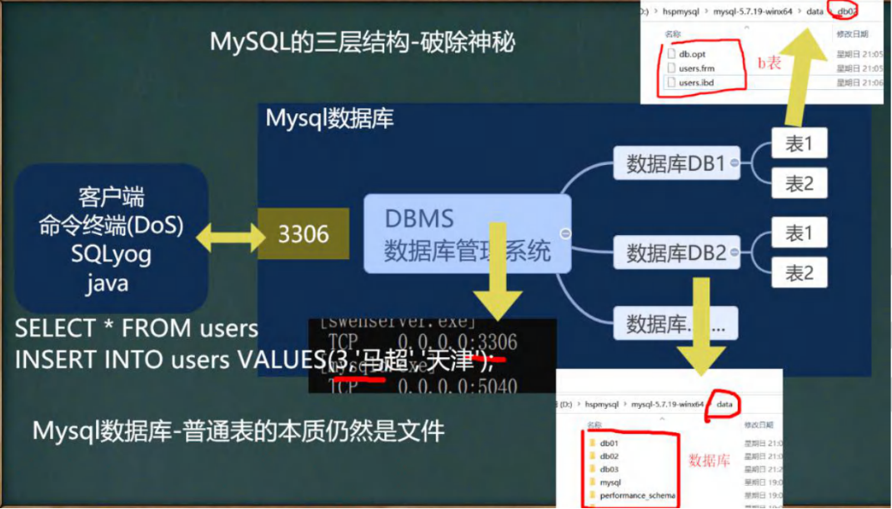


### 数据在数据库中的存储方式

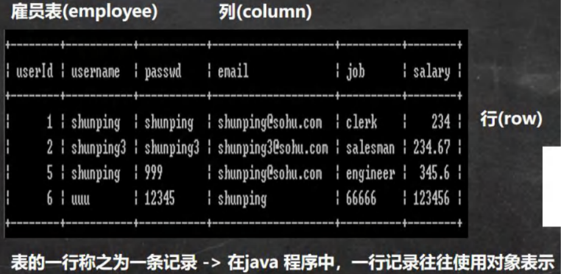


### SQL语句分类

- DDL:数据定义语句[create表，库...]
- DML:数据操作语句[增加insert,修改update，删除delete]
- DQL:数据查询语句[select ]
- DCL:数据控制语句[管理数据库:比如用户权限grant revoke ]


### 创建数据库

```sql
#演示数据库的操作
# 创建一个名称为frx_db01的数据库。[图形化和指令 演示]

CREATE DATABASE IF NOT EXISTS db_name;
#使用指定创建数据库
CREATE DATABASE frx_db01;

#删除数据库
DROP DATABASE frx_db01;

# 创建一个使用utf8字符集的frx_db02数据库
CREATE DATABASE frx_db02  CHARACTER SET utf8

# 创建一个使用utf8字符集，并带校队规则的frx_db03数据库
CREATE DATABASE frx_db03 CHARACTER SET utf8 COLLATE utf8_bin
# 校对规则 utf8_bin 区分大小写 默认utf8_general_ci 不区分大小写
# 如果数据库下面的表没有指定字符集和校对规则，以它的数据库校对规则为准
# 下面是一条SQL语句，select 查询 * 表示所有字段
SELECT * FROM t1 
WHERE NAME='tom'
```


### 查看、删除数据库

```sql
# 演示删除和查询数据库
# 查看当前数据库服务器中的所有数据库
SHOW DATABASES

#查看前面创建的frx_db01数据库的定义信息
SHOW CREATE DATABASE frx_db01

#说明 在创建数据库，表的时候，为了规避关键字，可以使用反引号解决
CREATE DATABASE `CREATE`

#删除前面创建的frx_db01数据库
DROP DATABASE frx_db01

```


### 备份恢复数据库

```sql
#练习：database03.sq1 备份hsp_db02 和 hsp_db03 库中的数据，并恢复

#备份，要在Dos下执行mysqldump指令其实在mysql安装目录\bin
#这个备份文件，就是对应的sql语句
mysqldump -u root -p -B frx_db02 frx_db03 >d:\\bak.sql

DROP DATABASE frx_db03;

#恢复数据库(注意：使用 mysql -u root -p  进入Mysql命令行执行)
source d:\\bak.sql
#第二个恢复方法，直接将bak.sql的内容放到查询编辑器中，执行
```


### 创建表

```sql
CREATE TABLE table_name
(
    field1 datatype,
    field2 datatype
)CHARACTER SET 字符集 COLLATE 校对规则 ENGINE 存储引擎
#指令创建表
#注意：hsp_db02创建表时，要根据需保存的数据创建相应的列，并根据数据的类型定义相应的列类
#id           整形
#name         字符串
#password     字符串
#birthday     日期
CREATE TABLE `USER`(
	id INT,
	`name` VARCHAR(255),
	`password` VARCHAR(255),
	`birthday` DATE)
	CHARACTER SET utf8 COLLATE utf8_bin ENGINE INNODB;

```


### MySQL常用数据类型（列类型）


## MySQL-CURD

### 数据库 CURD 语句

```sh
# 创建（Create）、更新（Update）、读取（Read）和删除（Delete）
```

1. **Insert语句 (添加数据)**
2. **Update语句 (更新数据)**
3. **Delete语句 (删除语句)**
4. **Select语句 (查找语句)**


### INSERT 语句

- **基本语法**

```sh
# INSEET INTO table_name [(column [, column... ])]
# VALUES (value [, value...]);
```


```sql
# 练习insert语句
-- 创建一张商品表 goods(id int,goods_name varchar(10),price double);
-- 添加2条记录
CREATE TABLE goods(
	id INT,
	goods_name VARCHAR(10),
	price DOUBLE);
-- 添加数据
INSERT INTO goods( id,goods_name,price)
	VALUES(10,'华为手机',2000);

INSERT INTO goods(id,goods_name,price)
	VALUES(20,'苹果手机',3000);

SELECT * FROM goods

```


- **细节说明**

```sql
# 说明insert 语句的细节
-- 1.插入的数据应与字段的数据类型相同
-- 比如把'abc'添加到int 类型会错误
INSERT INTO `goods` (id,goods_name,price)
	VALUES('30','小米手机',2000);
	
-- 2.数据的长度应在列的规定范围内，例如：不能将一个长度为80的字符串加入到长度为40的列中。
INSERT INTO `goods` (id,goods_name,price)
	VALUES(40,'vivo手机vivo手机',3000);
	
-- 3.在values中列出的数据位置必须与被加入的列的位置相对应。
INSERT INTO `goods` (id,goods_name,price)
	VALUES('vivo手机',40,2000);
	
-- 4.字符和日期型数据应包含在单引号中。
INSERT INTO `goods` (id,goods_name,price)
	VALUES(40,'vivo手机',3000);
	
-- 5.列可以插入空值[前提是该字段允许为空],insert into table value(null)
INSERT INTO `goods` (id,goods_name,price)
	VALUES(40,'vivo手机',NULL);
	
-- 6.insert into tab_name(列名...) values (),(),() 形式添加多条记录
INSERT INTO `goods` (id,goods_name,price)

	VALUES(40,'三星手机',2300), VALUES(40,'海尔手机',1800);
-- 7.如果是给表中的所有字段添加数据，可以不写前面的字段名称
INSERT INTO `goods` VALUES (45,'华为手机',1500);

-- 8.默认值的使用，当不给某个字段值时，如果有默认值就会添加，否则报错
--   如果某个字段没有指定 not null,那么当添加数据时，没有给定值，则会给默认值
--   如果我们希望指定某个列默认值，
INSERT INTO `goods` (id,goods_name)
	VALUES (80,'格力手机');
SELECT * FROM goods;
INSERT INTO `goods2` (id,goods_name)
	VALUES (80,'格力手机');
SELECT * FROM goods2;

```


### UPDATE 语句

- **基本语法**

```sh
# UPDATE tab1_name 
#   set col_name1 = expr1 [, col_name2 = expr2 ...]
#   [where where_definition]
```


```sql
-- 演示update语句
-- 要求：在上面创建的employee表中修改表中的记录

-- 1.将所有员工薪水修改为5000元[如果没有带where条件，会修改所有的记录，因此要小心]
UPDATE employee SET salary =5000

-- 2.将姓名为 小妖怪 的员工薪水修改为3000元
UPDATE employee 
	SET salary = 3000 
	WHERE user_name='小妖怪';
	
-- 3.将老妖怪 的薪水在原有基础上增加1000元
INSERT INTO employee 
	VALUES(200,'老妖怪','男','2001-02-11','2021-01-05 10:10:10','寻路的',5000,'哈哈','e:\\b.jpg');
UPDATE employee
	SET salary=salary+1000
	WHERE user_name='老妖怪';
	
-- 可以修改多个列
UPDATE employee
	SET salary=salary+1000,job='出主意'
	WHERE user_name='老妖怪';
SELECT * FROM employee;

```


- **使用细节**

1. UPDATE语法可以用新值更新原有表行中的各列。
2. SET子句指示要修改哪些列和要给予哪些值。
3. WHERE子句指定应更新哪些行。如没有WHERE子句,则更新所有的行(记录)，因此老师提醒一定小心。
4. 如果需要修改多个字段,可以通过set字段1=值1,字段2=值2.…


### DELETE 语句

- **基本语法**

```sh
# DELETE FROM tab1_name 
#   [where where_definition]
```


```sql
 -- delete 语句演示
 -- 删除表中名称为'老妖怪'的记录
 DELETE FROM employee
	WHERE user_name='老妖怪'
	
 -- 删除表中所有记录
 DELETE FROM employee;
 
 -- delete语句不能删除某一列的值(可使用update 设为null或者'')
 UPDATE employee SET job ='' WHERE user_name='老妖怪';
 SELECT * FROM employee;
 
 -- 要删除表 
 DROP TABLE employee;

```


- **使用细节**

1. 如果不使用where子句，将删除表中所有数据。
2. Delete语句不能删除某一列的值(可使用update设为null或者“ ”)
3. 使用delete语句仅删除记录，不删除表本身。如要删除表，使用drop table语句。drop table表名;


### SELECT 语句

- **基本语法**

```sh
# SELECT [DISTINCT] * | {column1, column2, column3, ...}
#        FROM table_name;
```


- **注意事项**

1. Select 指定查询哪些列的数据。
2. column指定列名。
3. *号代表查询所有列。
4. From指定查询哪张表。
5. DISTINCT可选，指显示结果时，是否去掉重复数据


```sql
-- select 语句
CREATE TABLE student(
	id INT NOT NULL DEFAULT 1,
	NAME VARCHAR(20) NOT NULL DEFAULT '',
	chinese FLOAT NOT NULL DEFAULT 0.0,
	english FLOAT NOT NULL DEFAULT 0.0,
	math FLOAT NOT NULL DEFAULT 0.0);
INSERT INTO student(id,NAME,chinese,english,math) VALUES(1,'jack',89,78,90);
INSERT INTO student(id,NAME,chinese,english,math) VALUES(2,'张飞',67,98,56);
INSERT INTO student(id,NAME,chinese,english,math) VALUES(3,'宋江',87,78,77);
INSERT INTO student(id,NAME,chinese,english,math) VALUES(4,'关羽',85,78,90);
INSERT INTO student(id,NAME,chinese,english,math) VALUES(5,'赵云',89,78,94);
INSERT INTO student(id,NAME,chinese,english,math) VALUES(6,'欧阳锋',69,76,90);
INSERT INTO student(id,NAME,chinese,english,math) VALUES(7,'黄蓉',59,73,96);

SELECT * FROM student

-- 查询表中所有学生的信息
SELECT * FROM student;

-- 查询表中所有学生的姓名和对应的英语成绩
SELECT `name`,english FROM student;

-- 过滤表中重复数据 distinct
SELECT DISTINCT english FROM student;

-- 要查询的记录，每个字段都相同，才会去重
SELECT DISTINCT `name`,english FROM student;

```


- **使用表达式对查询的列进行运算**

```sh
# SELECT [DISTINCT] * | {column1 | expression,column2,|expression...}
#        FROM table_name;
```


- **在SELECT语句中可以使用 AS 语句**

```sh
# SELECT column_name AS 别名 FROM table_name
```


```sql
-- select 语句使用
-- 统计每个学生的总分
SELECT `name`,(chinese+english+math) FROM student;

-- 在所有学生总分加10分的情况
SELECT `name`,(chinese+english+math+10) AS total_score FROM student;
-- 使用别名表示学生分数

SELECT `name` AS '名字',(chinese+english+math) AS total_score FROM student;

SELECT `name`,(chinese+english+math)*1.6 AS total_score FROM student
 WHERE `name`='赵云';

SELECT `name`,(chinese+english+math) AS total_score FROM student
 WHERE `name`='关羽';
 
 
SELECT `math` AS`Math` FROM student

```


- **在where字句中经常使用的运算符**

```sql
-- select语句
-- 查询姓名为赵云的学生成绩
SELECT * FROM student
	WHERE `name`='赵云'

-- 查询英语成绩大于90分的同学
SELECT * FROM student
	WHERE english>90
	
-- 查询总分大于200分的所有同学
SELECT * FROM student
	WHERE (chinese+english+math)>200
	
-- 查询math大于60 并且(and) id大于4的学生成绩
SELECT * FROM student
	WHERE math>60 AND id>4
	
-- 查询英语成绩大于语文成绩的同学
SELECT * FROM student
	WHERE english>chinese
	
-- 查询总分大于200 分并且数学成绩小于语文成绩 的姓张的学生
-- % ：表示任意0个或多个字符
-- _ ： 表示任意单个字符
SELECT * FROM student
	WHERE (chinese+math+english)>200 AND 
	math<chinese AND `name` LIKE'张%';
	
-- 查询英语分数为80-90之间的同学
SELECT * FROM student
	WHERE english>=80 AND english<=90
	
-- 查询数学分数为89，90，91的同学
SELECT * FROM student
	WHERE math IN(89,90,91);
	
-- 查询所有姓李的学生
SELECT * FROM student
	WHERE `name` LIKE '李%';

```


- **使用 ORDER BY 子句排序查询结果**

```sh
# SELECT column1, column2, ...
# FROM table
# ORDER BY column1 ASC | DESC, ...
```

> ```
> ASC 升序[默认] DESC 降序
> ORDER BY 子句应该位于 SELECT 语句的结尾
> ```


```sql
-- 演示order by使用
-- 对数学成绩排序后输出【升序】
SELECT * FROM student
	ORDER BY math;
	
-- 对总分按从高到低的顺序输出[降序]
SELECT  `name`,(chinese+math+english) AS total_score FROM student
	ORDER BY total_score DESC;
	
-- 对姓李的学生成绩排序输出(升序)
SELECT `name`,(chinese+math+english) AS total_score FROM student
	WHERE `name` LIKE '李%'
	ORDER BY total_score;

```


## MySQL-函数

### 合计/统计函数

#### COUNT

```sh
# Select count(*) | count(列名) from table_name [WHERE where_definition]
# SELECT COUNT(DISTINCT column_name) FROM table_name
```


```sql
-- 演示mysql的统计函数的使用
-- 统计一个班级有多少学生
SELECT COUNT(*) FROM student;

-- 统计数学成绩大于90的学生有多少个
SELECT COUNT(*) FROM student
	WHERE math>90
	
-- 统计总分大于250的人数有多少
SELECT COUNT(*) FROM student
	WHERE (chinese+math+english)>250;
	
-- count(*)和count(列)的区别
-- 解释：conut(*)返回满足条件记录的总行数
-- count(列)：统计满足条件的某列有多少个，但是会排除为 null
CREATE TABLE t15(
	`name` VARCHAR(15));
INSERT INTO t15 VALUES('tom');
INSERT INTO t15 VALUES('jack');
INSERT INTO t15 VALUES('mary');
INSERT INTO t15 VALUES(NULL);

SELECT * FROM t15;

SELECT COUNT(*) FROM t15;-- 4
SELECT COUNT(`name`) FROM t15; -- 3

```


#### SUM

```sh
# SELECT SUM(column_name1), {SUM(...)} FROM table_name WHERE ...
```


```sql
-- 演示sum函数的使用
-- 统计一个班级数学总成绩
SELECT SUM(math) FROM student;
-- 统计一个班级语文、英语、数学各科的总成绩
SELECT SUM(chinese),SUM(math),SUM(english) FROM student;
-- 统计一个班级语文、英语、数学各科的总成绩
SELECT SUM(chinese+math+english) AS total_score FROM student
-- 统计一个班级语文成绩平均分
SELECT SUM(chinese)/COUNT(*) FROM student;

```


#### AVG

```sh
# AVG函数返回满足where条件的一列的平均值

# SELECT AVG(列名) {AVG(列名)...} from tablename [WHERE where_definition]
```


```sql
-- 演示avg的使用
-- 求一个班级数学平均分
SELECT AVG(math) FROM student;
-- 求一个班级总分平均分
SELECT AVG(chinese+math+english) FROM student;

```


#### MAX/MIN

```sh
# MAX/MIN 返回满足where条件的一列的最大/最小值
# SELECT MAX(列名) from tablename [WHERE where_definition]
```


```sql
-- 演示max和min的使用
-- 求班级最高分和最低分(数值范围在统计中特别有用)
SELECT MAX(math+chinese+english) FROM student;

	
-- 求出班级数学最高分和最低分
SELECT MAX(math),MIN(math) 
	FROM student;

```


#### GROUP BY

```sh
# SELECT column1, column2, .. FROM table GROUP BY column1
```


#### HAVING

```sql
CREATE TABLE dept( /*部门表*/
deptno MEDIUMINT   UNSIGNED  NOT NULL  DEFAULT 0,
dname VARCHAR(20)  NOT NULL  DEFAULT "",
loc VARCHAR(13) NOT NULL DEFAULT ""
) ;
INSERT INTO dept VALUES
	(10,'ACCOUNTING','NEW YORK'),
	(20,'RESEARCH','DALLAS'),
	(30,'SALES','CHICAGO'),
	(40,'OPERATIONS','BOSTON');
SELECT * FROM dept;


-- 员工表
# 创建表EMP成员
CREATE TABLE emp
(empno  MEDIUMINT UNSIGNED  NOT NULL  DEFAULT 0, /*编号*/
ename VARCHAR(20) NOT NULL DEFAULT "", /*名字*/
job VARCHAR(9) NOT NULL DEFAULT "",/*工作*/
mgr MEDIUMINT UNSIGNED ,/*上级编号*/
hiredate DATE NOT NULL,/*入职时间*/
sal DECIMAL(7,2)  NOT NULL,/*薪水*/
comm DECIMAL(7,2) ,/*奖金*/
deptno MEDIUMINT UNSIGNED NOT NULL DEFAULT 0 /*部门编号*/
) ;

-- 添加测试数据
INSERT INTO emp VALUES
	(7369, 'SMITH', 'CLERK', 7902, '1990-12-17', 800.00,NULL , 20), 
	(7499, 'ALLEN', 'SALESMAN', 7698, '1991-2-20', 1600.00, 300.00, 30), 
	(7521, 'WARD', 'SALESMAN', 7698, '1991-2-22', 1250.00, 500.00, 30), 
	(7566, 'JONES', 'MANAGER', 7839, '1991-4-2', 2975.00,NULL,20), 
	(7654, 'MARTIN', 'SALESMAN', 7698, '1991-9-28',1250.00,1400.00,30),
	(7698, 'BLAKE','MANAGER', 7839,'1991-5-1', 2850.00,NULL,30), 
	(7782, 'CLARK','MANAGER', 7839, '1991-6-9',2450.00,NULL,10), 
	(7788, 'SCOTT','ANALYST',7566, '1997-4-19',3000.00,NULL,20), 
	(7839, 'KING','PRESIDENT',NULL,'1991-11-17',5000.00,NULL,10),
	(7844, 'TURNER', 'SALESMAN',7698, '1991-9-8', 1500.00, NULL,30), 
	(7900, 'JAMES','CLERK',7698, '1991-12-3',950.00,NULL,30), 
	(7902, 'FORD', 'ANALYST',7566,'1991-12-3',3000.00, NULL,20), 
	(7934,'MILLER','CLERK',7782,'1992-1-23', 1300.00, NULL,10);
	
	SELECT * FROM emp;

-- 工资级别表
CREATE TABLE salgrade
(
grade MEDIUMINT UNSIGNED NOT NULL DEFAULT 0,
losal DECIMAL(17,2)  NOT NULL,
hisal DECIMAL(17,2)  NOT NULL
);

#测试数据
INSERT INTO salgrade VALUES (1,700,1200);
INSERT INTO salgrade VALUES (2,1201,1400);
INSERT INTO salgrade VALUES (3,1401,2000);
INSERT INTO salgrade VALUES (4,2001,3000);
INSERT INTO salgrade VALUES (5,3001,9999);	

SELECT * FROM salgrade;

# 演示group by+having
GROUP BY 用于对查询结果分组统计，
-- having子句用于限制分组显示结果
-- 如何显示每个部门的平均工资和最高工资
# 按照部门来分组查询
SELECT AVG(sal),MAX(sal),deptno
	FROM emp GROUP BY deptno;
	
-- 显示每个部门的每种岗位的平均工资和最低工资
-- 1.显示每个部门的平均工资和最低工资
-- 2.显示每个部门的每种岗位的平均工资和最低工资
SELECT AVG(sal),MIN(sal),deptno,job
	FROM emp GROUP BY deptno,job;
	
-- 显示平均工资低于2000的部门号和他的平均工资
-- 1.显示各个部门的平均工资和部门号和它的平均工资
-- 2.在1的结果基础上，进行过滤，保留 avg(sal)<2000
-- 3.使用别名进行过滤
SELECT AVG(sal),deptno
	FROM emp GROUP BY deptno
	HAVING AVG(sal)<2000;
	
-- 使用别名 
SELECT AVG(sal) AS avg_sal,deptno
	FROM emp GROUP BY deptno
		HAVING avg_sal<2000;

```


### 字符串相关函数

```sql
-- 演示字符串相关函数的使用
-- CHARSET(str) 返回字串字符集
SELECT CHARSET(ename) FROM emp;

-- CONCAT(string2 [,....]) 连接字串
SELECT CONCAT(ename,' 工作是',job) FROM emp;

-- INSTR (string,substring )返回substring在string中出现的位置，没有返回0
-- dual 亚元表，系统表 可以作为测试表使用
SELECT INSTR('hanshunping','ping')FROM DUAL;

-- UCASE(string2) 转换成大写
SELECT UCASE(ename)FROM emp;

-- LCASE(string2) 转换成小写
SELECT LCASE(ename) FROM emp;

-- LEFT (string2,length) 从string2中的左边起取length个字符
-- RIGTH(string2,length)
SELECT LEFT(ename,2) FROM emp;

-- LENGTH (string) string 长度[按照字节]
SELECT LENGTH(ename) FROM emp;

-- REPLACE (str,serch_str,replace_str)
-- 在str中用replace_str替换search_str
-- 如果是manager 就替换成经理
SELECT ename,REPLACE(job,'MANAGER','经理') FROM emp;

-- STRCMP(string1,string2) 涿字符比较俩字串大小
SELECT STRCMP('hsp','Jsp')FROM DUAL;

-- SUBSTRING(str,position [length]) 
-- 从str的position开始【从1开始计算】，取length个字符
-- 从ename列的第一个位置 开始取出2个字符
SELECT SUBSTRING(ename,1,2)FROM emp;

-- LTRTM(string2)RTRIM(string2) TRIM(string)
-- 去除前段空格后端空格
SELECT LTRIM(' 韩顺平教育')FROM DUAL;
SELECT RTRIM('韩顺平教育 ')FROM DUAL;
SELECT TRIM(' 韩顺平教育 ')FROM DUAL;


```


### 数学相关函数

```sql
-- 演示数学相关函数

-- ABS(num) 绝对值
SELECT ABS(10) FROM DUAL;

-- BIN(decimal_number)   十进制转二进制
SELECT BIN(10) FROM DUAL;

-- CEILING(number2 )向上取整 ，得到比num2 大的最小整数
SELECT CEILING(1.1) FROM DUAL;

-- CONV(number2,from_base,to base)  进制转化
-- 下面的含义是 8 是十进制的8 转成2进制输出
SELECT CONV(8,10,2) FROM DUAL;

-- 下面的含义是 16 是十六进制的16 转成10进制输出
SELECT CONV(16,16,10) FROM DUAL;

-- FLOOR(number2)    向下取整，得到比 num2小的最大整数
SELECT FLOOR(-1.1) FROM DUAL;

-- FORMAT (number,decial_places) 保留小数位数,四舍五入
SELECT FORMAT(78.125458,2) FROM DUAL;

-- HEX(DeciamlNumber )转十六进制
SELECT HEX(5) FROM DUAL;

-- LEAST(number,number2[...]) 求最小值
SELECT LEAST(0,1,-10,4) FROM DUAL;

-- MOD(nuerator,denominator)  求余
SELECT MOD(10,3) FROM DUAL;

-- RAND([seed]) RAND([seed])  返回随机数 其范围为 0<=v<=1.0
-- 如果使用rand() 每次返回不同的随机数，在0<=v<=1.0,如果seed不变，该随机数也不变了
SELECT RAND() FROM DUAL;


```


### 日期事件相关函数

```sql
-- 日期时间相关函数

-- CURRENT_DATE( )        当前日期
SELECT CURRENT_DATE FROM DUAL;

-- CURRENT_TIME( )        当前时间
SELECT CURRENT_TIME FROM DUAL;

-- CURRENT_TIMESTAMP( )   当前时间戳
SELECT CURRENT_TIMESTAMP() FROM DUAL;

-- 创建测试表 信息表
CREATE TABLE mes(
	id INT,
	content VARCHAR(30),
	send_time DATETIME);


-- 添加一条记录
INSERT INTO mes
	VALUES(1,'北京新闻',CURRENT_TIMESTAMP());

INSERT INTO mes VALUE(2,'上海新闻',NOW());
INSERT INTO mes VALUE(3,'广州新闻','2020-11-11');
	

SELECT *FROM mes;
SELECT NOW() FROM DUAL;

-- 上应用案例
-- 显示所有新闻信息，发布日期只显示日期，不用显示时间
SELECT id,content,DATE(send_time)
	FROM mes;
	
-- 请查询在10分钟内发布的帖子
SELECT  * FROM mes -- 发送时间加上10分钟 开是否大于或等于当前时间
	WHERE DATE_ADD(send_time,INTERVAL 10 MINUTE)>=NOW()
	
SELECT * FROM mes --  现在时间减去10分钟 看是否在发送时间之前
	WHERE send_time>= DATE_SUB(NOW(),INTERVAL 10 MINUTE)
	

-- 请在mysql的sql语句中求出 2011-11-11 和 1990-1-1 相差多少天
SELECT DATEDIFF('2011-11-11','1990-01-01') FROM DUAL;

-- 请用mysql的 sql语句求出你活了多少天？[练习]
SELECT DATEDIFF('2021-08-11','2001-01-01') FROM DUAL

-- 如果你能活80岁，求出你还能活多少天
-- year可以是年月日时分秒都行 ，'2001-01-05'可以是date,datetime timestamp
SELECT DATEDIFF(DATE_ADD('2001-01-05',INTERVAL 80 YEAR),NOW()) FROM DUAL

SELECT TIMEDIFF('10:11:11','06:10:10') FROM DUAL;

-- YEAR|Month|DAY|DATE|(datetime)
SELECT YEAR(NOW()) FROM DUAL;
SELECT MONTH(NOW()) FROM DUAL;
SELECT DAY(NOW()) FROM DUAL;
SELECT YEAR('2013-11-10') FROM DUAL;

-- unix_timestamp()1970-1-1 到现在的秒数
SELECT UNIX_TIMESTAMP()/(24*3600*365) FROM DUAL;

-- FROM_UNIXTIME()  可以把一个unix_timestamp秒数，转成指定格式的日期

-- %Y-%m-%d 格式是规定好的，表示年月日
SELECT FROM_UNIXTIME(1618483484,'%Y-%m-%d') FROM DUAL;
SELECT FROM_UNIXTIME(1618493484,'%Y-%m-%d %H:%i:%s')FROM DUAL;
-- 意义：在开发中，可以存放一个整数，然后表示时间，通过FROM_UNIXTIME转换


```


### 加密和系统函数

```sql
-- 演示加密函数和系统函数

-- USER()  查询用户
-- 可以查看登录到mysql的有哪些用户，以及登录的ip
SELECT USER() FROM DUAL; -- 用户@ip地址

-- DATABASE() 查询当前使用数据库名称
SELECT DATABASE();

-- MD5(str)   为字符串算出一个 MD5 32的字符串，常用(用户密码)加密
-- root 密码是 hsp -> 加密md5 ->在数据库中存放的是加密后的密码
SELECT MD5('hsp') FROM DUAL;
SELECT LENGTH(MD5('hsp')) FROM DUAL;

-- 演示用户表，存放密码时，是md5
CREATE TABLE users(
	id INT,
	NAME VARCHAR(32) NOT NULL DEFAULT'',
	pwd CHAR(32) NOT NULL DEFAULT '');

INSERT INTO users
	VALUES(100,'冯荣旭',MD5('hsp'));
	
SELECT *FROM users;

SELECT * FROM users -- SQL 注入问题
	WHERE `name`='冯荣旭' AND pwd =MD5('hsp')
	
-- PASSWORD(str) -- 加密函数，MySQL数据库的用户密码就是 PASSWORD函数加密

SELECT PASSWORD('hsp') FROM DUAL;

-- select * from mysql.user \G 从原文密码str 计算并返回密码字符串
-- 通常用于对mysql数据库的用户密码加密
-- mysql.user 表示  数据库.表
SELECT *FROM mysql.user


```


### 流程控制函数

```sql
 #演示流程控制语句
 
 # IF(expr1,expr2,expr3) 如果expr1为True,则返回expr2 否则返回expr3
 SELECT IF(TRUE,'北京','上海') FROM DUAL;
 
 #IFNULL(expr1,expr2)  如果expr1不为空null,则返回expr1,否则返回expr2
 SELECT IFNULL('jack','韩顺平教育') FROM DUAL;
 
 # SELECT CASE WHEN expr1 THEN expr2 WHEN expr3 THEN expr4 ELSE expr5 END;[类似多重分支]
 # 如果expr1 为TRUE,则返回expr2,如果 expr2 为t，返回 expr4,否则返回 expr5
 SELECT CASE 
	WHEN TRUE THEN 'jack' 
	WHEN FALSE THEN 'tom' 
	ELSE 'mary' END

-- 1.查询emp 表，如果comm 是null 则显示0.0
--  老师说明,判断是否为null 要使用 is null,判断不为空 使用 is not
SELECT ename,IF (comm IS NULL,0.0,comm)
	FROM emp;
SELECT ename,IFNULL(comm,0.0)
	FROM emp;
	
-- 2.如果emp 表的 job 是 CLERK 则显示职员，如果是 MANAGER 则显示经理
--   如果是SALESMAN 则显示 销售人员，其他正常显示
SELECT ename,(
	SELECT CASE
	WHEN job ='CLERK' THEN '职员' 
	WHEN job ='manager' THEN '经理' 
	WHEN job ='SALESMAN'THEN'销售人员'
	ELSE job END) AS 'job',job
	FROM emp;

```


## MySQL-多表查询

### 多表查询

> ```sh
> # 多表查询是指基于两个和两个以上的表查询.在实际应用中,查询单个表可能不能满足你的需求.
> ```


```sql
-- 多表查询
-- 显示雇员名，雇员工资及所在部门的名字【笛卡尔积】
SELECT * FROM salgrade
SELECT * FROM emp
SELECT * FROM dept
/*
   分析
   1.雇员名，雇员工资 来自 emp表
   2.部门的名字，来自dept表
   (1)从第一张表中，取出一行和第二张表的每一行进行组合，返回结果[含有两张表的所有列]
   (2)一共返回的记录数第一张表行数*第二张表的行数
   (3)这样多表查询默认处理返回的结果，称为【笛卡尔积】
   (4)解决这个多表的关键就是要写出正确的过滤条件 where
   3.当我们需要指定显示某个表的列时，需要 表.列名
   
   
*/
SELECT  ename,sal,dname,emp.deptno 
	FROM emp,dept
	WHERE emp.deptno=dept.deptno
-- 小技巧：多表查询的条件下不能少于 表的个数-1，否则会出现笛卡尔积

-- 如何显示部门号为10的部门名、员工名和工资
SELECT  ename,sal,dname,emp.deptno 
	FROM emp,dept
	WHERE emp.deptno=dept.deptno AND emp.deptno=10
	
-- 显示各个员工的姓名，工资，及其工资的级别
SELECT ename,sal,grade
	FROM emp,salgrade
	WHERE sal >= losal AND sal<=hisal;
	
-- 显示雇员名，雇员工资及所在部门的名字，并按部门排序
  SELECT ename,sal,dname,emp.deptno
		FROM emp,dept
		WHERE emp.deptno=dept.deptno
		ORDER BY emp.deptno DESC

```


- **自连接**

> ```sh
> # 自连接是指在同一张表的连接查询[将同一张表看做两张表].
> ```


```sql
-- 多表查询的 自连接

-- 思考题：显示公司员工名字和他的上级名字
SELECT *FROM emp
-- 分析：员工名字 在emp,上级的名字 emp
-- 员工和上级是通过 emp表的 mgr 列并联
-- 小结：1.把同一张表当做两张表来使用
--       2.需要给表取别名[表别名]
--       3.列名不明确，可以指定列的别名，列名 AS 列的别名
SELECT worker.ename AS '职员名',boss.ename AS '上级名'
	FROM emp worker,emp boss
	WHERE worker.mgr=boss.empno;

```


### MySQL表子查询

> ```sh
> # 子查询是指嵌入在其它 SQL 语句中的 SELETE 语句,也叫嵌套查询
> ```


```sh
# 单行子查询
# 单行子查询是指只返回一行数据的子查询语句
# 多行子查询
# 多行子查询指返回多行数据的子查询 ,使用关键字 in
```


```sql
-- 子查询的演示
-- 请思考：如何显示与SMITH 同一部门的所有员工

/*
  1.先查询到SMITH的部门号得到
  2.把上面的select语句当做一个子查询来使用
*/
SELECT deptno
	FROM emp
	WHERE ename='SMITH'
	
SELECT *
	FROM emp
	WHERE deptno =(
		SELECT deptno
		FROM emp
		WHERE ename='SMITH'
	)
-- 课堂练习：如何查询和部门10的工作相同的雇员的
--   名字、岗位、工资、部门号、但是不含10部门自己的

/*
   1.查询到10号部门有哪些工作
   2.把上面查询的结果当做子查询
*/
SELECT DISTINCT job 
	FROM emp
	WHERE deptno=10;
	
-- 下面语句完整
SELECT ename,job,sal,deptno
	FROM emp
	WHERE job IN (
		SELECT DISTINCT job 
		FROM emp
		WHERE deptno=10
	)AND deptno !=10

```


```sql
-- all 和 any 的使用

-- 请思考：显示工资比部门30的所有员工的工资高的员工的姓名、工资和部门号

SELECT ename,sal,deptno
	FROM emp
	WHERE sal> ALL(
		SELECT sal
		FROM emp
		WHERE deptno =30)
		
-- 可以这样写
SELECT ename,sal,deptno
	FROM emp
	WHERE sal> (
		SELECT MAX(sal)
		FROM emp
		WHERE deptno =30)
		

-- 请思考：如何显示工资比部门30的其中一个员工的工资高的员工的姓名、工资和部门号

SELECT ename,sal,deptno
	FROM emp
	WHERE sal> ANY(
		SELECT sal
		FROM emp
		WHERE deptno =30)
-- 可以这样写
SELECT ename,sal,deptno
	FROM emp
	WHERE sal> (
		SELECT MIN(sal)
		FROM emp
		WHERE deptno =30)

```


- **多列子查询**

> ```sh
> # 多列子查询是指查询返回多个列数据的子查询语句。
> ```


```sql
-- 多列子查询
-- 请思考如何查询与allen的部门和岗位完全相同的所有雇员(并且不含smith本人)
-- (字段1，字段2...)=(select 字段1 ，字段2 from...)

-- 分析：1.得到allen的部门和岗位

SELECT deptno,job
	FROM emp
	WHERE ename='ALLEN'
	
-- 分析：2.把上面的查询当做子查询来使用，并且使用多列子查询的语法进行匹配
SELECT * 	
	FROM emp
	WHERE (deptno,job)=(
		SELECT deptno,job
		FROM emp
		WHERE ename='ALLEN'
		)AND ename != 'ALLEN'
		
-- 请查询和宋江同学数学，英语，语文
-- 成绩完全相同的同学		
SELECT *
	FROM student
	WHERE (chinese,english,math)=(	
		SELECT chinese,english,math 
		FROM student
		WHERE `name`='宋江');

```


- **在 from 子句中使用子查询**

```sql
-- 子查询 练习

-- 请思考：查找每个部门工资高于本部门平均工资的人的资料
-- 这里要用到数据查询的小技巧，把一个子查询当做一个临时表使用

-- 1.先得到每个部门的 部门号和对应的平均工资
SELECT deptno,AVG(sal)
	FROM emp
	GROUP BY deptno
	
	
-- 2.把上面的结果当做子查询，和emp进行多表查询
SELECT  ename,sal,temp.avg_sal,emp.deptno
	FROM emp,(
		SELECT deptno,AVG(sal) AS avg_sal
		FROM emp
		GROUP BY deptno
		)temp
		WHERE emp.deptno=temp.deptno AND emp.sal>temp.avg_sal
		
-- 查找每个部门工资最高的人详细资料
SELECT  ename,sal,temp.max_sal,emp.deptno
	FROM emp,(
		SELECT deptno,MAX(sal) AS max_sal
		FROM emp
		GROUP BY deptno
		)temp
		WHERE emp.deptno=temp.deptno AND emp.sal=temp.max_sal
		
-- 查询每个部门的信息(包括：部门名，编号，地址)和人员数量
-- 1.部门名，编号，地址
-- 2.各个部门的数量
SELECT COUNT(*),deptno 
	FROM emp
	GROUP BY deptno
	
	
	
SELECT dname,dept.deptno ,loc,tmp.per_num AS '人数'
	FROM dept,(
		SELECT COUNT(*) AS per_num,deptno 
		FROM emp
		GROUP BY deptno
		) tmp
		WHERE tmp.deptno=dept.deptno
		
-- 还有一种写法 表.* 表示将该所有列都显示出来
-- 在多表查询中，当多个表的列不重复时，才可以直接写列名

SELECT tmp.* ,dname,loc
	FROM dept,(
		SELECT COUNT(*) AS per_num,deptno
		FROM emp
		GROUP BY deptno
		) tmp
		WHERE tmp.deptno=dept.deptno	


```


### 表复制

- **自我复制数据(蠕虫复制)**

```sql
-- 表的复制
-- 为了对某个sql语句进行效率测试，我们需要海量数据时，可以使用此法为表创建海量数据

CREATE TABLE my_tab01(
	id INT,
	`name` VARCHAR(32),
	sal DOUBLE,
	job VARCHAR(32),
	deptno INT);
DESC my_tab01
SELECT * FROM my_tab01

-- 演示如何自我复制
-- 1.先把emp表的记录复制到my_tab01
INSERT INTO my_tab01
	(id,`name`,sal,job,deptno)
	SELECT empno,ename,sal,job,deptno FROM emp;
	
-- 2.自我复制
INSERT INTO my_tab01
	SELECT * FROM my_tab01;
	
-- 如何删除一张表重复记录
-- 1.先创建一张表 my_tab02,
-- 2.让 my_tab02 有重复的记录

CREATE TABLE my_tab02 LIKE emp;-- 这个语句把emp表的结构(列)，复制到my_tab02

DESC my_tab02; 

INSERT INTO my_tab02
	SELECT * FROM emp;
	
SELECT * FROM my_tab02;
-- 3.考虑去重
/*
	(1)先创建一张临时表，my_tmp,该表的结构和 my_tab02一样
	(2)把my_tmp的记录通过 distinct关键字 处理后，把记录复制到my_tmp
	(3)清除掉my_tab02 记录
	(4)把 my_tmp 表的记录复制到my_tab02
	(5)drop 掉 临时表my_tmp
*/
DROP TABLE my_tmp
-- (1)先创建一张临时表，my_tmp,该表的结构和 my_tab02一样
CREATE TABLE my_tmp LIKE my_tab02
-- (2)把my_tmp的记录通过 distinct关键字 处理后，把记录复制到my_tmp
INSERT INTO my_tmp
	SELECT DISTINCT * FROM my_tab02
-- (3)清除掉my_tab02 记录
DELETE FROM my_tab02
-- (4)把 my_tmp 表的记录复制到my_tab02
INSERT INTO my_tab02
	SELECT * FROM my_tmp
-- (5)drop 掉 临时表my_tmp
DROP TABLE my_tmp

SELECT * FROM my_tab02


```


### 合并查询

- **介绍**

```sh
# 有时在实际应用中，为了合并多个select语句的结果，可以使用集合操作符号union , union all

# nuion all
# 该操作符用于取得两个结果集的并集。当使用该操作符时，不会取消重复行。
# union
# 该操作赋与union all相似,但是会自动去掉结果集中重复行。
```

```sql
-- 合并查询

SELECT ename,sal,job FROM emp WHERE sal>2500; -- 5

SELECT ename,sal,job FROM emp WHERE job='MANAGER'; -- 3

-- union all 就是将两个查询结果合并，不会去重
SELECT ename,sal,job FROM emp WHERE sal>2500
UNION ALL
SELECT ename,sal,job FROM emp WHERE job='MANAGER';-- 8

-- union  就是两个查询结果合并，会去重，不会出现同步记录
SELECT ename,sal,job FROM emp WHERE sal>2500
UNION 
SELECT ename,sal,job FROM emp WHERE job='MANAGER';-- 6

```


- **外连接**

1. 左外连接(如果左侧的表完全显示我们就说是左外连接) select...from 表1 left join 表2 on条件 [表1：左表 表2：右表]
2. 右外连接(如果右侧的表完全显示我们就说是右外连接) select...from 表1 rigth join 表2 on条件 [表1：左表 表2：右表]


```sql
-- 外连接
-- 比如:列出部门名称和这些部门的员工名称和工作，同时要求 显示出那些没有员工的部门

-- 使用我们学习过的多表查询的sql,看看效果

SELECT dname,ename,job 
	FROM emp,dept
	WHERE emp.deptno=dept.deptno
	ORDER BY dname
	
-- 先创建 stu
CREATE TABLE stu(
	id INT,
	`name` VARCHAR(32));
INSERT INTO stu VALUES(1,'Jack'),(2,'tom'),(3,'kity'),(4,'nono');
SELECT * FROM stu;

-- 创建exam
CREATE TABLE exam(
	id INT,
	grade INT);
INSERT INTO exam VALUES(1,56),(2,76),(11,8);
SELECT * FROM exam;


-- 使用左连接
-- (显示所有人的成绩，如果没有成绩，也要显示该人的姓名和id号，成绩显示为空)
SELECT `name`,stu.id,grade
	FROM stu,exam
	WHERE stu.id=exam.id;
	
-- 改成左外连接
SELECT `name`,stu.id,grade
	FROM stu LEFT JOIN exam
	ON stu.id=exam.id;
	
-- 使用右外连接(显示所有人的成绩，如果没有名字匹配，显示为空)
-- 即：右边的表(exam)和左表没有匹配的记录，也会把右表的记录显示出来
SELECT `name`,stu.id,grade
	FROM stu RIGHT JOIN exam
	ON stu.id=exam.id;

```


## MySQL-约束与自增长

### MySQL约束

- **基本介绍**

```sh
# 约束用于确保数据库的数据满足特定的商业规则。在mysql中，约束包括: 
# not null、unique,primary key,foreign key,和check五种。
```


### PRIMART KEY(主键)-基本使用

- **细节说明**

1. primary key不能重复而且不能为null。
2. 一张表最多只能有一个主键,但可以是复合主键主键的指定方式有两种
3. 直接在字段名后指定:字段名primakry key在表定义最后写primary key(列名);
4. 使用desc表名，可以看到primary key的情况.
5. 在实际开发中，每个表往往都会设计一个主键.


```sql
-- 主键使用


-- id name email
CREATE TABLE t17(
	id INT PRIMARY KEY,-- 表示id列是主键
	`name` VARCHAR(32),
	email VARCHAR(32));
	
-- 主键列的值是不可以为 空
INSERT INTO t17
	VALUES(1,'jack','jack@sohu.com')
INSERT INTO t17
	VALUES(2,'tom','tom@sohu.com')
INSERT INTO t17(
	VALUES(1,'frx','frx@sohu.com')
		
SELECT * FROM t17

-- 主键使用的细节讨论
-- primary key 不能重复且不能为null
INSERT INTO t17(
	VALUES(NULL,'frx','frx@sohu.com')
	
-- 一张表最多只能有一个主键，但可以是复合主键(比如 id+name)
-- 演示复合主键
CREATE TABLE t18(
	id INT ,
	`name` VARCHAR(32) ,
	email VARCHAR(32),
	PRIMARY KEY(id,`name`));-- 这里就是复合主键

INSERT INTO t18
	VALUES(1,'tom','tom@sohu.com');
INSERT INTO t18
	VALUES(1,'jack','jack@sohu.com');
SELECT * FROM t18

-- 主键的指定方式 有两种
-- 直接在字段名后指定：字段名 primary key
CREATE TABLE t19(
	id INT,
	`name` VARCHAR(32) PRIMARY KEY,
	email VARCHAR(32));
	
-- 在表定义最后写 primary key(列名);
CREATE TABLE t20(
	id INT,
	`name` VARCHAR(32) ,
	email VARCHAR(32),
	PRIMARY KEY(`name`));
	
-- 使用desc 表名，可以看到primary key的情况下
DESC t20 -- 查看t20 表的结果，显示约束情况
DESC t18

```


### NOT NULL和UNIQUE(唯一)

```sh
# NOT NULL 非空，当插入数据时，必须提供数据
# UNIQUE 唯一，该列不可重复，若没有指定 NOT NULL，则可以有多个 NULL
```


```sql
-- unique的使用

CREATE TABLE t21(
	id INT UNIQUE,-- 表示id列是不可以重复的
	`name` VARCHAR(32),
	email VARCHAR(32)
	);
	
INSERT INTO t21
	VALUES(1,'jack','jack@sohu.com');
INSERT INTO t21
	VALUES(1,'tom','tom@sohu.com');	
	
-- unique的使用细节
-- 1.如果没有指定 not null,则unique字段可以有多个null
-- 如果一个列(字段)，是unique not null 使用效果类似 primary key
INSERT INTO t21
	VALUES(NULL,'tom','tom@sohu.com');
-- 2.一张表可以有多个unique字段
CREATE TABLE t22(
	id INT UNIQUE,-- 表示id列是不可以重复的
	`name` VARCHAR(32) UNIQUE, -- 表示name不可以重复
	email VARCHAR(32)
	);
DESC t22

```


### FOREIGN KEY （外键）


```sql
-- 外键演示

-- 创建 主表 my_class
CREATE TABLE my_class(
	id INT PRIMARY KEY, -- 班级编号
	`name` VARCHAR(32) NOT NULL DEFAULT '');
	
-- 创建 从表 my_stu
CREATE TABLE my_stu(
	id INT PRIMARY KEY,-- 学生编号
	`name` VARCHAR(32) NOT NULL DEFAULT '',
	class_id INT, -- 学生所在班级编号 
	-- 下面指定外键关系
	FOREIGN KEY (class_id) REFERENCES my_class(id))
	
-- 测试数据
INSERT INTO my_class
	VALUES(100,'java'),(200,'web');
SELECT * FROM my_class	

INSERT INTO my_stu
	VALUES(1,'tom',100);
INSERT INTO my_stu
	VALUES(2,'jack',200);
INSERT INTO my_stu
	VALUES(4,'marry',NULL);	-- 可以。外键没有写 not null
INSERT INTO my_stu
	VALUES(3,'frx',300);-- 添加失败 300号班机不存在
SELECT * FROM my_stu
SELECT * FROM my_class

-- 一旦建立主外键关系，数据不能随意删除了
DELETE FROM my_class
	WHERE id=100 -- 没有任何一条记录指向 主表100,就可以删去

```


### check

```sql
-- 演示check的使用

-- mysql5.7目前还不支持check,只做语法校验，但不会生效

-- 测试
CREATE TABLE t23(
	id INT PRIMARY KEY,
	`name` VARCHAR(32),
	sex VARCHAR(6) CHECK (sex IN('man','woman')),
	sal DOUBLE CHECK(sal>1000 AND sal<2000));
	
-- 添加数据
INSERT INTO t23
	VALUES(1,'jack','mid',1);
SELECT * FROM t23

```


### 自增长


- **使用细节**

1. <span style="color: red">一般来说自增长是和primary key配合使用的</span>
2. <span style="color: red">自增长也可以单独使用[但是需要配合一个unique]</span>
3. <span style="color: red">自增长修饰的字段为整数型的(虽然小数也可以但是非常非常少这样使用)</span>
4. <span style="color: red">自增长默认从1开始,你也可以通过如下命令修改 [altertable表名auto increment=新的开始值] ;</span>
5. <span style="color: red">如果你添加数据时，给自增长字段(列)指定的有值，则以指定的值为准,如果指定了自增长，一般来说，就按照自增长的规则来添加数据</span>


```sql
-- 演示自增长的使用
-- 创建表
CREATE TABLE t24(
	id INT PRIMARY KEY AUTO_INCREMENT,
	email VARCHAR(32) NOT NULL DEFAULT '',
	`name` VARCHAR(32) NOT NULL DEFAULT '');
DESC t24

-- 测试自增长的使用
INSERT INTO t24
	VALUES(NULL,'jack@qq.com','jack')
	
INSERT INTO t24
	(email,`name`)VALUES('jack@qq.com','jack');

SELECT * FROM t24

-- 修改默认的自增长开始值
ALTER TABLE t25 AUTO_INCREMENT =100
CREATE TABLE t25(
	id INT PRIMARY KEY AUTO_INCREMENT,
	email VARCHAR(32) NOT NULL DEFAULT '',
	`name` VARCHAR(32) NOT NULL DEFAULT '');
INSERT INTO t25
	VALUES(NULL,'jack@qq.com','jack');
INSERT INTO t25
	VALUES(666,'jack@qq.com','jack');
INSERT INTO t25
	VALUES(NULL,'mary@qq.com','mary');
SELECT * FROM t25;

-- 如果指定了自增长，一般来说，就按照自增长的规则来添加数据

```


## MySQL-索引与事务

### MySQL索引（index）

#### 索引快速入门

1. 说起提高数据库性能,索引是最物美价廉的东西了。不用加内存，不用改程序,不用调sql，查询速度就可能提高百倍干倍。
2. 没有建立索引的字段，查询起来依旧很慢


#### 索引的原理

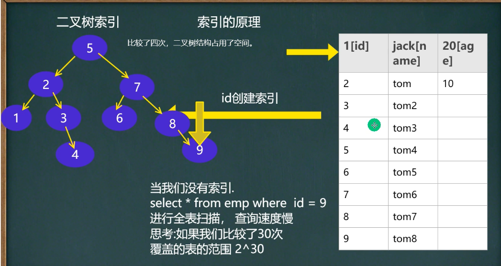


1. 没有索引为什么会慢?因为全表扫描.
2. 使用索引为什么会快?形成一个索引的数据结构，比如二叉树


- **索引的代价**

1. 磁盘占用
2. 对dml(update delete insert)语句的效率影响


#### 索引的类型


#### 索引的使用

- **添加索引**

```sql
-- 1.添加PRIMARY KEY（主键索引） 
ALTER TABLE `table_name` ADD PRIMARY KEY ( `column` ) 
-- 2.添加UNIQUE(唯一索引) 
ALTER TABLE `table_name` ADD UNIQUE ( 
`column` 
) 
-- 3.添加INDEX(普通索引) 
ALTER TABLE `table_name` ADD INDEX index_name ( `column` ) 
-- 4.添加FULLTEXT(全文索引) 
ALTER TABLE `table_name` ADD FULLTEXT ( `column`) 
-- 5.添加多列索引 
ALTER TABLE `table_name` ADD INDEX index_name ( `column1`, `column2`, `column3` )
```


- **删除索引**

```sql
-- 删除索引
DROP INDEX index_name ON `table_name`
ALTER TABLE `table_name` DROP INDEX index_name;

-- 删除主键索引
ALTER table `table_name` DROP PRIMARY KEY;
```


- **查询索引**

```sql
SHOW INDEX DROM table_name;

SHOW INDEXES DROM table_name;

SHOW KEYS FROM table_name;

DESC table_name
```


```sql
-- 演示mysql的索引的使用
-- 创建索引
CREATE TABLE t25(	
	id INT,
	`name` VARCHAR(32));
	
	
-- 查询表是否有索引
SHOW INDEXES FROM t25;

-- 添加索引
-- 添加唯一索引
CREATE UNIQUE INDEX id_index ON t25(id);

-- 添加普通索引方式1
CREATE INDEX id_index ON t25(id);

-- 如何选择
-- 1.如果某列的值，是不会重复的，则优先考虑使用unique索引,否则使用普通索引

-- 添加普通索引方式2
ALTER TABLE t25 ADD INDEX id_index(id)

-- 添加主键索引
CREATE TABLE t26(	
	id INT ,-- 1. primary key
	`name` VARCHAR(32));
-- 2.
ALTER TABLE t26 ADD PRIMARY KEY(id)

SELECT * FROM t26

-- 删除索引
SELECT * FROM t25
DROP INDEX id_index ON t25


-- 删除主键索引
ALTER TABLE t26 DROP PRIMARY KEY


-- 修改索引，先删除，在添加新的索引
-- 查询索引
-- 1.方式
SHOW INDEX FROM t25
-- 2.方式
SHOW INDEXES FROM t25
-- 3.方式
SHOW KEYS FROM t25
-- 4.方式
DESC t25

-- 创建一张订单表order (id号，商品名,订购人，数量).
-- 要求id号为主键，请使用2种方式来创建主键.
-- (提示:为练习方便，可以是order1 , order2 )
CREATE TABLE ORDER
	( id INT PRIMARY KEY,
	`goods_name` VARCHAR(32),
	person VARCHAR(32),
	num INT);-- 方式一
	
ALTER TABLE ORDER ADD PRIMARY KEY(id) -- 方式二

-- 创建一张特价菜谱表menu(id号，菜谱名,厨师，点餐人身份证，价格).
-- 要求id号为主键，点餐人身份证是unique请使用两种方式
-- 来创建unique.(提示:为练习方便，可以是menu1 , menu2

CREATE TABLE menu(
	id INT,
	`name` VARCHAR(32),
	 厨师 VARCHAR(32),
	身份证 CHAR(18) UNIQUE ,
	price DOUBLE); -- 方式一
CREATE UNIQUE INDEX 身份证 ON menu (身份证)
SHOW INDEX FROM menu


-- 创建一张运动员表sportman (id号，名字，特长).
-- 要求id号为主键，名字为普通索引，
-- 请使用2种方式来创建索引
-- (提示:为练习方便，可以是不同表名sportman1 , sportman2

CREATE TABLE sportman(
	id INT PRIMARY KEY,
	`name` VARCHAR(32),
	hobby VARCHAR(32));
	
CREATE INDEX name_index ON sportman(NAME) -- 方式一
ALTER TABLE sportman ADD INDEX name_index(NAME)-- 方式二

```


#### 哪些列适合使用索引

1. 较频繁的作为查询条件字段应该创建索引
2. 唯一性太差的字段不适合单独创建索引
3. 更新非常频繁的字段不适合创建索引
4. 不会出现在WHERE子句中字段不应该创建索引


### MySQL事务

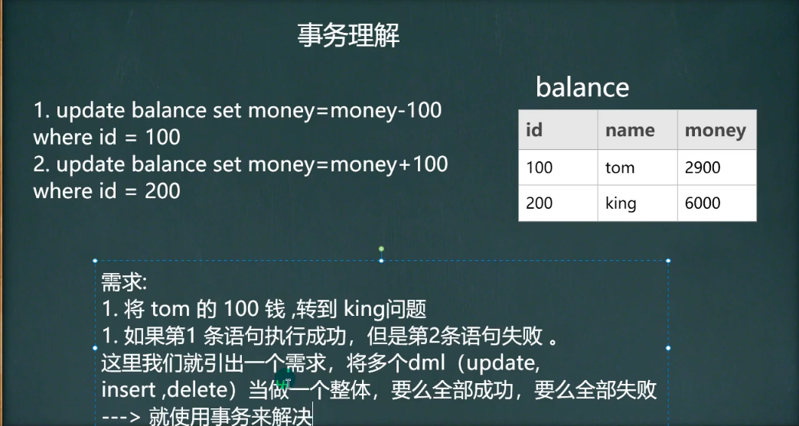


#### 什么是事务

```sh
# 事务用于保证数据的一致性,它由一组相关的dml语句组成,该组的dml语句要么全部成功，要么全部失败。如:转账就要用事务来处理,用以保证数据的一致性
```


#### 事务和锁

```sh
# 当执行事务操作时（DML语句），MySQL会在表上加锁，防止其他用户更改表的数据
```


- **基本操作**

```sql
-- 开始一个事务
START TRANSACTION;

-- 设置一个保存点
SAVEPOINT save_point_name;

-- 回退事务
ROLLBACK TO save_ponit_name;

-- 回退全部事务
ROLLBACK;

-- 提交事务，所有操作生效，不能回退
COMMIT;
```


```sql
-- 事务的一个重要的概念和具体操作
-- 演示
-- 1.创建一张测试表
CREATE TABLE t27(
	id INT,
	`name` VARCHAR(32));

-- 2.开始事务
START TRANSACTION
-- 3.设置保存点
SAVEPOINT a
-- 执行dml操作
INSERT INTO t27 VALUES(100,'tom');
SELECT * FROM t27;

SAVEPOINT b
-- 执行dml操作
INSERT INTO t27 VALUES(200,'jack');

-- 回退到b
ROLLBACK TO b
-- 继续回退 a
ROLLBACK TO a
-- 如果这样，表示直接回退到事务开始的状态
ROLLBACK
COMMIT 
```


#### 回退事务

在介绍回退事务前，先介绍一下保存点(savepoint).保存点是事务中的点.用于取消部分事务，当结束事务时(commit),会自动的删除该事务所定义的所有保存点.当执行回退事务时，通过指定保存点可以回退到指定的点。


#### 提交事务

使用commit语句可以提交事务.当执行了commit语句子后,会确认事务的变化、结金事除徨专野放锁数据生效。当使用commit语句结束事务子后，其它会话[其他连接]将可以查着到事务变化后的新数据[所有数据就正式生效.]


```sql
-- 讨论事务细节
-- 1.如果不开始事务，默认情况下，dml操作是自动提交的，不能回滚
INSERT	INTO t27 VALUES(300,'milan'); -- 自动提交commit

SELECT * FROM t27


-- 2.如果开始一个事务，你没有创建保存点.你可以执行rollback,
-- 默认就是回退到你事务开始的状态.
START	TRANSACTION
INSERT INTO t27 VALUES(400,'king');
INSERT INTO t27 VALUES(500,'scott')
ROLLBACK -- 表示直接回退到事务开始的状态

-- 3.你也可以在这个事务中(还没有提交时),创建多个保存点.
-- 比如: savepoint aaa;执行dml , savepoint bbb;


-- 4.你可以在事务没有提交前，选择回退到哪个保存点.

-- 5.mysql的事务机制需要innodb的存储引擎才可以使用,myisam不支持.
-- 6.开始一个事务start transaction, set autocommit=off;


```


### MySQL事务隔离级别

#### 事务隔离级别介绍

1. 多个连接开启各自事务操作数据库中数据时，数据库系统要负责隔离操作，以保证各个连接在获取数据时的准确性。（通俗解释)
2. 如果不考虑隔离性,可能会引发如下问题:
   - 脏读
   - 不可重复读
   - 幻读

- **介绍**

1. 脏读（dirty read）：当一个事务读取另一个事务尚未提交的改变（update，insert，delete），产生脏读
2. 不可重复读（nonrepeatable read）：同一查询在同一事务中多次进行，由于其他提事务所做的**修改**，每次返回不同的结果集
3. 幻读（phantom read）：同一查询结果在同一事务中多次进行，由于其他提交事务所作的**插入或删除**操作，每次返回不同的结果集


#### 事务隔离级别

| Mysql隔离级别(4种)        | 脏读 | 不可重复读 | 幻读 | 加锁读 |
| ------------------------- | ---- | ---------- | ---- | ------ |
| 读未提交(Read uncommited) | √    | √          | √    | 不加锁 |
| 读已提交(Read commited)   | ×    | √          | √    | 不加锁 |
| 可重复读(Repeatable)      | ×    | ×          | √    | 不加锁 |
| 可串行化(Serializable)    | ×    | ×          | ×    | 加锁   |


### 设置事务隔离级别

```sql
-- 查看当前会话隔离级别
select @@tx_isolation
-- mysql> select @@tx_isolation;
-- +-----------------+
-- | @@tx_isolation  |
-- +-----------------+
-- | REPEATABLE-READ |
-- +-----------------+
-- 1 row in set (0.00 sec)

-- 查看系统当前隔离级别
select @@global.tx_isolation;
-- mysql> select @@global.tx_isolation;
-- +-----------------------+
-- | @@global.tx_isolation |
-- +-----------------------+
-- | REPEATABLE-READ       |
-- +-----------------------+
-- 1 row in set (0.00 sec)

-- 设置当前会话隔离级别
set session transaction isolation level READ COMMITTED;
SET [SESSION | GLOBAL] TRANSACTION ISOLATION LEVEL {READ UNCOMMITTED | READ COMMITTED | REPEATABLE READ | SERIALIZABLE}

# SESSION：表示修改的事务隔离级别将应用于当前 session（当前 cmd 窗口）内的所有事务；
# GLOBAL：表示修改的事务隔离级别将应用于所有 session（全局）中的所有事务，且当前已经存在的 session 不受影响；
```

```sql
-- 演示mysql的事务隔离级别

-- 1.开启两个mysql的控制台
-- 2.查看当前mysql的隔离级别
SELECT @@tx_isolation;

-- mysql> SELECT @@tx_isolation;
-- +-----------------+
-- | @@tx_isolation  |
-- +-----------------+
-- | REPEATABLE-READ |
-- +-----------------+

-- 3.把其中一个控制台的隔离级别设置 Read uncommitted
SET SESSION TRANSACTION ISOLATION LEVEL READ UNCOMMITTED
-- mysql> SELECT @@tx_isolation;
-- +------------------+
-- | @@tx_isolation   |
-- +------------------+
-- | READ-UNCOMMITTED |
-- +------------------+
-- 1 row in set (0.00 sec)

-- 4.创建表
CREATE TABLE `account`(
	id INT,
	`name` VARCHAR(32),
	money INT);
	
	
-- 查看当前会话隔离级别
SELECT @@tx_isolation;
-- 查看系统当前隔离级别
SELECT @@ global.tx_isplation
-- 设置当前会话隔离级别
SET SESSION TRANSACTION ISOLATION LEVEL READ UNCOMMITTED
-- 设置系统当前隔离级别
SET GLOBAL TRANSACTION ISOLATION LEVEL [设置你想设置的级别]

```


- **演示脏读、不可重复读、幻读**

> ```
> 两个窗口，一个窗口进行查询，一个进行 增删改
> ```

**脏读**

```
设置窗口均为 读未提交
set session transaction isolation level READ UNCOMMITTED;
```

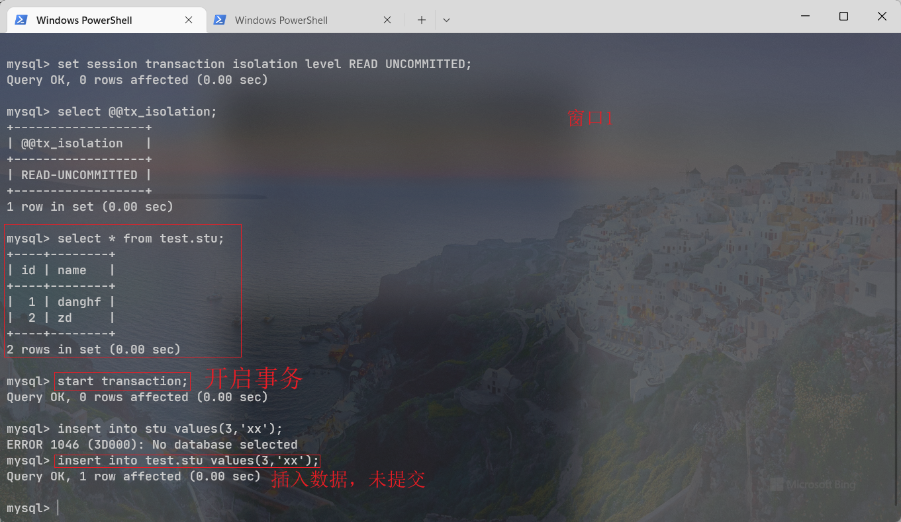


> ```
> 提升隔离级别后，不会出现
> ```


**不可重复读**


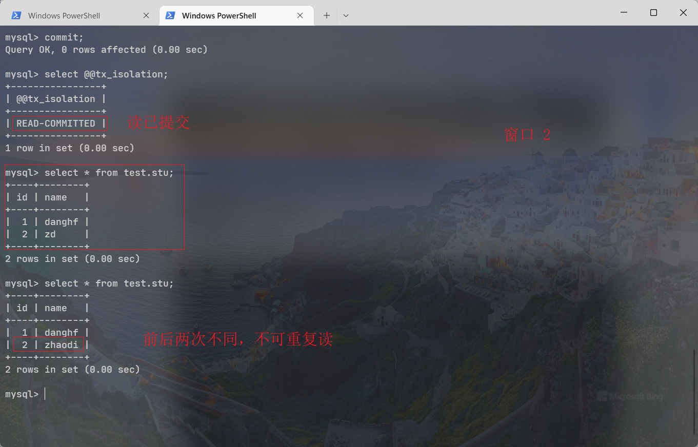


**解决不可重复读  -- 隔离级别设置可重复读**

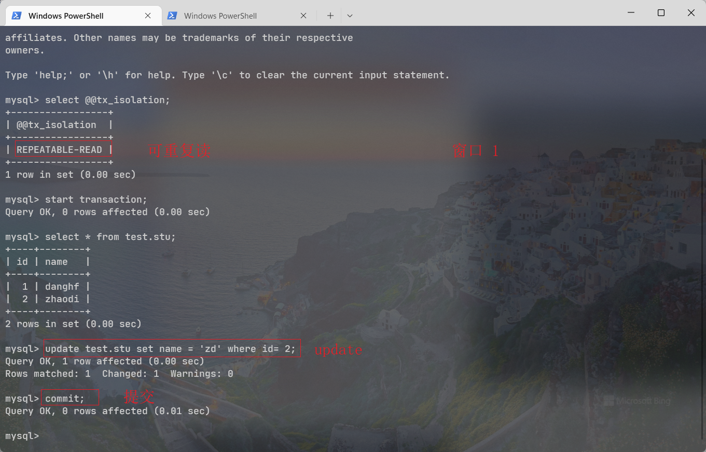


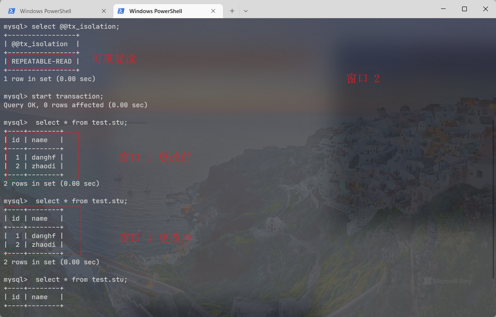


**幻读**

> ```
> MySQL的读已提交没有完全解决 幻读问题
> ```

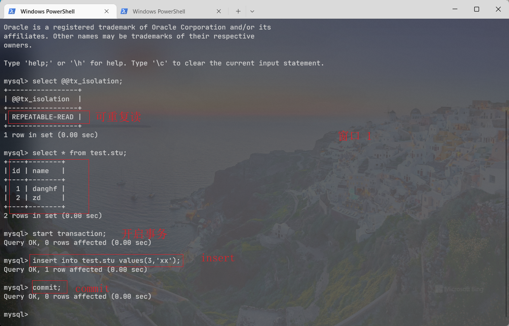


### MySQL事务 ACID

#### 事务的 ACID 特性

1. 原子性(Atomicity) 原子性是指事务是一个不可分割的工作单位，事务中的操作要么都发生，要么都不发生。
2. 一致性(Consistency) 事务必须使数据库从一个一致性状态变换到另外一个一致性状态
3. 隔离性(lsolation) 事务的隔离性是多个用户并发访问数据库时，数据库为每一个用户开启的事务，不能被其他事务的操作数据所干扰，多个并发事务之间要相互隔离。
4. 持久性(Durability) 持久性是指一个事务一旦被提交，它对数据库中数据的改变就是永久性的，接下来即使数据库发生故障也不应该对其有任何影响


## MySQL-表类型和存储引擎

- **基本介绍**

```
1、MySQL的表类型由存储引擎（Storage Engines）决定，主要包括MyISAM、InnoDB、Memory等
2、MySQL数据表主要主持六种类型，分别时：CSV、Memory、ARCHIVE、MYISAM、MRG_MYISAM、InnoDB
3、这六种又分为两类，一类是“事务安全型”，比如InnoDB。其余都属于第二类，称为“非事务安全型”
```

```sql
-- 显示当前数据库的支持的存储引擎
show engines;
```

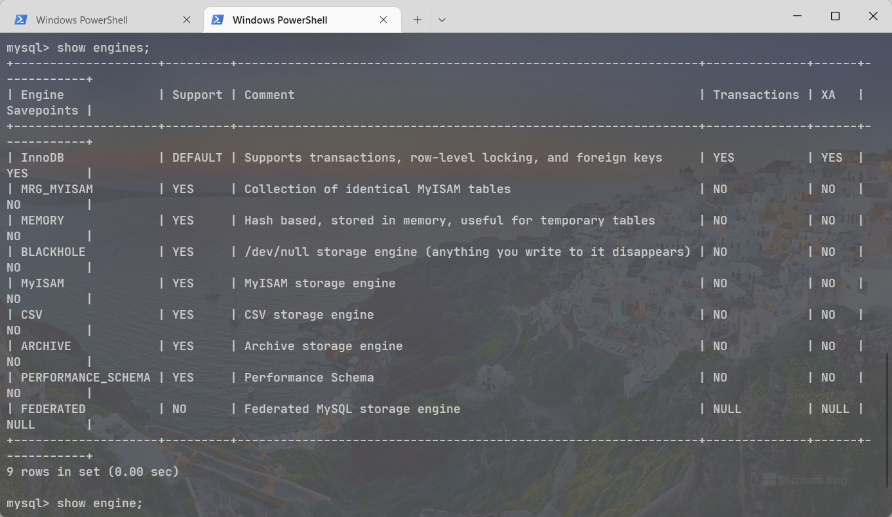


### 主要的存储引擎/表类型特点

| 特点           | Myism | InnoDB | Memory | Archive |
| -------------- | :---: | :----: | :----: | :-----: |
| 批量插入的速度 |  高   |   低   |   高   | 非常高  |
| 事务安全       |       |  支持  |        |         |
| 全文索引       | 支持  |        |        |         |
| 锁机制         | 表锁  |  行锁  |  表锁  |  行锁   |
| 存储限制       | 没有  |  64TB  |   有   |  没有   |
| B树索引        | 支持  |  支持  |  支持  |         |
| 哈希索引       |       |  支持  |  支持  |         |
| 集群索引       |       |  支持  |        |         |
| 数据缓存       |       |  支持  |  支持  |         |
| 索引缓存       | 支持  |  支持  |  支持  |         |
| 数据可压缩     | 支持  |        |        |  支持   |
| 空间使用       |  低   |   高   |  N/A   |   低    |
| 内存使用       |  低   |   高   |  中等  |   低    |
| 支持外键       |       |  支持  |        |         |


-  **细节说明**

1. MylSAM不支持事务、也不支持外键，但其访问速度快，对事务完整性没有要求。
2. InnoDB存储引擎提供了具有提交、回滚和崩溃恢复能力的事务安全。但是比起MylSAM存储引擎，InnoDB写的处理效率差一些并且会占用更多的磁盘空间以保留数据和索引。
3. MEMORY存储引擎使用存在内存中的内容来创建表。每个MEMORY表只实际对应-个磁盘文件。MEMORY类型的表访问非常得快，因为它的数据是放在内存中的，并且默认使用HASH索引。但是一旦MySQL服务关闭，表中的数据就会丢失掉,表的结构还在


```sql
-- 查看所有的存储引擎
SHOW ENGINES
-- innodb 存储引擎，是前面使用过
-- 1.支持事务 2.支持外键 3.支持行级锁

-- myisam 存储引擎
CREATE TABLE t28(
	id INT,
	`name` VARCHAR(32)) ENGINE MYISAM
	
-- 1.添加速度快 2.不支持外键和事务 3.支持表级锁

START TRANSACTION
SAVEPOINT t1
INSERT INTO t28 VALUES(1,'jack');
SELECT *FROM t28
ROLLBACK TO t1 -- 没有回滚成功


-- memory 存储引擎
-- 1.数据存储在内存中[关闭mysql服务，数据丢失，但是表结构还在] 
-- 2.执行速度很快(没有IO读写) 3.默认支持索引(hash表)
CREATE TABLE t29(
	id INT,
	`name` VARCHAR(32)) ENGINE MEMORY
	
INSERT INTO t29
	VALUES(1,'tom'),(2,'jack'),(3,'frx')
	
SELECT *FROM t29

-- 修改存储引擎
ALTER TABLE t29 ENGINE =INNODB

```


### 存储引擎的选择

1. 如果你的应用不需要事务，处理的只是基本的CRUD操作，那么MylSAN是不二选择,速度快
2. 如果需要支持事务，选择lnnoDB.
3. Memory存储引擎就是将数据存储在内存中，由于没有磁盘I./O的等待速度极快。但由于是内存存储引擎，所做的任何修改在服务器重启后都将消失。(经典用法 用户的在线状态().)


## MySQL-视图与管理

### 视图


#### 基本概念

1. 视图是一个虚拟表，其内容由查询定义。同真实的表一样，视图包含列,其数据来自对应的真实表(基表)
2. 视图和基表关系的示意图


#### 视图的基本使用

1. create view 视图名 as select 语句
2. alter view 视图名 as select语句  --更新成新的视图
3. SHOW CREATE VIEW 视图名
4. drop view视图名1,视图名2

```sql
-- 视图的使用
-- 创建一个视图 emp_view01,只能查询emp表的(emp、ename、job和deptno)信息

-- 创建视图
CREATE VIEW emp_view01
	AS
	SELECT empno,ename,job,deptno FROM emp;
	
-- 查看视图
DESC emp_view01

SELECT  * FROM emp_view01
SELECT empno,job FROM emp_view01;

-- 查看创建视图的指令
SHOW CREATE VIEW emp_view01
-- 删除视图
DROP VIEW emp_view01

mysql> show tables;
+----------------+
| Tables_in_test |
+----------------+
| stu            |
+----------------+
1 row in set (0.00 sec)

mysql> select * from stu;
+----+--------+
| id | name   |
+----+--------+
|  1 | danghf |
|  2 | zd     |
|  3 | xx     |
+----+--------+
3 rows in set (0.00 sec)

mysql> create view stu_view AS SELECT * from stu where id <= 2;
Query OK, 0 rows affected (0.01 sec)

mysql> show tables;
+----------------+
| Tables_in_test |
+----------------+
| stu            |
| stu_view       |
+----------------+
2 rows in set (0.00 sec)

mysql> select * from stu_view;
+----+--------+
| id | name   |
+----+--------+
|  1 | danghf |
|  2 | zd     |
+----+--------+
2 rows in set (0.00 sec)

mysql> DESC stu_view;
+-------+-------------+------+-----+---------+-------+
| Field | Type        | Null | Key | Default | Extra |
+-------+-------------+------+-----+---------+-------+
| id    | int(11)     | NO   |     | NULL    |       |
| name  | varchar(32) | YES  |     | NULL    |       |
+-------+-------------+------+-----+---------+-------+
2 rows in set (0.00 sec)

mysql> update stu_view set name = 'zhaodi' where id = 2;
Query OK, 1 row affected (0.00 sec)
Rows matched: 1  Changed: 1  Warnings: 0

mysql> select * from stu;
+----+--------+
| id | name   |
+----+--------+
|  1 | danghf |
|  2 | zhaodi |
|  3 | xx     |
+----+--------+
3 rows in set (0.00 sec)

mysql> update stu set name = 'zd' where id = 2;
Query OK, 1 row affected (0.00 sec)
Rows matched: 1  Changed: 1  Warnings: 0

mysql> select * from stu_view;
+----+--------+
| id | name   |
+----+--------+
|  1 | danghf |
|  2 | zd     |
+----+--------+
2 rows in set (0.00 sec)
```

> ```
> 视图操作与表操作基本一样，两个无论谁的修改都会影响到另一个
> ```


#### 视图细节讨论

```sql
-- 视图的细节
-- 1.创建视图后，到数据库去看，对应视图只有一个视图结构文件(形式:视图名.frm)
-- 2.视图的数据变化会影响到基表，基表的数据变化也会影响到视图[insert update delete ]

-- 修改视图
UPDATE emp_view01 
	SET job='manager' 
	WHERE empno=7369
	
SELECT * FROM emp
SELECT * FROM emp_view01

-- 修改基本表，会影响到视图
UPDATE  emp
	SET job='SALESMAN'
	WHERE empno=7369
	
	
-- 3.视图中可以使用视图，比如emp_view 01视图中，选出empno,和ename 作出新视图
 DESC	emp_view01
 
 CREATE VIEW emp_view02
	AS
	SELECT empno,ename FROM emp_view01

SELECT * FROM emp_view02

```


### MySQL管理

#### MySQL用户操作

> ```sh
> # MySQL中的用户都存储在系统数据库mysql中user表
> ```

```sql
mysql> select host,user,authentication_string from mysql.user;
+------------+---------------+-------------------------------------------+
| host       | user          | authentication_string                     |
+------------+---------------+-------------------------------------------+
| localhost% | root          | *81F5E21E35407D884A6CD4A731AEBFB6AF209E1B |
| localhost  | mysql.session | *THISISNOTAVALIDPASSWORDTHATCANBEUSEDHERE |
| localhost  | mysql.sys     | *THISISNOTAVALIDPASSWORDTHATCANBEUSEDHERE |
| %          | dhf           | *81F5E21E35407D884A6CD4A731AEBFB6AF209E1B |
| %          | xcou          | *EC637E63C012B60DBD2EB7BE50E213CBFBAE13E1 |
| %          | xcapp         | *CF250238EDEB9DD90D404FC0046287EA3A911A93 |
| %          | xcdef         | *8DB07DA85B1FE3865F419A4D33C2291561646F6F |
| %          | xcsim         | *4686E6C8150CEC2CC54C3EA1323661A52C79726A |
+------------+---------------+-------------------------------------------+
8 rows in set (0.00 sec)
```

- **字段说明**
  1. host：允许用户登录位置，localhost表示只允许本机登录，也可以指定ip，%表示任意用户
  2. user：用户名
  3. authentication_string：密码，password()加密


#### 创建用户

```sql
create user  '用户名 '@'允许登录位置' identified by ‘密码'

mysql> CREATE USER 'test'@'localhost' identified by 'test';
Query OK, 0 rows affected (0.00 sec)

mysql> select host,user,authentication_string from mysql.user;
+-----------+---------------+-------------------------------------------+
| host      | user          | authentication_string                     |
+-----------+---------------+-------------------------------------------+
| localhost | root          | *81F5E21E35407D884A6CD4A731AEBFB6AF209E1B |
| localhost | mysql.session | *THISISNOTAVALIDPASSWORDTHATCANBEUSEDHERE |
| localhost | mysql.sys     | *THISISNOTAVALIDPASSWORDTHATCANBEUSEDHERE |
| %         | dhf           | *81F5E21E35407D884A6CD4A731AEBFB6AF209E1B |
| localhost | test          | *94BDCEBE19083CE2A1F959FD02F964C7AF4CFC29 |
| %         | xcou          | *EC637E63C012B60DBD2EB7BE50E213CBFBAE13E1 |
| %         | xcapp         | *CF250238EDEB9DD90D404FC0046287EA3A911A93 |
| %         | xcdef         | *8DB07DA85B1FE3865F419A4D33C2291561646F6F |
| %         | xcsim         | *4686E6C8150CEC2CC54C3EA1323661A52C79726A |
+-----------+---------------+-------------------------------------------+
```

1. 在创建用户的时候，如果不指定Host,则为%，%表示表示所有IP都有连接权限create user XXX;
2. 你也可以这样指定 create user 'xxx' @'192.168.1.%’表示xxx用户在192.168.1.*的ip可以登录mysql
3. 在删除用户的时候，如果host 不是%,需要明确指定‘用户'@'host值'

#### 删除用户

```sql
drop user ‘用户名’@’允许登录位置’

mysql> DROP USER 'xcapp'@'%';
Query OK, 0 rows affected (0.00 sec)

mysql> select host,user,authentication_string from mysql.user;
+-----------+---------------+-------------------------------------------+
| host      | user          | authentication_string                     |
+-----------+---------------+-------------------------------------------+
| localhost | root          | *81F5E21E35407D884A6CD4A731AEBFB6AF209E1B |
| localhost | mysql.session | *THISISNOTAVALIDPASSWORDTHATCANBEUSEDHERE |
| localhost | mysql.sys     | *THISISNOTAVALIDPASSWORDTHATCANBEUSEDHERE |
| %         | dhf           | *81F5E21E35407D884A6CD4A731AEBFB6AF209E1B |
| localhost | test          | *94BDCEBE19083CE2A1F959FD02F964C7AF4CFC29 |
| %         | xcou          | *EC637E63C012B60DBD2EB7BE50E213CBFBAE13E1 |
| %         | xcdef         | *8DB07DA85B1FE3865F419A4D33C2291561646F6F |
| %         | xcsim         | *4686E6C8150CEC2CC54C3EA1323661A52C79726A |
+-----------+---------------+-------------------------------------------+
8 rows in set (0.00 sec)
```


#### 用户修改密码

```
修改自己的密码: set password = password('密码'); 
修改他人的密码（需要有修改用户密码权限): set password for '用户名'@'登录位置'= password(密码');
```


#### MySQL权限列表

| **权限**                | **权限级别**           | **权限说明**                                                 |
| ----------------------- | ---------------------- | ------------------------------------------------------------ |
| CREATE                  | 数据库、表或索引       | 创建数据库、表或索引权限                                     |
| DROP                    | 数据库或表             | 删除数据库或表权限                                           |
| GRANT OPTION            | 数据库、表或保存的程序 | 赋予权限选项                                                 |
| REFERENCES              | 数据库或表             |                                                              |
| ALTER                   | 表                     | 更改表，比如添加字段、索引等                                 |
| DELETE                  | 表                     | 删除数据权限                                                 |
| INDEX                   | 表                     | 索引权限                                                     |
| INSERT                  | 表                     | 插入权限                                                     |
| SELECT                  | 表                     | 查询权限                                                     |
| UPDATE                  | 表                     | 更新权限                                                     |
| CREATE VIEW             | 视图                   | 创建视图权限                                                 |
| SHOW VIEW               | 视图                   | 查看视图权限                                                 |
| ALTER ROUTINE           | 存储过程               | 更改存储过程权限                                             |
| CREATE ROUTINE          | 存储过程               | 创建存储过程权限                                             |
| EXECUTE                 | 存储过程               | 执行存储过程权限                                             |
| FILE                    | 服务器主机上的文件访问 | 文件访问权限                                                 |
| CREATE TEMPORARY TABLES | 服务器管理             | 创建临时表权限                                               |
| LOCK TABLES             | 服务器管理             | 锁表权限                                                     |
| CREATE USER             | 服务器管理             | 创建用户权限                                                 |
| PROCESS                 | 服务器管理             | 查看进程权限                                                 |
| RELOAD                  | 服务器管理             | 执行flush-hosts, flush-logs, flush-privileges, flush-status, flush-tables, flush-threads, refresh, reload等命令的权限 |
| REPLICATION CLIENT      | 服务器管理             | 复制权限                                                     |
| REPLICATION SLAVE       | 服务器管理             | 复制权限                                                     |
| SHOW DATABASES          | 服务器管理             | 查看数据库权限                                               |
| SHUTDOWN                | 服务器管理             | 关闭数据库权限                                               |
| SUPER                   | 服务器管理             | 执行kill线程权限                                             |


#### 给用户授权

- **基本语法**

> ```sh
> # GRANT 权限列表 ON 库.对象 TO ‘用户名'@'host' [identified by '密码']
> # 多个权限使用 , 分割
> # GRANT all ON  // 所有权限
> # *.* 代表所有库的所有对象
> # 库.* 该库所有对象
> # identified 可以省略，用户存在，修改密码，不存在创建用户
> ```

```sql
mysql> grant select ON test.stu To 'test'@'localhost';
Query OK, 0 rows affected (0.00 sec)
```


- **回收权限**

```sql
revoke 权限列表 ON 库.对象 FROM 'user'@'host';
```

```sql
mysql> revoke all ON test.stu FROM 'test'@'localhost';
Query OK, 0 rows affected (0.00 sec)
```


- **如果权限没有生效**

```sql
-- 刷新
FLUSH PRIVILEGES;
```


```sql
-- 演示用户权限的管理
-- 创建用户 rongxu 密码 123，从本地登录
CREATE USER 'rongxu'@'localhost ' IDENTIFIED BY '123'

-- 使用root 用户创建 testdb，表news
CREATE DATABASE testdb
CREATE TABLE news(	
	id INT,
	content VARCHAR(32))
	
-- 添加一条测试数据
INSERT INTO news VALUES(100,'北京新闻');
SELECT * FROM news

-- 给 rongxu 分配查看 news 表和添加news的权限
GRANT SELECT,INSERT
	ON testdb.news
	TO 'rongxu'@'localhost'
	
-- 可以增加权限
GRANT UPDATE
	ON testdb.news
	TO 'rongxu'@'localhost'
	
-- 修改rongxu密码为abc
SET PASSWORD FOR 'rongxu'@'localhost' =PASSWORD('abc')

-- 回收rongxu用户在testdb.news表的所有权限
REVOKE SELECT,UPDATE,INSERT ON testdb.news FROM 'rongxu'@'localhost'
REVOKE ALL testdb.news FROM 'rongxu'@'localhost'

-- 删除 rongxu用户
DROP USER 'rongxu'@'localhost'

```


# MySQL-进阶


## MySQL-存储引擎

### MySQL体系结构

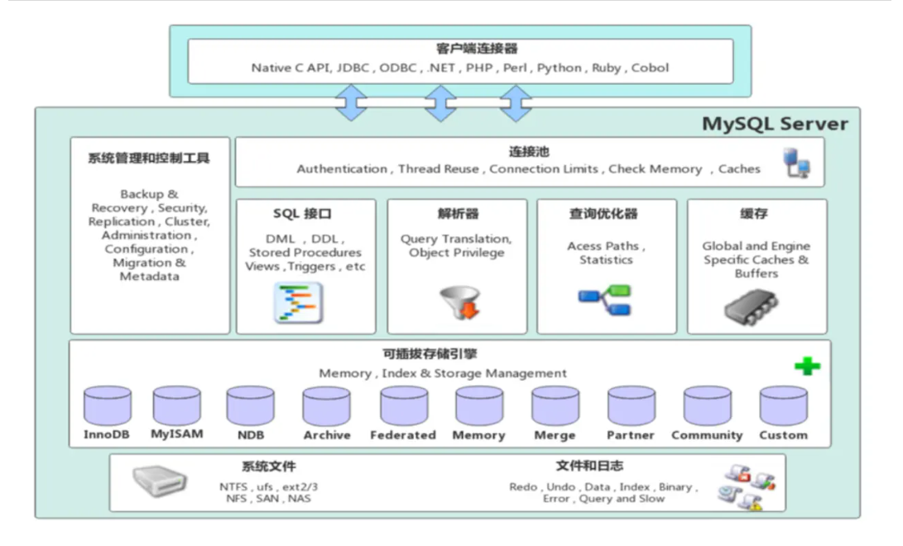

1、连接层

最上层是一些客户端和链接服务，包含本地sock 通信和大多数基于客户端/服务端工具实现的类似于 TCP/IP的通信。主要完成一些类似于连接处理、授权认证、及相关的安全方案。在该层上引入了线程 池的概念，为通过认证安全接入的客户端提供线程。同样在该层上可以实现基于SSL的安全链接。服务 器也会为安全接入的每个客户端验证它所具有的操作权限。


2、服务层

第二层架构主要完成大多数的核心服务功能，如SQL接口，并完成缓存的查询，SQL的分析和优化，部 分内置函数的执行。所有跨存储引擎的功能也在这一层实现，如 过程、函数等。在该层，服务器会解 析查询并创建相应的内部解析树，并对其完成相应的优化如确定表的查询的顺序，是否利用索引等， 最后生成相应的执行操作。如果是select语句，服务器还会查询内部的缓存，如果缓存空间足够大， 这样在解决大量读操作的环境中能够很好的提升系统的性能。


3、引擎层

存储引擎层， 存储引擎真正的负责了MySQL中数据的存储和提取，服务器通过API和存储引擎进行通 信。不同的存储引擎具有不同的功能，这样我们可以根据自己的需要，来选取合适的存储引擎。数据库 中的索引是在存储引擎层实现的。


4、存储层

数据存储层， 主要是将数据(如: redolog、undolog、数据、索引、二进制日志、错误日志、查询 日志、慢查询日志等)存储在文件系统之上，并完成与存储引擎的交互。


和其他数据库相比，MySQL有点与众不同，它的架构可以在多种不同场景中应用并发挥良好作用。主要 体现在存储引擎上，插件式的存储引擎架构，将查询处理和其他的系统任务以及数据的存储提取分离。 这种架构可以根据业务的需求和实际需要选择合适的存储引擎


### 存储引擎介绍


大家可能没有听说过存储引擎，但是一定听过引擎这个词，引擎就是发动机，是一个机器的核心组件。 比如，对于舰载机、直升机、火箭来说，他们都有各自的引擎，是他们最为核心的组件。而我们在选择 引擎的时候，需要在合适的场景，选择合适的存储引擎，就像在直升机上，我们不能选择舰载机的引擎 一样。 而对于存储引擎，也是一样，他是mysql数据库的核心，我们也需要在合适的场景选择合适的存储引 擎。接下来就来介绍一下存储引擎。 存储引擎就是存储数据、建立索引、更新/查询数据等技术的实现方式 。存储引擎是基于表的，而不是 基于库的，所以存储引擎也可被称为表类型。我们可以在创建表的时候，来指定选择的存储引擎，如果 没有指定将自动选择默认的存储引擎。

- **建表时指定存储引擎**

```sql
CREATE TABLE 表名(
    字段1 字段1类型 [ COMMENT 字段1注释 ] ,
    ......
    字段n 字段n类型 [COMMENT 字段n注释 ]
) ENGINE = INNODB [ COMMENT 表注释 ] ;


-- 查询当前数据库支持的存储引擎
SHOW ENGINES;

```


- **创建表 stu_MYISAM, 并指定MyISAM存储引擎**

```sql
mysql> CREATE TABLE stu_MYISAM (
    id int,
    `name` varchar(32),
    PRIMARY KEY (id)
	) ENGINE = MYISAM;
Query OK, 0 rows affected (0.01 sec)

mysql> show tables;
+----------------+
| Tables_in_test |
+----------------+
| stu            |
| stu_myisam     |
+----------------+
2 rows in set (0.00 sec)
```


### 存储引擎特点

上面我们介绍了什么是存储引擎，以及如何在建表时如何指定存储引擎，接下来我们就来介绍下来上面 重点提到的三种存储引擎 InnoDB、MyISAM、Memory的特点。


#### InnoDB

- **介绍**

InnoDB是一种兼顾高可靠性和高性能的通用存储引擎，在 MySQL 5.5 之后，InnoDB是默认的 MySQL 存储引擎。


- **特点**

  - DML操作**遵循ACID**模型，支持**事务**；

  - **行级锁**，提高并发访问性能；

  - 支持**外键FOREIGN KEY约束**，保证数据的完整性和正确性；


- **文件**

xxx.ibd：xxx代表的是表名，innoDB引擎的每张表都会对应这样一个表空间文件，存储该表的表结构（frm-早期的 、sdi-新版的）、数据和索引


```sql
mysql> show variables like 'innodb_file_per_table';
+-----------------------+-------+
| Variable_name         | Value |
+-----------------------+-------+
| innodb_file_per_table | ON    |
+-----------------------+-------+
1 row in set, 1 warning (0.00 sec)
```


```
如果该参数开启，代表对于InnoDB引擎的表，每一张表都对应一个ibd文件。 我们直接打开MySQL的 数据存放目录，这个目录下有很多文件夹，不同的文件夹代表不同的数据库。可以看到里面有很多的ibd文件，每一个ibd文件就对应一张表，比如：我们有一张表 account，就有这样的一个account.ibd文件，而在这个ibd文件中不仅存放表结构、数据，还会存放该表对应的索引信息。 而该文件是基于二进制存储的，不能直接基于记事本打开，我们可以使用mysql提供的一个指令 ibd2sdi ，通过该指令就可以从ibd文件中提取sdi信息，而sdi数据字典信息中就包含该表的表结构。
```

```sh
ibd2sdi stu.ibd
```


- **逻辑存储结构**


1. 表空间 : InnoDB存储引擎逻辑结构的最高层，ibd文件其实就是表空间文件，在表空间中可以包含多个Segment段。
2. 段 : 表空间是由各个段组成的， 常见的段有数据段、索引段、回滚段等。InnoDB中对于段的管理，都是引擎自身完成，不需要人为对其控制，一个段中包含多个区。
3. 区 : 区是表空间的单元结构，每个区的大小为`1M`。 默认情况下， InnoDB存储引擎页大小为`16K`， 即一个区中一共有`64个`连续的页。`1024 / 16 = 64`
4. 页 : 页是组成区的最小单元，**页也是InnoDB 存储引擎磁盘管理的最小单元**，每个页的大小默认为 16KB。为了保证页的连续性，InnoDB 存储引擎每次从磁盘申请 4-5 个区。
5. 行 : InnoDB 存储引擎是面向行的，也就是说数据是按行进行存放的，在每一行中除了定义表时所指定的字段以外，还包含两个**隐藏字段**(后面会详细介绍)。


#### MYISAM

- **介绍**

MyISAM是MySQL早期的默认存储引擎。


- **特点**

1. 不支持事务，不支持外键
2. 支持表锁，不支持行锁
3. 访问速度快


- 文件

1. xxx.sdi：存储表结构信息
2. xxx.MYD：存储数据
3. xxx.MYI：存储索引


#### Memory

- **介绍**

Memory引擎的表数据时存储在内存中的，由于受到硬件问题、或断电问题的影响，只能将这些表作为 临时表或缓存使用


- **特点**

1. 内存存放
2. hash索引（默认）


- **文件**

1. xxx.sdi：存储表结构信息


### 区别及特点

| 特点         | InnoDB            | MyISAM | Memory |
| :----------- | :---------------- | ------ | ------ |
| 存储限制     | 64TB              | 有     | 有     |
| 事务安全     | 支持              | -      | -      |
| 锁机制       | 行锁              | 表锁   | 表锁   |
| B+tree索引   | 支持              | 支持   | 支持   |
| Hash索引     | -                 | -      | 支持   |
| 全文索引     | 支持(5.6版本之后) | 支持   | -      |
| 空间使用     | 高                | 底     | N/A    |
| 内存使用     | 高                | 底     | 中等   |
| 批量插入速度 | 低                | 高     | 高     |
| 支持外键     | 支持              | -      | -      |


<div style="border-radius: .4rem;
            padding: .1rem .1rem;
            border-left-width: .5rem;
            border-left-style: solid;
            background-color: #f3f5f7;
            border-color: #42b983;
            color: #215d42;">
    <p class="custom-block-title">面试题:：</p>
    <p>InnoDB引擎与MyISAM引擎的区别 ?</p>
    <p> ①. InnoDB引擎, 支持事务, 而MyISAM不支持。</p>
    <p>②. InnoDB引擎, 支持行锁和表锁, 而MyISAM仅支持表锁, 不支持行锁。</p>
    <p>
        ③. InnoDB引擎, 支持外键, 而MyISAM是不支持的。
    </p>
    <p>
        主要是上述三点区别，当然也可以从索引结构、存储限制等方面，更加深入的回答，具体参 考如下官方文档：
    </p>
    <p>
        <a ref="https://dev.mysql.com/doc/refman/8.0/en/innodb-introduction.html">https://dev.mysql.com/doc/refman/8.0/en/innodb-introduction.html</a>
    </p>
    <p>
        <a ref="https://dev.mysql.com/doc/refman/8.0/en/myisam-storage-engine.html">https://dev.mysql.com/doc/refman/8.0/en/myisam-storage-engine.html</a>
    </p>
</div>


### 存储引擎的选择

在选择存储引擎时，应该根据应用系统的特点选择合适的存储引擎。对于复杂的应用系统，还可以根据 实际情况选择多种存储引擎进行组合。

1. InnoDB: 是Mysql的默认存储引擎，支持事务、外键。如果应用对事务的完整性有比较高的要 求，在并发条件下要求数据的一致性，数据操作除了插入和查询之外，还包含很多的更新、删除操 作，那么InnoDB存储引擎是比较合适的选择。
2. MyISAM ： 如果应用是以读操作和插入操作为主，只有很少的更新和删除操作，并且对事务的完 整性、并发性要求不是很高，那么选择这个存储引擎是非常合适的。
3. MEMORY：将所有数据保存在内存中，访问速度快，通常用于临时表及缓存。MEMORY的缺陷就是 对表的大小有限制，太大的表无法缓存在内存中，而且无法保障数据的安全性。


## MySQL-索引


### 索引介绍

索引（index）是帮助MySQL**高效获取数据**的**数据结构**(**有序**)。在数据之外，数据库系统还维护着满足 特定查找算法的数据结构，这些数据结构以某种方式引用（指向）数据， 这样就可以在这些数据结构 上实现高级查找算法，这种数据结构就是索引


优缺点：

优点：

- 提高数据检索效率，降低数据库的IO成本
- 通过索引列对数据进行排序，降低数据排序的成本，降低CPU的消耗

缺点：

- 索引列也是要占用空间的
- 索引大大提高了查询效率，但降低了更新的速度，比如 INSERT、UPDATE、DELETE


### 索引结构

| 索引结构            | 描述                                                         |
| :------------------ | :----------------------------------------------------------- |
| B+Tree              | 最常见的索引类型，大部分引擎都支持B+树索引                   |
| Hash                | 底层数据结构是用哈希表实现，只有精确匹配索引列的查询才有效，不支持范围查询 |
| R-Tree(空间索引)    | 空间索引是 MyISAM 引擎的一个特殊索引类型，主要用于地理空间数据类型，通常使用较少 |
| Full-Text(全文索引) | 是一种通过建立倒排索引，快速匹配文档的方式，类似于 Lucene, Solr, ES |

- 上述是MySQL中所支持的所有的索引结构，接下来，我们再来看看不同的存储引擎对于索引结构的支持 情况。

| 索引       | InnoDB          | MyISAM | Memory |
| :--------- | :-------------- | :----- | :----- |
| B+Tree索引 | 支持            | 支持   | 支持   |
| Hash索引   | 不支持          | 不支持 | 支持   |
| R-Tree索引 | 不支持          | 支持   | 不支持 |
| Full-text  | 5.6版本之后支持 | 支持   | 不支持 |

> ```sh
> # 注意： 我们平常所说的索引，如果没有特别指明，都是指B+树结构组织的索引。
> ```


#### 二叉树

假如说MySQL的索引结构采用二叉树的数据结构，比较理想的结构如下：


如果主键是顺序插入的，则会形成一个单向链表，结构如下：

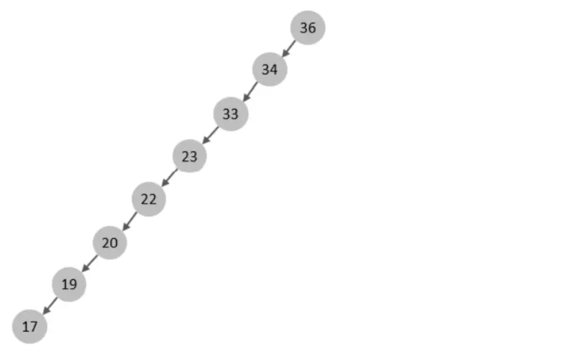

所以，如果选择二叉树作为索引结构，会存在以下缺点：

- 顺序插入时，会形成一个链表，查询性能大大降低。
- 大数据量情况下，层级较深，检索速度慢。

此时大家可能会想到，我们可以选择红黑树，红黑树是一颗自平衡二叉树，那这样即使是顺序插入数据，最终形成的数据结构也是一颗平衡的二叉树,结构如下:

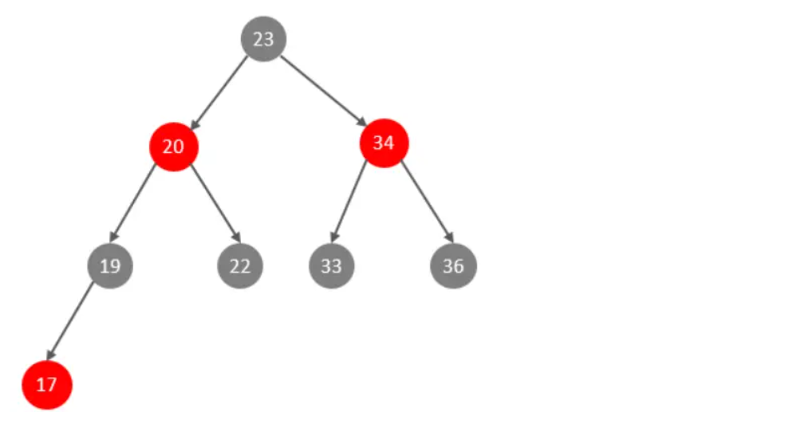

但是，即使如此，由于红黑树也是一颗二叉树，所以也会存在一个缺点：

- 大数据量情况下，层级较深，检索速度慢。

所以，在MySQL的索引结构中，并没有选择二叉树或者红黑树，而选择的是B+Tree，那么什么是B+Tree呢？在详解B+Tree之前，先来介绍一个B-Tree


#### B-Tree

B-Tree，B树是一种**多路**平衡查找树，相对于二叉树，B树每个节点可以有多个分支，即多叉。以一颗最大度数（max-degree）为5(5阶)的b-tree为例，那这个B树每个节点最多存储4个key，5个指针：

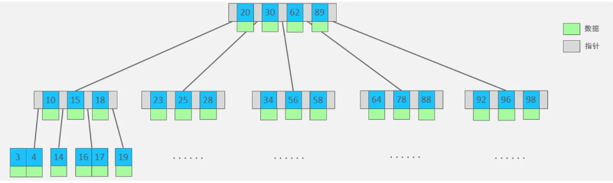

> ```sh
> # 树的度数指的是一个节点的子节点个数
> ```

我们可以通过一个数据结构可视化的网站来简单演示一下。[B-Tree Visualization (usfca.edu)](https://www.cs.usfca.edu/~galles/visualization/BTree.html)


特点：

- 5阶的B树，每一个节点最多存储4个key，对应5个指针。
- 一旦节点存储的key数量到达5，就会裂变，中间元素向上分裂。
- 在**B树**中，**非叶子节点和叶子节点都会存放数据**。


#### B+Tree

B+Tree是B-Tree的变种，我们以一颗最大度数（max-degree）为4（4阶）的b+tree为例，来看一下其结构示意图：


我们可以看到，两部分：

- 绿色框框起来的部分，是索引部分，仅仅起到索引数据的作用，不存储数据。
- 红色框框起来的部分，是数据存储部分，在其叶子节点中要存储具体的数据。

我们可以通过一个数据结构可视化的网站来简单演示一下。[B+ Tree Visualization (usfca.edu)](https://www.cs.usfca.edu/~galles/visualization/BPlusTree.html)


**最终我们看到，B+Tree 与 B-Tree相比，主要有以下三点区别：**

- **所有的数据**都会出现在**叶子节点**。
- **叶子节点形成**一个**单向链表**。
- **非叶子节点**仅仅起到**索引数据作用**，**具体的数据**都是在**叶子节点存放**的。


上述我们所看到的结构是标准的B+Tree的数据结构，接下来，我们再来看看MySQL中优化之后的B+Tree。

MySQL索引数据结构对经典的B+Tree进行了优化。在原B+Tree的基础上，增加一个指向相邻叶子节点的链表指针，就形成了带有顺序指针的B+Tree，提高区间访问的性能，利于排序。

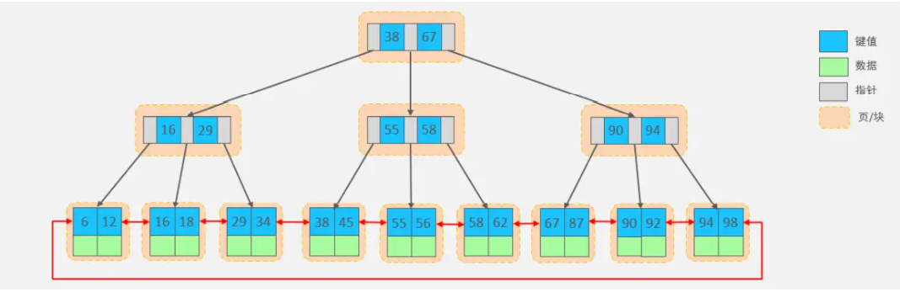


#### Hash

MySQL中除了支持B+Tree索引，还支持一种索引类型---Hash索引。

1. 结构

哈希索引就是采用一定的hash算法，将键值换算成新的hash值，映射到对应的槽位上，然后存储在hash表中。


如果两个(或多个)键值，映射到一个相同的槽位上，他们就产生了hash冲突（也称为hash碰撞），可以通过链表来解决。


1. 特点

- Hash索引只能用于对等比较(=，in)，不支持范围查询（between，>，< ，...）
- 无法利用索引完成排序操作
- 查询效率高，通常(不存在hash冲突的情况)只需要一次检索就可以了，效率通常要高于B+tree索引

1. 存储引擎支持

在MySQL中，支持hash索引的是Memory存储引擎。 而InnoDB中具有自适应hash功能，hash索引是 InnoDB存储引擎根据B+Tree索引在指定条件下自动构建的。


<div style="border-radius: .4rem;
            padding: .1rem .1rem;
            border-left-width: .5rem;
            border-left-style: solid;
            background-color: #f3f5f7;
            border-color: #42b983;
            color: #215d42;
            font-weight: 600;">
    <p class="custom-block-title">思考题： 为什么InnoDB存储引擎选择使用B+tree索引结构?</p>
    <p>1、相对于二叉树，层级更少，搜索效率高；</p>
    <p>
        2、对于B-tree，无论是叶子节点还是非叶子节点，都会保存数据，这样导致一页中存储的键值减少，指针跟着减少，要同样保存大量数据，只能增加树的高度，导致性能降低；
    </p>
    <p>3、相对Hash索引，B+tree支持范围匹配及排序操作；</p>
</div>


### 索引的分类

在MySQL数据库，将索引的具体类型主要分为以下几类：主键索引、唯一索引、常规索引、全文索引。

| 分类     | 含义                                                 | 特点                     | 关键字   |
| :------- | :--------------------------------------------------- | :----------------------- | :------- |
| 主键索引 | 针对于表中主键创建的索引                             | 默认自动创建，只能有一个 | PRIMARY  |
| 唯一索引 | 避免同一个表中某数据列中的值重复                     | 可以有多个               | UNIQUE   |
| 常规索引 | 快速定位特定数据                                     | 可以有多个               |          |
| 全文索引 | 全文索引查找的是文本中的关键词，而不是比较索引中的值 | 可以有多个               | FULLTEXT |

在 InnoDB 存储引擎中，根据索引的存储形式，又可以分为以下两种：

| 分类                      | 含义                                                       | 特点                     |
| :------------------------ | :--------------------------------------------------------- | :----------------------- |
| 聚集索引(Clustered Index) | 将数据存储与索引放一块，索引结构的叶子节点保存了行数据     | **必须有，而且只有一个** |
| 二级索引(Secondary Index) | 将数据与索引分开存储，索引结构的叶子节点关联的是对应的主键 | 可以存在多个             |

聚集索引选取规则:

- 如果存在主键，主键索引就是聚集索引
- 如果不存在主键，将使用第一个唯一（UNIQUE）索引作为聚集索引。
- 如果表没有主键，或没有合适的唯一索引，则InnoDB会自动生成一个rowid作为隐藏的聚集索引。


聚集索引和二级索引的具体结构如下：

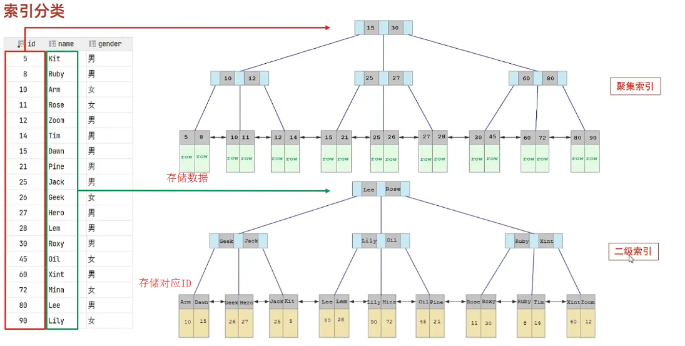


- 聚集索引的叶子节点下挂的是这一行的数据 。
- 二级索引的叶子节点下挂的是该字段值对应的主键值。

```sh
# 如果二级索引下面也挂载数据，就会显得非常冗余
```

接下来，我们来分析一下，当我们执行如下的SQL语句时，具体的查找过程是什么样子的。


具体过程如下:

1. 由于是根据name字段进行查询，所以先根据name='Arm'到name字段的二级索引中进行匹配查 找。但是在二级索引中只能查找到 Arm 对应的主键值 10。
2. 由于查询返回的数据是*，所以此时，还需要根据主键值10，到聚集索引中查找10对应的记录，最 终找到10对应的行row。
3. 最终拿到这一行的数据，直接返回即可。


<div style="border-radius: .4rem;
            padding: .1rem .1rem;
            border-left-width: .5rem;
            border-left-style: solid;
            background-color: #f3f5f7;
            border-color: #42b983;
            color: #215d42;
            font-weight: 600;">
    <p class="custom-block-title">知识小贴士：</p>
    <p><code style="color: red">回表查询</code>：这种先到二级索引中查找数据，找到主键值，然后再到聚集索引中根据主键值，获取 数据的方式，就称之为回表查询。</p>
</div>


<div style="border-radius: .4rem;
            padding: .1rem .1rem;
            border-left-width: .5rem;
            border-left-style: solid;
            background-color: #f3f5f7;
            border-color: red;
            color: #215d42;
            font-weight: 600;">
    <p>
        思考题
    </p>
    <ul><li><p>以下两条SQL语句，那个执行效率高? 为什么?</p> <p>A. select * from user where id = 10 ;</p> <p>B. select * from user where name = 'Arm' ;</p> <p>备注: id为主键，name字段创建的有索引；</p></li></ul>
    <p>解答</p>
    <p>A 语句的执行性能要高于B 语句。</p>
    <p>因为A语句直接走聚集索引，直接返回数据。 而B语句需要先查询name字段的二级索引，然后再查询聚集索引，也就是需要进行回表查询。</p>
</div>


<div style="border-radius: .4rem;
            padding: .1rem .1rem;
            border-left-width: .5rem;
            border-left-style: solid;
            background-color: #f3f5f7;
            border-color: red;
            color: #215d42;
            font-weight: 600;">
    <p class="custom-block-title">思考题：</p>
    <p>InnoDB主键索引的B+tree高度为多高呢?</p>
    <image src="image/Snipaste_2022-11-25_20-02-44.png"></image>
    <p>
        答：假设一行数据大小为1k，一页中可以存储16行这样的数据。InnoDB 的指针占用6个字节的空间，主键假设为bigint，占用字节数为8. 可得公式：`n * 8 + (n + 1) * 6 = 16 * 1024`，其中 8 表示 bigint 占用的字节数，n 表示当前节点存储的key的数量，(n + 1) 表示指针数量（比key多一个）。算出n约为1170。如果树的高度为2，那么他能存储的数据量大概为：`1171 * 16 = 18736`； 如果树的高度为3，那么他能存储的数据量大概为：`1171 * 1171 * 16 = 21939856`。
    </p>
</div>


### 索引语法

```sql
-- 创建索引
CREATE [ UNIQUE | FULLTEXT ] INDEX index_name ON table_name (index_col_name,... ) ;
-- 1.添加PRIMARY KEY（主键索引） 
ALTER TABLE `table_name` ADD PRIMARY KEY ( `column` ) 
-- 2.添加UNIQUE(唯一索引) 
ALTER TABLE `table_name` ADD UNIQUE ( 
`column` 
) 
-- 3.添加INDEX(普通索引) 
ALTER TABLE `table_name` ADD INDEX index_name ( `column` ) 
-- 4.添加FULLTEXT(全文索引) 
ALTER TABLE `table_name` ADD FULLTEXT ( `column`) 
-- 5.添加多列索引 
ALTER TABLE `table_name` ADD INDEX index_name ( `column1`, `column2`, `column3` )


-- 查看索引
SHOW INDEX FROM table_name ;


-- 删除索引
DROP INDEX index_name ON `table_name`
ALTER TABLE `table_name` DROP INDEX index_name;

-- 删除主键索引
ALTER table `table_name` DROP PRIMARY KEY;
```


- **Demo**

```sql
create table tb_user(
	id int primary key auto_increment comment '主键',
	name varchar(50) not null comment '用户名',
	phone varchar(11) not null comment '手机号',
	email varchar(100) comment '邮箱',
	profession varchar(11) comment '专业',
	age tinyint unsigned comment '年龄',
	gender char(1) comment '性别 , 1: 男, 2: 女',
	status char(1) comment '状态',
	createtime datetime comment '创建时间'
) comment '系统用户表';
INSERT INTO tb_user (name, phone, email, profession, age, gender, status,createtime) VALUES ('吕布', '17799990000', 'lvbu666@163.com', '软件工程', 23, '1','6', '2001-02-02 00:00:00');
INSERT INTO tb_user (name, phone, email, profession, age, gender, status,createtime) VALUES ('曹操', '17799990001', 'caocao666@qq.com', '通讯工程', 33,'1', '0', '2001-03-05 00:00:00');
INSERT INTO tb_user (name, phone, email, profession, age, gender, status,createtime) VALUES ('赵云', '17799990002', '17799990@139.com', '英语', 34, '1','2', '2002-03-02 00:00:00');
INSERT INTO tb_user (name, phone, email, profession, age, gender, status,createtime) VALUES ('孙悟空', '17799990003', '17799990@sina.com', '工程造价', 54,'1', '0', '2001-07-02 00:00:00');
INSERT INTO tb_user (name, phone, email, profession, age, gender, status,createtime) VALUES ('花木兰', '17799990004', '19980729@sina.com', '软件工程', 23,'2', '1', '2001-04-22 00:00:00');
INSERT INTO tb_user (name, phone, email, profession, age, gender, status,createtime) VALUES ('大乔', '17799990005', 'daqiao666@sina.com', '舞蹈', 22, '2','0', '2001-02-07 00:00:00');
INSERT INTO tb_user (name, phone, email, profession, age, gender, status, createtime) VALUES ('露娜', '17799990006', 'luna_love@sina.com', '应用数学', 24,'2', '0', '2001-02-08 00:00:00');
INSERT INTO tb_user (name, phone, email, profession, age, gender, status,createtime) VALUES ('程咬金', '17799990007', 'chengyaojin@163.com', '化工', 38,'1', '5', '2001-05-23 00:00:00');
INSERT INTO tb_user (name, phone, email, profession, age, gender, status,createtime) VALUES ('项羽', '17799990008', 'xiaoyu666@qq.com', '金属材料', 43,'1', '0', '2001-09-18 00:00:00');
INSERT INTO tb_user (name, phone, email, profession, age, gender, status,createtime) VALUES ('白起', '17799990009', 'baiqi666@sina.com', '机械工程及其自动化', 27, '1', '2', '2001-08-16 00:00:00');
INSERT INTO tb_user (name, phone, email, profession, age, gender, status,createtime) VALUES ('韩信', '17799990010', 'hanxin520@163.com', '无机非金属材料工程', 27, '1', '0', '2001-06-12 00:00:00');
INSERT INTO tb_user (name, phone, email, profession, age, gender, status,createtime) VALUES ('荆轲', '17799990011', 'jingke123@163.com', '会计', 29, '1','0', '2001-05-11 00:00:00');
INSERT INTO tb_user (name, phone, email, profession, age, gender, status,createtime) VALUES ('兰陵王', '17799990012', 'lanlinwang666@126.com', '工程造价',44, '1', '1', '2001-04-09 00:00:00');
INSERT INTO tb_user (name, phone, email, profession, age, gender, status,createtime) VALUES ('狂铁', '17799990013', 'kuangtie@sina.com', '应用数学', 43,'1', '2', '2001-04-10 00:00:00');
INSERT INTO tb_user (name, phone, email, profession, age, gender, status,createtime) VALUES ('貂蝉', '17799990014', '84958948374@qq.com', '软件工程', 40,'2', '3', '2001-02-12 00:00:00');
INSERT INTO tb_user (name, phone, email, profession, age, gender, status,createtime) VALUES ('妲己', '17799990015', '2783238293@qq.com', '软件工程', 31,'2', '0', '2001-01-30 00:00:00');
INSERT INTO tb_user (name, phone, email, profession, age, gender, status,createtime) VALUES ('芈月', '17799990016', 'xiaomin2001@sina.com', '工业经济', 35,'2', '0', '2000-05-03 00:00:00');
INSERT INTO tb_user (name, phone, email, profession, age, gender, status,createtime) VALUES ('嬴政', '17799990017', '8839434342@qq.com', '化工', 38, '1','1', '2001-08-08 00:00:00');
INSERT INTO tb_user (name, phone, email, profession, age, gender, status,createtime) VALUES ('狄仁杰', '17799990018', 'jujiamlm8166@163.com', '国际贸易',30, '1', '0', '2007-03-12 00:00:00');
INSERT INTO tb_user (name, phone, email, profession, age, gender, status,createtime) VALUES ('安琪拉', '17799990019', 'jdodm1h@126.com', '城市规划', 51,'2', '0', '2001-08-15 00:00:00');
INSERT INTO tb_user (name, phone, email, profession, age, gender, status,createtime) VALUES ('典韦', '17799990020', 'ycaunanjian@163.com', '城市规划', 52,'1', '2', '2000-04-12 00:00:00');
INSERT INTO tb_user (name, phone, email, profession, age, gender, status,createtime) VALUES ('廉颇', '17799990021', 'lianpo321@126.com', '土木工程', 19,'1', '3', '2002-07-18 00:00:00');
INSERT INTO tb_user (name, phone, email, profession, age, gender, status,createtime) VALUES ('后羿', '17799990022', 'altycj2000@139.com', '城市园林', 20,'1', '0', '2002-03-10 00:00:00');
INSERT INTO tb_user (name, phone, email, profession, age, gender, status,createtime) VALUES ('姜子牙', '17799990023', '37483844@qq.com', '工程造价', 29,'1', '4', '2003-05-26 00:00:00');

```


```sql
-- 为name新建索引
alter table tb_user ADD index index_name (name);

-- phone新建唯一索引
mysql> ALTER TABLE tb_user ADD UNIQUE INDEX UNIQUE_PHONE (phone);
Query OK, 0 rows affected (0.03 sec)
Records: 0  Duplicates: 0  Warnings: 0

-- 为profession、age、status创建联合索引。
mysql> ALTER TABLE tb_user ADD INDEX index_p_a_s (profession, age, status);
Query OK, 0 rows affected (0.03 sec)
Records: 0  Duplicates: 0  Warnings: 0

```

```sql
-- 查看索引
SHOW INDEX FROM tb_user;
SHOW KEYS FROM tb_user;

```


### SQL 性能分析

#### SQL 执行频率

MySQL 客户端连接成功后，通过 show [session|global] status 命令可以提供服务器状态信息。通过如下指令，可以查看当前数据库的INSERT、UPDATE、DELETE、SELECT的访问频次：

```sql
-- session 是查看当前会话 ;
-- global 是查询全局数据 ;
SHOW GLOBAL STATUS LIKE 'Com_______'; -- 7个下划线

```

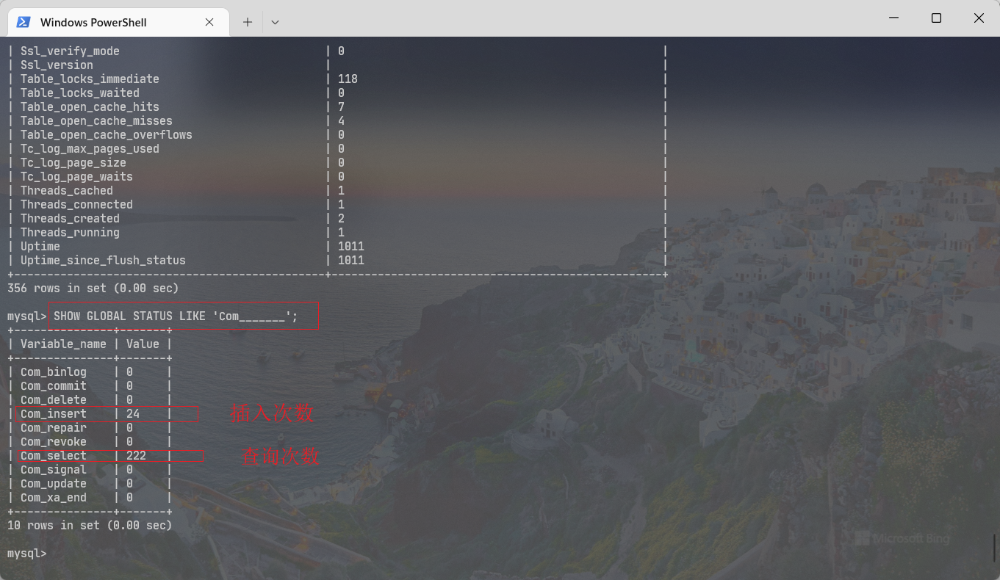

Com_delete: 删除次数

Com_insert: 插入次数

Com_select: 查询次数

Com_update: 更新次数

我们可以在当前数据库再执行几次查询操作，然后再次查看执行频次，看看 Com_select 参数会不会变化

```sh
# 通过上述指令，我们可以查看到当前数据库到底是以查询为主，还是以增删改为主，从而为数据库优化提供参考依据。 如果是以增删改为主，我们可以考虑不对其进行索引的优化。 如果是以查询为主，那么就要考虑对数据库的索引进行优化了。
```

那么通过查询SQL的执行频次，我们就能够知道当前数据库到底是增删改为主，还是查询为主。 那假如说是以查询为主，我们又该如何定位针对于那些查询语句进行优化呢？ 次数我们可以借助于慢查询日志。

接下来，我们就来介绍一下MySQL中的慢查询日志。


#### 慢查询日志

慢查询日志记录了所有执行时间超过指定参数（long_query_time，单位：秒，默认10秒）的所有 SQL语句的日志。

MySQL的慢查询日志默认没有开启，我们可以查看一下系统变量 slow_query_log。

```sql
show variables like 'slow_query_log';

mysql> show variables like 'slow_query_log';
+----------------+-------+
| Variable_name  | Value |
+----------------+-------+
| slow_query_log | OFF   |
+----------------+-------+
1 row in set, 1 warning (0.00 sec)

mysql>
```

如果要开启慢查询日志，需要在MySQL的配置文件（/etc/my.cnf）中配置如下信息：

```ini
# 开启MySQL慢日志查询开关
slow_query_log=1

# 设置慢日志的时间为2秒，SQL语句执行时间超过2秒，就会视为慢查询，记录慢查询日志
long_query_time=2

```

重启MySQL，查看

```sql
mysql> show variables like 'slow_query_log';
+----------------+-------+
| Variable_name  | Value |
+----------------+-------+
| slow_query_log | ON    |
+----------------+-------+
1 row in set, 1 warning (0.00 sec)

mysql>
```


1、测试：

```sql
select * from tb_user; -- 这条SQL执行效率比较高, 执行耗时 0.00sec
select count(*) from tb_sku; -- 由于tb_sku表中, 预先存入了1000w的记录, count一次,耗时13.35sec

```

2、检查慢查询日志 ：

```sh
# 慢查询日志文件在 var/lib/mysql 中
# 文件名为 主机名-slow.log
# ex: 2b4eab6aa9e1-slow.log (docker容器id)
```

最终我们发现，在慢查询日志中，只会记录执行时间超多我们预设时间（2s）的SQL，执行较快的SQL是不会记录的。

那这样，通过慢查询日志，就可以定位出执行效率比较低的SQL，从而有针对性的进行优化。


#### profile详情


show profiles 能够在做SQL优化时帮助我们了解时间都耗费到哪里去了。通过have_profiling参数，能够看到当前MySQL是否支持profile操作：

```sql
SELECT @@have_profiling;
-- 是否支持
mysql> SELECT @@have_profiling;
+------------------+
| @@have_profiling |
+------------------+
| YES              |
+------------------+
1 row in set, 1 warning (0.00 sec)

-- 是否开启 0 关闭 1 开启
mysql> select @@profiling;
+-------------+
| @@profiling |
+-------------+
|           0 |
+-------------+
1 row in set, 1 warning (0.00 sec)

mysql>
```


可以看到，当前MySQL是支持 profile操作的，但是开关是关闭的。可以通过set语句在session/global级别开启profiling：

```sql
SET profiling = 1;

mysql> select @@profiling;
+-------------+
| @@profiling |
+-------------+
|           1 |
+-------------+
1 row in set, 1 warning (0.00 sec)
```


开关已经打开了，接下来，我们所执行的SQL语句，都会被MySQL记录，并记录执行时间消耗到哪儿去了。 我们直接执行如下的SQL语句

```sql
select * from tb_user;

select * from tb_user where id = 1;

select * from tb_user where name = '白起';

select count(*) from tb_sku;

```


执行一系列的业务SQL的操作，然后通过如下指令查看指令的执行耗时：

```sql
-- 查看每一条SQL的耗时基本情况
show profiles;

-- 查看指定query_id的SQL语句各个阶段的耗时情况
show profile for query query_id;

-- 查看指定query_id的SQL语句CPU的使用情况
show profile cpu for query query_id;

```


查看每一条SQL的耗时情况:

```sql
mysql> show profiles;
+----------+------------+---------------------------------------------+
| Query_ID | Duration   | Query                                       |
+----------+------------+---------------------------------------------+
|        1 | 0.00035925 | select @@profiling                          |
|        2 | 0.00047950 | select * from tb_user                       |
|        3 | 0.00028925 | select * from tb_user where id = 1          |
|        4 | 0.00047600 | select * from tb_user where name = '白起'   |
|        5 | 0.00074075 | select count(*) from tb_sku                 |
+----------+------------+---------------------------------------------+
5 rows in set, 1 warning (0.00 sec)

```


查看指定SQL各个阶段的耗时情况 :

```sql
mysql> show profile for query 4;
+--------------------------------+----------+
| Status                         | Duration |
+--------------------------------+----------+
| starting                       | 0.000089 |
| Executing hook on transaction  | 0.000006 |
| starting                       | 0.000007 |
| checking permissions           | 0.000005 |
| Opening tables                 | 0.000032 |
| init                           | 0.000004 |
| System lock                    | 0.000007 |
| optimizing                     | 0.000061 |
| statistics                     | 0.000182 |
| preparing                      | 0.000015 |
| executing                      | 0.000030 |
| end                            | 0.000003 |
| query end                      | 0.000003 |
| waiting for handler commit     | 0.000006 |
| closing tables                 | 0.000005 |
| freeing items                  | 0.000010 |
| cleaning up                    | 0.000011 |
+--------------------------------+----------+
17 rows in set, 1 warning (0.00 sec)

```


查看指定query_id的SQL语句CPU的使用情况:

```sql
mysql> show profile cpu for query 4;
+--------------------------------+----------+----------+------------+
| Status                         | Duration | CPU_user | CPU_system |
+--------------------------------+----------+----------+------------+
| starting                       | 0.000089 | 0.000026 |   0.000061 |
| Executing hook on transaction  | 0.000006 | 0.000001 |   0.000002 |
| starting                       | 0.000007 | 0.000002 |   0.000005 |
| checking permissions           | 0.000005 | 0.000001 |   0.000004 |
| Opening tables                 | 0.000032 | 0.000010 |   0.000022 |
| init                           | 0.000004 | 0.000001 |   0.000003 |
| System lock                    | 0.000007 | 0.000002 |   0.000005 |
| optimizing                     | 0.000061 | 0.000000 |   0.000062 |
| statistics                     | 0.000182 | 0.000000 |   0.000202 |
| preparing                      | 0.000015 | 0.000000 |   0.000014 |
| executing                      | 0.000030 | 0.000000 |   0.000030 |
| end                            | 0.000003 | 0.000000 |   0.000003 |
| query end                      | 0.000003 | 0.000000 |   0.000003 |
| waiting for handler commit     | 0.000006 | 0.000000 |   0.000006 |
| closing tables                 | 0.000005 | 0.000000 |   0.000005 |
| freeing items                  | 0.000010 | 0.000000 |   0.000011 |
| cleaning up                    | 0.000011 | 0.000000 |   0.000010 |
+--------------------------------+----------+----------+------------+
17 rows in set, 1 warning (0.00 sec)

```


#### explain

EXPLAIN 或者 DESC命令获取 MySQL 如何执行 SELECT 语句的信息，包括在 SELECT 语句执行过程中表如何连接和连接的顺序。


- **语法**

```sql
-- 直接在select语句之前加上关键字 explain / desc
EXPLAIN SELECT 字段列表 FROM 表名 WHERE 条件 ;

```

> ```sql
> mysql> EXPLAIN select * from test.tb_user where id = 1;
> +----+-------------+---------+------------+-------+---------------+---------+---------+-------+------+----------+-------+
> | id | select_type | table   | partitions | type  | possible_keys | key     | key_len | ref   | rows | filtered | Extra |
> +----+-------------+---------+------------+-------+---------------+---------+---------+-------+------+----------+-------+
> |  1 | SIMPLE      | tb_user | NULL       | const | PRIMARY       | PRIMARY | 4       | const |    1 |   100.00 | NULL  |
> +----+-------------+---------+------------+-------+---------------+---------+---------+-------+------+----------+-------+
> 1 row in set, 1 warning (0.00 sec)
> ```


Explain 执行计划中各个字段的含义:

| 字段         | 含义                                                         |
| ------------ | ------------------------------------------------------------ |
| id           | select查询的序列号，表示查询中执行select子句或者是操作表的顺序 (id相同，执行顺序从上到下；id不同，值越大，越先执行)。 |
| select_type  | 表示 SELECT 的类型，常见的取值有 SIMPLE（简单表，即不使用表连接或者子查询）、PRIMARY（主查询，即外层的查询）、UNION（UNION 中的第二个或者后面的查询语句）、SUBQUERY（SELECT/WHERE之后包含了子查询）等 |
| type         | 表示连接类型，性能由好到差的连接类型为NULL、system、const、eq_ref、ref、range、 index、all 。 |
| possible_key | 显示可能应用在这张表上的索引，一个或多个。                   |
| key          | 实际使用的索引，如果为NULL，则没有使用索引。                 |
| key_len      | 表示索引中使用的字节数， 该值为索引字段最大可能长度，并非实际使用长度，在不损失精确性的前提下， 长度越短越好 。 |
| rows         | MySQL认为必须要执行查询的行数，在innodb引擎的表中，是一个估计值，可能并不总是准确的。 |
| filtered     | 表示返回结果的行数占需读取行数的百分比， filtered 的值越大越好。 |
| Extra        | 额外信息                                                     |

```sh
# type
# NULL 一般比查询任何表时才会出现，业务中不太可能，select 'a';
# system 查询系统信息
# const 主键查询或者唯一索引
# ref 非唯一索引
# index 使用了索引，但是扫描了整个索引树
# all 全表扫描
```


### 索引使用

#### 验证索引效率

在讲解索引的使用原则之前，先通过一个简单的案例，来验证一下索引，看看是否能够通过索引来提升数据查询性能。在演示的时候，我们还是使用之前准备的一张表 tb_sku , 在这张表中准备了1000w的记录。

```sql
mysql> SELECT COUNT(*) FROM tb_sku;
+----------------+
|    count(*)    |
+----------------+
|    10000000    |
+----------------+
1 row in set (11.03 sec)
```

这张表中id为主键，有主键索引，而其他字段是没有建立索引的。 我们先来查询其中的一条记录，看 看里面的字段情况，执行如下SQL：

```sql
select * from tb_sku here id = 1\G;

```


可以看到即使有1000w的数据,根据id进行数据查询,性能依然很快，因为主键id是有索引的。 那么接下来，我们再来根据 sn 字段进行查询，执行如下SQL：

```sql
SELECT * FROM tb_sku WHERE sn = '100000003145001';

```


我们可以看到根据sn字段进行查询，查询返回了一条数据，结果耗时 20.78sec，就是因为sn没有索引，而造成查询效率很低。

那么我们可以针对于sn字段，建立一个索引，建立了索引之后，我们再次根据sn进行查询，再来看一下查询耗时情况。

创建索引：

```sql
create index idx_sku_sn on tb_sku(sn) ;
ALTER TABLE tb_sku ADD INDEX idx_sku_sn (sn);
```

然后再次执行相同的SQL语句，再次查看SQL的耗时。

```sql
SELECT * FROM tb_sku WHERE sn = '100000003145001';

```


#### 最左前缀法则

如果索引关联了多列（联合索引），要遵守最左前缀法则，最左前缀法则指的是查询从索引的最左列开始，并且不跳过索引中的列。如果跳跃某一列，`索引将部分失效（后面的字段索引失效）`。

以 tb_user 表为例，我们先来查看一下之前 tb_user 表所创建的索引。

> ```sql
> SHOW INDEX FROM tb_user;
> ```


在 tb_user 表中，有一个联合索引，这个联合索引涉及到三个字段，顺序分别为：profession，age，status。

对于最左前缀法则指的是，查询时，最左变的列，也就是profession必须存在，否则索引全部失效。而且中间不能跳过某一列，否则该列后面的字段索引将失效。 接下来，我们来演示几组案例，看一下具体的执行计划：

> ```sql
> explain select * from tb_user where profession = '软件工程' and age = 31 and status = '0';
> 
> mysql> explain select * from tb_user where profession = '软件工程' and age = 31 and status = '0';
> +----+-------------+---------+------------+------+---------------+-------------+---------+-------------------+------+----------+-----------------------+
> | id | select_type | table   | partitions | type | possible_keys | key         | key_len | ref               | rows | filtered | Extra                 |
> +----+-------------+---------+------------+------+---------------+-------------+---------+-------------------+------+----------+-----------------------+
> |  1 | SIMPLE      | tb_user | NULL       | ref  | index_p_a_s   | index_p_a_s | 54      | const,const,const |    1 |   100.00 | Using index condition |
> +----+-------------+---------+------------+------+---------------+-------------+---------+-------------------+------+----------+-----------------------+
> 1 row in set, 1 warning (0.01 sec)
> ```


> ```sql
> explain select * from tb_user where profession = '软件工程' and age = 31;
> 
> mysql> explain select * from tb_user where profession = '软件工程' and age = 31;
> +----+-------------+---------+------------+------+---------------+-------------+---------+-------------+------+----------+-------+
> | id | select_type | table   | partitions | type | possible_keys | key         | key_len | ref         | rows | filtered | Extra |
> +----+-------------+---------+------------+------+---------------+-------------+---------+-------------+------+----------+-------+
> |  1 | SIMPLE      | tb_user | NULL       | ref  | index_p_a_s   | index_p_a_s | 49      | const,const |    1 |   100.00 | NULL  |
> +----+-------------+---------+------------+------+---------------+-------------+---------+-------------+------+----------+-------+
> 1 row in set, 1 warning (0.00 sec)
> ```


> ```sql
> explain select * from tb_user where profession = '软件工程';
> 
> mysql> explain select * from tb_user where profession = '软件工程';
> +----+-------------+---------+------------+------+---------------+-------------+---------+-------+------+----------+-------+
> | id | select_type | table   | partitions | type | possible_keys | key         | key_len | ref   | rows | filtered | Extra |
> +----+-------------+---------+------------+------+---------------+-------------+---------+-------+------+----------+-------+
> |  1 | SIMPLE      | tb_user | NULL       | ref  | index_p_a_s   | index_p_a_s | 47      | const |    4 |   100.00 | NULL  |
> +----+-------------+---------+------------+------+---------------+-------------+---------+-------+------+----------+-------+
> 1 row in set, 1 warning (0.00 sec)
> ```


以上的这三组测试中，我们发现只要联合索引最左边的字段 profession存在，**索引就会生效**，只不过索引的长度不同。 而且由以上三组测试，我们也可以推测出profession字段索引长度为47、age字段索引长度为2、status字段索引长度为5。


> ```sql
> mysql> explain select * from tb_user where age = 31 and status = '0';
> +----+-------------+---------+------------+------+---------------+------+---------+------+------+----------+-------------+
> | id | select_type | table   | partitions | type | possible_keys | key  | key_len | ref  | rows | filtered | Extra       |
> +----+-------------+---------+------------+------+---------------+------+---------+------+------+----------+-------------+
> |  1 | SIMPLE      | tb_user | NULL       | ALL  | NULL          | NULL | NULL    | NULL |   24 |     4.17 | Using where |
> +----+-------------+---------+------------+------+---------------+------+---------+------+------+----------+-------------+
> 1 row in set, 1 warning (0.00 sec)
> 
> mysql> explain select * from tb_user where status = '0';
> +----+-------------+---------+------------+------+---------------+------+---------+------+------+----------+-------------+
> | id | select_type | table   | partitions | type | possible_keys | key  | key_len | ref  | rows | filtered | Extra       |
> +----+-------------+---------+------------+------+---------------+------+---------+------+------+----------+-------------+
> |  1 | SIMPLE      | tb_user | NULL       | ALL  | NULL          | NULL | NULL    | NULL |   24 |    10.00 | Using where |
> +----+-------------+---------+------------+------+---------------+------+---------+------+------+----------+-------------+
> 1 row in set, 1 warning (0.00 sec)
> ```


而通过上面的这两组测试，我们也可以看到索引并未生效，原因是因为不满足最左前缀法则，联合索引最左边的列profession不存在。


> ```sql
> mysql> explain select * from tb_user where profession = '软件工程' and status = '0';
> +----+-------------+---------+------------+------+---------------+-------------+---------+-------+------+----------+-----------------------+
> | id | select_type | table   | partitions | type | possible_keys | key         | key_len | ref   | rows | filtered | Extra                 |
> +----+-------------+---------+------------+------+---------------+-------------+---------+-------+------+----------+-----------------------+
> |  1 | SIMPLE      | tb_user | NULL       | ref  | index_p_a_s   | index_p_a_s | 47      | const |    4 |    10.00 | Using index condition |
> +----+-------------+---------+------------+------+---------------+-------------+---------+-------+------+----------+-----------------------+
> 1 row in set, 1 warning (0.00 sec)
> ```

上述的SQL查询时，存在profession字段，最左边的列是存在的，索引满足最左前缀法则的基本条件。但是查询时，跳过了age这个列，所以后面的列索引是不会使用的，也就是索引部分生效，所以索引的长度就是47。


- **思考**

当执行SQL语句: explain select * from tb_user where age = 31 and status = '0' and profession = '软件工程'； 时，是否满足最左前缀法则，走不走上述的联合索引，索引长度？

> ```sql
> mysql> explain select * from tb_user where age = 31 and status = '0' and profession = '软件工程';
> +----+-------------+---------+------------+------+---------------+-------------+---------+-------------------+------+----------+-------+
> | id | select_type | table   | partitions | type | possible_keys | key         | key_len | ref               | rows | filtered | Extra |
> +----+-------------+---------+------------+------+---------------+-------------+---------+-------------------+------+----------+-------+
> |  1 | SIMPLE      | tb_user | NULL       | ref  | index_p_a_s   | index_p_a_s | 54      | const,const,const |    1 |   100.00 | NULL  |
> +----+-------------+---------+------------+------+---------------+-------------+---------+-------------------+------+----------+-------+
> 1 row in set, 1 warning (0.00 sec)
> ```

可以看到，是完全满足最左前缀法则的，索引长度54，联合索引是生效的。

注意 ： 最左前缀法则中指的最左边的列，是指在查询时，联合索引的最左边的字段(即是第一个字段)必须存在，与我们编写SQL时，条件编写的先后顺序无关。


#### 范围查询

联合索引中，出现范围查询(>,<)，范围查询右侧的列索引失效。

> ```sql
> explain select * from tb_user where profession = '软件工程' and age > 30 and status = '0';
> ```

> ```sql
> mysql> explain select * from tb_user where profession = '软件工程' and age > 30 and status = '0';
> +----+-------------+---------+------------+-------+---------------+-------------+---------+------+------+----------+-----------------------+
> | id | select_type | table   | partitions | type  | possible_keys | key         | key_len | ref  | rows | filtered | Extra                 |
> +----+-------------+---------+------------+-------+---------------+-------------+---------+------+------+----------+-----------------------+
> |  1 | SIMPLE      | tb_user | NULL       | range | index_p_a_s   | index_p_a_s | 49      | NULL |    2 |    10.00 | Using index condition |
> +----+-------------+---------+------------+-------+---------------+-------------+---------+------+------+----------+-----------------------+
> 1 row in set, 1 warning (0.00 sec)
> ```

当范围查询使用> 或 < 时，走联合索引了，但是索引的长度为49，就说明范围查询`右边的status字段是没有走索引`的。


> ```sql
> explain select * from tb_user where profession = '软件工程' and age >= 30 and status = '0';
> 
> ```

> ```sql
> mysql> explain select * from tb_user where profession = '软件工程' and age >= 30 and status = '0';
> +----+-------------+---------+------------+-------+---------------+-------------+---------+------+------+----------+-----------------------+
> | id | select_type | table   | partitions | type  | possible_keys | key         | key_len | ref  | rows | filtered | Extra                 |
> +----+-------------+---------+------------+-------+---------------+-------------+---------+------+------+----------+-----------------------+
> |  1 | SIMPLE      | tb_user | NULL       | range | index_p_a_s   | index_p_a_s | 54      | NULL |    2 |    10.00 | Using index condition |
> +----+-------------+---------+------------+-------+---------------+-------------+---------+------+------+----------+-----------------------+
> 1 row in set, 1 warning (0.00 sec)
> ```


当范围查询使用>= 或 <= 时，走联合索引了，但是索引的长度为54，就说明所有的字段都是走索引的。

**所以，在业务允许的情况下，尽可能的使用类似于 >= 或 <= 这类的范围查询，而避免使用 > 或 <**


#### 索引失效情况

- **索引列运算**

<p style="color: red">不要在索引列上进行运算操作， 索引将失效</p>

在tb_user表中，除了前面介绍的联合索引之外，还有一个索引，是phone字段的单列索引。

1. 当根据phone字段进行等值匹配查询时, 索引生效。

> ```sql
> explain select * from tb_user where phone = '17799990015';
> 
> ```

> ```sql
> mysql> explain select * from tb_user where phone = '17799990015';
> +----+-------------+---------+------------+-------+---------------+-------------+---------+-------+------+----------+-------+
> | id | select_type | table   | partitions | type  | possible_keys | key         | key_len | ref   | rows | filtered | Extra |
> +----+-------------+---------+------------+-------+---------------+-------------+---------+-------+------+----------+-------+
> |  1 | SIMPLE      | tb_user | NULL       | const | INDEX_PLONE   | INDEX_PLONE | 46      | const |    1 |   100.00 | NULL  |
> +----+-------------+---------+------------+-------+---------------+-------------+---------+-------+------+----------+-------+
> 1 row in set, 1 warning (0.00 sec)
> ```


2.当根据phone字段进行函数运算操作之后，索引失效。

> ```sql
> explain select * from tb_user where substring(phone,10,2) = '15';
> 
> ```

> ```sql
> mysql> explain select * from tb_user where substring(phone,10,2) = '15';
> +----+-------------+---------+------------+------+---------------+------+---------+------+------+----------+-------------+
> | id | select_type | table   | partitions | type | possible_keys | key  | key_len | ref  | rows | filtered | Extra       |
> +----+-------------+---------+------------+------+---------------+------+---------+------+------+----------+-------------+
> |  1 | SIMPLE      | tb_user | NULL       | ALL  | NULL          | NULL | NULL    | NULL |   24 |   100.00 | Using where |
> +----+-------------+---------+------------+------+---------------+------+---------+------+------+----------+-------------+
> 1 row in set, 1 warning (0.01 sec)
> ```


- **字符串不加引号**

<p style="color: red">字符串类型字段使用时，不加引号，索引将失效</p>

接下来，我们通过两组示例，来看看对于字符串类型的字段，加单引号与不加单引号的区别：

> ```sql
> explain select * from tb_user where profession = '软件工程' and age = 31 and status = '0';
> explain select * from tb_user where profession = '软件工程' and age = 31 and status = 0;
> 
> ```


> ```sql
> -- 带 ''引号
> mysql> explain select * from tb_user where profession = '软件工程' and age = 31 and status = '0';
> +----+-------------+---------+------------+------+---------------+-------------+---------+-------------------+------+----------+-----------------------+
> | id | select_type | table   | partitions | type | possible_keys | key         | key_len | ref               | rows | filtered | Extra
> |
> +----+-------------+---------+------------+------+---------------+-------------+---------+-------------------+------+----------+-----------------------+
> |  1 | SIMPLE      | tb_user | NULL       | ref  | index_p_a_s   | index_p_a_s | 54      | const,const,const |    1 |   100.00 | Using index condition |
> +----+-------------+---------+------------+------+---------------+-------------+---------+-------------------+------+----------+-----------------------+
> 1 row in set, 1 warning (0.00 sec)
> 
> -- 不带 ‘’
> mysql> explain select * from tb_user where profession = '软件工程' and age = 31 and status = 0;
> +----+-------------+---------+------------+------+---------------+-------------+---------+-------------+------+----------+-----------------------+
> | id | select_type | table   | partitions | type | possible_keys | key         | key_len | ref         | rows | filtered | Extra                 |
> +----+-------------+---------+------------+------+---------------+-------------+---------+-------------+------+----------+-----------------------+
> |  1 | SIMPLE      | tb_user | NULL       | ref  | index_p_a_s   | index_p_a_s | 49      | const,const |    1 |    10.00 | Using index condition |
> +----+-------------+---------+------------+------+---------------+-------------+---------+-------------+------+----------+-----------------------+
> 1 row in set, 2 warnings (0.00 sec)
> ```

经过上面两组示例，我们会明显的发现，如果字符串不加单引号，对于查询结果，没什么影响，但是数据库存在隐式类型转换，索引将失效。


#### 模糊查询

<p style="color: red">如果仅仅是尾部模糊匹配，索引不会失效。如果是头部模糊匹配，索引失效</p>

接下来，我们来看一下这三条SQL语句的执行效果，查看一下其执行计划：

由于下面查询语句中，都是根据profession字段查询，符合最左前缀法则，联合索引是可以生效的，

我们主要看一下，模糊查询时，%加在关键字之前，和加在关键字之后的影响。

> ```sql
> explain select * from tb_user where profession like '软件%';
> explain select * from tb_user where profession like '%工程';
> explain select * from tb_user where profession like '%工%';
> 
> ```


> ```sql
> mysql> explain select * from tb_user where profession like '软件%';
> +----+-------------+---------+------------+-------+---------------+-------------+---------+------+------+----------+-----------------------+
> | id | select_type | table   | partitions | type  | possible_keys | key         | key_len | ref  | rows | filtered | Extra                 |
> +----+-------------+---------+------------+-------+---------------+-------------+---------+------+------+----------+-----------------------+
> |  1 | SIMPLE      | tb_user | NULL       | range | index_p_a_s   | index_p_a_s | 47      | NULL |    4 |   100.00 | Using index condition |
> +----+-------------+---------+------------+-------+---------------+-------------+---------+------+------+----------+-----------------------+
> 1 row in set, 1 warning (0.01 sec)
> 
> mysql> explain select * from tb_user where profession like '%工程';
> +----+-------------+---------+------------+------+---------------+------+---------+------+------+----------+-------------+
> | id | select_type | table   | partitions | type | possible_keys | key  | key_len | ref  | rows | filtered | Extra       |
> +----+-------------+---------+------------+------+---------------+------+---------+------+------+----------+-------------+
> |  1 | SIMPLE      | tb_user | NULL       | ALL  | NULL          | NULL | NULL    | NULL |   24 |    11.11 | Using where |
> +----+-------------+---------+------------+------+---------------+------+---------+------+------+----------+-------------+
> 1 row in set, 1 warning (0.00 sec)
> 
> mysql> explain select * from tb_user where profession like '%工%';
> +----+-------------+---------+------------+------+---------------+------+---------+------+------+----------+-------------+
> | id | select_type | table   | partitions | type | possible_keys | key  | key_len | ref  | rows | filtered | Extra       |
> +----+-------------+---------+------------+------+---------------+------+---------+------+------+----------+-------------+
> |  1 | SIMPLE      | tb_user | NULL       | ALL  | NULL          | NULL | NULL    | NULL |   24 |    11.11 | Using where |
> +----+-------------+---------+------------+------+---------------+------+---------+------+------+----------+-------------+
> 1 row in set, 1 warning (0.00 sec)
> ```

经过上述的测试，我们发现，在like模糊查询中，在关键字后面加%，索引可以生效。而如果在关键字前面加了%，索引将会失效


- **OR 连接条件**

<p style="color: red">用or分割开的条件， 如果or前的条件中的列有索引，而后面的列中没有索引，那么涉及的索引都不会被用到</p>

> ```sql
> explain select * from tb_user where id = 10 or age = 23;
> explain select * from tb_user where phone = '17799990017' or age = 23;
> 
> ```


> ```sql
> mysql> explain select * from tb_user where id = 10 or age = 23;
> +----+-------------+---------+------------+------+---------------+------+---------+------+------+----------+-------------+
> | id | select_type | table   | partitions | type | possible_keys | key  | key_len | ref  | rows | filtered | Extra       |
> +----+-------------+---------+------------+------+---------------+------+---------+------+------+----------+-------------+
> |  1 | SIMPLE      | tb_user | NULL       | ALL  | PRIMARY       | NULL | NULL    | NULL |   24 |    13.75 | Using where |
> +----+-------------+---------+------------+------+---------------+------+---------+------+------+----------+-------------+
> 1 row in set, 1 warning (0.00 sec)
> 
> mysql> explain select * from tb_user where phone = '17799990017' or age = 23;
> +----+-------------+---------+------------+------+---------------+------+---------+------+------+----------+-------------+
> | id | select_type | table   | partitions | type | possible_keys | key  | key_len | ref  | rows | filtered | Extra       |
> +----+-------------+---------+------------+------+---------------+------+---------+------+------+----------+-------------+
> |  1 | SIMPLE      | tb_user | NULL       | ALL  | INDEX_PLONE   | NULL | NULL    | NULL |   24 |    13.75 | Using where |
> +----+-------------+---------+------------+------+---------------+------+---------+------+------+----------+-------------+
> 1 row in set, 1 warning (0.00 sec)
> ```

由于age没有索引，所以即使id、phone有索引，索引也会失效。所以需要针对于age也要建立索引。

然后，我们可以对age字段建立索引。

> ```sql
> mysql> ALTER TABLE tb_user ADD INDEX INDEX_AGE (age);
> Query OK, 0 rows affected (0.03 sec)
> Records: 0  Duplicates: 0  Warnings: 0
> ```

建立了索引之后，我们再次执行上述的SQL语句，看看前后执行计划的变化。

> ```sql
> mysql> explain select * from tb_user where id = 10 or age = 23;
> +----+-------------+---------+------------+-------------+-------------------+-------------------+---------+------+------+----------+---------------------------------------------+
> | id | select_type | table   | partitions | type        | possible_keys     | key               | key_len | ref  | rows | filtered | Extra
>             |
> +----+-------------+---------+------------+-------------+-------------------+-------------------+---------+------+------+----------+---------------------------------------------+
> |  1 | SIMPLE      | tb_user | NULL       | index_merge | PRIMARY,INDEX_AGE | PRIMARY,INDEX_AGE | 4,2     | NULL |    3 |   100.00 | Using union(PRIMARY,INDEX_AGE); Using where |
> +----+-------------+---------+------------+-------------+-------------------+-------------------+---------+------+------+----------+---------------------------------------------+
> 1 row in set, 1 warning (0.00 sec)
> 
> mysql> explain select * from tb_user where phone = '17799990017' or age = 23;
> +----+-------------+---------+------------+-------------+-----------------------+-----------------------+---------+------+------+----------+-------------------------------------------------+
> | id | select_type | table   | partitions | type        | possible_keys         | key                   | key_len | ref  | rows | filtered | Extra
>    |
> +----+-------------+---------+------------+-------------+-----------------------+-----------------------+---------+------+------+----------+-------------------------------------------------+
> |  1 | SIMPLE      | tb_user | NULL       | index_merge | INDEX_PLONE,INDEX_AGE | INDEX_PLONE,INDEX_AGE | 46,2    | NULL |    3 |   100.00 | Using union(INDEX_PLONE,INDEX_AGE); Using where |
> +----+-------------+---------+------------+-------------+-----------------------+-----------------------+---------+------+------+----------+-------------------------------------------------+
> 1 row in set, 1 warning (0.00 sec)
> ```


<p style="color: red">最终，我们发现，当or连接的条件，左右两侧字段都有索引时，索引才会生效</p>


- **数据分布影响**

<p style="color: red">如果MySQL评估使用索引比全表更慢，则不使用索引</p>


> ```sql
> explain select * from tb_user where phone >= '17799990005';
> explain select * from tb_user where phone >= '17799990015';
> 
> ```

> ```sql
> mysql> explain select * from tb_user where phone >= '17799990005';
> +----+-------------+---------+------------+------+---------------+------+---------+------+------+----------+-------------+
> | id | select_type | table   | partitions | type | possible_keys | key  | key_len | ref  | rows | filtered | Extra       |
> +----+-------------+---------+------------+------+---------------+------+---------+------+------+----------+-------------+
> |  1 | SIMPLE      | tb_user | NULL       | ALL  | INDEX_PLONE   | NULL | NULL    | NULL |   24 |    79.17 | Using where |
> +----+-------------+---------+------------+------+---------------+------+---------+------+------+----------+-------------+
> 1 row in set, 1 warning (0.00 sec)
> 
> mysql> explain select * from tb_user where phone >= '17799990015';
> +----+-------------+---------+------------+-------+---------------+-------------+---------+------+------+----------+-----------------------+
> | id | select_type | table   | partitions | type  | possible_keys | key         | key_len | ref  | rows | filtered | Extra                 |
> +----+-------------+---------+------------+-------+---------------+-------------+---------+------+------+----------+-----------------------+
> |  1 | SIMPLE      | tb_user | NULL       | range | INDEX_PLONE   | INDEX_PLONE | 46      | NULL |    9 |   100.00 | Using index condition |
> +----+-------------+---------+------------+-------+---------------+-------------+---------+------+------+----------+-----------------------+
> 1 row in set, 1 warning (0.00 sec)
> 
> ```

经过测试我们发现，相同的SQL语句，只是传入的字段值不同，最终的执行计划也完全不一样，这是为什么呢？

```sh
# 就是因为MySQL在查询时，会评估使用索引的效率与走全表扫描的效率，如果走全表扫描更快，则放弃索引，走全表扫描。 因为索引是用来索引少量数据的，如果通过索引查询返回大批量的数据，则还不如走全表扫描来的快，此时索引就会失效。
```

接下来，我们再来看看 is null 与 is not null 操作是否走索引。 执行如下两条语句 ：

> ```sql
> explain select * from tb_user where profession is null;
> explain select * from tb_user where profession is not null;
> 
> ```

> ```sql
> mysql> explain select * from tb_user where profession is null;
> +----+-------------+---------+------------+------+---------------+-------------+---------+-------+------+----------+-----------------------+
> | id | select_type | table   | partitions | type | possible_keys | key         | key_len | ref   | rows | filtered | Extra                 |
> +----+-------------+---------+------------+------+---------------+-------------+---------+-------+------+----------+-----------------------+
> |  1 | SIMPLE      | tb_user | NULL       | ref  | index_p_a_s   | index_p_a_s | 47      | const |    1 |   100.00 | Using index condition |
> +----+-------------+---------+------------+------+---------------+-------------+---------+-------+------+----------+-----------------------+
> 1 row in set, 1 warning (0.00 sec)
> 
> mysql> explain select * from tb_user where profession is not null;
> +----+-------------+---------+------------+------+---------------+------+---------+------+------+----------+-------------+
> | id | select_type | table   | partitions | type | possible_keys | key  | key_len | ref  | rows | filtered | Extra       |
> +----+-------------+---------+------------+------+---------------+------+---------+------+------+----------+-------------+
> |  1 | SIMPLE      | tb_user | NULL       | ALL  | index_p_a_s   | NULL | NULL    | NULL |   24 |   100.00 | Using where |
> +----+-------------+---------+------------+------+---------------+------+---------+------+------+----------+-------------+
> 1 row in set, 1 warning (0.00 sec)
> ```

接下来，我们做一个操作将profession字段值全部更新为null。

> ```sql
> -- 可以先开启事务，方便回滚
> update tb_user set profession = null;
> 
> ```

然后，再次执行上述的两条SQL，查看SQL语句的执行计划。

> ```sql
> mysql> explain select * from tb_user where profession is null;
> +----+-------------+---------+------------+------+---------------+------+---------+------+------+----------+-------------+
> | id | select_type | table   | partitions | type | possible_keys | key  | key_len | ref  | rows | filtered | Extra       |
> +----+-------------+---------+------------+------+---------------+------+---------+------+------+----------+-------------+
> |  1 | SIMPLE      | tb_user | NULL       | ALL  | index_p_a_s   | NULL | NULL    | NULL |   24 |   100.00 | Using where |
> +----+-------------+---------+------------+------+---------------+------+---------+------+------+----------+-------------+
> 1 row in set, 1 warning (0.00 sec)
> 
> mysql> explain select * from tb_user where profession is not null;
> +----+-------------+-------+------------+-------+---------------+-------------+---------+------+------+----------+-----------------------+
> | id | select_type | table | partitions | type  | possible_keys | key         | key_len | ref  | rows | filtered | Extra                 |
> +----+-------------+-------+------------+-------+---------------+-------------+---------+------+------+----------+-----------------------+
> |  1 | SIMPLE      | tb_user     | NULL       | range | index_p_a_s   | index_p_a_s | 47      | NULL |    1 |   100.00 | Using index condition |
> +----+-------------+-------+------------+-------+---------------+-------------+---------+------+------+----------+-----------------------+
> 1 row in set, 1 warning (0.00 sec)
> 
> ```


#### SQL提示

目前tb_user表的数据情况如下:


索引情况如下:

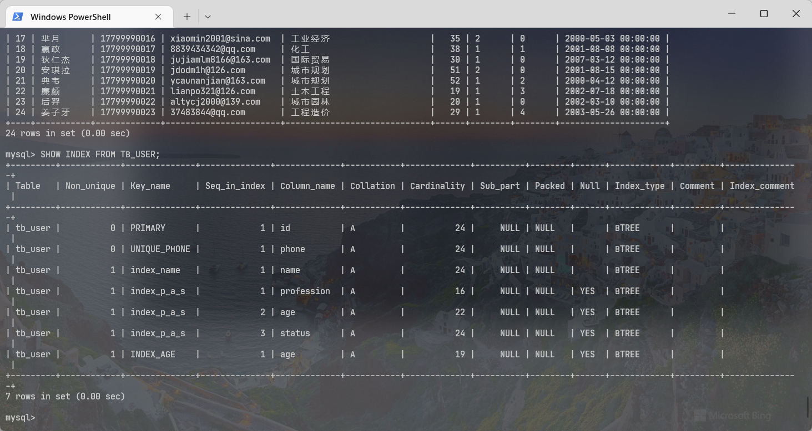

1、执行SQL : explain select * from tb_user where profession = '软件工程';

> ```sql
> mysql> explain select * from tb_user where profession = '软件工程';
> +----+-------------+---------+------------+------+---------------+-------------+---------+-------+------+----------+-------+
> | id | select_type | table   | partitions | type | possible_keys | key         | key_len | ref   | rows | filtered | Extra |
> +----+-------------+---------+------------+------+---------------+-------------+---------+-------+------+----------+-------+
> |  1 | SIMPLE      | tb_user | NULL       | ref  | index_p_a_s   | index_p_a_s | 47      | const |    4 |   100.00 | NULL  |
> +----+-------------+---------+------------+------+---------------+-------------+---------+-------+------+----------+-------+
> 1 row in set, 1 warning (0.00 sec)
> ```


2、执行SQL，创建profession的单列索引：create index idx_user_pro on tb_user(profession);

> ```sql
> mysql> ALTER TABLE tb_user ADD INDEX INDEX_PROFESSION (PROFESSION);
> Query OK, 0 rows affected (0.02 sec)
> Records: 0  Duplicates: 0  Warnings: 0
> ```


3、创建单列索引后，再次执行1中的SQL语句，查看执行计划，看看到底走哪个索引。

```sql
mysql> explain select * from tb_user where profession = '软件工程';
+----+-------------+---------+------------+------+------------------------------+-------------+---------+-------+------+----------+-------+
| id | select_type | table   | partitions | type | possible_keys                | key         | key_len | ref   | rows | filtered | Extra |
+----+-------------+---------+------------+------+------------------------------+-------------+---------+-------+------+----------+-------+
|  1 | SIMPLE      | tb_user | NULL       | ref  | index_p_a_s,INDEX_PROFESSION | index_p_a_s | 47      | const |    4 |   100.00 | NULL  |
+----+-------------+---------+------------+------+------------------------------+-------------+---------+-------+------+----------+-------+
1 row in set, 1 warning (0.00 sec)
```

测试结果，我们可以看到，possible_keys中 index_p_a_s,INDEX_PROFESSION 这两个索引都可能用到，最终MySQL选择了index_p_a_s索引。这是MySQL自动选择的结果。

那么，我们能不能在查询的时候，自己来指定使用哪个索引呢？ 答案是肯定的，此时就可以借助于MySQL的SQL提示来完成。 接下来，介绍一下SQL提示。

SQL提示，是优化数据库的一个重要手段，简单来说，就是在SQL语句中加入一些人为的提示来达到优化操作的目的。


1、<span style="color: red">USE INDEX</span>：建议MySQL使用哪一个索引完成此次查询（仅仅是建议，mysql内部还会再次进行评估）。

> ```sql
> mysql> explain select * from tb_user use index(INDEX_PROFESSION) where profession = '软件工程';
> +----+-------------+---------+------------+------+------------------+------------------+---------+-------+------+----------+-------+
> | id | select_type | table   | partitions | type | possible_keys    | key              | key_len | ref   | rows | filtered | Extra |
> +----+-------------+---------+------------+------+------------------+------------------+---------+-------+------+----------+-------+
> |  1 | SIMPLE      | tb_user | NULL       | ref  | INDEX_PROFESSION | INDEX_PROFESSION | 47      | const |    4 |   100.00 | NULL  |
> +----+-------------+---------+------------+------+------------------+------------------+---------+-------+------+----------+-------+
> 1 row in set, 1 warning (0.00 sec)
> ```


2、<span style="color:red">ignore index</span>：忽略指定的索引

> ```sql
> mysql> explain select * from tb_user ignore index(index_p_a_s) where profession = '软件工程';
> +----+-------------+---------+------------+------+------------------+------------------+---------+-------+------+----------+-------+
> | id | select_type | table   | partitions | type | possible_keys    | key              | key_len | ref   | rows | filtered | Extra |
> +----+-------------+---------+------------+------+------------------+------------------+---------+-------+------+----------+-------+
> |  1 | SIMPLE      | tb_user | NULL       | ref  | INDEX_PROFESSION | INDEX_PROFESSION | 47      | const |    4 |   100.00 | NULL  |
> +----+-------------+---------+------------+------+------------------+------------------+---------+-------+------+----------+-------+
> 1 row in set, 1 warning (0.00 sec)
> ```


3、<span style="color:red">force index</span>：强制使用索引。

> ```sql
> mysql> explain select * from tb_user force index(index_p_a_s) where profession = '软件工程';
> +----+-------------+---------+------------+------+---------------+-------------+---------+-------+------+----------+-------+
> | id | select_type | table   | partitions | type | possible_keys | key         | key_len | ref   | rows | filtered | Extra |
> +----+-------------+---------+------------+------+---------------+-------------+---------+-------+------+----------+-------+
> |  1 | SIMPLE      | tb_user | NULL       | ref  | index_p_a_s   | index_p_a_s | 47      | const |    4 |   100.00 | NULL  |
> +----+-------------+---------+------------+------+---------------+-------------+---------+-------+------+----------+-------+
> 1 row in set, 1 warning (0.00 sec)
> ```


#### 覆盖索引

尽量使用覆盖索引，减少select *。 那么什么是覆盖索引呢？ <span style="color:red">覆盖索引是指查询使用了索引，并且需要返回的列，在该索引中已经全部能够找到 。</span>

> ```sql
> explain select id, profession from tb_user where profession = '软件工程' and age = 31 and status = '0';
> explain select id,profession,age, status from tb_user where profession = '软件工程' and age = 31 and status = '0';
> explain select id,profession,age, status, name from tb_user where profession = '软件工程' and age = 31 and status = '0';
> explain select * from tb_user where profession = '软件工程' and age = 31 and status = '0';
> 
> ```

把上述的 INDEX_AGE,这个之前测试使用过的索引直接删除。

> ```sql
> mysql> ALTER TABLE tb_user DROP INDEX INDEX_AGE;
> Query OK, 0 rows affected (0.01 sec)
> Records: 0  Duplicates: 0  Warnings: 0
> ```

- 查看上述SQL执行计划

> ```sql
> mysql> explain select id, profession from tb_user where profession = '软件工程' and age = 31 and status = '0';
> +----+-------------+---------+------------+------+---------------+-------------+---------+-------------------+------+----------+--------------------------+
> | id | select_type | table   | partitions | type | possible_keys | key         | key_len | ref               | rows | filtered | Extra                    |
> +----+-------------+---------+------------+------+---------------+-------------+---------+-------------------+------+----------+--------------------------+
> |  1 | SIMPLE      | tb_user | NULL       | ref  | index_p_a_s   | index_p_a_s | 54      | const,const,const |    1 |   100.00 | Using where; Using index |
> +----+-------------+---------+------------+------+---------------+-------------+---------+-------------------+------+----------+--------------------------+
> 1 row in set, 1 warning (0.00 sec)
> 
> mysql> explain select id,profession,age, status from tb_user where profession = '软件工程' and age = 31 and status = '0';
> +----+-------------+---------+------------+------+---------------+-------------+---------+-------------------+------+----------+--------------------------+
> | id | select_type | table   | partitions | type | possible_keys | key         | key_len | ref               | rows | filtered | Extra                    |
> +----+-------------+---------+------------+------+---------------+-------------+---------+-------------------+------+----------+--------------------------+
> |  1 | SIMPLE      | tb_user | NULL       | ref  | index_p_a_s   | index_p_a_s | 54      | const,const,const |    1 |   100.00 | Using where; Using index |
> +----+-------------+---------+------------+------+---------------+-------------+---------+-------------------+------+----------+--------------------------+
> 1 row in set, 1 warning (0.00 sec)
> 
> mysql> explain select id,profession,age, status, name from tb_user where profession = '软件工程' and age = 31 and status = '0';
> +----+-------------+---------+------------+------+---------------+-------------+---------+-------------------+------+----------+-----------------------+
> | id | select_type | table   | partitions | type | possible_keys | key         | key_len | ref               | rows | filtered | Extra                 |
> +----+-------------+---------+------------+------+---------------+-------------+---------+-------------------+------+----------+-----------------------+
> |  1 | SIMPLE      | tb_user | NULL       | ref  | index_p_a_s   | index_p_a_s | 54      | const,const,const |    1 |   100.00 | Using index condition |
> +----+-------------+---------+------------+------+---------------+-------------+---------+-------------------+------+----------+-----------------------+
> 1 row in set, 1 warning (0.00 sec)
> 
> mysql>  explain select * from tb_user where profession = '软件工程' and age = 31 and status = '0';
> +----+-------------+---------+------------+------+---------------+-------------+---------+-------------------+------+----------+-----------------------+
> | id | select_type | table   | partitions | type | possible_keys | key         | key_len | ref               | rows | filtered | Extra                 |
> +----+-------------+---------+------------+------+---------------+-------------+---------+-------------------+------+----------+-----------------------+
> |  1 | SIMPLE      | tb_user | NULL       | ref  | index_p_a_s   | index_p_a_s | 54      | const,const,const |    1 |   100.00 | Using index condition |
> +----+-------------+---------+------------+------+---------------+-------------+---------+-------------------+------+----------+-----------------------+
> 1 row in set, 1 warning (0.00 sec)
> ```


从上述的执行计划我们可以看到，这四条SQL语句的执行计划前面所有的指标都是一样的，看不出来差异。但是此时，我们主要关注的是后面的Extra(额外的，补充的)，前面两条SQL的结果为 Using where; UsingIndex ; 而后面两条SQL的结果为: Using index condition 。

```sh
# MySQL版本不同，产生的Extra也会不同
# Using index condition: 使用了索引，但是需要回表查询数据
# Using where; Using index: 使用了索引，但是需要的数据都在索引中能找到，不需要回表扫描
#    二级索引中记录了 该索引的字段，还有聚簇索引的字段(主键或者第一个唯一索引)
```


#### 前缀索引

当字段类型为字符串(varchar， text等),时，有时候需要索引很长的字符串，这会让索引变得很大，查询时，浪费大量的磁盘lO，影响查询效率。此时可以只将字符串的一部分前缀，建立索引，这样可以大大节约索引空间，从而提高索引效率。


- **语法**

```sql
-- 创建前缀索引，n为前 n 个字符
CREATE INDEX idx_name ON tb_name (column(n));
ALTER TABLE tb_name ADD INDEX idx_name (column(n));

mysql> ALTER TABLE tb_user ADD INDEX INDEX_EMAIL (email(5));
Query OK, 0 rows affected (0.01 sec)
Records: 0  Duplicates: 0  Warnings: 0
```


- **前缀长度**

可以根据索引的选择性来决定，而选择性是指不重复的索引值（基数）和数据表的记录总数的比值，索引选择性越高则查询效率越高，唯一索引的选择性是1，这是最好的索引选择性，性能也是最好的。

```sql
-- 总记录数
mysql> SELECT COUNT(*) FROM tb_user;
+----------+
| COUNT(*) |
+----------+
|       24 |
+----------+
1 row in set (0.01 sec)

-- 不重复的索引值
mysql> SELECT COUNT(DISTINCT email) FROM tb_user;
+-----------------------+
| COUNT(DISTINCT email) |
+-----------------------+
|                    24 |
+-----------------------+
1 row in set (0.00 sec)

-- 选择性
mysql> SELECT COUNT(DISTINCT SUBSTRING(email, 1, 10)) / COUNT(*) FROM tb_user;
+----------------------------------------------------+
| COUNT(DISTINCT SUBSTRING(email, 1, 10)) / COUNT(*) |
+----------------------------------------------------+
|                                             1.0000 |
+----------------------------------------------------+
1 row in set (0.00 sec)

mysql> SELECT COUNT(DISTINCT SUBSTRING(email, 1, 8)) / COUNT(*) FROM tb_user;
+---------------------------------------------------+
| COUNT(DISTINCT SUBSTRING(email, 1, 8)) / COUNT(*) |
+---------------------------------------------------+
|                                            0.9583 |
+---------------------------------------------------+
1 row in set (0.00 sec)

mysql> SELECT COUNT(DISTINCT SUBSTRING(email, 1, 6)) / COUNT(*) FROM tb_user;
+---------------------------------------------------+
| COUNT(DISTINCT SUBSTRING(email, 1, 6)) / COUNT(*) |
+---------------------------------------------------+
|                                            0.9583 |
+---------------------------------------------------+
1 row in set (0.00 sec)

mysql> SELECT COUNT(DISTINCT SUBSTRING(email, 1, 4)) / COUNT(*) FROM tb_user;
+---------------------------------------------------+
| COUNT(DISTINCT SUBSTRING(email, 1, 4)) / COUNT(*) |
+---------------------------------------------------+
|                                            0.9167 |
+---------------------------------------------------+
1 row in set (0.00 sec)

mysql>
```


```sh
# 流程
# 1、根据email 在 辅助索引中进行前缀比对，查询到主键
# 2、根据主键 在 聚簇索引 中进行查询，查询到 row
# 3、根据查询到的 row的email和 where中的email进行比对
#   4、如果相同，查询到 【根据实际情况，看是否继续】
#   4、如果不同，则 回到 1 ，查找下一个主键【一个前缀可能有多个主键】
```


#### 单列索引与联合索引

1. 单列索引：即一个索引只包含单个列
2. 联合索引：即一个索引包含多个列


```sh
# 当两个字段都有单列索引时，只走了一个索引，这时必然会回表查询
```


创建两者的联合索引

```sql
mysql> ALTER TABLE tb_user ADD UNIQUE UNIQUE_P_N (phone,name);
Query OK, 0 rows affected (0.04 sec)
Records: 0  Duplicates: 0  Warnings: 0
```


此时，依旧发生了回表查询


使用USE INDEX 指定索引

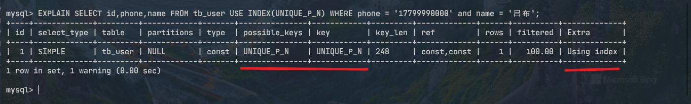


```sh
# Using index 没有发生回表查询
```

推荐使用 联合索引


### 索引设计原则

1. 针对于数据量较大，且查询比较频繁的表建立索引。
2. 针对于常作为查询条件（where）、排序（order by）、分组（group by）操作的字段建立索引。
3. 尽量选择区分度高的列作为索引，尽量建立唯一索引，区分度越高，使用索引的效率越高。
4. 如果是字符串类型的字段，字段的长度较长，可以针对于字段的特点，建立前缀索引。
5. 尽量使用联合索引，减少单列索引，查询时，联合索引很多时候可以覆盖索引，节省存储空间，避免回表，提高查询效率。
6. 要控制索引的数量，索引并不是多多益善，索引越多，维护索引结构的代价也就越大，会影响增删改的效率。
7. 如果索引列不能存储NULL值，请在创建表时使用NOT NULL约束它。当优化器知道每列是否包含NULL值时，它可以更好地确定哪个索引最有效地用于查询。


## MySQL-SQL优化

### 插入数据

- INSERT

如果我们需要一次性往数据库表中插入多条记录，可以从以下三个方面进行优化。

```sql
insert into tb_test values(1,'tom');

insert into tb_test values(2,'cat');

insert into tb_test values(3,'jerry');

.....

```

1、优化方案一

批量插入数据

```sql
Insert into tb_test values(1,'Tom'),(2,'Cat'),(3,'Jerry');

```


2、优化方案二

手动控制事务

```sql
start transaction;

insert into tb_test values(1,'Tom'),(2,'Cat'),(3,'Jerry');

insert into tb_test values(4,'Tom'),(5,'Cat'),(6,'Jerry');

insert into tb_test values(7,'Tom'),(8,'Cat'),(9,'Jerry');

commit;

```


3、优化方案三

主键顺序插入，性能高于乱序插入

```sql
-- 主键乱序插入 : 8 1 9 21 88 2 4 15 89 5 7 3
-- 主键顺序插入 : 1 2 3 4 5 7 8 9 15 21 88 89

```


#### 大批量插入数据

如果一次性需要插入大批量数据(比如: 几百万的记录)，使用insert语句插入性能较低，此时可以使用MySQL数据库提供的load指令进行插入。操作如下


可以执行如下指令，将数据脚本文件中的数据加载到表结构中：

```sql
-- 客户端连接服务端时，加上参数 --local-infile
mysql --local-infile -u root -p

-- 设置全局参数local_infile为1，开启从本地加载文件导入数据的开关
set global local_infile = 1;

-- 执行load指令将准备好的数据，加载到表结构中
load data local infile '/root/sql1.log' into table tb_user fields terminated by ',' lines terminated by '\n' ;

```


### 主键优化

在上一小节，我们提到，主键顺序插入的性能是要高于乱序插入的。 这一小节，就来介绍一下具体的原因，然后再分析一下主键又该如何设计。

1、数据组织方式

在InnoDB存储引擎中，<span style="color:red">表数据都是根据主键顺序组织存放的</span>，这种存储方式的表称为<span style="color:red">索引组织表</span>(index organized table IOT)。


行数据，都是存储在聚集索引的叶子节点上的。而我们之前也讲解过InnoDB的逻辑结构图：

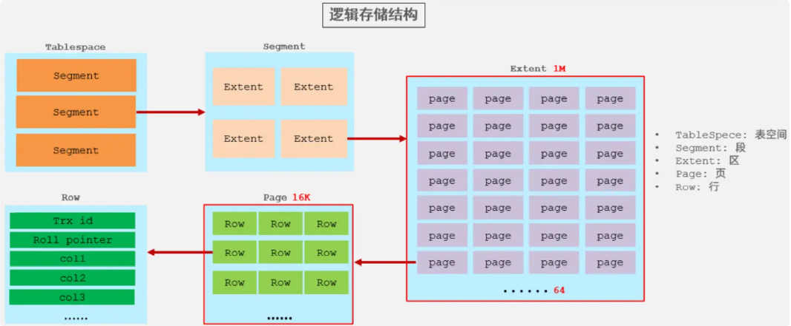


在InnoDB引擎中，数据行是记录在逻辑结构 page 页中的，而每一个页的大小是固定的，默认16K。那也就意味着， 一个页中所存储的行也是有限的，如果插入的数据行row在该页存储不小，将会存储到下一个页中，页与页之间会通过指针连接。


2、页分裂

页可以为空，也可以填充一半，也可以填充100%。每个页包含了2-N行数据(如果一行数据过大，会行溢出)，根据主键排列。

- 主键顺序插入效果

  - 从磁盘中申请页， 主键顺序插入

  

  - 第一个页没有满，继续往第一页插入

  

  - 当第一个也写满之后，再写入第二个页，页与页之间会通过指针连接

  

  - 当第二页写满了，再往第三页写入

  

- 主键乱序插入效果

  - 加入1#,2#页都已经写满了，存放了如图所示的数据

  

  - 此时再插入id为50的记录，我们来看看会发生什么现象

    会再次开启一个页，写入新的页中吗？

    

不会。因为，索引结构的叶子节点是有顺序的。按照顺序，应该存储在47之后。


但是47所在的1#页，已经写满了，存储不了50对应的数据了。 那么此时会开辟一个新的页 3#。

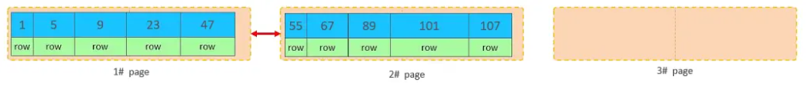

但是并不会直接将50存入3#页，而是会将1#页后一半的数据，移动到3#页，然后在3#页，插入50。


移动数据，并插入id为50的数据之后，那么此时，这三个页之间的数据顺序是有问题的。 1#的下一个 页，应该是3#， 3#的下一个页是2#。 所以，此时，需要重新设置链表指针。


上述的这种现象，称之为 "<span style="color:red">页分裂</span>”，是比较耗费性能的操作。


3、页合并

- 目前表中已有数据的索引结构(叶子节点)如下：

- 


- 当我们对已有数据进行删除时，具体的效果如下:
- 当删除一行记录时，实际上记录并没有被物理删除，只是记录被标记（flaged）为删除并且它的空间变得允许被其他记录声明使用。


- 当我们继续删除2#的数据记录


- 当页中删除的记录达到 <span style="color:red">`MERGE_THRESHOLD`</span>（默认为页的50%），InnoDB会开始寻找最靠近的页（前 或后）看看是否可以将两个页合并以优化空间使用。

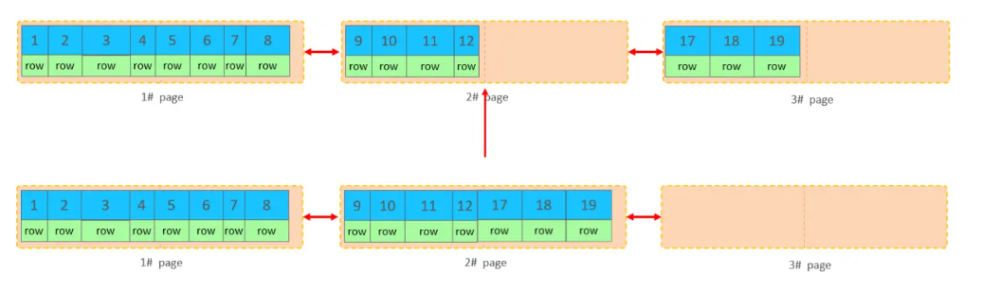

- 删除数据，并将<span style="color:red">页合并</span>之后，再次插入新的数据21，则直接插入3#页


- 这个里面所发生的合并页的这个现象，就称之为 "<span style="color:red">页合并</span>”。

<div style="border-radius: .4rem;
            padding: .5rem 1.5rem;
            border-left-width: .5rem;
            border-left-style: solid;
            background-color: #f3f5f7;
            border-color: #42b983;
            color: #215d42;
            font-weight: 600;">
    <p class="custom-block-title">知识小贴士：</p>
    <p><code style="color: red">MERGE_THRESHOLD</code>：合并页的阈值，可以自己设置，在创建表或者创建索引时指定。</p>
</div>


4、索引设计原则

1. 满足业务需求的情况下，尽量降低主键的长度。
2. 插入数据时，尽量选择顺序插入，选择使用`AUTO_INCREMENT`自增主键。
3. 尽量不要使用`UUID做主键`或者是`其他自然主键`，如身份证号。

```sh
# uudi等无序的数，会造成 页 的频繁 页合并 页分裂
```

4. 业务操作时，`避免对主键的修改`。

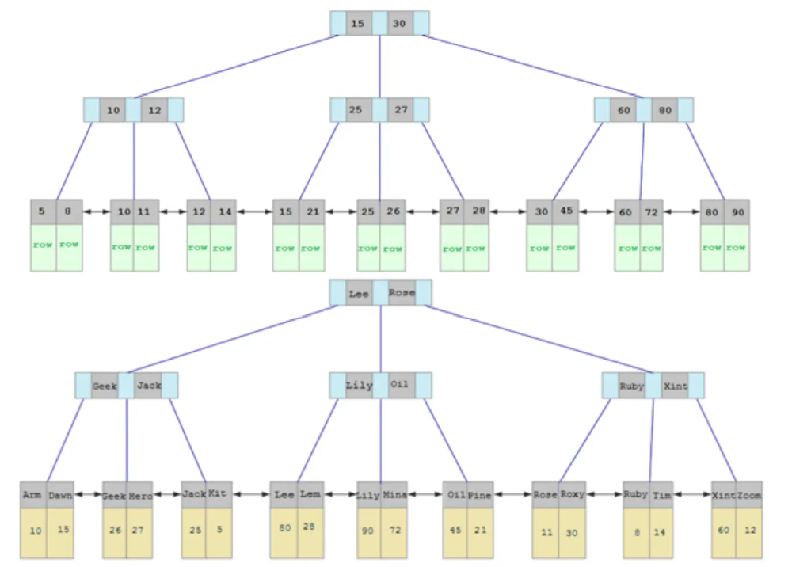


### ORDER BY 优化

MySQL的排序，有两种方式：

<span style="color:red">`Using filesort` </span>: 通过表的索引或全表扫描，读取满足条件的数据行，然后在排序缓冲区sort buffer中完成排序操作，所有不是通过索引直接返回排序结果的排序都叫 FileSort 排序。

<span style="color:red">`Using index` </span>: 通过有序索引顺序扫描直接返回有序数据，这种情况即为 using index，不需要额外排序，操作效率高。

对于以上的两种排序方式，`Using index`的性能高，而`Using filesort`的性能低，<span style="color:red">我们在优化排序操作时，尽量要优化为 `Using index`</span>。

接下来，我们来做一个测试：

1、数据准备

把之前测试时，为tb_user表所建立的部分索引直接删除掉；


2、执行排序SQL

```sql
explain select id,age,phone from tb_user order by age;

```


```sql
explain select id,age,phone from tb_user order by age, phone ;

```

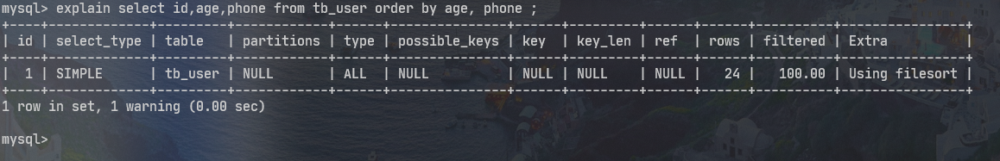

由于 age, phone 都没有索引，所以此时再排序时，出现Using filesort， 排序性能较低。


3、创建索引

```sql
mysql> ALTER TABLE tb_user ADD INDEX INDEX_AGE_PHONE (age, phone);
Query OK, 0 rows affected (0.02 sec)
Records: 0  Duplicates: 0  Warnings: 0
```

4、创建索引后，根据age, phone进行升序排序

```sql
explain select id,age,phone from tb_user order by age;
```


建立索引之后，再次进行排序查询，就由原来的Using filesort， 变为了 Using index，性能就是比较高的了。


5、创建索引后，根据age, phone进行降序排序

```sql
explain select id,age,phone from tb_user order by age desc , phone desc;

```


也出现 Using index， 但是此时Extra中出现了 `Backward index scan`，这个代表反向扫描索引，因为在MySQL中我们创建的索引，默认索引的叶子节点是从小到大排序的，而此时我们查询排序时，是从大到小，所以，在扫描时，就是反向扫描，就会出现 Backward index scan。<span style="color:red"> 在MySQL8版本中，支持降序索引，我们也可以创建降序索引</span>


6、根据phone，age进行升序排序，phone在前，age在后。

```sql
explain select id,age,phone from tb_user order by phone , age;

```


排序时,也需要满足最左前缀法则,否则也会出现 `filesort`。因为在创建索引的时候， age是第一个字段，phone是第二个字段，所以排序时，也就该按照这个顺序来，否则就会出现 `Usingfilesort`。


7、根据age, phone进行降序一个升序，一个降序

```sql
explain select id,age,phone from tb_user order by age asc , phone desc;

```


因为创建索引时，如果未指定顺序，默认都是按照升序排序的，而查询时，一个升序，一个降序，此时就会出现Using filesort。

为了解决上述的问题，我们可以创建一个索引，这个联合索引中 age 升序排序，phone 倒序排序。


8、创建联合索引(age 升序排序，phone 倒序排序)

```sql
mysql> ALTER TABLE tb_user ADD INDEX INDEX_AGE_ASC_PHONE_DESC (age asc, phone desc);
Query OK, 0 rows affected, 1 warning (0.03 sec)
Records: 0  Duplicates: 0  Warnings: 1
```


9、然后再次执行如下SQL

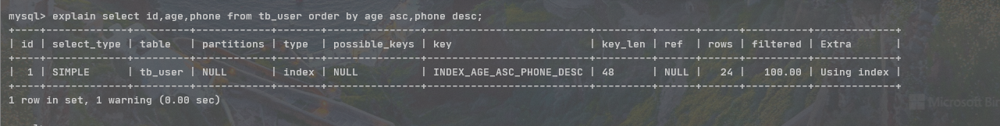

升序/降序联合索引结构图示:


### GROUP BY 优化

分组操作，我们主要来看看索引对于分组操作的影响。

首先我们先将 tb_user 表的索引全部删除掉 。


接下来，在没有索引的情况下，执行如下SQL，查询执行计划：

```sql
explain select profession , count(*) from tb_user group by profession;

```

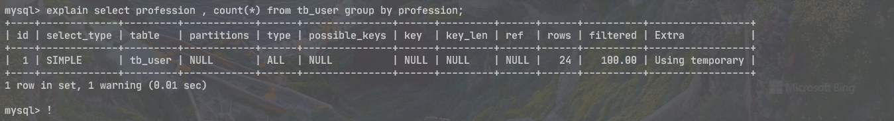

```sh
# Using temporary 使用了临时表
```

然后，我们在针对于 profession ， age， status 创建一个联合索引。

```sql
mysql> ALTER TABLE tb_user ADD INDEX INDEX_P_A_S (profession, age, status);
Query OK, 0 rows affected (0.03 sec)
Records: 0  Duplicates: 0  Warnings: 0
```

紧接着，再执行前面相同的SQL查看执行计划。


我们发现，如果仅仅根据`age`分组，就会出现 `Using temporary` ；而如果是 根据`profession,age`两个字段同时分组，则不会出现 `Using temporary`。原因是因为对于分组操作，在联合索引中，也是符合最左前缀法则的。


所以，在分组操作中，我们需要通过以下两点进行优化，以提升性能：

1. 在分组操作时，可以通过索引来提高效率。
2. 分组操作时，索引的使用也是满足最左前缀法则的。


### LIMIT 优化

在数据量比较大时，如果进行limit分页查询，在查询时，越往后，分页查询效率越低。

我们一起来看看执行limit分页查询耗时对比：

```sql
mysql> select * from tb_user limit 0,10;
10 rows in set (0.00 sec)

mysql> select * from tb_user limit 100,10;
10 rows in set (0.00 sec)

mysql> select * from tb_user limit 1000,10;
10 rows in set (0.00 sec)

mysql> select * from tb_user limit 50000,10;
10 rows in set (0.01 sec)

mysql> select * from tb_user limit 500000,10;
10 rows in set (0.16 sec)

mysql> select * from tb_user limit 900000,10;
10 rows in set (0.28 sec)

```

通过测试我们会看到，越往后，分页查询效率越低，这就是分页查询的问题所在。

因为，当在进行分页查询时，如果执行 limit 2000000,10 ，此时需要MySQL排序前2000010 记录，仅仅返回 2000000 - 2000010 的记录，其他记录丢弃，查询排序的代价非常大 。

优化思路: 一般分页查询时，通过创建 覆盖索引 能够比较好地提高性能，可以通过**覆盖索引加子查询形式**进行优化。

> ```sql
> explain select u.* from tb_user u,(select id from tb_user order by id limit 900000,10) a where u.id = a.id;
> 
> ```

> ```sql
> mysql> explain select u.* from tb_user u,(select id from tb_user order by id limit 900000,10) a where u.id = a.id;
> +----+-------------+------------+------------+--------+---------------+---------+---------+------+--------+----------+-------------+
> | id | select_type | table      | partitions | type   | possible_keys | key     | key_len | ref  | rows   | filtered | Extra       |
> +----+-------------+------------+------------+--------+---------------+---------+---------+------+--------+----------+-------------+
> |  1 | PRIMARY     | <derived2> | NULL       | ALL    | NULL          | NULL    | NULL    | NULL | 900010 |   100.00 | NULL        |
> |  1 | PRIMARY     | u          | NULL       | eq_ref | PRIMARY       | PRIMARY | 4       | a.id |      1 |   100.00 | NULL        |
> |  2 | DERIVED     | tb_user    | NULL       | index  | NULL          | PRIMARY | 4       | NULL | 900010 |   100.00 | Using index |
> +----+-------------+------------+------------+--------+---------------+---------+---------+------+--------+----------+-------------+
> 3 rows in set, 1 warning (0.00 sec)
> 
> ```


### COUNT 优化

```sql
 select count(*) from tb_user;

```

在之前的测试中，我们发现，如果数据量很大，在执行count操作时，是非常耗时的。

- MyISAM 引擎把一个表的总行数存在了磁盘上，因此执行 count(*) 的时候会直接返回这个数，效率很高； 但是如果是带条件的count，MyISAM也慢。
- InnoDB 引擎就麻烦了，它执行 count(*) 的时候，需要把数据一行一行地从引擎里面读出来，然后累积计数。

如果说要大幅度提升InnoDB表的count效率，主要的优化思路：自己计数(可以借助于redis这样的数据库进行,但是如果是带条件的count又比较麻烦了)。


#### COUNT用法

count() 是一个聚合函数，对于返回的结果集，一行行地判断，如果 count 函数的参数不是NULL，累计值就加 1，否则不加，最后返回累计值。

用法：`count（*）`、`count（主键）`、`count（字段）`、`count（数字）`

| count 用法  | 含义                                                         |
| ----------- | ------------------------------------------------------------ |
| count(主键) | InnoDB 引擎会遍历整张表，把每一行的 主键id 值都取出来，返回给服务层。服务层拿到主键后，直接按行进行累加(主键不可能为null) |
| count(字段) | 没有not null 约束 : InnoDB 引擎会遍历整张表把每一行的字段值都取出来，返回给服务层，服务层判断是否为null，不为null，计数累加。有not null 约束：InnoDB 引擎会遍历整张表把每一行的字段值都取出来，返回给服务层，直接按行进行累加。 |
| count(数字) | InnoDB 引擎遍历整张表，但不取值。服务层对于返回的每一行，放一个数字“1”进去，直接按行进行累加。 |
| count(*)    | InnoDB引擎并不会把全部字段取出来，而是专门做了优化，不取值，服务层直接按行进行累加。 |

<span style="color:red">按照效率排序的话，count(字段) < count(主键 id) < count(1) ≈ count(*)，所以尽量使用 count(1)。</span>


### UPDATE 优化

我们主要需要注意一下update语句执行时的注意事项。

```sql
mysql> select * from course;
+----+-------+
| id | name  |
+----+-------+
|  1 | Java  |
|  2 | PHP   |
|  3 | JS    |
|  4 | MySQL |
+----+-------+
4 rows in set (0.00 sec)
```


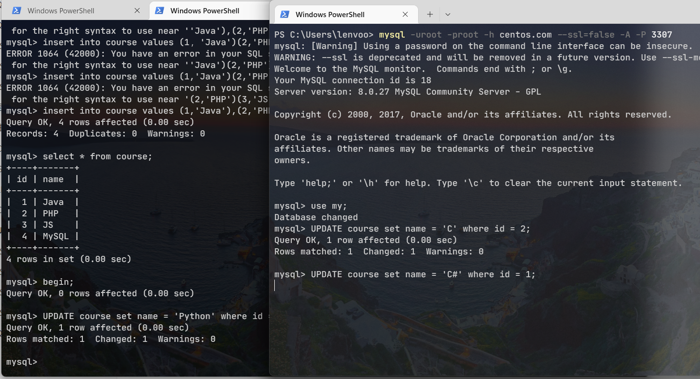

```sh
# 根据 id[带索引] 进行更新，行锁
```

当我们在执行SQL语句时，会锁定id为1这一行的数据，然后事务提交之后，行锁释放。

但是当我们在执行如下SQL时。

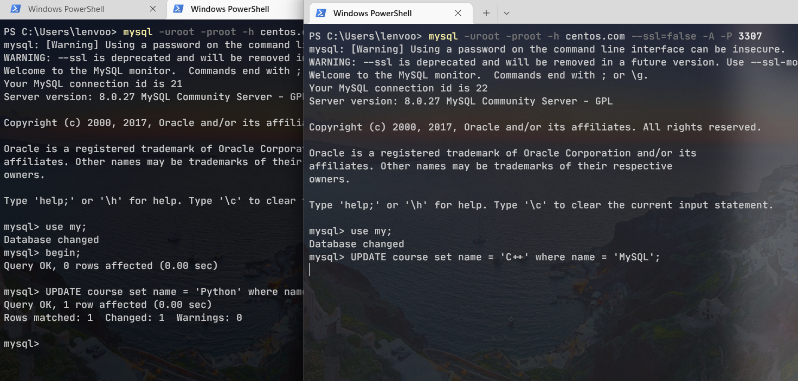

```sh
# 根据 name[无索引] 字段更新，表锁
```


```sh
# 更新操作时，尽量根据索引字段进行更新，否则就会 行锁 变 表锁
# 所以对 更新的条件字段 加上 索引
```

<span style="color:red">InnoDB的行锁是针对索引加的锁，不是针对记录加的锁 ，并且该索引不能失效，否则会从行锁升级为表锁 。也就是说我这边事务没有提交的话，其他关于这个表的update都不会执行成功，导致该update语句的性能大大降低。</span>


## MySQL-视图/存储过程/触发器

### 视图介绍

视图（View）是一种虚拟存在的表。视图中的数据并不在数据库中实际存在，行和列数据来自定义视图的查询中使用的表，并且是在使用视图时动态生成的。

通俗的讲，视图只保存了查询的SQL逻辑，不保存查询结果。所以我们在创建视图的时候，主要的工作就落在创建这条SQL查询语句上。

```sh
# 自我理解，不保存查询结果，当修改基表中的数据时，view中的数据也会发生改变，他始终是这条SQL的逻辑
```


### 视图语法

1. 创建视图

> ```sql
> CREATE [OR REPLACE] VIEW view_name AS select语句 [ WITH [ CASCADED | LOCAL ] CHECK OPTION ]
> 
> mysql> CREATE VIEW tb_user_view AS SELECT id,name FROM tb_user WHERE id <= 10;
> Query OK, 0 rows affected (0.03 sec)
> 
> mysql> CREATE VIEW tb_user_view AS SELECT id,name FROM tb_user WHERE id <= 10;
> ERROR 1050 (42S01): Table 'tb_user_view' already exists
> mysql> CREATE OR REPLACE VIEW tb_user_view AS SELECT id,name FROM tb_user WHERE id <= 10;
> Query OK, 0 rows affected (0.01 sec)
> ```

2. 查询视图

```sql
-- 查看创建视图语句：
SHOW CREATE VIEW 视图名称;

-- 查看视图数据：
SELECT * FROM view_name;
```

3. 删除视图

```sql
DROP VIEW [IF EXISTS] view_name[,name2] ...
```


> ```sql
> -- 创建视图
> mysql> CREATE OR REPLACE VIEW tb_user_view AS SELECT id,name FROM tb_user WHERE id <= 10;
> Query OK, 0 rows affected (0.01 sec)
> 
> -- 查看视图
> mysql> SHOW CREATE VIEW tb_user_view;
> +--------------+------------------------------------------------------------------------------------------------------------------------------------------------------------------------------------------------+----------------------+----------------------+
> | View         | Create View
>                                                                                         | character_set_client | collation_connection |
> +--------------+------------------------------------------------------------------------------------------------------------------------------------------------------------------------------------------------+----------------------+----------------------+
> | tb_user_view | CREATE ALGORITHM=UNDEFINED DEFINER=`root`@`%` SQL SECURITY DEFINER VIEW `tb_user_view` AS select `tb_user`.`id` AS `id`,`tb_user`.`name` AS `name` from `tb_user` where (`tb_user`.`id` <= 10) | utf8                 | utf8_general_ci      |
> +--------------+------------------------------------------------------------------------------------------------------------------------------------------------------------------------------------------------+----------------------+----------------------+
> 1 row in set (0.01 sec)
> 
> -- 查询视图
> mysql> SELECT * FROM tb_user_view;
> +----+-----------+
> | id | name      |
> +----+-----------+
> |  1 | 吕布      |
> |  2 | 曹操      |
> |  3 | 赵云      |
> |  4 | 孙悟空    |
> |  5 | 花木兰    |
> |  6 | 大乔      |
> |  7 | 露娜      |
> |  8 | 程咬金    |
> |  9 | 项羽      |
> | 10 | 白起      |
> +----+-----------+
> 10 rows in set (0.01 sec)
> 
> mysql>
> ```


上述我们演示了，视图应该如何创建、查询、修改、删除，那么我们能不能通过视图来插入、更新数据呢？ 接下来，做一个测试。


执行上述的SQL，我们会发现，id为5和13的数据都是可以成功插入的。 但是我们执行查询，查询出来的数据，却没有id为13的记录。

因为我们在创建视图的时候，指定的条件为 `id<=10`, `id`为`13`的数据，是不符合条件的，所以没有查询出来，但是这条数据确实是已经成功的插入到了基表中。

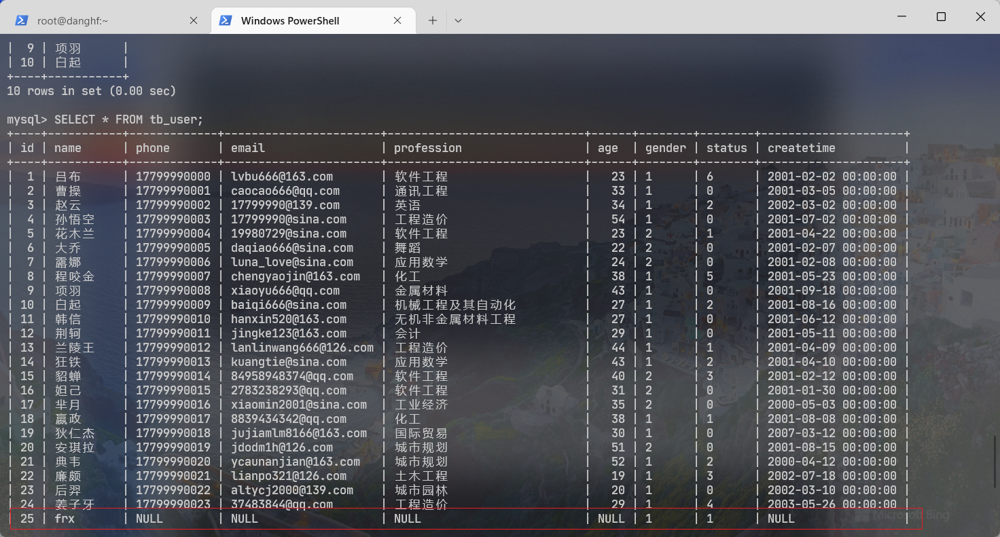

如果我们定义视图时，如果指定了条件，然后我们在插入、修改、删除数据时，**是否可以做到必须满足条件才能操作，否则不能够操作呢**？答案是可以的，这就需要借助于视图的检查选项了。


### 检查语法

当使用WITH CHECK OPTION子句创建视图时，MySQL会通过视图检查正在更改的每个行，例如 插入，更新，删除，以使其符合视图的定义。 MySQL允许基于另一个视图创建视图，它还会检查依赖视图中的规则以保持一致性。为了确定检查的范围，mysql提供了两个选项： `CASCADED` 和`LOCAL`，默认值为 CASCADED 。

1. <span style="color:red">`CASCADED` </span>级联

比如，v2视图是基于v1视图的，如果在v2视图创建的时候指定了检查选项为 cascaded，但是v1视图创建时未指定检查选项。 则在执行检查时，**不仅会检查v2，还会级联检查v2的关联视图v1**

```sh
# 当前视图创建时 有 check cascaded，则不止检查 自身where还回检查上层的where
```

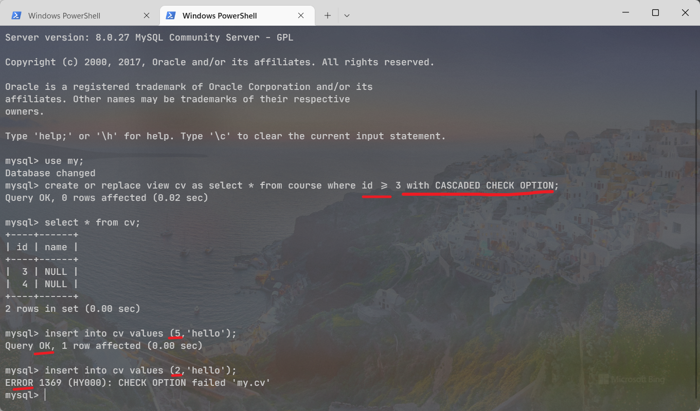

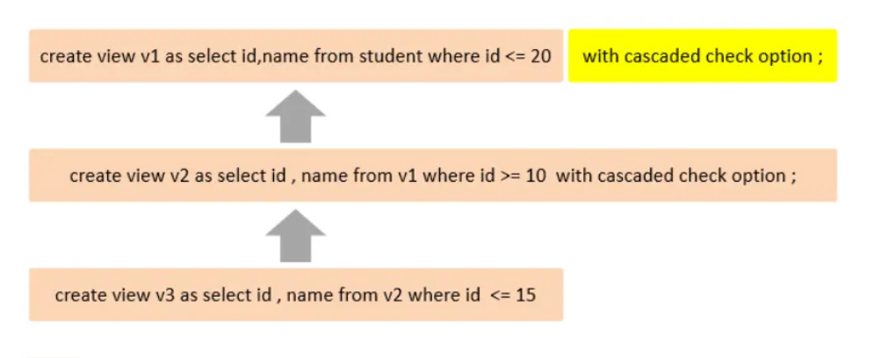

```sql
CREATE VIEW v1 AS SELECT * FROM stu WHERE id <= 20;
-- 没有检查条件
insert into v1 values(10,''); -- ok
insert into v1 values(30,''); -- ok

CREATE VIEW v2 AS SELECT * FROM v1 WHERE id >= 10 WITH CASCADED CHECK OPTION;
-- cascaded 检查
insert into v2 values(10,''); -- ok
-- 插入30，先检查 30 > 10 ? true
-- 然后递归进入上层 v1的条件， 30 < 20 ? false
-- 插入失败
insert into v2 values(30,''); -- error

CREATE VIEW v3 AS SELECT * FROM v2 WHERE id >= 5;
insert into v3 values (15,''); -- ok
-- 自身，不检查
-- 进入 上层v2，8 >= 10 ? false
-- 失败
insert into v3 values (8,''); -- error
```


2. <span style="color:red">`LOCAL`</span> 本地

比如，v2视图是基于v1视图的，如果在v2视图创建的时候指定了检查选项为 local ，但是v1视图创建时未指定检查选项。 则在执行检查时，**只会检查v2，不会检查v2的关联视图v1**。如果**v1视图创建时指令检查选项，则会执行检查**

```sh
# 只检查 自身的 where，除非上层也带有check否则不坚持上层
```


```sql
CREATE VIEW v1 AS SELECT * FROM stu WHERE id <= 20;
-- 没有检查条件
insert into v1 values(10,''); -- ok
insert into v1 values(30,''); -- ok

CREATE VIEW v2 AS SELECT * FROM v1 WHERE id >= 10 WITH local CHECK OPTION;
-- cascaded 检查
-- 10>= 10? true
-- 进入 v1，v1没有检查，不进行检查
insert into v2 values(10,''); -- ok
-- 插入30，先检查 30 > 10 ? true
-- v1没有检查条件，不检查
insert into v2 values(30,''); -- ok

CREATE VIEW v3 AS SELECT * FROM v2 WHERE id >= 5;
-- 自身 不检查
-- 进入 v2 检查 15 >= 10
-- 进入 v1 不检查
insert into v3 values (15,''); -- ok
-- 自身，不检查
-- 进入 上层v2，8 >= 10 ? false
-- 失败
insert into v3 values (8,''); -- error
```


### 视图的更新

要使视图可更新，**视图中的行与基础表中的行之间必须存在一对一的关系**。如果视图包含以下任何一项，则该视图不可更新：

1. 聚合函数或窗口函数（SUM()、 MIN()、 MAX()、 COUNT()等）
2. DISTINCT
3. GROUP BY
4. HAVING
5. UNION 或者 UNION ALL

案例演示:

```sql
create view tb_user_view as select count(*) from student;
```

上述的视图中，就只有一个单行单列的数据，如果我们对这个视图进行更新或插入的，将会报错。

```sql
insert into tb_user_view values(10);
```

### 视图作用

1. 简单

视图不仅可以简化用户对数据的理解，也可以简化他们的操作。那些被经常使用的查询可以被定义为视图，从而使得用户不必为以后的操作每次指定全部的条件。

2. 安全

数据库可以授权，但不能授权到数据库特定行和特定的列上。通过视图用户只能查询和修改他们所能见到的数据。

3. 数据独立

视图可帮助用户屏蔽真实表结构变化带来的影响。

- **案例**

1、为了保证数据库表的安全性，开发人员在操作tb_user表时，只能看到的用户的基本字段，屏蔽手机号和邮箱两个字段。

> ```sql
> create view tb_user_view as select id,name,profession,age,gender,status,createtime from tb_user;
> select * from tb_user_view;
> 
> ```

2、查询每个学生所选修的课程（三张表联查），这个功能在很多的业务中都有使用到，为了简化操作，定义一个视图

> ```sql
> create view tb_stu_course_view as select s.name student_name , s.no student_no , c.name course_name from student s, student_course sc , course c where s.id = sc.studentid and sc.courseid = c.id;
> 
> select * from tb_stu_course_view;
> 
> ```


### 存储过程

#### 介绍

存储过程是事先经过编译并存储在数据库中的一段 SQL 语句的集合，调用存储过程可以简化应用开发人员的很多工作，减少数据在数据库和应用服务器之间的传输，对于提高数据处理的效率是有好处的。

存储过程思想上很简单，就是数据库 SQL 语言层面的代码封装与重用。

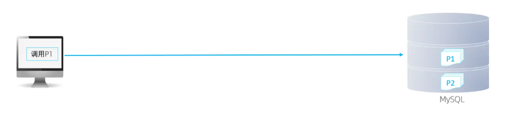特点:

- 封装，复用 --------------------------------------> 可以把某一业务SQL封装在存储过程中，需要用到的时候直接调用即可。
- 可以接收参数，也可以返回数据 ----------> 再存储过程中，可以传递参数，也可以接收返回值。
- 减少网络交互，效率提升 -------------------> 如果涉及到多条SQL，每执行一次都是一次网络传输。 而如果封装在存储过程中，我们只需要网络交互一次可能就可以了。


#### 基础语法

1. 创建

```sql
CREATE PROCEDURE 存储过程名称 ([ 参数列表 ])
BEGIN
	-- SQL语句
END ;

```

2. 调用

```sql
CALL 名称 ([ 参数 ]);

```

3. 查看

```sql
SELECT * FROM INFORMATION_SCHEMA.ROUTINES WHERE ROUTINE_SCHEMA = 'xxx'; -- 查询指定数据库的存储过程及状态信息
SHOW CREATE PROCEDURE 存储过程名称 ; -- 查询某个存储过程的定义

```

4. 删除

```sql
DROP PROCEDURE [ IF EXISTS ] 存储过程名称 ；

```


```sh
# 注意:

# 在命令行中，执行创建存储过程的SQL时，需要通过关键字 delimiter 指定SQL语句的结束符。
```

- 演示案例

```sql
-- 存储过程基本语法
-- 创建
create procedure p1()
begin
	select count(*) from student;
end;
-- 调用
call p1()

-- 查看
select * from information_schema.ROUTINES where ROUTINE_SCHEMA = 'MySQL_Advanced';

show create procedure p1;

-- 删除
drop procedure if exists p1;

```


#### 变量

在MySQL中变量分为三种类型: 系统变量、用户定义变量、局部变量。

##### 系统变量

系统变量 是MySQL服务器提供，不是用户定义的，属于服务器层面。分为全局变量（`GLOBAL`）、会话变量（`SESSION`）。

1. 查看系统变量

   ```sql
   SHOW [ SESSION | GLOBAL ] VARIABLES ;               -- 查看所有系统变量
   SHOW [ SESSION | GLOBAL ] VARIABLES LIKE '......';  -- 可以通过LIKE模糊匹配方式查找变量
   SELECT @@[SESSION | GLOBAL] 系统变量名;               -- 查看指定变量的值
   
   ```

2. 设置系统变量

```sql
SET [ SESSION | GLOBAL ] 系统变量名 = 值 ;
SET @@[SESSION | GLOBAL]系统变量名 = 值 ;

```

```sh
# 注意:

# 如果没有指定SESSION/GLOBAL，默认是SESSION，会话变量。

# mysql服务重新启动之后，所设置的全局参数会失效，要想不失效，可以在 /etc/my.cnf中配置。

# 全局变量(GLOBAL): 全局变量针对于所有的会话。
# 会话变量(SESSION): 会话变量针对于单个会话，在另外一个会话窗口就不生效了。
```

演示案例：

```sql
-- 查看全局系统变量
SHOW GLOBAL VARIABLES;
SHOW SESSION VARIABLES;

-- 查看事务提交的开关
SHOW SESSION VARIABLES LIKE 'auto%';

-- 查看指定变量
SELECT @@SESSION.autocommit;
SET SESSION autocommit=0;
INSERT INTO student VALUES(18,"小红",18);
SELECT * from student;
-- 只有手动提交事务后，其他的会话才能查询到小红这条记录
COMMIT;

```


##### 用户定义变量

用户定义变量 是用户根据需要自己定义的变量，用户变量不用提前声明，在用的时候直接用 "@变量名" 使用就可以。其<span style="color: red">作用域为当前连接</span>。

1. 赋值

方式一：

```sql
SET @var_name = expr [, @var_name = expr] ... ;
SET @var_name := expr [, @var_name := expr] ... ;

```

赋值时，可以使用`=` ，也可以使用`:=` ,推荐使用`:=`。

方式二：

```sql
SELECT @var_name ;

```

```sh
# 注意:

# 用户定义的变量无需对其进行声明或初始化，只不过获取到的值为NULL。
```


演示案例:

```sh
-- 用户变量
SET @myname = 'xustudyxu';
set @myage := 21;
set @mygender := '男',@myhobby := 'java';

select @mycolor := 'red';
SELECT COUNT(*) into @mycount from student;

-- 使用
SELECT @myname,@myage,@mygender;

SELECT @mycolor,@mycount;

```


##### 局部变量

<span style="color: red">局部变量</span>是根据需要定义的在局部生效的变量，访问之前，需要`DECLARE`声明。可用作存储过程内的局部变量和输入参数，局部变量的范围是在其内声明的BEGIN ... END块。

1. 声明

```sql
DECLARE 变量名 变量类型 [DEFAULT ... ] ;

```

变量类型就是数据库字段类型：INT、BIGINT、CHAR、VARCHAR、DATE、TIME等。

2. 赋值

```sql
SET 变量名 = 值 ;
SET 变量名 := 值 ;
SELECT 字段名 INTO 变量名 FROM 表名 ... ;

```

演示实例:

```sql
-- 声明局部变量 - declare
-- 赋值
create PROCEDURE p2()
begin
		declare stu_count int default 0;
		set stu_count := 100;
		select count(*) into stu_count from student;
		select stu_count;
end

call p2();

```


#### if 判断

1. 介绍

if 用于做条件判断，具体的语法结构为：

```sql
IF 条件1 THEN
	.....
ELSEIF 条件2 THEN     -- 可选
	.....
ELSE 				 -- 可选
	.....
END IF;

```

在if条件判断的结构中，ELSE IF 结构可以有多个，也可以没有。 ELSE结构可以有，也可以没有。

2. 案例

根据定义的分数score变量，判定当前分数对应的分数等级。

- score >= 85分，等级为优秀。
- score >= 60分 且 score < 85分，等级为及格。
- score < 60分，等级为不及格。

```sql
create PROCEDURE p3()
begin 
		declare score int default 68;
		declare result varchar(10);
		
		if score < 60 then
				set result := '不及格';
		elseif score < 85 then
				set result := '及格';
		else
				set result := '优秀';
		end if;
		
		select result;
end;

call p3();

```

上述的需求我们虽然已经实现了，但是也存在一些问题，比如：score 分数我们是在存储过程中定义死的，而且最终计算出来的分数等级，我们也仅仅是最终查询展示出来而已。

那么我们能不能，把score分数动态的传递进来，计算出来的分数等级是否可以作为返回值返回呢？答案是肯定的，我们可以通过接下来所学习的 参数 来解决上述的问题。

#### 参数

1. 介绍

参数的类型，主要分为以下三种：IN、OUT、INOUT。 具体的含义如下：

| 类型  | 含义                                         | 备注 |
| ----- | -------------------------------------------- | ---- |
| IN    | 该类参数作为输入，也就是需要调用时传入值     | 默认 |
| OUT   | 该类参数作为输出，也就是该参数可以作为返回值 |      |
| INOUT | 既可以作为输入参数，也可以作为输出参数       |      |

用法：

```sql
CREATE PROCEDURE 存储过程名称 ([ IN/OUT/INOUT 参数名 参数类型 ])
BEGIN
	-- SQL语句
END ;

```


2. 案例一

根据传入参数score，判定当前分数对应的分数等级，并返回。

- score >= 85分，等级为优秀。
- score >= 60分 且 score < 85分，等级为及格。
- score < 60分，等级为不及格。

```sql
create procedure p4(in score int,out result varchar(10))
begin 
		if score < 60 then
				set result := '不及格';
		elseif score < 85 then
				set result := '及格';
		else
				set result := '优秀';
		end if;
end;

-- 定义用户变量 @result来接收返回的数据, 用户变量可以不用声明
call p4(76,@result);

select @result;

```


3. 案例三

将**传入**的200分制的分数，进行换算，换算成百分制，然后**返回**。

```sql
create procedure p5(inout score double)
begin 
	set score := score*0.5;
end;

set @score := 198;
call p5(@score);

select @score;

```


#### case

1. 语法

case结构及作用，和我们在基础篇中所讲解的流程控制函数很类似。有两种语法格式：

语法1：

> ```sql
> -- 含义： 当case_value的值为 when_value1时，执行statement_list1，当值为 when_value2时，执行statement_list2， 否则就执行 statement_list
> CASE case_value
> 	WHEN when_value1 THEN statement_list1
> 	[ WHEN when_value2 THEN statement_list2] ...
> 	[ ELSE statement_list ]
> END CASE;
> 
> ```

语法2：

> ```sql
> -- 含义： 当条件search_condition1成立时，执行statement_list1，当条件search_condition2成立时，执行statement_list2， 否则就执行 statement_list
> CASE
> 	WHEN search_condition1 THEN statement_list1
> 	[WHEN search_condition2 THEN statement_list2] ...
> 	[ELSE statement_list]
> END CASE;
> 
> ```


2. 案例

根据传入的月份，判定月份所属的季节（要求采用case结构）。

- 1-3月份，为第一季度
- 4-6月份，为第二季度
- 7-9月份，为第三季度
- 10-12月份，为第四季度

```sql
create procedure p6(in month int)
begin
		declare result varchar(10);
		case
		when month >=1 and month <=3 then
				set result := '第一季度';
		when month >=4 and month <=6 then
				set result := '第二季度';
		when month >=7 and month <=9 then 
				set result := '第三季度';
		when month>=10 and month <=12 then
				set result := '第四季度';
		else
				set result := '非法参数';
		end case;
		
		select concat('您输入的月份:',month,',所属的季度为:',result);
end;

call p6(11);

```

```sh
# 提示

# 注意：如果判定条件有多个，多个条件之间，可以使用 and 或 or 进行连接。
```


#### While

1. 介绍

while 循环是有条件的循环控制语句。满足条件后，再执行循环体中的SQL语句。具体语法为：

```sql
-- 先判定条件，如果条件为true，则执行逻辑，否则，不执行逻辑
WHILE 条件 DO
	SQL逻辑...
END WHILE;

```

2. 案例

计算从1累加到n的值，n为传入的参数值。

```sql
-- A. 定义局部变量, 记录累加之后的值;
-- B. 每循环一次, 就会对n进行减1 , 如果n减到0, 则退出循环

create procedure p7(in n int)
begin
		declare total int default 0;
		
		while n>0 do
			set total := total + n;
			set n := n-1;
		end while;
		
		select total;
end;

call p7(100);

```


#### loop

1. 介绍

LOOP 实现简单的循环，如果不在SQL逻辑中增加退出循环的条件，可以用其来实现简单的死循环。LOOP可以配合一下两个语句使用：

- LEAVE ：配合循环使用，退出循环。
- ITERATE：必须用在循环中，作用是跳过当前循环剩下的语句，直接进入下一次循环。

```sql
[begin_label:] LOOP
	SQL逻辑...
END LOOP [end_label];

LEAVE label; 		-- 退出指定标记的循环体
ITERATE label; 		-- 直接进入下一次循环

```

上述语法中出现的 begin_label，end_label，label 指的都是我们所自定义的标记。


2. 案例一

计算从1累加到n的值，n为传入的参数值。

```sql
-- A. 定义局部变量, 记录累加之后的值;
-- B. 每循环一次, 就会对n进行-1 , 如果n减到0, 则退出循环 ----> leave x
create procedure p9(in n int)
begin 
		declare total int default 0;
		
		sum:loop
				if n<=0 then
						leave sum;
				end if;
				
				set total := total + n;
				set n := n - 1;
		end loop sum;
		
		select total;
end;

call p9(10);

```

3. 案例二

计算从1到n之间的偶数累加的值，n为传入的参数值。

```sql
-- A. 定义局部变量, 记录累加之后的值;
-- B. 每循环一次, 就会对n进行-1 , 如果n减到0, 则退出循环 ----> leave xx
-- C. 如果当次累加的数据是奇数, 则直接进入下一次循环. --------> iterate xx
create procedure p10(in n int)
begin
		declare total int default 0;
		sum:loop
				if n<=0 then
					leave sum;
				end if;						
				if n%2=1 then
					set n := n - 1;
					iterate sum;
				end if;	
				set total := total + n;
				set n := n - 1;
		end loop sum;
		select total;
end;

call p10(10);

```


#### 游标

1. 介绍

游标（CURSOR）是用来存储<span style="color:red">查询结果集</span>的数据类型 , 在存储过程和函数中可以使用游标对结果集进行循环的处理。游标的使用包括游标的声明、`OPEN`、`FETCH` 和 `CLOSE`，其语法分别如下。

A. 声明游标

```sql
DECLARE 游标名称 CURSOR FOR 查询语句 ;

```

B. 打开游标

```sql
OPEN 游标名称 ;

```

C. 获取游标记录

```sql
FETCH 游标名称 INTO 变量 [, 变量 ] ;

```

D. 关闭游标

```sql
CLOSE 游标名称 ;

```


2. 案例

根据传入的参数uage，来查询用户表tb_user中，所有的用户年龄小于等于uage的用户姓名（name）和专业（profession），并将用户的姓名和专业插入到所创建的一张新表(id,name,profession)中。

```sql
-- 逻辑:
-- A. 声明游标, 存储查询结果集
-- B. 准备: 创建表结构
-- C. 开启游标
-- D. 获取游标中的记录
-- E. 插入数据到新表中
-- F. 关闭游标
create procedure  p11(in uage int)
begin 
		declare uname varchar(100);
		declare upro varchar(100);
		declare u_cursor cursor for select name,profession from tb_user where age <= uage;
		
		drop table if exists tb_user_pro;
		create table if not exists tb_user_pro(
				id int primary key auto_increment,
				name varchar(100),
				profession varchar(100)
		);
		
		open u_cursor;
		while true do
				fetch u_cursor into uname,upro;
				insert into tb_user values (null,uname,upro);
		end while;
		
		close u_cursor;
end;

call p11(40);

```

```sh
# 提示

# 注意，声明自定义变量要写在声明游标前面。
```

上述的存储过程，最终我们在调用的过程中，会报错，之所以报错是因为上面的while循环中，并没有退出条件。当游标的数据集获取完毕之后，再次获取数据，就会报错，从而终止了程序的执行。


#### 条件处理器

1. 介绍

<span style="color: red">条件处理程序（Handler）</span>可以用来定义在流程控制结构执行过程中遇到问题时相应的处理步骤。具体语法为：

```sql
DECLARE handler_action HANDLER FOR condition_value [, condition_value] ... statement ;

handler_action 的取值：
	CONTINUE: 继续执行当前程序
	EXIT: 终止执行当前程序
	
condition_value 的取值：
	SQLSTATE sqlstate_value: 状态码，如 02000
	SQLWARNING: 所有以01开头的SQLSTATE代码的简写
	NOT FOUND: 所有以02开头的SQLSTATE代码的简写
	SQLEXCEPTION: 所有没有被SQLWARNING 或 NOT FOUND捕获的SQLSTATE代码的简写

```


2. 案例

我们继续来完成在上一小节提出的这个需求，并解决其中的问题。

根据传入的参数uage，来查询用户表tb_user中，所有的用户年龄小于等于uage的用户姓名（name）和专业（profession），并将用户的姓名和专业插入到所创建的一张新表(id,name,profession)中。

A. 通过SQLSTATE指定具体的状态码

> ```sql
> create procedure  p12(in uage int)
> begin 
> 		declare uname varchar(100);
> 		declare upro varchar(100);
> 		declare u_cursor cursor for select name,profession from tb_user where age <= uage;
> 		-- 声明条件处理程序 ： 当SQL语句执行抛出的状态码为02000时，将关闭游标u_cursor，并退出
> 		declare exit hander for sqlstate '02000' close u_cursor;
> 		
> 		drop table if exists tb_user_pro;
> 		create table if not exists tb_user_pro(
> 				id int primary key auto_increment,
> 				name varchar(100),
> 				profession varchar(100)
> 		);
> 		
> 		open u_cursor;
> 		while true do
> 				fetch u_cursor into uname,upro;
> 				insert into tb_user_pro values (null,uname,upro);
> 		end while;
> 		
> 		close u_cursor;
> end;
> 
> call p12(40);
> 
> ```

B. 通过SQLSTATE的代码简写方式 NOT FOUND

02 开头的状态码，代码简写为 NOT FOUND

> ```sql
> create procedure  p12(in uage int)
> begin 
> 		declare uname varchar(100);
> 		declare upro varchar(100);
> 		declare u_cursor cursor for select name,profession from tb_user where age <= uage;
> 		-- 声明条件处理程序 ： 当SQL语句执行抛出的状态码为02000时，将关闭游标u_cursor，并退出
> 		declare exit hander for sqlstate not found close u_cursor;
> 		
> 		drop table if exists tb_user_pro;
> 		create table if not exists tb_user_pro(
> 				id int primary key auto_increment,
> 				name varchar(100),
> 				profession varchar(100)
> 		);
> 		
> 		open u_cursor;
> 		while true do
> 				fetch u_cursor into uname,upro;
> 				insert into tb_user_pro values (null,uname,upro);
> 		end while;
> 		
> 		close u_cursor;
> end;
> 
> call p12(40);
> 
> ```

具体的错误状态码，可以参考官方文档：

[https://dev.mysql.com/doc/refman/8.0/en/declare-handler.html(opens new window)](https://dev.mysql.com/doc/refman/8.0/en/declare-handler.html)

[https://dev.mysql.com/doc/mysql-errors/8.0/en/server-error-reference.html](https://dev.mysql.com/doc/refman/8.0/en/declare-handler.html)


### 存储函数

1. 介绍

存储函数是有返回值的存储过程，存储函数的参数`只能是IN类型`的。具体语法如下：

```sql
CREATE FUNCTION 存储函数名称 ([ 参数列表 ])
RETURNS type [characteristic ...]
BEGIN
	-- SQL语句
	RETURN ...;
END ;

```

characteristic说明：

- DETERMINISTIC：相同的输入参数总是产生相同的结果
- NO SQL ：不包含 SQL 语句。
- READS SQL DATA：包含读取数据的语句，但不包含写入数据的语句。

2. 案例

计算从1累加到n的值，n为传入的参数值。

```sql
create function fun1(n int)
returns int deterministic
begin
	declare total int default 0;
	while n>0 do
		set total := total + n;
		set n := n - 1;
	end while;
	return total;
end;

select fun1(50);

```

在mysql8.0版本中binlog默认是开启的，一旦开启了，mysql就要求在定义存储过程时，需要指定`characteristic`特性，否则就会报如下错误：

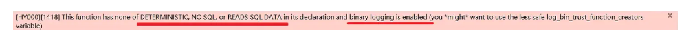

### 触发器

#### 介绍

触发器是与表有关的数据库对象，指在<span style="color:  red">`insert/update/delete`之前(`BEFORE`)或之后(`AFTER`)</span>，触发并执行触发器中定义的SQL语句集合。触发器的这种特性可以协助应用在数据库端确保数据的完整性, 日志记录 , 数据校验等操作 。

使用别名<span style="color: red">`OLD`和`NEW`</span>来引用触发器中发生变化的记录内容，这与其他的数据库是相似的。现在触发器还只支持行级触发，不支持语句级触发。

| 触发器类型      | NEW和OLD                                                |
| --------------- | ------------------------------------------------------- |
| INSERT 型触发器 | NEW 表示将要或者已经新增的数据                          |
| UPDATE 型触发器 | OLD 表示修改之前的数据 , NEW 表示将要或已经修改后的数据 |
| DELETE 型触发器 | OLD 表示将要或者已经删除的数据                          |


#### 语法

1、创建

```sql
CREATE TRIGGER trigger_name
BEFORE/AFTER INSERT/UPDATE/DELETE
ON tbl_name FOR EACH ROW -- 行级触发器
BEGIN
	trigger_stmt ;
END;

```

2、查看

```sql
SHOW TRIGGERS;

```

3、删除

```sql
DROP TRIGGER [schema_name.]trigger_name ; 
-- 如果没有指定 schema_name，默认为当前数据库 。
```


#### 案例

通过触发器记录 tb_user 表的数据变更日志，将变更日志插入到日志表user_logs中, 包含增加,修改 , 删除 ;

表结构准备:

```sql
-- 准备工作 : 日志表 user_logs
create table user_logs(
id int(11) not null auto_increment,
	operation varchar(20) not null comment '操作类型, insert/update/delete',
	operate_time datetime not null comment '操作时间',
	operate_id int(11) not null comment '操作的ID',
	operate_params varchar(500) comment '操作参数',
	primary key(`id`)
)engine=innodb default charset=utf8;

```

A. 插入数据触发器

```sql
create trigger tb_user_insert_trigger
		after insert on tb_user for each row
begin
		insert into user_logs(id, operation, operate_time, operate_id, operate_params) values
		(null,'insert',now(),new.id,concat('插入的数据内容为:id=',new.id,',name=',new.name,',phone=',new.phone,',email=',new.email,',profession=',new.profession));
end


```

测试

```sql
--查看
show triggers;


-- 插入数据到tb_user表
insert into tb_user(id, name, phone, email, profession, age, gender, status, createtime) VALUES (null,'三皇子','18809091212','erhuangzi@163.com','软件工程',23,'1','1',now());

```

测试完毕之后，检查日志表中的数据是否可以正常插入，以及插入数据的正确性。

B. 修改数据触发器

```sql
--修改数据的触发器
create trigger tb_user_update_trigger
		after update on tb_user for each row
begin
		insert into user_logs(id, operation, operate_time, operate_id, operate_params) values
		(null,'update',now(),new.id,concat('更新之前的数据内容为:id=',old.id,',name=',old.name,',phone=',old.phone,',email=',old.email,',profession=',old.profession,
		'| 更新之后的数据内容为:id=',new.id,',name=',new.name,',phone=',new.phone,',email=',new.email,',profession=',new.profession));
end

```


测试：

```sql
show triggers;

-- 更新
update tb_user set profession = '会计' where id = 23;
update tb_user set profession = '会计' where id <= 5;

```

测试完毕之后，检查日志表中的数据是否可以正常插入，以及插入数据的正确性。

C. 删除数据触发器

```sql
--删除数据的触发器
create trigger tb_user_delete_trigger
		after delete on tb_user for each row
begin
		insert into user_logs(id, operation, operate_time, operate_id, operate_params) values
		(null,'delete',now(),old.id,concat('删除之前的数据内容为:id=',old.id,',name=',old.name,',phone=',old.phone,',email=',old.email,',profession=',old.profession));
end

```

测试:

```sql
 --查看
show triggers;

delete from tb_user where id = 24;

```

测试完毕之后，检查日志表中的数据是否可以正常插入，以及插入数据的正确性。

user_logs表中的数据:

> ```sql
> 1	insert	2022-10-01 15:01:31	25	插入的数据内容为:id=25,name=三皇子,phone=18809091212,email=erhuangzi@163.com,profession=软件工程
> 2	update	2022-10-01 15:11:10	23	更新之前的数据内容为:id=23,name=后羿,phone=17799990022,email=altycj2000@139.com,profession=城市园林| 更新之后的数据内容为:id=23,name=后羿,phone=17799990022,email=altycj2000@139.com,profession=会计
> 3	update	2022-10-01 15:11:10	1	更新之前的数据内容为:id=1,name=吕布,phone=17799990000,email=lvbu666@163.com,profession=软件工程| 更新之后的数据内容为:id=1,name=吕布,phone=17799990000,email=lvbu666@163.com,profession=会计
> 4	update	2022-10-01 15:11:10	2	更新之前的数据内容为:id=2,name=曹操,phone=17799990001,email=caocao666@qq.com,profession=通讯工程| 更新之后的数据内容为:id=2,name=曹操,phone=17799990001,email=caocao666@qq.com,profession=会计
> 5	update	2022-10-01 15:11:10	3	更新之前的数据内容为:id=3,name=赵云,phone=17799990002,email=17799990@139.com,profession=英语| 更新之后的数据内容为:id=3,name=赵云,phone=17799990002,email=17799990@139.com,profession=会计
> 6	update	2022-10-01 15:11:10	4	更新之前的数据内容为:id=4,name=孙悟空,phone=17799990003,email=17799990@sina.com,profession=工程造价| 更新之后的数据内容为:id=4,name=孙悟空,phone=17799990003,email=17799990@sina.com,profession=会计
> 7	update	2022-10-01 15:11:10	5	更新之前的数据内容为:id=5,name=花木兰,phone=17799990004,email=19980729@sina.com,profession=软件工程| 更新之后的数据内容为:id=5,name=花木兰,phone=17799990004,email=19980729@sina.com,profession=会计
> 8	update	2022-10-01 15:12:47	1	更新之前的数据内容为:id=1,name=吕布,phone=17799990000,email=lvbu666@163.com,profession=会计| 更新之后的数据内容为:id=1,name=吕布,phone=17799990000,email=lvbu666@163.com,profession=会计
> 9	update	2022-10-01 15:12:47	2	更新之前的数据内容为:id=2,name=曹操,phone=17799990001,email=caocao666@qq.com,profession=会计| 更新之后的数据内容为:id=2,name=曹操,phone=17799990001,email=caocao666@qq.com,profession=会计
> 10	update	2022-10-01 15:12:47	3	更新之前的数据内容为:id=3,name=赵云,phone=17799990002,email=17799990@139.com,profession=会计| 更新之后的数据内容为:id=3,name=赵云,phone=17799990002,email=17799990@139.com,profession=会计
> 11	update	2022-10-01 15:12:47	4	更新之前的数据内容为:id=4,name=孙悟空,phone=17799990003,email=17799990@sina.com,profession=会计| 更新之后的数据内容为:id=4,name=孙悟空,phone=17799990003,email=17799990@sina.com,profession=会计
> 12	update	2022-10-01 15:12:47	5	更新之前的数据内容为:id=5,name=花木兰,phone=17799990004,email=19980729@sina.com,profession=会计| 更新之后的数据内容为:id=5,name=花木兰,phone=17799990004,email=19980729@sina.com,profession=会计
> 13	delete	2022-10-01 15:47:46	24	删除之前的数据内容为:id=24,name=姜子牙,phone=17799990023,email=37483844@qq.com,profession=工程造价
> 
> ```


## MySQL-锁

### 概述

锁是计算机协调多个进程或线程并发访问某一资源的机制。在数据库中，除传统的计算资源（<span style="color: red">`CPU、RAM、I/O`</span>）的争用以外，数据也是一种供许多用户共享的资源。如何保证数据并发访问的一致性、有效性是所有数据库必须解决的一个问题，锁冲突也是影响数据库并发访问性能的一个重要因素。从这个角度来说，锁对数据库而言显得尤其重要，也更加复杂。

MySQL中的锁，按照锁的粒度分，分为以下三类：

- 全局锁：锁定数据库中的所有表。
- 表级锁：每次操作锁住整张表。
- 行级锁：每次操作锁住对应的行数据。


### 全局锁

#### 介绍

全局锁就是对整个数据库实例加锁，加锁后整个实例就处于只读状态，后续的DML的写语句，DDL语句，已经更新操作的事务提交语句都将被阻塞。

其典型的使用场景是做全库的逻辑备份，对所有的表进行锁定，从而获取一致性视图，保证数据的完整性。

为什么全库逻辑备份，就需要加全就锁呢？

A. 我们一起先来分析一下不加全局锁，可能存在的问题。

假设在数据库中存在这样三张表: tb_stock 库存表，tb_order 订单表，tb_orderlog 订单日志表。


- 在进行数据备份时，先备份了tb_stock库存表。
- 然后接下来，在业务系统中，执行了下单操作，扣减库存，生成订单（更新tb_stock表，插入tb_order表）。
- 然后再执行备份 tb_order表的逻辑。
- 业务中执行插入订单日志操作。
- 最后，又备份了tb_orderlog表。

此时备份出来的数据，是存在问题的。因为备份出来的数据，tb_stock表与tb_order表的数据不一致(有最新操作的订单信息,但是库存数没减)。

那如何来规避这种问题呢? 此时就可以借助于MySQL的全局锁来解决


B. 再来分析一下加了全局锁后的情况


对数据库进行进行逻辑备份之前，先对整个数据库加上全局锁，一旦加了全局锁之后，其他的DDL、DML全部都处于阻塞状态，但是可以执行DQL语句，也就是处于只读状态，而数据备份就是查询操作。那么数据在进行逻辑备份的过程中，数据库中的数据就是不会发生变化的，这样就保证了数据的一致性和完整性。

#### 语法

1. 全局加锁

```sql
flush tables with read lock;

```

2. 数据备份

```sql
mysqldump -uroot –p1234 itcast > itcast.sql

```

3. 释放锁

```sql
unlock tables;

```


#### 特点

数据库中加全局锁，是一个比较重的操作，存在以下问题：

- 如果在主库上备份，那么在备份期间都不能执行更新，业务基本上就得停摆。
- 如果在从库上备份，那么在备份期间从库不能执行主库同步过来的二进制日志（binlog），会导致主从延迟。

在InnoDB引擎中，我们可以在备份时加上参数 <span style="color: red">--single-transaction</span> 参数来完成不加锁的一致性数据备份。

```sql
mysqldump --single-transaction -uroot –p123456 itcast > itcast.sql

```


### 表级锁

#### 介绍

表级锁，每次操作锁住整张表。锁定粒度大，<span style="color:red">发生锁冲突的概率最高，并发度最低</span>。应用在MyISAM、InnoDB、BDB等存储引擎中。

对于表级锁，主要分为以下三类：

- 表锁
- 元数据锁（meta data lock，MDL）
- 意向锁

#### 表锁

对于表锁，分为两类：

- 表共享读锁（read lock）
- 表独占写锁（write lock）

语法：

- 加锁：lock tables 表名... read/write。
- 释放锁：unlock tables / 客户端断开连接 。

特点:

A. 读锁


左侧为客户端一，对指定表加了读锁，不会影响右侧客户端二的读，但是会阻塞右侧客户端的写。

<div>
    
    
</div>


B. 写锁

<div>
	
    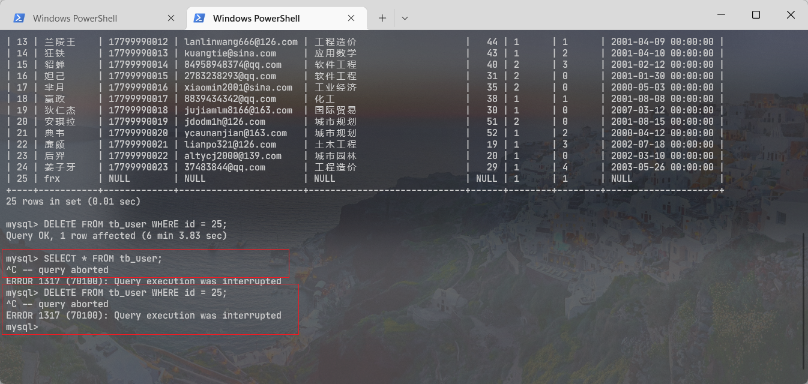
</div>


```sh
# 读锁不会阻塞其他客户端的读，但是会阻塞写。写锁既会阻塞其他客户端的读，又会阻塞其他客户端的写。
```


#### 元数据锁

meta data lock , 元数据锁，简写MDL。

MDL加锁过程是系统自动控制，无需显式使用，在访问一张表的时候会自动加上。MDL锁主要作用是维护表元数据的数据一致性，在表上有活动事务的时候，不可以对元数据进行写入操作。**为了避免DML与DDL冲突，保证读写的正确性**。

这里的元数据，大家可以简单理解为就是一张表的表结构。 也就是说，某一张表涉及到未提交的事务时，是不能够修改这张表的表结构的。

在MySQL5.5中引入了MDL，当对一张表进行增删改查的时候，加MDL读锁(共享)；当对表结构进行变更操作的时候，加MDL写锁(排他)。

常见的SQL操作时，所添加的元数据锁：

| 对应SQL                                        | 锁类型                                  | 说明                                             |
| ---------------------------------------------- | --------------------------------------- | ------------------------------------------------ |
| lock tables xxx read/write                     | SHARED_READ_ONLY / SHARED_NO_READ_WRITE |                                                  |
| select 、select ... lock in share mode         | SHARED_READ                             | 与SHARED_READ、SHARED_WRITE兼容，与EXCLUSIVE互斥 |
| insert 、update、delete、select ... for update | SHARED_WRITE                            | 与SHARED_READ、SHARED_WRITE兼容，与EXCLUSIVE互斥 |
| alter table ...                                | EXCLUSIVE                               | 与其他的MDL都互斥                                |


演示：

当执行SELECT、INSERT、UPDATE、DELETE等语句时，添加的是元数据共享锁（SHARED_READ / SHARED_WRITE），之间是兼容的。

<div>
	
    
</div>


当执行SELECT语句时，添加的是元数据共享锁（SHARED_READ），会阻塞元数据排他锁（EXCLUSIVE），之间是互斥的。

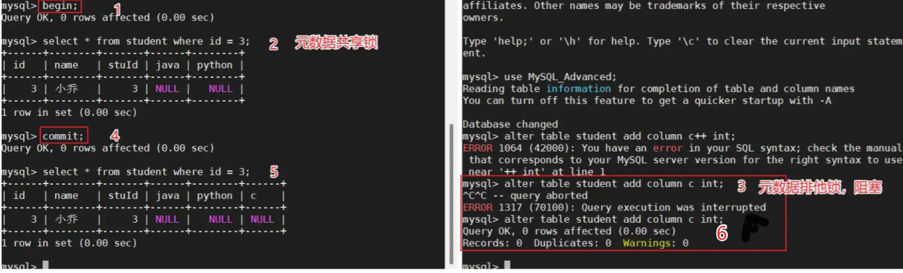


我们可以通过下面的SQL，来查看数据库中的元数据锁的情况：

> ```sql
> mysql> select object_type,object_schema,object_name,lock_type,lock_duration from performance_schema.metadata_locks;
> +-------------------+--------------------+----------------+---------------------+---------------+
> | object_type       | object_schema      | object_name    | lock_type           | lock_duration |
> +-------------------+--------------------+----------------+---------------------+---------------+
> | TABLE             | performance_schema | metadata_locks | SHARED_READ         | TRANSACTION   |
> | SCHEMA            | performance_schema | NULL           | INTENTION_EXCLUSIVE | TRANSACTION   |
> | COLUMN STATISTICS | performance_schema | metadata_locks | SHARED_READ         | STATEMENT     |
> | COLUMN STATISTICS | performance_schema | metadata_locks | SHARED_READ         | STATEMENT     |
> | COLUMN STATISTICS | performance_schema | metadata_locks | SHARED_READ         | STATEMENT     |
> | COLUMN STATISTICS | performance_schema | metadata_locks | SHARED_READ         | STATEMENT     |
> | COLUMN STATISTICS | performance_schema | metadata_locks | SHARED_READ         | STATEMENT     |
> | COLUMN STATISTICS | performance_schema | metadata_locks | SHARED_READ         | STATEMENT     |
> | COLUMN STATISTICS | performance_schema | metadata_locks | SHARED_READ         | STATEMENT     |
> | COLUMN STATISTICS | performance_schema | metadata_locks | SHARED_READ         | STATEMENT     |
> | COLUMN STATISTICS | performance_schema | metadata_locks | SHARED_READ         | STATEMENT     |
> | COLUMN STATISTICS | performance_schema | metadata_locks | SHARED_READ         | STATEMENT     |
> | COLUMN STATISTICS | performance_schema | metadata_locks | SHARED_READ         | STATEMENT     |
> +-------------------+--------------------+----------------+---------------------+---------------+
> 13 rows in set (0.06 sec)
> ```


#### 意向锁

1、介绍

为了避免DML在执行时，加的行锁与表锁的冲突，在InnoDB中引入了意向锁，使得表锁不用检查每行数据是否加锁，使用意向锁来减少表锁的检查。

假如没有意向锁，客户端一对表加了行锁后，客户端二如何给表加表锁呢，来通过示意图简单分析一下：

首先客户端一，开启一个事务，然后执行DML操作，在执行DML语句时，会对涉及到的行加行锁。

当客户端二，想对这张表加表锁时，会检查当前表是否有对应的行锁，如果没有，则添加表锁，此时就会从第一行数据，检查到最后一行数据，效率较低。


有了意向锁之后 :

客户端一，在执行DML操作时，会对涉及的行加行锁，同时也会对该表加上意向锁。

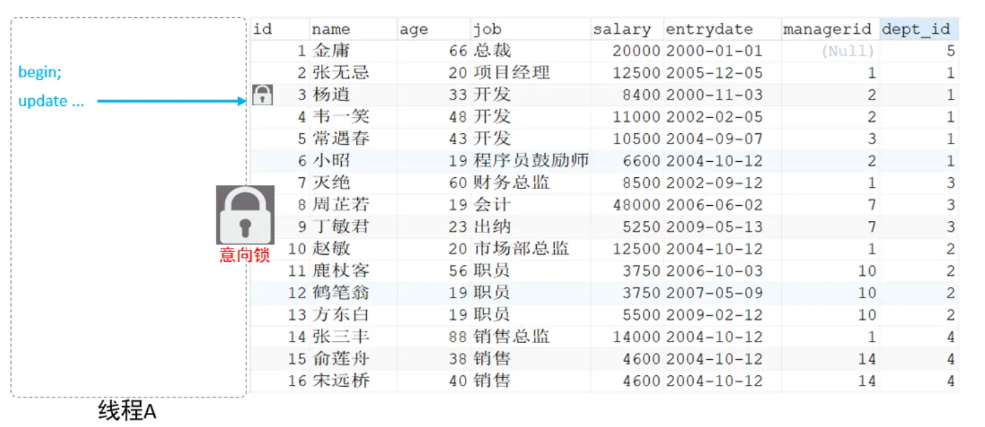

而其他客户端，在对这张表加表锁的时候，会根据该表上所加的意向锁来判定是否可以成功加表锁，而不用逐行判断行锁情况了。


2. 分类

- **意向共享锁(IS): 由语句select ... lock in share mode添加** 。**与表锁共享锁(read)兼容，与表锁排他锁(write)互斥**。
- **意向排他锁(IX)**: **由insert、update、delete、select...for update添加 **。**与表锁共享锁(read)及排他锁(write)都互斥，意向锁之间不会互斥**。

```sh
# 一旦事务提交了，意向共享锁、意向排他锁，都会自动释放。
```

可以通过以下SQL，查看意向锁及行锁的加锁情况：

> ```sql
> select object_schema,object_name,index_name,lock_type,lock_mode,lock_data from performance_schema.data_locks;
> 
> ```

A.  意向共享锁与表读锁是兼容的

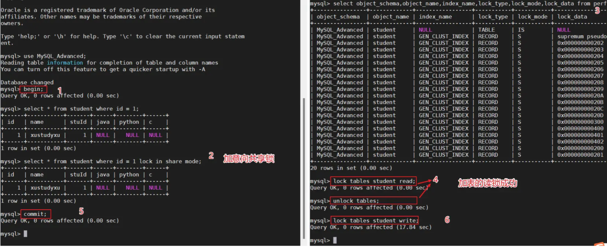


B.  意向排他锁与表读锁、写锁都是互斥的


### 行级锁

#### 介绍

行级锁，每次操作锁住对应的行数据。<span style="color: red">锁定粒度最小，发生锁冲突的概率最低，并发度最高</span>。应用在InnoDB存储引擎中。

InnoDB的数据是基于索引组织的，行锁是通过对索引上的索引项加锁来实现的，而不是对记录加的锁。对于行级锁，主要分为以下三类：

- 行锁（Record Lock）：锁定单个行记录的锁，防止其他事务对此行进行update和delete。在RC、RR隔离级别下都支持。


- 间隙锁（Gap Lock）：锁定索引记录间隙（不含该记录），确保索引记录间隙不变，防止其他事务在这个间隙进行insert，产生幻读。在RR隔离级别下都支持。

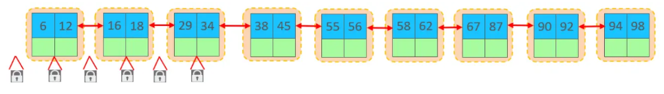

- 临键锁（Next-Key Lock）：行锁和间隙锁组合，同时锁住数据，并锁住数据前面的间隙Gap。在RR隔离级别下支持。

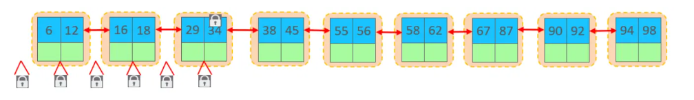


#### 行锁

1. 介绍

InnoDB实现了以下两种类型的行锁：

- 共享锁（S）：允许一个事务去读一行，阻止其他事务获得相同数据集的排它锁。
- 排他锁（X）：允许获取排他锁的事务更新数据，阻止其他事务获得相同数据集的共享锁和排他 锁。

两种行锁的兼容情况如下:


常见的SQL语句，在执行时，所加的行锁如下：

| SQL                           | 行锁类型   | 说明                                     |
| ----------------------------- | ---------- | ---------------------------------------- |
| INSERT ...                    | 排他锁     | 自动加锁                                 |
| UPDATE ...                    | 排他锁     | 自动加锁                                 |
| DELETE ...                    | 排他锁     | 自动加锁                                 |
| SELECT（正常）                | 不加任何锁 |                                          |
| SELECT ... LOCK IN SHARE MODE | 共享锁     | 需要手动在SELECT之后加LOCK IN SHARE MODE |
| SELECT ... FOR UPDATE         | 排他锁     | 需要手动在SELECT之后加FOR UPDATE         |

2. 演示

默认情况下，InnoDB在 REPEATABLE READ事务隔离级别运行，InnoDB使用 next-key 锁进行搜索和索引扫描，以防止幻读。

- 针对唯一索引进行检索时，对已存在的记录进行等值匹配时，将会自动优化为行锁。
- InnoDB的行锁是针对于索引加的锁，不通过索引条件检索数据，那么InnoDB将对表中的所有记录加锁，此时 就会升级为表锁。

可以通过以下SQL，查看意向锁及行锁的加锁情况：

> ```sql
> select object_schema,object_name,index_name,lock_type,lock_mode,lock_data from performance_schema.data_locks;
> 
> ```


数级准备：

```sql
CREATE TABLE `stu` (
	`id` int NOT NULL PRIMARY KEY AUTO_INCREMENT,
	`name` varchar(255) DEFAULT NULL,
	`age` int NOT NULL
) ENGINE = InnoDB CHARACTER SET = utf8mb4;
INSERT INTO `stu` VALUES (1, 'tom', 1);
INSERT INTO `stu` VALUES (3, 'cat', 3);
INSERT INTO `stu` VALUES (8, 'rose', 8);
INSERT INTO `stu` VALUES (11, 'jetty', 11);
INSERT INTO `stu` VALUES (19, 'lily', 19);
INSERT INTO `stu` VALUES (25, 'luci', 25);

```

演示行锁的时候，我们就通过上面这张表来演示一下。

A. 普通的select语句，执行时，不会加锁

<div>
	
    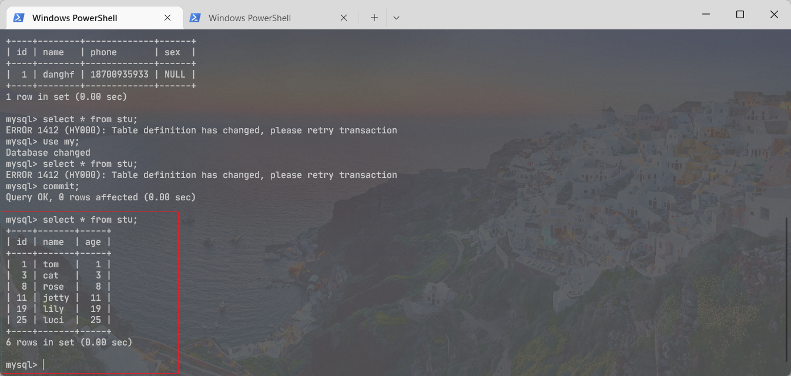
</div>


B. select...lock in share mode，加共享锁，**共享锁与共享锁之间兼容**。

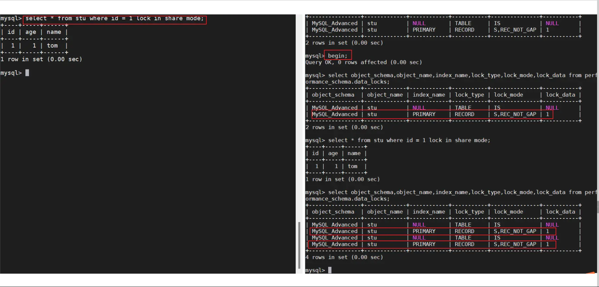

共享锁与排他锁之间互斥。


客户端一获取的是id为1这行的共享锁，客户端二是可以获取id为3这行的排它锁的，因为不是同一行数据。 而如果客户端二想获取id为1这行的排他锁，会处于阻塞状态，以为共享锁与排他锁之间互斥。

C. **排它锁与排他锁之间互斥**

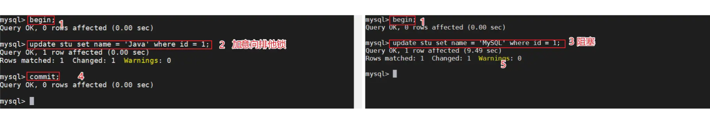

当客户端一，执行update语句，会为id为1的记录加排他锁； 客户端二，如果也执行update语句更新id为1的数据，也要为id为1的数据加排他锁，但是客户端二会处于阻塞状态，因为排他锁之间是互斥的。 直到客户端一，把事务提交了，才会把这一行的行锁释放，此时客户端二，解除阻塞。

D. **无索引行锁升级为表锁**

stu表中数据如下:

```sql
mysql> select * from stu;
+----+-----+-------+
| id | age | name  |
+----+-----+-------+
|  1 |   1 | Java  |
|  3 |   3 | Java  |
|  8 |   8 | rose  |
| 11 |  11 | jetty |
| 19 |  19 | lily  |
| 25 |  25 | luci  |
+----+-----+-------+
6 rows in set (0.00 sec)

```

我们在两个客户端中执行如下操作:

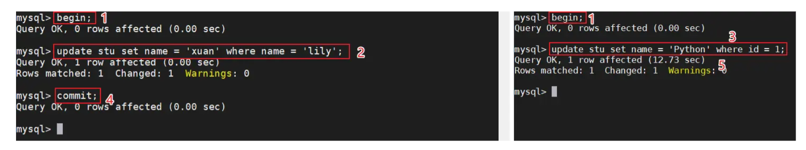

在客户端一中，开启事务，并执行update语句，更新name为Lily的数据，也就是id为19的记录 。然后在客户端二中更新id为3的记录，却不能直接执行，会处于阻塞状态，为什么呢？

原因就是因为此时，客户端一，根据name字段进行更新时，name字段是没有索引的，如果没有索引，此时行锁会升级为表锁(因为行锁是对索引项加的锁，而name没有索引)。

接下来，我们再针对name字段建立索引，索引建立之后，再次做一个测试：


此时我们可以看到，客户端一，开启事务，然后依然是根据name进行更新。而客户端二，在更新id为3的数据时，更新成功，并未进入阻塞状态。 这样就说明，我们根据索引字段进行更新操作，就可以避免行锁升级为表锁的情况。


#### 间隙锁&临键锁

默认情况下，InnoDB在 REPEATABLE READ事务隔离级别运行，InnoDB使用 next-key 锁进行搜索和索引扫描，以防止幻读。

- 索引上的等值查询(唯一索引)，给不存在的记录加锁时, 优化为间隙锁 。
- 索引上的等值查询(非唯一普通索引)，向右遍历时最后一个值不满足查询需求时，next-key lock 退化为间隙锁。
- 索引上的范围查询(唯一索引)--会访问到不满足条件的第一个值为止。

```sh
# 注意:

# 间隙锁唯一目的是防止其他事务插入间隙。间隙锁可以共存，一个事务采用的间隙锁不会阻止另一个事务在同一间隙上采用间隙锁。
```

示例演示

A. **索引上的等值查询(唯一索引)，给不存在的记录加锁时, 优化为**间隙锁 。


B. 索引上的等值查询(非唯一普通索引)，向右遍历时最后一个值不满足查询需求时，next-key lock 退化为间隙锁。

介绍分析一下：

我们知道InnoDB的B+树索引，叶子节点是有序的双向链表。 假如，我们要根据这个二级索引查询值为18的数据，并加上共享锁，我们是只锁定18这一行就可以了吗？ 并不是，因为是非唯一索引，这个结构中可能有多个18的存在，所以，在加锁时会继续往后找，找到一个不满足条件的值（当前案例中也就是29）。此时会对18加临键锁，并对29之前的间隙加锁。


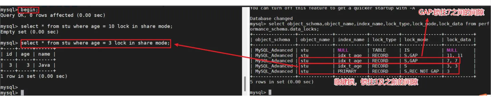

C. 索引上的范围查询(唯一索引)--会访问到不满足条件的第一个值为止。


查询的条件为id>=19，并添加共享锁。 此时我们可以根据数据库表中现有的数据，将数据分为三个部分：

[19]

(19,25]

(25,+∞]

所以数据库数据在加锁是，就是将19加了行锁，25的临键锁（包含25及25之前的间隙），正无穷的临键锁(正无穷及之前的间隙)


## MySQL-InnoDB引擎

### 逻辑存储引擎

InnoDB的逻辑存储结构如下图所示:


1. 表空间

表空间是InnoDB存储引擎逻辑结构的最高层， 如果用户启用了参数 innodb_file_per_table(在8.0版本中默认开启) ，则每张表都会有一个表空间（xxx.ibd），一个mysql实例可以对应多个表空间，用于存储记录、索引等数据。

2. 段

段，分为数据段（Leaf node segment）、索引段（Non-leaf node segment）、回滚段（Rollback segment），InnoDB是索引组织表，数据段就是B+树的叶子节点， 索引段即为B+树的非叶子节点。段用来管理多个Extent（区）。

3. 区

区，表空间的单元结构，每个区的大小为1M。 默认情况下， InnoDB存储引擎页大小为16K， 即一个区中一共有64个连续的页。

4. 页

页，是InnoDB 存储引擎磁盘管理的最小单元，每个页的大小默认为 16KB。为了保证页的连续性，InnoDB 存储引擎每次从磁盘申请 4-5 个区。

5. 行

行，InnoDB 存储引擎数据是按行进行存放的。

在行中，默认有两个隐藏字段：

- Trx_id：每次对某条记录进行改动时，都会把对应的事务id赋值给trx_id隐藏列。
- Roll_pointer：每次对某条引记录进行改动时，都会把旧的版本写入到undo日志中，然后这个隐藏列就相当于一个指针，可以通过它来找到该记录修改前的信息。


### 架构

#### 概述

MySQL5.5 版本开始，默认使用InnoDB存储引擎，它擅长事务处理，具有崩溃恢复特性，在日常开发中使用非常广泛。下面是InnoDB架构图，左侧为内存结构，右侧为磁盘结构。

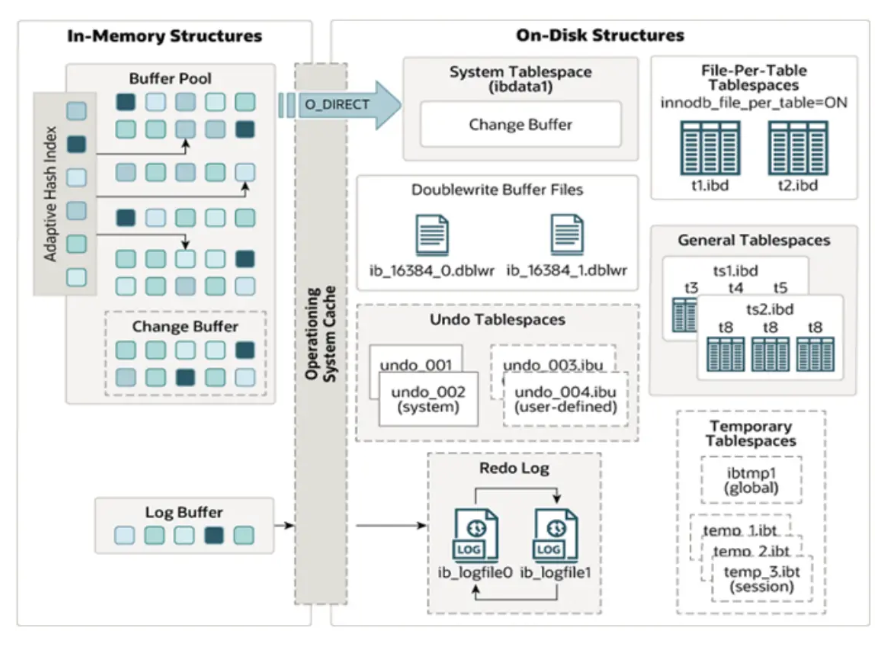


#### 内存架构


在左侧的内存结构中，主要分为这么四大块儿： Buffer Pool、Change Buffer、Adaptive Hash Index、Log Buffer。 下来介绍一下这四个部分。

1. Buffer Pool

InnoDB存储引擎基于磁盘文件存储，访问物理硬盘和在内存中进行访问，速度相差很大，为了尽可能弥补这两者之间的I/O效率的差值，就需要把经常使用的数据加载到缓冲池中，避免每次访问都进行磁盘I/O。

在InnoDB的缓冲池中不仅缓存了索引页和数据页，还包含了undo页、插入缓存、自适应哈希索引以及InnoDB的锁信息等等。

缓冲池 Buffer Pool，是主内存中的一个区域，里面可以缓存磁盘上经常操作的真实数据，在执行增 删改查操作时，先操作缓冲池中的数据（若缓冲池没有数据，则从磁盘加载并缓存），然后再以一定频 率刷新到磁盘，从而减少磁盘IO，加快处理速度。

缓冲池以Page页为单位，底层采用链表数据结构管理Page。根据状态，将Page分为三种类型：

- free page：空闲page，未被使用。
- clean page：被使用page，数据没有被修改过。
- dirty page：脏页，被使用page，数据被修改过，也中数据与磁盘的数据产生了不一致。

在专用服务器上，通常将多达80％的物理内存分配给缓冲池 。参数设置： show variables like 'innodb_buffer_pool_size';

```sql
mysql> show variables like 'innodb_buffer_pool_size';
+-------------------------+-----------+
| Variable_name           | Value     |
+-------------------------+-----------+
| innodb_buffer_pool_size | 134217728 |
+-------------------------+-----------+
1 row in set (0.04 sec)
```


2. Change Buffer

Change Buffer，更改缓冲区（针对于非唯一二级索引页），在执行DML语句时，如果这些数据Page没有在Buffer Pool中，不会直接操作磁盘，而会将数据变更存在更改缓冲区 Change Buffer中，在未来数据被读取时，再将数据合并恢复到Buffer Pool中，再将合并后的数据刷新到磁盘中。

Change Buffer的意义是什么呢?

先来看一幅图，这个是二级索引的结构图

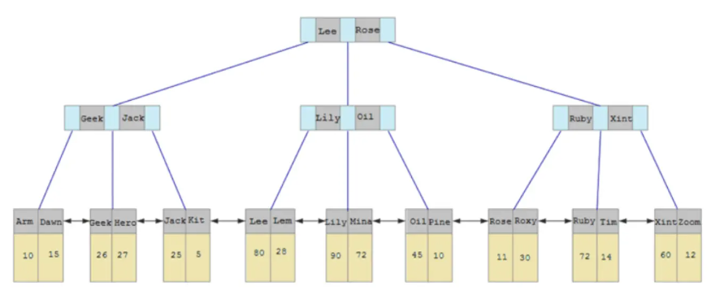

与聚集索引不同，二级索引通常是非唯一的，并且以相对随机的顺序插入二级索引。同样，删除和更新可能会影响索引树中不相邻的二级索引页，如果每一次都操作磁盘，会造成大量的磁盘IO。有了ChangeBuffer之后，我们可以在缓冲池中进行合并处理，减少磁盘IO。

3. Adaptive Hash Index

自适应hash索引，用于优化对Buffer Pool数据的查询。MySQL的innoDB引擎中虽然没有直接支持hash索引，但是给我们提供了一个功能就是这个自适应hash索引。因为前面我们讲到过，hash索引在进行等值匹配时，一般性能是要高于B+树的，因为hash索引一般只需要一次IO即可，而B+树，可能需要几次匹配，所以hash索引的效率要高，但是hash索引又不适合做范围查询、模糊匹配等。

InnoDB存储引擎会监控对表上各索引页的查询，如果观察到在特定的条件下hash索引可以提升速度，则建立hash索引，称之为自适应hash索引。

**自适应哈希索引，无需人工干预，是系统根据情况自动完成**。

参数：<span style="color: red"> `adaptive_hash_index`</span>

4. Log Buffer

Log Buffer：日志缓冲区，用来保存要写入到磁盘中的log日志数据（redo log 、undo log），默认大小为 16MB，日志缓冲区的日志会定期刷新到磁盘中。如果需要更新、插入或删除许多行的事务，增加日志缓冲区的大小可以节省磁盘 I/O。

参数:

innodb_log_buffer_size：缓冲区大小

innodb_flush_log_at_trx_commit：日志刷新到磁盘时机，取值主要包含以下三个：

 `1`:日志在每次事务提交时写入并刷新到磁盘，默认值。

 `0`:每秒将日志写入并刷新到磁盘一次。

 `2`:日志在每次事务提交后写入，并每秒刷新到磁盘一次。

```sql
mysql> show variables like 'innodb_flush_log_at_trx_commit';
+--------------------------------+-------+
| Variable_name                  | Value |
+--------------------------------+-------+
| innodb_flush_log_at_trx_commit | 1     |
+--------------------------------+-------+
1 row in set (0.00 sec)
```


#### 磁盘结构

接下来，再来看看InnoDB体系结构的右边部分，也就是磁盘结构：

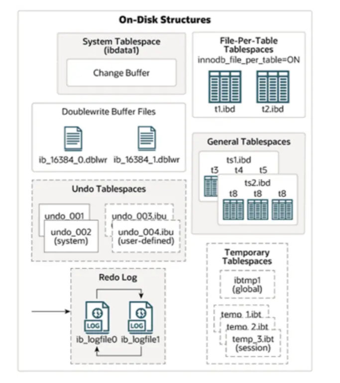

1. <span style="color:red">`System Tablespace`</span>

系统表空间是更改缓冲区的存储区域。如果表是在系统表空间而不是每个表文件或通用表空间中创建的，它也可能包含表和索引数据。(在MySQL5.x版本中还包含InnoDB数据字典、undolog等)

参数：innodb_data_file_path

```sql
mysql> show variables like 'innodb_data_file_path';
+-----------------------+------------------------+
| Variable_name         | Value                  |
+-----------------------+------------------------+
| innodb_data_file_path | ibdata1:12M:autoextend |
+-----------------------+------------------------+
1 row in set (0.00 sec)
```


系统表空间，默认的文件名叫 ibdata1。

2. File-Per-Table Tablespaces

如果开启了innodb_file_per_table开关 ，则每个表的文件表空间包含单个InnoDB表的数据和索引 ，并存储在文件系统上的单个数据文件中。

开关参数：<span style="color:red">`innodb_file_per_table`</span>，该参数默认开启。

```sql
mysql> show variables like 'innodb_file_per_table';
+-----------------------+-------+
| Variable_name         | Value |
+-----------------------+-------+
| innodb_file_per_table | ON    |
+-----------------------+-------+
1 row in set (0.00 sec)
```

那也就是说，我们每创建一个表，都会产生一个表空间文件，如图：

```sh
root@7e897ff09af1:/var/lib/mysql/my# ls -l
total 336
-rw-r-----. 1 mysql mysql 114688 Nov 27 09:13 stu.ibd
-rw-r-----. 1 mysql mysql 114688 Nov 27 08:53 student.ibd
-rw-r-----. 1 mysql mysql 114688 Nov 27 08:34 tb_user.ibd
root@7e897ff09af1:/var/lib/mysql/my# PWD
bash: PWD: command not found
root@7e897ff09af1:/var/lib/mysql/my#
```


3. General Tablespaces

通用表空间，需要通过 CREATE TABLESPACE 语法创建通用表空间，在创建表时，可以指定该表空间。

A. 创建表空间

```sql
CREATE TABLESPACE ts_name ADD DATAFILE 'file_name' ENGINE = engine_name;

mysql> CREATE TABLESPACE ts_name ADD DATAFILE 'file_name' ENGINE = InnoDB;
ERROR 3121 (HY000): The ADD DATAFILE filepath must end with '.ibd'.
mysql> CREATE TABLESPACE ts_name ADD DATAFILE 'file_name.ibd' ENGINE = InnoDB;
Query OK, 0 rows affected (0.01 sec)
```


B. 创建表时指定表空间

```sql
CREATE TABLE xxx ... TABLESPACE ts_name;

mysql> create table a(id int primary key auto_increment,name varchar(10)) engine=innodb tablespace ts_name;
Query OK, 0 rows affected (0.01 sec)

```


4. Undo Tablespaces

撤销表空间，MySQL实例在初始化时会自动创建两个默认的undo表空间（初始大小16M），用于存储 undo log日志。

5. Temporary Tablespaces

InnoDB 使用会话临时表空间和全局临时表空间。存储用户创建的临时表等数据。

6. Doublewrite Buffer Files

双写缓冲区，innoDB引擎将数据页从Buffer Pool刷新到磁盘前，先将数据页写入双写缓冲区文件中，便于系统异常时恢复数据。

7. Redo Log

重做日志，是用来实现事务的持久性。该日志文件由两部分组成：重做日志缓冲（redo log buffer）以及重做日志文件（redo log）,前者是在内存中，后者在磁盘中。当事务提交之后会把所有修改信息都会存到该日志中, 用于在刷新脏页到磁盘时,发生错误时, 进行数据恢复使用。

以循环方式写入重做日志文件，涉及两个文件：

```sh
-rw-r-----. 1 mysql mysql  50331648 10月  2 22:52 ib_logfile0
-rw-r-----. 1 mysql mysql  50331648 10月  2 22:52 ib_logfile1

```

前面我们介绍了InnoDB的内存结构，以及磁盘结构，那么内存中我们所更新的数据，又是如何到磁盘中的呢？ 此时，就涉及到一组后台线程，接下来，就来介绍一些InnoDB中涉及到的后台线程。


#### 后台线程

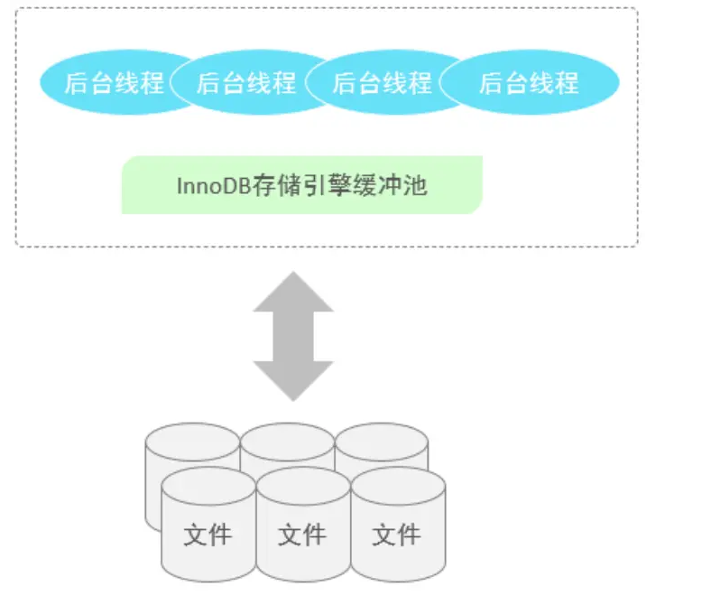

在InnoDB的后台线程中，分为4类，分别是：Master Thread 、IO Thread、Purge Thread、Page Cleaner Thread。

1. Master Thread

核心后台线程，负责调度其他线程，还负责将缓冲池中的数据异步刷新到磁盘中, 保持数据的一致性，还包括脏页的刷新、合并插入缓存、undo页的回收 。

2. IO Thread

在InnoDB存储引擎中大量使用了AIO来处理IO请求, 这样可以极大地提高数据库的性能，而IOThread主要负责这些IO请求的回调。

| 线程类型             | 默认个数 | 职责                         |
| -------------------- | -------- | ---------------------------- |
| Read thread          | 4        | 负责读操作                   |
| Write thread         | 4        | 负责写操作                   |
| Log thread           | 1        | 负责将日志缓冲区刷新到磁盘   |
| Insert buffer thread | 1        | 负责将写缓冲区内容刷新到磁盘 |


我们可以通过以下的这条指令，查看到InnoDB的状态信息，其中就包含IO Thread信息。


3. Purge Thread

主要用于回收事务已经提交了的undo log，在事务提交之后，undo log可能不用了，就用它来回收。

4. Page Cleaner Thread

协助 Master Thread 刷新脏页到磁盘的线程，它可以减轻 Master Thread 的工作压力，减少阻塞


### 事务原理

#### 事务基础

1. 事务

事务 是一组操作的集合，它是一个不可分割的工作单位，事务会把所有的操作作为一个整体一起向系统提交或撤销操作请求，即这些操作要么同时成功，要么同时失败。

2. 特性

- 原子性（Atomicity）：事务是不可分割的最小操作单元，要么全部成功，要么全部失败。
- 一致性（Consistency）：事务完成时，必须使所有的数据都保持一致状态。
- 隔离性（Isolation）：数据库系统提供的隔离机制，保证事务在不受外部并发操作影响的独立环境下运行。
- 持久性（Durability）：事务一旦提交或回滚，它对数据库中的数据的改变就是永久的。

那实际上，我们研究事务的原理，就是研究MySQL的InnoDB引擎是如何保证事务的这四大特性的


而对于这四大特性，实际上分为两个部分。 其中的原子性、一致性、持久化，实际上是由InnoDB中的两份日志来保证的，一份是redo log日志，一份是undo log日志。 而持久性是通过数据库的锁，加上MVCC来保证的。


我们在讲解事务原理的时候，主要就是来研究一下<span style="color:red">redolog，undolog以及MVCC</span>


#### redo log

重做日志，记录的是事务提交时数据页的物理修改，是用来实现事务的持久性。

该日志文件由两部分组成：重做日志缓冲（redo log buffer）以及重做日志文件（redo log file）,前者是在内存中，后者在磁盘中。当事务提交之后会把所有修改信息都存到该日志文件中, 用于在刷新脏页到磁盘,发生错误时, 进行数据恢复使用。

如果没有redolog，可能会存在什么问题的？ 我们一起来分析一下。

我们知道，在InnoDB引擎中的内存结构中，主要的内存区域就是缓冲池，在缓冲池中缓存了很多的数据页。 当我们在一个事务中，执行多个增删改的操作时，InnoDB引擎会先操作缓冲池中的数据，如果缓冲区没有对应的数据，会通过后台线程将磁盘中的数据加载出来，存放在缓冲区中，然后将缓冲池中的数据修改，修改后的数据页我们称为脏页。 而脏页则会在一定的时机，通过后台线程刷新到磁盘中，从而保证缓冲区与磁盘的数据一致。 而缓冲区的脏页数据并不是实时刷新的，而是一段时间之后将缓冲区的数据刷新到磁盘中，假如刷新到磁盘的过程出错了，而提示给用户事务提交成功，而数据却没有持久化下来，这就出现问题了，没有保证事务的持久性。


那么，如何解决上述的问题呢？ 在InnoDB中提供了一份日志 redo log，接下来我们再来分析一下，通过redolog如何解决这个问题。

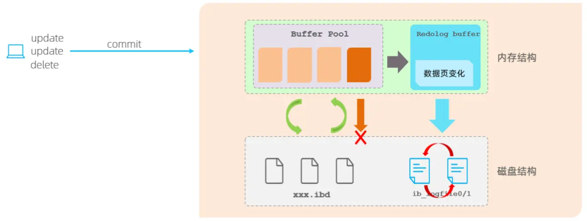


有了redolog之后，当对缓冲区的数据进行增删改之后，会首先将操作的数据页的变化，记录在redo log buffer中。在事务提交时，会将redo log buffer中的数据刷新到redo log磁盘文件中。过一段时间之后，如果刷新缓冲区的脏页到磁盘时，**发生错误，此时就可以借助于redo log进行数据恢复，这样就保证了事务的持久性。** 而如果脏页成功刷新到磁盘 或 或者涉及到的数据已经落盘，此时redolog就没有作用了，就可以删除了，所以存在的两个redolog文件是循环写的。

那为什么每一次提交事务，要刷新redo log 到磁盘中呢，而不是直接将buffer pool中的脏页刷新到磁盘呢 ?

因为在业务操作中，**我们操作数据一般都是随机读写磁盘的，而不是顺序读写磁盘。 而redo log在往磁盘文件中写入数据，由于是日志文件，所以都是顺序写的。顺序写的效率，要远大于随机写。** 这种先写日志的方式，称之为 WAL（Write-Ahead Logging）。


#### undo log

回滚日志，用于记录数据被修改前的信息 , 作用包含两个 : 提供回滚(保证事务的原子性) 和MVCC(多版本并发控制) 。

undo log和redo log记录物理日志不一样，它是逻辑日志。可以认为当delete一条记录时，undolog中会记录一条对应的insert记录，反之亦然，当update一条记录时，它记录一条对应相反的update记录。当执行rollback时，就可以从undo log中的逻辑记录读取到相应的内容并进行回滚。

Undo log销毁：undo log在事务执行时产生，事务提交时，并不会立即删除undo log，因为这些日志可能还用于MVCC。

Undo log存储：undo log采用段的方式进行管理和记录，存放在前面介绍的 rollback segment回滚段中，内部包含1024个undo log segment。


### MVCC

#### 基本概念

1. 当前读

读取的是记录的最新版本，读取时还要保证其他并发事务不能修改当前记录，会对读取的记录进行加锁。对于我们日常的操作，如：<span style="color :red">`select ... lock in share mode`</span>(共享锁)，<span style="color :red">`select ...for update`、`update`、`insert`、`delete`</span>(排他锁)都是一种当前读。


在测试中我们可以看到，即使是在默认的RR隔离级别下，事务A中依然可以读取到事务B最新提交的内容，因为在查询语句后面加上了 <span style="color :red">`lock in share mode` </span>共享锁，此时是当前读操作。当然，当我们加排他锁的时候，也是当前读操作。


2. 快照读

简单的select（不加锁）就是快照读，快照读，读取的是记录数据的可见版本，有可能是历史数据，不加锁，是非阻塞读。

- Read Committed：每次select，都生成一个快照读。
- Repeatable Read：开启事务后第一个select语句才是快照读的地方。
- Serializable：快照读会退化为当前读。

测试:


在测试中,我们看到即使事务B提交了数据,事务A中也查询不到。 原因就是因为普通的select是快照读，而在当前默认的RR隔离级别下，开启事务后第一个select语句才是快照读的地方，后面执行相同的select语句都是从快照中获取数据，可能不是当前的最新数据，这样也就保证了可重复读。


3. MVCC

全称 Multi-Version Concurrency Control，多版本并发控制。指维护一个数据的多个版本，使得读写操作没有冲突，快照读为MySQL实现MVCC提供了一个非阻塞读功能。MVCC的具体实现，还需要依赖于数据库记录中的三个隐式字段、undo log日志、readView。

接下来，我们再来介绍一下InnoDB引擎的表中涉及到的隐藏字段 、undolog 以及 readview，从而来介绍一下MVCC的原理。


#### 隐藏字段

- **介绍**


当我们创建了上面的这张表，我们在查看表结构的时候，就可以显式的看到这三个字段。 实际上除了这三个字段以外，InnoDB还会自动的给我们添加三个隐藏字段及其含义分别是：

| 隐藏字段      | 含义                                                         |
| ------------- | ------------------------------------------------------------ |
| DB_TRX_ID     | 最近修改事务ID，记录插入这条记录或最后一次修改该记录的事务ID。 |
| `DB_ROLL_PTR` | 回滚指针，指向这条记录的上一个版本，用于配合undo log，指向上一个版本。 |
| `DB_ROW_ID`   | 隐藏主键，如果表结构没有指定主键，将会生成该隐藏字段。       |

而上述的前两个字段是肯定会添加的， 是否添加最后一个字段DB_ROW_ID，得看当前表有没有主键，如果有主键，则不会添加该隐藏字段。


1. 查看有主键的表 stu

进入服务器中的 /var/lib/mysql/my/ , 查看stu的表结构信息, 通过如下指令:

```sh
ibd2sdi stu.ibd

```


查看到的表结构信息中，有一栏 columns，在其中我们会看到处理我们建表时指定的字段以外，还有额外的两个字段 分别是：DB_TRX_ID 、 DB_ROLL_PTR ，因为该表有主键，所以没有DB_ROW_ID隐藏字段。

```json
"columns": [
            {
                "name": "id",
                "type": 4,
                "is_nullable": false,
                "is_zerofill": false,
                "is_unsigned": false,
                "is_auto_increment": true,
                "is_virtual": false,
                "hidden": 1,
                "ordinal_position": 1,
                "char_length": 11,
                "numeric_precision": 10,
                "numeric_scale": 0,
                "numeric_scale_null": false,
                "datetime_precision": 0,
                "datetime_precision_null": 1,
                "has_no_default": false,
                "default_value_null": false,
                "srs_id_null": true,
                "srs_id": 0,
                "default_value": "AAAAAA==",
                "default_value_utf8_null": true,
                "default_value_utf8": "",
                "default_option": "",
                "update_option": "",
                "comment": "",
                "generation_expression": "",
                "generation_expression_utf8": "",
                "options": "interval_count=0;",
                "se_private_data": "table_id=1070;",
                "engine_attribute": "",
                "secondary_engine_attribute": "",
                "column_key": 2,
                "column_type_utf8": "int",
                "elements": [],
                "collation_id": 255,
                "is_explicit_collation": false
            },
            {
                "name": "name",
                "type": 16,
                "is_nullable": true,
                "is_zerofill": false,
                "is_unsigned": false,
                "is_auto_increment": false,
                "is_virtual": false,
                "hidden": 1,
                "ordinal_position": 2,
                "char_length": 1020,
                "numeric_precision": 0,
                "numeric_scale": 0,
                "numeric_scale_null": true,
                "datetime_precision": 0,
                "datetime_precision_null": 1,
                "has_no_default": false,
                "default_value_null": true,
                "srs_id_null": true,
                "srs_id": 0,
                "default_value": "",
                "default_value_utf8_null": true,
                "default_value_utf8": "",
                "default_option": "",
                "update_option": "",
                "comment": "",
                "generation_expression": "",
                "generation_expression_utf8": "",
                "options": "interval_count=0;",
                "se_private_data": "table_id=1070;",
                "engine_attribute": "",
                "secondary_engine_attribute": "",
                "column_key": 1,
                "column_type_utf8": "varchar(255)",
                "elements": [],
                "collation_id": 255,
                "is_explicit_collation": false
            },
            {
                "name": "age",
                "type": 4,
                "is_nullable": false,
                "is_zerofill": false,
                "is_unsigned": false,
                "is_auto_increment": false,
                "is_virtual": false,
                "hidden": 1,
                "ordinal_position": 3,
                "char_length": 11,
                "numeric_precision": 10,
                "numeric_scale": 0,
                "numeric_scale_null": false,
                "datetime_precision": 0,
                "datetime_precision_null": 1,
                "has_no_default": true,
                "default_value_null": false,
                "srs_id_null": true,
                "srs_id": 0,
                "default_value": "AAAAAA==",
                "default_value_utf8_null": true,
                "default_value_utf8": "",
                "default_option": "",
                "update_option": "",
                "comment": "",
                "generation_expression": "",
                "generation_expression_utf8": "",
                "options": "interval_count=0;",
                "se_private_data": "table_id=1070;",
                "engine_attribute": "",
                "secondary_engine_attribute": "",
                "column_key": 1,
                "column_type_utf8": "int",
                "elements": [],
                "collation_id": 255,
                "is_explicit_collation": false
            },
            {
                "name": "DB_TRX_ID",
                "type": 10,
                "is_nullable": false,
                "is_zerofill": false,
                "is_unsigned": false,
                "is_auto_increment": false,
                "is_virtual": false,
                "hidden": 2,
                "ordinal_position": 4,
                "char_length": 6,
                "numeric_precision": 0,
                "numeric_scale": 0,
                "numeric_scale_null": true,
                "datetime_precision": 0,
                "datetime_precision_null": 1,
                "has_no_default": false,
                "default_value_null": true,
                "srs_id_null": true,
                "srs_id": 0,
                "default_value": "",
                "default_value_utf8_null": true,
                "default_value_utf8": "",
                "default_option": "",
                "update_option": "",
                "comment": "",
                "generation_expression": "",
                "generation_expression_utf8": "",
                "options": "",
                "se_private_data": "table_id=1070;",
                "engine_attribute": "",
                "secondary_engine_attribute": "",
                "column_key": 1,
                "column_type_utf8": "",
                "elements": [],
                "collation_id": 63,
                "is_explicit_collation": false
            },
            {
                "name": "DB_ROLL_PTR",
                "type": 9,
                "is_nullable": false,
                "is_zerofill": false,
                "is_unsigned": false,
                "is_auto_increment": false,
                "is_virtual": false,
                "hidden": 2,
                "ordinal_position": 5,
                "char_length": 7,
                "numeric_precision": 0,
                "numeric_scale": 0,
                "numeric_scale_null": true,
                "datetime_precision": 0,
                "datetime_precision_null": 1,
                "has_no_default": false,
                "default_value_null": true,
                "srs_id_null": true,
                "srs_id": 0,
                "default_value": "",
                "default_value_utf8_null": true,
                "default_value_utf8": "",
                "default_option": "",
                "update_option": "",
                "comment": "",
                "generation_expression": "",
                "generation_expression_utf8": "",
                "options": "",
                "se_private_data": "table_id=1070;",
                "engine_attribute": "",
                "secondary_engine_attribute": "",
                "column_key": 1,
                "column_type_utf8": "",
                "elements": [],
                "collation_id": 63,
                "is_explicit_collation": false
            }
        ],
```


#### undolog

- **介绍**

回滚日志，在insert、update、delete的时候产生的便于数据回滚的日志。

当insert的时候，产生的undo log日志只在回滚时需要，在事务提交后，可被立即删除。

而update、delete的时候，产生的undo log日志不仅在回滚时需要，在快照读时也需要，不会立即被删除


- **版本链**

有一张表原始数据为：


然后，有四个并发事务同时在访问这张表

A>


当事务2执行第一条修改语句时，会记录undo log日志，记录数据变更之前的样子; 然后更新记录，并且记录本次操作的事务ID，回滚指针，回滚指针用来指定如果发生回滚，回滚到哪一个版本。


B>


当事务3执行第一条修改语句时，也会记录undo log日志，记录数据变更之前的样子; 然后更新记录，并且记录本次操作的事务ID，回滚指针，回滚指针用来指定如果发生回滚，回滚到哪一个版本。


C>

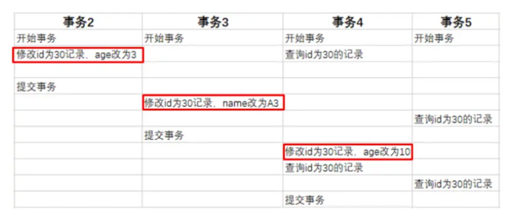

当事务4执行第一条修改语句时，也会记录undo log日志，记录数据变更之前的样子; 然后更新记录，并且记录本次操作的事务ID，回滚指针，回滚指针用来指定如果发生回滚，回滚到哪一个版本。


```sh
# 最终我们发现，不同事务或相同事务对同一条记录进行修改，会导致该记录的undolog生成一条记录版本链表，链表的头部是最新的旧记录，链表尾部是最早的旧记录。
```


#### readview

ReadView（读视图）是 <span style="color:red">快照读 </span>SQL执行时MVCC提取数据的依据，记录并维护系统当前活跃的事务（未提交的）id。

ReadView中包含了四个核心字段：

| 字段           | 含义                                                 |
| -------------- | ---------------------------------------------------- |
| m_ids          | 当前活跃的事务ID集合                                 |
| min_trx_id     | 最小活跃事务ID                                       |
| max_trx_id     | 预分配事务ID，当前最大事务ID+1（因为事务ID是自增的） |
| creator_trx_id | ReadView创建者的事务ID                               |

而在readview中就规定了版本链数据的访问规则：

trx_id 代表当前undolog版本链对应事务ID。

| 条件                               | 是否可以访问                              | 说明                                       |
| ---------------------------------- | ----------------------------------------- | ------------------------------------------ |
| trx_id == creator_trx_id           | 可以访问该版本                            | 成立，说明数据是当前这个事务更改的。       |
| trx_id < min_trx_id                | 可以访问该版本                            | 成立，说明数据已经提交了。                 |
| trx_id > max_trx_id                | 不可以访问该版本                          | 成立，说明该事务是在ReadView生成后才开启。 |
| min_trx_id <= trx_id <= max_trx_id | 如果trx_id不在m_ids中，是可以访问该版本的 | 成立，说明数据已经提交。                   |


不同的隔离级别，生成ReadView的时机不同：

- READ COMMITTED ：在事务中每一次执行快照读时生成ReadView。
- REPEATABLE READ：仅在事务中第一次执行快照读时生成ReadView，后续复用该ReadView。


#### 原理分析

##### RC隔离级别

RC隔离级别下，在事务中**每一次**执行快照读时生成ReadView。

我们就来分析事务5中，两次快照读读取数据，是如何获取数据的?

在事务5中，查询了两次id为30的记录，由于隔离级别为Read Committed，所以每一次进行快照读都会生成一个ReadView，那么两次生成的ReadView如下。


那么这两次快照读在获取数据时，就需要根据所生成的ReadView以及ReadView的版本链访问规则，到undolog版本链中匹配数据，最终决定此次快照读返回的数据。

A. 先来看第一次快照读具体的读取过程：


在进行匹配时，会从undo log的版本链，从上到下进行挨个匹配：

1. 先匹配


这条记录，这条记录对应的trx_id为4，也就是将4带入右侧的匹配规则中。 ①不满足 ②不满足 ③不满足 ④也不满足 ，都不满足，则继续匹配undo log版本链的下一条。


2. 再匹配第二条


，这条记录对应的trx_id为3，也就是将3带入右侧的匹配规则中。①不满足 ②不满足 ③不满足 ④也不满足 ，都不满足，则继续匹配undo log版本链的下一条。


3. 再匹配第三条


，这条记录对应的trx_id为2，也就是将2带入右侧的匹配规则中。①不满足 ②满足 终止匹配，此次快照读，返回的数据就是版本链中记录的这条数据。

B. 再来看第二次快照读具体的读取过程:

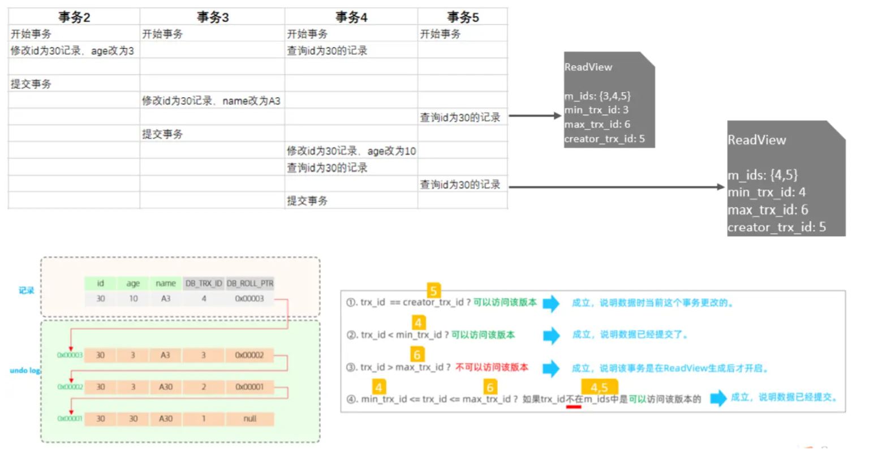


在进行匹配时，会从undo log的版本链，从上到下进行挨个匹配：

1. 先匹配

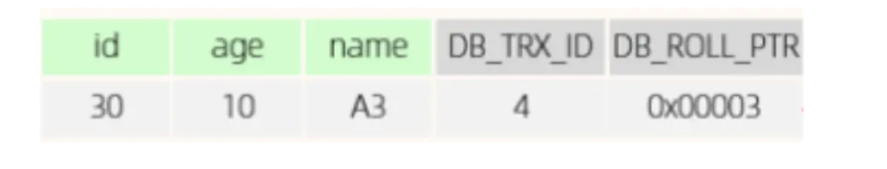

这条记录，这条记录对应的trx_id为4，也就是将4带入右侧的匹配规则中。 ①不满足 ②不满足 ③不满足 ④也不满足 ，都不满足，则继续匹配undo log版本链的下一条。


2. 再匹配第二条


这条记录对应的trx_id为3，也就是将3带入右侧的匹配规则中。①不满足 ②满足 。终止匹配，此次快照读，返回的数据就是版本链中记录的这条数据


##### RR隔离级别

RR隔离级别下，仅在事务中第一次执行快照读时生成ReadView，后续复用该ReadView。 而RR 是可重复读，在一个事务中，执行两次相同的select语句，查询到的结果是一样的。

那MySQL是如何做到可重复读的呢? 我们简单分析一下就知道了

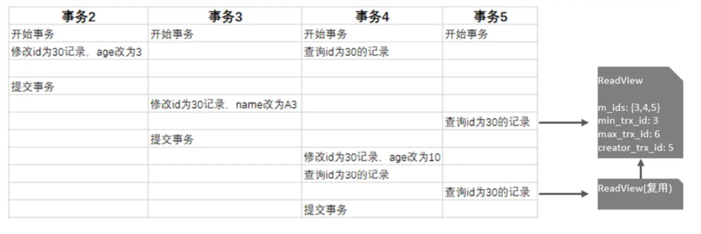


我们看到，在RR隔离级别下，只是在事务中**第一次**快照读时生成ReadView，后续都是复用该ReadView，那么既然ReadView都一样， ReadView的版本链匹配规则也一样， 那么最终快照读返回的结果也是一样的。

所以呢，MVCC的实现原理就是通过 InnoDB表的隐藏字段、UndoLog 版本链、ReadView来实现的。而MVCC + 锁，则实现了事务的隔离性。 而一致性则是由redolog 与 undolog保证


## MySQL-管理

### 系统数据库

Mysql数据库安装完成后，自带了一下四个数据库，具体作用如下：

| 数据库             | 含义                                                         |
| ------------------ | ------------------------------------------------------------ |
| mysql              | 存储MySQL服务器正常运行所需要的各种信息 （时区、主从、用户、权限等） |
| information_schema | 提供了访问数据库元数据的各种表和视图，包含数据库、表、字段类型及访问权限等 |
| performance_schema | 为MySQL服务器运行时状态提供了一个底层监控功能，主要用于收集数据库服务器性能参数 |
| sys                | 包含了一系列方便 DBA 和开发人员利用 performance_schema性能数据库进行性能调优和诊断的视图 |


### 常用工具

#### mysql

该mysql不是指mysql服务，而是指mysql的客户端工具。

```sh
# 语法 ：
	mysql [options] [database]
# 选项 ：
	-u, --user=name #指定用户名
	-p, --password[=name] #指定密码
	-h, --host=name #指定服务器IP或域名
	-P, --port=port #指定连接端口
	-e, --execute=name #执行SQL语句并退出

```

-e 选项可以在Mysql客户端执行SQL语句，而不用连接到MySQL数据库再执行，对于一些批处理脚本，这种方式尤其方便。

示例：

```sql
 mysql -u root -p MySQL_Advanced -e "select * from stu";

```

> ```sql
> PS C:\Users\lenvoo> mysql -uroot -proot -P 3307 -h centos.com --ssl=false -e 'SELECT host,user FROM mysql.user'
> mysql: [Warning] Using a password on the command line interface can be insecure.
> WARNING: --ssl is deprecated and will be removed in a future version. Use --ssl-mode instead.
> +-----------+------------------+
> | host      | user             |
> +-----------+------------------+
> | %         | root             |
> | localhost | mysql.infoschema |
> | localhost | mysql.session    |
> | localhost | mysql.sys        |
> | localhost | root             |
> +-----------+------------------+
> PS C:\Users\lenvoo>
> ```


#### mysqladmin

mysqladmin 是一个执行管理操作的客户端程序。可以用它来检查服务器的配置和当前状态、创建并删除数据库等。

```sh
# 通过帮助文档查看选项：
	mysqladmin --help
```


```sh
语法:
	mysqladmin [options] command ...
选项:
	-u, --user=name       #指定用户名
	-p, --password[=name] #指定密码
	-h, --host=name       #指定服务器IP或域名
	-P, --port=port       #指定连接端口

```

```sql
mysqladmin -uroot –p1234 drop 'test01'
mysqladmin -u root –p 123456 version

```


#### mysqlbinlog

由于服务器生成的二进制日志文件以二进制格式保存，所以如果想要检查这些文本的文本格式，就会使用到mysqlbinlog 日志管理工具。

```sh
语法 ：
	mysqlbinlog [options] log-files1 log-files2 ...
选项 ：
	-d, --database=name 指定数据库名称，只列出指定的数据库相关操作。
	-o, --offset=# 忽略掉日志中的前n行命令。
	-r,--result-file=name 将输出的文本格式日志输出到指定文件。
	-s, --short-form 显示简单格式， 省略掉一些信息。
	--start-datatime=date1 --stop-datetime=date2 指定日期间隔内的所有日志。
	--start-position=pos1 --stop-position=pos2 指定位置间隔内的所有日志。

```

示例:

A. 查看 binlog.000008这个二进制文件中的数据信息

```sh
[root@frx01 ~]# mysqlbinlog binlog.000008
# The proper term is pseudo_replica_mode, but we use this compatibility alias
# to make the statement usable on server versions 8.0.24 and older.
/*!50530 SET @@SESSION.PSEUDO_SLAVE_MODE=1*/;
/*!50003 SET @OLD_COMPLETION_TYPE=@@COMPLETION_TYPE,COMPLETION_TYPE=0*/;
DELIMITER /*!*/;
mysqlbinlog: File 'binlog.000008' not found (OS errno 2 - No such file or directory)
ERROR: Could not open log file
SET @@SESSION.GTID_NEXT= 'AUTOMATIC' /* added by mysqlbinlog */ /*!*/;
DELIMITER ;
# End of log file
/*!50003 SET COMPLETION_TYPE=@OLD_COMPLETION_TYPE*/;
/*!50530 SET @@SESSION.PSEUDO_SLAVE_MODE=0*/;

```

上述查看到的二进制日志文件数据信息量太多了，不方便查询。 我们可以加上一个参数 -s 来显示简单格式。


#### mysqlshow

mysqlshow 客户端对象查找工具，用来很快地查找存在哪些数据库、数据库中的表、表中的列或者索引。

```sh
语法 ：
	mysqlshow [options] [db_name [table_name [col_name]]]
选项 ：
	--count 显示数据库及表的统计信息（数据库，表 均可以不指定）
	-i 显示指定数据库或者指定表的状态信息
示例：
	#查询test库中每个表中的字段书，及行数
	mysqlshow -uroot -p2143 test --count
	#查询test库中book表的详细情况
	mysqlshow -uroot -p2143 test book --count

```

示例：

A. 查询每个数据库的表的数量及表中记录的数量

```sh
mysqlshow -uroot -p123456 --count
```

```sql
[root@frx01 ~]# mysqlshow -uroot -p123456 --count
mysqlshow: [Warning] Using a password on the command line interface can be insecure.
+--------------------+--------+--------------+
|     Databases      | Tables |  Total Rows  |
+--------------------+--------+--------------+
| MySQL_Advanced     |      9 |        13582 |
| frx01              |      1 |      1000000 |
| information_schema |     79 |        31153 |
| mysql              |     37 |         3904 |
| performance_schema |    110 |       242999 |
| sys                |    101 |         5021 |
+--------------------+--------+--------------+
6 rows in set.

```

B. 查看数据库MySQL_Advanced的统计信息

```sh
mysqlshow -uroot -p123456 MySQL_Advanced --count
```

```sql
[root@frx01 ~]# mysqlshow -uroot -p123456 MySQL_Advanced --count
mysqlshow: [Warning] Using a password on the command line interface can be insecure.
Database: MySQL_Advanced
+-------------+----------+------------+
|   Tables    | Columns  | Total Rows |
+-------------+----------+------------+
| a           |        2 |          0 |
| employee    |        2 |          0 |
| stu         |        3 |          7 |
| stu_v_1     |        2 |         12 |
| student     |        6 |         18 |
| tb_user     |        9 |         24 |
| tb_user_pro |        3 |      13472 |
| user_logs   |        5 |         39 |
| user_v_1    |        2 |         10 |
+-------------+----------+------------+
9 rows in set.

```


C. 查看数据库db01中的course表的信息

```sh
mysqlshow -uroot -p123456 MySQL_Advanced stu --count
```

> ```sql
> [root@frx01 ~]# mysqlshow -uroot -p123456 MySQL_Advanced stu --count
> mysqlshow: [Warning] Using a password on the command line interface can be insecure.
> Database: MySQL_Advanced  Table: stu  Rows: 7
> +-------+--------------+--------------------+------+-----+---------+----------------+---------------------------------+---------+
> | Field | Type         | Collation          | Null | Key | Default | Extra          | Privileges                      | Comment |
> +-------+--------------+--------------------+------+-----+---------+----------------+---------------------------------+---------+
> | id    | int          |                    | NO   | PRI |         | auto_increment | select,insert,update,references |         |
> | age   | int          |                    | NO   | MUL |         |                | select,insert,update,references |         |
> | name  | varchar(255) | utf8mb4_general_ci | YES  | MUL |         |                | select,insert,update,references |         |
> +-------+--------------+--------------------+------+-----+---------+----------------+---------------------------------+---------+
> 
> ```

D. 查看数据库db01中的course表的id字段的信息

```sh
mysqlshow -uroot -p123456 MySQL_Advanced stu id --count
```

> ```sql
> [root@frx01 ~]# mysqlshow -uroot -p123456 MySQL_Advanced stu id --count
> mysqlshow: [Warning] Using a password on the command line interface can be insecure.
> Database: MySQL_Advanced  Table: stu  Rows: 7  Wildcard: id
> +-------+------+-----------+------+-----+---------+----------------+---------------------------------+---------+
> | Field | Type | Collation | Null | Key | Default | Extra          | Privileges                      | Comment |
> +-------+------+-----------+------+-----+---------+----------------+---------------------------------+---------+
> | id    | int  |           | NO   | PRI |         | auto_increment | select,insert,update,references |         |
> +-------+------+-----------+------+-----+---------+----------------+---------------------------------+---------+
> 
> ```


#### mysqldump

mysqldump 客户端工具用来备份数据库或在不同数据库之间进行数据迁移。备份内容包含创建表，及插入表的SQL语句。

```sh
语法 ：
	mysqldump [options] db_name [tables]
	mysqldump [options] --database/-B db1 [db2 db3...]
	mysqldump [options] --all-databases/-A
连接选项 ：
	-u, --user=name        指定用户名
	-p, --password[=name]  指定密码
	-h, --host=name        指定服务器ip或域名
	-P, --port=#           指定连接端口
输出选项：
	--add-drop-database    在每个数据库创建语句前加上 drop database 语句
	--add-drop-table       在每个表创建语句前加上 drop table 语句 , 默认开启 ; 不
开启 (--skip-add-drop-table)
	-n, --no-create-db     不包含数据库的创建语句
	-t, --no-create-info   不包含数据表的创建语句
	-d --no-data           不包含数据
	-T, --tab=name         自动生成两个文件：一个.sql文件，创建表结构的语句；一个.txt文件，数据文件

```


示例:

A. 备份db01数据库

```sh
mysqldump -uroot -p123456 frx01 > frx01.sql
```

```sh
[root@frx01 ~]# mysqldump -uroot -p123456 frx01 > frx01.sql
mysqldump: [Warning] Using a password on the command line interface can be insecure.
[root@frx01 ~]# ll
总用量 597048
-rw-r--r--. 1 root root 482420224 9月   9 10:23 ABCD.tar
-rw-------. 1 root root      1697 9月   9 09:45 anaconda-ks.cfg
-rw-r--r--  1 root root  70781900 10月  4 16:31 frx01.sql
-rw-r--r--. 1 root root      1745 9月   9 09:49 initial-setup-ks.cfg
-rw-r--r--  1 root root    508543 10月  1 23:47 itcast.sql
-rw-r--r--  1 root root  57650380 9月  25 09:40 load_user_100w_sort.sql
drwxr-xr-x. 2 root root         6 9月   9 09:55 公共
drwxr-xr-x. 2 root root         6 9月   9 09:55 模板
drwxr-xr-x. 2 root root         6 9月   9 09:55 视频
drwxr-xr-x. 2 root root         6 9月   9 09:55 图片
drwxr-xr-x. 2 root root         6 9月   9 09:55 文档
drwxr-xr-x. 2 root root         6 9月   9 09:55 下载
drwxr-xr-x. 2 root root         6 9月   9 09:55 音乐
drwxr-xr-x. 2 root root         6 9月   9 09:55 桌面

```

可以直接打开db01.sql，来查看备份出来的数据到底什么样。

```sh
--
-- Table structure for table `user_logs`
--

DROP TABLE IF EXISTS `user_logs`;
/*!40101 SET @saved_cs_client     = @@character_set_client */;
/*!50503 SET character_set_client = utf8mb4 */;
CREATE TABLE `user_logs` (
  `id` int NOT NULL AUTO_INCREMENT,
  `operation` varchar(20) NOT NULL COMMENT '操作类型, insert/update/delete',
  `operate_time` datetime NOT NULL COMMENT '操作时间',
  `operate_id` int NOT NULL COMMENT '操作的ID',
  `operate_params` varchar(500) DEFAULT NULL COMMENT '操作参数',
  PRIMARY KEY (`id`)
) ENGINE=InnoDB AUTO_INCREMENT=39 DEFAULT CHARSET=utf8mb3;
/*!40101 SET character_set_client = @saved_cs_client */;

--
-- Dumping data for table `user_logs`
--

```

备份出来的数据包含：

- 删除表的语句
- 创建表的语句
- 数据插入语句

如果我们在数据备份时，不需要创建表，或者不需要备份数据，只需要备份表结构，都可以通过对应的参数来实现。

B. 备份db01数据库中的表数据，不备份表结构(`-t`) `mysqldump -uroot -p123456 -t frx01 > frx02.sql`

打开 db02.sql ，来查看备份的数据，只有insert语句，没有备份表结构。

> ```sh
> LOCK TABLES `tb_user` WRITE;
> /*!40000 ALTER TABLE `tb_user` DISABLE KEYS */;
> INSERT INTO `tb_user` VALUES (1,'jdTmmKQlwu1','jdTmmKQlwu','jdTmmKQlwu','2020-10-13','1'),(2,'BTJOeWjRiw2','BTJOeWjRiw','BTJOeWjRiw','202
> 0-06-12','2'),(3,'waQTJIIlHI3','waQTJIIlHI','waQTJIIlHI','2020-06-02','0'),(4,'XmeFHwozIo4','XmeFHwozIo','XmeFHwozIo','2020-01-11','1'),(
> 5,'xRrvQSHcZn5','xRrvQSHcZn','xRrvQSHcZn','2020-10-18','2'),(6,'gTDfGFNLEj6','gTDfGFNLEj','gTDfGFNLEj','2020-01-13','0'),(7,'nBETIlVCle7'
> ,'nBETIlVCle','nBETIlVCle','2020-09-27','1'),(8,'vmePKKZjJU8','vmePKKZjJU','vmePKKZjJU','2020-10-20','2'),(9,'pWjaLhJVaB9','pWjaLhJVaB','
> pWjaLhJVaB','2020-05-07','0'),(10,'zimgGFPEQe10','zimgGFPEQe','zimgGFPEQe','2020-08-01','1'),(11,'uHpIsEALNp11','uHpIsEALNp','uHpIsEALNp'
> ,'2020-12-17','2'),(12,'kCfPeCgMjn12','kCfPeCgMjn','kCfPeCgMjn','2020-07-13','0'),(13,'QRkLwosIdM13','QRkLwosIdM','QRkLwosIdM','2020-08-2
> 4','1'),(14,'ipsKyeFeJy14','ipsKyeFeJy','ipsKyeFeJy','2020-02-22','2'),(15,'ZRrcPvYDtF15','ZRrcPvYDtF','ZRrcPvYDtF','2020-12-07','0'),(16
> ,'BbLUYWHeTg16','BbLUYWHeTg','BbLUYWHeTg','2020-04-17','1'),(17,'DalMVUpMnk17','DalMVUpMnk','DalMVUpMnk','2020-10-16','2'),(18,'HFtmFtnZP
> i18','HFtmFtnZPi','HFtmFtnZPi','2020-11-25','0'),(19,'maHoYocalj19','maHoYocalj','maHoYocalj','2020-03-03','1'),(20,'nHKmkDGSeH20','nHKmk
> DGSeH','nHKmkDGSeH','2020-01-02','2'),(21,'MZZziMtXLH21','MZZziMtXLH','MZZziMtXLH','2020-04-01','0'),(22,'bjUXRogYgF22','bjUXRogYgF','bjU
> XRogYgF','2020-07-12','1'),(23,'CVgMEIwyGf23','CVgMEIwyGf','CVgMEIwyGf','2020-12-05','2'),(24,'yXVrVLgSmR24','yXVrVLgSmR','yXVrVLgSmR','2
> 020-04-11','0'),(25,'oaFXNzAigC25','oaFXNzAigC','oaFXNzAigC','2020-11-09','1'),(26,'IJrJiutZtD26','IJrJiutZtD','IJrJiutZtD','2020-07-17',
> '2'),(27,'WGwcrfrFOB27','WGwcrfrFOB','WGwcrfrFOB','2020-09-22','0'),(28,'RbCMhegoiU28','RbCMhegoiU','RbCMhegoiU','2020-06-01','1'),(29,'R
> zRzNPEsQm29','RzRzNPEsQm','RzRzNPEsQm','2020-02-24','2'),(30,'SYzgGoVRwv30','SYzgGoVRwv','SYzgGoVRwv','2020-07-03','0'),(31,'hLuUHxjJhk31
> ','hLuUHxjJhk','hLuUHxjJhk','2020-01-09','1'),(32,'jhUhcVaQkV32','jhUhcVaQkV','jhUhcVaQkV','2020-04-27','2'),(33,'MmbKbOrEpK33','MmbKbOrE
> pK','MmbKbOrEpK','2020-05-02','0');
> 
> ```

C. 将db01数据库的表的表结构与数据分开备份(`-T`)

```sh
mysqldump -uroot -p123456 -T /root frx01 score
```

执行上述指令，会出错，数据不能完成备份，原因是因为我们所指定的数据存放目录/root，MySQL认为是不安全的，需要存储在MySQL信任的目录下。那么，哪个目录才是MySQL信任的目录呢，可以查看一下系统变量 `secure_file_priv` 。执行结果如下：

```sh
mysql> show variables like '%secure_file_priv%';
+------------------+-----------------------+
| Variable_name    | Value                 |
+------------------+-----------------------+
| secure_file_priv | /var/lib/mysql-files/ |
+------------------+-----------------------+
1 row in set (0.01 sec)

```

```sh
mysqldump -uroot -p123456 -T /var/lib/mysql-files/ frx01 score

```

```sh
[root@frx01 ~]# mysqldump -uroot -p123456 -T /var/lib/mysql-files/ MySQL_Advanced stu
mysqldump: [Warning] Using a password on the command line interface can be insecure.
[root@frx01 ~]# cd /var/lib/mysql-files/
[root@frx01 mysql-files]# ll
总用量 8
-rw-r--r-- 1 root  root  1596 10月  4 16:48 stu.sql     #表结构文件
-rw-r----- 1 mysql mysql   68 10月  4 16:48 stu.txt     #表数据文件

```

上述的两个文件 score.sql 中记录的就是表结构文件，而 score.txt 就是表数据文件，但是需要注意表数据文件，并不是记录一条条的insert语句，而是按照一定的格式记录表结构中的数据。如下：

```sh
[root@frx01 mysql-files]# cat stu.txt
1       1       c
3       3       Java
7       7       Marry
8       8       rose
11      11      jetty
19      19      xuan
25      25      luci

```


#### mysqlimport/source

1. mysqlimport

mysqlimport 是客户端数据导入工具，用来导入mysqldump 加 -T 参数后导出的文本文件。

```sh
语法 ：
	mysqlimport [options] db_name textfile1 [textfile2...]
示例 ：
	mysqlimport -uroot -p2143 test /tmp/city.txt

```

```sh
[root@frx01 mysql-files]# mysqlimport -u root -p MySQL_Advanced /var/lib/mysql-files/stu.txt
Enter password:
MySQL_Advanced.stu: Records: 7  Deleted: 0  Skipped: 0  Warnings: 0

```

2. source

如果需要导入sql文件,可以使用mysql中的source 指令 :

```sh
语法 ：
	source /root/xxxxx.sql

```

```sh
mysql> source /var/lib/mysql-files/stu.sql
Query OK, 0 rows affected (0.00 sec)

Query OK, 0 rows affected (0.00 sec)

Query OK, 0 rows affected (0.00 sec)

Query OK, 0 rows affected (0.00 sec)

Query OK, 0 rows affected (0.00 sec)

Query OK, 0 rows affected (0.00 sec)

Query OK, 0 rows affected (0.00 sec)

Query OK, 0 rows affected (0.00 sec)

Query OK, 0 rows affected (0.01 sec)

Query OK, 0 rows affected (0.00 sec)

Query OK, 0 rows affected (0.00 sec)

Query OK, 0 rows affected, 1 warning (0.14 sec)

Query OK, 0 rows affected (0.00 sec)

Query OK, 0 rows affected (0.00 sec)

Query OK, 0 rows affected (0.00 sec)

Query OK, 0 rows affected (0.00 sec)

Query OK, 0 rows affected (0.00 sec)

Query OK, 0 rows affected (0.00 sec)

Query OK, 0 rows affected (0.00 sec)

```


# MySQL-运维

## MySQL-日志

### 错误日志

错误日志是 MySQL 中最重要的日志之一，它记录了当 mysqld 启动和停止时，以及服务器在运行过程中发生任何严重错误时的相关信息。当数据库出现任何故障导致无法正常使用时，建议首先查看此日志。

```sql
mysql> show variables like '%log_error%';
+----------------------------+----------------------------------------+
| Variable_name              | Value                                  |
+----------------------------+----------------------------------------+
| binlog_error_action        | ABORT_SERVER                           |
| log_error                  | stderr                                 |
| log_error_services         | log_filter_internal; log_sink_internal |
| log_error_suppression_list |                                        |
| log_error_verbosity        | 2                                      |
+----------------------------+----------------------------------------+
5 rows in set (0.04 sec)

```


### 二进制日志

#### 介绍

二进制日志（BINLOG）记录了所有的 DDL（数据定义语言）语句和 DML（数据操纵语言）语句，但不包括数据查询（SELECT、SHOW）语句。

作用：①. 灾难时的数据恢复；②. MySQL的主从复制。在MySQL8版本中，默认二进制日志是开启着的，涉及到的参数如下：

```sql
show variables like '%log_bin%';

mysql> show variables like '%log_bin%';
+---------------------------------+-----------------------------+
| Variable_name                   | Value                       |
+---------------------------------+-----------------------------+
| log_bin                         | ON                          |
| log_bin_basename                | /var/lib/mysql/binlog       |
| log_bin_index                   | /var/lib/mysql/binlog.index |
| log_bin_trust_function_creators | OFF                         |
| log_bin_use_v1_row_events       | OFF                         |
| sql_log_bin                     | ON                          |
+---------------------------------+-----------------------------+
6 rows in set (0.01 sec)
```

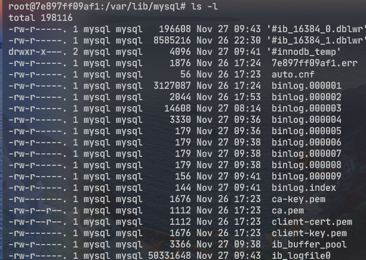


参数说明：

- <span style="color:red">`log_bin_basename`</span>：当前数据库服务器的binlog日志的基础名称(前缀)，具体的binlog文件名需要再该basename的基础上加上编号(编号从000001开始)。
- <span style="color:red">`log_bin_index`</span>：binlog的索引文件，里面记录了当前服务器关联的binlog文件有哪些。


#### 格式

MySQL服务器中提供了多种格式来记录二进制日志，具体格式及特点如下

| 日志格式  | 含义                                                         |
| --------- | ------------------------------------------------------------ |
| STATEMENT | 基于SQL语句的日志记录，记录的是SQL语句，对数据进行修改的SQL都会记录在日志文件中。 |
| ROW       | 基于行的日志记录，记录的是每一行的数据变更。（默认）         |
| MIXED     | 混合了STATEMENT和ROW两种格式，默认采用STATEMENT，在某些特殊情况下会自动切换为ROW进行记录。 |

```sql
show variables like '%binlog_format';

mysql> show variables like '%binlog_format';
+---------------+-------+
| Variable_name | Value |
+---------------+-------+
| binlog_format | ROW   |
+---------------+-------+
1 row in set (0.03 sec)
```

如果我们需要配置二进制日志的格式，只需要在 /etc/my.cnf 中配置 binlog_format 参数即可。

#### 查看

由于日志是以二进制方式存储的，不能直接读取，需要通过二进制日志查询工具 mysqlbinlog 来查看，具体语法：

```sh
mysqlbinlog [ 参数选项 ] logfilename

参数选项：
	-d 指定数据库名称，只列出指定的数据库相关操作。
	-o 忽略掉日志中的前n行命令。
	-v 将行事件(数据变更)重构为SQL语句
	-vv 将行事件(数据变更)重构为SQL语句，并输出注释信息

```


#### 删除

对于比较繁忙的业务系统，每天生成的binlog数据巨大，如果长时间不清除，将会占用大量磁盘空间。可以通过以下几种方式清理日志

| 指令                                             | 含义                                                         |
| ------------------------------------------------ | ------------------------------------------------------------ |
| reset master                                     | 删除全部 binlog 日志，删除之后，日志编号，将从 binlog.000001重新开始 |
| purge master logs to 'binlog.*'                  | 删除 * 编号之前的所有日志                                    |
| purge master logs before 'yyyy-mm-dd hh24:mi:ss' | 删除日志为 "yyyy-mm-dd hh24:mi:ss" 之前产生的所有日志        |

也可以在mysql的配置文件中配置二进制日志的过期时间，设置了之后，二进制日志过期会自动删除。

```sh
show variables like '%binlog_expire_logs_seconds%';

mysql> show variables like '%binlog_expire_logs_seconds%';
+----------------------------+---------+
| Variable_name              | Value   |
+----------------------------+---------+
| binlog_expire_logs_seconds | 2592000 |
+----------------------------+---------+
1 row in set (0.00 sec)
```


### 查询日志

查询日志中记录了客户端的所有操作语句，而二进制日志不包含查询数据的SQL语句。默认情况下，查询日志是未开启的。

```sql
show variables like '%general%';

mysql> show variables like '%general%';
+------------------+---------------------------------+
| Variable_name    | Value                           |
+------------------+---------------------------------+
| general_log      | OFF                             |
| general_log_file | /var/lib/mysql/7e897ff09af1.log |
+------------------+---------------------------------+
2 rows in set (0.00 sec)
```

如果需要开启查询日志，可以修改MySQL的配置文件 /etc/my.cnf 文件，添加如下内容：

```ini
#该选项用来开启查询日志 ， 可选值 ： 0 或者 1 ； 0 代表关闭， 1 代表开启

general_log=1

#设置日志的文件名 ， 如果没有指定， 默认的文件名为 host_name.log

general_log_file=mysql_query.log

```

开启了查询日志之后，在MySQL的数据存放目录，也就是 /var/lib/mysql/ 目录下就会出现mysql_query.log 文件。之后所有的客户端的增删改查操作都会记录在该日志文件之中，长时间运行后，该日志文件将会非常大


### 慢查询日志

慢查询日志记录了所有执行时间超过参数 long_query_time 设置值并且扫描记录数不小于 min_examined_row_limit 的所有的SQL语句的日志，默认未开启。long_query_time 默认为10 秒，最小为 0， 精度可以到微秒。

如果需要开启慢查询日志，需要在MySQL的配置文件 /etc/my.cnf 中配置如下参数：

```ini
#慢查询日志
slow_query_log=1

#执行时间参数
long_query_time=2

```

默认情况下，不会记录管理语句，也不会记录不使用索引进行查找的查询。可以使用 log_slow_admin_statements和 更改此行为 log_queries_not_using_indexes，如下所述。

```ini
#记录执行较慢的管理语句
log_slow_admin_statements =1

#记录执行较慢的未使用索引的语句
log_queries_not_using_indexes = 1

```

```sh
# 上述所有的参数配置完成之后，都需要重新启动MySQL服务器才可以生效。
```


```sh
[root@frx01 mysql]# tail -f frx01-slow.log
# Query_time: 4.687803  Lock_time: 0.000077 Rows_sent: 1  Rows_examined: 0
use frx01;
SET timestamp=1664871559;
SELECT COUNT(*) FROM `tb_user`;
/usr/sbin/mysqld, Version: 8.0.26 (MySQL Community Server - GPL). started with:
Tcp port: 3306  Unix socket: /var/lib/mysql/mysql.sock
Time                 Id Command    Argument
/usr/sbin/mysqld, Version: 8.0.26 (MySQL Community Server - GPL). started with:
Tcp port: 3306  Unix socket: /var/lib/mysql/mysql.sock
Time                 Id Command    Argument
# Time: 2022-10-05T13:40:50.099040Z
# User@Host: root[root] @ localhost []  Id:     8
# Query_time: 3.980600  Lock_time: 0.000070 Rows_sent: 0  Rows_examined: 1000000
use frx01;
SET timestamp=1664977246;
select * from tb_user limit 1000000,10;

```


## MySQL-主从复制<a name="mysql-master-s"></a>

### 概述

主从复制是指将主数据库的 DDL 和 DML 操作通过二进制日志传到从库服务器中，然后在从库上对这些日志重新执行（也叫重做），从而使得从库和主库的数据保持同步。

MySQL支持一台主库同时向多台从库进行复制， 从库同时也可以作为其他从服务器的主库，实现链状复制。


MySQL 复制的优点主要包含以下三个方面：

- 主库出现问题，可以快速切换到从库提供服务。
- 实现读写分离，降低主库的访问压力。
- 可以在从库中执行备份，以避免备份期间影响主库服务


### 原理

MySQL主从复制的核心就是 二进制日志，具体的过程如下：


从上图来看，复制分成三步：

1. Master 主库在事务提交时，会把数据变更记录在二进制日志文件 `Binlog` 中。
2. 从库读取主库的二进制日志文件 `Binlog` ，写入到从库的中继日志 `Relay Log` 。
3. slave重做中继日志中的事件，将改变反映它自己的数据。


### 搭建

#### 准备


准备好两台服务器之后，在上述的两台服务器中分别安装好MySQL，并完成基础的初始化准备(安装、密码配置等操作)工作。 其中：

- 192.168.91.166 作为主服务器master
- 192.168.91.167 作为从服务器slave


#### 主库配置

1. 修改配置文件 /etc/my.cnf

```ini
#mysql 服务ID，保证整个集群环境中唯一，取值范围：1 – 232-1，默认为1
server-id=1

#是否只读,1 代表只读, 0 代表读写
read-only=0

#忽略的数据, 指不需要同步的数据库
#binlog-ignore-db=mysql
#指定同步的数据库
#binlog-do-db=db01

```

2. 重启MySQL服务器

```sh
systemctl restart mysqld

```

3. 登录mysql，创建远程连接的账号，并授予主从复制权限

```sql
#创建itcast用户，并设置密码，该用户可在任意主机连接该MySQL服务
CREATE USER 'itcast'@'%' IDENTIFIED WITH mysql_native_password BY 'Root@123456';

#为 'itcast'@'%' 用户分配主从复制权限
GRANT REPLICATION SLAVE ON *.* TO 'itcast'@'%';

```

4. 通过指令，查看二进制日志坐标

```sql
mysql>  show master status;
+---------------+----------+--------------+------------------+-------------------+
| File          | Position | Binlog_Do_DB | Binlog_Ignore_DB | Executed_Gtid_Set |
+---------------+----------+--------------+------------------+-------------------+
| binlog.000019 |      663 |              |                  |                   |
+---------------+----------+--------------+------------------+-------------------+
1 row in set (0.00 sec)

```

字段含义说明：

- file : 从哪个日志文件开始推送日志文件
- position ： 从哪个位置开始推送日志
- binlog_ignore_db : 指定不需要同步的数据库


#### 从库配置

1. 修改配置文件 /etc/my.cnf

```ini
#mysql 服务ID，保证整个集群环境中唯一，取值范围：1 – 2^32-1，和主库不一样即可
server-id=2

#是否只读,1 代表只读, 0 代表读写
read-only=1

```

2. 重新启动MySQL服务

```sh
systemctl restart mysqld

```

3. 登录mysql，设置主库配置

```sh
# 注意

# 这里的binlog.000004，663一定要与master二进制日志坐标保持一致
```

```sh
CHANGE REPLICATION SOURCE TO SOURCE_HOST='192.168.91.166', SOURCE_USER='itcast', SOURCE_PASSWORD='Root@123456', SOURCE_LOG_FILE='binlog.000004', SOURCE_LOG_POS=663;

```

上述是8.0.23中的语法。如果mysql是 8.0.23 之前的版本，执行如下SQL：

```sql
CHANGE MASTER TO MASTER_HOST='192.168.91.166', MASTER_USER='itcast', MASTER_PASSWORD='Root@123456', MASTER_LOG_FILE='binlog.000004', MASTER_LOG_POS=663;

```

| 参数名          | 含义               | 8.0.23之前      |
| --------------- | ------------------ | --------------- |
| SOURCE_HOST     | 主库IP地址         | MASTER_HOST     |
| SOURCE_USER     | 连接主库的用户名   | MASTER_USER     |
| SOURCE_PASSWORD | 连接主库的密码     | MASTER_PASSWORD |
| SOURCE_LOG_FILE | binlog日志文件名   | MASTER_LOG_FILE |
| SOURCE_LOG_POS  | binlog日志文件位置 | MASTER_LOG_POS  |

4. 开启同步操作

```sql
start replica ; #8.0.22之后
start slave ; #8.0.22之前
```

5. 查看主从同步状态

```sql
show replica status ; #8.0.22之后
show slave status ; #8.0.22之前

```

```sql
mysql> show replica status\G
*************************** 1. row ***************************
             Replica_IO_State: Waiting for source to send event
                  Source_Host: 192.168.91.166
                  Source_User: itcast
                  Source_Port: 3306
                Connect_Retry: 60
              Source_Log_File: binlog.000001
          Read_Source_Log_Pos: 156
               Relay_Log_File: MySQL-Slave-relay-bin.000003
                Relay_Log_Pos: 365
        Relay_Source_Log_File: binlog.000001
           Replica_IO_Running: Yes
          Replica_SQL_Running: Yes

```


测试：

1.主库 192.168.91,166 上创建数据库、表，并插入数据

```sql
create database db01;
use db01;
create table tb_user(
	id int(11) primary key not null auto_increment,
	name varchar(50) not null,
	sex varchar(1)
)engine=innodb default charset=utf8mb4;
insert into tb_user(id,name,sex) values(null,'Tom', '1'),(null,'Trigger','0'),(null,'Dawn','1');

```

2. 在从库 192.168.91.167 中查询数据，验证主从是否同步

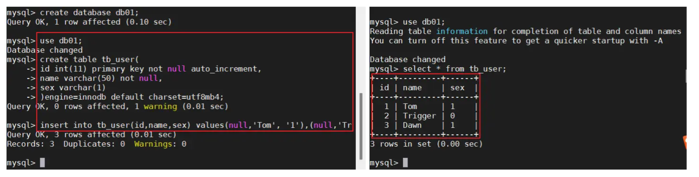


## MySQL-分库分表

### 介绍

#### 问题分析

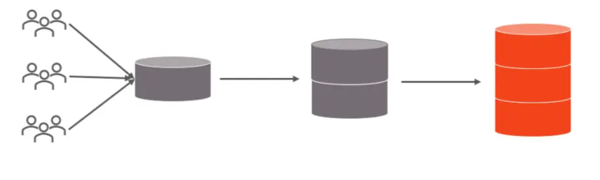

随着互联网及移动互联网的发展，应用系统的数据量也是成指数式增长，若采用单数据库进行数据存储，存在以下性能瓶颈：

1. IO瓶颈：热点数据太多，数据库缓存不足，产生大量磁盘IO，效率较低。 请求数据太多，带宽不够，网络IO瓶颈。
2. CPU瓶颈：排序、分组、连接查询、聚合统计等SQL会耗费大量的CPU资源，请求数太多，CPU出现瓶颈。

为了解决上述问题，我们需要对数据库进行分库分表处理。


分库分表的中心思想都是将数据分散存储，使得单一数据库/表的数据量变小来缓解单一数据库的性能问题，从而达到提升数据库性能的目的。


#### 拆分策略

分库分表的形式，主要是两种：垂直拆分和水平拆分。而拆分的粒度，一般又分为分库和分表，所以组成的拆分策略最终如下：


#### 垂直拆分

1. 垂直分库

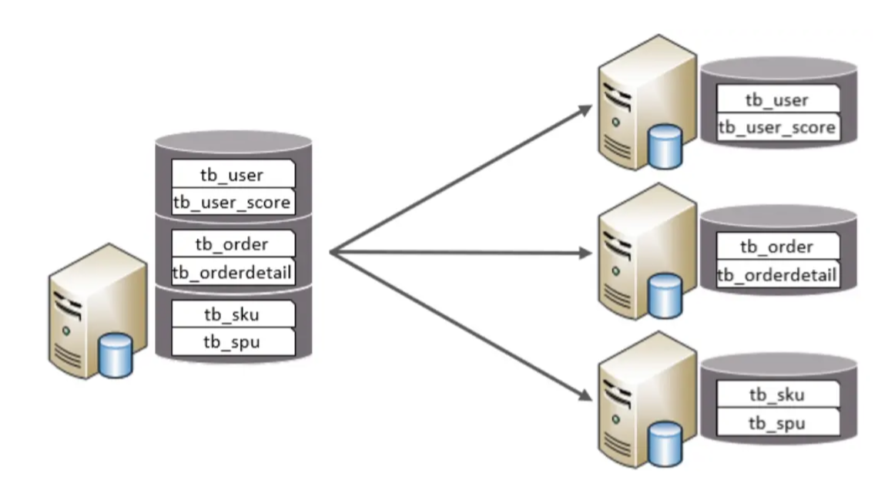

垂直分库：以表为依据，根据业务将不同表拆分到不同库中。

特点：

- 每个库的表结构都不一样。
- 每个库的数据也不一样。
- 所有库的并集是全量数据。


2. 垂直分表

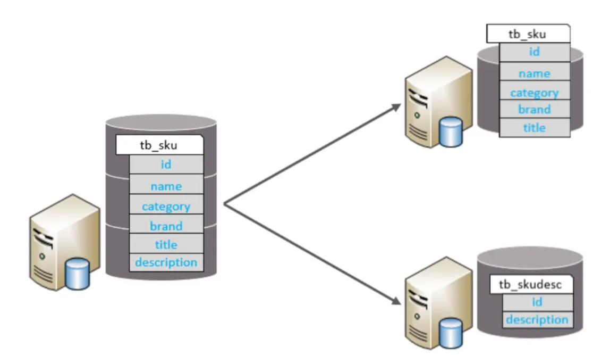

垂直分表：以字段为依据，根据字段属性将不同字段拆分到不同表中。

特点：

- 每个表的结构都不一样。
- 每个表的数据也不一样，一般通过一列（主键/外键）关联。
- 所有表的并集是全量数据


#### 水平拆分

1. 水平分库


水平分库：以字段为依据，按照一定策略，将一个库的数据拆分到多个库中。

特点：

- 每个库的表结构都一样。
- 每个库的数据都不一样。
- 所有库的并集是全量数据。


2. 水平分表


水平分表：以字段为依据，按照一定策略，将一个表的数据拆分到多个表中。

特点：

- 每个表的表结构都一样。
- 每个表的数据都不一样。
- 所有表的并集是全量数据。


```sh
# 在业务系统中，为了缓解磁盘IO及CPU的性能瓶颈，到底是垂直拆分，还是水平拆分；具体是分库，还是分表，都需要根据具体的业务需求具体分析
```


#### 实现技术

- <span style="color:red">`shardingJDBC`</span>：基于AOP原理，在应用程序中对本地执行的SQL进行拦截，解析、改写、路由处理。需要自行编码配置实现，只支持java语言，性能较高。
- <span style="color:red">`MyCat`</span>：数据库分库分表中间件，不用调整代码即可实现分库分表，支持多种语言，性能不及前者


### MyCat 概述

#### 介绍

Mycat是开源的、活跃的、基于Java语言编写的MySQL<span style="color:red">数据库中间件</span>。可以像使用mysql一样来使用mycat，对于开发人员来说根本感觉不到mycat的存在。

开发人员只需要连接MyCat即可，而具体底层用到几台数据库，每一台数据库服务器里面存储了什么数据，都无需关心。 具体的分库分表的策略，只需要在MyCat中配置即可。


优势：

- 性能可靠稳定
- 强大的技术团队
- 体系完善
- 社区活跃


#### 下载 NULL


#### 安装

Mycat是采用java语言开发的开源的数据库中间件，支持Windows和Linux运行环境，下面介绍MyCat的Linux中的环境搭建。我们需要在准备好的服务器中安装如下软件。

- MySQL
- JDK
- Mycat

| 服务器         | 安装软件   | 说明              |
| -------------- | ---------- | ----------------- |
| 192.168.91.166 | JDK、Mycat | MyCat中间件服务器 |
| 192.168.91.166 | MySQL      | 分片服务器        |
| 192.168.91.167 | MySQL      | 分片服务器        |
| 192.168.91.168 | MySQL      | 分片服务器        |

- 安装Mycat
- 使用XFTP工具将下载好的文件上传到Linux系统上。
- 使用解压命令

```sh
tar -zxvf Mycat-server-1.6.7.3-release-20190828135747-linux.tar.gz -C /usr/local

```


#### 目录介绍

```sh
[root@MySQL-Master mycat]# ll
总用量 12
drwxr-xr-x 2 root root  190 10月  6 11:36 bin
drwxrwxrwx 2 root root    6 7月  18 2019 catlet
drwxrwxrwx 4 root root 4096 10月  6 11:36 conf
drwxr-xr-x 2 root root 4096 10月  6 11:36 lib
drwxrwxrwx 2 root root    6 8月  28 2019 logs
-rwxrwxrwx 1 root root  227 8月  28 2019 version.txt

```


bin : 存放可执行文件，用于启动停止mycat

conf：存放mycat的配置文件

lib：存放mycat的项目依赖包（jar）

logs：存放mycat的日志文件

- 由于mycat中的mysql的JDBC驱动包版本比较低，所以我们将它删去，下载8.0版本的

```sh
cd /usr/local/mycat/lib/
rm -rf mysql-connector-java-5.1.35.jar

```

- [mysql驱动包下载地址(opens new window)](https://downloads.mysql.com/archives/c-j/)
- 将下载好的驱动包通过XFTP工具上传到Linux系统的/usr/local/mycat/lib/目录


#### 概念介绍

在MyCat的整体结构中，分为两个部分：上面的逻辑结构、下面的物理结构。


在MyCat的逻辑结构主要负责逻辑库、逻辑表、分片规则、分片节点等逻辑结构的处理，而具体的数据存储还是在物理结构，也就是数据库服务器中存储的。

在后面讲解MyCat入门以及MyCat分片时，还会讲到上面所提到的概念。


### MyCat 入门

#### 需求

由于 tb_order 表中数据量很大，磁盘IO及容量都到达了瓶颈，现在需要对 tb_order 表进行数据分片，分为三个数据节点，每一个节点主机位于不同的服务器上, 具体的结构，参考下图


#### 环境准备

准备3台服务器：

- 192.168.91.166：MyCat中间件服务器，同时也是第一个分片服务器。
- 192.168.91.167：第二个分片服务器。
- 192.168.91.168：第三个分片服务器。

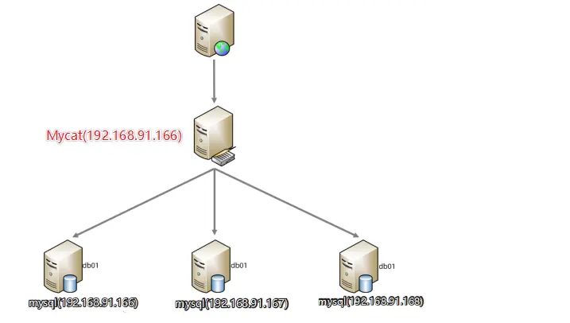

并且在上述3台数据库中创建数据库 db01 。


#### 配置

1. schema.xml

在schema.xml中配置逻辑库、逻辑表、数据节点、节点主机等相关信息。具体的配置如下：

> ```xml
> <?xml version="1.0"?>
> <!DOCTYPE mycat:schema SYSTEM "schema.dtd">
> <mycat:schema xmlns:mycat="http://io.mycat/">
>     <schema name="DB01" checkSQLschema="true" sqlMaxLimit="100">
>         <table name="TB_ORDER" dataNode="dn1,dn2,dn3" rule="auto-sharding-long"/>
>     </schema>
>     <dataNode name="dn1" dataHost="dhost1" database="db01"/>
>     <dataNode name="dn2" dataHost="dhost2" database="db01"/>
>     <dataNode name="dn3" dataHost="dhost3" database="db01"/>
>     <dataHost name="dhost1" maxCon="1000" minCon="10" balance="0" writeType="0" dbType="mysql" dbDriver="jdbc" switchType="1" slaveThreshold="100">
>         <heartbeat>select user()</heartbeat>
>         <writeHost host="master" url="jdbc:mysql://192.168.91.166:3306?useSSL=false&amp;serverTimezone=Asia/Shanghai&amp;characterEncoding=utf8" user="root" password="123456"/>
>     </dataHost>
>     <dataHost name="dhost2" maxCon="1000" minCon="10" balance="0" writeType="0" dbType="mysql" dbDriver="jdbc" switchType="1" slaveThreshold="100">
>         <heartbeat>select user()</heartbeat>
>         <writeHost host="master" url="jdbc:mysql://192.168.91.167:3306?useSSL=false&amp;serverTimezone=Asia/Shanghai&amp;characterEncoding=utf8" user="root" password="123456"/>
>     </dataHost>
>     <dataHost name="dhost3" maxCon="1000" minCon="10" balance="0" writeType="0" dbType="mysql" dbDriver="jdbc" switchType="1" slaveThreshold="100">
>         <heartbeat>select user()</heartbeat>
>         <writeHost host="master" url="jdbc:mysql://192.168.91.168:3306?useSSL=false&amp;serverTimezone=Asia/Shanghai&amp;characterEncoding=utf8" user="root" password="123456"/>
>     </dataHost>
> </mycat:schema>
> 
> ```


2. server.xml

需要在server.xml中配置用户名、密码，以及用户的访问权限信息，具体的配置如下：

> ```xml
> <user name="root" defaultAccount="true">
> 	<property name="password">123456</property>
> 	<property name="schemas">DB01</property>
> 	<!-- 表级 DML 权限设置 -->
> 	<!--
> 	<privileges check="true">
> 		<schema name="DB01" dml="0110" >
> 			<table name="TB_ORDER" dml="1110"></table>
> 		</schema>
> 	</privileges>
> 	-->
> </user>
> <user name="user">
> 	<property name="password">123456</property>
> 	<property name="schemas">DB01</property>
> 	<property name="readOnly">true</property>
> </user>
> 
> ```

上述的配置表示，定义了两个用户 root 和 user ，这两个用户都可以访问 DB01 这个逻辑库，访问密码都是123456，但是root用户访问DB01逻辑库，既可以读，又可以写，但是 user用户访问DB01逻辑库是只读的。

> ```xml
> <?xml version="1.0" encoding="UTF8"?>
> <!DOCTYPE mycat:server SYSTEM "server.dtd">
> <mycat:server xmlns:mycat="http://io.mycat/">
> 	<system>
> 	<property name="nonePasswordLogin">0</property> 
> 	<property name="useHandshakeV10">1</property>
> 	<property name="useSqlStat">0</property>  
> 	<property name="useGlobleTableCheck">0</property>  
> 		<property name="sqlExecuteTimeout">300</property>  
> 		<property name="sequnceHandlerType">2</property>
> 		<property name="sequnceHandlerPattern">(?:(\s*next\s+value\s+for\s*MYCATSEQ_(\w+))(,|\)|\s)*)+</property>
> 	<property name="subqueryRelationshipCheck">false</property> 
>     
> 		<property name="processorBufferPoolType">0</property>
> 		<property name="handleDistributedTransactions">0</property>
> 
> 		<property name="useOffHeapForMerge">0</property>
> 
>         <property name="memoryPageSize">64k</property>
> 
> 		<property name="spillsFileBufferSize">1k</property>
> 
> 		<property name="useStreamOutput">0</property>
> 
> 		<property name="systemReserveMemorySize">384m</property>
> 
> 
> 		<property name="useZKSwitch">false</property>
> 		<property name="strictTxIsolation">false</property>
> 		
> 		<property name="useZKSwitch">true</property>
> 		
> 	</system>
> 	
> 	<user name="root" defaultAccount="true">
> 		<property name="password">123456</property>
> 		<property name="schemas">DB01</property>
> 	</user>
> 
> 	<user name="user">
> 		<property name="password">123456</property>
> 		<property name="schemas">DB01</property>
> 		<property name="readOnly">true</property>
> 	</user>
> 
> </mycat:server>
> 
> ```


#### 测试

1. 启动

配置完毕后，先启动涉及到的3台分片服务器，然后启动MyCat服务器。切换到Mycat的安装目录，执行如下指令，启动Mycat：

```sh
#启动
bin/mycat start
#停止
bin/mycat stop

```

Mycat启动之后，占用端口号 8066。

启动完毕之后，可以查看logs目录下的启动日志，查看Mycat是否启动完成。

> ```sh
> [root@MySQL-Master mycat]# tail -10 logs/wrapper.log
> STATUS | wrapper  | 2022/10/06 23:08:01 | TERM trapped.  Shutting down.
> STATUS | wrapper  | 2022/10/06 23:08:03 | <-- Wrapper Stopped
> STATUS | wrapper  | 2022/10/06 23:08:08 | --> Wrapper Started as Daemon
> STATUS | wrapper  | 2022/10/06 23:08:08 | Launching a JVM...
> INFO   | jvm 1    | 2022/10/06 23:08:08 | Java HotSpot(TM) 64-Bit Server VM warning: ignoring option MaxPermSize=64M; support was removed in 8.0
> INFO   | jvm 1    | 2022/10/06 23:08:08 | Wrapper (Version 3.2.3) http://wrapper.tanukisoftware.org
> INFO   | jvm 1    | 2022/10/06 23:08:08 |   Copyright 1999-2006 Tanuki Software, Inc.  All Rights Reserved.
> INFO   | jvm 1    | 2022/10/06 23:08:08 |
> INFO   | jvm 1    | 2022/10/06 23:08:09 | Loading class `com.mysql.jdbc.Driver'. This is deprecated. The new driver class is `com.mysql.cj.jdbc.Driver'. The driver is automatically registered via the SPI and manual loading of the driver class is generally unnecessary.
> INFO   | jvm 1    | 2022/10/06 23:08:11 | MyCAT Server startup successfully. see logs in logs/mycat.log
> 
> ```


2. 测试

通过如下指令，就可以连接并登陆MyCat。

```sh
mysql -h 192.168.91.166 -P 8066 -u root -p 123456

[root@MySQL-Master ~]# mysql -h 192.168.91.166 -P 8066 -u root -p
Enter password:
Welcome to the MySQL monitor.  Commands end with ; or \g.
Your MySQL connection id is 2
Server version: 5.6.29-mycat-1.6.7.3-release-20190828215749 MyCat Server (OpenCloudDB)

Copyright (c) 2000, 2021, Oracle and/or its affiliates.

Oracle is a registered trademark of Oracle Corporation and/or its
affiliates. Other names may be trademarks of their respective
owners.

Type 'help;' or '\h' for help. Type '\c' to clear the current input statement.

mysql>

```

我们看到我们是通过MySQL的指令来连接的MyCat，因为MyCat在底层实际上是模拟了MySQL的协议。


然后就可以在MyCat中来创建表，并往表结构中插入数据，查看数据在MySQL中的分布情况。

```sql
CREATE TABLE TB_ORDER (
	id BIGINT(20) NOT NULL,
    title VARCHAR(100) NOT NULL ,
	PRIMARY KEY (id)
) ENGINE=INNODB DEFAULT CHARSET=utf8 ;
INSERT INTO TB_ORDER(id,title) VALUES(1,'goods1');
INSERT INTO TB_ORDER(id,title) VALUES(2,'goods2');
INSERT INTO TB_ORDER(id,title) VALUES(3,'goods3');

INSERT INTO TB_ORDER(id,title) VALUES(1,'goods1');
INSERT INTO TB_ORDER(id,title) VALUES(2,'goods2');
INSERT INTO TB_ORDER(id,title) VALUES(3,'goods3');
INSERT INTO TB_ORDER(id,title) VALUES(5000000,'goods5000000');
INSERT INTO TB_ORDER(id,title) VALUES(10000000,'goods10000000');
INSERT INTO TB_ORDER(id,title) VALUES(10000001,'goods10000001');
INSERT INTO TB_ORDER(id,title) VALUES(15000000,'goods15000000');
INSERT INTO TB_ORDER(id,title) VALUES(15000001,'goods15000001');

```

```sql
mysql> INSERT INTO TB_ORDER(id,title) VALUES(5000000,'goods5000000');
Query OK, 1 row affected (0.00 sec)
 OK!

mysql> INSERT INTO TB_ORDER(id,title) VALUES(10000000,'goods10000000');
Query OK, 1 row affected (0.03 sec)
 OK!

mysql> INSERT INTO TB_ORDER(id,title) VALUES(10000001,'goods10000001');
Query OK, 1 row affected (0.00 sec)
 OK!

mysql> INSERT INTO TB_ORDER(id,title) VALUES(15000000,'goods15000000');
Query OK, 1 row affected (0.00 sec)
 OK!

mysql> INSERT INTO TB_ORDER(id,title) VALUES(15000001,'goods15000001');
ERROR 1064 (HY000): can't find any valid datanode :TB_ORDER -> ID -> 1500                                                                              0001

```


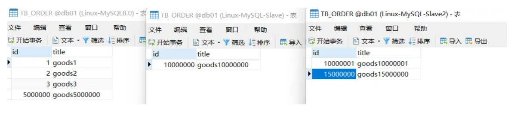

经过测试，我们发现，在往 TB_ORDER 表中插入数据时：

- 如果id的值在1-500w之间，数据将会存储在第一个分片数据库中。
- 如果id的值在500w-1000w之间，数据将会存储在第二个分片数据库中。
- 如果id的值在1000w-1500w之间，数据将会存储在第三个分片数据库中。
- 如果id的值超出1500w，在插入数据时，将会报错。

为什么会出现这种现象，数据到底落在哪一个分片服务器到底是如何决定的呢？ 这是由逻辑表配置时的一个参数 rule 决定的，而这个参数配置的就是分片规则，关于分片规则的配置，在后面会详细讲解


### MyCat 配置

#### schema.xml

schema.xml 作为MyCat中最重要的配置文件之一 , 涵盖了MyCat的逻辑库 、 逻辑表 、 分片规则、分片节点及数据源的配置。

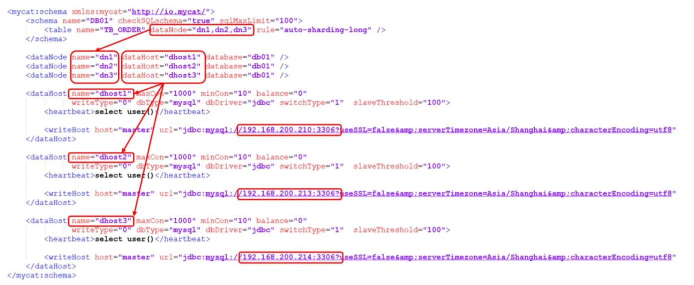

主要包含以下三组标签：

- schema标签
- datanode标签
- datahost标签


##### schema标签

1. schema 定义逻辑库


schema 标签用于定义 MyCat实例中的逻辑库 , 一个MyCat实例中, 可以有多个逻辑库 , 可以通过 schema 标签来划分不同的逻辑库。MyCat中的逻辑库的概念，等同于MySQL中的database概念, 需要操作某个逻辑库下的表时, 也需要切换逻辑库(use xxx)。

核心属性：

- name：指定自定义的逻辑库库名
- checkSQLschema：在SQL语句操作时指定了数据库名称，执行时是否自动去除；true：自动去除，false：不自动去除
- sqlMaxLimit：如果未指定limit进行查询，列表查询模式查询多少条记录


2. schema 中的table定义逻辑表

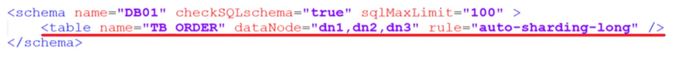

table 标签定义了MyCat中逻辑库schema下的逻辑表 , 所有需要拆分的表都需要在table标签中定义 。

核心属性：

- name：定义逻辑表表名，在该逻辑库下唯一
- dataNode：定义逻辑表所属的dataNode，该属性需要与dataNode标签中name对应；多个dataNode逗号分隔
- rule：分片规则的名字，分片规则名字是在rule.xml中定义的
- primaryKey：逻辑表对应真实表的主键
- type：逻辑表的类型，目前逻辑表只有全局表和普通表，如果未配置，就是普通表；全局表，配 置为 global


##### datanode标签


核心属性：

- name：定义数据节点名称
- dataHost：数据库实例主机名称，引用自 dataHost 标签中name属性
- database：定义分片所属数据库


##### datahost标签

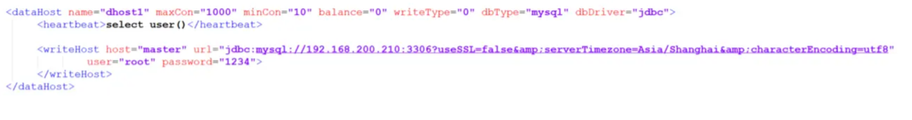

该标签在MyCat逻辑库中作为底层标签存在, 直接定义了具体的数据库实例、读写分离、心跳语句。

核心属性：

- name：唯一标识，供上层标签使用
- maxCon/minCon：最大连接数/最小连接数
- balance：负载均衡策略，取值 0,1,2,3
- writeType：写操作分发方式（0：写操作转发到第一个writeHost，第一个挂了，切换到第二个；1：写操作随机分发到配置的writeHost）
- dbDriver：数据库驱动，支持 native、jdbc


#### rule.xml

rule.xml中定义所有拆分表的规则, 在使用过程中可以灵活的使用分片算法, 或者对同一个分片算法使用不同的参数, 它让分片过程可配置化。主要包含两类标签：<span style="color:red">`tableRule`、`Function`</span>。


#### server.xml

server.xml配置文件包含了MyCat的系统配置信息，主要有两个重要的标签：system、user

1. system标签


主要配置MyCat中的系统配置信息，对应的系统配置项及其含义，如下：

| 属性                      | 取值       | 含义                                                         |
| ------------------------- | ---------- | ------------------------------------------------------------ |
| charset                   | utf8       | 设置Mycat的字符集, 字符集需要与MySQL的字符集保持一致         |
| nonePasswordLogin         | 0,1        | 0为需要密码登陆、1为不需要密码登陆 ,默认为0，设置为1则需要指定默认账户 |
| useHandshakeV10           | 0,1        | 使用该选项主要的目的是为了能够兼容高版本的jdbc驱动, 是否采用HandshakeV10Packet来与client进行通信, 1:是, 0:否 |
| useSqlStat                | 0,1        | 开启SQL实时统计, 1 为开启 , 0 为关闭 ;开启之后, MyCat会自动统计SQL语句的执行情况 ; mysql -h 127.0.0.1 -P 9066 -u root -p 查看MyCat执行的SQL, 执行效率比较低的SQL , SQL的整体执行情况、读写比例等 ; show @@sql ; show @@sql.slow ; show @@sql.sum ; |
| useGlobleTableCheck       | 0,1        | 是否开启全局表的一致性检测。1为开启 ，0为关闭 。             |
| sqlExecuteTimeout         | 1000       | SQL语句执行的超时时间 , 单位为 s ;                           |
| sequnceHandlerType        | 0,1,2      | 用来指定Mycat全局序列类型，0 为本地文件，1 为数据库方式，2 为时间戳列方式，默认使用本地文件方式，文件方式主要用于测试 |
| sequnceHandlerPattern     | 正则表达式 | 必须带有MYCATSEQ或者 mycatseq进入序列匹配流程 注意MYCATSEQ_有空格的情况 |
| subqueryRelationshipCheck | true,false | 子查询中存在关联查询的情况下,检查关联字段中是否有分片字段 .默认 false |
| useCompression            | 0,1        | 开启mysql压缩协议 , 0 : 关闭, 1 : 开启                       |
| fakeMySQLVersion          | 5.5,5.6    | 设置模拟的MySQL版本号                                        |
| defaultSqlParser          |            | 由于MyCat的最初版本使用了FoundationDB的SQL解析器, 在MyCat1.3后增加了Druid解析器, 所以要设置defaultSqlParser属性来指定默认的解析器; 解析器有两个 :druidparser 和 fdbparser, 在MyCat1.4之后,默认是druidparser,fdbparser已经废除了 |
| processors                | 1,2....    | 指定系统可用的线程数量, 默认值为CPU核心x 每个核心运行线程数量; processors 会影响processorBufferPool,processorBufferLocalPercent,processorExecutor属性, 所有, 在性能调优时, 可以适当地修改processors值 |
| processorBufferChunk      |            | 指定每次分配Socket Direct Buffer默认值为4096字节, 也会影响BufferPool长度,如果一次性获取字节过多而导致buffer不够用, 则会出现警告, 可以调大该值 |
| processorExecutor         |            | 指定NIOProcessor上共享businessExecutor固定线程池的大小; MyCat把异步任务交给 businessExecutor线程池中, 在新版本的MyCat中这个连接池使用频次不高, 可以适当地把该值调小 |
| packetHeaderSize          |            | 指定MySQL协议中的报文头长度, 默认4个字节                     |
| maxPacketSize             |            | 指定MySQL协议可以携带的数据最大大小, 默认值为16M             |
| idleTimeout               | 30         | 指定连接的空闲时间的超时长度;如果超时,将关闭资源并回收, 默认30分钟 |
| txIsolation               | 1,2,3,4    | 初始化前端连接的事务隔离级别,默认为REPEATED_READ , 对应数字为3 READ_UNCOMMITED=1;READ_COMMITTED=2; REPEATED_READ=3;SERIALIZABLE=4; |
| sqlExecuteTimeout         | 300        | 执行SQL的超时时间, 如果SQL语句执行超时, 将关闭连接; 默认300秒; |
| serverPort                | 8066       | 定义MyCat的使用端口, 默认8066                                |
| managerPort               | 9066       | 定义MyCat的管理端口, 默认9066                                |


2. user标签

配置MyCat中的用户、访问密码，以及用户针对于逻辑库、逻辑表的权限信息，具体的权限描述方式及配置说明如下：

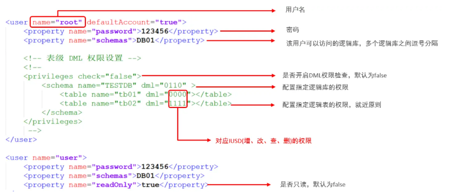

在测试权限操作时，我们只需要将 privileges 标签的注释放开。 在 privileges 下的schema标签中配置的dml属性配置的是逻辑库的权限。 在privileges的schema下的table标签的dml属性中配置逻辑表的权限


### MyCat 分片 NULL


#### 垂直拆分


#### 水平拆分


#### 分片规则


### MyCat 管理及监控

#### MyCat 原理


在MyCat中，当执行一条SQL语句时，MyCat需要进行SQL解析、分片分析、路由分析、读写分离分析等操作，最终经过一系列的分析决定将当前的SQL语句到底路由到那几个(或哪一个)节点数据库，数据库将数据执行完毕后，如果有返回的结果，则将结果返回给MyCat，最终还需要在MyCat中进行结果合并、聚合处理、排序处理、分页处理等操作，最终再将结果返回给客户端。

而在MyCat的使用过程中，MyCat官方也提供了一个管理监控平台MyCat-Web（MyCat-eye）。Mycat-web 是 Mycat 可视化运维的管理和监控平台，弥补了 Mycat 在监控上的空白。帮 Mycat分担统计任务和配置管理任务。Mycat-web 引入了 ZooKeeper 作为配置中心，可以管理多个节点。Mycat-web 主要管理和监控 Mycat 的流量、连接、活动线程和内存等，具备 IP 白名单、邮件告警等模块，还可以统计 SQL 并分析慢 SQL 和高频 SQL 等。为优化 SQL 提供依据。


#### MyCat 管理

Mycat默认开通2个端口，可以在server.xml中进行修改。

- 8066 数据访问端口，即进行 DML 和 DDL 操作。
- 9066 数据库管理端口，即 mycat 服务管理控制功能，用于管理mycat的整个集群状态

连接MyCat的管理控制台：

```sh
mysql -h 192.168.91.166 -p9066 -u root -p 123456

```

| 命令              | 含义                        |
| ----------------- | --------------------------- |
| show @@help       | 查看Mycat管理工具帮助文档   |
| show @@version    | 查看Mycat的版本             |
| reload @@config   | 重新加载Mycat的配置文件     |
| show @@datasource | 查看Mycat的数据源信息       |
| show @@datanode   | 查看MyCat现有的分片节点信息 |
| show @@threadpool | 查看Mycat的线程池信息       |
| show @@sql        | 查看执行的SQL               |
| show @@sql.sum    | 查看执行的SQL统计           |


#### MyCat-eye

##### 介绍

Mycat-web(Mycat-eye)是对mycat-server提供监控服务，功能不局限于对mycat-server使用。他通过JDBC连接对Mycat、Mysql监控，监控远程服务器(目前仅限于linux系统)的cpu、内存、网络、磁盘。

Mycat-eye运行过程中需要依赖zookeeper，因此需要先安装zookeeper


##### 安装

1. zookeeper安装

```sh
# 在springCloud 笔记中有详细说明
# 配置文件中 dataDir=/tmp/zookeeper
```


2. 启动Zookeeper

```sh
bin/zkServer.sh start

bin/zkServer.sh status

```


##### 配置


##### 测试


## MySQL-读写分离

### 介绍

读写分离,简单地说是把对数据库的读和写操作分开,以对应不同的数据库服务器。主数据库提供写操作，从数据库提供读操作，这样能有效地减轻单台数据库的压力。

通过MyCat即可轻易实现上述功能，不仅可以支持MySQL，也可以支持Oracle和SQL Server。


### 一主一从

查看[MySQL-主从复制](#mysql-master-s)章节


### 一主一从读写分离

MyCat控制后台数据库的读写分离和负载均衡由schema.xml文件datahost标签的balance属性控制。

#### schema.xml配置

```xml
<!-- 配置逻辑库 -->
<schema name="ITCAST_RW" checkSQLschema="true" sqlMaxLimit="100" dataNode="dn7">
</schema>
<dataNode name="dn7" dataHost="dhost7" database="itcast01" />

<dataHost name="dhost7" maxCon="1000" minCon="10" balance="1" writeType="0" dbType="mysql" dbDriver="jdbc" switchType="1" slaveThreshold="100">
	<heartbeat>select user()</heartbeat>
	<writeHost host="master1" url="jdbc:mysql://192.168.91.166:3306?useSSL=false&amp;serverTimezone=Asia/Shanghai&amp;characterEncoding=utf8" user="root" password="123456" >
	<readHost host="slave1" url="jdbc:mysql://192.168.91.167:3306?useSSL=false&amp;serverTimezone=Asia/Shanghai&amp;characterEncoding=utf8" user="root" password="123456" />
	</writeHost>
</dataHost>

```

上述配置的具体关联对应情况如下：


writeHost代表的是写操作对应的数据库，readHost代表的是读操作对应的数据库。 所以我们要想实现读写分离，就得配置writeHost关联的是主库，readHost关联的是从库。

而仅仅配置好了writeHost以及readHost还不能完成读写分离，还需要配置一个非常重要的负责均衡的参数 balance，取值有4种，具体含义如下：

| 参数值 | 含义                                                         |
| ------ | ------------------------------------------------------------ |
| 0      | 不开启读写分离机制 , 所有读操作都发送到当前可用的writeHost上 |
| 1      | 全部的readHost 与 备用的writeHost 都参与select 语句的负载均衡（主要针对于双主双从模式） |
| 2      | 所有的读写操作都随机在writeHost , readHost上分发             |
| 3      | 所有的读请求随机分发到writeHost对应的readHost上执行, writeHost不负担读压力 |

所以，在一主一从模式的读写分离中，balance配置1或3都是可以完成读写分离的。


#### server.xml配置

配置root用户可以访问SHOPPING、ITCAST 以及 ITCAST_RW逻辑库。

```xml
<user name="root" defaultAccount="true">
	<property name="password">123456</property>
	<property name="schemas">SHOPPING,ITCAST,ITCAST_RW</property>
    
    <!-- 表级 DML 权限设置 -->
    <!--
    <privileges check="true">
		<schema name="DB01" dml="0110" >
			<table name="TB_ORDER" dml="1110"></table>
		</schema>
	</privileges>
-->
</user>

```


#### 测试

配置完毕MyCat后，重新启动MyCat。

```sh
bin/mycat stop
bin/mycat start

```

然后观察，在执行增删改操作时，对应的主库及从库的数据变化。 在执行查询操作时，检查主库及从库对应的数据变化。


在数据库写入一条数据，发现主从节点都增加一条数据，其实这条数据是从主节点写入的，因为数据是由主机点同步到从节点。

在数据库修改一条数据，发现主节点没有改变，从节点改变了，还是因为数据是由主机点同步到从节点。

在测试中，我们可以发现当主节点Master宕机之后，业务系统就只能够读，而不能写入数据了。

```sql
mysql> select * from tb_user;
+------+---------+-----+
| id   | name    | sex |
+------+---------+-----+
|    1 | Tom     | 1   |
|    2 | Trigger | 0   |
|    3 | Dawn    | 1   |
|    8 | It5     | 0   |
+------+---------+-----+
4 rows in set (0.01 sec)

mysql> insert into tb_user(id,name,sex) values(10,'It5',0);
ERROR:
No operations allowed after connection closed.
mysql>

```

那如何解决这个问题呢？这个时候我们就得通过另外一种主从复制结构来解决了，也就是我们接下来演示的双主双从


### docker搭建

```sh
# 查看 docker 篇章
```

