# Activiti7基础

## 一、工作流介绍

### 1.1 概念

工作流(Workflow)，就是通过计算机对业务流程自动化执行管理。它主要解决的是“使在多个参与者之间按照某种预定义的规则自动进行传递文档、信息或任务的过程，从而实现某个预期的业务目标，或者促使此目标的实现”。

### 1.2 工作流系统

一个软件系统中具有工作流的功能，我们把它称为工作流系统，一个系统中工作流的功能是什么？就是对系统的业务流程进行自动化管理，所以工作流是建立在业务流程的基础上，所以一个软件的系统核心根本上还是系统的业务流程，工作流只是协助进行业务流程管理。即使没有工作流业务系统也可以开发运行，只不过有了工作流可以更好的管理业务流程，提高系统的可扩展性。

### 1.3 适用行业

消费品行业，制造业，电信服务业，银证险等金融服务业，物流服务业，物业服务业，物业管理，大中型进出口贸易公司，政府事业机构，研究院所及教育服务业等，特别是大的跨国企业和集团公司。

### 1.4 具体应用

1、关键业务流程：订单、报价处理、合同审核、客户电话处理、供应链管理等

2、行政管理类:出差申请、加班申请、请假申请、用车申请、各种办公用品申请、购买申请、日报周报等凡是原来手工流转处理的行政表单。

3、人事管理类：员工培训安排、绩效考评、职位变动处理、员工档案信息管理等。

4、财务相关类：付款请求、应收款处理、日常报销处理、出差报销、预算和计划申请等。

5、客户服务类：客户信息管理、客户投诉、请求处理、售后服务管理等。

6、特殊服务类：ISO系列对应流程、质量管理对应流程、产品数据信息管理、贸易公司报关处理、物流公司货物跟踪处理等各种通过表单逐步手工流转完成的任务均可应用工作流软件自动规范地实施。

### 1.5 实现方式

在没有专门的工作流引擎之前，我们之前为了实现流程控制，通常的做法就是采用状态字段的值来跟踪流程的变化情况。这样不用角色的用户，通过状态字段的取值来决定记录是否显示。

 针对有权限可以查看的记录，当前用户根据自己的角色来决定审批是否合格的操作。如果合格将状态字段设置一个值，来代表合格；当然如果不合格也需要设置一个值来代表不合格的情况。

 这是一种最为原始的方式。通过状态字段虽然做到了流程控制，但是当我们的流程发生变更的时候，这种方式所编写的代码也要进行调整。

 那么有没有专业的方式来实现工作流的管理呢？并且可以做到业务流程变化之后，我们的程序可以不用改变，如果可以实现这样的效果，那么我们的业务系统的适应能力就得到了极大提升。

## 二、Activiti7概述

### 2.1 介绍

Alfresco软件在2010年5月17日宣布Activiti业务流程管理（BPM）开源项目的正式启动，其首席架构师由业务流程管理BPM的专家 Tom Baeyens担任，Tom Baeyens就是原来jbpm的架构师，而jbpm是一个非常有名的工作流引擎，当然activiti也是一个工作流引擎。

Activiti是一个工作流引擎， activiti可以将业务系统中复杂的业务流程抽取出来，使用专门的建模语言BPMN2.0进行定义，业务流程按照预先定义的流程进行执行，实现了系统的流程由activiti进行管理，减少业务系统由于流程变更进行系统升级改造的工作量，从而提高系统的健壮性，同时也减少了系统开发维护成本。

官方网站：<https://www.activiti.org/>


经历的版本:


目前最新版本：Activiti7.0.0.Beta

#### 2.1.1 BPM

BPM（Business Process Management），即业务流程管理，是一种规范化的构造端到端的业务流程，以持续的提高组织业务效率。常见商业管理教育如EMBA、MBA等均将BPM包含在内。

#### 2.1.2 BPM软件

BPM软件就是根据企业中业务环境的变化，推进人与人之间、人与系统之间以及系统与系统之间的整合及调整的经营方法与解决方案的IT工具。

通过BPM软件对企业内部及外部的业务流程的整个生命周期进行建模、自动化、管理监控和优化，使企业成本降低，利润得以大幅提升。

BPM软件在企业中应用领域广泛，凡是有业务流程的地方都可以BPM软件进行管理，比如企业人事办公管理、采购流程管理、公文审批流程管理、财务管理等。

#### 2.1.3 BPMN

BPMN（Business Process Model AndNotation）- 业务流程模型和符号 是由BPMI（BusinessProcess Management Initiative）开发的一套标准的业务流程建模符号，使用BPMN提供的符号可以创建业务流程。 

2004年5月发布了BPMN1.0规范.BPMI于2005年9月并入OMG（The Object Management Group对象管理组织)组织。OMG于2011年1月发布BPMN2.0的最终版本。

具体发展历史如下: 


BPMN 是目前被各 BPM 厂商广泛接受的 BPM 标准。Activiti 就是使用 BPMN 2.0 进行流程建模、流程执行管理，它包括很多的建模符号，比如：

Event 

用一个圆圈表示，它是流程中运行过程中发生的事情。


活动用圆角矩形表示，一个流程由一个活动或多个活动组成


Bpmn图形其实是通过xml表示业务流程，上边的.bpmn文件使用文本编辑器打开：

```xml
<?xml version="1.0" encoding="UTF-8"?>
<definitions xmlns="http://www.omg.org/spec/BPMN/20100524/MODEL" xmlns:xsi="http://www.w3.org/2001/XMLSchema-instance" xmlns:xsd="http://www.w3.org/2001/XMLSchema" xmlns:activiti="http://activiti.org/bpmn" xmlns:bpmndi="http://www.omg.org/spec/BPMN/20100524/DI" xmlns:omgdc="http://www.omg.org/spec/DD/20100524/DC" xmlns:omgdi="http://www.omg.org/spec/DD/20100524/DI" typeLanguage="http://www.w3.org/2001/XMLSchema" expressionLanguage="http://www.w3.org/1999/XPath" targetNamespace="http://www.activiti.org/test">
  <process id="myProcess" name="My process" isExecutable="true">
    <startEvent id="startevent1" name="Start"></startEvent>
    <userTask id="usertask1" name="创建请假单"></userTask>
    <sequenceFlow id="flow1" sourceRef="startevent1" targetRef="usertask1"></sequenceFlow>
    <userTask id="usertask2" name="部门经理审核"></userTask>
    <sequenceFlow id="flow2" sourceRef="usertask1" targetRef="usertask2"></sequenceFlow>
    <userTask id="usertask3" name="人事复核"></userTask>
    <sequenceFlow id="flow3" sourceRef="usertask2" targetRef="usertask3"></sequenceFlow>
    <endEvent id="endevent1" name="End"></endEvent>
    <sequenceFlow id="flow4" sourceRef="usertask3" targetRef="endevent1"></sequenceFlow>
  </process>
  <bpmndi:BPMNDiagram id="BPMNDiagram_myProcess">
    <bpmndi:BPMNPlane bpmnElement="myProcess" id="BPMNPlane_myProcess">
      <bpmndi:BPMNShape bpmnElement="startevent1" id="BPMNShape_startevent1">
        <omgdc:Bounds height="35.0" width="35.0" x="130.0" y="160.0"></omgdc:Bounds>
      </bpmndi:BPMNShape>
      <bpmndi:BPMNShape bpmnElement="usertask1" id="BPMNShape_usertask1">
        <omgdc:Bounds height="55.0" width="105.0" x="210.0" y="150.0"></omgdc:Bounds>
      </bpmndi:BPMNShape>
      <bpmndi:BPMNShape bpmnElement="usertask2" id="BPMNShape_usertask2">
        <omgdc:Bounds height="55.0" width="105.0" x="360.0" y="150.0"></omgdc:Bounds>
      </bpmndi:BPMNShape>
      <bpmndi:BPMNShape bpmnElement="usertask3" id="BPMNShape_usertask3">
        <omgdc:Bounds height="55.0" width="105.0" x="510.0" y="150.0"></omgdc:Bounds>
      </bpmndi:BPMNShape>
      <bpmndi:BPMNShape bpmnElement="endevent1" id="BPMNShape_endevent1">
        <omgdc:Bounds height="35.0" width="35.0" x="660.0" y="160.0"></omgdc:Bounds>
      </bpmndi:BPMNShape>
      <bpmndi:BPMNEdge bpmnElement="flow1" id="BPMNEdge_flow1">
        <omgdi:waypoint x="165.0" y="177.0"></omgdi:waypoint>
        <omgdi:waypoint x="210.0" y="177.0"></omgdi:waypoint>
      </bpmndi:BPMNEdge>
      <bpmndi:BPMNEdge bpmnElement="flow2" id="BPMNEdge_flow2">
        <omgdi:waypoint x="315.0" y="177.0"></omgdi:waypoint>
        <omgdi:waypoint x="360.0" y="177.0"></omgdi:waypoint>
      </bpmndi:BPMNEdge>
      <bpmndi:BPMNEdge bpmnElement="flow3" id="BPMNEdge_flow3">
        <omgdi:waypoint x="465.0" y="177.0"></omgdi:waypoint>
        <omgdi:waypoint x="510.0" y="177.0"></omgdi:waypoint>
      </bpmndi:BPMNEdge>
      <bpmndi:BPMNEdge bpmnElement="flow4" id="BPMNEdge_flow4">
        <omgdi:waypoint x="615.0" y="177.0"></omgdi:waypoint>
        <omgdi:waypoint x="660.0" y="177.0"></omgdi:waypoint>
      </bpmndi:BPMNEdge>
    </bpmndi:BPMNPlane>
  </bpmndi:BPMNDiagram>
</definitions>

```

### 2.2 使用步骤

#### 部署activiti

Activiti是一个工作流引擎（其实就是一堆jar包API），业务系统访问(操作)activiti的接口，就可以方便的操作流程相关数据，这样就可以把工作流环境与业务系统的环境集成在一起。

#### 流程定义

使用activiti流程建模工具(activity-designer)定义业务流程(.bpmn文件) 。

.bpmn文件就是业务流程定义文件，通过xml定义业务流程。

####   流程定义部署

activiti部署业务流程定义（.bpmn文件）。

使用activiti提供的api把流程定义内容存储起来，在Activiti执行过程中可以查询定义的内容

Activiti执行把流程定义内容存储在数据库中

#### 启动一个流程实例

流程实例也叫：ProcessInstance

启动一个流程实例表示开始一次业务流程的运行。

在员工请假流程定义部署完成后，如果张三要请假就可以启动一个流程实例，如果李四要请假也启动一个流程实例，两个流程的执行互相不影响。

#### 用户查询待办任务(Task)

因为现在系统的业务流程已经交给activiti管理，通过activiti就可以查询当前流程执行到哪了，当前用户需要办理什么任务了，这些activiti帮我们管理了，而不需要开发人员自己编写在sql语句查询。

#### 用户办理任务

用户查询待办任务后，就可以办理某个任务，如果这个任务办理完成还需要其它用户办理，比如采购单创建后由部门经理审核，这个过程也是由activiti帮我们完成了。

#### 流程结束

当任务办理完成没有下一个任务结点了，这个流程实例就完成了。

## 三、Activiti环境

### 3.1 开发环境

Jdk1.8或以上版本

Mysql 5及以上的版本

Tomcat8.5

IDEA

**注意：activiti的流程定义工具插件可以安装在IDEA下，也可以安装在Eclipse工具下**

### 3.2 Activiti环境

我们使用：Activiti7.0.0.Beta1  默认支持spring5

#### 3.2.1 下载activiti7

Activiti下载地址：<http://activiti.org/download.html> ，Maven的依赖如下：

 ```xml
<?xml version="1.0" encoding="UTF-8"?>
<project xmlns="http://maven.apache.org/POM/4.0.0"
         xmlns:xsi="http://www.w3.org/2001/XMLSchema-instance"
         xsi:schemaLocation="http://maven.apache.org/POM/4.0.0 http://maven.apache.org/xsd/maven-4.0.0.xsd">
    <parent>
        <artifactId>Activiti</artifactId>
        <groupId>org.example</groupId>
        <version>1.0-SNAPSHOT</version>
    </parent>
    <modelVersion>4.0.0</modelVersion>

    <artifactId>activiti01</artifactId>

    <properties>
        <maven.compiler.source>8</maven.compiler.source>
        <maven.compiler.target>8</maven.compiler.target>
    </properties>
    <dependencies>
        <dependency>
            <groupId>org.activiti</groupId>
            <artifactId>activiti-engine</artifactId>
        </dependency>
        <dependency>
            <groupId>org.activiti</groupId>
            <artifactId>activiti-spring</artifactId>
        </dependency>
        <!-- bpmn 模型处理 -->
        <dependency>
            <groupId>org.activiti</groupId>
            <artifactId>activiti-bpmn-model</artifactId>
        </dependency>
        <!-- bpmn 转换 -->
        <dependency>
            <groupId>org.activiti</groupId>
            <artifactId>activiti-bpmn-converter</artifactId>
        </dependency>
        <!-- bpmn json数据转换 -->
        <dependency>
            <groupId>org.activiti</groupId>
            <artifactId>activiti-json-converter</artifactId>
        </dependency>
        <!-- bpmn 布局 -->
        <dependency>
            <groupId>org.activiti</groupId>
            <artifactId>activiti-bpmn-layout</artifactId>
        </dependency>
        <!-- activiti 云支持 -->
        <dependency>
            <groupId>org.activiti.cloud</groupId>
            <artifactId>activiti-cloud-services-api</artifactId>
            <version>${activiti.version}</version>
        </dependency>
        <!-- mysql驱动 -->
        <dependency>
            <groupId>mysql</groupId>
            <artifactId>mysql-connector-java</artifactId>
        </dependency>
        <!-- mybatis -->
        <dependency>
            <groupId>org.mybatis</groupId>
            <artifactId>mybatis</artifactId>
        </dependency>
        <!-- 链接池 -->
        <dependency>
            <groupId>com.alibaba</groupId>
            <artifactId>druid</artifactId>
        </dependency>
        <dependency>
            <groupId>junit</groupId>
            <artifactId>junit</artifactId>
        </dependency>
        <!-- log start -->
        <dependency>
            <groupId>log4j</groupId>
            <artifactId>log4j</artifactId>
        </dependency>
        <dependency>
            <groupId>org.slf4j</groupId>
            <artifactId>slf4j-api</artifactId>
        </dependency>
        <dependency>
            <groupId>org.slf4j</groupId>
            <artifactId>slf4j-log4j12</artifactId>
        </dependency>
    </dependencies>
</project>
 ```

**1)**      **Database**：

activiti运行需要有数据库的支持，支持的数据库有：h2, mysql, oracle, postgres, mssql, db2。

####  3.2.2 流程设计器IDEA下安装

在IDEA的File菜单中找到子菜单”Settings”,后面我们再选择左侧的“plugins”菜单，如下图所示：


此时我们就可以搜索到actiBPM插件，它就是Activiti Designer的IDEA版本，我们点击Install安装。

安装好后，页面如下：


提示需要重启idea，点击重启。

重启完成后，再次打开Settings 下的 Plugins（插件列表），点击右侧的Installed（已安装的插件），在列表中看到actiBPM，就说明已经安装成功了，如下图所示：


后面的课程里，我们会使用这个流程设计器进行Activiti的流程设计。

### 3.3 Activiti的数据库支持

Activiti 在运行时需要数据库的支持，使用25张表，把流程定义节点内容读取到数据库表中，以供后续使用。

#### 3.3.1 Activiti 支持的数据库

activiti  支持的数据库和版本如下：

| 数据库类型 | 版本                   | JDBC连接示例                                            | 说明                               |
| ---------- | ---------------------- | ------------------------------------------------------- | ---------------------------------- |
| h2         | 1.3.168                | jdbc:h2:tcp://localhost/activiti                        | 默认配置的数据库                   |
| mysql      | 5.1.21                 | jdbc:mysql://localhost:3306/activiti?autoReconnect=true | 使用 mysql-connector-java 驱动测试 |
| oracle     | 11.2.0.1.0             | jdbc:oracle:thin:@localhost:1521:xe                     |                                    |
| postgres   | 8.1                    | jdbc:postgresql://localhost:5432/activiti               |                                    |
| db2        | DB2 10.1 using db2jcc4 | jdbc:db2://localhost:50000/activiti                     |                                    |
| mssql      | 2008 using sqljdbc4    | jdbc:sqlserver://localhost:1433/activiti                |                                    |

#### 3.3.2 在MySQL生成表

##### 3.3.2.1 创建数据库

创建  mysql  数据库  activiti （名字任意）：

CREATE DATABASE activiti DEFAULT CHARACTER SET utf8;

##### 3.3.2.2 使用java代码生成表

###### 1） 创建 java 工程

使用idea 创建 java 的maven工程，取名：activiti01。

###### 2） 加入 maven 依赖的坐标（jar 包）

首先需要在 java 工程中加入 ProcessEngine 所需要的 jar 包，包括：

1) activiti-engine-7.0.0.beta1.jar
2) activiti 依赖的 jar 包： mybatis、 alf4j、 log4j 等

3) activiti 依赖的 spring 包

4) mysql数据库驱动

5) 第三方数据连接池 dbcp
6) 单元测试 Junit-4.12.jar

我们使用 maven 来实现项目的构建，所以应当导入这些 jar 所对应的坐标到 pom.xml 文件中。

完整的依赖内容如下：

```xml
<properties>
    <slf4j.version>1.6.6</slf4j.version>
    <log4j.version>1.2.12</log4j.version>
    <activiti.version>7.0.0.Beta1</activiti.version>
</properties>
<dependencies>
    <dependency>
        <groupId>org.activiti</groupId>
        <artifactId>activiti-engine</artifactId>
        <version>${activiti.version}</version>
    </dependency>
    <dependency>
        <groupId>org.activiti</groupId>
        <artifactId>activiti-spring</artifactId>
        <version>${activiti.version}</version>
    </dependency>
    <!-- bpmn 模型处理 -->
    <dependency>
        <groupId>org.activiti</groupId>
        <artifactId>activiti-bpmn-model</artifactId>
        <version>${activiti.version}</version>
    </dependency>
    <!-- bpmn 转换 -->
    <dependency>
        <groupId>org.activiti</groupId>
        <artifactId>activiti-bpmn-converter</artifactId>
        <version>${activiti.version}</version>
    </dependency>
    <!-- bpmn json数据转换 -->
    <dependency>
        <groupId>org.activiti</groupId>
        <artifactId>activiti-json-converter</artifactId>
        <version>${activiti.version}</version>
    </dependency>
    <!-- bpmn 布局 -->
    <dependency>
        <groupId>org.activiti</groupId>
        <artifactId>activiti-bpmn-layout</artifactId>
        <version>${activiti.version}</version>
    </dependency>
    <!-- activiti 云支持 -->
    <dependency>
        <groupId>org.activiti.cloud</groupId>
        <artifactId>activiti-cloud-services-api</artifactId>
        <version>${activiti.version}</version>
    </dependency>
    <!-- mysql驱动 -->
    <dependency>
        <groupId>mysql</groupId>
        <artifactId>mysql-connector-java</artifactId>
        <version>5.1.40</version>
    </dependency>
    <!-- mybatis -->
    <dependency>
        <groupId>org.mybatis</groupId>
        <artifactId>mybatis</artifactId>
        <version>3.4.5</version>
    </dependency>
    <!-- 链接池 -->
    <dependency>
        <groupId>commons-dbcp</groupId>
        <artifactId>commons-dbcp</artifactId>
        <version>1.4</version>
    </dependency>
    <dependency>
        <groupId>junit</groupId>
        <artifactId>junit</artifactId>
        <version>4.12</version>
    </dependency>
    <!-- log start -->
    <dependency>
        <groupId>log4j</groupId>
        <artifactId>log4j</artifactId>
        <version>${log4j.version}</version>
    </dependency>
    <dependency>
        <groupId>org.slf4j</groupId>
        <artifactId>slf4j-api</artifactId>
        <version>${slf4j.version}</version>
    </dependency>
    <dependency>
        <groupId>org.slf4j</groupId>
        <artifactId>slf4j-log4j12</artifactId>
        <version>${slf4j.version}</version>
    </dependency>
</dependencies>
```

###### 3） 添加log4j日志配置

我们使用log4j日志包，可以对日志进行配置

在resources 下创建log4j.properties

```properties
# Set root category priority to INFO and its only appender to CONSOLE.
#log4j.rootCategory=INFO, CONSOLE debug info warn error fatal
log4j.rootCategory=debug, CONSOLE, LOGFILE
# Set the enterprise logger category to FATAL and its only appender to CONSOLE.
log4j.logger.org.apache.axis.enterprise=FATAL, CONSOLE
# CONSOLE is set to be a ConsoleAppender using a PatternLayout.
log4j.appender.CONSOLE=org.apache.log4j.ConsoleAppender
log4j.appender.CONSOLE.layout=org.apache.log4j.PatternLayout
log4j.appender.CONSOLE.layout.ConversionPattern=%d{ISO8601} %-6r[%15.15t] %-5p %30.30c %x - %m\n
# LOGFILE is set to be a File appender using a PatternLayout.
log4j.appender.LOGFILE=org.apache.log4j.FileAppender
log4j.appender.LOGFILE.File=f:\act\activiti.log
log4j.appender.LOGFILE.Append=true
log4j.appender.LOGFILE.layout=org.apache.log4j.PatternLayout
log4j.appender.LOGFILE.layout.ConversionPattern=%d{ISO8601} %-6r[%15.15t] %-5p %30.30c %x - %m\n
```

###### 4） 添加activiti配置文件

我们使用activiti提供的默认方式来创建mysql的表。

默认方式的要求是在 resources 下创建 activiti.cfg.xml 文件，注意：默认方式目录和文件名不能修改，因为activiti的源码中已经设置，到固定的目录读取固定文件名的文件。

```xml
<?xml version="1.0" encoding="UTF-8"?>
<beans xmlns="http://www.springframework.org/schema/beans"
xmlns:xsi="http://www.w3.org/2001/XMLSchema-instance"
xmlns:context="http://www.springframework.org/schema/context"
xmlns:tx="http://www.springframework.org/schema/tx"
xsi:schemaLocation="http://www.springframework.org/schema/beans
                    http://www.springframework.org/schema/beans/spring-beans.xsd
http://www.springframework.org/schema/contex
http://www.springframework.org/schema/context/spring-context.xsd
http://www.springframework.org/schema/tx
http://www.springframework.org/schema/tx/spring-tx.xsd">
</beans>
```

###### 5） 在 activiti.cfg.xml 中进行配置

默认方式要在在activiti.cfg.xml中bean的名字叫processEngineConfiguration，名字不可修改

在这里有2中配置方式：一种是单独配置数据源，一种是不单独配置数据源

**1**、直接配置processEngineConfiguration

processEngineConfiguration 用来创建 ProcessEngine，在创建 ProcessEngine 时会执行数据库的操作。 

```xml
<?xml version="1.0" encoding="UTF-8"?>
<beans xmlns="http://www.springframework.org/schema/beans"
       xmlns:xsi="http://www.w3.org/2001/XMLSchema-instance"
       xmlns:context="http://www.springframework.org/schema/context"
       xmlns:tx="http://www.springframework.org/schema/tx"
       xsi:schemaLocation="http://www.springframework.org/schema/beans
                    http://www.springframework.org/schema/beans/spring-beans.xsd
http://www.springframework.org/schema/contex
http://www.springframework.org/schema/context/spring-context.xsd
http://www.springframework.org/schema/tx
http://www.springframework.org/schema/tx/spring-tx.xsd">
    <!-- 默认id对应的值 为processEngineConfiguration -->
    <!-- processEngine Activiti的流程引擎 -->
    <bean id="processEngineConfiguration"
          class="org.activiti.engine.impl.cfg.StandaloneProcessEngineConfiguration">
        <property name="jdbcDriver" value="com.mysql.jdbc.Driver"/>
        <property name="jdbcUrl" value="jdbc:mysql:///activiti"/>
        <property name="jdbcUsername" value="root"/>
        <property name="jdbcPassword" value="123456"/>
        <!-- activiti数据库表处理策略 -->
        <property name="databaseSchemaUpdate" value="true"/>
    </bean>
</beans>
```

 **2**、配置数据源后，在processEngineConfiguration 引用

首先配置数据源

```xml
<?xml version="1.0" encoding="UTF-8"?>
<beans xmlns="http://www.springframework.org/schema/beans"
       xmlns:xsi="http://www.w3.org/2001/XMLSchema-instance"
       xmlns:context="http://www.springframework.org/schema/context"
       xmlns:tx="http://www.springframework.org/schema/tx"
       xsi:schemaLocation="http://www.springframework.org/schema/beans
                    http://www.springframework.org/schema/beans/spring-beans.xsd
http://www.springframework.org/schema/contex
http://www.springframework.org/schema/context/spring-context.xsd
http://www.springframework.org/schema/tx
http://www.springframework.org/schema/tx/spring-tx.xsd">

    <!-- 这里可以使用 链接池 dbcp-->
    <bean id="dataSource" class="org.apache.commons.dbcp.BasicDataSource">
        <property name="driverClassName" value="com.mysql.jdbc.Driver" />
        <property name="url" value="jdbc:mysql:///activiti" />
        <property name="username" value="root" />
        <property name="password" value="123456" />
        <property name="maxActive" value="3" />
        <property name="maxIdle" value="1" />
    </bean>

    <bean id="processEngineConfiguration"
          class="org.activiti.engine.impl.cfg.StandaloneProcessEngineConfiguration">
        <!-- 引用数据源 上面已经设置好了-->
        <property name="dataSource" ref="dataSource" />
        <!-- activiti数据库表处理策略 -->
        <property name="databaseSchemaUpdate" value="true"/>
    </bean>
</beans>
```

###### 6） java类编写程序生成表

创建一个测试类，调用activiti的工具类，生成acitivti需要的数据库表。

直接使用activiti提供的工具类ProcessEngines，会默认读取classpath下的activiti.cfg.xml文件，读取其中的数据库配置，创建 ProcessEngine，在创建ProcessEngine 时会自动创建表。 

代码如下：

```java
package com.itheima.activiti01.test;

import org.activiti.engine.ProcessEngine;
import org.activiti.engine.ProcessEngineConfiguration;
import org.junit.Test;

public class TestDemo {
    /**
     * 生成 activiti的数据库表
     */
    @Test
    public void testCreateDbTable() {
        //使用classpath下的activiti.cfg.xml中的配置创建processEngine
		ProcessEngine processEngine = ProcessEngines.getDefaultProcessEngine();
		System.out.println(processEngine);
    }
}

```

说明：
1、运行以上程序段即可完成 activiti 表创建，通过改变 activiti.cfg.xml 中databaseSchemaUpdate 参数的值执行不同的数据表处理策略。
2 、 上 边 的 方法 getDefaultProcessEngine方法在执行时，从activiti.cfg.xml 中找固定的名称 processEngineConfiguration 。

在测试程序执行过程中，idea的控制台会输出日志，说明程序正在创建数据表，类似如下,注意红线内容：


执行完成后我们查看数据库， 创建了 25 张表，结果如下： 


到这，我们就完成activiti运行需要的数据库和表的创建。

### 3.4 表结构介绍

#### 3.4.1 表的命名规则和作用

看到刚才创建的表，我们发现Activiti 的表都以   ACT_   开头。 

第二部分是表示表的用途的两个字母标识。 用途也和服务的 API 对应。
**ACT_RE** ：'RE'表示 repository。 这个前缀的表包含了流程定义和流程静态资源 （图片，规则，等等）。
**ACT_RU**：'RU'表示 runtime。 这些运行时的表，包含流程实例，任务，变量，异步任务，等运行中的数据。 Activiti 只在流程实例执行过程中保存这些数据， 在流程结束时就会删除这些记录。 这样运行时表可以一直很小速度很快。
**ACT_HI**：'HI'表示 history。 这些表包含历史数据，比如历史流程实例， 变量，任务等等。
 **ACT_GE** ： GE 表示 general。 通用数据， 用于不同场景下 

#### 3.4.2 Activiti数据表介绍

| **表分类**   | **表名**              | **解释**                                           |
| ------------ | --------------------- | -------------------------------------------------- |
| 一般数据     |                       |                                                    |
|              | [ACT_GE_BYTEARRAY]    | 通用的流程定义和流程资源                           |
|              | [ACT_GE_PROPERTY]     | 系统相关属性                                       |
| 流程历史记录 |                       |                                                    |
|              | [ACT_HI_ACTINST]      | 历史的流程实例                                     |
|              | [ACT_HI_ATTACHMENT]   | 历史的流程附件                                     |
|              | [ACT_HI_COMMENT]      | 历史的说明性信息                                   |
|              | [ACT_HI_DETAIL]       | 历史的流程运行中的细节信息                         |
|              | [ACT_HI_IDENTITYLINK] | 历史的流程运行过程中用户关系                       |
|              | [ACT_HI_PROCINST]     | 历史的流程实例                                     |
|              | [ACT_HI_TASKINST]     | 历史的任务实例                                     |
|              | [ACT_HI_VARINST]      | 历史的流程运行中的变量信息                         |
| 流程定义表   |                       |                                                    |
|              | [ACT_RE_DEPLOYMENT]   | 部署单元信息                                       |
|              | [ACT_RE_MODEL]        | 模型信息                                           |
|              | [ACT_RE_PROCDEF]      | 已部署的流程定义                                   |
| 运行实例表   |                       |                                                    |
|              | [ACT_RU_EVENT_SUBSCR] | 运行时事件                                         |
|              | [ACT_RU_EXECUTION]    | 运行时流程执行实例                                 |
|              | [ACT_RU_IDENTITYLINK] | 运行时用户关系信息，存储任务节点与参与者的相关信息 |
|              | [ACT_RU_JOB]          | 运行时作业                                         |
|              | [ACT_RU_TASK]         | 运行时任务                                         |
|              | [ACT_RU_VARIABLE]     | 运行时变量表                                       |

 

## 四、Activiti类关系图

上面我们完成了Activiti数据库表的生成，java代码中我们调用Activiti的工具类，下面来了解Activiti的类关系

### 4.1 类关系图


在新版本中，我们通过实验可以发现IdentityService，FormService两个Serivce都已经删除了。

所以后面我们对于这两个Service也不讲解了，但老版本中还是有这两个Service，同学们需要了解一下

###  4.2 activiti.cfg.xml

activiti的引擎配置文件，包括：ProcessEngineConfiguration的定义、数据源定义、事务管理器等，此文件其实就是一个spring配置文件。


### 4.3 流程引擎配置类

流程引擎的配置类（ProcessEngineConfiguration），通过ProcessEngineConfiguration可以创建工作流引擎ProceccEngine，常用的两种方法如下： 

#### 4.3.1 StandaloneProcessEngineConfiguration

使用StandaloneProcessEngineConfigurationActiviti可以单独运行，来创建ProcessEngine，Activiti会自己处理事务。

 配置文件方式：

通常在activiti.cfg.xml配置文件中定义一个id为 processEngineConfiguration 的bean.

方法如下：

```xml
<bean id="processEngineConfiguration"
          class="org.activiti.engine.impl.cfg.StandaloneProcessEngineConfiguration">
        <!--配置数据库相关的信息-->
        <!--数据库驱动-->
        <property name="jdbcDriver" value="com.mysql.jdbc.Driver"/>
        <!--数据库链接-->
        <property name="jdbcUrl" value="jdbc:mysql:///activiti"/>
        <!--数据库用户名-->
        <property name="jdbcUsername" value="root"/>
        <!--数据库密码-->
        <property name="jdbcPassword" value="123456"/>
        <!--actviti数据库表在生成时的策略  true - 如果数据库中已经存在相应的表，那么直接使用，如果不存在，那么会创建-->
        <property name="databaseSchemaUpdate" value="true"/>
    </bean>
```

还可以加入连接池:

```xml
<?xml version="1.0" encoding="UTF-8"?>
<beans xmlns="http://www.springframework.org/schema/beans"
       xmlns:xsi="http://www.w3.org/2001/XMLSchema-instance"
       xmlns:context="http://www.springframework.org/schema/context"
       xmlns:tx="http://www.springframework.org/schema/tx"
       xsi:schemaLocation="http://www.springframework.org/schema/beans
                    http://www.springframework.org/schema/beans/spring-beans.xsd
http://www.springframework.org/schema/contex
http://www.springframework.org/schema/context/spring-context.xsd
http://www.springframework.org/schema/tx
http://www.springframework.org/schema/tx/spring-tx.xsd">
    <bean id="dataSource" class="com.alibaba.druid.pool.DruidDataSource">
        <property name="driverClassName" value="com.mysql.jdbc.Driver"/>
        <property name="url" value="jdbc:mysql:///activiti"/>
        <property name="username" value="root"/>
        <property name="password" value="123456"/>
        <property name="maxActive" value="3"/>
        <property name="maxIdle" value="1"/>
    </bean>
    <!--在默认方式下 bean的id  固定为 processEngineConfiguration-->
    <bean id="processEngineConfiguration"
          class="org.activiti.engine.impl.cfg.StandaloneProcessEngineConfiguration">
        <!--引入上面配置好的 链接池-->
        <property name="dataSource" ref="dataSource"/>
        <!--actviti数据库表在生成时的策略  true - 如果数据库中已经存在相应的表，那么直接使用，如果不存在，那么会创建-->
        <property name="databaseSchemaUpdate" value="true"/>
    </bean>
</beans>
```


#### 4.3.2 SpringProcessEngineConfiguration

通过**org.activiti.spring.SpringProcessEngineConfiguration 与**Spring整合。 

创建spring与activiti的整合配置文件：

activity-spring.cfg.xml（名称可修改）

 ```xml
<beans xmlns="http://www.springframework.org/schema/beans"
    xmlns:xsi="http://www.w3.org/2001/XMLSchema-instance" xmlns:mvc="http://www.springframework.org/schema/mvc"
 xmlns:context="http://www.springframework.org/schema/context"
    xmlns:aop="http://www.springframework.org/schema/aop" xmlns:tx="http://www.springframework.org/schema/tx"
 xsi:schemaLocation="http://www.springframework.org/schema/beans 
       http://www.springframework.org/schema/beans/spring-beans-3.1.xsd 
       http://www.springframework.org/schema/mvc 
       http://www.springframework.org/schema/mvc/spring-mvc-3.1.xsd 
       http://www.springframework.org/schema/context 
        http://www.springframework.org/schema/context/spring-context-3.1.xsd 
       http://www.springframework.org/schema/aop 
       http://www.springframework.org/schema/aop/spring-aop-3.1.xsd 
       http://www.springframework.org/schema/tx 
       http://www.springframework.org/schema/tx/spring-tx-3.1.xsd ">
    <!-- 工作流引擎配置bean -->
    <bean id="processEngineConfiguration" class="org.activiti.spring.SpringProcessEngineConfiguration">
       <!-- 数据源 -->
       <property name="dataSource" ref="dataSource" />
       <!-- 使用spring事务管理器 -->
       <property name="transactionManager" ref="transactionManager" />
       <!-- 数据库策略 -->
       <property name="databaseSchemaUpdate" value="drop-create" />
       <!-- activiti的定时任务关闭 -->
      <property name="jobExecutorActivate" value="false" />
    </bean>
    <!-- 流程引擎 -->
    <bean id="processEngine" class="org.activiti.spring.ProcessEngineFactoryBean">
       <property name="processEngineConfiguration" ref="processEngineConfiguration" />
    </bean>
    <!-- 资源服务service -->
    <bean id="repositoryService" factory-bean="processEngine"
       factory-method="getRepositoryService" />
    <!-- 流程运行service -->
    <bean id="runtimeService" factory-bean="processEngine"
       factory-method="getRuntimeService" />
    <!-- 任务管理service -->
    <bean id="taskService" factory-bean="processEngine"
       factory-method="getTaskService" />
    <!-- 历史管理service -->
    <bean id="historyService" factory-bean="processEngine" factory-method="getHistoryService" />
    <!-- 用户管理service -->
    <bean id="identityService" factory-bean="processEngine" factory-method="getIdentityService" />
    <!-- 引擎管理service -->
    <bean id="managementService" factory-bean="processEngine" factory-method="getManagementService" />
    <!-- 数据源 -->
    <bean id="dataSource" class="com.alibaba.druid.pool.DruidDataSource">
       <property name="driverClassName" value="com.mysql.jdbc.Driver" />
       <property name="url" value="jdbc:mysql://localhost:3306/activiti" />
       <property name="username" value="root" />
       <property name="password" value="mysql" />
       <property name="maxActive" value="3" />
       <property name="maxIdle" value="1" />
    </bean>
    <!-- 事务管理器 -->
    <bean id="transactionManager"
     class="org.springframework.jdbc.datasource.DataSourceTransactionManager">
       <property name="dataSource" ref="dataSource" />
    </bean>
    <!-- 通知 -->
    <tx:advice id="txAdvice" transaction-manager="transactionManager">
       <tx:attributes>
           <!-- 传播行为 -->
           <tx:method name="save*" propagation="REQUIRED" />
           <tx:method name="insert*" propagation="REQUIRED" />
           <tx:method name="delete*" propagation="REQUIRED" />
           <tx:method name="update*" propagation="REQUIRED" />
           <tx:method name="find*" propagation="SUPPORTS" read-only="true" />
           <tx:method name="get*" propagation="SUPPORTS" read-only="true" />
        </tx:attributes>
    </tx:advice>
    <!-- 切面，根据具体项目修改切点配置 -->
    <aop:config proxy-target-class="true">
       <aop:advisor advice-ref="txAdvice"  pointcut="execution(* com.itheima.ihrm.service.impl.*.(..))"* />
   </aop:config>
</beans>

 ```

#### 创建processEngineConfiguration

```java
ProcessEngineConfiguration configuration = ProcessEngineConfiguration.createProcessEngineConfigurationFromResource("activiti.cfg.xml")
```

​    上边的代码要求activiti.cfg.xml中必须有一个processEngineConfiguration的bean

也可以使用下边的方法，更改bean 的名字：

```java
ProcessEngineConfiguration.createProcessEngineConfigurationFromResource(String resource, String beanName);
```

### 4.4 工作流引擎创建

工作流引擎（ProcessEngine），相当于一个门面接口，通过ProcessEngineConfiguration创建processEngine，通过ProcessEngine创建各个service接口。

#### 4.4.1 默认创建方式

将activiti.cfg.xml文件名及路径固定，且activiti.cfg.xml文件中有 processEngineConfiguration的配置， 可以使用如下代码创建processEngine:

```java
//直接使用工具类 ProcessEngines，使用classpath下的activiti.cfg.xml中的配置创建processEngine
ProcessEngine processEngine = ProcessEngines.getDefaultProcessEngine();
System.out.println(processEngine);
```

#### 4.4.2 一般创建方式

```java
//先构建ProcessEngineConfiguration
ProcessEngineConfiguration configuration = ProcessEngineConfiguration.createProcessEngineConfigurationFromResource("activiti.cfg.xml");
//通过ProcessEngineConfiguration创建ProcessEngine，此时会创建数据库
ProcessEngine processEngine = configuration.buildProcessEngine();
```

### 4.5 Servcie服务接口

Service是工作流引擎提供用于进行工作流部署、执行、管理的服务接口，我们使用这些接口可以就是操作服务对应的数据表

#### 4.5.1 Service创建方式

通过ProcessEngine创建Service

方式如下：

 ```java
RuntimeService runtimeService = processEngine.getRuntimeService();
RepositoryService repositoryService = processEngine.getRepositoryService();
TaskService taskService = processEngine.getTaskService();
 ```

#### 4.5.2 Service总览

| service名称       | service作用              |
| ------------------ | ---------------------------- |
| RepositoryService | activiti的资源管理类         |
| RuntimeService | activiti的流程运行管理类 |
| TaskService    | activiti的任务管理类     |
| HistoryService | activiti的历史管理类     |
| ManagerService     | activiti的引擎管理类         |

 简单介绍：

**RepositoryService**

是activiti的资源管理类，提供了管理和控制流程发布包和流程定义的操作。使用工作流建模工具设计的业务流程图需要使用此service将流程定义文件的内容部署到计算机。

除了部署流程定义以外还可以：查询引擎中的发布包和流程定义。

暂停或激活发布包，对应全部和特定流程定义。 暂停意味着它们不能再执行任何操作了，激活是对应的反向操作。获得多种资源，像是包含在发布包里的文件， 或引擎自动生成的流程图。

获得流程定义的pojo版本， 可以用来通过java解析流程，而不必通过xml。

####  RuntimeService

Activiti的流程运行管理类。可以从这个服务类中获取很多关于流程执行相关的信息

#### TaskService

Activiti的任务管理类。可以从这个类中获取任务的信息。

####  HistoryService

Activiti的历史管理类，可以查询历史信息，执行流程时，引擎会保存很多数据（根据配置），比如流程实例启动时间，任务的参与者， 完成任务的时间，每个流程实例的执行路径，等等。 这个服务主要通过查询功能来获得这些数据。

#### ManagementService

Activiti的引擎管理类，提供了对 Activiti 流程引擎的管理和维护功能，这些功能不在工作流驱动的应用程序中使用，主要用于 Activiti 系统的日常维护。

## 五、Activiti入门

在本章内容中，我们来创建一个Activiti工作流，并启动这个流程。

创建Activiti工作流主要包含以下几步：

1、定义流程，按照BPMN的规范，使用流程定义工具，用**流程符号**把整个流程描述出来

2、部署流程，把画好的流程定义文件，加载到数据库中，生成表的数据

3、启动流程，使用java代码来操作数据库表中的内容

### 5.1 流程符号

BPMN 2.0是业务流程建模符号2.0的缩写。

它由Business Process Management Initiative这个非营利协会创建并不断发展。作为一种标识，BPMN 2.0是使用一些**符号**来明确业务流程设计流程图的一整套符号规范，它能增进业务建模时的沟通效率。

目前BPMN2.0是最新的版本，它用于在BPM上下文中进行布局和可视化的沟通。

接下来我们先来了解在流程设计中常见的 符号。

BPMN2.0的**基本符合**主要包含：

#### 事件 Event


#### 活动 Activity

活动是工作或任务的一个通用术语。一个活动可以是一个任务，还可以是一个当前流程的子处理流程； 其次，你还可以为活动指定不同的类型。常见活动如下：


#### 网关 GateWay

网关用来处理决策，有几种常用网关需要了解：


#### 排他网关 (x)

——只有一条路径会被选择。流程执行到该网关时，按照输出流的顺序逐个计算，当条件的计算结果为true时，继续执行当前网关的输出流；

​    如果多条线路计算结果都是 true，则会执行第一个值为 true 的线路。如果所有网关计算结果没有true，则引擎会抛出异常。

​    排他网关需要和条件顺序流结合使用，default 属性指定默认顺序流，当所有的条件不满足时会执行默认顺序流。

#### 并行网关 (+)

——所有路径会被同时选择

​    拆分 —— 并行执行所有输出顺序流，为每一条顺序流创建一个并行执行线路。

​    合并 —— 所有从并行网关拆分并执行完成的线路均在此等候，直到所有的线路都执行完成才继续向下执行。

#### 包容网关 (+)

—— 可以同时执行多条线路，也可以在网关上设置条件

​    拆分 —— 计算每条线路上的表达式，当表达式计算结果为true时，创建一个并行线路并继续执行

​    合并 —— 所有从并行网关拆分并执行完成的线路均在此等候，直到所有的线路都执行完成才继续向下执行。

#### 事件网关 (+)

—— 专门为中间捕获事件设置的，允许设置多个输出流指向多个不同的中间捕获事件。当流程执行到事件网关后，流程处于等待状态，需要等待抛出事件才能将等待状态转换为活动状态。

#### 流向 Flow

流是连接两个流程节点的连线。常见的流向包含以下几种：


### 5.2 流程设计器使用

#### Activiti-Designer使用

#### Palette（画板）

在idea中安装插件即可使用，画板中包括以下结点：

Connection—连接

Event---事件

Task---任务

Gateway---网关

Container—容器

Boundary event—边界事件

Intermediate event- -中间事件

流程图设计完毕保存生成.bpmn文件

#### 新建流程(IDEA工具)

首先选中存放图形的目录(选择resources下的bpmn目录)，点击菜单：New  -> BpmnFile，如图：


弹出如下图所示框，输入evection 表示 出差审批流程：


起完名字evection后（默认扩展名为bpmn），就可以看到流程设计页面，如图所示：


左侧区域是绘图区，右侧区域是palette画板区域

鼠标先点击画板的元素即可在左侧绘图

#### 绘制流程

使用滑板来绘制流程，通过从右侧把图标拖拽到左侧的画板，最终效果如下：


#### 指定流程定义Key

流程定义key即流程定义的标识，通过properties视图查看流程的key


#### 指定任务负责人

在properties视图指定每个任务结点的负责人，如：填写出差申请的负责人为 zhangsan


经理审批负责人为 jerry


总经理审批负责人为 jack


财务审批负责人为 rose


## 六、流程操作

### 6.1 流程定义

#### 概述

流程定义是线下按照bpmn2.0标准去描述 业务流程，通常使用idea中的插件对业务流程进行建模。

使用idea下的designer设计器绘制流程，并会生成两个文件：.bpmn和.png

####  .bpmn文件

使用activiti-desinger设计业务流程，会生成.bpmn文件，上面我们已经创建好了bpmn文件

BPMN 2.0根节点是definitions节点。 这个元素中，可以定义多个流程定义（不过我们建议每个文件只包含一个流程定义， 可以简化开发过程中的维护难度）。 注意，definitions元素 最少也要包含xmlns 和 targetNamespace的声明。 targetNamespace可以是任意值，它用来对流程实例进行分类。

流程定义部分：定义了流程每个结点的描述及结点之间的流程流转。

流程布局定义：定义流程每个结点在流程图上的位置坐标等信息。

#### 生成.png图片文件

IDEA工具中的操作方式

##### 1、修改文件后缀为xml

首先将evection.bpmn文件改名为evection.xml，如下图：


evection.xml修改前的bpmn文件，效果如下：


##### 2、使用designer设计器打开.xml文件

在evection.xml文件上面，点右键并选择Diagrams菜单，再选择Show BPMN2.0 Designer…


##### 3、查看打开的文件

打开后，却出现乱码，如图：


##### 4、解决中文乱码

1、打开Settings，找到File Encodings，把encoding的选项都选择UTF-8


2、打开IDEA安装路径，找到如下的安装目录


根据自己所安装的版本来决定，我使用的是64位的idea，所以在idea64.exe.vmoptions文件的最后一行追加一条命令： -Dfile.encoding=UTF-8 

如下所示：


一定注意，不要有空格，否则重启IDEA时会打不开，然后 重启IDEA。

如果以上方法已经做完，还出现乱码，就再修改一个文件，并在文件的末尾添加： -Dfile.encoding=UTF-8，然后重启idea，如图：


最后重新在evection.xml文件上面，点右键并选择Diagrams菜单，再选择Show BPMN2.0 Designer…，看到生成图片，如图：


到此，解决乱码问题

##### 5、导出为图片文件

点击Export To File的小图标，打开如下窗口，注意填写文件名及扩展名，选择好保存图片的位置：


然后，我们把png文件拷贝到resources下的bpmn目录，并且把evection.xml改名为evection.bpmn。

### 6.2 流程定义部署

#### 概述

将上面在设计器中定义的流程部署到activiti数据库中，就是流程定义部署。

通过调用activiti的api将流程定义的bpmn和png两个文件一个一个添加部署到activiti中，也可以将两个文件打成zip包进行部署。

#### 单个文件部署方式

分别将bpmn文件和png图片文件部署。

```java
@Test
    public void test() {
        // 1、创建ProcessEngine
        ProcessEngine processEngine = ProcessEngineConfiguration
                .createProcessEngineConfigurationFromResource("activiti.cfg.xml")
                .buildProcessEngine();
        // 2、获取RepositoryService
        RepositoryService repositoryService = processEngine.getRepositoryService();
        // 3、使用service进行流程部署，定义一个流程的名字，把bpmn和png部署到数据库中
        Deployment deployment = repositoryService.createDeployment()
                .name("出差申请流程")
                .addClasspathResource("bpmn/evection.bpmn")
                .addClasspathResource("png/evection.png")
                // 禁止文件校验
                // org.activiti.bpmn.exceptions.XMLException: cvc-complex-type.2.4.a: 发现了以元素 'incoming' 开头的无效内容
                .disableSchemaValidation()
                .deploy();
        // 4、输出部署信息
        System.out.printf("流程部署id: %s\n", deployment.getId());
        System.out.println("流程部署名称: " + deployment.getName());
    }
```

执行此操作后activiti会将上边代码中指定的bpm文件和图片文件保存在activiti数据库。

#### 压缩包部署方式

将evection.bpmn和evection.png压缩成zip包。

```java
@Test
	public void deployProcessByZip() {
		// 定义zip输入流
		InputStream inputStream = this
				.getClass()
				.getClassLoader()
				.getResourceAsStream(
						"bpmn/evection.zip");
		ZipInputStream zipInputStream = new ZipInputStream(inputStream);
		// 获取repositoryService
        ProcessEngine processEngine = ProcessEngines.getDefaultProcessEngine();
		RepositoryService repositoryService = processEngine
				.getRepositoryService();
		// 流程部署
		Deployment deployment = repositoryService.createDeployment()
				.addZipInputStream(zipInputStream)
				.deploy();
		System.out.println("流程部署id：" + deployment.getId());
		System.out.println("流程部署名称：" + deployment.getName());
	}

```

执行此操作后activiti会将上边代码中指定的bpm文件和图片文件保存在activiti数据库。

#### 操作数据表

流程定义部署后操作activiti的3张表如下：

act_re_deployment     流程定义部署表，每部署一次增加一条记录

act_re_procdef            流程定义表，部署每个新的流程定义都会在这张表中增加一条记录

act_ge_bytearray        流程资源表 

接下来我们来看看，写入了什么数据：

```sql
SELECT * FROM act_re_deployment #流程定义部署表，记录流程部署信息
```

结果：


```sql
SELECT * FROM act_re_procdef #流程定义表，记录流程定义信息
```

结果：

注意，KEY 这个字段是用来唯一识别不同流程的关键字


```sql
SELECT * FROM act_ge_bytearray #资源表 
```

结果：


 注意：

act_re_deployment和act_re_procdef一对多关系，一次部署在流程部署表生成一条记录，但一次部署可以部署多个流程定义，每个流程定义在流程定义表生成一条记录。每一个流程定义在act_ge_bytearray会存在两个资源记录，bpmn和png。

建议：一次部署一个流程，这样部署表和流程定义表是一对一有关系，方便读取流程部署及流程定义信息。

### 6.3 启动流程实例

流程定义部署在activiti后就可以通过工作流管理业务流程了，也就是说上边部署的出差申请流程可以使用了。

针对该流程，启动一个流程表示发起一个新的出差申请单，这就相当于java类与java对象的关系，类定义好后需要new创建一个对象使用，当然可以new多个对象。对于请出差申请流程，张三发起一个出差申请单需要启动一个流程实例，出差申请单发起一个出差单也需要启动一个流程实例。

代码如下：

```java
    /**
     * 启动流程实例
     */
    @Test
    public void testStartProcess(){
//        1、创建ProcessEngine
        ProcessEngine processEngine = ProcessEngines.getDefaultProcessEngine();
//        2、获取RunTimeService
        RuntimeService runtimeService = processEngine.getRuntimeService();
//        3、根据流程定义Id启动流程
        ProcessInstance processInstance = runtimeService
                .startProcessInstanceByKey("myEvection");
//        输出内容
        System.out.println("流程定义id：" + processInstance.getProcessDefinitionId());
        System.out.println("流程实例id：" + processInstance.getId());
        System.out.println("当前活动Id：" + processInstance.getActivityId());
    }

```

输出内容如下：


**操作数据表**

act_hi_actinst     流程实例执行历史

act_hi_identitylink  流程的参与用户历史信息

act_hi_procinst      流程实例历史信息

act_hi_taskinst       流程任务历史信息

act_ru_execution   流程执行信息

act_ru_identitylink  流程的参与用户信息

act_ru_task              任务信息

### 6.4 任务查询

流程启动后，任务的负责人就可以查询自己当前需要处理的任务，查询出来的任务都是该用户的待办任务。

```java
/**
     * 查询当前个人待执行的任务
      */
    @Test
    public void testFindPersonalTaskList() {
//        任务负责人
        String assignee = "zhangsan";
        ProcessEngine processEngine = ProcessEngines.getDefaultProcessEngine();
//        创建TaskService
        TaskService taskService = processEngine.getTaskService();
//        根据流程key 和 任务负责人 查询任务
        List<Task> list = taskService.createTaskQuery()
                .processDefinitionKey("myEvection") //流程Key
                .taskAssignee(assignee)//只查询该任务负责人的任务
                .list();

        for (Task task : list) {

            System.out.println("流程实例id：" + task.getProcessInstanceId());
            System.out.println("任务id：" + task.getId());
            System.out.println("任务负责人：" + task.getAssignee());
            System.out.println("任务名称：" + task.getName());

        }
    }
```

输出结果如下：

```
流程实例id：2501
任务id：2505
任务负责人：zhangsan
任务名称：创建出差申请
```

### 6.5 流程任务处理

任务负责人查询待办任务，选择任务进行处理，完成任务。

```java
// 完成任务
    @Test
    public void completTask(){
//        获取引擎
        ProcessEngine processEngine = ProcessEngines.getDefaultProcessEngine();
//        获取taskService
        TaskService taskService = processEngine.getTaskService();

//        根据流程key 和 任务的负责人 查询任务
//        返回一个任务对象
        Task task = taskService.createTaskQuery()
                .processDefinitionKey("myEvection") //流程Key
                .taskAssignee("zhangsan")  //要查询的负责人
                .singleResult();

//        完成任务,参数：任务id
        taskService.complete(task.getId());
    }

```

### 6.6 流程定义信息查询

查询流程相关信息，包含流程定义，流程部署，流程定义版本

```java
    /**
     * 查询流程定义
     */
    @Test
    public void queryProcessDefinition(){
        //        获取引擎
        ProcessEngine processEngine = ProcessEngines.getDefaultProcessEngine();
//        repositoryService
        RepositoryService repositoryService = processEngine.getRepositoryService();
//        得到ProcessDefinitionQuery 对象
        ProcessDefinitionQuery processDefinitionQuery = repositoryService.createProcessDefinitionQuery();
//          查询出当前所有的流程定义
//          条件：processDefinitionKey =evection
//          orderByProcessDefinitionVersion 按照版本排序
//        desc倒叙
//        list 返回集合
        List<ProcessDefinition> definitionList = processDefinitionQuery.processDefinitionKey("myEvection")
                .orderByProcessDefinitionVersion()
                .desc()
                .list();
//      输出流程定义信息
        for (ProcessDefinition processDefinition : definitionList) {
            System.out.println("流程定义 id="+processDefinition.getId());
            System.out.println("流程定义 name="+processDefinition.getName());
            System.out.println("流程定义 key="+processDefinition.getKey());
            System.out.println("流程定义 Version="+processDefinition.getVersion());
            System.out.println("流程部署ID ="+processDefinition.getDeploymentId());
        }

    }
```

输出结果：

```
流程定义id：myEvection:1:4
流程定义名称：出差申请单
流程定义key：myEvection
流程定义版本：1
```


### 6.7 流程删除

```java
public void deleteDeployment() {
		// 流程部署id
		String deploymentId = "1";
		
    ProcessEngine processEngine = ProcessEngines.getDefaultProcessEngine();
    // 通过流程引擎获取repositoryService
		RepositoryService repositoryService = processEngine
				.getRepositoryService();
		//删除流程定义，如果该流程定义已有流程实例启动则删除时出错
		repositoryService.deleteDeployment(deploymentId);
		//设置true 级联删除流程定义，即使该流程有流程实例启动也可以删除，设置为false非级别删除方式，如果流程
		//repositoryService.deleteDeployment(deploymentId, true);
	}

```

说明：

1)       使用repositoryService删除流程定义，历史表信息不会被删除

2)       如果该流程定义下没有正在运行的流程，则可以用普通删除。

如果该流程定义下存在已经运行的流程，使用普通删除报错，可用级联删除方法将流程及相关记录全部删除。

先删除没有完成流程节点，最后就可以完全删除流程定义信息

项目开发中级联删除操作一般只开放给超级管理员使用.

### 6.8 流程资源下载

现在我们的流程资源文件已经上传到数据库了，如果其他用户想要查看这些资源文件，可以从数据库中把资源文件下载到本地。

解决方案有：

1、jdbc对blob类型，clob类型数据读取出来，保存到文件目录

2、使用activiti的api来实现

使用commons-io.jar 解决IO的操作

引入commons-io依赖包

```xml
<dependency>
    <groupId>commons-io</groupId>
    <artifactId>commons-io</artifactId>
    <version>2.6</version>
</dependency>
```


通过流程定义对象获取流程定义资源，获取bpmn和png

```java
import org.apache.commons.io.IOUtils;

@Test
    public void deleteDeployment(){
//        获取引擎
        ProcessEngine processEngine = ProcessEngines.getDefaultProcessEngine();
//        获取repositoryService
        RepositoryService repositoryService = processEngine.getRepositoryService();
//        根据部署id 删除部署信息,如果想要级联删除，可以添加第二个参数，true
        repositoryService.deleteDeployment("1");
    }

    public void  queryBpmnFile() throws IOException {
//        1、得到引擎
        ProcessEngine processEngine = ProcessEngines.getDefaultProcessEngine();
//        2、获取repositoryService
        RepositoryService repositoryService = processEngine.getRepositoryService();
//        3、得到查询器：ProcessDefinitionQuery，设置查询条件,得到想要的流程定义
        ProcessDefinition processDefinition = repositoryService.createProcessDefinitionQuery()
                .processDefinitionKey("myEvection")
                .singleResult();
//        4、通过流程定义信息，得到部署ID
        String deploymentId = processDefinition.getDeploymentId();
//        5、通过repositoryService的方法，实现读取图片信息和bpmn信息
//        png图片的流
        InputStream pngInput = repositoryService.getResourceAsStream(deploymentId, processDefinition.getDiagramResourceName());
//        bpmn文件的流
        InputStream bpmnInput = repositoryService.getResourceAsStream(deploymentId, processDefinition.getResourceName());
//        6、构造OutputStream流
        File file_png = new File("d:/evectionflow01.png");
        File file_bpmn = new File("d:/evectionflow01.bpmn");
        FileOutputStream bpmnOut = new FileOutputStream(file_bpmn);
        FileOutputStream pngOut = new FileOutputStream(file_png);
//        7、输入流，输出流的转换
        IOUtils.copy(pngInput,pngOut);
        IOUtils.copy(bpmnInput,bpmnOut);
//        8、关闭流
        pngOut.close();
        bpmnOut.close();
        pngInput.close();
        bpmnInput.close();
    }

```

说明：

1)       deploymentId为流程部署ID

2)       resource_name为act_ge_bytearray表中NAME_列的值

3)       使用repositoryService的getDeploymentResourceNames方法可以获取指定部署下得所有文件的名称

4)       使用repositoryService的getResourceAsStream方法传入部署ID和资源图片名称可以获取部署下指定名称文件的输入流

最后的将输入流中的图片资源进行输出。

### 6.9 流程历史信息的查看

即使流程定义已经删除了，流程执行的历史信息通过前面的分析，依然保存在activiti的act_hi_*相关的表中。所以我们还是可以查询流程执行的历史信息，可以通过HistoryService来查看相关的历史记录。

```java
    /**
     * 查看历史信息
     */
    @Test
    public void findHistoryInfo(){
//      获取引擎
        ProcessEngine processEngine = ProcessEngines.getDefaultProcessEngine();
//        获取HistoryService
        HistoryService historyService = processEngine.getHistoryService();
//        获取 actinst表的查询对象
        HistoricActivityInstanceQuery instanceQuery = historyService.createHistoricActivityInstanceQuery();
//        查询 actinst表，条件：根据 InstanceId 查询
//        instanceQuery.processInstanceId("2501");
//        查询 actinst表，条件：根据 DefinitionId 查询
        instanceQuery.processDefinitionId("myEvection:1:4");
//        增加排序操作,orderByHistoricActivityInstanceStartTime 根据开始时间排序 asc 升序
        instanceQuery.orderByHistoricActivityInstanceStartTime().asc();
//        查询所有内容
        List<HistoricActivityInstance> activityInstanceList = instanceQuery.list();
//        输出
        for (HistoricActivityInstance hi : activityInstanceList) {
            System.out.println(hi.getActivityId());
            System.out.println(hi.getActivityName());
            System.out.println(hi.getProcessDefinitionId());
            System.out.println(hi.getProcessInstanceId());
            System.out.println("<==========================>");
        }
    }
```

# Activiti进阶

## 一、流程实例

### 什么是流程实例

**流程实例**（ProcessInstance）代表流程定义的执行实例。

一个流程实例包括了所有的运行节点。我们可以利用这个对象来了解当前流程实例的进度等信息。

例如：用户或程序按照流程定义内容发起一个流程，这就是一个流程实例。

流程定义和流程实例的图解：


### 启动流程实例 并添加Businesskey（业务标识）

流程定义部署在activiti后，就可以在系统中通过activiti去管理该流程的执行，执行流程表示流程的一次执行。

比如部署系统出差流程后，如果某用户要申请出差这时就需要执行这个流程，如果另外一个用户也要申请出差则也需要执行该流程，每个执行互不影响，每个执行是单独的流程实例。

启动流程实例时，指定的businesskey，就会在act_ru_execution #流程实例的执行表中存储businesskey。

Businesskey：业务标识，通常为业务表的主键，业务标识和流程实例一一对应。业务标识来源于业务系统。存储业务标识就是根据业务标识来关联查询业务系统的数据。

比如：出差流程启动一个流程实例，就可以将出差单的id作为业务标识存储到activiti中，将来查询activiti的流程实例信息就可以获取出差单的id从而关联查询业务系统数据库得到出差单信息。

```java
    /**
     * 启动流程实例，添加businessKey
     */
    @Test
    public void addBusinessKey(){
//        1、得到ProcessEngine
        ProcessEngine processEngine = ProcessEngines.getDefaultProcessEngine();
//        2、得到RunTimeService
        RuntimeService runtimeService = processEngine.getRuntimeService();
//        3、启动流程实例，同时还要指定业务标识businessKey，也就是出差申请单id，这里是1001
        ProcessInstance processInstance = runtimeService.
                startProcessInstanceByKey("myEvection","1001");
//        4、输出processInstance相关属性
        System.out.println("业务id=="+processInstance.getBusinessKey());

    }
```

Activiti的act_ru_execution中存储业务标识：

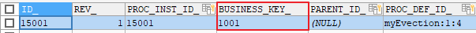

### 操作数据库表

启动流程实例，操作如下数据库表：

SELECT * FROM act_ru_execution #流程实例执行表，记录当前流程实例的执行情况


说明：

流程实例执行，如果当前只有一个分支时，一个流程实例只有一条记录且执行表的主键id和流程实例id相同，如果当前有多个分支正在运行则该执行表中有多条记录，存在执行表的主键和流程实例id不相同的记录。**不论当前有几个分支总会有一条记录的执行表的主键和流程实例**id**相同** 

一个流程实例运行完成，此表中与流程实例相关的记录删除。

SELECT * FROM act_ru_task #任务执行表，记录当前执行的任务


说明：启动流程实例，流程当前执行到第一个任务结点，此表会插入一条记录表示当前任务的执行情况，如果任务完成则记录删除。

SELECT * FROM act_ru_identitylink #任务参与者，记录当前参与任务的用户或组

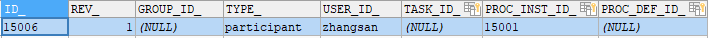

 

SELECT * FROM act_hi_procinst #流程实例历史表


流程实例启动，会在此表插入一条记录，流程实例运行完成记录也不会删除。

 SELECT * FROM act_hi_taskinst  #任务历史表，记录所有任务


开始一个任务，不仅在act_ru_task表插入记录，也会在历史任务表插入一条记录，任务历史表的主键就是任务id，任务完成此表记录不删除。

 SELECT * FROM act_hi_actinst  #活动历史表，记录所有活动


 

活动包括任务，所以此表中不仅记录了任务，还记录了流程执行过程的其它活动，比如开始事件、结束事件。

### 查询流程实例

流程在运行过程中可以查询流程实例的状态，当前运行结点等信息。

```java
@Test
	public void queryProcessInstance() {
		// 流程定义key
		String processDefinitionKey = "evection";
        ProcessEngine processEngine = ProcessEngines.getDefaultProcessEngine();
		// 获取RunTimeService
		RuntimeService runtimeService = processEngine.getRuntimeService();
		List<ProcessInstance> list = runtimeService
				.createProcessInstanceQuery()
				.processDefinitionKey(processDefinitionKey)//
				.list();

		for (ProcessInstance processInstance : list) {
			System.out.println("----------------------------");
			System.out.println("流程实例id："
					+ processInstance.getProcessInstanceId());
			System.out.println("所属流程定义id："
					+ processInstance.getProcessDefinitionId());
			System.out.println("是否执行完成：" + processInstance.isEnded());
			System.out.println("是否暂停：" + processInstance.isSuspended());
			System.out.println("当前活动标识：" + processInstance.getActivityId());
		}
	}

```


#### 关联BusinessKey

需求：

在activiti实际应用时，查询流程实例列表时可能要显示出业务系统的一些相关信息，比如：查询当前运行的出差流程列表需要将出差单名称、出差天数等信息显示出来，出差天数等信息在业务系统中存在，而并没有在activiti数据库中存在，所以是无法通过activiti的api查询到出差天数等信息。

 

实现：

在查询流程实例时，通过businessKey（业务标识 ）关联查询业务系统的出差单表，查询出出差天数等信息。

通过下面的代码就可以获取activiti中所对应实例保存的业务Key。而这个业务Key一般都会保存相关联的业务操作表的主键，再通过主键ID去查询业务信息，比如通过出差单的ID，去查询更多的请假信息（出差人，出差时间，出差天数，出差目的地等）

String businessKey = processInstance.getBusinessKey();

 

在activiti的act_ru_execution表，字段BUSINESS_KEY就是存放业务KEY的。


### 挂起、激活流程实例

某些情况可能由于流程变更需要将当前运行的流程暂停而不是直接删除，流程暂停后将不会继续执行。

#### 全部流程实例挂起

操作流程定义为挂起状态，该流程定义下边所有的流程实例全部暂停：

流程定义为挂起状态该流程定义将不允许启动新的流程实例，同时该流程定义下所有的流程实例将全部挂起暂停执行。

```java
/**
     * 全部流程实例挂起与激活
     */
    public void suspendAllProcessInstance() {
        // 1、获取 ProcessEngines
        // 2、获取 repositoryService
        RepositoryService repositoryService = ProcessEngines.getDefaultProcessEngine()
                .getRepositoryService();
        // 3、查询流程定义，获取流程定义的查询对象
        // 4、获取流程定义的key，查询流程定义
        List<ProcessDefinition> myEvection = repositoryService.createProcessDefinitionQuery()
                .processDefinitionKey("myEvection")
                .list();
        // 5、获取流程定义的部署id
        for (ProcessDefinition processDefinition : myEvection) {
            // 是否是暂停状态
            String processDefinitionId = processDefinition.getId();
            if (processDefinition.isSuspended()) {
            // 如果是暂停，可以执行激活操作 ,参数1 ：流程定义id ，参数2：是否激活，参数3：激活时间
                repositoryService.activateProcessDefinitionById(processDefinitionId,
                        true,
                        null
                );
                System.out.println("流程定义：" + processDefinitionId + ",已激活");
            } else {
            // 如果是激活状态，可以暂停，参数1 ：流程定义id ，参数2：是否暂停，参数3：暂停时间
                repositoryService.suspendProcessDefinitionById(processDefinitionId,
                        true,
                        null);
                System.out.println("流程定义：" + processDefinitionId + ",已挂起");
            }

            // 6、挂起流程定义
            //repositoryService.suspendProcessDefinitionById(processDefinition.getId());
            // 7、激活流程定义
            //repositoryService.activateProcessDefinitionById(processDefinition.getId());
        }
    }
```


#### 单个流程实例挂起

操作流程实例对象，针对单个流程执行挂起操作，某个流程实例挂起则此流程不再继续执行，完成该流程实例的当前任务将报异常。

```java
/**
     * 单个流程实例挂起与激活
     */
    @Test
    public void SuspendSingleProcessInstance(){
//        获取processEngine
        ProcessEngine processEngine = ProcessEngines.getDefaultProcessEngine();
//        RuntimeService
        RuntimeService runtimeService = processEngine.getRuntimeService();
//        查询流程定义的对象
        ProcessInstance processInstance = runtimeService.
                createProcessInstanceQuery().
                processInstanceId("15001").
                singleResult();
//        得到当前流程定义的实例是否都为暂停状态
        boolean suspended = processInstance.isSuspended();
//        流程定义id
        String processDefinitionId = processInstance.getId();
//        判断是否为暂停
        if(suspended){
//         如果是暂停，可以执行激活操作 ,参数：流程定义id
            runtimeService.activateProcessInstanceById(processDefinitionId);
            System.out.println("流程定义："+processDefinitionId+",已激活");
        }else{
//          如果是激活状态，可以暂停，参数：流程定义id
            runtimeService.suspendProcessInstanceById( processDefinitionId);
            System.out.println("流程定义："+processDefinitionId+",已挂起");
        }

    }

    /**
     * 测试完成个人任务
     */
    @Test
    public void completTask(){
//        获取引擎
        ProcessEngine processEngine = ProcessEngines.getDefaultProcessEngine();
//        获取操作任务的服务 TaskService
        TaskService taskService = processEngine.getTaskService();
//        完成任务,参数：流程实例id,完成zhangsan的任务
        Task task = taskService.createTaskQuery()
                .processInstanceId("15001")
                .taskAssignee("rose")
                .singleResult();


        System.out.println("流程实例id="+task.getProcessInstanceId());
        System.out.println("任务Id="+task.getId());
        System.out.println("任务负责人="+task.getAssignee());
        System.out.println("任务名称="+task.getName());
        taskService.complete(task.getId());
    }
```


## 二、个人任务

### 2.1、分配任务负责人

#### 2.1.1、固定分配

在进行业务流程建模时指定固定的任务负责人， 如图：


并在 properties 视图中，填写 Assignee 项为任务负责人。 

#### 2.1.2、表达式分配

由于固定分配方式，任务只管一步一步执行任务，执行到每一个任务将按照 bpmn 的配置去分配任
务负责人。 

##### 2.1.2.1、UEL 表达式 

Activiti 使用 UEL 表达式， UEL 是 java EE6 规范的一部分， UEL（Unified Expression Language）即 统一表达式语言， activiti 支持两个 UEL 表达式： UEL-value 和 UEL-method。 

###### 1）UEL-value 定义

如图： 


assignee 这个变量是 activiti 的一个流程变量，

或者使用这种方式定义：

如图：


 user 也是 activiti 的一个流程变量， user.assignee 表示通过调用 user 的 getter 方法获取值。 

###### 2）UEL-method 方式

如图： 


userBean 是 spring 容器中的一个 bean，表示调用该 bean 的 getUserId()方法。 

###### 3）UEL-method 与 UEL-value 结合 

再比如：
${ldapService.findManagerForEmployee(emp)}
ldapService 是 spring 容器的一个 bean，findManagerForEmployee 是该 bean 的一个方法，emp 是 activiti
流程变量， emp 作为参数传到 ldapService.findManagerForEmployee 方法中。 

###### 4）其它

表达式支持解析基础类型、 bean、 list、 array 和 map，也可作为条件判断。
如下：
${order.price > 100 && order.price < 250} 


##### 2.1.2.2、编写代码配置负责人 

###### 1)定义任务分配流程变量 

如图：


###### 2)设置流程变量 

在启动流程实例时设置流程变量，如下： 

```java
 /**
     * 设置流程负责人
     */
    @Test
    public void assigneeUEL(){
//      获取流程引擎
        ProcessEngine processEngine = ProcessEngines.getDefaultProcessEngine();
//        获取 RuntimeService
        RuntimeService runtimeService = processEngine.getRuntimeService();
//        设置assignee的取值，用户可以在界面上设置流程的执行
        Map<String,Object> assigneeMap = new HashMap<>();
        assigneeMap.put("assignee0","张三");
        assigneeMap.put("assignee1","李经理");
        assigneeMap.put("assignee2","王总经理");
        assigneeMap.put("assignee3","赵财务");
//        启动流程实例，同时还要设置流程定义的assignee的值
        runtimeService.startProcessInstanceByKey("myEvection1",assigneeMap);
//       输出
        System.out.println(processEngine.getName());
    }
```

执行成功后，可以在act_ru_variable表中看到刚才map中的数据

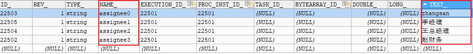

##### 2.1.2.3、注意事项 

由于使用了表达式分配，必须保证在任务执行过程表达式执行成功，比如：
某个任务使用了表达式${order.price > 100 && order.price < 250}，当执行该任务时必须保证 order 在
流程变量中存在，否则 activiti 异常。 

#### 2.1.3、监听器分配

可以使用监听器来完成很多Activiti流程的业务。

在本章我们使用监听器的方式来指定负责人，那么在流程设计时就不需要指定assignee。

任务监听器是发生对应的任务相关事件时执行自定义 java 逻辑 或表达式。
任务相当事件包括：  


Event的选项包含：

```
Create：任务创建后触发
Assignment：任务分配后触发
Delete：任务完成后触发
All：所有事件发生都触发
```

定义任务监听类，且类必须实现 org.activiti.engine.delegate.TaskListener 接口 

```java
public class MyTaskListener implements TaskListener {
    @Override
    public void notify(DelegateTask delegateTask) {
        if(delegateTask.getName().equals("创建出差申请")&&
                delegateTask.getEventName().equals("create")){
            //这里指定任务负责人
            delegateTask.setAssignee("张三");
        }
    }
} 
```

DelegateTask对象的内容如下：

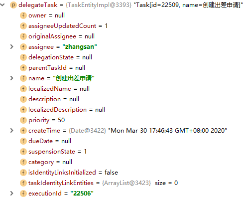

##### 2.1.3.1、注意事项 

使用监听器分配方式，按照监听事件去执行监听类的 notify 方法，方法如果不能正常执行也会影响
任务的执行。 

### 2.2、查询任务

#### 查询任务负责人的待办任务 

代码如下：

```java
// 查询当前个人待执行的任务
@Test
public void findPersonalTaskList() {
    // 流程定义key
    String processDefinitionKey = "myEvection1";
    // 任务负责人
    String assignee = "张三";
    // 获取TaskService
    TaskService taskService = processEngine.getTaskService();
    List<Task> taskList = taskService.createTaskQuery()
    	.processDefinitionKey(processDefinitionKey)
    	.includeProcessVariables()
        .taskAssignee(assignee)
        .list();
    for (Task task : taskList) {
        System.out.println("----------------------------");
        System.out.println("流程实例id： " + task.getProcessInstanceId());
        System.out.println("任务id： " + task.getId());
        System.out.println("任务负责人： " + task.getAssignee());
        System.out.println("任务名称： " + task.getName());
    }
}
```

#### 关联 businessKey 

需求：
在 activiti 实际应用时，查询待办任务可能要显示出业务系统的一些相关信息。

比如：查询待审批出差任务列表需要将出差单的日期、 出差天数等信息显示出来。

出差天数等信息在业务系统中存在，而并没有在 activiti 数据库中存在，所以是无法通过 activiti 的 api 查询到出差天数等信息。
实现：
在查询待办任务时，通过 businessKey（业务标识 ）关联查询业务系统的出差单表，查询出出差天数等信息。 

```java
@Test
    public void findProcessInstance(){
//        获取processEngine
        ProcessEngine processEngine = ProcessEngines.getDefaultProcessEngine();
//        获取TaskService
        TaskService taskService = processEngine.getTaskService();
//        获取RuntimeService
        RuntimeService runtimeService = processEngine.getRuntimeService();
//        查询流程定义的对象
        Task task = taskService.createTaskQuery()
                .processDefinitionKey("myEvection1")
                .taskAssignee("张三")
                .singleResult();
//        使用task对象获取实例id
        String processInstanceId = task.getProcessInstanceId();
//          使用实例id，获取流程实例对象
        ProcessInstance processInstance = runtimeService.createProcessInstanceQuery()
                .processInstanceId(processInstanceId)
                .singleResult();
//        使用processInstance，得到 businessKey
        String businessKey = processInstance.getBusinessKey();

        System.out.println("businessKey=="+businessKey);

    }
```


### 2.3、办理任务

注意：在实际应用中，完成任务前需要校验任务的负责人是否具有该任务的办理权限 。

```java
/**
     * 完成任务，判断当前用户是否有权限
     */
    @Test
    public void completTask() {
        //任务id
        String taskId = "15005";
//        任务负责人
        String assingee = "张三";
        //获取processEngine
        ProcessEngine processEngine = ProcessEngines.getDefaultProcessEngine();
        // 创建TaskService
        TaskService taskService = processEngine.getTaskService();
//        完成任务前，需要校验该负责人可以完成当前任务
//        校验方法：
//        根据任务id和任务负责人查询当前任务，如果查到该用户有权限，就完成
        Task task = taskService.createTaskQuery()
                .taskId(taskId)
                .taskAssignee(assingee)
                .singleResult();
        if(task != null){
            taskService.complete(taskId);
            System.out.println("完成任务");
        }
    }
```


## 三、流程变量

### 3.1、什么是流程变量 

流程变量在 activiti 中是一个非常重要的角色，流程运转有时需要靠流程变量，业务系统和 activiti
结合时少不了流程变量，流程变量就是 activiti 在管理工作流时根据管理需要而设置的变量。
比如：在出差申请流程流转时如果出差天数大于 3 天则由总经理审核，否则由人事直接审核， 出差天
数就可以设置为流程变量，在流程流转时使用。 

**注意：虽然流程变量中可以存储业务数据可以通过activiti的api查询流程变量从而实现 查询业务数据，但是不建议这样使用，因为业务数据查询由业务系统负责，activiti设置流程变量是为了流程执行需要而创建。**

### 3.2、流程变量类型 

如果将 pojo 存储到流程变量中，必须实现序列化接口 serializable，为了防止由于新增字段无
法反序列化，需要生成 serialVersionUID。 


### 3.3、流程变量作用域 

流程变量的作用域可以是一个流程实例(processInstance)，或一个任务(task)，或一个执行实例
(execution)

#### 3.3.1、globa变量

流程变量的默认作用域是流程实例。当一个流程变量的作用域为流程实例时，可以称为 global 变量

注意：

如：    Global变量：userId（变量名）、zhangsan（变量值）

global 变量中变量名不允许重复，设置相同名称的变量，后设置的值会覆盖前设置的变量值。

#### 3.3.2、local变量

任务和执行实例仅仅是针对一个任务和一个执行实例范围，范围没有流程实例大， 称为 local 变量。

Local 变量由于在不同的任务或不同的执行实例中，作用域互不影响，变量名可以相同没有影响。Local 变量名也可以和 global 变量名相同，没有影响。 

### 3.4、流程变量的使用方法 

#### 3.4.1、在属性上使用UEL表达式

可以在 assignee 处设置 UEL 表达式，表达式的值为任务的负责人，比如： ${assignee}， assignee 就是一个流程变量名称。

Activiti获取UEL表达式的值，即流程变量assignee的值 ，将assignee的值作为任务的负责人进行任务分配

#### 3.4.2、在连线上使用UEL表达式

可以在连线上设置UEL表达式，决定流程走向。

比如：${price<10000} 。price就是一个流程变量名称，uel表达式结果类型为布尔类型。

如果UEL表达式是true，要决定 流程执行走向。

### 3.5、使用Global变量控制流程

#### 3.5.1、需求

员工创建出差申请单，由部门经理审核，部门经理审核通过后出差3天及以下由人财务直接审批，3天以上先由总经理审核，总经理审核通过再由财务审批。


#### 3.5.2、流程定义

1）、出差天数大于等于3连线条件

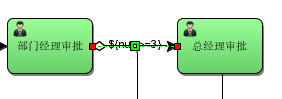

也可以使用对象参数命名，如evection.num：


2）、出差天数小于3连线条件


也可以使用对象参数命名，如：


#### 3.5.3、设置global流程变量

在部门经理审核前设置流程变量，变量值为出差单信息（包括出差天数），部门经理审核后可以根据流程变量的值决定流程走向。

在设置流程变量时，可以在启动流程时设置，也可以在任务办理时设置

##### 3.5.3.1、创建POJO对象

创建出差申请pojo对象

```java
package com.itheima.demo.pojo;

import java.io.Serializable;
import java.util.Date;

/**
 * 出差申请 pojo
 */
public class Evection implements Serializable {
    /**
     * 主键id
     */
    private Long id;
    /**
     * 出差申请单名称
     */
    private String evectionName;
    /**
     * 出差天数
     */
    private Double num;
    /**
     * 预计开始时间
     */
    private Date beginDate;
    /**
     * 预计结束时间
     */
    private Date endDate;
    /**
     * 目的地
     */
    private String destination;
    /**
     * 出差事由
     */
    private String reson;

    public Long getId() {
        return id;
    }

    public void setId(Long id) {
        this.id = id;
    }

    public String getEvectionName() {
        return evectionName;
    }

    public void setEvectionName(String evectionName) {
        this.evectionName = evectionName;
    }

    public Date getBeginDate() {
        return beginDate;
    }

    public void setBeginDate(Date beginDate) {
        this.beginDate = beginDate;
    }

    public Date getEndDate() {
        return endDate;
    }

    public void setEndDate(Date endDate) {
        this.endDate = endDate;
    }

    public String getDestination() {
        return destination;
    }

    public void setDestination(String destination) {
        this.destination = destination;
    }

    public String getReson() {
        return reson;
    }

    public void setReson(String reson) {
        this.reson = reson;
    }

    public Double getNum() {
        return num;
    }

    public void setNum(Double num) {
        this.num = num;
    }
}

```

##### 3.5.3.2、启动流程时设置变量

在启动流程时设置流程变量，变量的作用域是整个流程实例。

通过Map<key,value>设置流程变量，map中可以设置多个变量，这个key就是流程变量的名字。

```java
    /**
     * 启动流程实例,设置流程变量的值
     */
    @Test
    public void startProcess(){
//        获取流程引擎
        ProcessEngine processEngine = ProcessEngines.getDefaultProcessEngine();
//        获取RunTimeService
        RuntimeService runtimeService = processEngine.getRuntimeService();
//        流程定义key
        String key = "myEvection2";
//       创建变量集合
        Map<String, Object> map = new HashMap<>();
//        创建出差pojo对象
        Evection evection = new Evection();
//        设置出差天数
        evection.setNum(2d);
//      定义流程变量，把出差pojo对象放入map
        map.put("evection",evection);
//      设置assignee的取值，用户可以在界面上设置流程的执行
        map.put("assignee0","张三");
        map.put("assignee1","李经理");
        map.put("assignee2","王总经理");
        map.put("assignee3","赵财务");
//        启动流程实例，并设置流程变量的值（把map传入）
        ProcessInstance processInstance = runtimeService
                .startProcessInstanceByKey(key, map);
//      输出
        System.out.println("流程实例名称="+processInstance.getName());
        System.out.println("流程定义id=="+processInstance.getProcessDefinitionId());

    }
    /**
     * 完成任务，判断当前用户是否有权限
     */
    @Test
    public void completTask() {
        //任务id
        String key = "myEvection2";
//        任务负责人
        String assingee = "张三";
        //获取processEngine
        ProcessEngine processEngine = ProcessEngines.getDefaultProcessEngine();
        // 创建TaskService
        TaskService taskService = processEngine.getTaskService();
//        完成任务前，需要校验该负责人可以完成当前任务
//        校验方法：
//        根据任务id和任务负责人查询当前任务，如果查到该用户有权限，就完成
        Task task = taskService.createTaskQuery()
                .processDefinitionKey(key)
                .taskAssignee(assingee)
                .singleResult();
        if(task != null){
            taskService.complete(task.getId());
            System.out.println("任务执行完成");
        }
    }

	@Test
    public void completeTask() {
        TaskService taskService = ProcessEngines.getDefaultProcessEngine()
                .getTaskService();
        Task task;
        while ((task = taskService.createTaskQuery()
                .processDefinitionKey("evection_global")
                .singleResult()) != null) {
            //System.out.println(task.getId());
            System.out.println("taskName: "+task.getName());
            taskService.complete(task.getId());
        }
    }
```

说明：

startProcessInstanceByKey(processDefinitionKey, variables)

流程变量作用域是一个流程实例，流程变量使用Map存储，同一个流程实例设置变量map中key相同，后者覆盖前者。

##### 3.5.3.2、任务办理时设置变量

在完成任务时设置流程变量，该流程变量只有在该任务完成后其它结点才可使用该变量，它的作用域是整个流程实例，如果设置的流程变量的key在流程实例中已存在相同的名字则后设置的变量替换前边设置的变量。

这里需要在创建出差单任务完成时设置流程变量

```java
    /**
     * 完成任务，判断当前用户是否有权限
     */
    @Test
    public void completTask() {
        //任务id
        String key = "myEvection2";
//        任务负责人
        String assingee = "张三";
//       获取processEngine
        ProcessEngine processEngine = ProcessEngines.getDefaultProcessEngine();
//       创建TaskService
        TaskService taskService = processEngine.getTaskService();
//       创建变量集合
        Map<String, Object> map = new HashMap<>();
//        创建出差pojo对象
        Evection evection = new Evection();
//        设置出差天数
        evection.setNum(2d);
//      定义流程变量
        map.put("evection",evection);
//        完成任务前，需要校验该负责人可以完成当前任务
//        校验方法：
//        根据任务id和任务负责人查询当前任务，如果查到该用户有权限，就完成
        Task task = taskService.createTaskQuery()
                .processDefinitionKey(key)
                .taskAssignee(assingee)
                .singleResult();
        if(task != null){
            //完成任务是，设置流程变量的值
            taskService.complete(task.getId(),map);
            System.out.println("任务执行完成");
        }
    }
```

说明：

通过当前任务设置流程变量，需要指定当前任务id，如果当前执行的任务id不存在则抛出异常。

任务办理时也是通过map<key,value>设置流程变量，一次可以设置多个变量。

##### 3.5.3.3、通过当前流程实例设置

通过流程实例id设置全局变量，该流程实例必须未执行完成。

```java
    @Test
    public void setGlobalVariableByExecutionId(){
//    当前流程实例执行 id，通常设置为当前执行的流程实例
        String executionId="2601";
//     获取processEngine
        ProcessEngine processEngine = ProcessEngines.getDefaultProcessEngine();
//        获取RuntimeService
        RuntimeService runtimeService = processEngine.getRuntimeService();
//        创建出差pojo对象
        Evection evection = new Evection();
//        设置天数
        evection.setNum(3d);
//      通过流程实例 id设置流程变量
        runtimeService.setVariable(executionId, "evection", evection);
//      一次设置多个值
//      runtimeService.setVariables(executionId, variables)
    }

```

注意：

executionId必须当前未结束 流程实例的执行id，通常此id设置流程实例 的id。也可以通runtimeService.getVariable()获取流程变量。

##### 3.5.3.4、通过当前任务设置

```java
@Test
	public void setGlobalVariableByTaskId(){
		
		//当前待办任务id
		String taskId="1404";
//     获取processEngine
        ProcessEngine processEngine = ProcessEngines.getDefaultProcessEngine();
		TaskService taskService = processEngine.getTaskService();
		Evection evection = new Evection();
		evection.setNum(3);
		//通过任务设置流程变量
		taskService.setVariable(taskId, "evection", evection);
		//一次设置多个值 
		//taskService.setVariables(taskId, variables)
	}

```

注意：

任务id必须是当前待办任务id，act_ru_task中存在。如果该任务已结束，会报错

也可以通过taskService.getVariable()获取流程变量。

#### 3.5.4、测试

正常测试：

​       设置流程变量的值大于等于3天

​       设计流程变量的值小于3天

异常测试：

​       流程变量不存在

​       流程变量的值为空NULL，price属性为空

​       UEL表达式都不符合条件  

​      不设置连线的条件

#### 3.5.5、注意事项

1、  如果UEL表达式中流程变量名不存在则报错。

2、  如果UEL表达式中流程变量值为空NULL，流程不按UEL表达式去执行，而流程结束 。

3、  如果UEL表达式都不符合条件，流程结束 

4、  如果连线不设置条件，会走flow序号小的那条线

#### 3.5.6、操作数据库表

设置流程变量会在当前执行流程变量表插入记录，同时也会在历史流程变量表也插入记录。

 ```sql
//当前流程变量表
SELECT * FROM act_ru_variable 
 ```

记录当前运行流程实例可使用的流程变量，包括 global和local变量

Id_：主键

Type_：变量类型

Name_：变量名称 

Execution_id_：所属流程实例执行id，global和local变量都存储

Proc_inst_id_：所属流程实例id，global和local变量都存储 

Task_id_：所属任务id，local变量存储

Bytearray_：serializable类型变量存储对应act_ge_bytearray表的id

Double_：double类型变量值

Long_：long类型变量值

Text_：text类型变量值 

```sql
 #历史流程变量表
SELECT * FROM act_hi_varinst 
```

记录所有已创建的流程变量，包括 global和local变量

字段意义参考当前流程变量表。

### 3.6、设置local流程变量

#### 3.6.1、任务办理时设置

 任务办理时设置local流程变量，当前运行的流程实例只能在该任务结束前使用，任务结束该变量无法在当前流程实例使用，可以通过查询历史任务查询。

```java
/*
*处理任务时设置local流程变量
*/
@Test
public void completTask() {
   //任务id
   String taskId = "1404";
//  获取processEngine
    ProcessEngine processEngine = ProcessEngines.getDefaultProcessEngine();
    TaskService taskService = processEngine.getTaskService();
//  定义流程变量
   Map<String, Object> variables = new HashMap<String, Object>();
   Evection evection = new Evection ();
   evection.setNum(3d);
// 定义流程变量
   Map<String, Object> variables = new HashMap<String, Object>();
//  变量名是holiday，变量值是holiday对象
    variables.put("evection", evection);
//  设置local变量，作用域为该任务
    taskService.setVariablesLocal(taskId, variables);
//  完成任务
   taskService.complete(taskId);
}
```


​       说明：

设置作用域为任务的local变量，每个任务可以设置同名的变量，互不影响。

#### 3.6.2、通过当前任务设置

```java
@Test
public void setLocalVariableByTaskId(){
//   当前待办任务id
    String taskId="1404";
//  获取processEngine
    ProcessEngine processEngine = ProcessEngines.getDefaultProcessEngine();
    TaskService taskService = processEngine.getTaskService();
    Evection evection = new Evection ();
    evection.setNum(3d);
//  通过任务设置流程变量
    taskService.setVariableLocal(taskId, "evection", evection);
//  一次设置多个值 
    //taskService.setVariablesLocal(taskId, variables)
}
```

注意：

任务id必须是当前待办任务id，act_ru_task中存在。

#### 3.6.3、  Local变量测试1

如果上边例子中设置global变量改为设置local变量是否可行？为什么？

 Local变量在任务结束后无法在当前流程实例执行中使用，如果后续的流程执行需要用到此变量则会报错。

####  3.6.4、  Local变量测试2

在部门经理审核、总经理审核、财务审核时设置local变量，可通过historyService查询每个历史任务时将流程变量的值也查询出来。

 代码如下：

```java
// 创建历史任务查询对象
      HistoricTaskInstanceQuery historicTaskInstanceQuery = historyService.createHistoricTaskInstanceQuery();
      // 查询结果包括 local变量
      historicTaskInstanceQuery.includeTaskLocalVariables();
for (HistoricTaskInstance historicTaskInstance : list) {
         System.out.println("==============================");
         System.out.println("任务id：" + historicTaskInstance.getId());
         System.out.println("任务名称：" + historicTaskInstance.getName());
         System.out.println("任务负责人：" + historicTaskInstance.getAssignee());
     System.out.println("任务local变量："+ historicTaskInstance.getTaskLocalVariables());

}
```

注意：查询历史流程变量，特别是查询pojo变量需要经过反序列化，不推荐使用。

## 四、组任务

### 4.1、需求

在流程定义中在任务结点的 assignee 固定设置任务负责人，在流程定义时将参与者固定设置在.bpmn 文件中，如果临时任务负责人变更则需要修改流程定义，系统可扩展性差。

针对这种情况可以给任务设置多个候选人，可以从候选人中选择参与者来完成任务。 

### 4.2、设置任务候选人

在流程图中任务节点的配置中设置 candidate-users(候选人)，多个候选人之间用逗号分开。 

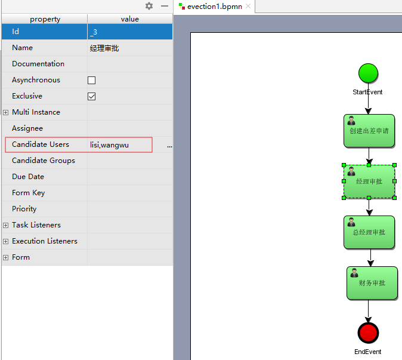

查看bpmn文件

```xml
<userTask activiti:candidateUsers="lisi,wangwu" activiti:exclusive="true" id="_3" name="经理审批"/>
```

我们可以看到部门经理的审核人已经设置为 lisi,wangwu 这样的一组候选人，可以使用

activiti:candiateUsers=”用户 1,用户 2,用户 3”的这种方式来实现设置一组候选人 

### 4.3、组任务

#### 4.3.1、组任务办理流程

#####  a、查询组任务

指定候选人，查询该候选人当前的待办任务。

候选人不能立即办理任务。

#####  b、拾取(claim)任务

该组任务的所有候选人都能拾取。

将候选人的组任务，变成个人任务。原来候选人就变成了该任务的负责人。

如果拾取后不想办理该任务？

   需要将已经拾取的个人任务归还到组里边，将个人任务变成了组任务。

##### c、查询个人任务

查询方式同个人任务部分，根据assignee查询用户负责的个人任务。

#####  d、办理个人任务

#### 4.3.2、  查询组任务

 根据候选人查询组任务

 ```java
@Test
    public void findGroupTaskList() {
       // 流程定义key
       String processDefinitionKey = "evection3";
       // 任务候选人
       String candidateUser = "lisi";
        //  获取processEngine
       ProcessEngine processEngine = ProcessEngines.getDefaultProcessEngine();
       // 创建TaskService
       TaskService taskService = processEngine.getTaskService();
       //查询组任务
       List<Task> list = taskService.createTaskQuery()
              .processDefinitionKey(processDefinitionKey)
              .taskCandidateUser(candidateUser)//根据候选人查询
              .list();
       for (Task task : list) {
           System.out.println("----------------------------");
           System.out.println("流程实例id：" + task.getProcessInstanceId());
           System.out.println("任务id：" + task.getId());
           System.out.println("任务负责人：" + task.getAssignee());
           System.out.println("任务名称：" + task.getName());
       }
    }
 ```


#### 4.3.3 、 拾取组任务

 候选人员拾取组任务后该任务变为自己的个人任务。

 ```java
@Test
    public void claimTask(){
         //  获取processEngine
       ProcessEngine processEngine = ProcessEngines.getDefaultProcessEngine();
       TaskService taskService = processEngine.getTaskService();
       //要拾取的任务id
       String taskId = "6302";
       //任务候选人id
       String userId = "lisi";
       //拾取任务
       //即使该用户不是候选人也能拾取(建议拾取时校验是否有资格)    
       //校验该用户有没有拾取任务的资格
       Task task = taskService.createTaskQuery()
              .taskId(taskId)
              .taskCandidateUser(userId)//根据候选人查询
              .singleResult();
       if(task!=null){
         //拾取任务
           taskService.claim(taskId, userId);
           System.out.println("任务拾取成功");
       }
    }
 ```

说明：即使该用户不是候选人也能拾取，建议拾取时校验是否有资格

组任务拾取后，该任务已有负责人，通过候选人将查询不到该任务

####  4.3.4、  查询个人待办任务

 查询方式同个人任务查询

 ```java
@Test
public void findPersonalTaskList() {
    // 流程定义key
    String processDefinitionKey = "evection1";
    // 任务负责人
    String assignee = "zhangsan";
     //  获取processEngine
       ProcessEngine processEngine = ProcessEngines.getDefaultProcessEngine();
    // 创建TaskService
    TaskService taskService = processEngine.getTaskService();
    List<Task> list = taskService.createTaskQuery()
        .processDefinitionKey(processDefinitionKey)
        .taskAssignee(assignee)
        .list();
    for (Task task : list) {
        System.out.println("----------------------------");
        System.out.println("流程实例id：" + task.getProcessInstanceId());
        System.out.println("任务id：" + task.getId());
        System.out.println("任务负责人：" + task.getAssignee());
        System.out.println("任务名称：" + task.getName());
    }
}
 ```

#### 4.3.5、  办理个人任务

同个人任务办理

```java
 /*完成任务*/
   @Test
   public void completeTask(){
//     任务ID
      String taskId = "12304";
//     获取processEngine
      ProcessEngine processEngine = ProcessEngines.getDefaultProcessEngine();
      processEngine.getTaskService()
                   .complete(taskId);
      System.out.println("完成任务："+taskId);
   }
```

说明：建议完成任务前校验该用户是否是该任务的负责人。

#### 4.3.6、  归还组任务

 如果个人不想办理该组任务，可以归还组任务，归还后该用户不再是该任务的负责人

```java
/*
*归还组任务，由个人任务变为组任务，还可以进行任务交接
*/
@Test
public void setAssigneeToGroupTask() {
    //  获取processEngine
       ProcessEngine processEngine = ProcessEngines.getDefaultProcessEngine();
   // 查询任务使用TaskService
   TaskService taskService = processEngine.getTaskService();
   // 当前待办任务
   String taskId = "6004";
   // 任务负责人
   String userId = "zhangsan2";
    // 校验userId是否是taskId的负责人，如果是负责人才可以归还组任务
   Task task = taskService
       .createTaskQuery()
       .taskId(taskId)
       .taskAssignee(userId)
       .singleResult();
    if (task != null) {
       // 如果设置为null，归还组任务,该 任务没有负责人
       taskService.setAssignee(taskId, null);
    }
}
```

 说明：建议归还任务前校验该用户是否是该任务的负责人

也可以通过setAssignee方法将任务委托给其它用户负责，注意被委托的用户可以不是候选人（建议不要这样使用）

#### 4.3.7、  任务交接

任务交接,任务负责人将任务交给其它候选人办理该任务

 ```java
@Test
    public void setAssigneeToCandidateUser() {
        //  获取processEngine
       ProcessEngine processEngine = ProcessEngines.getDefaultProcessEngine();
       // 查询任务使用TaskService
       TaskService taskService = processEngine.getTaskService();
       // 当前待办任务
       String taskId = "6004";
       // 任务负责人
       String userId = "zhangsan2";
// 将此任务交给其它候选人办理该 任务
           String candidateuser = "zhangsan";
       // 校验userId是否是taskId的负责人，如果是负责人才可以归还组任务
       Task task = taskService
           .createTaskQuery()
           .taskId(taskId)
           .taskAssignee(userId)
           .singleResult();
       if (task != null) {
           taskService.setAssignee(taskId, candidateuser);
       }
    }
 ```


#### 4.3.8、  数据库表操作

查询当前任务执行表

```sql
SELECT * FROM act_ru_task 
```

任务执行表，记录当前执行的任务，由于该任务当前是组任务，所有assignee为空，当拾取任务后该字段就是拾取用户的id

查询任务参与者

```sql
SELECT * FROM act_ru_identitylink
```

 任务参与者，记录当前参考任务用户或组，当前任务如果设置了候选人，会向该表插入候选人记录，有几个候选就插入几个

与act_ru_identitylink对应的还有一张历史表act_hi_identitylink，向act_ru_identitylink插入记录的同时也会向历史表插入记录。任务完成

## 五、网关

网关用来控制流程的流向

### 5.1 排他网关ExclusiveGateway

#### 5.1.1  什么是排他网关：

排他网关，用来在流程中实现决策。 当流程执行到这个网关，所有分支都会判断条件是否为true，如果为true则执行该分支，

**注意**：排他网关只会选择一个为true的分支执行。如果有两个分支条件都为true，排他网关会选择id值较小的一条分支去执行。

为什么要用排他网关？

不用排他网关也可以实现分支，如：在连线的condition条件上设置分支条件。

在连线设置condition条件的缺点：如果条件都不满足，流程就结束了(是异常结束)。

如果 使用排他网关决定分支的走向，如下：


 

如果从网关出去的线所有条件都不满足则系统抛出异常。

```java
org.activiti.engine.ActivitiException: No outgoing sequence flow of the exclusive gateway 'exclusivegateway1' could be selected for continuing the process
   at org.activiti.engine.impl.bpmn.behavior.ExclusiveGatewayActivityBehavior.leave(ExclusiveGatewayActivityBehavior.java:85)

```


#### 5.1.2  流程定义

 排他网关图标，红框内：


 

#### 5.1.3  测试

在部门经理审核后，走排他网关，从排他网关出来的分支有两条，一条是判断出差天数是否大于3天，另一条是判断出差天数是否小于等于3天。

设置分支条件时，如果所有分支条件都不是true，报错：

```java
org.activiti.engine.ActivitiException: No outgoing sequence flow of the exclusive gateway 'exclusivegateway1' could be selected for continuing the process

       at org.activiti.engine.impl.bpmn.behavior.ExclusiveGatewayActivityBehavior.leave(ExclusiveGatewayActivityBehavior.java:85)

    
    
```

```java
public class TestExclusiveGateway {
    String key = "exclusiveGateway";
    /**
     * 部署流程
     */
    @Test
    public void deployment(){
        Deployment deploy = ProcessEngines.getDefaultProcessEngine()
                .getRepositoryService()
                .createDeployment()
                .name("排他网关测试")
                .addClasspathResource("bpmn/exclusiveGateway.bpmn20.xml")
                .addClasspathResource("png/exclusiveGateway.png")
                .disableSchemaValidation()
                .deploy();
        System.out.println("部署ID：" + deploy.getId());
        System.out.println("部署名称：" + deploy.getName());
    }
    /**
     * 启动流程
     */
    @Test
    public void startProcess(){
        ProcessInstance processInstance = ProcessEngines.getDefaultProcessEngine()
                .getRuntimeService()
                .startProcessInstanceByKey(key);
        System.out.println("流程实例ID：" + processInstance.getId());
        System.out.println("流程定义ID：" + processInstance.getProcessDefinitionId());
        System.out.println("流程名称: "+processInstance.getName());
    }

    /**
     * 完成任务
     */
    @Test
    public void complete(){
        Task task = findTask(key);
        String taskId = task.getId();
        HashMap<String, Object> map = new HashMap<>();
        Evection evection = new Evection();
        evection.setDays(3);
        map.put("evection",evection);
        ProcessEngines.getDefaultProcessEngine()
                .getTaskService()
                .complete(taskId,map);
    }
    @Test
    public void deleteDeployment(){
        // 根据key 得到部署id
        Deployment deployment = ProcessEngines.getDefaultProcessEngine()
                .getRepositoryService()
                .createDeploymentQuery()
                .processDefinitionKey(key)
                .singleResult();
        if (deployment!=null){
            ProcessEngines.getDefaultProcessEngine()
                    .getRepositoryService()
                    .deleteDeployment(deployment.getId(),true);
        }

    }
    public Task findTask(String key){
        return ProcessEngines.getDefaultProcessEngine()
                .getTaskService()
                .createTaskQuery()
                .processDefinitionKey(key)
                .singleResult();
    }

}
```


### 5.2 并行网关ParallelGateway

#### 5.2.1  什么是并行网关

并行网关允许将流程分成多条分支，也可以把多条分支汇聚到一起，并行网关的功能是基于进入和外出顺序流的：

l  fork分支：

 并行后的所有外出顺序流，为每个顺序流都创建一个并发分支。

l  join汇聚： 

所有到达并行网关，在此等待的进入分支， 直到所有进入顺序流的分支都到达以后， 流程就会通过汇聚网关。

注意，如果同一个并行网关有多个进入和多个外出顺序流， 它就同时具有分支和汇聚功能。 这时，网关会先汇聚所有进入的顺序流，然后再切分成多个并行分支。

**与其他网关的主要区别是，并行网关不会解析条件。** **即使顺序流中定义了条件，也会被忽略。**

例子：

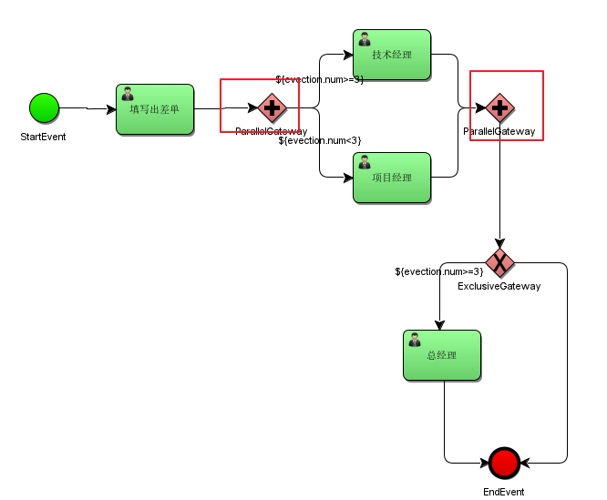

说明：

技术经理和项目经理是两个execution分支，在act_ru_execution表有两条记录分别是技术经理和项目经理，act_ru_execution还有一条记录表示该流程实例。

待技术经理和项目经理任务全部完成，在汇聚点汇聚，通过parallelGateway并行网关。

并行网关在业务应用中常用于会签任务，会签任务即多个参与者共同办理的任务。

#### 5.2.2  流程定义

并行网关图标，红框内：


 

#### 5.2.3  测试

```java
public class TestParallelGateway {
    String key = "parallelGateway";
    /**
     * 部署流程
     */
    @Test
    public void deployment(){
        Deployment deployment = ProcessEngines.getDefaultProcessEngine()
                .getRepositoryService()
                .createDeployment()
                .name("并行网关测试")
                .addClasspathResource("bpmn/parallelGateway.bpmn20.xml")
                .addClasspathResource("png/parallelGateway.png")
                .disableSchemaValidation()
                .deploy();
        System.out.println("部署ID：" + deployment.getId());
        System.out.println("部署名称：" + deployment.getName());
    }
    /**
     * 启动流程
     */
    @Test
    public void startProcess(){
        ProcessEngines.getDefaultProcessEngine()
                .getRuntimeService()
                .startProcessInstanceByKey("parallelGateway");
    }
    @Test
    public void completeTask(){
        List<Task> tasks = getTask(key);
        TaskService taskService = ProcessEngines.getDefaultProcessEngine()
                .getTaskService();
        for (Task task : tasks) {
            taskService.complete(task.getId());
        }
    }
    public List<Task> getTask(String key){
        return ProcessEngines.getDefaultProcessEngine()
                .getTaskService()
                .createTaskQuery()
                .processDefinitionKey(key)
                .list();
    }
}

```

当执行到并行网关数据库跟踪如下：

当前任务表：SELECT * FROM act_ru_task   


上图中：有两个任务当前执行。

查询流程实例执行表：SELECT * FROM act_ru_execution 


上图中，说明当前流程实例有多个分支(两个)在运行。

对并行任务的执行：

并行任务执行不分前后，由任务的负责人去执行即可。

执行技术经理任务后，查询当前任务表 SELECT * FROM act_ru_task   

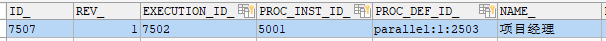

已完成的技术经理任务在当前任务表act_ru_task_已被删除。

在流程实例执行表：SELECT * FROM act_ru_execution有中多个分支存在且有并行网关的汇聚结点。


有并行网关的汇聚结点：说明有一个分支已经到汇聚，等待其它的分支到达。

当所有分支任务都完成，都到达汇聚结点后：

流程实例执行表：SELECT * FROM act_ru_execution，执行流程实例已经变为总经理审批，说明流程执行已经通过并行网关


总结：所有分支到达汇聚结点，并行网关执行完成。         

### 5.3    包含网关InclusiveGateway

#### 5.3.1  什么是包含网关

包含网关可以看做是排他网关和并行网关的结合体。 

和排他网关一样，你可以在外出顺序流上定义条件，包含网关会解析它们。 但是主要的区别是包含网关可以选择多于一条顺序流，这和并行网关一样。

包含网关的功能是基于进入和外出顺序流的：

l  分支： 

所有外出顺序流的条件都会被解析，结果为true的顺序流会以并行方式继续执行， 会为每个顺序流创建一个分支。

l  汇聚：

 所有并行分支到达包含网关，会进入等待状态， 直到每个包含流程token的进入顺序流的分支都到达。 这是与并行网关的最大不同。换句话说，包含网关只会等待被选中执行了的进入顺序流。 在汇聚之后，流程会穿过包含网关继续执行。

#### 5.3.2  流程定义：

出差申请大于等于3天需要由项目经理审批，小于3天由技术经理审批，出差申请必须经过人事经理审批。

 包含网关图标，红框内：

 

定义流程：


注意：通过包含网关的每个分支的连线上设置condition条件。

#### 5.3.3  测试

如果包含网关设置的条件中，流程变量不存在，报错;

```java
org.activiti.engine.ActivitiException: Unknown property used in expression: ${evection.num>=3}
```

需要在流程启动时设置流程变量evection.num。

1）、当流程执行到第一个包含网关后，会根据条件判断，当前要走哪几个分支：

流程实例执行表：SELECT * FROM act_ru_execution


第一条记录：包含网关分支。

后两条记录代表两个要执行的分支：

ACT_ID = "_13" 代表 项目经理神品

ACT_ID = "_5" 代表 人事经理审批

当前任务表：ACT_RU_TASK


上图中，项目经理审批、人事经理审批 都是当前的任务，在并行执行。

如果有一个分支执行先走到汇聚结点的分支，要等待其它执行分支走到汇聚。

2）、先执行项目经理审批，然后查询当前任务表：ACT_RU_TASK


当前任务还有人事经理审批需要处理。

流程实例执行表：SELECT * FROM act_ru_execution


发现人事经理的分支还存在，而项目经理分支已经走到ACT_ID = _18的节点。而ACT_ID=__18就是第二个包含网关

这时，因为有2个分支要执行，包含网关会等所有分支走到汇聚才能执行完成。

3）、执行人事经理审批

然后查询当前任务表：ACT_RU_TASK

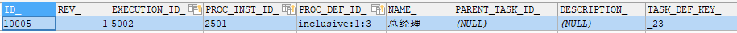

当前任务表已经不是人事经理审批了，说明人事经理审批已经完成。 

流程实例执行表：SELECT * FROM act_ru_execution


包含网关执行完成，分支和汇聚就从act_ru_execution删除。

小结：在分支时，需要判断条件，**符合条件的分支，将会执行**，符合条件的分支最终才进行汇聚。

### 5.4 事件网关EventGateway

事件网关允许根据事件判断流向。网关的每个外出顺序流都要连接到一个中间捕获事件。 当流程到达一个基于事件网关，网关会进入等待状态：会暂停执行。与此同时，会为每个外出顺序流创建相对的事件订阅。

事件网关的外出顺序流和普通顺序流不同，这些顺序流不会真的"执行"， 相反它们让流程引擎去决定执行到事件网关的流程需要订阅哪些事件。 要考虑以下条件：

1. 事件网关必须有两条或以上外出顺序流；
2. 事件网关后，只能使用intermediateCatchEvent类型（activiti不支持基于事件网关后连接ReceiveTask）
3. 连接到事件网关的中间捕获事件必须只有一个入口顺序流。 

#### 5.4.1流程定义

事件网关图标，红框内


intermediateCatchEvent：

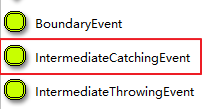


intermediateCatchEvent支持的事件类型：

Message Event: 消息事件

Singal Event：  信号事件

Timer Event：  定时事件


使用事件网关定义流程：

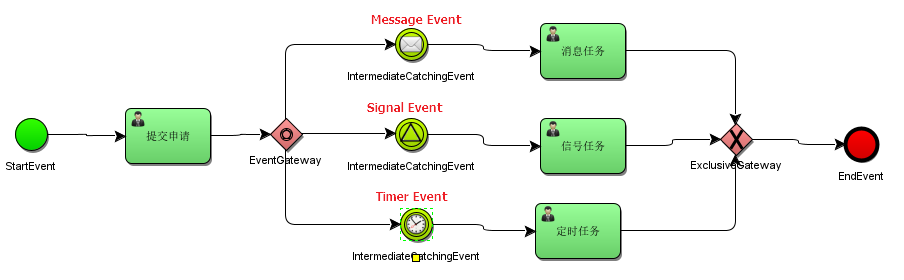

# Activiti整合Spring

## 一、Activiti与Spring整合开发

### 1.1 Activiti与Spring整合的配置

#### 1)、在pom.xml文件引入坐标

如下

```xml
<properties>
        <slf4j.version>1.6.6</slf4j.version>
        <log4j.version>1.2.12</log4j.version>
</properties>
<dependencies>
    <dependency>
        <groupId>org.activiti</groupId>
        <artifactId>activiti-engine</artifactId>
        <version>7.0.0.Beta1</version>
    </dependency>
    <dependency>
        <groupId>org.activiti</groupId>
        <artifactId>activiti-spring</artifactId>
        <version>7.0.0.Beta1</version>
    </dependency>
    <dependency>
        <groupId>org.activiti</groupId>
        <artifactId>activiti-bpmn-model</artifactId>
        <version>7.0.0.Beta1</version>
    </dependency>
    <dependency>
        <groupId>org.activiti</groupId>
        <artifactId>activiti-bpmn-converter</artifactId>
        <version>7.0.0.Beta1</version>
    </dependency>
    <dependency>
        <groupId>org.activiti</groupId>
        <artifactId>activiti-json-converter</artifactId>
        <version>7.0.0.Beta1</version>
    </dependency>
    <dependency>
        <groupId>org.activiti</groupId>
        <artifactId>activiti-bpmn-layout</artifactId>
        <version>7.0.0.Beta1</version>
    </dependency>
    <dependency>
        <groupId>org.activiti.cloud</groupId>
        <artifactId>activiti-cloud-services-api</artifactId>
        <version>7.0.0.Beta1</version>
    </dependency>
    <dependency>
        <groupId>aspectj</groupId>
        <artifactId>aspectjweaver</artifactId>
        <version>1.5.4</version>
    </dependency>
    <dependency>
        <groupId>mysql</groupId>
        <artifactId>mysql-connector-java</artifactId>
        <version>5.1.40</version>
    </dependency>
    <dependency>
        <groupId>junit</groupId>
        <artifactId>junit</artifactId>
        <version>4.12</version>
    </dependency>
    <dependency>
        <groupId>org.springframework</groupId>
        <artifactId>spring-test</artifactId>
        <version>5.0.7.RELEASE</version>
    </dependency>
    <!-- log start -->
    <dependency>
        <groupId>log4j</groupId>
        <artifactId>log4j</artifactId>
        <version>${log4j.version}</version>
    </dependency>
    <dependency>
        <groupId>org.slf4j</groupId>
        <artifactId>slf4j-api</artifactId>
        <version>${slf4j.version}</version>
    </dependency>
    <dependency>
        <groupId>org.slf4j</groupId>
        <artifactId>slf4j-log4j12</artifactId>
        <version>${slf4j.version}</version>
    </dependency>
    <dependency>
        <groupId>org.slf4j</groupId>
        <artifactId>slf4j-nop</artifactId>
        <version>${slf4j.version}</version>
    </dependency>
    <!-- log end -->
    <dependency>
        <groupId>org.mybatis</groupId>
        <artifactId>mybatis</artifactId>
        <version>3.4.5</version>
    </dependency>
    <dependency>
        <groupId>commons-dbcp</groupId>
        <artifactId>commons-dbcp</artifactId>
        <version>1.4</version>
    </dependency>
</dependencies>
<repositories>
    <repository>
        <id>alfresco</id>
        <name>Activiti Releases</name>
        <url>https://artifacts.alfresco.com/nexus/content/repositories/activiti-releases/</url>
        <releases>
            <enabled>true</enabled>
        </releases>
    </repository>
</repositories>
```

在Activiti中核心类的是ProcessEngine流程引擎，与Spring整合就是让Spring来管理ProcessEngine

通过org.activiti.spring.SpringProcessEngineConfiguration 与Spring整合方式来创建ProcessEngine对象。 

 创建spring与activiti的整合配置文件：activiti-spring.xml（名称不固定）

#### 2)、创建activiti-spring.xml

```xml
<beans xmlns="http://www.springframework.org/schema/beans"
       xmlns:xsi="http://www.w3.org/2001/XMLSchema-instance"
       xmlns:tx="http://www.springframework.org/schema/tx"
       xmlns:aop="http://www.springframework.org/schema/aop"
       xsi:schemaLocation="http://www.springframework.org/schema/beans
        http://www.springframework.org/schema/beans/spring-beans.xsd
        http://www.springframework.org/schema/tx
        http://www.springframework.org/schema/tx/spring-tx.xsd
        http://www.springframework.org/schema/aop
        http://www.springframework.org/schema/aop/spring-aop.xsd">
    <!-- 数据源 -->
    <bean id="dataSource" class="com.alibaba.druid.pool.DruidDataSource">
        <property name="driverClassName" value="com.mysql.jdbc.Driver"/>
        <property name="url" value="jdbc:mysql://localhost:3306/activiti"/>
        <property name="username" value="root"/>
        <property name="password" value="123456"/>
        <property name="maxActive" value="3"/>
        <property name="maxIdle" value="1"/>
    </bean>
    <!-- 工作流引擎配置bean -->
    <bean id="processEngineConfiguration" class="org.activiti.spring.SpringProcessEngineConfiguration">
        <!-- 数据源 -->
        <property name="dataSource" ref="dataSource"/>
        <!-- 使用spring事务管理器 -->
        <property name="transactionManager" ref="transactionManager"/>
        <!-- 数据库策略 -->
        <property name="databaseSchemaUpdate" value="drop-create"/>
    </bean>
    <!-- 流程引擎 -->
    <bean id="processEngine" class="org.activiti.spring.ProcessEngineFactoryBean">
        <property name="processEngineConfiguration" ref="processEngineConfiguration"/>
    </bean>
    <!-- 资源服务service -->
    <bean id="repositoryService" factory-bean="processEngine" factory-method="getRepositoryService"/>
    <!-- 流程运行service -->
    <bean id="runtimeService" factory-bean="processEngine"  factory-method="getRuntimeService"/>
    <!-- 任务管理service -->
    <bean id="taskService" factory-bean="processEngine" factory-method="getTaskService"/>
    <!-- 历史管理service -->
    <bean id="historyService" factory-bean="processEngine" factory-method="getHistoryService"/>
    <!-- 事务管理器 -->
    <bean id="transactionManager" class="org.springframework.jdbc.datasource.DataSourceTransactionManager">
        <property name="dataSource" ref="dataSource"/>
    </bean>
    <!-- 通知 -->
    <tx:advice id="txAdvice" transaction-manager="transactionManager">
        <tx:attributes>
            <!-- 传播行为 -->
            <tx:method name="save*" propagation="REQUIRED"/>
            <tx:method name="insert*" propagation="REQUIRED"/>
            <tx:method name="delete*" propagation="REQUIRED"/>
            <tx:method name="update*" propagation="REQUIRED"/>
            <tx:method name="find*" propagation="SUPPORTS" read-only="true"/>
            <tx:method name="get*" propagation="SUPPORTS" read-only="true"/>
        </tx:attributes>
    </tx:advice>
    <!-- 切面，根据具体项目修改切点配置
    <aop:config proxy-target-class="true">
        <aop:advisor advice-ref="txAdvice"
                     pointcut="execution(*com.itheima.service.impl..(..))"/>
    </aop:config>-->
</beans>
```

databaseSchemaUpdate的取值内容：

flase：       默认值。activiti在启动时，会对比数据库表中保存的版本，如果没有表或者版本不匹配，将抛出异常。（生产环境常用）
true：        activiti会对数据库中所有表进行更新操作。如果表不存在，则自动创建。（开发时常用）
create_drop： 在activiti启动时创建表，在关闭时删除表（必须手动关闭引擎，才能删除表）。（单元测试常用）
drop-create： 在activiti启动时删除原来的旧表，然后在创建新表（不需要手动关闭引擎）。


### 1.2 测试Activiti与Spring整合

#### 1）、测试代码

```java
/**
   测试activiti与spring整合是否成功
**/
@RunWith(SpringJUnit4ClassRunner.class)
@ContextConfiguration(locations = "classpath:activiti-spring.xml")
 public class ActivitiTest {
     @Autowired
     private RepositoryService repositoryService;
     
     @Test
     public void test01(){
         System.out.println("部署对象:"+repositoryService);
     }
 }
```


#### 2）、执行流程分析

下面我们一起来分析Activiti与Spring整合加载的过程。

1、加载activiti-spring.xml配置文件

2、加载SpringProcessEngineConfiguration对象，这个对象它需要依赖注入dataSource对象和transactionManager对象。

3、加载ProcessEngineFactoryBean工厂来创建ProcessEngine对象，而ProcessEngineFactoryBean工厂又需要依赖注入processEngineConfiguration对象。

4、processEngine对象来负责创建我们的Service对象，从而简化Activiti的开发过程。

## 二、Activiti7与SpringBoot整合开发

Activiti7发布正式版之后，它与SpringBoot2.x已经完全支持整合开发。

### 2.1     SpringBoot整合Activiti7的配置

为了能够实现SpringBoot与Activiti7整合开发，首先我们要引入相关的依赖支持。

在工程的pom.xml文件中引入相关的依赖，其中activiti的依赖是：activiti-spring-boot-starter。

具体依赖如下所示：

```xml

<parent>
    <groupId>org.springframework.boot</groupId>
    <artifactId>spring-boot-starter-parent</artifactId>
    <version>2.1.0.RELEASE</version>
</parent>
<properties>
    <project.build.sourceEncoding>UTF-8</project.build.sourceEncoding>
    <project.reporting.outputEncoding>UTF-8</project.reporting.outputEncoding>
    <java.version>1.8</java.version>
</properties>
<dependencies>
    <dependency>
        <groupId>org.springframework.boot</groupId>
        <artifactId>spring-boot-starter-web</artifactId>
    </dependency>
    <dependency>
        <groupId>org.springframework.boot</groupId>
        <artifactId>spring-boot-starter-jdbc</artifactId>
    </dependency>
    <dependency>
        <groupId>org.springframework.boot</groupId>
        <artifactId>spring-boot-starter-test</artifactId>
    </dependency>
    <dependency>
        <groupId>org.activiti</groupId>
        <artifactId>activiti-spring-boot-starter</artifactId>
        <version>7.0.0.Beta2</version>
    </dependency>
    <dependency>
        <groupId>mysql</groupId>
        <artifactId>mysql-connector-java</artifactId>
        <version>5.1.29</version>
    </dependency>
    <dependency>
        <groupId>org.projectlombok</groupId>
        <artifactId>lombok</artifactId>
    </dependency>
</dependencies>
<build>
    <plugins>
        <plugin>
            <groupId>org.springframework.boot</groupId>
            <artifactId>spring-boot-maven-plugin</artifactId>
        </plugin>
    </plugins>
</build>
```

通过该pom.xml文件所导入的坐标，我们就可以实现activiti7与Springboot整合。

### 2.2    SpringBoot的application.yml文件配置

为了能够实现Activiti7生成的表放到Mysql数据库中，需要在配置文件application.yml中添加相关的配置

注意：activiti7默认没有开启数据库历史记录，需要手动配置开启

```yaml
spring:
  datasource:
    url: jdbc:mysql:///activiti?useUnicode=true&characterEncoding=utf8&serverTimezone=GMT
    username: root
    password: 123456
    driver-class-name: com.mysql.jdbc.Driver
  activiti:
    #1.flase：默认值。activiti在启动时，对比数据库表中保存的版本，如果没有表或者版本不匹配，将抛出异常
    #2.true： activiti会对数据库中所有表进行更新操作。如果表不存在，则自动创建
    #3.create_drop： 在activiti启动时创建表，在关闭时删除表（必须手动关闭引擎，才能删除表）
    #4.drop-create： 在activiti启动时删除原来的旧表，然后在创建新表（不需要手动关闭引擎）
    database-schema-update: true
    #检测历史表是否存在 activiti7默认没有开启数据库历史记录 启动数据库历史记录
    db-history-used: true
    #记录历史等级 可配置的历史级别有none, activity, audit, full
    #none：不保存任何的历史数据，因此，在流程执行过程中，这是最高效的。
    #activity：级别高于none，保存流程实例与流程行为，其他数据不保存。
    #audit：除activity级别会保存的数据外，还会保存全部的流程任务及其属性。audit为history的默认值。
    #full：保存历史数据的最高级别，除了会保存audit级别的数据外，还会保存其他全部流程相关的细节数据，包括一些流程参数等。
    history-level: full
    #校验流程文件，默认校验resources下的processes文件夹里的流程文件
    check-process-definitions: false
```

### 2.3 编写启动类

```java
package com.itheima;

import org.springframework.boot.SpringApplication;
import org.springframework.boot.autoconfigure.SpringBootApplication;

@SpringBootApplication
public class ActApplication {
    public static void main(String[] args) {
        SpringApplication.run(ActApplication.class,args);
    }
}

```

### 2.4    添加SpringSecurity安全框架整合配置

因为Activiti7与SpringBoot整合后，默认情况下，集成了SpringSecurity安全框架，这样我们就要去准备SpringSecurity整合进来的相关用户权限配置信息。

SpringBoot的依赖包已经将SpringSecurity的依赖包也添加进项目中。

#### 2.4.1  添加SecurityUtil类

为了能够快速实现SpringSecurity安全框架的配置，所添加的一个组件。

```java
package com.itheima.utils;

import org.slf4j.Logger;
import org.slf4j.LoggerFactory;
import org.springframework.beans.factory.annotation.Autowired;
import org.springframework.beans.factory.annotation.Qualifier;
import org.springframework.security.core.Authentication;
import org.springframework.security.core.GrantedAuthority;
import org.springframework.security.core.context.SecurityContextHolder;
import org.springframework.security.core.context.SecurityContextImpl;
import org.springframework.security.core.userdetails.UserDetails;
import org.springframework.security.core.userdetails.UserDetailsService;
import org.springframework.stereotype.Component;

import java.util.Collection;


@Component
public class SecurityUtil {
    private Logger logger = LoggerFactory.getLogger(SecurityUtil.class);

     @Autowired
     @Qualifier("myUserDetailsService")
     private UserDetailsService userDetailsService;
 
    public void logInAs(String username) {
     UserDetails user = userDetailsService.loadUserByUsername(username);

     if (user == null) {
         throw new IllegalStateException("User " + username + " doesn't exist, please provide a valid user");
     }
     logger.info("> Logged in as: " + username);

     SecurityContextHolder.setContext(
             new SecurityContextImpl(
                     new Authentication() {
                         @Override
                         public Collection<? extends GrantedAuthority> getAuthorities() {
                             return user.getAuthorities();
                         }
                         @Override
                         public Object getCredentials() {
                             return user.getPassword();
                         }
                         @Override
                         public Object getDetails() {
                             return user;
                         }
                         @Override
                         public Object getPrincipal() {
                             return user;
                         }
                         @Override
                         public boolean isAuthenticated() {
                             return true;
                         }
                         @Override
                         public void setAuthenticated(boolean isAuthenticated) throws IllegalArgumentException { }
                         @Override
                         public String getName() {
                             return user.getUsername();
                         }
     }));
     org.activiti.engine.impl.identity.Authentication.setAuthenticatedUserId(username);
 }
  }
```
这个类可以从我们下载的Activiti7官方提供的Example中找到。

#### 2.4.2  添加DemoApplicationConfig类

在Activiti7官方下载的Example中找到DemoApplicationConfig类，它的作用是为了实现SpringSecurity框架的用户权限的配置，这样我们就可以在系统中使用用户权限信息。

本次项目中基本是在文件中定义出来的用户信息，当然也可以是数据库中查询的用户权限信息。

后面处理流程时用到的任务负责人，需要添加在这里

```java
package com.itheima.config;

import org.slf4j.Logger;
import org.slf4j.LoggerFactory;
import org.springframework.context.annotation.Bean;
import org.springframework.context.annotation.Configuration;
import org.springframework.security.core.authority.SimpleGrantedAuthority;
import org.springframework.security.core.userdetails.User;
import org.springframework.security.core.userdetails.UserDetailsService;
import org.springframework.security.crypto.bcrypt.BCryptPasswordEncoder;
import org.springframework.security.crypto.password.PasswordEncoder;
import org.springframework.security.provisioning.InMemoryUserDetailsManager;

import java.util.Arrays;
import java.util.List;
import java.util.stream.Collectors;

@Configuration
public class DemoApplicationConfiguration {
    private Logger logger = LoggerFactory.getLogger(DemoApplicationConfiguration.class);
     @Bean
     public UserDetailsService myUserDetailsService() {
         InMemoryUserDetailsManager inMemoryUserDetailsManager = new InMemoryUserDetailsManager();
         //这里添加用户，后面处理流程时用到的任务负责人，需要添加在这里
         String[][] usersGroupsAndRoles = {
                 {"jack", "password", "ROLE_ACTIVITI_USER", "GROUP_activitiTeam"},
                 {"rose", "password", "ROLE_ACTIVITI_USER", "GROUP_activitiTeam"},
                 {"tom", "password", "ROLE_ACTIVITI_USER", "GROUP_activitiTeam"},
                 {"other", "password", "ROLE_ACTIVITI_USER", "GROUP_otherTeam"},
                 {"system", "password", "ROLE_ACTIVITI_USER"},
                 {"admin", "password", "ROLE_ACTIVITI_ADMIN"},
         };

         for (String[] user : usersGroupsAndRoles) {
             List<String> authoritiesStrings = Arrays.asList(Arrays.copyOfRange(user, 2, user.length));
             logger.info("> Registering new user: " + user[0] + " with the following Authorities[" + authoritiesStrings + "]");
             inMemoryUserDetailsManager.createUser(new User(user[0], passwordEncoder().encode(user[1]),
                     authoritiesStrings.stream().map(s -> new SimpleGrantedAuthority(s)).collect(Collectors.toList())));
         }

         return inMemoryUserDetailsManager;
     }
     @Bean
     public PasswordEncoder passwordEncoder() {
         return new BCryptPasswordEncoder();
     }
}
```

###  2.5 创建Bpmn文件

Activiti7可以自动部署流程，前提是在resources目录下，创建一个新的目录processes，用来放置bpmn文件。

创建一个简单的Bpmn流程文件，并设置任务的用户组Candidate Groups。

Candidate Groups中的内容与上面DemoApplicationConfiguration类中出现的用户组名称要保持一致，可以填写：activitiTeam 或者 otherTeam。

这样填写的好处：当不确定到底由谁来负责当前任务的时候，只要是Groups内的用户都可以拾取这个任务


### 2.6    使用Junit方式测试


```java
package com.itheima.test;

import com.itheima.utils.SecurityUtil;
import org.activiti.api.process.model.ProcessInstance;
import org.activiti.api.process.model.builders.ProcessPayloadBuilder;
import org.activiti.api.process.runtime.ProcessRuntime;
import org.activiti.api.runtime.shared.query.Page;
import org.activiti.api.runtime.shared.query.Pageable;
import org.activiti.api.task.model.Task;
import org.activiti.api.task.model.builders.TaskPayloadBuilder;
import org.activiti.api.task.runtime.TaskRuntime;
import org.activiti.engine.repository.ProcessDefinition;
import org.junit.Test;
import org.junit.runner.RunWith;
import org.springframework.beans.factory.annotation.Autowired;
import org.springframework.boot.test.context.SpringBootTest;
import org.springframework.test.context.junit4.SpringRunner;

@RunWith(SpringRunner.class)
@SpringBootTest
 public class Actviti7DemoApplicationTests {
     @Autowired
     private ProcessRuntime processRuntime;
     @Autowired
     private TaskRuntime taskRuntime;
     @Autowired
     private SecurityUtil securityUtil;

    @Test
    public void testActBoot(){
        System.out.println(taskRuntime);
    }

    /**
     * 查看流程定义
     */
    @Test
    public void contextLoads() {
        securityUtil.logInAs("system");
        Page<org.activiti.api.process.model.ProcessDefinition> processDefinitionPage =
                processRuntime.processDefinitions(Pageable.of(0, 10));
        System.out.println("可用的流程定义数量：" + processDefinitionPage.getTotalItems());
        for (org.activiti.api.process.model.ProcessDefinition pd : processDefinitionPage.getContent()) {
            System.out.println("流程定义：" + pd);
        }
    }


    /**
     * 启动流程实例
     */
    @Test
    public void testStartProcess() {
        securityUtil.logInAs("system");
        ProcessInstance pi = processRuntime.start(ProcessPayloadBuilder.
                start().
                withProcessDefinitionKey("myProcess").
                build());
        System.out.println("流程实例ID：" + pi.getId());
    }


    /**
     **查询任务，并完成自己的任务
     **/
    @Test
    public void testTask() {
        securityUtil.logInAs("jack");
        Page<Task> taskPage=taskRuntime.tasks(Pageable.of(0,10));
        if (taskPage.getTotalItems()>0){
            for (Task task:taskPage.getContent()){
                taskRuntime.claim(TaskPayloadBuilder.
                        claim().
                        withTaskId(task.getId()).build());
                System.out.println("任务："+task);
                taskRuntime.complete(TaskPayloadBuilder.
                        complete().
                        withTaskId(task.getId()).build());
            }
        }
        Page<Task> taskPage2=taskRuntime.tasks(Pageable.of*(0,10));
        if (taskPage2.getTotalItems()>0){
            System.out.println("任务："+taskPage2.getContent());
        }
    }
}
```

