[TOC]

# 一、经典设计原则

```
编写软件过程中，程序员面临着来耦合性，内聚性以及可维护性，可扩展性，重用性，灵活性等多方面的挑战，设计模式是为了让程序(软件)，具有更好
1)代码重用性【即：相同功能的代码，不用多次编写】
2)可读性【即：编程规范性】
3)可扩展性【即：当需要增加新功能，方便维护】
4)可靠性【即：当我们增加功能后，对原来的功能没有影响】
5)使程序呈现高内聚，低耦合的特性
```


## 1、常用七大设计原则

```
1)单一职责原则
2)接口隔离原则
3)依赖倒转【倒置】原则
4)里氏替换原则
5)开闭原则 ocp
6)迪米特法则
7)合成复用原则
```


## 2、七大原则详细介绍

### 1）单一职责原则

```
对类来说的，即一个类应该只负责一项职责。如类A负责两个不同职责:职责1，职责2。当职责1需求变更而改变A时，可能造成职责2执行错误，所以需要将类A的粒度分解为A1，A2
```


- **Code**

```java
public class SingleResponsibility1 {
    public static void main(String[] args) {
        Vehicle vehicle = new Vehicle();
        vehicle.run("汽车");
        vehicle.run("飞机");
    }
}

/**
 * 交通工具类
 * 违反了单一职责原则
 * 根据交通工具的不同，分解成不同的类
 */
class Vehicle{
    public void run(String vehicle){
        System.out.println(vehicle + " 在公路上跑 ");
    }
}
```


```java
public class SingleResponsibility2 {
    public static void main(String[] args) {
        RoadVehicle roadVehicle = new RoadVehicle();
        roadVehicle.run("汽车");
        AirVehicle airVehicle = new AirVehicle();
        airVehicle.run("飞机");
    }
}

/**
 * 遵守单一职责原则
 * 但是改动很大
 * 修改 => 直接修改Vehicle类
 */
class RoadVehicle{
    public void run(String roadVehicle){
        System.out.println(roadVehicle + " 在公路运行");
    }
}
class AirVehicle{
    public void run(String roadVehicle){
        System.out.println(roadVehicle + " 在天上运行");
    }
}
class SeaVehicle{
    public void run(String roadVehicle){
        System.out.println(roadVehicle + " 在水运行");
    }
}
```


```java
public class SingleResponsibility3 {
    public static void main(String[] args) {
        Vehicle2 vehicle = new Vehicle2();
        vehicle.runAir("飞机");
        vehicle.runRoad("汽车");
    }
}

/**
 * 没有对原来的类做大的修改
 * 虽然在类上没有 遵守单一职责
 * 但是在 方法上遵守单一职责
 */
class Vehicle2{
    public void runRoad(String vehicle){
        System.out.println(vehicle + " 在公路上跑 ");
    }
    public void runAir(String vehicle){
        System.out.println(vehicle + " 在天上飞 ");
    }
}
```


- 单一职责原则的注意事项和细节
  1. 降低类的复杂度，一个类只维护一项职责
  2. 提高类的可读性，可维护性
  3. 降低变更引起的风险
  4. 通常情况下，**我们应当遵守单一职责原则**，只有逻辑足够简单，才可以在代码级违反单一职责原则；只有类中的方法足够少，可以在方法级别保持单一职责原则


### 2）接口隔离原则

- **基本介绍**

  1. 客户端不应该依赖它不需要的接口，即一个类对另一个类的依赖应该建立在最小的接口上

  2. 下图

     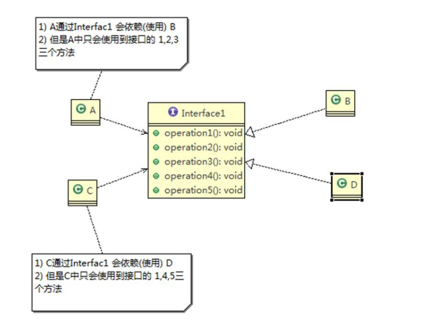

     

  3. 类A通过接口依赖类B，类C通过接口依赖类B，如果接口对于类A和类C来说不是最小接口，那么类B个类D必须实现他们不需要的方法

  4. 按照隔离原则应该这样处理：

     将接口拆分成**独立的几个接口**，类A和类C分别与他们需要的接口建立依赖关系，也就是采用接口隔离原则


- **Code**

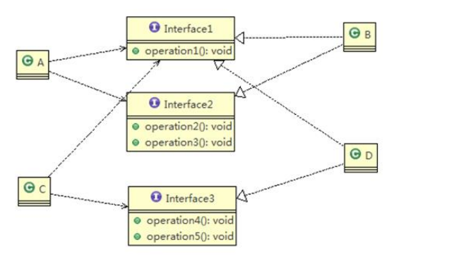


```java
interface Interface1 {
    void operation1();
    void operation2();
    void operation3();
    void operation4();
    void operation5();
}
class B implements Interface1{
    @Override
    public void operation1() {
        System.out.println("B 实现 operation1");
    }
    @Override
    public void operation2() {
        System.out.println("B 实现 operation2");
    }
    @Override
    public void operation3() {
        System.out.println("B 实现 operation3");
    }
    @Override
    public void operation4() {
        System.out.println("B 实现 operation4");
    }
    @Override
    public void operation5() {
        System.out.println("B 实现 operation5");
    }
}
class D implements Interface1{
    @Override
    public void operation1() {
        System.out.println("D 实现 operation1");
    }
    @Override
    public void operation2() {
        System.out.println("D 实现 operation2");
    }
    @Override
    public void operation3() {
        System.out.println("D 实现 operation3");
    }
    @Override
    public void operation4() {
        System.out.println("D 实现 operation4");
    }
    @Override
    public void operation5() {
        System.out.println("D 实现 operation5");
    }
}
// A 类通过 接口interface 依赖(使用) B
// A 类使用 123方法，B类中的 45方法白写
class A{
    public void depend1(Interface1 i){
        i.operation1();
    }
    public void depend2(Interface1 i){
        i.operation2();
    }
    public void depend3(Interface1 i){
        i.operation3();
    }
}
// C 通过 interface 依赖 D
// C 只使用 D中的145方法，D类中的23方法白写
// 按照隔离原则，将interface拆成几个独立的接口
class C{
    public void depend1(Interface1 i){
        i.operation1();
    }
    public void depend4(Interface1 i){
        i.operation4();
    }
    public void depend5(Interface1 i){
        i.operation5();
    }
}
```

修改后的

```java
// 拆成三个接口
interface Inter1 {
    void operation1();
}
interface Inter2{
    void operation2();
    void operation3();
}
interface Inter3{
    void operation4();
    void operation5();
}
class B2 implements Inter1,Inter2{
    @Override
    public void operation1() {
        System.out.println("B 实现 operation1");
    }
    @Override
    public void operation2() {
        System.out.println("B 实现 operation2");
    }
    @Override
    public void operation3() {
        System.out.println("B 实现 operation3");
    }
}
class D2 implements Inter1,Inter3{
    @Override
    public void operation1() {
        System.out.println("D 实现 operation1");
    }
    @Override
    public void operation4() {
        System.out.println("D 实现 operation4");
    }
    @Override
    public void operation5() {
        System.out.println("D 实现 operation5");
    }
}
// A 类通过 接口interface 依赖(使用) B
// A 类使用 123方法，
class A2{
    public void depend1(Inter1 i){
        i.operation1();
    }
    public void depend2(Inter2 i){
        i.operation2();
    }
    public void depend3(Inter2 i){
        i.operation3();
    }
}
// C 通过 interface 依赖 D
// C 只使用 145方法
class C2{
    public void depend1(Inter1 i){
        i.operation1();
    }
    public void depend4(Inter3 i){
        i.operation4();
    }
    public void depend5(Inter3 i){
        i.operation5();
    }
}
```


### 3）依赖倒转原则

- 基本介绍
  1. 高层模块不应该依赖底层模块，二者都应该依赖其抽象
  2. **抽象不应该依赖细节，细节应该依赖抽象**
  3. 依赖倒转【倒置】的中心思想是面向接口编程
  4. 依赖倒转原则是基于这样的设计理念，相对于细节的多变性，抽象的东西要稳定的多。以抽象为基础搭建的架构比以细节为基础的架构要稳定的多，在java中，抽象指的是接口或者抽象类，细节就是具体的实现类
  5. 使用的接口或抽象类的目的是制定好规范，而不涉及任何具体的操作，把展现细节的任务交给他们的实现类去完成


- **Code**

```java
class Email{
    public String getInfo(){
        return "电子邮件信息 hello world";
    }
}

/**
 * 问题：
 * 直接依赖具体的类
 * 假设接受其他类型的信息(短信...)，Person也要新加方法
 * 解决方式:
 * 引入一个抽象的接口，与接口进行依赖，让Email等实现该接口，符合依赖倒转原则
 */
class Person{
    // 接收消息
    public void accept(Email email){
        email.getInfo();
    }
}
```


```java
interface MsgServer{
    Object getInfo();
}
class Email2 implements MsgServer{
    @Override
    public Object getInfo() {
        return "电子邮件: hello World";
    }
}
class SMS implements MsgServer{
    @Override
    public Object getInfo() {
        return "短信: hello World";
    }
}
class People2{
    public void accept(MsgServer msg){
        System.out.println(msg.getInfo());
    }
}
```


- **依赖关系传递的三种方式**
  1. 接口传递
  2. 构造方法传递
  3. setter方式传递

```java
public class DependencyPass {
    public static void main(String[] args) {
        ChangHong changHong = new ChangHong();
         OpenAndClose openAndClose = new OpenAndClose();
         openAndClose.open(changHong);
        //通过构造器进行依赖传递
//        OpenAndClose openAndClose = new OpenAndClose(changHong);
//        openAndClose.open();
        //通过 setter 方法进行依赖传递
//        OpenAndClose openAndClose = new OpenAndClose();
//        openAndClose.setTv(changHong);
//        openAndClose.open();
    }
}

// 方式 1： 通过接口传递实现依赖
// 开关的接口
interface IOpenAndClose {
    public void open(ITV tv); //抽象方法,接收接口
}

interface ITV { //ITV 接口
    public void play();
}

// 实现接口
class OpenAndClose implements IOpenAndClose {
    public void open(ITV tv) {
        tv.play();
    }
}
// 方式 2: 通过构造方法依赖传递
//class OpenAndClose implements IOpenAndClose {
//    public ITV tv; //成员
//
//    public OpenAndClose(ITV tv) { //构造器
//        this.tv = tv;
//    }
//
//    public void open() {
//        this.tv.play();
//    }
//}

// 方式 3 , 通过 setter 方法传递
//interface IOpenAndClose {
//    public void open(); // 抽象方法
//
//    public void setTv(ITV tv);
//}
//
//class OpenAndClose implements IOpenAndClose {
//    private ITV tv;
//
//    public void setTv(ITV tv) {
//        this.tv = tv;
//    }
//
//    public void open() {
//        this.tv.play();
//    }
//}
//
class ChangHong implements ITV {
    @Override
    public void play() {
        System.out.println("长虹电视机，打开");
    }
}
```


- **依赖倒转原则的注意事项和细节**

1) 低层模块尽量都要有抽象类或接口，或者两者都有，程序稳定性更好. 

2) 变量的**声明类型尽量是抽象类或接口**, 这样我们的变量引用和实际对象间，就存在**一个缓冲层**，利于程序扩展和优化

3) 继承时遵循**里氏替换**原则


### 4）里氏替换原则

- OO**中的继承性的思考和说明**
  1. 继承包含这样一层含义：父类中凡是已经实现好的方法，实际上是在设定规范和契约，虽然它不强制要求所有的子类必须遵循这些契约，但是如果子类对这些**已经实现**的方法任意修改，就会对整个继承体系造成破坏
  2. **继承在给程序设计带来便利的同时，也带来了弊端**。比如使用继承会给程序带来**侵入性**，程序的可移植性降低，增加对象间的耦合性，如果一个类被其他的类所继承，则当这个类需要修改时，必须考虑到所有的子类，并且父类修改后，所有涉及到子类的功能都有可能产生故障
  3. 问题提出：**在编程中，如何正确的使用继承**? => **里氏替换**原则


- **基本介绍**
  1. 如果对每个类型为 T1 的对象 o1，都有类型为 T2 的对象 o2，使得以 T1 定义的所有程序 P 在所有的对象 o1 都代换成 o2 时，程序 P 的行为没有发生变化，那么类型 T2 是类型 T1 的子类型。**换句话说，所有引用基类的地方必须能透明地使用其子类的对象**。
  2. 在使用继承时，遵循里氏替换原则，在**子类中尽量不要重写父类的方法**
  3. 里氏替换原则告诉我们，继承实际上让两个类耦合性增强了，在适当的情况下，可以通过**聚合，组合，依赖 来解决问题**。


- **Code**

```java
public class Liskov1 {
    public static void main(String[] args) {
        A a = new A();
        System.out.println("11-3=" + a.function1(11, 3));
        B b = new B();
        System.out.println("11-3=" + b.function1(11, 3));
        System.out.println("11-3+1" + b.function2(11, 3));
    }
}

class A {
    public int function1(int num1, int num2) {
        return num1 - num2;
    }
}

class B extends A {
    @Override // 重写了 A 类的 function1
    public int function1(int num1, int num2) {
        return num1 + num2;
    }

    public int function2(int num1, int num2) {
        return function1(num1, num2) + 1;
    }
}
```


- 解决方式

  1. 通用的做法是：原来的父类和子类都继承一个更通俗的基类，原有的继承关系去掉，采用依赖，聚合，组合等关系代替

  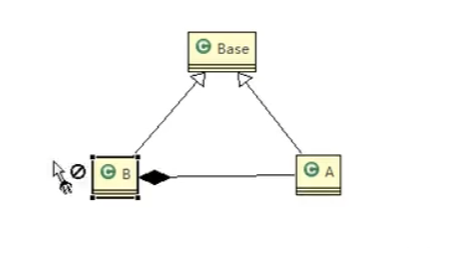

```java
// 创建 一个更加基础的类
class Base {
}

class A2 extends Base {
    public int function1(int num1, int num2) {
        return num1 - num2;
    }
}

class B2 extends Base {
    //如果 B 需要使用 A 类的方法,使用组合关系
    private A2 a2;
    public int function1(int num1, int num2) {
        return num1 + num2;
    }
    public int function2(int num1, int num2) {
        return function1(num1, num2) + 1;
    }
    public int function3(int num1, int num2) {
        return a2.function1(num1, num2);
    }
}
```


### 5）开闭原则

- **基本介绍**
  1. 开闭原则（Open Closed Principle）是编程中**最基础、最重要**的设计原则
  2. 一个软件实体如类，模块和函数应该**对扩展开放**，对**修改关闭**。用抽象构建框架，用实现扩展细节
  3. 当软件需要变化时，尽量**通过扩展软件**实体的行为来实现变化，而不是**通过修改**已有的代码来实现变化
  4. 编程中遵循其它原则，以及使用设计模式的目的就是遵循开闭原则


- **Code**

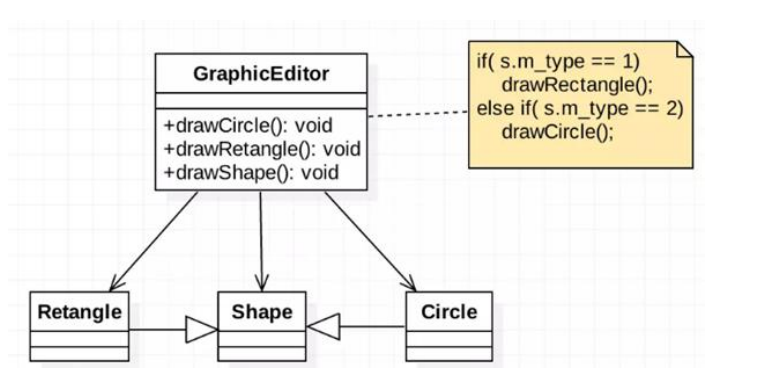

```java
//这是一个用于绘图的类 [使用方]
class GraphicEditor {
    //接收 Shape 对象，然后根据 type，来绘制不同的图形
    public void drawShape(Shape s) {
        if (s.m_type == 1)
            drawRectangle(s);
        else if (s.m_type == 2)
            drawCircle(s);
        else if (s.m_type == 3)
            drawTriangle(s);
    }

    //绘制矩形
    public void drawRectangle(Shape r) {
        System.out.println(" 绘制矩形 ");
    }

    //绘制圆形
    public void drawCircle(Shape r) {
        System.out.println(" 绘制圆形 ");
    }

    //绘制三角形
    public void drawTriangle(Shape r) {
        System.out.println(" 绘制三角形 ");
    }
}

//Shape 类，基类
class Shape {
    int m_type;
}

// 绘制矩形
class Rectangle extends Shape {
    Rectangle() {
        super.m_type = 1;
    }
}

// 绘制圆形
class Circle extends Shape {
    Circle() {
        super.m_type = 2;
    }
}

//新增画三角形
class Triangle extends Shape {
    Triangle() {
        super.m_type = 3;
    }
}
```


改进

```java
//这是一个用于绘图的类 [使用方]
class GraphicEditor2 {
    //接收 Shape 对象，调用 draw 方法
    public void drawShape(Shape2 s) {
        s.draw();
    }
}

//Shape 类，基类
abstract class Shape2 {
    int m_type;

    public abstract void draw();//抽象方法
}

class Rectangle2 extends Shape2 {
    Rectangle2() {
        super.m_type = 1;
    }

    @Override
    public void draw() {
        System.out.println(" 绘制矩形 ");
    }
}

class Circle2 extends Shape2 {
    Circle2() {
        super.m_type = 2;
    }

    @Override
    public void draw() {
        System.out.println(" 绘制圆形 ");
    }
}

//新增画三角形
class Triangle2 extends Shape2 {
    Triangle2() {
        super.m_type = 3;
    }

    @Override
    public void draw() {
        System.out.println(" 绘制三角形 ");
    }
}

//新增一个图形
class OtherGraphic2 extends Shape2 {
    OtherGraphic2() {
        super.m_type = 4;
    }

    @Override
    public void draw() {
        System.out.println(" 绘制其它图形 ");
    }
}
```


### 6）迪米特法则

- **基本介绍**
  1. 一个对象应该对其他对象保持最少的了解
  2. 类与类关系越密切，耦合度越大
  3. 迪米特法则(Demeter Principle)又叫**最少知道原则**，即一个类**对自己依赖的类知道的越少越好**。也就是说，对于被依赖的类不管多么复杂，都尽量将逻辑封装在类的内部。对外除了提供的 public 方法，不对外泄露任何信息
  4. 迪米特法则还有个更简单的定义：只与直接的朋友通信
  5. **直接的朋友**：每个对象都会与其他对象有**耦合关系**，只要两个对象之间有耦合关系，我们就说这两个对象之间是朋友关系。耦合的方式很多，依赖，关联，组合，聚合等。其中，我们称出现**成员变量，方法参数**，方法返回值中的类为**直接的朋友**，而出现在**局部变量中的类不是直接的朋友**。也就是说，陌生的类最好不要以局部变量的形式出现在类的内部。


- **Code**

```
有一个学校，下属有各个学院和总部，现要求打印出学校总部员工 ID 和学院员工的 id
```

```java
public class Demeter1 {
    public static void main(String[] args) {
        SchoolManager schoolManager = new SchoolManager();
        schoolManager.printAllEmployee(new CollegeManager());
    }
}

//学校总部员工类
class Employee {
    private String id;

    public void setId(String id) {
        this.id = id;
    }

    public String getId() {
        return id;
    }
}

//学院的员工类
class CollegeEmployee {
    private String id;

    public void setId(String id) {
        this.id = id;
    }

    public String getId() {
        return id;
    }
}

//管理学院员工的管理类
class CollegeManager {
    //返回学院的所有员工
    public List<CollegeEmployee> getAllEmployee() {
        List<CollegeEmployee> list = new ArrayList<>();
        for (int i = 0; i < 10; i++) { //这里我们增加了 10 个员工到 list
            CollegeEmployee emp = new CollegeEmployee();
            emp.setId("学院员工 id= " + i);
            list.add(emp);
        }
        return list;
    }
    // 修改 【1】
    // ======================================================================
    public void printListInfo(){
        List<CollegeEmployee> allEmployee = getAllEmployee();
        for (CollegeEmployee e : allEmployee) {
            System.out.println(e.getId());
        }
    }
    // ======================================================================
}

//学校管理类
//分析 SchoolManager 类的直接朋友类有哪些 Employee、CollegeManager
//CollegeEmployee 不是 直接朋友 而是一个陌生类，这样违背了 迪米特法则
class SchoolManager {
    //返回学校总部的员工
    public List<Employee> getAllEmployee() {
        List<Employee> list = new ArrayList<Employee>();
        for (int i = 0; i < 5; i++) { //这里我们增加了 5 个员工到 list
            Employee emp = new Employee();
            emp.setId("学校总部员工 id= " + i);
            list.add(emp);
        }
        return list;
    }

    //该方法完成输出学校总部和学院员工信息(id)
    void printAllEmployee(CollegeManager sub) {
        //分析问题
        //1. 这里的 CollegeEmployee 不是 SchoolManager 的直接朋友
        //2. CollegeEmployee 是以局部变量方式出现在 SchoolManager
        //3. 违反了 迪米特法则【朋友的朋友不是我的朋友】
        //获取到学院员工
        // ======================================================================
//        List<CollegeEmployee> list1 = sub.getAllEmployee();
//        System.out.println("------------学院员工------------");
//        for (CollegeEmployee e : list1) {
//            System.out.println(e.getId());
//        }
        // ======================================================================
        //修改 【2】
        sub.printListInfo();
        // ======================================================================
        //获取到学校总部员工
        List<Employee> list2 = this.getAllEmployee();
        System.out.println("------------学校总部员工------------");
        for (Employee e : list2) {
            System.out.println(e.getId());
        }
    }
}
```


- **注意事项**

1. 迪米特法则的核心是降低类之间的耦合

1. 但是注意：由于每个类都减少了不必要的依赖，因此迪米特法则只是要求降低类间(对象间)耦合关系， 并不是要求完全没有依赖关系


### 7）合成复用原则

- **基本介绍**

​		原则是尽量使用 合成 / 聚合 的方式，而不是使用继承

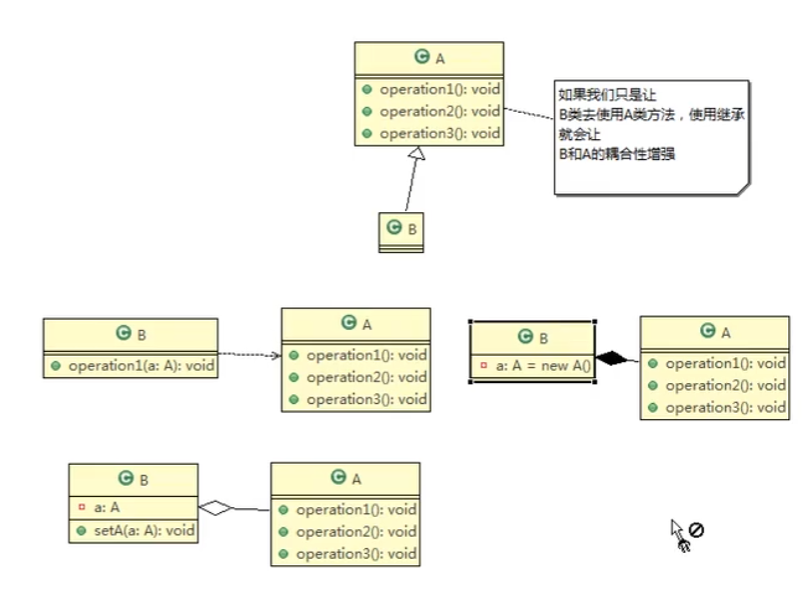


- **合成原则核心思想**
  1. 找出应用中可能需要变化之处，把它们独立出来，不要和那些不需要变化的代码混在一起。
  2. 针对接口编程，而不是针对实现编程。
  3. 为了交互对象之间的松耦合设计而努力。


# 二、UML基本介绍

## 1、类的依赖、泛化(继承)和实现

### 1）依赖关系 Dependence

```
只要是在类中用到了对方，那么他们之间就存在依赖关系。如果没有对方，连编绎都通过不了。
```

```
1) 类中用到了对方
2) 如果是类的成员属性
3) 如果是方法的返回类型
4) 是方法接收的参数类型
5) 方法中使用到
```


```java
public class PersonServiceBean {
    private PersonDao personDao;//类
    public void save(Person person){}
    public IDCard getIDCard(Integer personid){}
    public void modify(){
    Department department = new Department();
    }
}
public class PersonDao{}
public class IDCard{}
public class Person{}
public class Department{}
```


### 2）泛化（继承）generalization

```
泛化关系实际上就是继承关系，他是依赖关系的特例
```

```
1) 泛化关系实际上就是继承关系
2) 如果 A 类继承了 B 类，我们就说 A 和 B 存在泛化关系
```


```java
public abstract class DaoSupport{
    public void save(Object entity){
    }
    public void delete(Object id){
    }
}
public class PersonServiceBean extends Daosupport{
}
```


### 3）实现 Implementation

```
实现关系实际上就是 A 类实现 B 接口，他是依赖关系的特例
```


```java
public interface PersonService {
public void delete(Interger id);
}
public class PersonServiceBean implements PersonService {
public void delete(Interger id){}
}
```


## 2、类的关联、聚合和组合

### 4）关联关系 Association

```
关联关系实际上是类与类之间的联系，他是依赖关系的特例
```

```
关系具有导航性：即双向关系或单向关系
关系具有多重性：如“1”有且仅有一个，“0 ...” 表示0个或者多个
	“0，1”表示0个或者一个
	“n...m”表示 n 到 m 个都可以
	“m...*” 表示至少 m 个
```


```java
// 单向一对一关系
public class Person{
    private IDCard card;
}
public class IDcard{
    
}
// 双向一对一关系
public class Person{
    private IDCard card;
}
public class IDcard{
	private Person person;   
}
```


### 5）聚合 Aggregation

- **基本介绍**

```
聚合关系（Aggregation）表示的是整体和部分的关系，整体与部分可以分开。
聚合关系是关联关系的特例，所以他具有关联的导航性与多重性。
如：一台电脑由键盘(keyboard)、显示器(monitor)，鼠标等组成；组成电脑的各个配件是可以从电脑上分离出来的，使用带空心菱形的实线来表示
```


- **Code**

```java
public class Computer{
	private Mouse mon;
    private Monitor monitor;
    public void serMouse(Mouse mon){
        this.mon = mon;
    }
    public void setMonitor(Monitor monitor){
        this.monitor = monitor;
    }
}
```


### 6）组合 Composition

- **基本介绍**

```
组合关系：也是整体与部分的关系，但是整体与部分不可以分开。
再看一个案例：在程序中我们定义实体：Person 与 IDCard、Head, 那么 Head 和 Person 就是 组合，IDCard 和Person 就是聚合。
但是如果在程序中 Person 实体中定义了对 IDCard 进行级联删除，即删除 Person 时连同 IDCard 一起删除，那么 IDCard 和 Person 就是组合了.
```


- **Code**

```java
public class Person{
private IDCard card;
private Head head = new Head();
}
public class IDCard{}
public class Head{}
```


# 三、设计模式概述和分类


- **设计模式的类型**

  ```
  设计模式分为三种类型，共 23 种
  
  1) 创建型模式：单例模式、抽象工厂模式、原型模式、建造者模式、工厂模式。
  2) 结构型模式：适配器模式、桥接模式、装饰模式、组合模式、外观模式、享元模式、代理模式。
  3) 行为型模式：模版方法模式、命令模式、访问者模式、迭代器模式、观察者模式、中介者模式、备忘录模式、解释器模式（Interpreter 模式）、状态模式、策略模式、职责链模式(责任链模式)。
  ```


## 1）单例设计模式

- **介绍**

```
所谓类的单例设计模式，就是采取一定的方法保证在整个的软件系统中，对某个类只能存在一个对象实例，并且该类只提供一个取得其对象实例的方法(静态方法)。

比如 Hibernate 的 SessionFactory，它充当数据存储源的代理，并负责创建 Session 对象。SessionFactory 并不是轻量级的，一般情况下，一个项目通常只需要一个 SessionFactory 就够，这是就会使用到单例模式。
```


- **单例设计模式有 8 种方式**

  ```
  1) 饿汉式(静态常量)
  2) 饿汉式（静态代码块）
  3) 懒汉式(线程不安全)
  4) 懒汉式(线程安全，同步方法)
  5) 懒汉式(线程安全，同步代码块)
  6) 双重检查
  7) 静态内部类
  8) 枚举
  ```

  

- **Code**

```java
/**
 * 饿汉式 （静态变量）
 * 这种写法比较简单，就是在类装载的时候就完成实例化。避免了线程同步问题。
 * 在类装载的时候就完成实例化，没有达到 Lazy Loading 的效果。如果从始至终从未使用过这个实例，则会造成内存的浪费
 * 这种单例模式可用，可能造成内存浪费
 */
class Single1{
    // 构造方式私有化
    private Single1(){}
    private final static Single1 single1 = new Single1();
    public static Single1 getInstance(){
        return single1;
    }
}
//==========================================================
/**
 * 饿汉式 （静态代码块）
 * 这种单例模式可用，但是可能造成内存浪费
 */
class Single2{
    private Single2(){}
    private final static Single2 single2;
    static {
        single2 = new Single2();
    }
    public static Single2 getInstance(){
        return single2;
    }
}
//==========================================================
/**
 * 懒汉式 线程不安全
 * 起到了 Lazy Loading 的效果，但是只能在单线程下使用。
 * 如果在多线程下，一个线程进入了 if (singleton == null)判断语句块，还未来得及往下执行，另一个线程也通过
 * 了这个判断语句，这时便会产生多个实例。所以在多线程环境下不可使用这种方式
 * 结论：在实际开发中，不要使用这种方式.
 */
class Single3{
    private Single3(){}
    private static Single3 single3;
    public static Single3 getInstance(){
        if (single3 == null){
            single3 = new Single3();
        }
        return single3;
    }
}
//==========================================================
/**
 *  懒汉式(线程安全，同步方法)
 *  解决了线程安全问题
 *  效率太低了，每个线程在想获得类的实例时候，执行 getInstance()方法都要进行同步。而其实这个方法只执行
 * 一次实例化代码就够了，后面的想获得该类实例，直接 return 就行了。方法进行同步效率太低
 */
class Single4{
    private Single4(){}
    private static Single4 single4;
    public synchronized static Single4 getInstance(){
        if (single4 == null){
            single4 = new Single4();
        }
        return single4;
    }
}
//==========================================================

/**
 * 懒汉式 同步代码块
 */
class Single5{
    private Single5(){}
    private static Single5 single5;
    public static Single5 getInstance(){
        if (single5 == null){
            synchronized (Single5.class){
                single5 = new Single5();
            }
        }
        return single5;
    }
}
//==========================================================
/**
 * 双重检查锁 dcl锁
 * 在实际开发中，推荐使用这种单例设计模式
 */
class Single6{
    private Single6(){}
    private static volatile Single6 single6;
    public static Single6 getInstance(){
        if (single6 == null){
            synchronized (Single6.class){
                if (single6 == null){
                    single6 = new Single6();
                }
            }
        }
        return single6;
    }
}
//==========================================================
/**
 * 静态内部类
 * 避免了线程不安全，利用静态内部类特点实现延迟加载，效率高
 * 推荐使用
 */
class Single7{
    private Single7(){}
    private static class SingletonInstance{
        private static final Single7 INSTANCE = new Single7();
    }
    public static Single7 getInstance() {
        return SingletonInstance.INSTANCE;
    }
}
//==========================================================
/**
 * 枚举
 * 推荐使用
 */
enum Single8{
    single8;
}
```


- **注意事项**
  1.  单例模式保证了 系统内存中该类只存在一个对象，节省了系统资源，对于一些需要频繁创建销毁的对象，使用单例模式可以提高系统性能
  2.  当想实例化一个单例类的时候，必须要记住使用相应的获取对象的方法，而不是使用 new
  3. 单例模式**使用的场景**：需要**频繁的进行创建和销毁的对象**、创建对象时耗时过多或耗费资源过多(即：重量级对象)，但又经常用到的对象、**工具类对象**、频繁访问数据库或文件的对象(比如**数据源、session 工厂**等)


## 2）工厂模式

### [1]简单工厂模式

- **基本介绍**
  1. 简单工厂模式是属于**创建型模式**，是工厂模式的一种。简单工厂模式是由一个工厂对象决定创建出哪一种产品类的实例。简单工厂模式是**工厂模式家族中最简单实用的**模式
  2. 简单工厂模式：定义了一个创建对象的类，由这个类来**封装实例化对象的行为**(代码)
  3. 在软件开发中，当我们会用到大量的创建某种、某类或者某批对象时，就会使用到工厂模式.


- **Code**

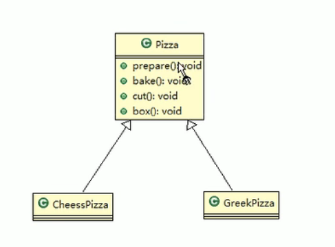

```java
/**
 * @author danghf
 * @version 1.0
 * 2022/11/15   7:18
 * 简单工厂模式
 */
public class Demo1 {
}
abstract class Pizza{
    public String name;
    public void prepare(){}//准备
    public void bake(){}//烘烤
    public void cut(){}//切割
    public void box(){}//打包
}
class APizza extends Pizza{}
class BPizza extends Pizza{}
/**
 * 订购披萨(各种Pizza)
 * 披萨的制作 prepare，bake, cut, box几个步骤
 * 优点是比较好理解，简单易操作。
 * 缺点是违反了设计模式的 ocp 原则，即对扩展开放，对修改关闭。即当我们给类增加新功能的时候，尽量不修
 * 改代码，或者尽可能少修改代码
 * 分析:修改代码可以接受，但是如果我们在其它的地方也有创建Pizza的代码，就意味着，也需要修改，而创建Pizza的代码，往往有多处。
 * 思路:把创建Pizza对象封装到一个类中，这样我们有新的Pizza种类时，只需要修改该类就可，
 * 其它有创建到Pizza对象的代码就不需要修改了.->简单工厂模式
 */
class OrderPizza {
    public Pizza pizza;
    public Pizza create(String orderType){
        // 制作
        if (orderType.equals("A")) {
            // 制作 A 类型的 pizza
            pizza = new APizza();
        } else if (orderType.equals("B")) {
            // 制作 B 类型的 pizza
            pizza = new BPizza();
        }
        // prepare，bake, cut, box各个步骤
        // pizza.prepare();
        // ...
        // pizza.box();
        return pizza;
    }
    // ====================================================================
    private PizzaFactory pizzaFactory = null;
    public OrderPizza(PizzaFactory pizzaFactory){
        setPizzaFactory(pizzaFactory);
    }

    public void setPizzaFactory(PizzaFactory pizzaFactory) {
        this.pizzaFactory = pizzaFactory;
    }
    public Pizza createPizza(String type){
        return pizzaFactory.createPizza(type);
    }

}
/**
 * 使用 简单工厂模式
 */
class PizzaFactory{
    public Pizza createPizza(String pizzaType){
        Pizza pizza = null;
        if (pizzaType.equals("A")){
            pizza = new APizza();
        }else if (pizzaType.equals("B")){
            pizza = new BPizza();
        }
        // pizza.prepare();
        // ...
        // pizza.box();
        return pizza;
    }
}
```


### [2]工厂方法模式

```
披萨项目新的需求：客户在点披萨时，可以点不同口味的披萨，比如 北京的奶酪 pizza、北京的胡椒 pizza 或
者是伦敦的奶酪 pizza、伦敦的胡椒 pizza。
```


- **模式介绍**

  1. 工厂方法模式设计方案：将披萨项目的实例化功能抽象成抽象方法，在不同的口味点餐子类中具体实现。

  2) 工厂方法模式：**定义了一个创建对象的抽象方法**，由子类决定要实例化的类。工厂方法模式将**对象的实例化推迟到子类**。


```java
/**
 * @author danghf
 * @version 1.0
 * 2022/11/15   7:54
 * 工厂方法模式
 */
public class Demo2 {
}
/**
 * 需要 北京的 APizza ，BPizza，伦敦的 APizza BPizza
 * 使用简单工厂模式，创建不同的简单工厂类，比如 BJPizzaSimpleFactory、LDPizzaSimpleFactory 等等.从当前
 * 这个案例来说，也是可以的，但是考虑到项目的规模，以及软件的可维护性、可扩展性并不是特别好
 */
abstract class OrderPizza2{
    public Pizza pizza = null;
    abstract Pizza create(String orderType);
    public OrderPizza2(String orderType){
        pizza = create(orderType);
        // do something
    }
}
/**
 * 工厂方法模式
 */
class BJOrderPizza extends OrderPizza2{
    @Override
    Pizza create(String orderType) {
        if (orderType.equals("A")){
            this.pizza = new APizza();
            this.pizza.name = "Beijing";
        }else {
            this.pizza = new BPizza();
            this.pizza.name = "Beijing";
        }
        return pizza;
    }

    public BJOrderPizza(String orderType) {
        super(orderType);
    }
}
class LDOrderPizza extends OrderPizza2{
    public LDOrderPizza(String orderType) {
        super(orderType);
    }

    @Override
    Pizza create(String orderType) {
        if (orderType.equals("A")){
            this.pizza = new APizza();
            this.pizza.name = "London";
        }else {
            this.pizza = new BPizza();
            this.pizza.name = "London";
        }
        return pizza;
    }
}
```


### [3]抽象工厂模式

- **基本介绍**
  1. 抽象工厂模式：定义了一个 **interface** **用于创建相关或有依赖关系的对象簇**，而无需指明具体的类
  2. 抽象工厂模式可以将简单工厂模式和工厂方法模式进行整合。
  3.  从设计层面看，抽象工厂模式就是对简单工厂模式的改进(或者称为进一步的抽象)。
  4. 将工厂抽象成**两层**，**AbsFactory(抽象工厂)** 和 **具体实现的工厂子类**。程序员可以根据创建对象类型使用对应的工厂子类。这样将单个的简单工厂类变成了工厂簇，更利于代码的维护和扩展


- **Code**

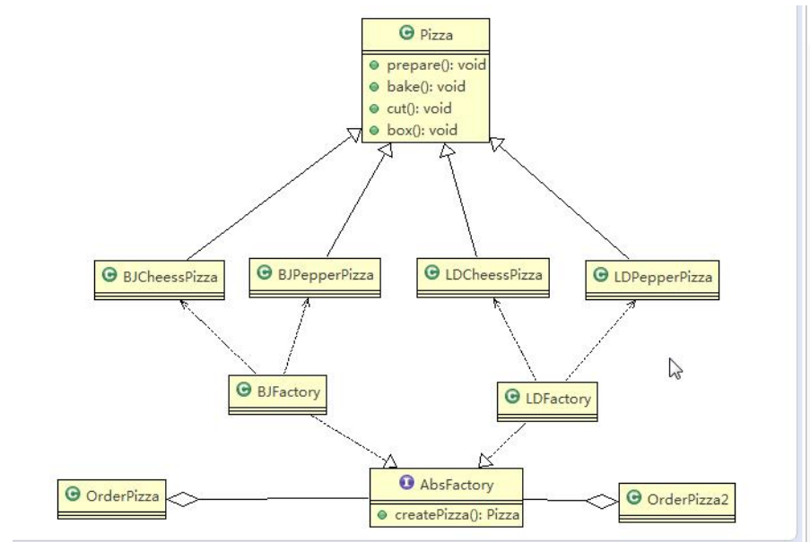

```java
/**
 * @author danghf
 * @version 1.0
 * 2022/11/15   8:35
 * 抽象工厂模式
 */
public class AbstractFactory {
}
interface Factory{
    Pizza create(String type);
}
class BJFactory implements Factory{
    @Override
    public Pizza create(String type) {
        Pizza pizza = null;
        if (type.equals("A")){
            pizza = new APizza();
            pizza.name = "Beijing";
        }else if (type.equals("B")){
            pizza = new BPizza();
            pizza.name = "Beijing";
        }
        return pizza;
    }
}
class LDFactory implements Factory{
    @Override
    public Pizza create(String type) {
        Pizza pizza = null;
        if (type.equals("A")){
            pizza = new APizza();
            pizza.name = "London";
        }else if (type.equals("B")){
            pizza = new BPizza();
            pizza.name = "London";
        }
        return pizza;
    }
}
class OrderPizza3{
    Factory factory;
    OrderPizza3(Factory factory){
        this.factory = factory;
    }
    public Pizza create(String type){
        return factory.create(type);
    }
}
```


- **小结**

1. 工厂模式的意义
   - 将实例化对象的代码提取出来，放到一个类中统一管理和维护，达到和主项目的依赖关系的解耦。从而、高项目的扩展和维护性。
2.  三种工厂模式 (简单工厂模式、工厂方法模式、抽象工厂模式)
3.  设计模式的依赖抽象原则
   1.  创建对象实例时，不要直接 new 类, 而是把这个 new 类的动作放在一个工厂的方法中，并返回。有的书上说，变量不要直接持有具体类的引用。
   2.  不要让类继承具体类，而是继承抽象类或者是实现 interface(接口)
   3. 不要覆盖基类中已经实现的方法。


> ```java
> // Calendar 日期类 JDK源码中使用 工厂模式
> Calendar instance = Calendar.getInstance();
> ```


## 3）原型模式 Prototype pattern

1. 克隆羊问题
   - 现在有一只羊 tom，姓名为: tom, 年龄为：1，颜色为：白色，请编写程序创建和 tom 羊 属性完全相同的 10只羊。


```java
public class Client1 {
    public static void main(String[] args) {
        // 传统方法
        Sheep sheep = new Sheep("tom", "18", "yellow");
        // 创建其他
        Sheep sheep1 = new Sheep(sheep.getName(), sheep.getAge(), sheep.getColor());
        // ...

    }
}
```

1.  优点是比较好理解，简单易操作。
2.  在创建新的对象时，总是需要重新获取原始对象的属性，如果创建的对象比较复杂时，效率较低
3.  总是需要重新初始化对象，而不是动态地获得对象运行时的状态, 不够灵活
4.  改进的思路分析


```
思路：Java 中 Object 类是所有类的根类，Object 类提供了一个 clone()方法，该方法可以将一个 Java 对象复制一份，但是需要实现 clone 的 Java 类必须要实现一个接口 Cloneable，该接口表示该类能够复制且具有复制的能力 =>原型模式
```


- **基本介绍**
  1.  原型模式(Prototype 模式)是指：用**原型实例指定创建对象的种类，并且通过拷贝这些原型，创建新的**对象
  2. 原型模式是一种创建型设计模式，允许一个对象再创建另外一个可定制的对象，无需知道如何创建的细节
  3. 工作原理是:通过将一个原型对象传给那个要发动创建的对象，这个要发动创建的对象通过请求原型对象拷贝它们自己来实施创建，即 **对象.clone()**


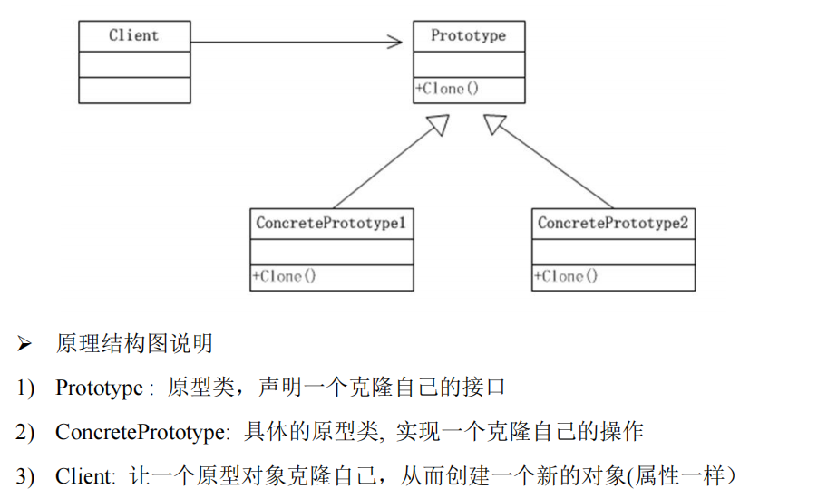


- **Code**

```java
@Data
@AllArgsConstructor
@NoArgsConstructor
@ToString
public class Sheep implements Cloneable{
    private String name;
    private String age;
    private String color;
    @Override
    protected Object clone() throws CloneNotSupportedException {
        Object clone = super.clone();// 默认浅拷贝
        Sheep sheep = (Sheep) clone;
        return sheep;
    }
}
```


```java
class Demo2{ // clone
    public static void main(String[] args) throws CloneNotSupportedException {
        Sheep sheep = new Sheep("tom", "18", "yellow");
        Sheep clone = (Sheep)sheep.clone();
        // tom 18 yellow
        // 默认浅拷贝
    }
}
```


```xml
<?xml version="1.0" encoding="UTF-8"?>
<beans xmlns="http://www.springframework.org/schema/beans"
       xmlns:xsi="http://www.w3.org/2001/XMLSchema-instance"
       xmlns:p="http://www.springframework.org/schema/p"
       xsi:schemaLocation="http://www.springframework.org/schema/beans http://www.springframework.org/schema/beans/spring-beans.xsd">
<!--  scope="prototype" 原型模式 scope="prototype"/"singleton"-->
    <!-- 使用的有参构造 -->
  <bean id="sheep" class="model.prototype.Sheep" scope="prototype">
    <constructor-arg name="age" value="18"/>
    <constructor-arg name="name" value="zd"/>
    <constructor-arg name="color" value="red"/>
  </bean>

</beans>
```


```java
public class JDK {
    public static void main(String[] args) {
        ClassPathXmlApplicationContext context =
                new ClassPathXmlApplicationContext("bean.xml");
        // 通过 id 获取
        Object sheep = context.getBean("sheep");
        System.out.println(sheep);
        //Sheep(name=zd, age=18, color=red)
        Object sheep1 = context.getBean("sheep");
        // false 
        System.out.println(sheep1 == sheep);
    }
}
```

```java
public Object getBean(String name) throws BeansException {
        this.assertBeanFactoryActive();
        return this.getBeanFactory().getBean(name);
    }

public Object getBean(String name) throws BeansException {
        return this.doGetBean(name, (Class)null, (Object[])null, false);
    }
protected void markBeanAsCreated(String beanName) {
        if (!this.alreadyCreated.contains(beanName)) {
            synchronized(this.mergedBeanDefinitions) {
                if (!this.alreadyCreated.contains(beanName)) {
                    this.clearMergedBeanDefinition(beanName);
                    this.alreadyCreated.add(beanName);
                }
            }
        }

    }
if (mbd.isSingleton()) {
                    sharedInstance = this.getSingleton(beanName, () -> {
                        try {
                            return this.createBean(beanName, mbd, args);
                        } catch (BeansException var5) {
                            this.destroySingleton(beanName);
                            throw var5;
                        }
                    });
                    beanInstance = this.getObjectForBeanInstance(sharedInstance, name, beanName, mbd);
                } 
```


### 深拷贝和浅拷贝

- **浅拷贝介绍**

  1. 对于数据类型是基本数据类型的成员变量，浅拷贝会直接进行值传递，也就是将该属性值复制一份给新的对象。

  2. 对于数据类型是引用数据类型的成员变量，比如说成员变量是某个数组、某个类的对象等，那么浅拷贝会进行引用传递，也就是只是将该**成员变量**的引用值（内存地址）复制一份给新的对象。因为实际上两个对象的该成员变量都指向同一个实例。在这种情况下，在一个对象中修改该成员变量会影响到另一个对象的该成员变量值

  3. 浅拷贝是使用默认的 clone()方法来实现

     sheep = (Sheep) super.clone();

- **深拷贝介绍**

  1. 复制对象的所有基本数据类型的成员变量值
  2. 为所有引用数据类型的成员变量申请存储空间，并复制每个引用数据类型成员变量所引用的对象，直到该对象可达的所有对象。也就是说，对象进行深拷贝要对整个对象(包括对象的引用类型)进行拷贝
  3. 深拷贝实现方式 1：重写 **clone** 方法来实现深拷贝
  4. 深拷贝实现方式 2：通过**对象序列化**实现深拷贝(推荐)


- **Code**

```java
/**
 * @author danghf
 * @version 1.0
 * 2022/11/15   17:32
 * 深拷贝实现
 */
public class DeepCopy {
    public static void main(String[] args) throws CloneNotSupportedException {
        DeepTarget deepTarget = new DeepTarget("name", new Target("target"));
        DeepTarget clone = (DeepTarget) deepTarget.clone();
        DeepTarget clone2 = (DeepTarget) deepTarget.clone();
        System.out.println(clone == clone2); // false
    }
}

@ToString
@Data
@AllArgsConstructor
@NoArgsConstructor
class DeepTarget implements Serializable, Cloneable {
    private String name;
    private Target target; // 引用类型

    // 深拷贝方式 1： clone
    @Override
    protected Object clone() throws CloneNotSupportedException {
        // 完成基本数据类型 和 String 的克隆
        Object clone = super.clone();
        //对引用类型的属性，进行单独处理
        DeepTarget deepTarget = (DeepTarget) clone;
        deepTarget.target = (Target) deepTarget.target.clone();
        return deepTarget;
    }

    // 深拷贝方式 2：序列化
    public Object deepCopy() {
        // try-with-resources 自动关闭流
        try (
                // 创建流对象
                // 输出流
                ByteArrayOutputStream bos = new ByteArrayOutputStream();
                ObjectOutputStream oos = new ObjectOutputStream(bos);
                // 输入流
                ByteArrayInputStream bis = new ByteArrayInputStream(bos.toByteArray());
                ObjectInputStream ois = new ObjectInputStream(bis);
        ) {
            // 序列化
            oos.writeObject(this);// 当前这个对象以对象流的方式输出
            // 反序列化
            Object object = ois.readObject();
            return object;
        } catch (Exception e) {
            e.printStackTrace();
        }
        return null;
    }
}

@Data
@ToString
@AllArgsConstructor
@NoArgsConstructor
class Target implements Serializable, Cloneable {
    private static final long serialVersionUID = 1L;
    private String name;

    @Override
    protected Object clone() throws CloneNotSupportedException {
        return super.clone();
    }
}
```


- **注意事项**
  1. 创建新的对象比较复杂时，可以利用原型模式简化**对象的创建过程，同时也能够提高**效率
  2. 不用重新初始化对象，而是**动态地获得对象运行时**的状态
  3. 如果原始对象发生变化(增加或者减少属性)，其它克隆对象的也会发生相应的变化，无需修改代码
  4.  在实现深克隆的时候可能需要比较复杂的代码
  5. **缺点**：需要为每一个类配备一个克隆方法，这对全新的类来说不是很难，但对已有的类进行改造时，需要修改其源代码，违背了 ocp 原则，这点请同学们注意.


## 4）建造者模式 Builder pattern

- **项目需求**

```
1) 需要建房子：这一过程为打桩、砌墙、封顶
2) 房子有各种各样的，比如普通房，高楼，别墅，各种房子的过程虽然一样，但是要求不要相同的. 
3) 请编写程序，完成需求.
```

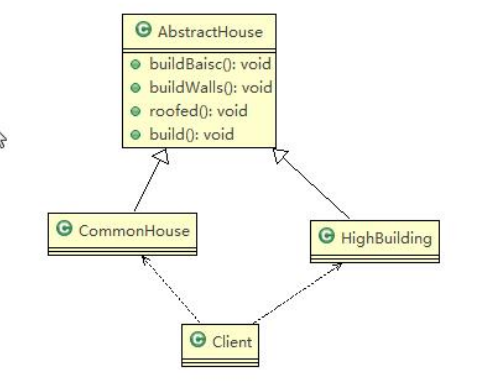

- **传统Code**

```java
/**
 * @author danghf
 * @version 1.0
 * 2022/11/15   18:34
 * 建造者模式
 */
public class Demo1 {
    public static void main(String[] args) {
        CommonHouse commonHouse = new CommonHouse();
        commonHouse.build();
    }
}
abstract class AbstractHouse{
    //打地基
    public abstract void buildBasic();
    //砌墙
    public abstract void buildWalls();
    //封顶
    public abstract void roofed();
    public void build() {
        buildBasic();
        buildWalls();
        roofed();
    }
}
class CommonHouse extends AbstractHouse {
    @Override
    public void buildBasic() {
        System.out.println(" 普通房子打地基 ");
    }
    @Override
    public void buildWalls() {
        System.out.println(" 普通房子砌墙 ");
    }
    @Override
    public void roofed() {
        System.out.println(" 普通房子封顶 ");
    }
}
```


1. 优点是比较好理解，简单易操作。
2. 设计的程序结构，过于简单，没有设计缓存层对象，程序的扩展和维护不好. 也就是说，这种设计方案，把产品(即：房子) 和 创建产品的过程(即：建房子流程) 封装在一起，耦合性增强了。
3. 解决方案：将产品和产品建造过程解耦 => **建造者模式**


- **模式介绍**
  1. 建造者模式（**Builder Pattern**） 又叫**生成器模式**，是一种对象**构建模式**。它可以将复杂对象的建造过程抽象出来（抽象类别），使这个抽象过程的不同实现方法可以构造出不同表现（属性）的对象
  2. 建造者模式 是一步一步创建一个复杂的对象，它允许用户只通过指定复杂对象的类型和内容就可以构建它们，用户不需要知道内部的具体构建细节。
- **建造者模式的四个角色**
  1.  Product（产品角色）： 一个具体的产品对象。
  2.  Builder（抽象建造者）： 创建一个 Product 对象的各个部件指定的 **接口/抽象类**。
  3.  ConcreteBuilder（具体建造者）： 实现接口，构建和装配各个部件。
  4.  Director（指挥者）： 构建一个使用 Builder 接口的对象。它主要是用于创建一个复杂的对象。它主要有两个作用，一是：隔离了客户与对象的生产过程，二是：负责控制产品对象的生产过程


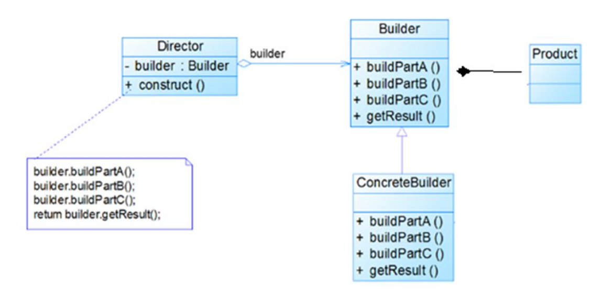


**Code**

> ```
> 将产品 与 建造过程 隔离
> ```


```java
/**
 * @author danghf
 * @version 1.0
 * 2022/11/16   7:38
 * 建造者模式
 */
public class Demo2 {
    public static void main(String[] args) {
        HouseDirector houseDirector = new HouseDirector(new CommonHouseBuilder());
        House constructor = houseDirector.constructor();
    }
}
@Data
// Product 产品
class House{
    private String basic;//地基
    private String walls;//墙
    private String roofed;//顶
}
// Builder 抽象建造者
abstract class HouseBuilder{
    protected House house = new House();
    // 建造流程
    public abstract void buildBasic();
    public abstract void buildWalls();
    public abstract void roofed();
    // 建造
    public House build(){
        return house;
    }
}
// ConcreteBuilder 具体的建造者
class CommonHouseBuilder extends HouseBuilder{
    @Override
    public void buildBasic() {
        house.setBasic("地基");
        System.out.println(" 普通房子打地基 ");
    }
    @Override
    public void buildWalls() {
        house.setWalls("砌墙");
        System.out.println(" 普通房子砌墙 ");
    }
    @Override
    public void roofed() {
        house.setRoofed("封顶");
        System.out.println(" 普通房子封顶 ");
    }
}
// Director 指挥者
class HouseDirector{
    HouseBuilder houseBuilder = null;
    HouseDirector(HouseBuilder houseBuilder){
        this.houseBuilder = houseBuilder;
    }
    // 处理建造房子流程交给指挥者
    public House constructor(){
        // 每次创建前，将house重置，不然每次是同一个对象
        houseBuilder.house = new House();
        houseBuilder.buildBasic();
        houseBuilder.buildWalls();
        houseBuilder.roofed();
        return houseBuilder.build();
    }
}
```


- **源码 StringBuilder**

```
StringBuilder --> abstractStringBuilder --> Appendable
Appendable 抽象建造者：定义多个append方法
abstractStringBuilder 建造者：实现了Appendable中的方法
StringBuilder 指挥者
```


- **建造者模式的注意事项和细节**
  1. 客户端(使用程序)不必知道产品内部组成的细节，将产品本身与产品的创建过程解耦，使得相同的创建过程可以创建不同的产品对象
  2. 每一个具体建造者都相对独立，而与其他的具体建造者无关，因此可以很方便地替换具体建造者或增加新的具体建造者， 用户使用不同的具体建造者即可得到不同的产品对象
  3. 可以更加精细地控制产品的创建过程 。将复杂产品的创建步骤分解在不同的方法中，使得创建过程更加清晰，也更方便使用程序来控制创建过程
  4. 增加新的具体建造者无须修改原有类库的代码，指挥者类针对抽象建造者类编程，系统扩展方便，符合“开闭原则”
  5. 建造者模式所创建的产品一般具有较多的共同点，其组成部分相似，如果产品之间的差异性很大，则不适合使用建造者模式，因此其使用范围受到一定的限制。
  6. 如果产品的内部变化复杂，可能会导致需要定义很多具体建造者类来实现这种变化，导致系统变得很庞大，因此在这种情况下，要考虑是否选择建造者模式
  7. 抽象工厂模式实现对产品家族的创建，一个产品家族是这样的一系列产品：具有不同分类维度的产品组合，采用抽象工厂模式不需要关心构建过程，只关心什么产品由什么工厂生产即可。而建造者模式则是要求按照指定的蓝图建造产品，它的主要目的是通过组装零配件而产生一个新产品


## 5）适配器模式 Adapter Mode

- **基本介绍**
  1. 适配器模式(Adapter Pattern)将某个类的接口转换成客户端期望的另一个接口表示，**主的目的是兼容性**，让原本因接口不匹配不能一起工作的两个类可以协同工作。其别名为包装器(Wrapper)
  2. 适配器模式属于结构型模式
  3. 主要分为三类：**类适配器模式、对象适配器模式、接口适配器模**式


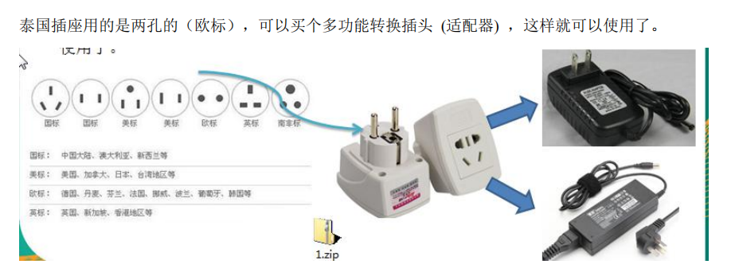


- **工作原理**
  1. 适配器模式：将一个类的接口转换成另一种接口.让原本接口不兼容的类可以兼容
  2. 从用户的角度看不到被适配者，是解耦的
  3. 用户调用适配器转化出来的目标接口方法，适配器再调用被适配者的相关接口方法


### [1] 类适配器

- **Code**

```java
/**
 * @author danghf
 * @version 1.0
 * 2022/11/16   8:17
 * 适配器模式 -->  类适配器
 */
public class Demo1 {
    public static void main(String[] args) {
        Phone phone = new Phone();
        Current220V current220V = new Current220V();// 实际电源
        // 通过适配器转换
        phone.charging(new AdaptCurrent());
    }
}
// 适配器 extends 被适配器类  implements 适配接口
class AdaptCurrent extends Current220V implements I5V{
    @Override
    public int output() {
        int i = this.get();
        return i / 44;
    }
}
// 应用
class Phone{
    // 充电
    public void charging(I5V current){
        int output = current.output();
        if (output > 5){
            System.out.println("电压过高");
        }else {
            System.out.println("success");
        }
    }
}
// 适配接口
interface I5V{//
    int output();
}
// 被适配 类
class Current220V{ // 电流
    public int get(){
        return 220;// 输出220V电压
    }
}

class Current5V implements I5V{
    @Override
    public int output(){
        return 5;
    }
}
```


- **类适配器注意**
  1. Java 是单继承机制，所以类适配器需要继承 src 类这一点算是一个缺点, 因为这要求 dst 必须是接口，有一定局限性;（src被适配器类，dst目标）
  2.  src 类的方法在 Adapter 中都会暴露出来，也增加了使用的成本。
  3. 由于其继承了 src 类，所以它可以根据需求重写 src 类的方法，使得 Adapter 的灵活性增强了


### [2] 对象适配器

1. 基本思路和类的适配器模式相同，只是将 Adapter 类作修改，不是继承 src 类，而是持有 src 类的实例，以解决兼容性的问题。 即：持有 src 类，实现 dst 类接口，完成 src->dst 的适配
2.  根据“**合成复用原则**”，在系统中尽量使用**关联关系（聚合）来替代继承**关系。
3. 对象适配器模式是适配器模式常用的一种


```java
/**
 * @author danghf
 * @version 1.0
 * 2022/11/16   8:58
 * 适配器模式 --> 对象适配器
 */
public class ObjectAdapt {
}
class AdaptCurrent2 implements I5V{
    private Current220V current220V;
    AdaptCurrent2(Current220V current220V){
        this.current220V = current220V;
    }
    @Override
    public int output() {
        if (current220V == null){
            return -1;
        }
        return current220V.get() / 44;
    }
}
```


### [3] 接口适配器

- **介绍**
  1. 一些书籍称为：适配器模式(Default Adapter Pattern)或缺省适配器模式。
  2.  核心思路：**当不需要全部实现接口提供的方法时，可先设计一个抽象类实现接口**，并为该接口中每个方法提供一个默认实现（空方法），那么该抽象类的子类可有选择地覆盖父类的某些方法来实现需求
  3.  适用于一个接口不想使用其所有的方法的情况


```java
package model.adapter;

/**
 * @author danghf
 * @version 1.0
 * 2022/11/16   9:17
 */

public class JDK {
    public static void main(String[] args) {
        //DispatcherServlet
        //  protected void doDispatch(HttpServletRequest request, HttpServletResponse response) throws Exception
              // 获取需要映射的 controller
        //    mappedHandler = this.getHandler(processedRequest, false);
              // 获取适配器
        //    HandlerAdapter ha = this.getHandlerAdapter(mappedHandler.getHandler());
              // 通过适配器调用 controller的方法并返回 ModelAndView
        //    mv = ha.handle(processedRequest, response, mappedHandler.getHandler());
        /*
        protected HandlerAdapter getHandlerAdapter(Object handler) throws ServletException {
            Iterator i$ = this.handlerAdapters.iterator();

            HandlerAdapter ha;
            do {
                if (!i$.hasNext()) {
                    throw new ServletException("No adapter for handler [" + handler + "]: The DispatcherServlet configuration needs to include a HandlerAdapter that supports this handler");
                }

                ha = (HandlerAdapter)i$.next();
                if (this.logger.isTraceEnabled()) {
                    this.logger.trace("Testing handler adapter [" + ha + "]");
                }
            } while(!ha.supports(handler));

            return ha;
        }*/


    }
}
```


## 6）桥接模式 Bridging mode

- **问题**

  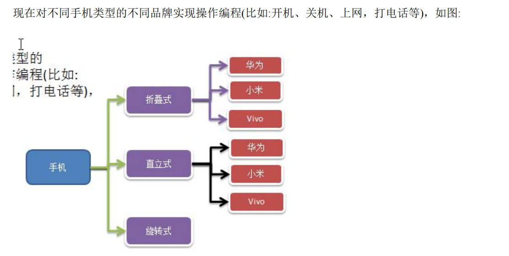

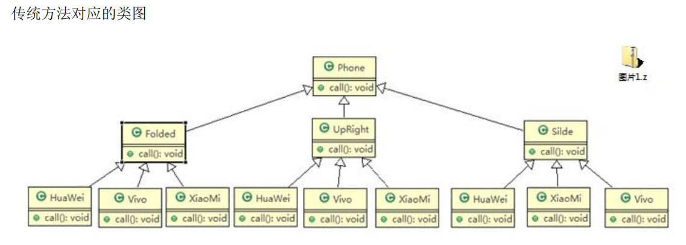

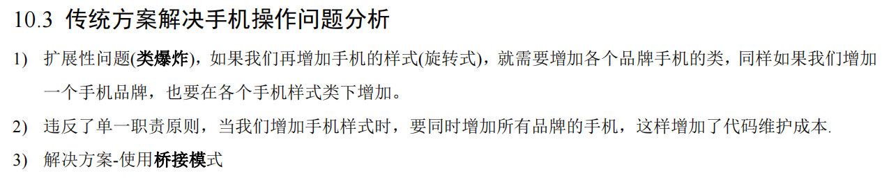


- **基本介绍**
  1. 桥接模式(Bridge 模式)是指：将实现与抽象放在两个不同的类层次中，使两个层次可以独立改变
  2. 是一种结构型设计模式
  3. Bridge 模式基于类的最小设计原则，通过使用封装、聚合及继承等行为让不同的类承担不同的职责。它的主要特点是把抽象(Abstraction)与行为实现(Implementation)分离开来，从而可以保持各部分的独立性以及应对他们的功能扩展


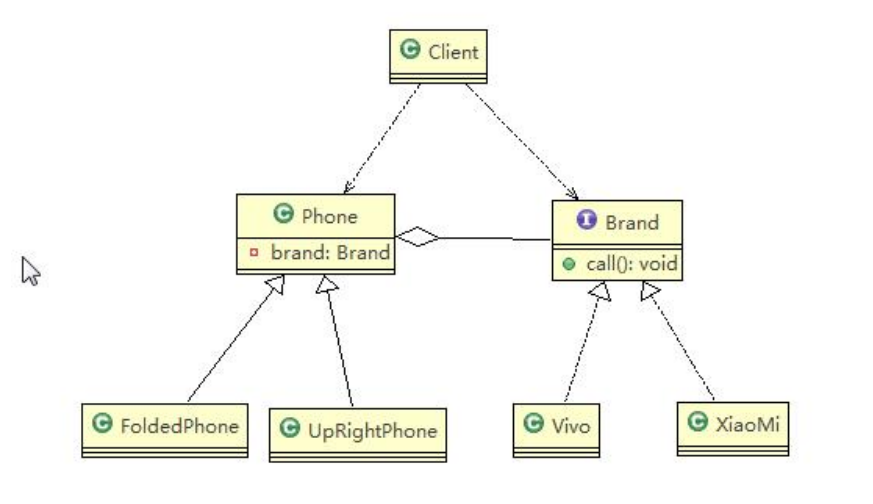


- **Code**

  ```java
  /**
   * @author danghf
   * @version 1.0
   * 2022/11/16   10:21
   * 桥接模式
   */
  public class Demo {
  }
  // 品牌
  interface Brand{
      // 打电话
      void call();
      void open();
      void close();
  }
  class XiaoMi implements Brand{
      @Override
      public void call() {
          System.out.println("小米");
      }
      @Override
      public void open() {
          System.out.println("小米");
      }
      @Override
      public void close() {
          System.out.println("小米");
      }
  }
  class ViVo implements Brand{
      @Override
      public void call() {
          System.out.println("ViVo");
      }
      @Override
      public void open() {
          System.out.println("ViVo");
      }
      @Override
      public void close() {
          System.out.println("ViVo");
      }
  }
  abstract class Phone{
      // 组合品牌
      private Brand brand;
      Phone(Brand brand){
          this.brand = brand;
      }
      public void call() {
          brand.call();
      }
      public void open() {
          brand.open();
      }
      public void close() {
          brand.close();
      }
  }
  // 折叠手机
  class FoldPhone extends Phone{
      public FoldPhone(Brand brand) {
          super(brand);
      }
  
      @Override
      public void call() {
          super.call();
          System.out.println("折叠手机"+this.getBrand()+"打电话");
      }
  }
  /**
   * 往后无论是新增品牌还是手机样式都很方便
   */
  ```

  

```java
/**
 * @author danghf
 * @version 1.0
 * 2022/11/16   10:38
 * JDBC
 */
public class JDK {
    public static void main(String[] args) {
        // Driver
        //  static {
        //        try {
        //             注册 Driver
        //            DriverManager.registerDriver(new Driver());
        //        } catch (SQLException var1) {
        //            throw new RuntimeException("Can't register driver!");
        //        }
        //    }
        // 
        //                                      interface java.sql.Connection
        // interface com.mysql.jdbc.Connection                                Oracle协议。。。
        // interface com.mysql.jdbc.MysqlConnection
        // class ConnectionImpl
    }
}
```

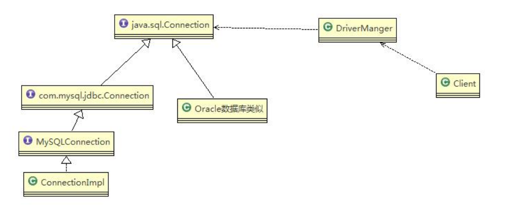


- **注意事项**
  1. 实现了抽象和实现部分的分离，从而极大的提供了系统的灵活性，让抽象部分和实现部分独立开来，这有助于系统进行分层设计，从而产生更好的结构化系统。
  2. 对于系统的高层部分，只需要知道抽象部分和实现部分的接口就可以了，其它的部分由具体业务来完成。
  3. **桥接模式替代多层继承方案**，可以减少**子类的个数**，降低系统的管理和维护成本。
  4. 桥接模式的引入增加了系统的理解和设计难度，由于聚合关联关系建立在抽象层，要求开发者针对抽象进行设计和编程
  5. 桥接模式要求**正确识别出系统中两个独立变化的维度****(****抽象、和实现****)**，因此其使用范围有一定的局限性，即需要有这样的应用场景。

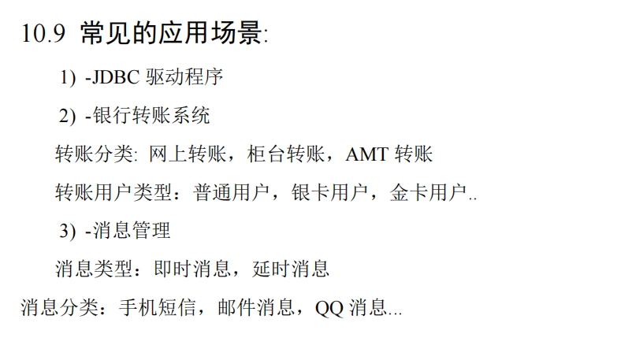

## 7）装饰者设计模式 Decorator Mode

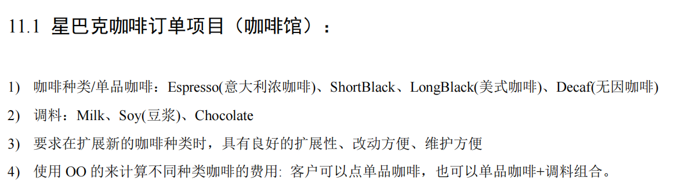


- **模式介绍**
  1. 装饰者模式：**动态的将新功能附加到对象上**。在对象功能扩展方面，它比继承更有弹性，**装饰者模式也体现了开闭原则(ocp)**


- **原理**
  1. Component 主体：比如 咖啡
  2. ConcreteComponent 具体的主体：比如单品咖啡，美食咖啡
  3. Decorator 装饰者：调料

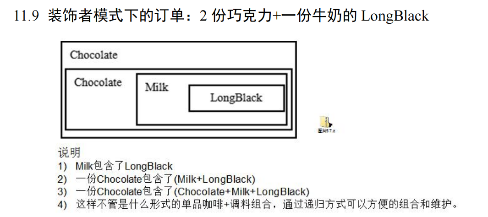


- **Code**

```java
/**
 * @author danghf
 * @version 1.0
 * 2022/11/16   13:42
 * 装饰者模式
 */
public class Demo {
    public static void main(String[] args) {
        // 一份 LongBlack
        LongBlack longBlack = new LongBlack();
        // 加 一份糖
        Sugar sugar = new Sugar(longBlack);
        // 加 一份巧克力
        Chocolate chocolate = new Chocolate(sugar);
        // 加 一份巧克力
        chocolate = new Chocolate(chocolate);
        System.out.println(chocolate.total());
        System.out.println(chocolate.getDes());
    }
}

@Data
abstract class Drink {
    private String des;
    private float price;

    public abstract float total();
}

class Coffee extends Drink {
    @Override
    public float total() {
        // 对于一个单品 coffer 价格就是单价
        return super.getPrice();
    }
}

class Espresso extends Coffee {
    Espresso() {
        setPrice(6.0f);
        setDes("Espresso->" + getPrice());
    }
}

class LongBlack extends Coffee {
    LongBlack() {
        setPrice(7.0f);
        setDes("LongBlack->" + getPrice());
    }
}

// 装饰者
class Decorator extends Drink {
    Decorator(Drink drink) {
        this.drink = drink;
    }

    private Drink drink;

    @Override
    public float total() {
        // 自己的 价格 + 被修饰的价格
        return super.getPrice() + drink.total();
    }

    @Override
    public String getDes() {
        return super.getDes() + " -> " + super.getPrice()
                + "\n" + drink.getDes();
    }
}

// 巧克力
class Chocolate extends Decorator {
    Chocolate(Drink drink) {
        super(drink);
        setDes("Chocolate");
        setPrice(2.0f);
    }
}

// 糖
class Sugar extends Decorator {
    Sugar(Drink drink) {
        super(drink);
        setDes("Sugar");
        setPrice(1.0f);
    }
}
```


- **装饰者模式在 JDK 中使用**

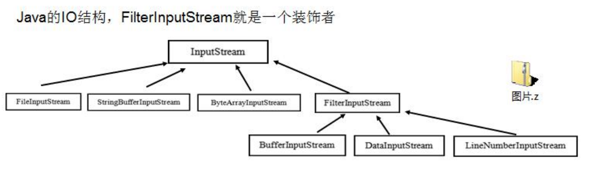

```java
/**
 * @author danghf
 * @version 1.0
 * 2022/11/16   14:25
 * IO 中 使用了装饰者模式
 */
public class JDK {
    public static void main(String[] args) {
//        public abstract class InputStream implements Closeable  (drink)
//        class FileInputStream extends InputStream (coffee)
        // 修饰者 (Decorator)
//        public class FilterInputStream extends java.io.InputStream {
//            /**
//             * The input stream to be filtered.
//             */
        // 被修饰者
//            protected volatile java.io.InputStream in;
//        }
//        (糖)
//        DataInputStream 是 FilterInputStream 子类，具体的修饰者
    }
}
```


## 8）组合模式 Combination mode

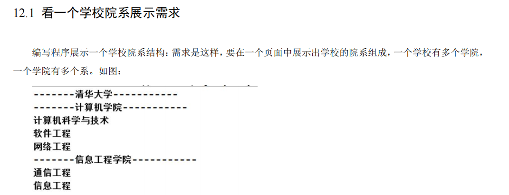


- **基本介绍**
  1. 组合模式（Composite Pattern），又叫部分整体模式，它创建了对象组的树形结构，将对象组合成树状结构以表示**“整体-部分**”的层次关系。
  2.  组合模式依据**树形结构来组合对象**，用来表示部分以及整体层次。
  3.  这种类型的设计模式属于结构型模式。
  4. 组合模式使得**用户对单个对象和组合对象的访问具有一致性**，即：组合能让客户以一致的方式处理个别对象以及组合对象


- **组成**
  1. Component :这是组合中对象声明接口，在适当情况下，实现所有类共有的接口默认行为,用于访问和管理Component 子部件, Component 可以是抽象类或者接口
  2. Leaf : 在组合中表示叶子节点，叶子节点没有子节点
  3.  Composite :非叶子节点， 用于存储子部件， 在 Component 接口中实现 子部件的相关操作，比如add,remove。

```java
/**
 * @author danghf
 * @version 1.0
 * 2022/11/16   16:47
 * 组合模式
 */
public class Demo {
    public static void main(String[] args) {
        University xsyu = new University("皇家淀粉学院","xsyu");
        College college = new College("计算机学院", "计算机学院");
        College college1 = new College("理学院", "理学院");
        college1.add(new Department("数学系", ""));
        college1.add(new Department("物理系", ""));
        college.add(new Department("计算机系", ""));
        xsyu.add(college);
        xsyu.add(college1);
        xsyu.show();
    }
}

@Data
abstract class AbstractComponent {
    private String name;
    private String description;

    public AbstractComponent(String name, String description) {
        this.name = name;
        this.description = description;
    }

    protected void add(AbstractComponent abstractComponent) {
        // 默认实现 抛出不支持操作异常
        throw new UnsupportedOperationException();
    }

    protected void remove(AbstractComponent abstractComponent) {
        throw new UnsupportedOperationException();
    }

    protected void show() {
        throw new UnsupportedOperationException();
    }
}

/**
 * 大学 (非叶子结点)
 */
class University extends AbstractComponent {
    private final List<AbstractComponent> components = new ArrayList<>();

    public University(String name, String description) {
        super(name, description);
    }

    @Override
    protected void add(AbstractComponent component) {
        components.add(component);
    }

    @Override
    protected void remove(AbstractComponent component) {
        components.remove(component);
    }

    @Override
    protected void show() {
        System.out.println("-------" + this.getName());
        for (AbstractComponent component : components) {
            component.show();
        }
    }
}

/**
 * 学院 (非叶子结点)
 */
class College extends AbstractComponent {
    College(String name, String description) {
        super(name, description);
    }

    private final List<AbstractComponent> departments = new ArrayList<>();

    @Override
    protected void add(AbstractComponent component) {
        departments.add(component);
    }

    @Override
    protected void remove(AbstractComponent component) {
        departments.remove(component);
    }

    @Override
    protected void show() {
        System.out.println("------" + this.getName());
        for (AbstractComponent department : departments) {
            department.show();
        }
    }
}

/**
 * 系 leaf
 */
class Department extends AbstractComponent {
    public Department(String name, String description) {
        super(name, description);
    }
    // 叶子结点不支持 add remove

    @Override
    protected void show() {
        System.out.println("--" + this.getName());
    }
}
```


- **Jdk hashMap中使用组合模式**

```java
public class Jdk {
    public static void main(String[] args) {
        /**
         * 1、Map是一个抽象的构建
         * 2、HashMap 是一个中间构建，实现/继承了相关方法
         *    put  putAll
         * 3、Node 是HashMap的静态内部类，类似 leaf结点
         */
        HashMap<Integer, String> hashMap = new HashMap<>(16);
        // 直接放在叶子结点
        hashMap.put(0,"0");
        HashMap<Integer, String> map = new HashMap<>(16);
        map.put(1, "1");
        map.put(2, "2");
        hashMap.putAll(map);
        System.out.println(hashMap);
    }
}

```


- **注意事项**
  1. 简化客户端操作。客户端只需要面对一致的对象而不用考虑整体部分或者节点叶子的问题。
  2. 具有较强的扩展性。当我们要更改组合对象时，我们只需要调整内部的层次关系，客户端不用做出任何改动. 
  3. 方便创建出复杂的层次结构。客户端不用理会组合里面的组成细节，容易添加节点或者叶子从而创建出复杂的树形结构
  4. 需**要遍历组织机构，或者处理的对象具有树形结构时**, 非常**适合使用组合模式**. 
  5. 要求较高的抽象性，如果**节点和叶子有很多差异性的话**，比如很多方法和属性都不一样**，不适合使用组合模**式


## 9）外观模式 Facade mode

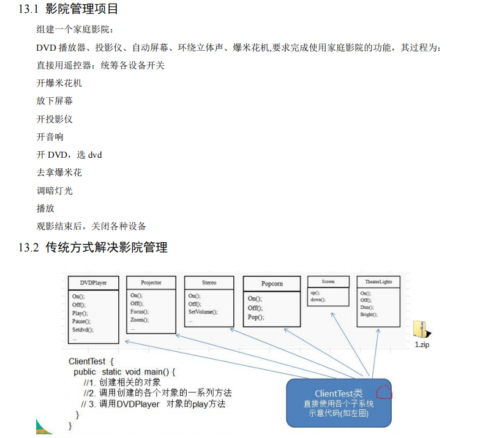


- **问题分析**
  1. 在 ClientTest 的 main 方法中，创建各个子系统的对象，并直接去调用子系统(对象)相关方法，会造成调用过程混乱，没有清晰的过程
  2. 不利于在 ClientTest 中，去维护对子系统的操作
  3. 解决思路：**定义一个高层接口**，给**子系统中的一组接口提供一个一致的界面**(比如在高层接口提供四个方法（ready, play, pause, end )，用来访问子系统中的一群接口
  4. 也就是说 就是通过定义一个一致的接口(界面类)，用以屏蔽内部子系统的细节，使得调用端只需跟这个接口发生调用，而无需关心这个子系统的内部细节 => **外观模式**


- **基本介绍**
  1. 外观模式（Facade），也叫“过程模式：外观模式为子系统中的一组接口**提供一个一致的界面**，此模式定义了一个高层接口，这个接口使得这一子系统更加容易使用
  2.  外观模式通过定义一个一致的接口，用**以屏蔽内部子系统的细节**，使得**调用端只需跟这个接口发生调用**，而无需关心这个子系统的内部细节

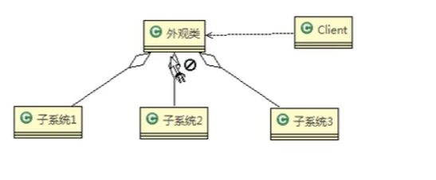

- **Code**

```java
/**
 * @author danghf
 * @version 1.0
 * 2022/11/17   9:07
 * 外观模式
 */
public class Demo {
    public static void main(String[] args) {
        Facade facade = new Facade();
        facade.ready();
        facade.sus();
        facade.off();
    }
}

/**
 * 外观
 */
class Facade{
    /**
     * 字体对象
     */
    private Dvd dvd;
    private Projector projector;
    private Popcorn popcorn;
    Facade(){
        dvd = Dvd.getInstance();
        projector = Projector.getInstance();
        popcorn = Popcorn.getInstance();
    }

    /**
     * 准备
     */
    public void ready(){
        dvd.on();
        projector.down();
        popcorn.on();
    }
    public void sus(){
        dvd.sus();
    }
    public void off(){
        dvd.off();
        projector.up();
        popcorn.off();
    }
}
class Dvd{
    private Dvd(){}

    private static final class DvdHolder {
        static final Dvd dvd = new Dvd();
    }
    public static Dvd getInstance(){
        return DvdHolder.dvd;
    }
    public void on(){
        System.out.println(this + "开机");
    }
    public void off(){
        System.out.println(this + "关机");
    }
    public void play(){
        System.out.println(this + "播放");
    }
    public void sus(){
        System.out.println(this + "暂停");
    }
}

/**
 * 爆米花
 */
class Popcorn{
    public Popcorn(){}
    public static class PopcornHolder{
        static final Popcorn popcorn = new Popcorn();
    }
    public static Popcorn getInstance(){
        return PopcornHolder.popcorn;
    }
    public void on(){
        System.out.println(this + "开机");
    }
    public void off(){
        System.out.println(this + "关机");
    }
}

/**
 * 投影仪
 */
class Projector{
    private Projector(){}
    private static class ProjectorHolder{
        static final Projector projector = new Projector();
    }
    public static Projector getInstance(){
        return ProjectorHolder.projector;
    }
    public void up(){
        System.out.println("投影仪上升");
    }
    public void down(){
        System.out.println("投影仪下降");
    }
}
```


- **JDK 源码**

```java
public class Jdk {
    // mybatis->Configuration-> MetaObject()
    public static void main(String[] args) {
        /**
         * mybatis Configuration org.apache.ibatis.session.Configuration
         *      protected Properties variables;
         *      protected ReflectorFactory reflectorFactory;
         *      protected ObjectFactory objectFactory;
         *      protected ObjectWrapperFactory objectWrapperFactory;
         *      protected final MapperRegistry mapperRegistry
         *
         *      public MetaObject newMetaObject(Object object) {
         *          return MetaObject.forObject(object, objectFactory, objectWrapperFactory, reflectorFactory);
         *       }
         *
         *       public static MetaObject forObject(Object object, ObjectFactory objectFactory, ObjectWrapperFactory objectWrapperFactory, ReflectorFactory reflectorFactory) {
         *           if (object == null) {
         *               return SystemMetaObject.NULL_META_OBJECT;
         *            } else {
         *                  return new MetaObject(object, objectFactory, objectWrapperFactory, reflectorFactory);
         *              }
         *       }
         *
         *       private MetaObject(Object object, ObjectFactory objectFactory, ObjectWrapperFactory objectWrapperFactory, ReflectorFactory reflectorFactory) {
         *            this.originalObject = object;
         *            this.objectFactory = objectFactory;
         *            this.objectWrapperFactory = objectWrapperFactory;
         *            this.reflectorFactory = reflectorFactory;
         *
         *           if (object instanceof ObjectWrapper) {
         *           this.objectWrapper = (ObjectWrapper) object;
         *            } else if (objectWrapperFactory.hasWrapperFor(object)) {
         *             this.objectWrapper = objectWrapperFactory.getWrapperFor(this, object);
         *             } else if (object instanceof Map) {
         *            this.objectWrapper = new MapWrapper(this, (Map) object);
         *           } else if (object instanceof Collection) {
         *              this.objectWrapper = new CollectionWrapper(this, (Collection) object);
         *            } else {
         *             this.objectWrapper = new BeanWrapper(this, object);
         *             }
         *       }
         */
    }
}
```


- **注意事项**
  1. 外观模式**对外屏蔽了子系统的细节**，因此外观模式降低了客户端对子系统使用的复杂性
  2.  外观模式对客户端与子系统的耦合关系 - 解耦，让子系统内部的模块更易维护和扩展
  3. 通过合理的使用外观模式，可以帮我们更好的**划分访问的层次**
  4. 当系统需要进行分层设计时，可以考虑使用 Facade 模式
  5. 在维护一个遗留的大型系统时，可能这个系统已经变得非常难以维护和扩展，此时可以考虑为新系统开发一个Facade 类，来提供遗留系统的比较清晰简单的接口，让新系统与 Facade 类交互，提高复用性
  6. 不能过多的或者不合理的使用外观模式，使用外观模式好，还是直接调用模块好。要以让系统有层次，利于维护为目的。


## 10）享元模式  Flyweight Pattern

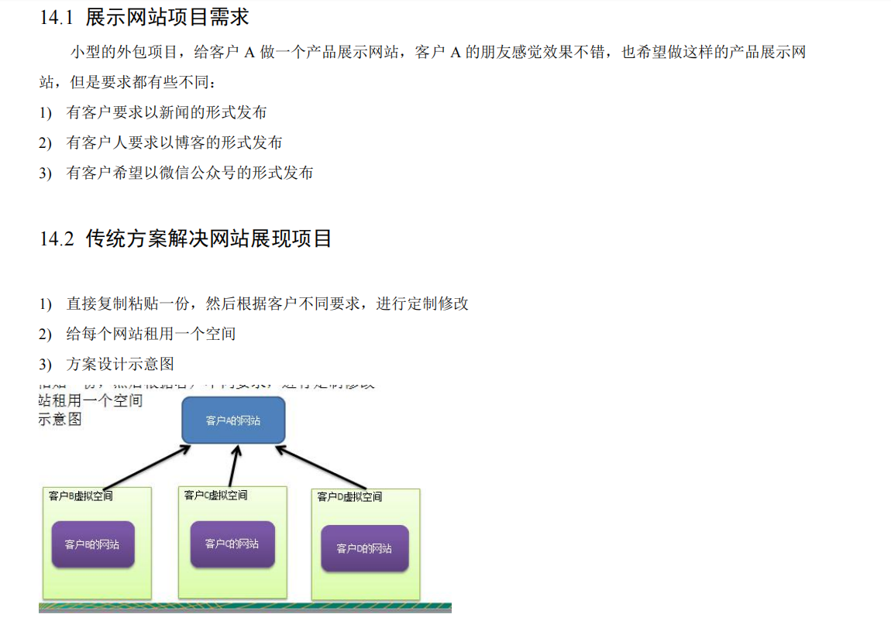


- **基本介绍**
  1. 享元模式（Flyweight Pattern） 也叫 蝇量模式: 运用共享技术有效地支持大量细粒度的对象
  2. 常用于系统底层开发，解决系统的性能问题。像数据库连接池，里面都是创建好的连接对象，在这些连接对象中有我们需要的则直接拿来用，避免重新创建，如果没有我们需要的，则创建一个
  3. 享元模式能够解决重复对象的内存浪费的问题，当系统中有大量相似对象，需要缓冲池时。不需总是创建新对象，可以从缓冲池里拿。这样可以降低系统内存，同时提高效率
  4. 享元模式经典的应用场景就是池技术了，String 常量池、数据库连接池、缓冲池等等都是享元模式的应用，享元模式是池技术的重要实现方式


- **内部状态和外部状态**

  1. 享元模式提出了两个要求：细粒度和共享对象。这里就涉及到内部状态和外部状态了，即将对象的信息分为两个部分：内部状态和外部状态

  2. **内部状态**指对象共享出来的信息，**存储在享元对象内部且不会随环境的改变而改**变

  3. **外部状态指对象得以依赖的一个标记**，是**随环境改变而改变的、不可共享的状**态。

     

- **Code**

```java
class WebSiteFactory{
    private HashMap<String, AbstractWebSite> pools = new HashMap<>(16);
    public AbstractWebSite getWebSiteCategory(String type){
        // 判断是否存在
        if (!pools.containsKey(type)){
            pools.put(type,new ConcreteWebSite(type));
        }
        return pools.get(type);
    }
    public Integer getWebSites(){
        return pools.size();
    }
}
abstract class AbstractWebSite{
    /**
     * 应用
     */
    public abstract void use();
}

class ConcreteWebSite extends AbstractWebSite{
    /**
     * 网站类型
     */
    private String type = "";

    public ConcreteWebSite(String type) {
        this.type = type;
    }

    @Override
    public void use() {
        System.out.println(type + "类型网站" +"在使用 ,,,");
    }
}
```


- **Integer 中的享元模式**

```java
/**
 * @author danghf
 * @version 1.0
 * 2022/11/17   17:05
 * Integer 中的 享元模式
 */
public class Jdk {
    public static void main(String[] args) {
        Integer x = Integer.valueOf(127);
        Integer y = new Integer(127);
        Integer z = Integer.valueOf(127);
        Integer w = new Integer(127);
        // true
        System.out.println(x.equals(y));
        // false
        System.out.println(x == y);
        // true
        System.out.println(x == z);
        // false
        System.out.println(w == x);
        // false
        System.out.println(w == y);
        /**
         * public static Integer valueOf(int i) {
         *         if (i >= IntegerCache.low && i <= IntegerCache.high)
         *             return IntegerCache.cache[i + (-IntegerCache.low)];
         *         return new Integer(i);
         *     }
         * static {
         *             // high value may be configured by property
         *             int h = 127;
         *             String integerCacheHighPropValue =
         *                 sun.misc.VM.getSavedProperty("java.lang.Integer.IntegerCache.high");
         *             if (integerCacheHighPropValue != null) {
         *                 try {
         *                     int i = parseInt(integerCacheHighPropValue);
         *                     i = Math.max(i, 127);
         *                     // Maximum array size is Integer.MAX_VALUE
         *                     h = Math.min(i, Integer.MAX_VALUE - (-low) -1);
         *                 } catch( NumberFormatException nfe) {
         *                     // If the property cannot be parsed into an int, ignore it.
         *                 }
         *             }
         *             high = h;
         *        //  重点============================================================
         *             cache = new Integer[(high - low) + 1];
         *             int j = low;
         *             for(int k = 0; k < cache.length; k++)
         *                 cache[k] = new Integer(j++);
         *
         *             // range [-128, 127] must be interned (JLS7 5.1.7)
         *             assert IntegerCache.high >= 127;
         *         }
         */
    }
}
```


- **注意事项**
  1. 在享元模式这样理解，“享”就表示共享，“元”表示对象
  2. 系统中有大量对象，这些对象消耗大量内存，并且对象的状态大部分可以外部化时，我们就可以考虑选用享元模式
  3. 用唯一标识码判断，如果在内存中有，则返回这个唯一标识码所标识的对象，用 HashMap/HashTable 存储
  4. 享元模式大大减少了对象的创建，降低了程序内存的占用，提高效率
  5. 享元模式提高了**系统的复杂度**。需要分离出**内部状态和外部状态**，而外部状态具有固化特性，不应该随着内部状态的改变而改变，这是我们使用享元模式需要注意的地方.
  6.  使用享元模式时，注意划分内部状态和外部状态，并且需要有一个工厂类加以控制
  7. 享元模式经典的应用场景是需要缓冲池的场景，比如 String 常量池、数据库连接池


## 11）代理模式 proxy pattern

- **基本介绍**
  1. 代理模式：为一个对象提供一个替身，以控制对这个对象的访问。即通过代理对象访问目标对象.这样做的好处是:可以在目标对象实现的基础上,增强额外的功能操作,即扩展目标对象的功能。
  2. 被代理的对象可以是远程对象、创建开销大的对象或需要安全控制的对象
  3. 代理模式有不同的形式, 主要有三种 **静态代理**、**动态代理** (JDK 代理、接口代理)和 **Cglib** **代理** (可以在内存动态的创建对象，而不需要实现接口， 他是属于动态代理的范畴)


### [1] 静态代理

- **基本介绍**

```
静态代理在使用时,需要定义接口或者父类,被代理对象(即目标对象)与代理对象一起实现相同的接口或者是继承相同父类
```

```java
/**
 * @author danghf
 * @version 1.0
 * 2022/11/17   17:56
 * 代理模式 -> 静态代理
 * 代理对象 和 被代理对象 实现相同的接口
 */
public class StaticProxy {
    public static void main(String[] args) {
        TeacherDao teacherDao = new TeacherDao();
        TeacherDaoProxy teacherDaoProxy = new TeacherDaoProxy(teacherDao);
        teacherDaoProxy.teach();
    }
}
class TeacherDaoProxy implements ITeacher{
    private final TeacherDao teacherDao;

    public TeacherDaoProxy(TeacherDao teacherDao) {
        this.teacherDao = teacherDao;
    }

    @Override
    public void teach() {
        System.out.println("开始代理...");
        teacherDao.teach();
        System.out.println("提交...");
    }
}
interface ITeacher{
    /**
     * 教学方法
     */
    void teach();
}
class TeacherDao implements ITeacher{
    @Override
    public void teach() {
        System.out.println("开始上课");
    }
}
```


- **静态代理优缺点**
  1. 优点：在不修改目标对象的功能前提下, 能通过代理对象对目标功能扩展
  2. 缺点：因为代理对象需要与目标对象实现一样的接口,所以会有很多代理类
  3. 一旦接口增加方法,目标对象与代理对象都要维护


### [2] 动态代理

- **基本介绍**
  1. 代理对象,不需要实现接口，但是目标对象要实现接口，否则不能用动态代理
  2. 代理对象的生成，是利用 JDK 的 API，动态的在内存中构建代理对象
  3. 动态代理也叫做：JDK 代理、接口代理

```
1) 代理类所在包:java.lang.reflect.Proxy
2) JDK 实现代理只需要使用 newProxyInstance 方法,但是该方法需要接收三个参数,完整的写法是:
static Object newProxyInstance(ClassLoader loader, Class<?>[] interfaces,InvocationHandler h )
```


- **Code**

  ```java
  /**
   * @author danghf
   * @version 1.0
   * 2022/11/17   18:05
   * 代理模式 -> 动态代理（Jdk代理，接口代理）
   */
  public class DynamicProxy {
      public static void main(String[] args) {
          // 创建目标对象
          StudentDao studentDao = new StudentDao();
          // 创建代理对象
          Object proxyInstance = new StudentDaoProxyFactory(studentDao).getProxyInstance();
          // class model.proxy.$Proxy0
          System.out.println(proxyInstance.getClass());
          IStudent instance = (IStudent) proxyInstance;
          /**
           * Jdk 代理开始 。。。
           * learning ...
           * Jdk 代理提交 。。。
           */
          instance.learn();
      }
  }
  class StudentDaoProxyFactory{
      /**
       * 维护一个目标对象
       */
      private final Object target;
  
      public StudentDaoProxyFactory(Object target) {
          this.target = target;
      }
  
      /**
       * 给目标对象 生成一个代理对象
       * @return 代理对象
       */
      public Object getProxyInstance(){
          /**
           * @param ClassLoader loader 指定当前目标对象的类加载器，获取加载器的方式固定
           * @param Class<?>[] interfaces 目标对象的接口类型，使用泛型方法确认类型
           * @param InvocationHandler h 事情处理，执行目标对象的方法时，会触发事情处理器方法，
           *                          会把当前执行的目标方法作为参数传入
           */
          return Proxy.newProxyInstance(target.getClass().getClassLoader(),
                  target.getClass().getInterfaces(),
                  new InvocationHandler() {
                      @Override
                      public Object invoke(Object proxy, Method method, Object[] args) throws Throwable {
                          System.out.println("Jdk 代理开始 。。。");
                          // 反射机制调用目标对象的方法
                          Object returnValue = method.invoke(target, args);
                          System.out.println("Jdk 代理提交 。。。");
                          return returnValue;
                      }
                  });
      }
  }
  interface IStudent{
      /**
       * learn
       */
      void learn();
  }
  class StudentDao implements IStudent{
      @Override
      public void learn() {
          System.out.println("learning ... ");
      }
  }
  ```


### [3] Cglib代理

- **基本介绍**
  1. 静态代理和 JDK 代理模式都要求目标对象是实现一个接口,但是有时候目标对象只是一个**单独的对象**,并没**有实现任何的接口**,这个时候可使用目标对象子类来实现代理-这就是 **Cglib** **代理**
  2.  Cglib代理也叫作**子类代理**,它是在内存中构建一个子类对象从而实现对目标对象功能扩展, 有些书也将Cglib代理归属到动态代理。
  3. Cglib 是一个强大的高性能的代码生成包,它可以在运行期扩展 java 类与实现 java 接口.它广泛的被许多 AOP 的框架使用,例如 Spring AOP，实现方法拦截
  4. 在 AOP 编程中如何选择代理模式：
     1. 目标对象需要实现接口，用 JDK 代理
     2. 目标对象不需要实现接口，用 Cglib 代理
  5. Cglib 包的底层是通过使用字节码处理框架 ASM 来转换字节码并生成新的类


```
1、在内存中动态构建子类，注意代理的类不能为 final，否则报错
						java.lang.IllegalArgumentException:
2、目标对象的方法如果为 final/static,那么就不会被拦截,即不会执行目标对象额外的业务方法.
```


- **Code**

```java
/**
 * @author danghf
 * @version 1.0
 * 2022/11/18   7:22
 * cglib 代理
 */
public class CglibProxy {
    public static void main(String[] args) {
        Student student = new Student();
        // 获取代理对象
        Object proxyInstance = new ProxyFactory(student).getProxyInstance();
        Student proxy = (Student) proxyInstance;
        /**
         * cglib 开始代理 ...
         * model.proxy.Student@20fa23c1=>read
         * cglib 提交 ... 
         */
        proxy.read();
    }
}
class ProxyFactory implements MethodInterceptor {
    private Object target;

    public ProxyFactory(Object target) {
        this.target = target;
    }

    /**
     * 返回一个代理对象 target的代理对象
     * @return object
     */
    public Object getProxyInstance(){
        // 1、创建一个工具类
        Enhancer enhancer = new Enhancer();
        // 2、设置父类i
        enhancer.setSuperclass(target.getClass());
        // 3、设置回调函数
        enhancer.setCallback(this);
        // 4、创建子类对象，即代理对象
        return enhancer.create();
    }

    /**
     * 重写 intercept 会调用目标对象的代理方法
     * Invoke the original method, on a different object of the same type.
     * @param obj the compatible object; recursion will result if you use the object passed as the first
     * argument to the MethodInterceptor (usually not what you want)
     * @param args the arguments passed to the intercepted method; you may substitute a different
     * argument array as long as the types are compatible
     * @see MethodInterceptor#intercept
     * @throws Throwable the bare exceptions thrown by the called method are passed through
     * without wrapping in an <code>InvocationTargetException</code>
     */
    @Override
    public Object intercept(Object obj, Method method, Object[] args, MethodProxy methodProxy) throws Throwable {
        System.out.println("cglib 开始代理 ... ");
        Object returnVal = method.invoke(target, args);
        System.out.println("cglib 提交 ... ");
        return returnVal;
    }
}

/**
 * 被代理对象 没有实现接口
 */
class Student{
    public void read(){
        System.out.println(this + "=>read");
    }
}
```


## 12）模板方法模式 Template Method Pattern

- **基本介绍**
  1. 模板方法模式（Template Method Pattern），又叫模板模式(Template Pattern)，在一个抽象类公开定义了执行它的方法的模板。它的子类可以按需要重写方法实现，但调用将以抽象类中定义的方式进行。
  2. 简单说，模板方法模式 定义一个操作中的算法的骨架，而将一些步骤延迟到子类中，使得子类可以不改变一个算法的结构，就可以重定义该算法的某些特定步骤
  3.  这种类型的设计模式属于行为型模式。


- **Code**

```java
/**
 * @author danghf
 * @version 1.0
 * 2022/11/18   8:11
 * 模板方法模式
 */
public class Demo {
    public static void main(String[] args) {
        new OatMilk().make();
        new RedDateMilk().make();
    }
}
abstract class AbstractMilk{
    /**
     * 模板方法可以做成 final
     * 防止子类重写
     */
    public final void make(){
        System.out.println("===="+this+"=====");
        select();
        addCondiments();
        soak();
        System.out.println("=================");
    }
    void select(){
        System.out.println("加入牛奶");
    }

    /**
     * 添加配料
     */
    protected abstract void addCondiments();
    void soak(){
        System.out.println("充分混合");
    }

}

/**
 * 燕麦牛奶
 */
class OatMilk extends AbstractMilk{
    @Override
    protected void addCondiments() {
        System.out.println("添加牛奶");
    }
}
/**
 * 红枣牛奶
 */
class RedDateMilk extends AbstractMilk{
    @Override
    protected void addCondiments() {
        System.out.println("加入红枣");
    }
}
```


- **模板方法模式中的钩子方法**
  1. 在模板方法模式的**父类**中，我们可以**定义一个方法**，它**默认不做任何事**，子类可以视情况要不要覆盖它，该方法称为“钩子”。
  2.  还是用上面做豆浆的例子来讲解，比如，我们还希望**制作纯牛奶**，**不添加任何的配料**，请使用钩子方法对前面的模板方法进行改造


```java
/**
 * @author danghf
 * @version 1.0
 * 2022/11/18   8:11
 * 模板方法模式 + 钩子函数
 */
public class Demo {
    public static void main(String[] args) {
        new OatMilk().make();
        new RedDateMilk().make();
        new Milk().make();
    }
}
abstract class AbstractMilk{
    /**
     * 模板方法可以做成 final
     * 防止子类重写
     */
    public final void make(){
        System.out.println("===="+this+"=====");
        select();
        // 是否添加材料
        if (WhetherToAdd()){
            addCondiments();
        }
        soak();
        System.out.println("=================");
    }
    void select(){
        System.out.println("加入牛奶");
    }

    /**
     * 添加配料
     */
    protected abstract void addCondiments();
    void soak(){
        System.out.println("充分混合");
    }
    /**
     * 钩子方法
     * 视情况覆盖
     * 是否添加 其他材料
     */
    boolean WhetherToAdd(){
        // 默认添加
        return true;
    }
}

/**
 * 燕麦牛奶
 */
class OatMilk extends AbstractMilk{
    @Override
    protected void addCondiments() {
        System.out.println("添加牛奶");
    }
}
/**
 * 红枣牛奶
 */
class RedDateMilk extends AbstractMilk{
    @Override
    protected void addCondiments() {
        System.out.println("加入红枣");
    }
}

/**
 * 纯牛奶
 * 使用钩子方法，不添加任何
 */
class Milk extends AbstractMilk{
    @Override
    protected void addCondiments() {

    }

    @Override
    boolean WhetherToAdd() {
        return false;
    }
}
```


- **模板模式在spring IOC中的使用**

```java
public class Jdk {
    /**
     * interface ConfigurableApplicationContext
     *      void refresh() throws BeansException, IllegalStateException;
     * abstract class AbstractApplicationContext ... implements ConfigurableApplicationContext
     *      public void refresh() throws BeansException, IllegalStateException {
     *         synchronized(this.startupShutdownMonitor) {
     *             this.prepareRefresh();
     *             ConfigurableListableBeanFactory beanFactory = this.obtainFreshBeanFactory();
     *             this.prepareBeanFactory(beanFactory);
     *
     *             try {
     *                 this.postProcessBeanFactory(beanFactory);
     *                 this.invokeBeanFactoryPostProcessors(beanFactory);
     *                 this.registerBeanPostProcessors(beanFactory);
     *                 this.initMessageSource();
     *                 this.initApplicationEventMulticaster();
     *                 this.onRefresh();
     *                 this.registerListeners();
     *                 this.finishBeanFactoryInitialization(beanFactory);
     *                 this.finishRefresh();
     *             } catch (BeansException var5) {
     *                 this.destroyBeans();
     *                 this.cancelRefresh(var5);
     *                 throw var5;
     *             }
     *
     *         }
     *     }
     */
}
```


- **注意事项**
  1. 基本思想是：算法只存在于一个地方，也就是在父类中，容易修改。需要修改算法时，只要修改父类的模板方法或者已经实现的某些步骤，子类就会继承这些修改
  2. 实现了最大化代码复用。父类的模板方法和已实现的某些步骤会被子类继承而直接使用。
  3. 既统一了算法，也提供了很大的灵活性。父类的模板方法确保了算法的结构保持不变，同时由子类提供部分步骤的实现。
  4.  该模式的不足之处：每一个不同的实现都需要一个子类实现，导致类的个数增加，使得系统更加庞大
  5. 一般模板方法都加上 final 关键字， 防止子类重写模板方法. 
  6. 模板方法模式使用场景：当要完成在某个过程，该过程要执行一系列步骤 ，这一系列的步骤基本相同，但其个别步骤在实现时 可能不同，通常考虑用模板方法模式来处理


## 13）命令模式 Command Pattern

- **基本介绍**
  1. 命令模式（Command Pattern）：在软件设计中，我们经常需要向某些对象发送请求，但是并不知道请求的接收者是谁，也不知道被请求的操作是哪个，我们只需在程序运行时指定具体的请求接收者即可，此时，可以使用命令模式来进行设计
  2. 命名模式使得**请求发送者与请求接收者消除彼此之间的耦**合，让对象之间的调用关系更加灵活，实现解耦。
  3. 在命名模式中，会将一个请求封装为一个对象，以便使用不同参数来表示不同的请求(即命名)，同时命令模式也支持可撤销的操作。


```
命令必须支持撤销操作
1) Invoker 是调用者角色
2) Command: 是命令角色，需要执行的所有命令都在这里，可以是接口或抽象类
3) Receiver: 接受者角色，知道如何实施和执行一个请求相关的操作
```

```shell
# 注：外观模式(门面模式)主要是负责统一调度
# 而 命令模式还是单独调度，统一命令
```


- **Code**

```java
/**
 * @author danghf
 * @version 1.0
 * 2022/11/18   9:01
 * 命令 模式
 */
public class Demo {
    public static void main(String[] args) {
        RemoteControl remoteControl = new RemoteControl();
        // 电灯
        Light light = new Light();
        remoteControl.setCommand(0,new LightOnCommand(light),new LightOffCommand(light));
        // 无操作
        remoteControl.undoCommand();
        // 打开
        remoteControl.onCommand(0);
        // 撤销 => 关闭
        remoteControl.undoCommand();
        // 关闭
        remoteControl.offCommand(0);
        // 撤销 => 打开
        remoteControl.undoCommand();
    }
}

/**
 * 遥控器
 * 命令发布者
 */
class RemoteControl{
    /**
     * 命令数组
     */
    private final Command[] onCommands;
    private final Command[] offCommands;
    private Command undoCommand;

    public RemoteControl() {
        onCommands = new Command[5];
        offCommands = new Command[5];
        for (int i = 0; i < 5; i++) {
            onCommands[i] = new NoCommand();
            offCommands[i] = new NoCommand();
        }
        undoCommand = new NoCommand();
    }

    /**
     * 设置按键命令
     * @param index 按键索引
     * @param onCommand on命令
     * @param offCommand off命令
     */
    public void setCommand(int index,Command onCommand,Command offCommand){
        onCommands[index] = onCommand;
        offCommands[index] = offCommand;
    }

    /**
     * 找到按下的按钮，并执行方法
     * @param index 按钮索引
     */
    public void onCommand(int index){
        // 执行本次操作
        onCommands[index].execute();
        // 记录，用于执行撤销操作
        undoCommand = onCommands[index];
    }
    public void offCommand(int index){
        offCommands[index].execute();
        undoCommand = offCommands[index];
    }

    /**
     * 撤销操作
     */
    public void undoCommand(){
        if (undoCommand instanceof NoCommand){
            // 撤销是空命令，之前没有任何操作，不做任何事
        }
        undoCommand.undo();
    }
}
/**
 * 命令接口
 */
interface Command{
    /**
     * 执行操作
     */
    void execute();

    /**
     * 撤销操作
     */
    void undo();
}

/**
 * 电灯打开命令
 */
class LightOnCommand implements Command{
    private final Light light;
    LightOnCommand(Light light){
        this.light = light;
    }
    @Override
    public void execute() {
        // 调用
        light.on();
    }

    @Override
    public void undo() {
        light.off();
    }
}
/**
 * 电灯关闭命令
 */
class LightOffCommand implements Command{
    /**
     * 命令 依赖 命令的执行者
     */
    private final Light light;

    public LightOffCommand(Light light) {
        this.light = light;
    }

    @Override
    public void execute() {
        light.off();
    }

    @Override
    public void undo() {
        light.on();
    }
}
/**
 * 空命令
 * 简化操作
 * 可以省掉对空的判断
 */
class NoCommand implements Command{
    @Override
    public void execute() {

    }

    @Override
    public void undo() {

    }
}
/**
 * 电灯 命令的执行者
 */
class Light{
    public void on(){
        System.out.println("电灯打开");
    }
    public void off(){
        System.out.println("电灯关闭");
    }
}
```


- **JdbcTemplate**

```java
/**
 * @author danghf
 * @version 1.0
 * 2022/11/18   9:32
 * JdbcTemplate
 */
public class Jdk {
    /**
     * class JdbcTemplate
     *      public Object query(final String sql, final ResultSetExtractor rse) throws DataAccessException {
     *        Assert.notNull(sql, "SQL must not be null");
     *        Assert.notNull(rse, "ResultSetExtractor must not be null");
     *        if (logger.isDebugEnabled()) {
     *           logger.debug("Executing SQL query [" + sql + "]");
     *                }
     *      //   QueryStatementCallback 命令 + 命令执行者
     *        class QueryStatementCallback implements StatementCallback, SqlProvider {
     *           public Object doInStatement(Statement stmt) throws SQLException {
     *              ResultSet rs = null;
     *              try {
     *                 rs = stmt.executeQuery(sql);
     *                 ResultSet rsToUse = rs;
     *                 if (nativeJdbcExtractor != null) {
     *                    rsToUse = nativeJdbcExtractor.getNativeResultSet(rs);
     *                    }
     *                 return rse.extractData(rsToUse);
     *                }
     *              finally {
     *                 JdbcUtils.closeResultSet(rs);
     *                }
     *            }
     *           public String getSql() {
     *              return sql;
     *            }
     *        }
     *        // 执行 JdbcTemplate 充当命令发布者
     *        return execute(new QueryStatementCallback());*     }
     */
}
```


- **注意事项**
  1. 将发起请求的对象与执行请求的对象解耦。发起请求的对象是调用者，调用者只要调用命令对象的 execute()方法就可以让接收者工作，而不必知道具体的接收者对象是谁、是如何实现的，命令对象会负责让接收者执行请求的动作，也就是说：”请求发起者”和“请求执行者”之间的解耦是通过命令对象实现的，命令对象起到了纽带桥梁的作用。
  2. 容易设计一个命令队列。只要把命令对象放到列队，就可以多线程的执行命令
  3.  容易实现对请求的撤销和重做
  4.  **命令模式不足**：可能导致某些系统有过多的具体命令类，增加了系统的复杂度，这点在在使用的时候要注意
  5.  **空命令也是一种设计模式**，它为我们**省去了判空的操作**。在上面的实例中，如果没有用空命令，我们每按下一个按键都要判空，这给我们编码带来一定的麻烦。
  6. 命令模式经典的应用场景：界面的一个按钮都是一条命令、模拟 CMD（DOS 命令）订单的撤销/恢复、触发- 反馈机制


## 14）访问者模式 Pattern

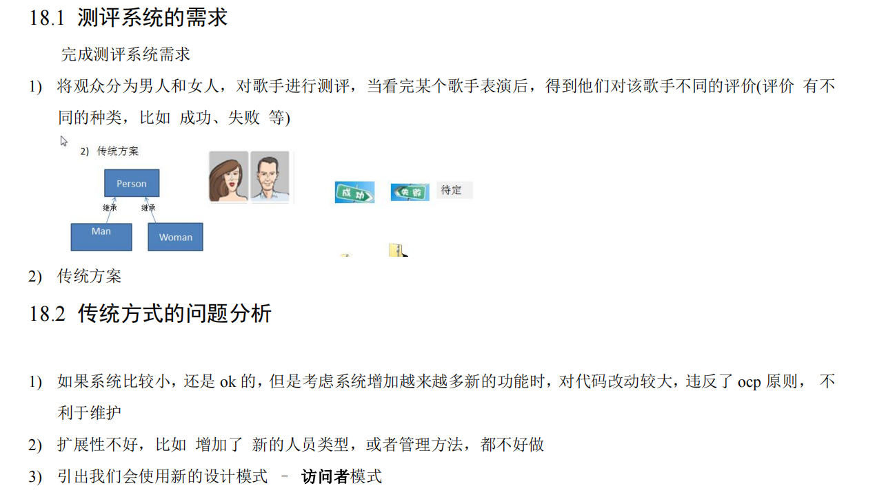

> ```shell
> # 一但新加一个 评价（待定）很多代码都要重写
> ```


- **基本介绍**
  1. 访问者模式（Visitor Pattern），封装一些作用于某种数据结构的各元素的操作，它可以在不改变数据结构的前提下定义作用于这些元素的新的操作。
  2. 主要将数据结构与数据操作分离，解决 数据结构和操作耦合性问题
  3. 访问者模式的基本工作原理是：在被访问的类里面加一个对外提供接待访问者的接口
  4. 访问者模式主要应用场景是：需要对一个对象结构中的对象进行很多不同操作(这些操作彼此没有关联)，同时需要避免让这些操作"污染"这些对象的类，可以选用访问者模式解决


