代码重工(https://heavy_code_industry.gitee.io/code_heavy_industry/pro001-javaweb/lecture/) 最新补充

## 01-HTML和 CSS

#### 1.C/S  B/S介绍

<p>javaSE项目    C/S      client Server</p>


<p>javaEE项目【J2E】   B/S       Browser    Server</p>

#### 2. 网页组成部分

##### (1)内容(结构:

<p>内容是我们在页面中可以看到的数据，一般内容使用html技术展示</p>

##### (2)表现

<p>表现指的是内容在页面上的展示形式，比如说颜色布局，一般使用css技术实现</p>

##### (3)行为

<p>行为指的是页面元素与输入设备交互的相应，一般使用javaScript技术实现</p>

#### 4. HTML简介

<p>超文本标记语言，告诉浏览器如何显示其中的文件</p>

#### 5.创建HTML文件

```html
<!DOCTYPE html><!--约束,声明-->
<html lang="en"><!--html标签表示html的开始,lang="zh_CN"表示中文，html标签一般分为两部分，分别是head和body-->
<head><!-表示头部信息，一般包含三部分内容，title标签，css样式，js代码-->
    <meta charset="UTF-8"><!--表示当前页面使用UTF-8字符集-->
    <title>标题</title>
</head>

<body><!--body标签是html页面显示的主题内容-->
	hello
</body>
</html>
```

#### 6. HTML文件的书写规范


```html
<html>   整个html页面的开始
	<head>头信息
        <title>标题</title>
	</head>
    <body>   body是页面的主题内容
        页面主体内容
    </body>
</html> 表示整个页面的结束
注释 <!--             -->
```

#### 7. HTML标签介绍

##### 1.标签的格式

​			<标签名>封装的数据</标签名>

##### 2.标签的大小写不敏感

##### 3.标签拥有自己的属性

​			1.分为基本属性 ： bgcolor = “red”    修改简单的样式属性

​			2.事件属性 ： onclick = “alert(“你好”);”   直接设置事件相应的代码

> ```html
> <!DOCTYPE html>
> <html lang="en">
> <head>
>     <meta charset="UTF-8">
>     <title>Title</title>
> </head>
> <body bgcolor="yellow" onclick="alert('你好')"><!--onclick是点击相应-->
> <button onclick="alert('帅')">按钮</button><!--button是按钮-->
> 	hello
> </body>
> </html>
> ```
>

##### 4. 标签分为单标签和双标签

​			1.单标签<标签名/>  <b r/> 换行    <hr/> 横线  

​			2.双标签<标签名></标签名>

```html
<!DOCTYPE html>
<html lang="en">
<head>
    <meta charset="UTF-8">
    <title>Title</title>
</head>
<br/><!--换行-->
    <hr/><!--下划线-->
</body>
</html>
```

##### 5. 标签的语法

```html
<!DOCTYPE html>
<html lang="en">
<head>
    <meta charset="UTF-8">
    <title>Title</title>
</head>
<body>
    <!--标签不能交叉嵌套-->
    <div ><span>2022/4/13</span></div>
    <!--标签必须正确关闭-->
    <div>2022-4-13</div>
    <!--没有内容的标签-->
    正确<br/>
    错误<br>
    <!--属性必须要有值,属性值必须加引号-->
    正确<font color="#00ffff">下午好</font><br/>
        错误<font color=00ffff>下午好</font><br/>
    错误<font color>下午好</font><br/>
    <!--注释不能嵌套-->
</body>
</html>
<!--注意：html代码不是很严谨，有时候标签不闭合，也不会报错-->
```

##### 6. 常用标签介绍( w3school )

###### 6.1 font标签

```html
<!DOCTYPE html>
<html lang="en">
<head>
    <meta charset="UTF-8">
    <title>font标签</title>
</head>
<body>
<!--font是字体标签，可以修改字体颜色，大小
color 颜色  face 字体  size 尺寸,大小-->
    <font color="red" face="黑体" size="6">
        字体标签
    </font>
</body>
</html>
```

###### 6.2特殊字符

```html
<!--
 <     &lt
 >     &gt
 空格   &nbsp
-->
```

###### 6.3 标题(h)

```html
<!--
h1 -> h6标题标签
属性：
align ='center' / 'left' / 'right' 默认 left

-->
```

###### 6.4 超链接(a标签 )

```html
<body>
	<a href="https:\\www.baidu.com">百度</a>
    <a href="https:\\localhost:8080">本地</a>
</body>
<!-- a 标签是超链接
 herf 属性设置连接目标
target 属性设置哪个目标进行跳转
	_self  当前页面(defalut)
	_blank 表示打开新界面进行跳转-->
```

###### 6.5 列表标签

<p>
    有序列表(ol)、无序列表(ul)<br/>
    type属性可以修改列表项前面的符号
</p>

```html
<body>
    <ol>
        <li>赵四</li>
        <li>刘能</li>
        <li>吹雪</li>
    </ol>
    <ul>
        <li>赵四</li>
        <li>刘能</li>
        <li>吹雪</li>
    </ul>
</body>
```

###### 6.6 img标签

<p>
    可以在html页面上显示图片<br/>
    src ： 路径;<br/>
    height width : 指定大小<br/>
    title : 鼠标放上去显示内容<br/>
    border : 边框<br/>
    alt : 展示显示失败的信息
</p>

```html
<body>
<!--javaSE中
相对路径:从工程名开始算-->
<!--web中路径中分为相对路径和绝对路径:
相对路径:
    . 表示当前目录
    .. 上级目录
    文件名   想当与当前文件所在目录的文件,相当于 ./文件名
绝对路径:
      格式：https://ip:post/工程名/资源
    -->

</body>
```

###### 6.7 table表格

<p>
h2>(1)table标签属性如下<br/>
border表示表格边框<br/>
width表示表格宽度<br/>
height表示表格高度<br/>
align表示水平对其方式<br/>
bgcolor表示背景色<<br/>
cellspacing  表示单元格与单元格之间的间距<br/>
cellpadding  表示单元格与内容的填充<br/>
</p>

```html
<body>
<!--table是表格标签
      border设置边框
      width 设置表格宽度
      height 设置表格高度
      align 表格相当于页面对齐
  th => <td align = "center">
  tr是行标签
  td是单元格标签-->
  <table border="1" width="300" height = "200" align="center" cellspacing="0">
    <tr>
      <td align="center"><b>00</b></td>
      <th>01</th>
      <th>02</th>
    </tr>
    <tr>
      <th>10</th>
      <th>11</th>
      <th>12</th>
    </tr>
    <tr>
      <th>20</th><th>21</th><th>22</th>
    </tr>
  </table>
</body>
```

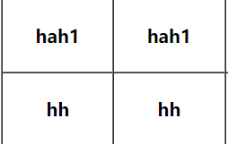pcellspacing="0"

pcellspacing=  default

###### 6.8 跨行跨列标签

<p></p>

```
跨列: colspan = "值"<br>
跨行: rowspan = "值"</p>
```

```html
<body>
    <table border="1" width="300" height = "300" cellspacing="0">
        <tr>
            <th colspan="2" rowspan="2">00</th>
            <th>01</th>
<!--            <th>02</th>-->
        </tr>
        <tr>
<!--            <th >10</th>-->
<!--            <th>11</th>-->
            <th>12</th>
        </tr>
        <tr>
            <th>20</th>
            <th>21</th>
            <th>22</th>
        </tr>
    </table>
</body>
```

###### 6.9 了解iframe框架标签( 内嵌窗口 )

<p>
    可以在html中建立一个新的窗口
</p>

```html
<body>
<!--iframe标签可以在页面上开辟一个小区域显示一个单独的页面-->

<iframe
        src = 'img标签.html' width="600" height="700" name="abc">
</iframe>
<!--iframe和a标签的联合使用步骤
        1.在iframe标签使用 name 定义一个名称
        2.在a标签中设置 target 属性为iframe的 name值
        只后超链接的结果就会在iframe中展示
-->
<br/>
<ul>
    <li><a href = '0标签语法.html' target="abc">菜单一</a></li>
    <li><a href="1.font标签.html" target="abc">菜单二</a></li>
    <li><a href="表格.html" target="abc"></a></li>
</ul>
</body>
```

###### 6.9 表单( 重点 )

<p>
    表单就是用来收集用户信息来发送给服务器 <font color='red'>form标签</font></p>


```html
<body>
<!--form标签就是表单
input  type= text  单行文本输入框 value 设置默认值
input type = "password" 密码输入框
input type="radio" 单选框,name属性可以分组,name属性一样代表是同一个组
        checked = 'checked' 表示默认选项(checked也可以)
input type="checkbox"是复选框 checked 表示默认
<select>  </select> 下拉列表框
<option></option> 下拉列表中的选项,selected="selected"默认
textarea 多行文本输入框,起始标签和结束标签中的是默认值
        rows 行， cols 列
<input type="reset">重置按钮,value属性修改按钮的文字
<input type="submit">提交按钮,value属性修改按钮的文字
input type = "button" 是按钮,value可以改上面文字
input type="file" 文件上传域
input type="hidden" 隐藏域 当我们要发送某些信息
-->
<form>
    用户名称:<input type="text" value="默认值"/><br>
    用户密码:<input type="password"><br/>
    确认密码:<input type="password"><br/>
    性别:<input type="radio" name="性别" checked = 'checked'>男<input type="radio" name="性别">女<br/>
    兴趣爱好:<input type="checkbox" checked>java<input type="checkbox">c++<input type="checkbox">python<br>
    国籍:<select>
    <option>美国</option>
    <option selected="selected">中国</option>
    <option>俄罗斯</option>
    <option>意大利</option>
</select><br/>
    自我评价:<textarea rows="10" cols="30">默认值</textarea><br/>

    <input type="reset"><br/>
    <input type="submit"><br/>
    <input type="file" value="选择文件">
    <input type="hidden" name="">

</form>
</body>
```

<p align = "center"><font color ='red'>表单格式化</font></p>

```html
<form>
    <table border="1" align="center">
        <tr>
            <td colspan="2">
                <h4 align="center"><font color="red" size="5">用户注册</font></h4>
            </td>
        </tr>
        <tr>
            <td>用户名称:</td>
            <td><input type="text" value="默认值"/><br></td>
        </tr>
        <tr>
            <td>用户密码:</td>
            <td><input type="password" value=""/></td>
        </tr>
        <tr>
            <td>确认密码:</td>
            <td><input type="password" value=""/></td>
        </tr>
        <tr>
            <td>性别:</td>
            <td><input type="radio" name="性别" checked = 'checked'>男
                <input type="radio" name="性别">女</td>
        </tr>
        <tr>
            <td>兴趣爱好:</td>
            <td><input type="checkbox" checked>java
                <input type="checkbox">c++
                <input type="checkbox">python</td>
        </tr>
        <tr>
            <td>国籍</td>
            <td><select><option>美国</option>
                <option selected="selected">中国</option>
                <option>俄罗斯</option>
                <option>意大利</option></select></td>
        </tr>
        <tr>
            <td>自我评价</td>
            <td><textarea rows="10" cols="30">默认值</textarea></td>
        </tr>
        <tr>
            <td>选择文件</td>
            <td>
                <input type="file" value="选择文件">
            </td>
        </tr>
        <tr>
            <td><input type="reset"></td>
            <td><input type="submit"></td>
        </tr>
    </table>

    <input type="hidden" name="">

</form>
```

###### 3.10 表单提交

```html
<!--
forn标签是表单标签
	action属性设置提交的服务器地址
	method顺序设置提交的方式GET(默认)或post
提交失败的三种情况:
	1.表单没有name属性
	2.单选，多选，复选(下拉标签中的都要value属性)
	3.表单不在提交的form标签中
-->
<!--
GET请求的特点:
	1.浏览器的地址栏对应的地址是 action属性[+?+请求参数]
		请求参数格式是name + value & name + value 
	2.不安全
	3.具有数据长度的限制
POST请求特点：
	1.浏览器的地址栏对应的地址是 action属性
	2.相对于get请求安全
	3.理论上没有数据长度的限制
-->
<!--    https://localhost:8080/?action=login&%E6%80%A7%E5%88%AB=on-->
<!--    https://localhost:8080/?action=login&name=%E9%BB%98%E8%AE%A4%E5%80%BC&pw=&sex=boy&bobby=java&na=ch&eval=%E9%BB%98%E8%AE%A4%E5%80%BC-->

```

```html
<body>
<form action="https://localhost:8080" method="get">
    <input type="hidden" name="action" value="login">
<!--    https://localhost:8080/?action=login&%E6%80%A   7%E5%88%AB=on-->
<!--    https://localhost:8080/?action=login&name=%E9%BB%98%E8%AE%A4%E5%80%BC&pw=&sex=boy&bobby=java&na=ch&eval=%E9%BB%98%E8%AE%A4%E5%80%BC-->
    <table border="1" align="center">
        <tr>
            <td colspan="2">
                <h4 align="center"><font color="red" size="5">用户注册</font></h4>
            </td>
        </tr>
        <tr>
            <td>用户名称:</td>
            <td><input type="text" value="默认值" name="name"/><br></td>
        </tr>
        <tr>
            <td>用户密码:</td>
            <td><input type="password" value="" name="pw"/></td>
        </tr>
        <tr>
            <td>确认密码:</td>
            <td><input type="password" value=""/></td>
        </tr>
        <tr>
            <td>性别:</td>
            <td><input type="radio" name="sex" checked = 'checked' value="boy">男
                <input type="radio" name="sex" value="girl">女</td>
        </tr>
        <tr>
            <td>兴趣爱好:</td>
            <td><input name="bobby" type="checkbox" checked value="java">java
                <input name="bobby" type="checkbox" value="c++">c++
                <input name="bobby" type="checkbox" value="python" >python</td>
        </tr>
        <tr>
            <td>国籍</td>
            <td><select name="na"><option value="usa"> 美国</option>
                <option selected="selected" value="ch">中国</option>
                <option>俄罗斯</option>
                <option>意大利</option></select></td>
        </tr>
        
    </table>

</form>
</body>
```

###### 3.11 div、span、p

```html
<body>
<!--    其他标签-->
<!--div 默认独占一行-->
<div>div标签1</div>
<div>div标签2</div>
<!--span 封装数据的长度-->
<span>span标签1</span>
<span>span标签2</span>
<!--p段落标签 默认段前断后个空一行,如果有就不空-->
<p>p标签1</p>
<p>p标签2</p>
</body>
```


#### 8、CSS技术  文档:CSS2.0chm

##### 8.1 css语法规则

```css
/*选择器 {
	key : value value
}*/
/*
选择器 ：浏览器根据'选择器'决定受css样式影响的HTML标签(元素)
属性：在每个声明后面加一个分号

注：一般一行只描述一个属性
*/
```

##### 8.2 css和html结合的方式

###### 8.2.1 第一种

<div>
    在标签的<font color=red>style</font>属性上设置"key:value value"</div>
<div>1.如果标签多了，样式多了，代码量非常庞大</div>
<div>
2.可读性差        
</div><div>
    3.代码没有什么复用性
</div>

```html
<body>
<!--    分别定义两个div，span标签，修改他们的样式-->
<div
        style="border: 2px solid red">
div标签</div>
<div
        style="border: 2px solid yellow">
    div标签</div>
<span style="border: #ebff7b solid 3px">span标签</span>
</body>
```

###### 8.2.2 第二种

<div>在head标签中使用<font color='red'>style</font>来定义自己需要的css样式</div><div>
    1.只能在同一页面内复用代码，不能再多个页面内使用
    2.维护不方便
</div>

```css
/*格式如下*/
xxx{
	key:value value;
}
```

```html
<head>
    <!-- style标签专门定义css样式代码-->
    <style type="text/css">
        /*style标签专门定义css样式代码*/
        div{
           border: red 3px solid;
        }
        span{
            border: red 3px solid;
        }
    </style>
    <meta charset="UTF-8">
    <title>Title</title>
</head>
<body>
<!--    分别定义两个div，span标签，修改他们的样式-->
<div>
    div标签</div>
<div>
    div标签</div>
<span>span标签</span>
</body>
```

###### 8.2.3 第三种

```
将css样式写成一个单独的css文件，再通过link标签引入
```

```html
<head>
    <meta charset="UTF-8">
    <title>Title</title>
<!--    link标签引入css样式-->
    <link rel="stylesheet" type="text/css" href="../CSS/01.css"/>
</head>
<body>
    <div>div标签1</div>
    <div>div标签2</div>
<span>span标签</span>
</body>
</html>
```

```css
div{
    border: red 2px solid;
}
span{
    border: yellow 2px solid;
}
```

##### 8.3 css选择器

###### 8.3.1 标签名选择器

```
标签名选择器
标签名{
	属性：值
}
作用：可以决定那些标签被动的选择使用的样式
```

```css
div{
    border:yellow 3px solid;/*边框*/
    color : blue ;/*字体演示*/
    font-size : 30px;
}
```

###### 8.3.2 id选择器

```
格式：
#id属性值{
	属性：值
}
id选择器，可以让我们选择性的使用样式
```

```html
<div id = "id001">
    div标签1
</div>
<div id = "id002">
    div标签2
</div>
```

```css
#id001{
    color : blue;
    font-size :30px;
    border : yellow 3px solid;
}
#id002{
    color : red;
    font-size :20px;
    border : blue 5px dotted;/*点线*/
}
```

###### 8.3.3 类选择器( class选择器 )

```
格式：
.class属性值{
	属性：值
}
class类型选择器可以通过class属性有效的使用样式
```

```html
<head>
    <meta charset="UTF-8">
    <title>class</title>
    <style>
        .class01{
            color: cyan;
            font-size: 30px;
            border: 1px red solid;
        }
        .class02{
            color: cyan;
            font-size: 26px;
            border: red;
        }

    </style>
</head>
<body>
    <div class="class01">
        div标签1
    </div>
<div class="class02">div标签2</div>
</body>
```

###### 8.3.4 组合选择器

```
格式：
选择器1,选择器2,选择器3{
	属性：值;
}
组合选择器可以让多个选择器公用一个css代码
```

```html
<head>
    <meta charset="UTF-8">
    <title>Title</title>
  <style>
    .class01,#id01{
        color: blue;
        font-size: 30px;
        border: 1px solid;
    }
  </style>
</head>
<body>
    <div id = "id01">id01</div>
<div class="class01">class01</div>
</body>
```

###### 8.3.5 css常用样式

```css
div{
    color ： red;/*字体颜色*/
    border : 1px red solid;/*边框*/
    width : 500px;
    height : 600px;
    background-color: green;/*背景颜色*/
    font-size : 6px;/*字体大小*/
    margin-left : auto;/*居中*/
    margin-right : auto;
    text-align : center;/*文字居中*/
}
```

```css
a{
    text-decoration: none;/*去掉超链接的下划线*/
}
```

```css
table{
    border: 1px red solid;/*边框*/
    border-collapse: collapse;/*合并细线*/
}
td{
    border: 1px red;/*单元格*/
}

```

```css
ul{
    list-style: none;/*去掉无序列表的符号*/
}
```

## 02 javaScript

#### 1.JavaScript介绍

<div>javaScript主要是完成页面的数据验证</div>
<div><font color="red">js 是弱类型,  java是强类型</font></div>

```
特点:
1.交互性
2.安全性(不允许之间访问本地硬盘)
3.跨平台性

```

#### 2. javaScript 和html代码的结合方式

##### 2.1 方式一

```html
<!-- head或者body中添加script标签-->
<head>
    <meta charset="UTF-8">
    <title>Title</title>
  <script type="text/javascript">
      /*alert是javaScript语言提供的一个警告函数框*/
      alert("hello javaScript");
  </script>
</head>
```

##### 2.2 方式二

```html
<!--将代码写入单独的javaScript文件-->
<head>
    <meta charset="UTF-8">
    <title>Title</title>
<!--    导入外部的js文件,src属性-->
    <script type="text/javascript"
    src = "02.js">
    </script>
</head>
```


#### 3. 变量

```
javaScript变量类型:
	数值类型      number
	字符串类型    string
	对象类型      Object
	布尔类型      boolean
	函数类型      function
特殊值:
	undefinded    未定义,所有js变量未赋予初始值的时候,默认都是undefinded
	null	      空值
	NAN            Not a Number  非数字
```

##### 3.1 关系运算

```
等于 ==   "12" == 12  => true
全等于 === 除了做字面的判断,还会判断两个变量的类型,全部相等才行
```

##### 3.2 逻辑运算

```
且 &&{
	1.当表达式全为为真的时候,返回最后一个表达式的值
	2.当表达式中有假的时候,返回第一个为假的值
}
或 ||{
	1.当表达式全为假时,返回最后一个表达式的值
	2.当表达式有真时,返回第一个为真的表达式的值
}
非  !

&& / || 返回值不都是ture / false

在javascript所有变量都可以作为一个boolean类型的变量使用
	0,null,undefinded,""(空串)都为 false
```

#### 4. 数组(********重点)

##### 4.1 数组定义方式

```javaScript
var arr = [];//定义空数组
arr[0] = 12;//可以赋值
alert(arr.length);//  1
//注：javaScript语言中的数组,只要我们通过数组下标赋值,那么最大的下标,数组会自动扩容

//创建时赋值
var arr2 = [true,1];
arr[10] = 5;
//读数组不能扩容, 下标越界会显示 undefinded
```

##### 4.2 数组遍历

```javascript
for(var i = 0;i < arr.length;i++){
	alert(arr[i]);
}
```

#### 5. 函数(********重点)

##### 5.1 函数定义的两种方式

```javascript
//第一种,function关键字
function fun(){
    alert("无参函数被调用");
}// 函数调用才会使用
function fun2(a,b,c){
    alert("有参函数被调用了a=>"+a+",b=>"+b);
}

//定义带有返回值的函数,直接在函数体内return
function sum(a,b,c){
    return a+b+c;
}
```

```javascript
//函数的第二种定义形式
var fun = function(){
    alert("无参函数被调用");
}
var fun2 = function(a,b,c){
    alert("有参函数被调用");
}
var fun3(a,b){
    return a+b;
}

//注：javaScript中函数不允许函数重载,后者会将前者覆盖
```

##### 5.2 函数的 arguments 隐形参数( 只在 function 函数内 )

```javascript
//js中的 arguments 类似java中的可变长度参数
function fun(){
    alert(arguments);
    alert(arguments.length);
    alert(arguments[0]);
    alert(arguments[1]);
}
// 计算所有参数相加的和并返回
function fun(){
    for(var i = 1;i < arguments.length;i++){
        if(typeof(arguments[i])==number)
        arguments[0] += arguments[i];
    }
    return arguments[0];
}
```

#### 6. 自定义对象

```js
1.Object 形式的自定义对象

var 变量名 = new Object();//对象实例
变量名.属性名 = 值; // 定义属性
变量名.函数名 = function(); // 定义函数

```

```javascript
var obj = new Object();
alert(typeof(obj)); //=> object
obj.name = "张三";
obj.age = 18;
obj.fun = function(){
    alert(this.name+this.age);
}
//调用
//对象名.属性名
```

```
2.花括号自定义对象 {}
var 对象名 = {};//空对象
var obj = {
	属性名 ：值,
	属性 : 值,
	函数名 : function();
}
```

```javascript
var obj = {
    name : "张三";
    age = 18,
    fun : function(){
        alert(this.name+this.age);
    }
}
obj.fun();
```

#### 7. js中的事件

<p>事件：电脑输入设备与页面进行交互的响应</p>

##### 7.1 常用事件

<div><font color = 'red'>onload </font>: 加载完成事件&nbsp;&nbsp;&nbsp;&nbsp;&nbsp;&nbsp;&nbsp;&nbsp;页面加载完成之后,常用与做页面js代码初始化</div>
<div><font color = 'red'>onclick </font>: 点击事件&nbsp;&nbsp;&nbsp;&nbsp;&nbsp;&nbsp;&nbsp;&nbsp;按钮的点击相应</div>
<div><font color = 'red'>onblur </font>: 失去焦点事件&nbsp;&nbsp;&nbsp;&nbsp;&nbsp;&nbsp;&nbsp;&nbsp;常用于输入框失去焦点后验证其输入内容是否合法</div>
<div><font color = 'red'>onchange </font>: 内容发生改变事件 &nbsp;&nbsp;&nbsp;&nbsp;&nbsp;&nbsp;&nbsp;&nbsp;常用于下拉列表和输入框内容发生改变后操作</div>
<div><font color = 'red'>onsubmit</font> ：表单提交事件&nbsp;&nbsp;&nbsp;&nbsp;&nbsp;&nbsp;&nbsp;&nbsp;常用于表单提交前,验证所有表单项是否合法</div>

##### 7.2 事件的注册( 静态注册 动态注册 )

<div>事件的注册(绑定):就是告诉浏览器,当事件响应后,执行哪些代码</div>
<div>静态注册：通过<font color='red'>html标签的事件</font>属性直接赋予事件响应后的代码</div>
<div>动态注册：是指通过 js 代码得到标签的dom对象,然后通过<font color='red'>dom对象.事件名 = function(){}</font>这种形式响应后的代码</div>

```
动态注册基本步骤:
    1.获取标签对象
    2.标签对象.事件名 = function(){}
```

##### 7.3 onload事件

<div>页面加载完自动运行</div>

```html
<!-- 动态注册-->
<script>
    //动态注册
    window.onload = function (){
        alert("动态注册自动执行代码")
    }
</script>
</head>
<!--onload 页面加载自动运行-->
<body >

</body>
```

```html
<!--静态注册-->   
<script>
    function fun(){
        alert("静态注册代码");
    }  
</script>
</head>
<!--onload 页面加载自动运行-->
<body onload="fun()">

</body>
```


##### 7.4 onclick( button )按钮

```html
<head>
    <meta charset="UTF-8">
    <title>Title</title>
  <script>
      function fun(){
          alert("你真帅");
      }
      window.onclick = function (){
          //1.获取标签对象
          /*
          * document是js提供的一个对象(文档)*/
          var obj = document.getElementById("01");
          //2.通过 标签对象.事件名 = function();
          obj.onclick = function (){
              alert("动态调用onclick事件")
          }
      }
  </script>
</head>
<body>
<!--静态注册-->
<button onclick="fun()">按钮一</button>
<!--动态注册-->
<button id = "01">按钮二</button>
</body>
```

##### 7.5 onblur (失去焦点事件)

```html
<head>
    <meta charset="UTF-8">
    <title>Title</title>
    <script type="text/javascript">
        function onblurFun(){
            /*控制台打印*/
            console.log("静态调用onblur事件");
        }
        /*动态调用*/
        window.onblur = function (){
            //1.获取对象
            var obj =document.getElementById("01")
            //2.对象.事件名
            obj.onblur = function (){
                console.log("动态调用onblur")
            }
        }
    </script>
</head>
<body>
  <form>
      <table align="center" border="1" cellspacing="0">
          <tr>
              <td colspan="2">
                  <p align="center">用户登录</p>
              </td>
          </tr>
          <tr>
              <td>用户名</td>
              <td>
                  <input name="name" type="text" onblur="onblurFun()">
              </td>
          </tr>
          <tr>
              <td>密码</td>
              <td>
                  <input id = "01" name="name" type="password">
              </td>
          </tr>
          <tr>
              <td>
                  <input type="submit">
              </td>
              <td>
                  <input type="reset">
              </td>
          </tr>
      </table>
  </form>
</body>
```


#####  7.6 onchange (选择)

```html
<head>
    <meta charset="UTF-8">
    <title>Title</title>
    <script>
        function fun(){
            alert('选择了女朋友')
        }
        //动态调用
        window.onchange = function (){
            var obj = document.getElementById("01");
            obj.onchange = function (){
                alert("选择2已经改变")
            }
        }
    </script>
</head>
<body>
  <form>
      <table border="1" cellspacing="0">
          <tr>
              <td colspan="2">
                  <p>选择</p>
              </td>
          </tr>
          <tr>
              <td>选择</td>
              <td>
                  <select onchange="fun()">
                      <option value="zd">赵迪</option>
                      <option>赵迪</option>
                  </select>
              </td>
          </tr>
          <tr>
              <td>
                  选择2
              </td>
              <td>
                  <select id = "01">
                      <option>
                          1
                      </option>
                      <option>
                          2
                      </option>
                  </select>
              </td>
          </tr>
      </table>
  </form>
    </body>
```


##### 7.7 onsubmit ( 表单提交事件 )

```html
<head>
    <meta charset="UTF-8">
    <title>Title</title>
    <script>
        //静态注册
        //提交之间检查,如果发现错误
        function fun(){
            //检查
            if (0) {
                alert("静态提交");
                return true;
            }else { //发现不合法
                alert('不合法,阻止');
                return false;
            }
        }
        //动态提交
        window.onsubmit = function (){
            var obj = document.getElementById("01");
            obj.onsubmit = function (){
                //检查
                if (1) {
                    alert("动态态提交");
                    return true;
                }else { //发现不合法
                    alert('不合法,阻止');
                    return false;
                }
            }
        }
    </script>
</head>
<body>
<!--return 可以阻止提交-->
<form onsubmit="return fun()" action="https://localhost:8080" method="post">
    <input type="submit" value="静态提交">
</form>
<form id="01" action="https://localhost:8080" method="post">
    <input type="submit" value="动态提交">
</form>
</body>
```

####  8.DOM模型

<div><font color='red'>DOM</font>全称是Document Object Model 文档对象模型</div><div>
    就是把文档中的标签，属性，文本等转换成对象管理
</div>

##### 8.1 document 对象

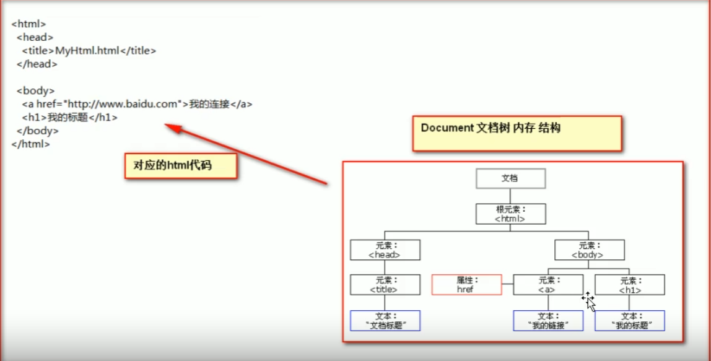

<div><font color='red'>document对象的理解</font></div><div>
    <font color='red'>1.document管理了所有的html文档内容</font>
</div><div>
    <font color='red'>2.document是一种树结构的文档，有层级关系</font>
</div><div>
    <font color='red'>3.它让所有的标签都对象化</font>
</div><div>
    <font color='red'>4.我们可以通过document访问所有的标签对象</font>
</div>

```java
//对象化
class Dom{
    private String id;//标签id属性
    private String name;//标签名
    private Dom parenrNode;//父亲
    private List<Dom> childNode;//孩子
    private String innerHtml;//标签之间的内容
}

```

##### 8.2 document 对象方法( ********重点 )

```
getElementById()
	返回拥有指定id的第一个
```

```html
<head>
    <meta charset="UTF-8">
    <title>Title</title>
    <script>
        function fun(){
            //1.获取用户输入
            var elementById = document.getElementById("usename");//dom对象
            var value = elementById.value;//获取内容
            //2.验证
            var patt = /^\w{5,12}$///正则表达式
            if (patt.test(value)){
                alert("输入合法")
            }else {
                alert("输入不合法")
            }
        }
    </script>
</head>
<body>
  <form>
      用户名<input type="text" id = "usename">
      <input onclick="fun()" type="submit" value="验证">
  </form>
</body>
```

```html
<head>
    <meta charset="UTF-8">
    <title>Title</title>
    <script>
        function fun(){
            //1.获取用户输入
            var elementById = document.getElementById("usename");//dom对象
            var value = elementById.value;//输入
            //2.验证
            /*
            * js中的正则表达式使用 / /括起来
            * */
            var elementById1 = document.getElementById("02");
            var patt = /\w{5,12}///正则表达式
            if (patt.test(value)){
                // elementById1.innerText = "用户合法"; //Text只可以是字符串,插入数据
                elementById1.innerHTML = ""
            }else {
                elementById1.innerHTML = ""
                // elementById1.innerText = "用户不合法";
            }
        }
    </script>
</head>
<body>
  <form>
      用户名<input type="text" id = "usename" onblur="fun()">
      <span id="02" style="color: red">

      </span>
      <input onclick="fun()" type="submit" value="验证">
  </form>
</body>
```

```


getElementByName()
	返回拥有指定name的元素(多个)[集合]
常用于复选框
```

```html
<head>
    <meta charset="UTF-8">
    <title>Title</title>
    <script>
        function checkAll(){
            //都选
            //通过name得到的是一个集合,顺序按照html页面从上到下
            var hobbys = document.getElementsByName("hobby");
            //checked表示复选框的选择状态，选中为true，没有false
            //checked可读取可写
            // alert(hobbys[0].checked)
            for (var i = 0;i<hobbys.length;i++)
                hobbys[i].checked = true;
        }
        function checkNo(){
            var hobbys = document.getElementsByName("hobby");
            //checked表示复选框的选择状态，选中为true，没有false
            //checked可读取可写
            for (var i = 0;i<hobbys.length;i++)
                hobbys[i].checked = false;
        }
        function checkReverse(){
            var hobbys = document.getElementsByName("hobby");
            //checked表示复选框的选择状态，选中为true，没有false
            //checked可读取可写
            for (var i = 0;i<hobbys.length;i++){
                if (hobbys[i].checked === false){
                    hobbys[i].checked = true;
                }else {
                    hobbys[i].checked = false;
                }
            }

        }
    </script>
</head>
<body>
兴趣爱好:
<input type="checkbox" name="hobby" value="cpp">c++
<input type="checkbox" name="hobby" value="java">Java
<input type="checkbox" name="hobby" value="python">python
<br/>
<button onclick="checkAll()">全选</button>
<button onclick="checkNo()">全不选</button>
<button onclick="checkReverse()">反选</button>
</body>
```

```


getElementByTagName();//根据标签名
	返回一个集合
	集合操作和数组一样
```

```html
<head>
    <meta charset="UTF-8">
    <title>Title</title>
    <script>
        function checkAll(){
            //都选
            //通过name得到的是一个集合,顺序按照html页面从上到下
            var hobbys = document.getElementsByTagName("input");
            //checked表示复选框的选择状态，选中为true，没有false
            //checked可读取可写
            // alert(hobbys[0].checked)
            for (var i = 0;i<hobbys.length;i++)
                hobbys[i].checked = true;
        }
        function checkNo(){
            var hobbys = document.getElementsByTagName("input");
            //checked表示复选框的选择状态，选中为true，没有false
            //checked可读取可写
            for (var i = 0;i<hobbys.length;i++)
                hobbys[i].checked = false;
        }
        function checkReverse(){
            var hobbys = document.getElementsByTagName("input");
            //checked表示复选框的选择状态，选中为true，没有false
            //checked可读取可写
            for (var i = 0;i<hobbys.length;i++){
                if (hobbys[i].checked === false){
                    hobbys[i].checked = true;
                }else {
                    hobbys[i].checked = false;
                }
            }

        }
    </script>
</head>
<body>
兴趣爱好:
<input type="checkbox"  value="cpp">c++
<input type="checkbox"  value="java">Java
<input type="checkbox"  value="python">python
<br/>
<button onclick="checkAll()">全选</button>
<button onclick="checkNo()">全不选</button>
<button onclick="checkReverse()">反选</button>
</body>

```

```
document对象三个方法的优先顺序
	1.如果存在id属性 使用byId
	2.如果没有id 使用ByName
	3.都没有 使用ByTagName
	4.代码一定要在页面加载完成后才能使用
```


#### 8.3. 正则表达式

<div>类似java中的正则,区别,js中的正则表达式要用<font color='red'>/ 内容 /</font>括起来</div>

```js
//1.
var patt = new RegExp("...");
//2.
var patt = /.../;
```

##### 8.4 结点的常用属性和方法

<div>结点就是标签对象</div>

```
1.通过具体的元素结点调用
getElementByTagName()方法
	获取当前结点的指定标签名孩子结点
2.appendChild()
	可以添加一个子结点
```

<div>属性</div>

```
childNodes:
	获取当前结点的所有子节点
firstChild:
	获取当前结点的第一个子结点
lastChild:
	获取当前结点的最后一个子节点
parentNode
	获取当前结点的父节点
nextSibling
	获取当前结点的下一个结点
previousSibling
	获取当前结点的上一个结点
className
	获取或设置标签的class值
innerHTML
	用于获取/设置起始标签和结束标签中的内容(标签+文本)
innerText
	表示获取/设置起始标签和结束标签中的文本
```

```html
补充
document.cteateElement();//创建标签
appendChild()//子结点创建


<head>
    <script>
        window.onload = function(){
        var obj = document.createElement("div");//在内存中
    	obj.innerHTML = "我爱你";//设置内容
        
        document.body.appendChild(obj);
        };
    </script> 
</head>
<body>

</body>
```

## 03jQuery

#### 1 jQuery介绍

	<div>jQuery是javaScript和查询Query辅助javaScript开发的js类库</div>

#### 2 jQuery演示

<div>原生</div>

```html
<head>
    <meta charset="UTF-8">
    <title>Title</title>
    <script>
        window.onclick = function (){
            var obj = document.getElementById("01");
            obj.onclick = function (){
                alert("hello world");
            }
        }
    </script>
</head>
<body>
    <button id = "01">sayHello</button>
</body>
```

<div>jQuery</div>

```html
<head>
    <meta charset="UTF-8">
    <title>Title</title>
<!--    引入jQuery-->
    <script type="text/javascript" src="jquery-3.6.0.min.js">

    </script>
    <script type="text/javascript">
        $(function (){//表示页面加载完成之后
           var $01 = $("#01");//按id查找标签对象
           $01.click(function (){
               alert("jQuery事件 HelloWorld");
           })
        })
    </script>
</head>
<body>
    <button id = "01">sayHello</button>
</body>
```

<div>常见问题</div>

```
1.jQuery 中 $ 是什么
	$是一个函数
2.jQuery 怎么为按钮添加相应函数
	1.使用jQuery查询标签对象
	2.使用 标签对象.click ( function(){});
```

#### 3 jQuery核心函数

```
jQuery 中核心函数是 $ 

1.传入参数为 [函数] 时
	表示页面加载完成后
	相当于 window.onload = function(){}
	
2.传入参数为 [HTML字符串] 时
	根据这个字符串创建元素结点对象
	相当于 document.createElement();

3.传入参数为 [选择器字符串] 时
	$("#id属性值"); id选择器根据id查找对象
	$("标签名"); 根据标签名查询标签对象
	$(".class属性值"); 根据class属性查询标签

4.传入参数为 [dom对象] 时
	会把 dom 对象转换为 jQuery 对象
	
```

#### 4 jQuery对象和dom对象区分

```
dom对象
	通过getElementByID查询出来的标签对象
	通过getElementByName查询出来的标签对象
	通过getElementByTagName查询出来的标签对象
	通过createElement创建出来的标签对象

jQuery对象
	通过jQuery提供的API创建的对象
	通过jQuery包装的Dom对象
	通过jQuery提供的API查询到的对象
```

```
jQuery 对象 是 dom对象的数组 + jQuery提供的一系列功能函数
```

```
jQuery 对象和 dom对象使用上的区别
	jQuery 对象不能使用 dom 对象的属性方法
	dom 对象不能使用 jQuery 对象的属性方法
```

```
Dom对象和jQuery对象互转
	dom -> jQuery
	$(dom对象)
	
	jQuery->dom
	
	$(dom对象)[index]
```


#### 5 jQuery选择器( ********重点 )

##### 5.1 基本选择器

<div><font color='red'>id选择器 $("#id值")</div><div><font color='red'>
    .class选择器 $(".class值")
</div><div><font color='red'>
    element选择器 $("div")
</div><div><font color='red'>
    *选择器 $("*")表示任意的,所有元素
</div><div><font color='red'>
    selector1,selector2组合选择器 合并选择器1和选择器2的结构并返回
</div>

```
p.myclass
返回 p 标签 且 为 .myclass的标签
```


##### 5.2 层级选择器

```
1.jQuery(ancestor descendant)
描述: 选择给定的祖先元素的所有后代元素。

$("form input")查找form标签的input子元素(所有)

2.jQuery( "parent > child" )
描述: 选择所有指定“parent”元素中指定的"child"的  直接子元素

$("ul.topnav > li").css("border", "3px double red")查找ul.topnav的子元素 li

3.jQuery( "prev + next" )
匹配所有紧接在prev元素后的next元素

$("lable + input")紧接在lable后的input元素


4.jQuery( "prev ~ siblings" )
描述: 匹配 “prev” 元素之后的所有 兄弟元素。具有相同的父元素，并匹配过滤“siblings”选择器。

$("form ~ input") from表单中同辈的input元素
```

##### 5.3 过滤选择器

###### 5.3.1 基本过滤选择器

```
1 :first
	获取第一个匹配到的元素
	$("tr:first")获取第一个表行
2 :last
	获取匹配到的最后一个元素
3 :not()
	去除所有匹配到的元素(查找没有匹配到的元素)
	$("input:not(:checked) + span")
4 :even
	匹配所有索引值为偶数的元素,从 0 开始
5 :odd
	匹配所有索引值为奇数的元素,从 0 开始
6 :eq(index)
	匹配一个给定索引值的元素(从0开始)
7 :gt(index)
	匹配所有大于给定索引值的元素(从0开始)
8 :lt(index)
	匹配所有小于给定索引值的元素(从0开始)
9 :header
	匹配h1,h2,h3之类的标签
	$(":header").css("","")
10 :animated
	选择所有正在执行动画效果的元素.
```

###### 5.3.2 内容过滤器

​	

```
1 :contains()
选择所有包含指定文本的元素

$("div:contains('John')")查找所有包含“John”的div


2 :empty Selector
选择所有没有子元素的元素（包括文本节点）。

$("td:empty")查找的所有空元素 - 他们没有子元素或文本


3 :has(selector) 
选择元素其中至少包含指定选择器匹配的一个种元素。
(匹配含有选择器所匹配的元素的元素)
$("div:has(p)").addClass("test");给所有含有 p 段落标签的 div 加上一个名为 "test" 的 class。


4 :parent(非空)
选择所有含有子元素或者文本的父级元素。

$("td:parent")查找含有子元素的 td 元素，包括含有文本的 td。
```

###### 5.3.3 属性过滤器

```
attribute:属性

1.[attribute]
	匹配包含给定属性的元素
	$("div[id]");查找含有id属性的div

2.[attribute=value]
	匹配给定属性为某个值的元素
	$("input[name='Hot Fuzz']")
	
3.[attribute!=value]
	匹配所有不含指定属性,或者属性不等于特定值的元素

4.[attribute^=value]
	匹配给定属性是以某些值开始的元素

5.[attribute$=value]
	匹配给定属性是以某些值结尾的元素

6.[attribute*=value]
	匹配给定属性包含某些特定的值的元素

7.[selector1][selector2][selector3]
	复合属性选择器,同时满足多个条件
```

###### 5.3.4 表单过滤器

```
1 :input
	匹配所有的input ,textarea, select ,button元素

2. :text
	匹配所有的单行文本框

3. :password
	匹配所有的type="password"密码框

4. :radio
	匹配所有单选按钮
	
5. :checkbos
	匹配复选框的元素

6. :submit
	提交按钮

7. :reser
	重置按钮

8. :button
	按钮和类型为按钮的元素

9. :file
	文件上传域

10 :hidden
	不可见元素,或type = "hidden"元素

11 :checked
	匹配所有勾选的元素
	
12 :disabled
	匹配所有被禁用的元素
	
13 :enabled
	匹配所有可用的元素

14 :image
	匹配所有图形类型的元素
	
15 :selected
	获取select元素中被选择的元素
	$("select option:selected")
16 :focus
	获取当前的焦点元素
```

#### 6 jQuery元素筛选

```
.eq() 获取指定索引的元素
	$("p").eq(1)获取匹配的第二个元素
	类似: $("p:eq(1)")

.first() 获取第一个元素
	类似: $("div:first")
	
.last()
	功能 和 :last一样

.filter() [现有jQuery对象，用于进一步筛选当前元素集合。]
	筛选元素集合中匹配表达式 或 通过传递函数测试的 那些元素集合。

.is(exp)
	判读是否匹配给定的选择器,只要有一个匹配就返回true
	$("input[type="checkbox"]").parent().is("form");
    
.has(exp)
	返回包含匹配选择器的元素的元素
	类似 :has
	$("div").has("span");

.not(exp)
	删除匹配选择器的元素
	功能和 :not 一样
	$("div").not($("#01")[0])
	
.children(exp)
	取得一个包含匹配的元素集合中每一个元素的所有子元素的集合
	功能和 parent > child一样
	$("div").children();div中所有的子元素
	
.find(exp)
	返回匹配给定选择器的后代元素
	功能和 ancestor descendant 一样
	$("p").find("span");查找p中的span元素
	
.next()
	返回当前元素的下一个兄弟元素
	功能和 prev + next 一样

.nextAll()
	返回当前元素后面所有的兄弟元素
	prev ~ next
	
.nextUntil()
	返回当前元素到指定元素为止
	$("div:first").nextUntil("span");

.parent()
	取父元素
	
.prev()
	取当前元素的前一个兄弟元素
	
.prevAll()
	取当前元素前面所有的兄弟元素

.prevUntil()
	到前面某个元素为止
	
.siblings(exp)
	返回所有的兄弟元素
	
.add()
	把add匹配到的选择器的元素添加到当前jQuery对象中
	$("div").add("span");//在查找得到的div集合中加入span
	

```

#### 7. jQuery的属性操作

##### 7.1 HTML代码/文本框

```
html()
	设置起始标签和结束标签中的内容,和dom对象的innerHTML一样

text()
	设置起始标签和结束标签中的文本,和dom对象的innerText一样

val()
	可以设置和获取表单项的value属性值,和dom对象的value属性一样
```

```html
<head>
    <meta charset="UTF-8">
    <title>Title</title>
    <script type="text/javascript" src="jquery-3.6.0.min.js"></script>
    <script type="text/javascript">
        $(function (){
            var $div = $("div");
            //设置和获取起始标签和结束标签的内容
            //无参获取,有参设置
            alert($div.html());

            var $02 = $("#02");
            $02.click(function (){
                $div.html("")
            })
            var $text = $("#text");
            $text.click(function (){
                $div.text("text修改div文本内容");
            })
            var $val = $("#val");
            $val.click(function (){
                var $usename = $("#usename");
                if ($usename.val()){
                    alert($usename.val())
                }else{
                    $usename.val("123456")
                    alert("用户姓名为null,自动设置");
                }

            })
        })
    </script>
</head>
<body>
  <div align="center">
    我是div标签<br>
      <span>
          我是div中的span
      </span>
  </div>
  用户姓名 <input id = "usename" name = "usename" type="text">
<br><button id = "02">HTML</button><br>
<button id = "text">text</button><br>
<button id = "val">val</button>
</body>
```

```
val 设置表单项的选中状态
	//操作单选框
	$(":radio").val(["radio2"]);//写入要选中的value属性值
	
	//操作复选框
	$(":checkbox").val(["选项一","选项二"]);//选项的value属性值
	
	//操作多选的下拉框
	$("select[multiple=multiple]").val(["value1","value2"]);//选项的value属性值
	
	//操作单选下拉框
	$("select").val("value");
```

##### 7.2 attr() 和 prop()

```
都可以设置和获取属性值

attr()操作某些属性返回undefined时不推荐,checked,readOnly,selected,disabled等等,attr()可以操作非标准属性(自定义属性)

prop推荐用来操作attr()返回undefined的
```

```html
<head>
    <meta charset="UTF-8">
    <title>Title</title>
    <script src="jquery-3.6.0.min.js"></script>
    <script>
        //attr
        //传一个参数就是获取,两个参数设置
        $(function (){
            var $checkbox = $(":checkbox");
            // alert( $checkbox.attr("name") );//获取
            // $checkbox.attr("name","abc");//设置
            alert($checkbox.attr("checked"));//返回undefined是一个错误
            //没有选中时,attr返回undefined    
            alert($checkbox.prop("checked"));
            //prop返回true/false
        });

    </script>
</head>
<body>
    多选<br>
    <input name="checkbox" type="checkbox" value="c++">c++
    <input name="checkbox" type="checkbox" value="java">java
    <input name="checkbox" type="checkbox" value="python">python
</body>
```

#### 8. DOM的增删改

##### 8.1 内部插入

```
.append()	 在每个匹配元素里面的末尾处插入参数内容。
	$('.inner').append('<p>Test</p>');将<p>..</p>添加到所有class='inner'的标签中

.appendTo()  将匹配的元素插入到目标元素的最后面（译者注：内部插入）。
	a.appendTo(b);将a添加到b子元素末尾,成为最后一个子元素

.prepend()
	a.appendTo(b);将b添加到a子元素的第一个
	
.prependTo()  将所有元素插入到目标前面（元素内）。
	a.appendTo(b);将a添加到b子元素的第一个
```

##### 8.2 外部插入

```
insertAfter()
	a.insertAfter(b)
	得到ba
	
insertBefore()
	a.insertBrfore(b)
	得到ab
```

##### 8.3 替换

```
replaceAll()
	a.replaceAll(b);
	用 a 替换掉所有 b
	
replaceWith()
	a.replaceWith(b);
	用 b 替换掉 a
```

##### 8.4 删除

```
remove()
	a.remove()  删除a标签
	
empty()
	a.empty() 清楚a标签中的内容
```

#### 9. CSS样式操作

```
对class属性进行操作,修改样式
	标签名.类型选择器{
		key : value value
	}
	前面的标签名用来限制样式
```

```
addClass()  添加样式
removeClass()	删除样式
toggleClass()   有就删除,没有添加
offset()  获取和设置样式的坐标
	var pos = $div.offset();//pos{top: xx, left: xx};获取
	$div.offset({
		top : xx;
		left : xx;
	});//设置
```

#### 10 jQuery动画操作

<div>基本动画</div>

```
show()  将隐藏元素显示  $("#div1").show();
hide()  将元素隐藏	   $("#div2").hide();
loggle()  隐藏/显示切换

以上动画可以增加参数
	1.第一个参数是动画执行时长,以毫秒为单位
	2.第二个参数是执行回调函数
```

<div>渐变</div>

```
.fadeIn()
通过淡入的方式显示匹配元素。

.fadeOut()
通过淡出的方式隐藏匹配元素。

.fadeTo()[时间,透明度,function]
调整匹配元素的透明度(0 - 1)。

.fadeToggle()
通过匹配的元素的不透明度动画，来显示或隐藏它们。

参数：执行事件,回调函数
```

<div>滑动</div>

```
.slideDown()
用滑动动画显示一个匹配元素。

.slideToggle()
用滑动动画显示或隐藏一个匹配元素。

.slideUp()
用滑动动画隐藏一个匹配元素。
```

#### 11 jQuery事件操作

```
$(document).ready(function(){

})
$(function(){//jQuery
	
})
window.onload = function(){//原生js

}

执行顺序
	1.jQuery页面加载完成之后先执行
	2.原生js在jQuery加载完成后执行

执行次数
	1.原生js页面加载完成之后,只会执行最后一次赋值函数
	2.jQuery会按照顺序依次执行
```

##### 11.1 click()

```
可以绑定单击事件,以及触发单击事件
 	.click();
 	传参数是绑定单机事件
 	不串function是触发单击事件
```

##### 11.2 mouseover()鼠标移入事件

```

```

##### 11.3 mouseout()鼠标移出事件

```

```

##### 11.4 bind()

```
可以给元素一次绑定一个或多个事件
$("h5").bind("click mouseover mouseout",function(){})
```

##### 11.5 one()

```
使用上和bind一样,但是one()绑定的事件之会触发一次
```

##### 11.6 unbind()解除事件绑定

##### 11.7 live()/on()

```
	可以用来绑定选择器匹配的所有元素的事件,哪怕这个元素是后面动态创建出来的也有效
	$("h5").live("click",function());后面创建的"h5"也会绑定事件
	
	
	  .live() 方法已经过时了。请使用.on()附加事件处理程序
$("#dataTable tbody tr").on("click", function(){
});
```

#### 12 事件冒泡

```
事件冒泡是指:父子元素监听同一个事件,当触发子元素的事件的时候,同一个事件也被传递到了父元素的事件里去响应
```

```html
<script type="text/javascript">
        $(function () {
            $("#content").click(function () {
                alert('我是div');
            });

            $("span").click(function () {
                alert('我是span');

                return false;//阻止了冒泡传递
            });


        })
    </script>
</head>
<body>
<div id="content">
    外层div元素
    <span>内层span元素</span>
    外层div元素
</div>

</body>
```

#### 13 javaScript 事件对象

```
事件对象:是封装有触发的事件信息的一个js对象

如何获取事件对象?:
	在给元素绑定事件的时候,在事件的function(event)参数列表添加一个参数名,习惯取名event,这个event就是事件对象
	
原生:
	window.onload = function(){
		var obj = document.getElementById("areaDiv");
		obj.onclick = function(event){
			console.log(event);
		}
	}
	
jQuery:
$(function{
	$("#div").click(function(event){
		console.log(event);
	});
});
```

## 04 xml

#### 1. xml简介

##### 1.1 什么是xml？

```
xml是可扩展的标记性语言
```

##### 1.2 xml作用

```
xml主要作用：
	1.用来保存数据,这些数据具有自我描述性
	2.还可以作为项目或者模块的配置文件
	3.还可以作为网络传输数据的格式(json现在为主)
	
```

#### 2. xml语法

##### 2.1 文档声明

```xml
<?xml version="1.0" encoding="utf-8" ?>
<!--
    <?xml version="1.0" encoding="utf-8" ?>
    以上是xml文件的声明
    version = "1.0" 版本
    encoding = ""   编码
-->
<books><!--表示多个图书信息-->
    <book sn = "SN20220417"><!--表示一个图书信息,sn表示序列号-->
        <name>时间简史</name><!--书名-->
        <auther>霍金</auther><!--作者-->
        <price>75</price><!--价格-->
    </book>
    <book sn = "SN202204171600"><!--表示一个图书信息,sn表示序列号-->
        <name>java从入门到放弃</name><!--书名-->
        <auther>xx</auther><!--作者-->
        <price>9.9</price><!--价格-->
    </book>
</books>
```

##### 2.2 注释

```xml
<!--  -->
```

##### 2.3 元素( 标签 )

<div><font color = 'red'>html</font>标签</div>

```
格式：<标签名>数据</标签名>
单标签:<标签名<br />换行<hr />水平线
双标签<标签名>封装的数据</标签名>
标签名大小写不敏感
标签有属性，有基本属性和事件属性
标签要闭合〈不闭合, html 中不报错。但我们要养成良好的书写习惯。闭合)
```

(1) 什么是xml元素

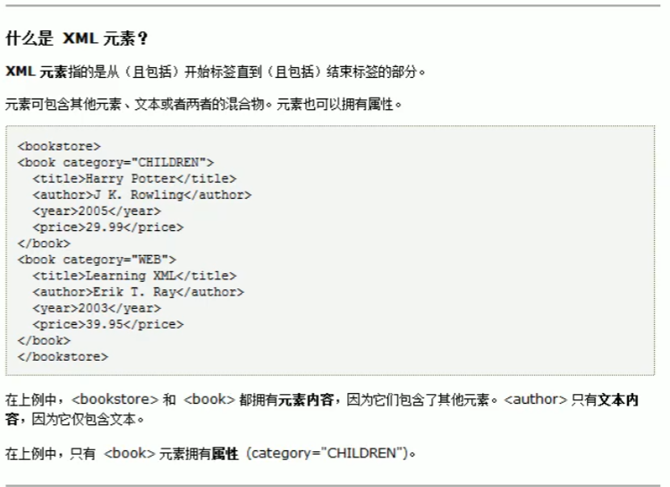

(2) xml元素命名规则

​	2.1）名称可以含数字字母以及其他字符( 中文也可以 )

​	2.2）名称不能以字符“xml”或者( XML Xml )开始

​	2.3）名称不能含空格

​	2.4）名称不要拿以数组或者标点符号开始

（3）xml元素也分单标签和双标签

```xml
<book sn = "SN20220417"><!--表示一个图书信息,sn表示序列号-->
    <name>时间简史</name><!--书名-->
    <author>霍金</author><!--作者-->
    <price>75</price><!--价格-->
</book>
<book sn = "sn9999999" name = "骆驼祥子" auther="老舍" price = "50"/>
```


##### 2.4 XML属性

```
xml属性和html标签属性是非常类似的,属性可以提供元素的额外信息
	标签上可以书写属性
		一个标签可以写多个属性,每个属性值用 引号 引起来
		
```

##### 2.5 语法规则

```
1.所有标签必须闭合

2.大小写敏感

3.xml标签必须正确的嵌套

4.xml文档必须有根元素
	根元素就是顶级元素(没有父标签的元素)
	
5.文本区域( CDATA区 )
	CDATA语法可以告诉 xml 解析器,CDATA里的内容是纯文本,不用解析
	<![CDATA[<<<这里是CDATA文本区域>>>]]>
	<![CDATA[  ...  ]]>
```


#### 3. xml解析

```
xml 是可扩展的 标记性语言
	和html都是标记性语言,都可以使用w3c组织制定的 dom 技术解析
```

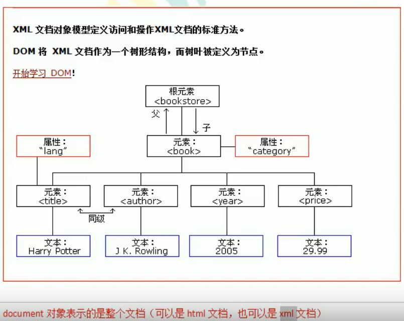

#### 4. dom4j(********)

```
第三方 需要下载dom4j
```

```
获取document对象
	创建一个lib目录, 添加dom4j jar包, 添加到项目
```

```java
package com.atguigu.pojo;

import org.dom4j.Document;
import org.dom4j.DocumentException;
import org.dom4j.Element;
import org.dom4j.io.SAXReader;
import org.testng.annotations.Test;

import java.util.List;

/**
 * @author 党
 * @version 1.0
 * 2022/4/17   17:27
 */
public class Dom4jTest {
    @Test
    public void test1() throws DocumentException {
        //创建一个SAXReader输入流,读取xml配置文件,生成document对象
        SAXReader saxReader = new SAXReader();
        Document document = saxReader.read("E:\\java\\java_base\\xml\\src\\books.xml");
        System.out.println(document);
        //org.dom4j.tree.DefaultDocument@1d76aeea [Document: name E:\java\java_base\xml\src\books.xml]
    }
    @Test
    //读取books.xml生成book类
    public void test2() throws DocumentException {
        //1.读取books.xml文件
        SAXReader saxReader = new SAXReader();
        //在junit中,相对路径从项目开始
        Document document = saxReader.read("src//books.xml");
        //2.通过dom对获取根元素
        Element rootElement = document.getRootElement();
        //System.out.println(rootElement);
        //org.dom4j.tree.DefaultElement@6e75aa0d [Element: <books attributes: []/>]
        //3.通过根元素获取book标签对象
        //element()方法和elements()都是通过标签名查找子元素
        List<Element> books = rootElement.elements("book");
        //4.遍历,处理每个book标签转换为Book类
        for (Element book : books){
            // asXML()把标签对象转换为标签字符串;取出xml文本
//            System.out.println(book.asXML());
            Element name = book.element("name");
            String text = name.getText();//获取标签文本内容
            System.out.println(text);
            //直接获取标签文本内容
            String author = book.elementText("author");
            System.out.println(author);
            //获取属性值内容
            String sn = book.attributeValue("sn");
            
        }
    }
}
```


## 05 Tomcat

#### 1.javaWeb的概念

##### 1.1 什么是javaWeb

```
javaWeb是指,所有通过java语言编写的可以通过浏览器访问的程序的总称,骄傲做javaWeb
javaWeb是基于请求和响应开发的
```

##### 1.2 什么是请求

```
请求是客户端给服务器发送数据，叫请求Request
```

##### 1.3 什么是响应

```
响应就是服务器给哭护短回传数据,叫响应,Response
```

##### 1.4 请求和响应的关系

```
请求和响应总是成对出现的,有请求就有响应
```

#### 2. Web资源的分类

```
web资源按实现的技术和呈现的效果不同,分为
	1.静态资源		2.动态资源

静态资源 : html  css  js txt mp4  jpg ...
动态资源 : jsp页面  Servlet程序
```

#### 3. 常用的Web服务器

```
Tomcat:由Apache组织提供的一种 web服务器，提供对jsp和servlet 的支持。它是一种轻量级的javaWeb容器〈服务器）,也是当前应用最广的JavaWeb服务器(免费)。

Jboss:是一个遵从JavaEE规范的、开放源代码的、纯Java的EJB服务器，它支持所有的JavaEE规范（免费）。

GlassFish:由Oracle公司开发的一款JavaWeb服务器，是一款强健的商业服务器，达到产品级质量(应用很少)。

Resin:是CAUCHO公司的产品，是一个非常流行的服务器，对servlet和JSP提供了良好的支持，性能也比较优良，resin自身采用JAVA语言开发（收费，应用比较多）。

webLogic:是oracle公司的产品，是目前应用最广泛的 web服务器，支持JavaEE规范，而且不断的完善以适应新的开发要求，适合大型项目(收费，用的不多，适合大公司)。
```

#### 4.Tomcat服务器和 Servlet版本的对应关系


```
Java Servlet 是运行在 Web 服务器或应用服务器上的程序，它是作为来自 Web 浏览器或其他 HTTP 客户端的请求和 HTTP 服务器上的数据库或应用程序之间的中间层。
```


#### 5. Tomcat安装

```
1.解压Tomcat.zip
	目录：
	bin : 可执行程序
	conf : 专门存放 Tomcat 配置文件
	lib : 存放Tomcat服务器jar包
	logs : 运行时日记信息
	temp : 运行时产生的临时数据
	webapps : 存放部署的web工程
	work : Tomcat工作时的目录 , 存放运行时jsp翻译为servlet源码和			   Session钝化(序列化)的目录

2.启动Tomcat服务器
	找打 bin 目录 startup.bat 双击[打开后不要关]
	判断Tomcat是否启动成功
		1.http://localhost:8080;
		2.http://127.0.0.1:8080;
		3.真实ip

3.启动Tomcat服务器
	命令行,对目录下
		启动命令：catalina run /  startup

4.停止tomcat
	1.关闭Tomcat服务器窗口
    2.bin 目录下的 shutdown
    
5.修改Tomcat端口号(默认8080)
	找到安装目录下的donf目录
		1.找server.xml
		<Connector port="8080" protocol="HTTP/1.1" connectionTimeout="20000" redirectPort="8443"/>;修改port属性,修改完要重启Tomcat服务器
		
```

<div><font color='red'>部署web工程到Tomcat中</div>

```
第一种部署方法
	部署web工程到Tomcat中
		在Tomcat安装目录下webapps下创建一个工程
		将自己的web工程目录拷贝到新建工程里面
	
    
	访问Tomcat中的工程
	http://ip:port/工程名/...目录/文件名
```

```
第二种部署方法
	在apache-tomcat-10.0.20\conf\Catalina\localhost中新建
		工程名.xml配置文件
	<!--
    Context表示工程上下文
    path = "xml路径(新的工程名)"[/xml文件名,不用和工程名一样]
    docBase = "工程目录在哪,不用一定在webapps下"
    -->
    <Context path="/book" docBase = "E:\java\javaWeb\lib\apache-tomcat-10.0.20\webapps\book"/>
	
	访问：http:ip:8080/工程名/路径
	
```

```
当
	http:ip:port时,没有工程名默认访问的root工程
	http:ip:port/工程名 没有资源名,默认访问index.html
	
```

将IDEA整和到Tomcat

```
创建java 项目,右键,添加框架支持
```

```
1.在web/WEB-INF下创建lib(存放jar包)

    目录
        src : 存放java源代码
        web : 用来存放web工程资源文件(html,css,js...)
        WEB-INF : 该目录是一个受服务器保护的目录(浏览器无法直接访问此目录)
        web.xml : 整个动态web工程的配置部署描述文件,可以配置web工程的组件,比如: Serclet程序,Filter过滤			器,Listener监听器,Session超时等
        lib : 存放第三方的jar包(需要导包)
```


## 06-Servlet

#### 1. 什么是servlet

```
1.servlet是javaEE规范(接口)之一
2.servlet是javaWeb三大组件之一(Servlet程序,Filter过滤器,Listener监听器)
3.servlie是运行在服务器上的java小程序,可以接收客户端发送的请求,并响应给客户端
```

#### 2. 创建Servlet程序

```
1.编写一个类实现servlet接口
2.实现service()方法,处理请求,并相应数据
3.到web.xml中配置servlet的访问地址
```

```java
package com.localhost;

import jakarta.servlet.*;

import java.io.IOException;

/**
 * @author 党
 * @version 1.0
 * 2022/4/18   13:35
 */
public class HelloServlet implements Servlet {

    @Override
    public void init(ServletConfig servletConfig) throws ServletException {

    }

    @Override
    public ServletConfig getServletConfig() {
        return null;
    }

    /**
     * service()方法专门处理请求和响应的
     * @param servletRequest
     * @param servletResponse*/
    @Override
    public void service(ServletRequest servletRequest, ServletResponse servletResponse) throws ServletException, IOException {
        System.out.println("service被响应");
    }

    @Override
    public String getServletInfo() {
        return null;
    }

    @Override
    public void destroy() {

    }
}

```

配置web.xml

```xml
<?xml version="1.0" encoding="UTF-8"?>
<web-app xmlns="http://xmlns.jcp.org/xml/ns/javaee"
         xmlns:xsi="http://www.w3.org/2001/XMLSchema-instance"
         xsi:schemaLocation="http://xmlns.jcp.org/xml/ns/javaee http://xmlns.jcp.org/xml/ns/javaee/web-app_4_0.xsd"
         version="4.0">
    <!--servlet给服务器配置servlet程序-->
    <servlet>
        <!-- 定义servlet的名称(一般是类名) -->
        <servlet-name>HelloServlet</servlet-name>
        <!-- 定义servlet的类名(全路径) -->
        <servlet-class>com.localhost.HelloServlet</servlet-class>
    </servlet>
    <!--servlet-mapping给程序配置访问地址-->
    <servlet-mapping>
        <!-- 告诉服务器,当前地址给哪个Servlet程序使用 -->
        <servlet-name>HelloServlet</servlet-name>
        <!--配置访问地址
            / 斜杠在服务器解析时,表示地址为http://ip:port/工程路径
            /hello 表示访问地址为http://ip:port/工程路径/hellO
        -->
        <url-pattern>/hello</url-pattern>
    </servlet-mapping>
</web-app>
```

#### 3. url地址访问Servlet程序

```
http://localhost:8080/工程路径/资源路径

http://localhost:8080/tomcat/hello
```


#### 4 Servlet的声明周期

```
1.执行Servlet构造方法

2.执行 init() 初始化方法

第一二步是在第一次访问的时候,创建Servlet程序会调用

3.执行 serveice() 方法
每一次都会执行

4.执行 destroy 销毁方法
web工程停止停止时才会执行

```

#### 5. get post 请求分发

```java
@Override
    public void service(ServletRequest servletRequest, ServletResponse servletResponse) throws ServletException, IOException {
        System.out.println("3.service方法");
        //类型转换
        HttpServletRequest servletRequest1 = (HttpServletRequest) servletRequest;
        //获取请求的方式[post,get]
        String method = servletRequest1.getMethod();
        if (method.equals("GET")){
            System.out.println("get请求");
        }else {
            System.out.println("post请求");
        }
//        System.out.println("service被响应");
    }
```

#### 6. 继承HttpServlet实现Servlet程序

```
一般开发中都是继承HttpServlet
1.编写一个继承HttpServlet的类
2.根据业务,重写doGet / doPost
3.配置web.xml
```

#### 7. Servlet继承体系

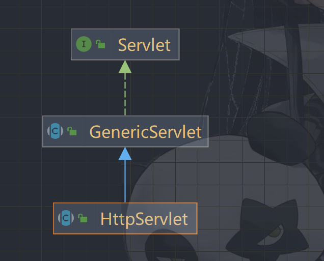


```
Serclet接口只是定义Servlet程序的访问规范

GenericServlet(abstract class)类实现了Servltet接口,实现了许多空实现,并持有一个ServletConfig类的引用,并对ServletConfig的使用做一些方法

HttpServlet抽象类实现了service()方法,并实现了请求的分发处理
```


#### 7. ServletConfig类

```
ServletConfig类是Servlet程序的配置信息类

Servlet程序和SercletConfig对象都是Tomcat服务器负责创建,我们负责使用

Servlet程序默认第一次访问的时候创建,Servlet是每个servlet程序创建时,就创建一个响应的ServletConfig对象
```


##### 7.1 ServletConfig类的三大作用

```
1.获取servlet程序的别名servlet-name的值

2.获取初始化参数init-param

3.获取ServletContext对象

```

```java
@Override
    public void init(ServletConfig servletConfig) throws ServletException {
        System.out.println("2.init初始化方法");
        //servletConfig可以获取servlet的配置文件信息
        //获取servlet程序别名<servlet-name>
        String servletName = servletConfig.getServletName();
        System.out.println(servletName);
        //获取初始化参数
        String initParam = servletConfig.getInitParameter("url");
        System.out.println(initParam);
        //获取servletContext对象
        ServletContext servletContext = servletConfig.getServletContext();
        System.out.println(servletContext);


    }
```

#### 8. ServletContext类

##### 8.1 ServletContext

```
1.SercletContext是一个接口,它表示Servlet上下文对象

2.一个web工程,只有一个ServletContext对象实例

3.ServletContext对象是一个域对象

4.ServletContext是在web工程创建时创建,web工程停止时销毁

什么是域对象：
	域对象,是可以像map一样存取数据的对象,叫域对象
	域指的是存取数据的操作范围[整个web工程]
	
	   存数据	    	取数据			删除数据
map	    put()           get()           remove()
域对象  setAttribute()  getAttribute()  removeAttribute()
	
	
```

##### 8.2 ServletContext作用

```
1.获取web.xml配置的上下文参数

2.获取当前工程路径

3.获取工程部署后在服务器硬盘上的绝对路径

4.像map一样存取数据
```

```xml
<!--context-param是上下文参数(属于整个web工程)可以配置多组-->
    <context-param>
        <param-name>username</param-name>
        <param-value>localhost</param-value>
    </context-param>
    <context-param>
        <param-name>password</param-name>
        <param-value>root</param-value>
    </context-param>
```

```java
@Override
    protected void doGet(HttpServletRequest request, HttpServletResponse response) throws ServletException, IOException {
        //可以获取到ServletConfig对象,访问servlet中的参数配置文件中的信息
        ServletConfig servletConfig = getServletConfig();
        ServletContext context = servletConfig.getServletContext();
//        1.获取web.xml配置的上下文参数
        String username = context.getInitParameter("username");
        System.out.println("username:" + username);
//        2.获取当前工程路径"/工程名称" 例如: /tomcat
        String path = context.getContextPath();
        System.out.println("path:" + path);
//        3.获取工程部署后在服务器硬盘上的绝对路径
        /**
         * "/"被服务器解析:http://localhost:8080/tomcat(工程名称)
         * E:\java\javaWeb\tomcat\out\artifacts\tomcat_war_exploded\
         *      映射到IDEA的web目录中
         * Using CATALINA_BASE:   "C:\Users\lenvoo\AppData\Local\JetBrains\IntelliJIdea2021.3\tomcat\3af1974e-6c83-4af6-a2cd-53fc7476e5a577930bec-69b1-4453-89e2-f1491fa71c28"
         * 是IDEA整合tomcat之后,Tomcat被拷贝的一些副本内容
         *      自己在项目里面写代码(web路径),tomcat会将项目部署到out\artifacts\项目名\   [绝对路径]
         *      同时,Tomcat的副本内容会被拷贝到CATALINA_BASE目录下conf\Catalina\localhost产生.xml文件
         *          <Context path="/tomcat" docBase="E:\java\javaWeb\tomcat\out\artifacts\tomcat_war_exploded" />
         * */
        String realPath = context.getRealPath("/");
        System.out.println("realPath:" + realPath);
//        4.像map一样存取数据
        context.setAttribute("user", "dang");
        String user = (String) context.getAttribute("user");
        System.out.println("user:" + user);
```


#### 9 Http协议

##### 9.1 什么是Http协议

```
协议:
	是指双方或多方相互约定好,大家都遵守的规则
Http协议:
	客户端和服务器之间通信时发送的数据,需要遵守的规则,叫做Http协议,Http协议中的数据叫做  报文  ;
```

##### 9.2 请求的Http协议格式( Request )

```
客户端给服务端发送数据叫做请求
服务器给客户端发送数据叫做响应

请求: -> get  post
```

###### 9.1.2 GET 请求

```
1.请求行:
	(1) 请求方式      GET
	(2) 请求资源路径[+?请求参数]
	(3) 请求的协议版本号
2.请求头
	key : value组成   不同的键值对,有不同的含义
```

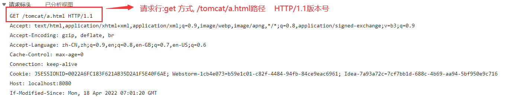

```
accept : 告诉服务器,客户端可以接收的数据类型(*/*任意)
accpet-Language : 语言类型 (中文 zh_CN  美国英文 en_US)
User-Agent : 浏览器信息
User-Agent : Mozilla/5.0 (Windows NT 10.0; Win64; x64; rv:99.0) Gecko/20100101 Firefox/99.0

Accept-Encoding : 客户端可以接收的数据编码(压缩)格式
Host : 请求的服务器ip和端口号
Connection : 告诉服务器当前连接如何处理:
	keep-Alive : 服务器回传完数据,不要马上关闭,保存一小段时间的连接
	Closed : 马上关闭
```

###### 9.1.2 POST请求

```
1.请求行:
	(1) 请求方式      POST
	(2) 请求资源路径
	(3) 请求的协议版本号

2.请求头
	key : value组成   不同的键值对,有不同的含义
	
空行
3.请求体[发送给服务器的数据]
	
```

```
请求头:
accept : 告诉服务器,客户端可以接收的数据类型(*/*任意)
accpet-Language : 语言类型 (中文 zh_CN  美国英文 en_US)
Referer : 请求发起时的地址
User-Agent : 浏览器信息
User-Agent : Mozilla/5.0 (Windows NT 10.0; Win64; x64; rv:99.0) Gecko/20100101 Firefox/99.0

Content-type : 表示发送的数据的类型
	1.application/x-www-form-ur lencoded
		表示提交的数据格式是 name = value&name = value,对其进行url编码,url是把非英文内容转换为%xx%xx
	2.mulipart/form-data
		以多端形式提交数据给服务器(流的形式)
Content-Length : 发送数据的长度
Cache-Control : 表示如何控制缓存,no-cache不缓存
```

##### 9.2区分POST和GET

​	

```
GET请求:
	1. form标签 method = "GET"
	2. a标签
	3. link标签引入css
	4. Script标签引入js文件
	5. img标签
	6. iframe标签
	7. 浏览器输入地址后回车
	
POST请求:
	1.form标签 method = "POST"
```

##### 9.3 响应的HTTP格式

```
1.响应行
	(1) 响应的协议版本号
	(2) 响应状态码  200
	(3) 响应状态描述符
2.响应头
	key : value
[空行]
3.响应体[回传给客户端的数据]
```

```
常用响应头:
	Server : 服务器信息
	Content-type : 响应体的数据类型
	Content-Length : 响应体的长度
	Date : 响应时间[格林时间]
```

##### 9.4 常见响应码

```
200 : 请求成功 

302 : 请求重定向 

404 : 请求,服务器收到了,但是数据不存在(请求地址错误)

500 : 表示服务器收到请求,但是服务器内部错误
```

##### 9.5 MIME类型说明

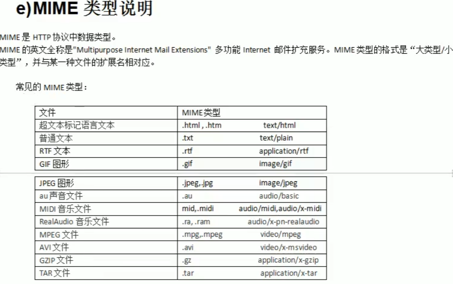

## 07-Servlet2


#### 1. HttpServletRequest类

```

1.HttpServletRequest类的作用
	每次只要有请求进入Tomcat服务器,Tomcat服务器就会把请求的HTTP协议信息解析号封装到Request对象中,然后传递到server()方法[doGet,doPost]中,我们可以通过HttpServletRequest对象,获取所有请求的信息
```

```
常用方法：
	getRequestURI() : 获取请求的资源路径
	getRequestURL() : 获取请求的统一资源定位符(绝对路径)
	getRemoteHost() : 获取客户端的ip地址
	getHeader()	    : 获取请求头
	getParameter()  : 获取请求的参数
	getParameterValues()  : 获取请求的参数(多个值)
	getMethod()     : 获取请求的方式
	setAttribute(key,value)  : 设置域数据
	gerAttribute(key)  : 获取域数据
	
	getRequestDispatcher() : 获取请求转发对象
```

```java
@Override
    public void doGet(HttpServletRequest request, HttpServletResponse response) throws ServletException, IOException {
        //获取请求资源路径
        String requestURI = request.getRequestURI();
        System.out.println("URI:"+requestURI);
        //获取请求资源的绝对路径
        StringBuffer requestURL = request.getRequestURL();
        System.out.println("URL:"+requestURL);
        //获取客户端ip
        /*
        * 使用(localhost和 127.0.0.1)IDEA中得到的是 127.0.0.1
        * 192.168.137.1[真实ip] 得到 192.168.137.1
        * */
        String ip = request.getRemoteHost();
        System.out.println("ip:"+ip);
        String remoteAddr = request.getRemoteAddr();
        System.out.println("remoteAddr:"+remoteAddr);
        //获取客户端端口
        int port = request.getRemotePort();
        System.out.println("port:"+port);
        //获取客户端浏览器信息[请求头]
        String userAgent = request.getHeader("user-agent");
        System.out.println("userAgent:"+userAgent);
        //获取请求方式
        String method = request.getMethod();
        System.out.println("method:"+method);

        //获取请求参数
        String name = request.getParameter("name");
        System.out.println("name:"+name);
        String sex = request.getParameter("sex");
        System.out.println("sex:"+sex);
        String age = request.getParameter("age");
        System.out.println("age:"+age);
        String password = request.getParameter("pw");
        System.out.println("password:"+password);
        //兴趣爱好
        String[] hobby = request.getParameterValues("hobby");
        System.out.println("hobby:"+ Arrays.asList(hobby));
    }
```

```java
@Override
    protected void doPost(HttpServletRequest req, HttpServletResponse resp) throws ServletException, IOException {
        //设置请求体的字符集,从而解决post请求的乱码问题
        //要在获取请求参数之前使用
        req.setCharacterEncoding("utf-8");
        doGet(req,resp);
    }
```

#### 2. 请求转发

```
什么是请求转发:
	服务器收到请求后,从一个资源[servlet-1]跳到另一个资源[servlet-2]
```

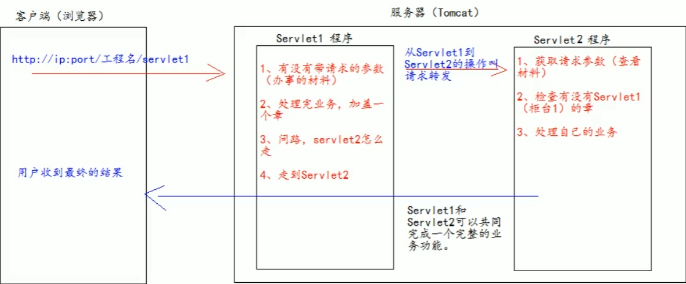

```
getRequestDispatcher() : 获取请求转发对象
//转发
requestDispatcher.forward(req,resp);
```


Servlet_1

```java
package com.request;

import jakarta.servlet.RequestDispatcher;
import jakarta.servlet.ServletException;
import jakarta.servlet.http.HttpServlet;
import jakarta.servlet.http.HttpServletRequest;
import jakarta.servlet.http.HttpServletResponse;

import java.io.IOException;

/**
 * @author 党
 * @version 1.0
 * 2022/4/19   13:54
 */
public class Servlet_1 extends HttpServlet {
    @Override
    protected void doGet(HttpServletRequest req, HttpServletResponse resp) throws ServletException, IOException {
        //获取请求参数
        String name = req.getParameter("name");
        System.out.println("servlet_1_name"+name);

        //使用域数据
        req.setAttribute("key","Servlet_1标记");

        //问路servlet_2
        /*
        * 请求转发必须要以 "/"开头,表示 http://localhost:8080/tomcat/
        *  */
        RequestDispatcher requestDispatcher = req.getRequestDispatcher("/servlet2");
        //转发
        requestDispatcher.forward(req,resp);
    }
}

```

Servlet_2

```java
package com.request;

import jakarta.servlet.ServletException;
import jakarta.servlet.http.HttpServlet;
import jakarta.servlet.http.HttpServletRequest;
import jakarta.servlet.http.HttpServletResponse;

import java.io.IOException;

/**
 * @author 党
 * @version 1.0
 * 2022/4/19   13:55
 */
public class Servlet_2 extends HttpServlet {
    @Override
    protected void doGet(HttpServletRequest req, HttpServletResponse resp) throws ServletException, IOException {
        //获取参数
        String name = req.getParameter("name");
        System.out.println("Servlet_2_name:"+name);
        //查看servlet_1写的域数据
        Object key = req.getAttribute("key");
        System.out.println("Servlet_1_2_key:"+key);

        System.out.println("servlet_2执行业务逻辑");


    }
}
```

##### 2.2 请求转发特点

```
1. 浏览器地址栏没有变化
比如 访问 a  (a请求转发 -> b)
	浏览器中的地址仍然是a (请求转发不会改变地址)


2. 他们是一次请求

3. 他们共享Request域[request域一次请求有效]中对象

4. 可以转发到 WEB-INF 目录下
	httpServletRequset.getRequestDispatcher("/WEB-INF/..")
	
5. 不可以访问工程以外的资源("http://www.baidu.com")
```

#### 3. base标签

```
base标签可以设置页面相对路径工作时的参照地址
<head>
	<base herf="http://localhost:8080/tomcat/../../..">
</head>
```

#### 4. 斜杠

```

web中 / 是一种绝对路径
 / 被浏览器解析: http://ip:port/
 
 / 被服务器解析 : http://ip:port/工程路径
 
特殊情况:response.sendRediect("/") [请求重定向]把 / 发送给浏览器解析,解析http://ip:port/
```

#### 5. HttpServletResponse类

```

1.HttpServletResponse类的作用:
	HttpServletResponse 和 HttpServletRequest 类一样,每次请求进来,Tomcat服务器会创建一个Response对象传递给Servlet程序取使用,HttpServletRequest 表示请求过来的信息,HttpServletResponse表示所有响应的信息,如果需要设置返回给客户端的信息,都可以通过HttpServletResponse对象进行设置
```

```
2.两个输出流的说明
	
	字节流  getOutputStream();    常用于下载(二进制数据)
	
	字符流  getWrite();		  常用于回传字符串

两个流同时只能使用一个
```

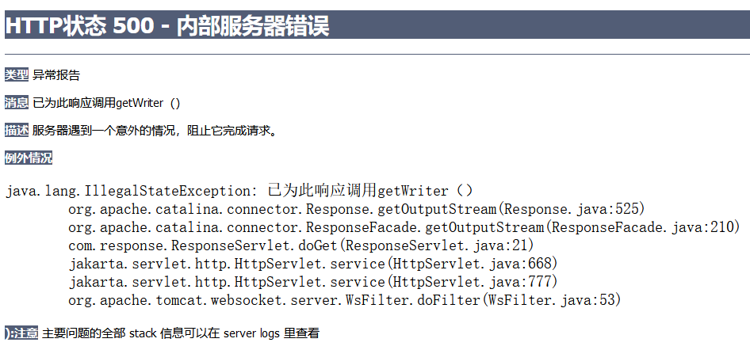


##### 5.1 往客户端传回字符串数据

```
protected void doGet(HttpServletRequest req, HttpServletResponse resp) throws ServletException, IOException {
	    //查看服务器编码
        String characterEncoding = resp.getCharacterEncoding();
        //设置服务器编码
        resp.setCharacterEncoding("utf-8");
        //浏览器和服务器编码不一致，需要设置浏览器编码
        resp.setContentType("text/html;charset=utf-8");//设置浏览器编码 同时也设置服务器的编码
        PrintWriter writer = resp.getWriter();
        writer.write("内容");
        
    }
```

#### 6. 请求重定向

```
请求重定向：
	是指客户端给服务器发请求,然后服务器告诉客户端一个新地址,让客户端去访问新地址
```

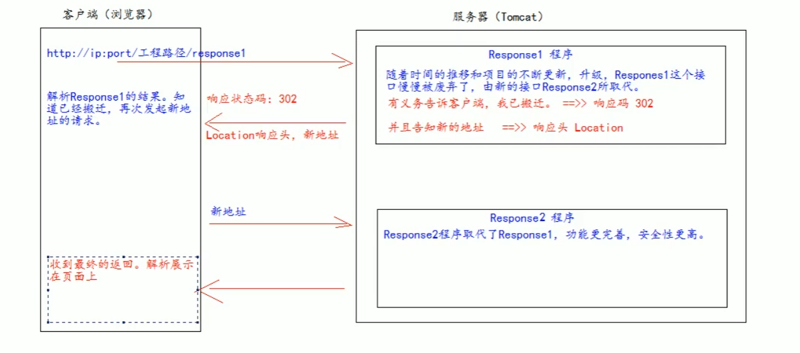

Response_old

```java

public class Response_old extends HttpServlet {
    @Override
    protected void doGet(HttpServletRequest req, HttpServletResponse resp) throws ServletException, IOException {
        resp.setContentType("text/html;charset=utf-8");
        resp.getWriter().write("Response_old");
        //设置响应状态码
        resp.setStatus(302);
        //设置响应头,重定向
        resp.setHeader("Location","http://localhost:8080/tomcat/response_new");
    }
}

```

Response_new

```java
public class Response_new extends HttpServlet {
    @Override
    protected void doGet(HttpServletRequest req, HttpServletResponse resp) throws ServletException, IOException {
        resp.setContentType("text/html;charset=utf-8");
        resp.getWriter().write("Response_new 欢迎");
    }
}
```

```
特点：
	1. 浏览器地址会变化
	2. 两次请求
	3. 不共享Request域数据
	4. 不能跳入 WEB-INF 目录下
	5. 可以访问工程以外的资源("http://www.baidu.com")
```

```
//第一种方式
        //设置响应状态码
        resp.setStatus(302);
        //设置响应头,重定向
        			resp.setHeader("Location","http://localhost:8080/tomcat/response_new");

        //第二种方式
        resp.sendRedirect("http://localhost:8080/tomcat/response_new");
```


#### 7. JavaEE三层架构

,翻译出来的是一个Servlet程序( 通过输出流将html文件回传给客户端 )

```


#### 3. jsp的page指令

```

<%@ page contentType="text/html;charset=UTF-8" language="java" %>

1. language属性      表示翻译后是什么语言,只支持 java
2. charset属性       表示返回数据类型
3. pageEncoding属性  表示当前jsp页面文件本身的字符集
4. import属性        用于导包，导类

==================输出流==========================
5. autoFlush属性     设置当out输出流缓冲区满了之后自动刷新(默认true)
6. buffer属性        设置缓冲区的大小(default 8kb)

====================其他===========================
7. errorPage属性     设置当jsp页面出错,自动跳转的路径 
8.isErrorPage属性    设置当前页面是否是错误信息页面(default false),如果是true可以获取异常信息
9. session属性       设置当前页面是否会创建HttpSession对=对象,deflaut true
10 extends属性	   设置jsp翻译出的java类默认继承 xx

```

#### 4 jsp脚本

##### 4.1 声明脚本

```

1.声明脚本
	格式:
	<%!
		声明java代码
	%>
	作用:可以给jsp声明出的类定义属性,方法，静态代码块等
```


```jsp
<%@ page import="java.util.Map" %>
<%@ page import="java.util.HashMap" %><%--
  Created by IntelliJ IDEA.
  User: lenvoo
  Date: 2022/4/20
  Time: 19:34
  To change this template use File | Settings | File Templates.
--%>
<%@ page contentType="text/html;charset=UTF-8" language="java" %>
<html>
<head>
    <title>Title</title>
</head>
<body>
    <!--声明类属性-->
    <%!
        String name = "lenvoo";
        int age = 18;
        private static Map<String,Object> map;
    %>
    <!--声明static静态代码块-->
    <%!
        static {
            map = new HashMap<String,Object>();
            map.put("name","name");
            map.put("age",20);
        }
    %>
    <!--声明方法-->
    <%!
        public String getName(){
            return name;
        }
        public int getAge(){
            return age;
        }
        public static Map<String,Object> getMap(){
            return map;
        }
    %>
    <!--声明内部类-->
    <%!
        public class InnerClass{
            private String name;
            private int age;
            public InnerClass(){
                this.name = "inner";
                this.age = 18;
            }
            public String getName(){
                return name;
            }
            public int getAge(){
                return age;
            }
        }
    %>
</body>
</html>
```

##### 4.2 表达式脚本

```

表达式脚本：
	格式<%=  %>
	作用:在jsp页面输出数据
	
	特点：
		1.表达式脚本会翻译到_jspService()方法中
		2.表达式脚本会被翻译成为out_print()输出到页面上
		3.因为表达式脚本的内容都在_jspService()方法中,所以_jspService方法中的对象可以直接使用
		4.表达式脚本的表达式不能以分号结束
	
```

```jsp
<body>
    <%=123%><br>
<%=new HashSet<>()%>
    <%=request.getParameter("name")%>
</body>
```

#### 4.3 代码脚本

```

格式
<%java代码%>
作用:
	可以在jsp页面中,编写自己的功能
	
	特点:
		1.代码脚本翻译后都在_jspService()方法中
		2._jspService()方法中的所有对象都可以直接使用
		3.代码脚本可以由多个代码脚本块组合完成一个java语句
		4.代码脚本可以和表达式脚本组合使用
```

```jsp
<body>
    <%
        int i = 0;
        if (i == 12) {
            System.out.println("i is 12");
        } else if (i == 13) {
            System.out.println("i is 13");
        } else {
            System.out.println("i is not 12 or 13");
        }
    %>
    <%
        for (int j = 0;j < 10; j++){
            System.out.println("j is " + j);
        }
    %>
    <%
        String name = request.getParameter("name");

    %>
</body>
```

```jsp
<%
    for (int j = 0;j < 10; j++){
%>
	<%= j %>
<%
    }
%>
```


#### 5. jsp九大内置对象


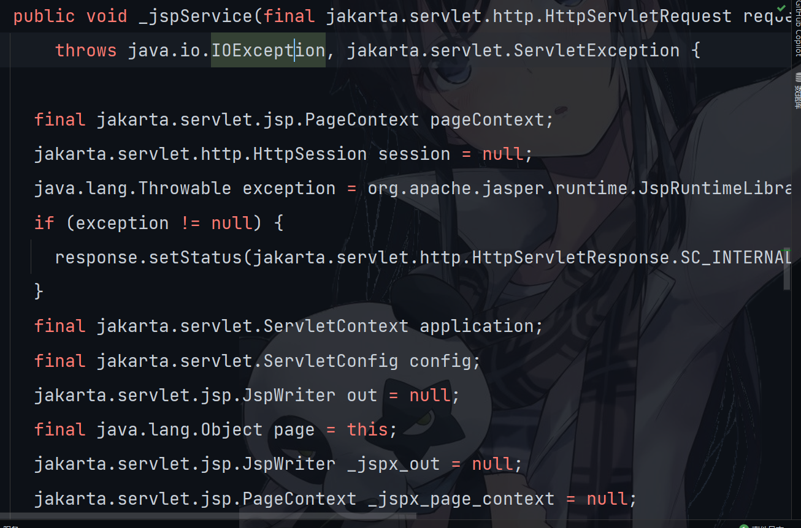

```


request    请求对象

response   响应对象

pageContext  jsp的上下文对象

session    会话对象

application   ServletContext对象

config      ServletConfig对象

out     jsp输出流

page  指向当前jsp对象

Exception    异常对象
```


#### 6. jsp四大域对象

```

1. pageContext(PageContext)
	当前jsp页面范围内有效

2.request(HttpServletRequest类)
	一次请求内有效
	
3.session(HttpSession)
	一次会话范围有效[打开浏览器 直到 关闭浏览器]
	
4.applocation(ServletContext)
	整个web工程内

四个域使用有限顺序
	pageContext
	request
	session
	applocation
	由小到大
```


#### 7. jsp中out和response.getWriter的区别

```jsp
<body>
    <%
        response.getWriter().write("Hello World! --response.getWriter().write()");
        response.getWriter().write("<br>");
        out.write("Hello World!  -- out.write");
        out.write("<br>");
    %>
</body>
```

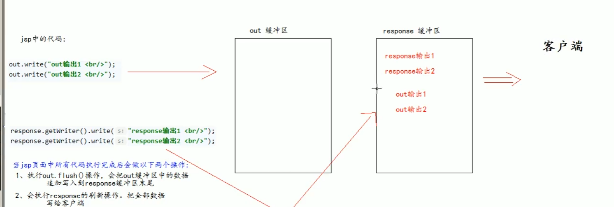


```
所以：
	respons的输出在out前

注意：
	out.write()只适合输出字符串
	out.print()适合所有的
	print将任意变成字符串后用write输出
	write在输出整形的时候,会将整形数据转成ASCILL值后放入缓冲区,输出
```

#### 8. jsp常用标签 

##### 8.1 静态包含

```
静态包含
	<%@ 
		include file = "/"
	%>
/ 代表 http://ip:port/工程/  映射到web目录
```

```
特点：
	1.静态包含不会翻译被包含的jsp页面
	2.静态包含其实是把被包含的jsp页面代码拷贝到包含的对应位置
```

##### 8.2 动态包含

```

<jsp:include page = "/"></jsp:include>
```

```
page属性是指定包含的jsp路径

动态包含也可以像静态包含一样,将被包含内容输出到包含位置

特点：
	1.动态包含也会翻译被包含的jsp文件,变成java源代码
	2.动态包含底层代码调用被包含的jsp执行输出
		JspRuntimeLibrary.include(request,response,"/.jsp",out,false);
	requset，response，out是传递过来的引用对象,共用一个缓冲区
	也可以使用传递过来的request等对象获取参数...
```

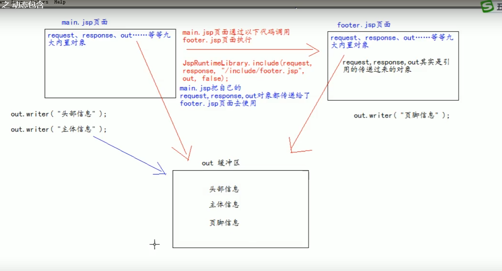


#### 8.3 请求转发

```
<%
        //请求转发，一次请求
        request.getRequestDispatcher("/scope2.jsp").forward(request, response);
    %>
```

```xml
<jsp:forward page = "/"></jsp:forward>
```

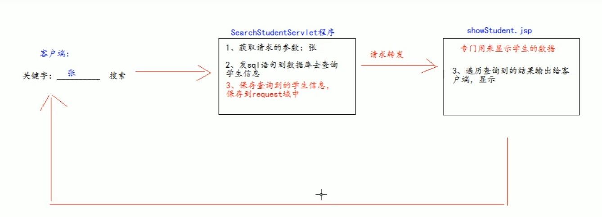

```
注意：
	不能直接访问jsp,必须经过servlet程序,要不然resquest域中没数据
```

#### 9. Listener监听器

##### 9.1 什么是Listener监听器

```
1.Listerne监听器是javaWeb的三大组件之一,javaWeb三大组件(servlet程序,Listener监听器,Filter过滤器)

2.Listener监听器是javaEE的规范

3.监听器的作用是,监听某种事务的变化,然后通过回调函数,反馈给客户(程序)去做一些相应的处理

```


##### 9.2 ServletContextListener监听器

```

ServletContextListener可以监听ServletContext对象的创建和销毁

监听到创建和销毁后会分别调用ServletContextListener监听器的方法反馈

```

```java
//
// Source code recreated from a .class file by IntelliJ IDEA
// (powered by FernFlower decompiler)
//

package jakarta.servlet;

import java.util.EventListener;

public interface ServletContextListener extends EventListener {
    /**
    * 在ServletContext对象创建调用,做初始化
    */
    default void contextInitialized(ServletContextEvent sce) {
    }
	/**
	* servletContext对象销毁使用
	*/
    default void contextDestroyed(ServletContextEvent sce) {
    }
}
```

```
使用方法：
	1.创建类实现ServletContextListener接口
	2.实现方法
	3.web.xml配置文件配置
```


```xml
<!--    配置监听器-->
    <listener>
        <listener-class>com.local.listener.ListenerImpl</listener-class>
    </listener>
```

```java
package com.local.listener;

import jakarta.servlet.ServletContextListener;

/**
 * @author 党
 * @version 1.0
 * 2022/4/20   21:38
 */
public class ListenerImpl implements ServletContextListener {
    @Override
    public void contextInitialized(jakarta.servlet.ServletContextEvent servletContextEvent) {
        System.out.println("ListenerImpl.contextInitialized");
    }

    @Override
    public void contextDestroyed(jakarta.servlet.ServletContextEvent servletContextEvent) {
        System.out.println("ListenerImpl.contextDestroyed");
    }
}
```

## 09 EL表达式

#### 9.1 什么是EL表达式

```

EL表达式的全称是Experssion Langeuage 表达式语言

EL表达式作用：
	主要是替代jsp页面中的表达式脚本(<%=%)在jsp页面中进行数据输出
```

```jsp
<%--
  Created by IntelliJ IDEA.
  User: lenvoo
  Date: 2022/4/21
  Time: 10:22
  To change this template use File | Settings | File Templates.
--%>
<%@ page contentType="text/html;charset=UTF-8" language="java" %>
<html>
<head>
    <title>Title</title>
</head>
<body>
    <%
        request.setAttribute("name", "lenvoo");
    %>
    表达式脚本输出:name1
    <%=
        request.getAttribute("name1")
    %>
    <br>name
    <%=
        request.getAttribute("name")
    %>
    <br>
    el表达式脚本输出:
    name:${name}<br>
    name1:${name1}
</body>
</html>
```

```
el表达式输出格式
	${表达式}
	el表达式输出null值会输出空串
jsp表达式输出null 输出的null字符串
```

#### 2. el表示式输出

```

el表达式主要是输出域中的数据

如果四个域中都有相同的key 

${key}的输出顺序为
	pageContext[当前页面]
	request[一次请求]
	session[当前会话]
	application[当前工程]


```

##### 2.1 el输出Bean对象属性


```java
package com.local.pijo;

import java.util.Arrays;
import java.util.List;
import java.util.Map;

/**
 * @author 党
 * @version 1.0
 * 2022/4/21   10:36
 */
public class Person {
    private String name;
    private String[] phone;
    private List<String> cities;
    private Map<String,Object> map;

    public Person() {
    }

    public Person(String name, String[] phone, List<String> cities, Map<String, Object> map) {
        this.name = name;
        this.phone = phone;
        this.cities = cities;
        this.map = map;
    }

    @Override
    public String toString() {
        return "Person{" +
                "name='" + name + '\'' +
                ", phone=" + Arrays.toString(phone) +
                ", cities=" + cities +
                ", map=" + map +
                '}';
    }

    public String getName() {
        return name;
    }

    public void setName(String name) {
        this.name = name;
    }

    public String[] getPhone() {
        return phone;
    }

    public void setPhone(String[] phone) {
        this.phone = phone;
    }

    public List<String> getCities() {
        return cities;
    }

    public void setCities(List<String> cities) {
        this.cities = cities;
    }

    public Map<String, Object> getMap() {
        return map;
    }

    public void setMap(Map<String, Object> map) {
        this.map = map;
    }
}
```

```jsp
<%@ page import="com.local.pijo.Person" %>
<%@ page import="java.util.*" %><%--
  Created by IntelliJ IDEA.
  User: lenvoo
  Date: 2022/4/21
  Time: 10:38
  To change this template use File | Settings | File Templates.
--%>
<%@ page contentType="text/html;charset=UTF-8" language="java" %>
<html>
<head>
    <title>Title</title>
</head>
<body>
  <%
      Person person = new Person();
      person.setName("Tom");
      person.setPhone(new String[]{"123456789","987654321"});
      person.setCities(Arrays.asList("Beijing","Shanghai","Guangzhou"));
      HashMap<String, Object> map = new HashMap<>();
      map.put("name","Tom");
      map.put("phone",new String[]{"123456789","987654321"});
      person.setMap(map);
      pageContext.setAttribute("person",person);
  %>
    输出person对象：${person}<br>
    person.name:${person.name}<br>
    person.phone:${person.phone[0]}<br>
    person.cities:${person.cities[0]}<br>
    person.map:${person.map.get("name")}<br>
</body>
</html>

```

```
el表达式找的不是值属性而是找get方法
```

##### 2.2 el运算

```
逻辑运算，关系运算，算术运算

empty运算

	empty运算可以判断一个数据是否为空,如果为空，返回true,eles false
	
	1.null 为空
	2.空串 为空
	3. 数组,list,map 长度为 0 

${empty key}

三元运算
	表达式1?表达式2:表达式3
	
. 运算
	可以输出bean对象中某个元素的值

[] 运算
	可以输出有序集合中某个元素的值
	还可以输出map中含有特殊字符的key
	<%map.put("a.a.a","value")%>
	${ map['a.a.a'] }<!-- 单引号双引号都行 -->
```

#### 3 el表达式11个隐含对象

```

el表达式中11个隐含对象是自己定义的
变量                类型                         作用
pageContext       PageContextImpl        获取jsp中的九大内置对象

pageScope         Map<STring,Object>     获取pageContext域中数据
requestScope      Map<STring,Object>     获取Request域数据
sessionScope      Map<STring,Object>     获取session域数据
applocationScope  Map<STring,Object>     获取application域数据

param             Map<STring,String>     获取请求参数的值
paramValues       Map<STring,String>     获取多个请求参数(hobby)

header            Map<STring,String>     获取请求头信息
headerValues      Map<STring,String[]>   获取请求头信息,多个值

cookie            Map<STring,Cookie>     获取当前请求Cookie信息
initParam         Map<String,String>     获取web.xml中<context-param>上下文信息
```


```
<%
    request.setAttribute("mm","赵迪");
%>
输出person对象：${person}<br>
person.name:${person.name}<br>
person.phone:${person.phone[0]}<br>
person.cities:${person.cities[0]}<br>
person.map:${person.map.get("name")}<br>
request域数据:${requestScope.get("mm")}<br>
request域数据:${pageContext.request.getAttribute("mm")}
```

## 10 JSTL标签库

```

jstl标签库全称: jsp Standar Tag library      jsp标准标签库

el表达式主要是替换jsp中的表达式脚本<%= %>
jstl标签库为了替换代码脚本<%  %>
```


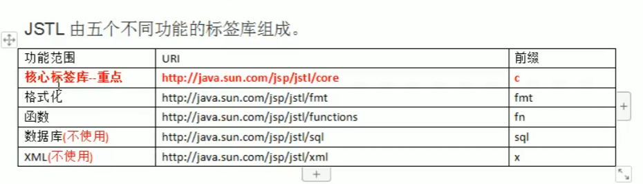

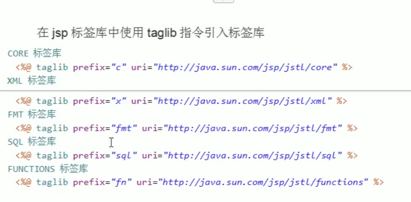


```jsp
<%@ page import="java.util.HashMap" %>
<%@ page import="java.util.ArrayList" %>
<%@ page import="com.local.pijo.Person" %><%--
  Created by IntelliJ IDEA.
  User: lenvoo
  Date: 2022/4/21
  Time: 12:16
  To change this template use File | Settings | File Templates.
--%>
<%@ page contentType="text/html;charset=UTF-8" language="java" %>
<%@ taglib prefix="c" uri="http://java.sun.com/jsp/jstl/core" %>
<html>
<head>
    <title>Title</title>
</head>
<body>
<%--
    <c:set/>往域中保存数据
    scope 表示域对象 : setAttribute(String name, Object value)
        page 表示 pageContext域(默认)
        request 表示 request域
        session 表示 session域
        application 表示 application域
    var表示 key
    value表示值
--%>
<c:set scope="request" var="name" value="lenvoo"/>
<c:set scope="page" var="age" value="18"/>
<%--
    if:<c:if/>if判断
        text 表示 判断的条件(el表达式)${}
--%>
<c:if test="${12 == 12}">
    ${12}
</c:if>
<%--
    <c:choose>选择
    <c:when text> 判断
    <c:otherwise>
    注意
        1.标签内不要使用html注释,要使用jsp注释
        2.when标签的父标签一定是choose标签(在otherwise中写when标签也要写choose标签)
--%>
<c:set scope="request" var="height" value="183"/>
<c:choose>
    <c:when test="${requestScope[height]}">
        ${"有点高"}
    </c:when>
    <c:otherwise>
        ${"刚刚好"}
    </c:otherwise>
</c:choose>
<%--
    <c:forEach items="">遍历
        begin 设置开始索引
        end 设置结束索引
        step 步长
        var 表示遍历的变量(也是当前的数据)
        varStatus表示当前输出的状态

--%>
<c:forEach begin="0" end="10" var="i" step="1">
    ${i}
</c:forEach>
<%--
    for(Object : arr)
    item 表示数据源 requestScope[arr]
    var 表示当前数据
    varStatus表示当前输出的状态
 --%>
<c:forEach items="${arr}" var="i">
    ${i}
</c:forEach>
<%--遍历map--%>
<%
    HashMap<String, String> map = new HashMap<>();
    map.put("name", "lenvoo");
    map.put("age", "18");
    request.setAttribute("map", map);
%>
<c:forEach items="${requestScope.map}" var="i">
    ${i.key} : ${i.value}
</c:forEach>
<br>
<%--遍历list集合--%>
<%
    ArrayList<Person> list = new ArrayList<>();
    list.add(new Person("lenvoo",null,null,null));
    list.add(new Person());
    request.setAttribute("list", list);
%>
    <c:forEach items="${requestScope.list}" var="i">
        ${i}
    </c:forEach>
</body>
</html>
```

##### LoopTagStatus类


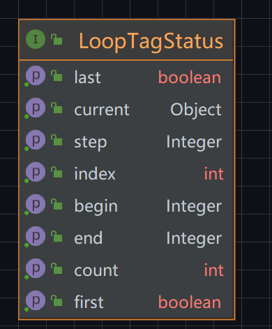

```
getCurrnet      当前数据
getIndex        索引
getCount        遍历的个数
isLast          是否是遍历的最后一个
isFirst         是否是遍历的第一个
getBegin	    获取属性
getEnd
getStep
```

## 11 文件上传和下载

#### 1 文件上传介绍

```

1. form标签 method = post请求

2. form标签的encType 属性必须为 multipart/form-data
	encType = multipart/form-data表示提交的数据以多段形式进行拼接,然后以二进制发送服务器
	
3. form标签中使用input type = file添加上传文件

4. 使用服务器接收
```

#### 2. 准备

```
1. 导入 jar包 commons-fileUpload   commons-io

2.常用类

	ServletFileUpolad类  解析上传数据
	
	Fileitem类           表示每一个表单项
	
	public List<Fileitem> parseRequest(HttpServletReqest req)
		解析上传数据
	
	boolean FileItem isFormFiled()
		判断当前表单项是否是普通的表单项,还是上传的文件类型
		true表示为普通的表单项
		flase表示为上传的文件类型
	
	String FileItem getFileItemName()
		获取表单项的name属性值
		
	String FileItem getString()
		获取当前表单项内容
		
	String FileItem getName()
		获取上传的文件名
		
	void FileItem.write(file)
		将上传的文件写到参数file所指向的位置
```

```java
package com.local.servlet;

import org.apache.commons.fileupload.FileItem;
import org.apache.commons.fileupload.FileItemFactory;
import org.apache.commons.fileupload.disk.DiskFileItemFactory;
import org.apache.commons.fileupload.servlet.ServletFileUpload;

import javax.servlet.ServletException;
import javax.servlet.http.HttpServlet;
import javax.servlet.http.HttpServletRequest;
import javax.servlet.http.HttpServletResponse;
import java.io.File;
import java.io.IOException;
import java.util.List;

/**
 * @author 党
 * @version 1.0
 * 2022/4/21   18:20
 */
public class UploadServlet extends HttpServlet {
    @Override
    protected void doPost(HttpServletRequest req, HttpServletResponse resp) throws ServletException, IOException {
        //1.判断上传数据是否是多段上传,只有多段上传才是文件,才可以解析
        if (ServletFileUpload.isMultipartContent(req)) {
            //创建DiskFileItemFactory对象
            FileItemFactory fileItemFactory = new DiskFileItemFactory();
            //创建用于解析上传数据的ServletFileUpload对象
            ServletFileUpload servletFileUpload = new ServletFileUpload(fileItemFactory);
            //解析上传数据
            try {
                //得到每一个表单项
                List<FileItem> fileItems = servletFileUpload.parseRequest(req);
                //判断每一个表单项是普通类型还是上传的文件
                for (FileItem fileItem : fileItems) {
                    //判断是否是普通类型
                    if (fileItem.isFormField()) {
                        //普通类型
                        //获取表单项的name属性
                        String name = fileItem.getFieldName();
                        System.out.println("表单项属性:"+name);
                        //获取表单项的值,UTF-8编码防止乱码
                        String value = fileItem.getString("UTF-8");
                        System.out.println("表单项值:"+value);
                    } else {//是上传的文件
                        //表单项的name属性
                        String fieldName = fileItem.getFieldName();
                        System.out.println("表单项属性:"+fieldName);
                        //获取上传文件的名称
                        String name = fileItem.getName();
                        System.out.println("上传文件的名称:"+name);
                        //获取上传文件的输入流
                        fileItem.write(new File("D:\\" + name));
                    }
                }
            } catch (Exception e) {
                e.printStackTrace();
            }
        }
    }
    
}
```

<div><font color = "red">注意:jsp页面中的表单项一点要写name属性,要不然收不到！！</font></div>


#### 3. 文件下载


```java

package com.local.servlet; /**
 * @author 党
 * @version 1.0
 * 2022/4/21   19:11
 */

import org.apache.commons.io.IOUtils;

import javax.servlet.*;
import javax.servlet.http.*;
import javax.servlet.annotation.*;
import java.io.IOException;
import java.io.InputStream;
import java.io.PrintWriter;
import java.net.URLEncoder;

@WebServlet(name = "Download", value = "/Download")
public class Download extends HttpServlet {
    @Override
    protected void doGet(HttpServletRequest request, HttpServletResponse response) throws ServletException, IOException {
        //1.获取下载的文件名
        String down = "1.png";
        //2.获取下载的文件内容(通过ServletContext对象)
        ServletContext servletContext = getServletContext();
        InputStream resourceAsStream = servletContext.getResourceAsStream("/phone/" + down);

        //3.回传前,告诉下载的文件类型
        String mimeType = servletContext.getMimeType("/phone/" + down);
        response.setContentType(mimeType);

        //4.告诉客户端是下载的,不设置就是查看
        //设置filename属性值,设置下载的文件名
        response.setHeader("content-disposition", "attachment;filename=" + down);
        //如果文件名是中文,需要转码
        //response.setHeader("content-disposition", "attachment;filename=" + URLEncoder.encode(down, "UTF-8"));

        //5..把文件内容传回客户端
        //获取响应的输出流
        ServletOutputStream outputStream = response.getOutputStream();
        IOUtils.copy(resourceAsStream,outputStream);//拷贝

        //

    }

    @Override
    protected void doPost(HttpServletRequest request, HttpServletResponse response) throws ServletException, IOException {

    }
}


```


#### 4. 中文乱码问题:

​	

```
使用 url编码就行
response.setHeader("content-disposition", "attachment;filename=" + URLEncoder.encode(down, "UTF-8"));
```

##### 5. 查看浏览器

```
user-Agent
	if(request.getHander("User-Agent").contains("Firefox")){
	
	}
```


## 12 MVC介绍

```

MVC 全称 Model模型 View视图  Controler控制器

MVC出现在javaEE中的Web层,可以有效的知道Web层的代码如何有效分类,单独工作

View视图:只负责数据和页面的显示,不接受任何域显示数据无关的代码,变于程序员和美工的分工合作

Controler控制器,只负责接收请求,用于业务层面的代码处理请求,然后重新派发页面,是一个调度者的角色,--Servlet定向到某个页面或者转到某个页面

Model模型:将于业务逻辑相关的数据封装为具体的javaBean类,其中不参与任何于数据处理相关的代码

MVC的目的是降低耦合

```

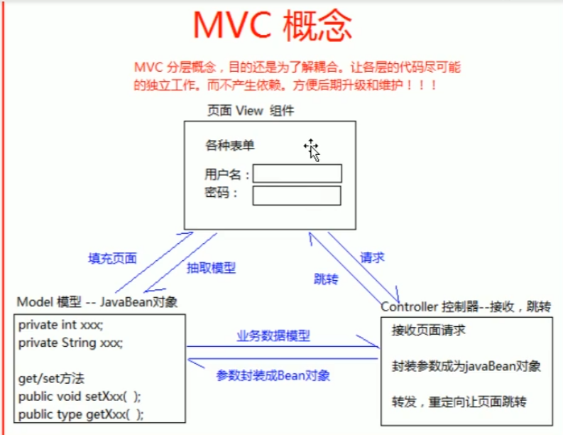


## #####

```
参考servlet中的接口：

request.getScheme();
返回的协议名称,默认是http

request.getServerName()
返回的是你浏览器中显示的主机名，你自己试一下就知道了

getServerPort()
获取服务器端口号

request.getContextPath()
获取工程名
```


## 13 Cookie

#### 1. 什么是Cookie

```

Cookie (饼干) 是服务器通知客户端保存键值对的一种技术

客户端有了Cookie后,每次请求都发送给服务器

每个Cookie的大小不能大于 4kb
```

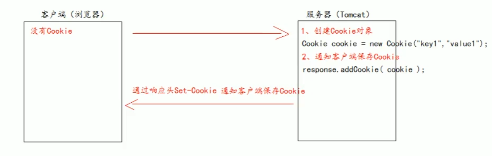

#### 2. Cookie生命控制

```

Cookie的生命控制指的是如何管理Cookie什么时候被销毁(删除)

	setMaxAge()方法
		正数表示在指定的秒数后过期
		负数表示浏览器关闭,Cookie就被删除(defalut  -1)
		0表示马上删除Cookie(删除方法)

```

#### 3. Cookie有效路径Path设置

```

Cookie的path属性可以有效的过滤哪些Cookie可以发送给服务器,那些不发
path属性是通过请求的地址来进行有效的过滤

    CookieA   path = /工程路径
    CookieB   path = /工程路径/abc
  
cookie.setPath(request.getContextPath());//设置Cookie的路径

请求地址为
	http://ip:localhost/工程路/a.html
	此时CookieA 发送,B不发送
	
	http://ip:localhost/工程路/abc/a.html
	此时CookieA 发送,B 也发送
	
	
```


```java
package com.local.servlet;

import com.local.util.CookieUtils;

import javax.servlet.ServletException;
import javax.servlet.http.Cookie;
import javax.servlet.http.HttpServletRequest;
import javax.servlet.http.HttpServletResponse;
import java.io.IOException;
import java.io.PrintWriter;

/**
 * @author 党
 * @version 1.0
 * 2022/4/25   21:13
 */
public class CookieServlet extends BaseServlet{
    @Override
    protected void doGet(HttpServletRequest req, HttpServletResponse resp) throws ServletException, IOException {
        super.doPost(req, resp);
    }

    @Override
    protected void doPost(HttpServletRequest req, HttpServletResponse resp) throws ServletException, IOException {
        super.doPost(req, resp);
    }
    //创建cookie
    protected void createCookie(HttpServletRequest req, HttpServletResponse resp) throws ServletException, IOException {
        //1.创建Cookie对象
        Cookie cookie = new Cookie("key1", "value1");
        //2.通知客户端保存Cookie[服务器发给客户端都是通过response]
        resp.addCookie(cookie);
        //3.
        resp.getWriter().write("createCookie");
    }
    //获取Cookie
    protected void getCookie(HttpServletRequest req, HttpServletResponse resp) throws ServletException, IOException {
        //客户端有Cookie,每次请求都会发送给Cookie
        Cookie[] cookies = req.getCookies();
        PrintWriter writer = resp.getWriter();
        for (Cookie cookie : cookies) {
            writer.println("Cookie[:" + cookie.getName() + "=" + cookie.getValue() + "]");
        }
        //查找指定的Cookie,遍历Cookie数组
        Cookie key1 = CookieUtils.findCookie("key1", cookies);
    }
    //修改Cookie
    protected void updateCookie(HttpServletRequest req, HttpServletResponse resp) throws ServletException, IOException {
        //方案一:(覆盖了)
        //1.先创建一个同名的Cookie对象
        //2.在构造器,同时赋予新的Cookie
        //3.调用response.addCookie(Cookie)
//        Cookie cookie = new Cookie("key1", "newValue1");
//        resp.addCookie(cookie);
//        resp.getWriter().write("key1的Cookie修改成功");
        //方案二:
        //1.先查找要修改的Cookie对象
        //2.调用setValue()方法,修改Cookie的值
        //3.调用response.addCookie(Cookie)
        Cookie key1 = CookieUtils.findCookie("key1", req.getCookies());
        if (key1!=null){
            key1.setValue("newNewValue1");//不支持中文,空格,冒号,括号等符号
            resp.addCookie(key1);
        }

    }
    protected void defaultLife(HttpServletRequest req, HttpServletResponse resp) throws ServletException, IOException {
        Cookie cookie = new Cookie("Cookie", "cookie");
        cookie.setMaxAge(60*60*24);//设置Cookie的有效期,单位是秒
        resp.addCookie(cookie);
        resp.getWriter().write("Cookie的有效期为一天");
    }
    protected void deleteNow(HttpServletRequest req, HttpServletResponse resp) throws ServletException, IOException {
        //先查询Cookie对象
        Cookie[] cookies = req.getCookies();
        for (Cookie e : cookies){
            if (e.equals("Cookie")){
                e.setMaxAge(0);//设置Cookie的有效期,单位是秒(立即删除)
                resp.addCookie(e);
            }
        }
        resp.getWriter().write("Cookie立即删除");
    }
    protected void testPath(HttpServletRequest request,HttpServletResponse response) throws ServletException, IOException {
        Cookie cookie = new Cookie("path", "path");
        String http = request.getScheme();
        String serverName = request.getServerName();
        int serverPort = request.getServerPort();
        //getContextPath获取工程路径
        String contextPath = request.getContextPath();// ===> /cookie_session
        cookie.setPath(request.getContextPath());//设置Cookie的路径
        response.getWriter().write(http+"://"+serverName+":"+serverPort+contextPath+"/");
        response.addCookie(cookie);
    }
}

```


#### 4. 免用户名登录

```java

package com.local.servlet;

import javax.servlet.ServletException;
import javax.servlet.http.Cookie;
import javax.servlet.http.HttpServlet;
import javax.servlet.http.HttpServletRequest;
import javax.servlet.http.HttpServletResponse;
import java.io.IOException;

/**
 * @author 党
 * @version 1.0
 * 2022/4/28   16:15
 */
public class LoginServlet extends HttpServlet {
    @Override
    protected void doGet(HttpServletRequest req, HttpServletResponse resp) throws ServletException, IOException {
        String username = req.getParameter("username");
        String pw = req.getParameter("pw");
        if (username.equals("dhf")&&pw.equals("123456")){
            //登录成功
            Cookie cookie = new Cookie("username", username);
            cookie.setMaxAge(60*60*24*7);//一周时间
            resp.addCookie(cookie);
            //请求转发
            req.getRequestDispatcher("/success.jsp").forward(req,resp);
        }else {
            req.getRequestDispatcher("/fail.jsp").forward(req,resp);
        }
    }
}

```

```jsp
<%--
  Created by IntelliJ IDEA.
  User: lenvoo
  Date: 2022/4/28
  Time: 16:14
  To change this template use File | Settings | File Templates.
--%>
<%@ page contentType="text/html;charset=UTF-8" language="java" %>
<html>
<head>
    <title>Title</title>
</head>
<body>
    <form action="loginServlet" method="get">
        用户名:<input type="text" name="username" value="${cookie.username.value}"><br>
        密码:<input type="password" name="pw"><br>
        <input type="submit" value="登录">
    </form>
</body>
</html>

```

## 13 Session会话

#### 1. 什么是Session

```

session是一个接口(HttpSession)

Session是一个会话,是用来维护一个客户端和服务器之间关联的一种技术

每个客户端都有自己的一个Session会话

Session会话中,我们经常保存用户登录的信息
(Cookie保存在客户端,Session保存在服务端)

```


#### 2. 如何获取创建Session

```
通过request对象.getSession()
	第一次调用是创建Session会话
	之后调用是获取创建好的Session会话对象
	
  isNew()判断是不是刚创建出来的
  	true:刚创建
  	false:获取之前创建
  	
  每个会话都有一个身份号码,也就是ID值(唯一)
  	getId()得到Session会话id值
```

#### 3. Session域数据的存取

```


 seeion.setAttribute(key,value);
 seeion.getAttribute(key)
```

#### 4. Session的生命周期

```

setMaxInactiveInterval()设置Session的超时时间,超过指定时间,Session就会被销毁

getMaxInactiveInterval()获取Session的超时时长,

	以秒为单位(default 1800s=>30min)
	负数代表永不超时(极少使用)
	
可以在web.xml文件中修改项目中所有session的超时时长
	<session-config>
        <session-timeout>30</session-timeout>
    </session-config>

public void invalidate()使session马上无效(销毁)
【超时】两次请求的最大间隔时间
```

#### 5. 浏览器和Session之间的关联的技术内幕

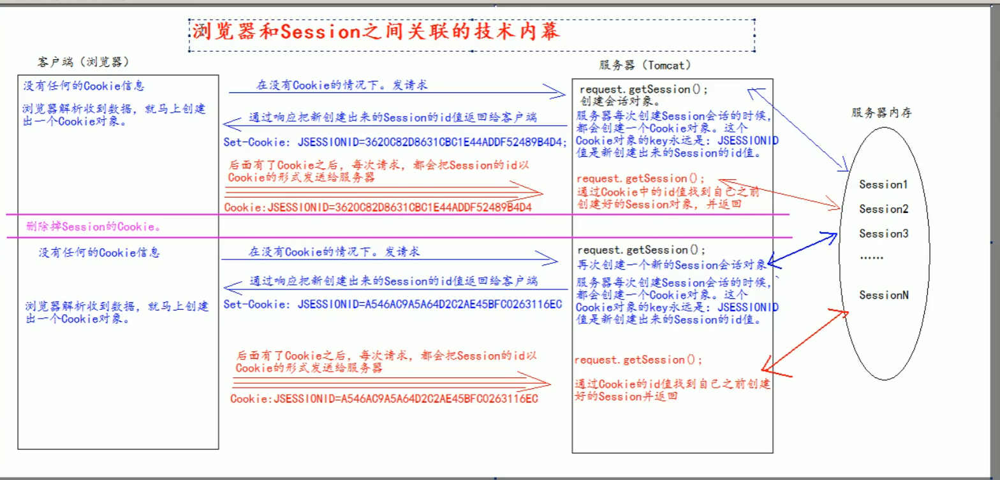

```

Session底层实际上是Cookie
```

```java
package com.local.servlet;

import javax.servlet.ServletException;
import javax.servlet.http.HttpServletRequest;
import javax.servlet.http.HttpServletResponse;
import javax.servlet.http.HttpSession;
import java.io.IOException;

/**
 * @author 党
 * @version 1.0
 * 2022/4/28   16:33
 */
public class SessionServlet extends BaseServlet{
    @Override
    protected void doGet(HttpServletRequest req, HttpServletResponse resp) throws ServletException, IOException {
        super.doPost(req, resp);
    }

    protected void createSession(HttpServletRequest req, HttpServletResponse resp) throws ServletException, IOException {
        //创建和获取Session对象
        HttpSession session = req.getSession();
        boolean aNew = session.isNew();
        session.setMaxInactiveInterval(10);//10s后销毁
        String id = session.getId();
        resp.getWriter().write("Session获取成功，id为：" + id + "，是否是新创建的：" + aNew);
    }
    protected void setAttribute(HttpServletRequest req, HttpServletResponse resp) throws ServletException, IOException {
        req.getSession().setAttribute("key","session");
        resp.getWriter().write("Session设置成功");
    }
    protected void getAttribute(HttpServletRequest request,HttpServletResponse response) throws IOException,ServletException{
        HttpSession session = request.getSession();
        Object key = session.getAttribute("key");
        response.getWriter().write("Session获取成功，key为：" + key);
    }
    protected void defaultLife(HttpServletRequest request,HttpServletResponse response) throws IOException,ServletException{
        HttpSession session = request.getSession();
        int maxInactiveInterval = session.getMaxInactiveInterval();
        response.getWriter().write("Session默认最大时间为：" + maxInactiveInterval+"s");
    }
    protected void deleteSession(HttpServletRequest request,HttpServletResponse response) throws IOException,ServletException{
        HttpSession session = request.getSession();
        session.invalidate();
        response.getWriter().write("Session删除成功");
    }
}

```

## 表单重复提交问题

```

情况一：
	用户提交完表单,服务器使用的请求转发,之后,用户刷新,浏览器发起最后一次请求,就会一致提交表单,造成表单重复提交

情况二:
	服务器使用的请求重定向,但是因为网络延迟等原因,客户端迟迟没有收到服务器的响应,用户以为提交失败,多点了几次,也会造成表单重复提交

情况三：
	表单正常提交服务器,提交完成后,用户回退浏览器,重新提交
```

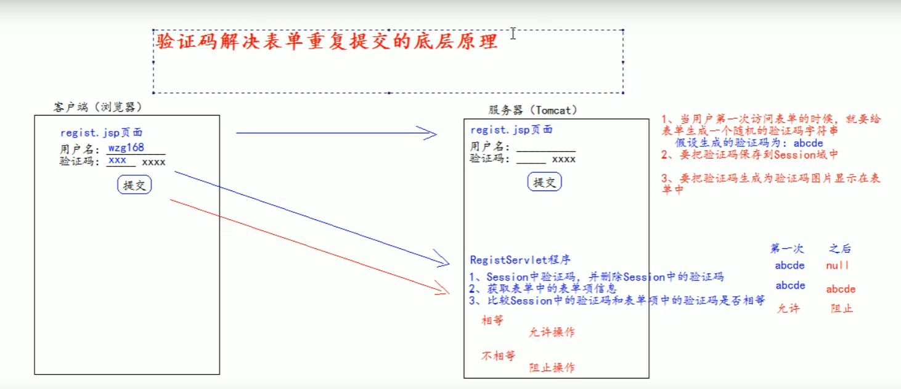


```
使用谷歌验证码  
	1.kaptcha  jar包
	
	2.配置xml文件
	<servlet>
        <servlet-name>KaptchaServlet</servlet-name>
        <servlet-class>com.google.code.kaptcha.servlet.KaptchaServlet</servlet-class>
    </servlet>
    <servlet-mapping>
        <servlet-name>KaptchaServlet</servlet-name>
        <url-pattern>/kaptcha.jpg</url-pattern><!-- 验证码 -->
    </servlet-mapping>

	3.在表单中使用img标签显示验证码
	<label>验证码：</label>
                        <input class="itxt" type="text" name="code" style="width: 150px;" id="code"/>
                        
                        
      
      4.在服务器获取谷歌生成的验证码和客户端发送过来的验证码比较使用
```

```java
//获取Session中的验证码[生成的验证码保存在session域中]
        String attribute = (String)request.getSession().getAttribute(KAPTCHA_SESSION_KEY);
        //删除Session中的验证码(防止重复使用)
        request.getSession().removeAttribute(KAPTCHA_SESSION_KEY);
```


## Referer

```

在客户端向服务器发起请求时,请求头会有一个Referer参数

referer会记录发起请求时的地址

req.getHeader("Referer");

resp.sendRedirect(req.getHeader("Referer"));//重定向回原来页面
```

## 14 Filter过滤器

#### 1. 什么是Filter过滤器

```

1.Filter过滤器是javaWeb三大组件之一(servlet程序,Listener监听器,Filter过滤器)

2.作用：拦截请求，过滤响应

拦截请求常见应用场景:
	1.权限检查
	2.日记操作
	3.事务管理
```

#### 2. Filter使用

```jsp

有局限性

<%
  Object obj = session.getAttribute("user");
  if (obj==null){
    request.getRequestDispatcher("/index.jsp").forward(request,response);
    return;
  }
%>
```


```java
package com.local.filter;

import javax.servlet.*;
import javax.servlet.http.HttpServletRequest;
import javax.servlet.http.HttpSession;
import java.io.IOException;

/**
 * @author 党
 * @version 1.0
 * 2022/4/30   19:08
 */
public class AdminFilter implements Filter {
    @Override
    public void init(FilterConfig filterConfig) throws ServletException {
         String filterName = filterConfig.getFilterName();
        System.out.println("filterName:"+filterName);
        //web.xml中配置的参数<init-param>
        String param1 = filterConfig.getInitParameter("param1");
        String initParameter = filterConfig.getInitParameter(param1);
        System.out.println("param1:"+param1);
        //获取ServletContext对象
        ServletContext servletContext = filterConfig.getServletContext();
        System.out.println("servletContext:"+servletContext);
    }
    /**
     * doFilter专门拦截请求，过滤响应，可以做权限检查
     * @param servletRequest
     * @param servletResponse
     * @param filterChain
     * @throws IOException
     * @throws ServletException
     */
    @Override
    public void doFilter(ServletRequest servletRequest, ServletResponse servletResponse, FilterChain filterChain) throws IOException, ServletException {
        HttpServletRequest request = (HttpServletRequest) servletRequest;
        HttpSession session = request.getSession();
        String username = (String) session.getAttribute("username");
        if (username == null ) {//拦截
            //转发
            request.getRequestDispatcher("/index.jsp").forward(request,servletResponse);
        }else {//放行
            //让程序继续访问用户的目标资源
            filterChain.doFilter(servletRequest,servletResponse);
        }
    }

    /**
     * 销毁
     * */
    @Override
    public void destroy() {
        Filter.super.destroy();
    }
}
```


```xml
<!--filter标签配置一个filter过滤器-->
<filter>
    <filter-name>AdminFilter</filter-name>
    <filter-class>com.local.filter.AdminFilter</filter-class>
</filter>
<!--配置filter过滤器的拦截路径-->
<filter-mapping>
    <!--表示当前的拦截路径给那个filter使用-->
    <filter-name>AdminFilter</filter-name>
    <!--配置l路径
    / 表示未http://ip:port/工程路径/ 映射到IDEA的web路径
        * 代表全部
    -->
    <url-pattern>/admin/*</url-pattern>
</filter-mapping>
```

```

Filter过滤器的实现步骤

1.编写一个类实现javax.servlet.Filter接口

2.实现过滤方法doFilter()

3.web.xml配置Filter拦截路径
```

#### 3. Filter生命周期

```

1.构造器方法

2.init()初始化方法

第1.2步再web工程启动时就执行

3.doFilter()过滤方法

每次只要拦截到请求就会执行

4.destroy()销毁方法

停止web工程就会执行
```


#### 4. FilterConfig类

```

filter配置文件类
Tomcat每次创建Filter的时候,也会创建一个FilterConfig类,包含配置信息

作用
	1.获取Filter的名称  <filter-name>
	2.获取Filter再配置文件中的初始化参数 <init-param>
	3.获取ServletContext对象
```


#### 5. FilterChain 过滤器链

```

FilterChain多个过滤器如何一起工作

filterChain.dofilter()方法：
	1.执行下一个Filter过滤器(有下一个Filter)
	2.执行目标资源(没有下一个Filter)
```


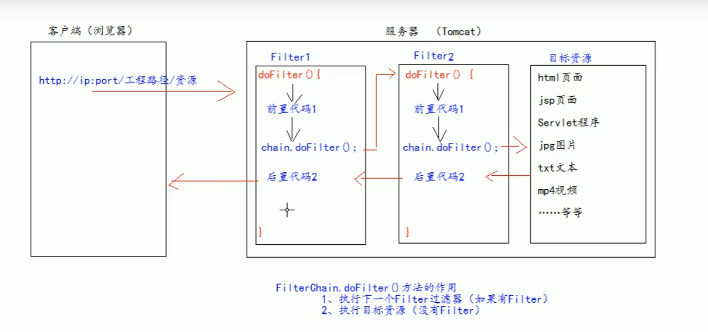

```
配置文件觉定 Filter过滤器的执行顺序
	配置文件从上到下
```

```
Filter过滤器执行的特点:
	1.所以Filter和目标资源 默认 都执行在同一个线程中
	
	2.多个Filter共同执行时,都使用同一个Request对象
```

#### 6. Filter的拦截路径

```

1.精确匹配
 <url-pattern>/target.jsp<url-pattern>
 ==>http://ip:port/工程/targer.jsp
 
 2.目录匹配
  <url-pattern>/admin/*<url-pattern>
   ==>http://ip:port/工程/admin/*
   
3.后缀名匹配
  <url-pattern>*.html<url-pattern>
   ===>以 .html结尾
   
Filter过滤器只关系请求的地址是否匹配,不关心请求的资源是否存在
```


## ThreadLocal的使用

```

ThreadLocal可以解决多线程的数据安全问题

ThreadLocal可以给当前线程关联一个数据(可以是普通变量，可以是对象，可以是数组，集合)

ThreadLocal特点：
	1.可以为当前线程关联一个数据(可以像Map一样存储数据,Key为当前线程)
	2.每一个ThreadLocal对象，只能为当前线程关联一个数据，如果要为当前线程关连多个数据，就需要使用多个ThreadLocal对象实例
	3.每个ThreadLocal对象实例定义的时候,一般都是static类型
	4.ThreadLocal中保存数据,在线程销毁后,会由JVM虚拟自动释放
```


## Tomcat错误页面

```
web.xml配置
	<error-page>
        <!--错位类型-->
        <error-code>500</error-code>
        <!--跳转去的跳转路径-->
        <location>/pages/error/error500.jsp</location>
    </error-page>
    <error-page>
        <!--错位类型-->
        <error-code>404</error-code>
        <!--跳转去的跳转路径-->
        <location>/pages/error/error500.jsp</location>
    </error-page>
```


## JSON

```

1.什么是JSON
	JSON是一种轻量级的数据交换格式,易于阅读和编写,也易于机器解析和生成
	轻量级:
		指的是和xml比较
	数据交换
		指的是客户端和服务器之间业务数据的传递格式
		
2.JSON在JavaScrip中的使用
  2.1 json的定义
  	json是由键值对组成,并且由大括号包围,每个键由引号引起来,键和值使用冒号分割
  

3.JSON存在方式有两种
	1.对象的形式存在,叫做json对象
	2.字符串的形式存在,叫做json字符串
	[一般操作数据时使用json对象的形式]
	[在服务端与客户端进行数据交换使用json字符串]
	
	JSON.stringify()  obj->str
	JSON.parse()  str->obj
```

```html
<script type="text/javascript">
   // json的定义
   var json = {
      "key1" : 12,
      "key2" : "abc",
      "key3" : true,
      "key4" : [11,"arr",false],
      "key5" : {//json
         "key5_1" : 1,
         "key5_2" : 2
      },
      "key6" : [//json数组
         {"key6_1":1},
         {"key6_2":2},
      ]
   };
   alert(typeof (json)) //[Object]
   alert(json)//[Object Object]
   // json的访问
   //json本身是一个对象,json中的key可以理解为对象中的属性
   alert(json.key1)
   alert(json.key4)// 11,arr,false
   for (var i = 0;i < json.key4.length;i++)
      alert(json.key4[i])
   alert(json.key5)//[Object Object]
   alert(json.key6)//[Object Object],[Object Object]
   // json对象转字符串
   var str = JSON.stringify(json)
   alert(str)
   //{"key1":12,"key2":"abc","key3":true,"key4":[11,"arr",false],"key5":{"key5_1":1,"key5_2":2},"key6":[{"key6_1":1},{"key6_2":2}]}

   // json字符串转json对象
   var parse = JSON.parse(str);
   alert(parse)//[Object Object]
</script>
```

#### JSON在java中的使用

```

1.导入json的jar包
```


```java
1.javaBean和json的转换
@Test
    public void test1(){
        Person person = new Person(18,"张三");
        //创建Gson对象实例
        Gson gson = new Gson();
        //toJson方法将javaBean对象转换成json字符串
        String personJsonStr = gson.toJson(person);
        System.out.println(personJsonStr);//{"id":18,"name":"张三"}
        //fromJson可以将json字符串转换成javaBean对象
        Person person1 = gson.fromJson(personJsonStr, Person.class);
        System.out.println(person1);//Person{id=18, name='张三'}
    }
```

```java
2.list和json的转换
 @Test
    public void test2(){
        ArrayList<Person> list = new ArrayList<>();
        list.add(new Person(18,"张三"));
        list.add(new Person(19,"李四"));
        list.add(new Person(20,"王五"));
        //创建Gson对象实例
        Gson gson = new Gson();
        //toJson方法将list集合转换成json字符串
        String listJsonStr = gson.toJson(list);
        System.out.println(listJsonStr);//[{"id":18,"name":"张三"},{"id":19,"name":"李四"},{"id":20,"name":"王五"}]
        //fromJson可以将json字符串转换成list集合
        ArrayList<Person> list1 = gson.fromJson(listJsonStr, new PersonListType().getType());
    //        ArrayList<Person> list1 = gson.fromJson(listJsonStr, new ArrayList<Person>().getClass());
        System.out.println(list1);//[Person{id=18, name='张三'}, Person{id=19, name='李四'}, Person{id=20, name='王五'}]
    }
```

```java
package com.local.json;

import com.google.gson.reflect.TypeToken;
import com.local.pojo.Person;

/**
 * @author 党
 * @version 1.0
 * 2022/5/5   17:24
 */
public class PersonListType extends TypeToken<Person> {
}

```


```java
3.map和json的转换
@Test
    public void test3(){
        Hashtable<Integer, Person> map = new Hashtable<>();
        map.put(1, new Person(18,"张三"));
        map.put(2, new Person(19,"李四"));
        map.put(3, new Person(20,"王五"));
        //创建Gson对象实例
        Gson gson = new Gson();
        //toJson方法将map集合转换成json字符串
        String mapJsonStr = gson.toJson(map);
        System.out.println(mapJsonStr);//{"1":{"id":18,"name":"张三"},"2":{"id":19,"name":"李四"},"3":{"id":20,"name":"王五"}}
        //fromJson可以将json字符串转换成map集合
//        Hashtable<Integer, Person> map1 = gson.fromJson(mapJsonStr, new Hashtable<Integer,Person>().getClass());
//        Hashtable<Integer, Person> map1 = gson.fromJson(mapJsonStr, new PersonMapType().getType());
        Object map1 = gson.fromJson(mapJsonStr, new TypeToken<Hashtable<Integer, Person>>() {
        }.getType());//匿名类
        System.out.println(map1);//{1=Person{id=18, name='张三'}, 2=Person{id=19, name='李四'}, 3=Person{id=20, name='王五'}}
    }
```

```java
package com.local.json;

import com.google.gson.reflect.TypeToken;
import com.local.pojo.Person;

import java.util.Hashtable;

/**
 * @author 党
 * @version 1.0
 * 2022/5/5   17:30
 */
public class PersonMapType extends TypeToken<Hashtable<Integer, Person>>   {
}
```

## AJAX


```
1.什么是AJAX请求
	AJAX全称("Asynchronous JavaScript And XML")[异步JavaScript和XML]是一种创建交互式网页应用的网页开发技术
	
	【AJAX是一种浏览器通过js异步发起请求,局部更新页面的技术】
```

#### 原生AJAX请求

```html
<script type="text/javascript">
         //使用javaScript发起Ajax请求,访问AjaxServlet中javaScriptAjax
         function ajaxRequest() {
//              1、我们首先要创建XMLHttpRequest 
            var xmlHttpRequest = new XMLHttpRequest();
//              2、调用open方法设置请求参数
            //method : post/get
            //url : 请求地址
            //boolean : 是否异步
            xmlHttpRequest.open("GET","http://localhost:8080/json/ajaxServlet?action=javaScriptAjax",true);
            //4、在send方法前绑定onreadystatechange事件，处理请求完成后的操作。
            /*
            * readyState
            * 0: 请求未初始化
              1: 服务器连接已建立
              2: 请求已接收
              3: 请求处理中
              4: 请求已完成，且响应已就绪
            * */
            xmlHttpRequest.onreadystatechange = function (){
               if (xmlHttpRequest.readyState===4&&xmlHttpRequest.status===200){
                  var parse = JSON.parse(xmlHttpRequest.responseText);

                  //把响应的数据显示在页面上
                  document.getElementById("div01").innerText = "编号"+parse.id+",姓名"+parse.name;
                  alert(xmlHttpRequest.responseText)
               }
            }
//              3、调用send方法发送请求
            xmlHttpRequest.send();
//
         }
      </script>
   </head>
   <body> 
      <button onclick="ajaxRequest()">ajax request</button>
      <div id="div01">
      </div>
   </body>
```

```java
protected void javaScriptAjax(HttpServletRequest req, HttpServletResponse resp) throws ServletException, IOException {
    System.out.println("接收到Ajax请求");
    Person person = new Person(21,"张三");
    String json = new Gson().toJson(person);
    resp.getWriter().write(json);//响应
}
```

#### AJAX请求特点

```
Ajax请求的局部更新,浏览器地址栏不会发送变化
局部更新不会舍弃原来页面的内容
```

#### jQuery中的AJAX请求


```
$.ajax方法:
	url : 请求地址
	type : post/get
	data : 发送给服务器的数据 (action参数等)
		格式有两种:
			1.{key:value}
			2.key = value
	success : 请求响应,响应的回调函数
	dataType : 响应的数据类型
		常用数据类型:
			text,xml,json
```

```javaScript
$("#ajaxBtn").click(function(){
   $.ajax({
      url : "http://localhost:8080/json/ajaxServlet",
      // data : "action=jQueryAjax",//参数
      type : "get",
      success : function (data){
         // var parse = JSON.parse(data);
         document.getElementById("msg").innerHTML = "编号:"+data.id + ",姓名:"+data.name;

         // $("#msg").html("编号:"+parse.id + ",姓名:"+parse.name)
         // alert("服务器返回的数据"+data)
      },
      // dataType : "text"
      dataType : "json"
   })
   // alert("ajax btn");

});
```


```
$.get和$.post

	url : 请求地址
	data : 发送给服务器的数据 (action参数等)
		格式有两种:
			1.{key:value}
			2.key = value
	success : 请求响应,响应的回调函数
	dataType : 响应的数据类型
		常用数据类型:
			text,xml,json
```


```javaScript
$("#getBtn").click(function(){
   $.get(
         "http://localhost:8080/json/ajaxServlet",
         "action=jQueryGet",
         function (data){
            $("#msg").html("$.get编号:"+data.id + ",姓名:"+data.name)
         },
         "json"
   )
   alert(" get btn ");

});

// ajax--post请求
$("#postBtn").click(function(){
   $.get(
         "http://localhost:8080/json/ajaxServlet",
         "action=jQueryPost",
         function (data){
            $("#msg").html("$.Post编号:"+data.id + ",姓名:"+data.name)
         },
         "json"
   )
   alert("post btn");
   
});
```

```

$.getJson
	get请求返回Json
	url,data,callback(success)
```

```javaScript
$("#getJSONBtn").click(function(){
   // 调用
   $.getJSON(
         "http://localhost:8080/json/ajaxServlet",
         "action=jQueryGetJSON",
         function (data){
            $("#msg").html("$.GetJSON编号:"+data.id + ",姓名:"+data.name)
         }
   )
   alert("getJSON btn");

});
```


```
表单序列化 serialize()
	serialize()可以把表单中所有内容获取到，并且以name=value&name=value的形式进行拼接
```


```java
protected void jQuerySerialize(HttpServletRequest req, HttpServletResponse resp) throws ServletException, IOException {
    System.out.println("jQuerySerialize调用");
    System.out.println("用户名："+req.getParameter("username"));
    System.out.println("密码："+req.getParameter("password"));
    System.out.println("下拉单选："+req.getParameter("single"));
    System.out.println("多选："+Arrays.toString(req.getParameterValues("multiple")));
    System.out.println("复选："+ Arrays.toString(req.getParameterValues("check")));
    System.out.println("单选："+req.getParameter("radio"));
}
```

```javascript
$("#submit").click(function(){
   var serialize = $("#form01").serialize();//获取表单全部内容
   // 把参数序列化
   $.getJSON(
         "http://localhost:8080/json/ajaxServlet",
         "action=jQuerySerialize&"+serialize,
         function (data){
            $("#msg").html("Serialize编号:"+data.id+",name："+data.name)
         }
   )
});
```


## i18n国际化(了解)

```

国际化相关要素
```

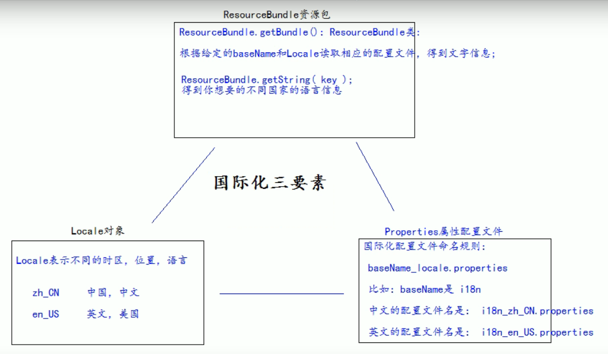


```java
@Test
    public void testLocale(){
        Locale locale = Locale.getDefault();//默认的语言
        System.out.println(locale);//zh_CN
//        Locale[] availableLocales = Locale.getAvailableLocales();//获取可用的语言
//        for (Locale l:availableLocales){
//            System.out.println(l);
//        }
        System.out.println(Locale.CHINA);//获取中文中国的locale对象 zh_CN
        System.out.println(Locale.US);//获取英文美国的locale对象 en_US

    }
    @Test
    public void testI18n(){
        //得到locale对象
        Locale locale = Locale.US;
        //i18n_zh_CN.properties,i18n_en_US.properties选前面的前缀
        //通过知道的basename和locale读取相应的配置文件
        ResourceBundle bundle = ResourceBundle.getBundle("com.local.i18n.i18n", locale);
        String username = bundle.getString("username");
        System.out.println(username);

    }
```


```jsp
<%@ page import="java.util.Locale" %>
<%@ page import="java.util.ResourceBundle" %>
<%@ page language="java" contentType="text/html; charset=UTF-8"
       pageEncoding="UTF-8"%>
<!DOCTYPE html PUBLIC "-//W3C//DTD HTML 4.01 Transitional//EN" "http://www.w3.org/TR/html4/loose.dtd">
<html>
<head>
<meta http-equiv="pragma" content="no-cache" />
<meta http-equiv="cache-control" content="no-cache" />
<meta http-equiv="Expires" content="0" />
<meta http-equiv="Content-Type" content="text/html; charset=UTF-8">
<title>Insert title here</title>
</head>
<body>
   <%
      //从请求头中获取locale信息
      Locale locale = null;
      String country = request.getParameter("country");
      if ("cn".equals(country)){
         locale = Locale.CHINA;
      }else if("en".equals(country)){
         locale = Locale.US;
      }else {
         locale = request.getLocale();
      }
//    System.out.println(locale);
      //获取资源包(basename,locale)
      ResourceBundle bundle = ResourceBundle.getBundle("i18n", locale);
   %>
   <a href="i18n.jsp?country=cn">中文</a>|
   <a href="i18n.jsp?country=en">english</a>
   <center>
      <h1>注册</h1>
      <table>
      <form>
         <tr>
            <td><%=bundle.getString("username")%></td>
            <td><input name="username" type="text" /></td>
         </tr>
         <tr>
            <td><%=bundle.getString("password")%>></td>
            <td><input type="password" /></td>
         </tr>
         <tr>
            <td><%=bundle.getString("sex")%></td>
            <td><input type="radio" />男<input type="radio" />女</td>
         </tr>
         <tr>
            <td>邮箱</td>
            <td><input type="text" /></td>
         </tr>
         <tr>
            <td colspan="2" align="center">
            <input type="reset" value="重置" />&nbsp;&nbsp;
            <input type="submit" value="提交" /></td>
         </tr>
         </form>
      </table>
      <br /> <br /> <br /> <br />
   </center>
   国际化测试：
   <br /> 1、访问页面，通过浏览器设置，请求头信息确定国际化语言。
   <br /> 2、通过左上角，手动切换语言
</body>
</html>
```

