[TOC]


# 1、引言

## 1.1、什么是jvm

定义：

Java Virtual Machine - java程序的运行环境（java二进制字节码的运行环境）

好处：

- 一次编写，处处运行
- 自动管理内存，垃圾回收
- 多态
- 数组下标越界检查

比较：

jvm jre jdk

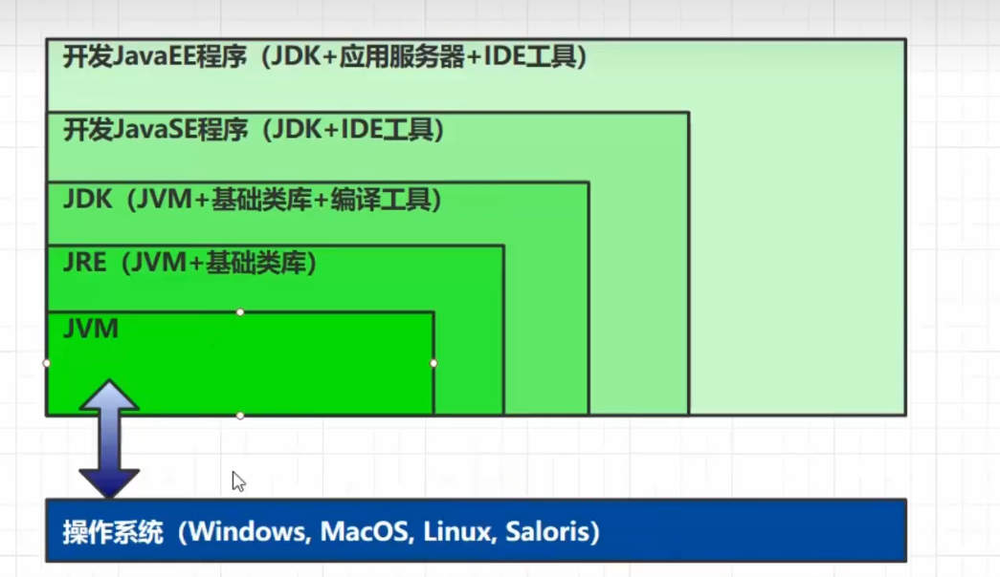


## 1.2、学习jvm有什么用

- 面试
- 理解底层的实现原理
- 中高级程序员的必备技能


## 1.3、常见的jvm


## 1.4、学习路线

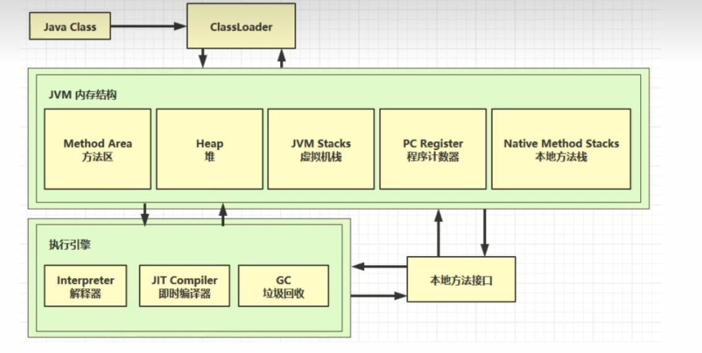


- Java Class：字节码文件

- ClassLoafer：类加载器

- 方法区：类
- heap：类创建的实例对象
- 虚拟机栈，程序计数器，本地方法栈：对象调用方法时使用
- 本地方法接口：调用操作系统的功能


# 2、jvm内存结构

## 2.1、程序计数器

`Program Counter Register 程序计数器`


### 2.1.1、程序计数器的作用

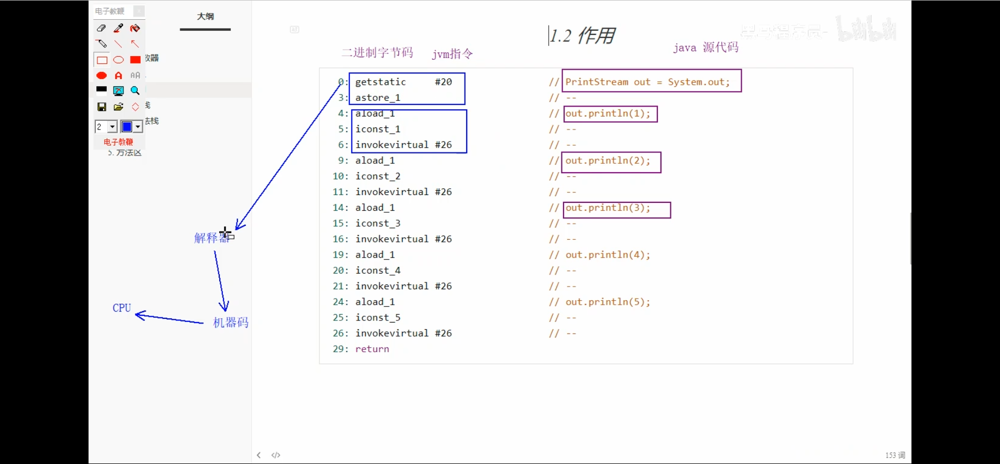


程序计数器作用：

1. **记住下一条jvm指令的执行地址**


实现方式：

- 物理方式：cpu中的寄存器


### 2.1.2、程序计数器的特点

- 是线程私有的
- 是唯一不会出现内存溢出的区


解释线程私有：

```
假如两个线程运行，一个线程1，一个线程2，当线程1运行到一半时，时间片用完，此时该线程2运行了，线程1会把运行到的存储到程序计数器里面，下次从该地方运行，每个线程都有自己的程序计数器
```


## 2.2、虚拟机栈


### 2.2.1、定义

- 栈 - 线程运行需要的内存空间，一个栈有多个栈帧组成

- 栈帧（Frame）：每个方法运行时需要的内存（参数，局部变量，返回值）

- 每个线程只能由一个或者栈帧，对应着当前正在执行的那个方法


**问题辨析：**

1. 垃圾回收是否涉及占内存？ 

```
不需要，栈帧内存再每次方法调用结束后，都会被弹出栈，自动被回收，不需要垃圾回收管理栈内存
```

2. 栈内存分配的越多越好吗？

```
通过虚拟机参数指定栈内存大小
	-Xss size 设置栈内存大小
	
栈内存大了，可以支持更多的方法递归调用，但是线程数会减少，因为物理内存是固定的
```

3. 方法区的局部变量是否线程安全
   1. 如果方法内的局部变量没有逃离方法的作用范围，那就是安全的
   2. 如果方法内的局部变量引用了对象并且逃离方法的作用范围，那就是不安全的

```java
public class Demo {
    public static void main(String[] args) {
        for (int i = 0; i < 5; i++) {
            new Thread(() -> {
                method();
            }).start();
        }
    }
    private static void method() {
        int i = 0;
        for (int i1 = 0; i1 < 500; i1++) {
            i++;
        }
        System.out.println(Thread.currentThread().getName()+"  "+i);
    }
}

一个线程对应一个栈，每个线程的栈帧是私有的，每个线程的局部变量是私有的
```


### 2.2.2、栈内存溢出

`java.lang.StackOverflowError`

1. Frame（栈帧）过多，【死递归】
2. Frame过大，


### 2.2.3、线程运行诊断

1. cpu占用过多

```
Linux 系统：
	top ：定位那个进行对cpu占用过高 pid
	ps H -eo pid,tid,%cpu | grep 进程id：那个线程占用cpu过高
	jstack pid：查看进程中所以的java线程
```


2. 程序运行很长时间没有结果【出现deadlock】


## 2.3、本地方法栈Native Method Stack

native方法

调用操作系统的方法使用的栈


## 2.4、堆 heap


### 2.4.1、定义

Heap 堆：

- 通过new关键字，创建的对象都会使用堆内存

特点：

- 它是线程共享的，堆中的对象都需要考虑线程安全问题
- 有垃圾回收机制


### 2.4.2、堆内存溢出

`java.lang.OutOfMemoryError`

```
虚拟机参数：
	-Xmx 
```


### 2.4.3、堆内存诊断

1. jsp工具：
   - 查看当系统中有哪些java进程
2. jmap工具
   - 查看堆内存占用情况【jamp -heap pid】
3. jconsole工具
   - 图形化界面，多功能检测工具


案例：

- 垃圾回收后，内存占用仍然很高

工具：

- ​	**jvisualvm** 可视化界面（类似jconsole）
  - 可以查看占用堆比较大的对象 ，


## 2.5、方法区

### 2.5.1、定义

- 所有java线程共享的
- 存储了跟类的结构相关的信息，运行时常量池，字段，方法数据，成员方法，构造方法，特殊方法
- 在虚拟机启动时创建
- 逻辑上是堆的组成部分
- 方法区内存不够，也会抛出堆内存溢出`OutOfMemoryError`


### 2.5.2、组成

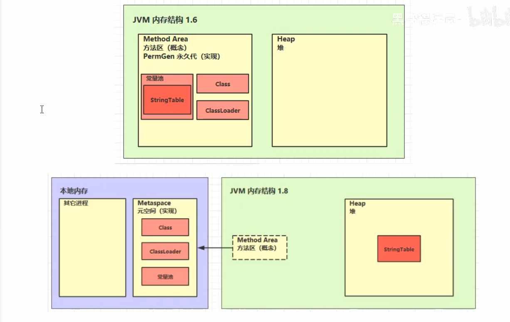


### 2.5.3、方法区内存溢出

- 1.8以前会导致永久代内存溢出
- 1.8后会导致原空间内存溢出


```java
public class MethodSpaceDemo extends ClassLoader { // 继承类加载器
    public static void main(String[] args) {
        int j = 0;
        try {
            MethodSpaceDemo demo = new MethodSpaceDemo();
            for (int i = 0; i < 10000; i++, j++) {
                // classWriter 生成 类的 二进制字节码
                ClassWriter classWriter = new ClassWriter(0);
                // 版本号，修饰符，类名，包名，父类，实现接口
                classWriter.visit(Opcodes.V1_8, Opcodes.ACC_PUBLIC, "class" + i, null, "java/lang/Object", null);
                // 返回 byte[]
                byte[] bytes = classWriter.toByteArray();
                // 执行类的加载
                demo.defineClass("class" + i, bytes, 0, bytes.length);
            }
        } catch (Exception e) {
            e.printStackTrace();
        }finally {
            System.out.println(j);
        }

    }
}
```


5411
Exception in thread "main" java.lang.OutOfMemoryError: Metaspace
	at java.lang.ClassLoader.defineClass1(Native Method)
	at java.lang.ClassLoader.defineClass(ClassLoader.java:763)
	at java.lang.ClassLoader.defineClass(ClassLoader.java:642)
	at com.dhf.methodSpace.MethodSpaceDemo.main(MethodSpaceDemo.java:28)

Process finished with exit code 1


### 2.5.4、运行时常量池

类的二进制字节码：

- 类的基本信息
- 常量池
- 类方法定义（包含虚拟机指令）


`javap -v HelloWorld.class` 反编译，显示详细信息


```
PS E:\java\jvm\target\classes\com\dhf> javap -v .\HelloWorld.class
Classfile /E:/java/jvm/target/classes/com/dhf/HelloWorld.class
  Last modified 2022-9-14; size 549 bytes // 最后修改时间
  MD5 checksum 978fdae0278d5d5aac62941bac81f184
  Compiled from "HelloWorld.java"
public class com.dhf.HelloWorld // 类信息
  minor version: 0
  major version: 52 // 内部版本，52，jdk8
  flags: ACC_PUBLIC, ACC_SUPER
Constant pool: // 常量池
   #1 = Methodref          #6.#20         // java/lang/Object."<init>":()V
   #2 = Fieldref           #21.#22        // java/lang/System.out:Ljava/io/PrintStream;
   #3 = String             #23            // Hello World
   #4 = Methodref          #24.#25        // java/io/PrintStream.println:(Ljava/lang/String;)V
   #5 = Class              #26            // com/dhf/HelloWorld
   #6 = Class              #27            // java/lang/Object
   #7 = Utf8               <init>
   #8 = Utf8               ()V
   #9 = Utf8               Code
  #10 = Utf8               LineNumberTable
  #11 = Utf8               LocalVariableTable
  #12 = Utf8               this
  #13 = Utf8               Lcom/dhf/HelloWorld;
  #14 = Utf8               main
  #15 = Utf8               ([Ljava/lang/String;)V
  #16 = Utf8               args
  #17 = Utf8               [Ljava/lang/String;
  #18 = Utf8               SourceFile
  #19 = Utf8               HelloWorld.java
  #20 = NameAndType        #7:#8          // "<init>":()V
  #21 = Class              #28            // java/lang/System
  #22 = NameAndType        #29:#30        // out:Ljava/io/PrintStream;
  #23 = Utf8               Hello World
  #24 = Class              #31            // java/io/PrintStream
  #25 = NameAndType        #32:#33        // println:(Ljava/lang/String;)V
  #26 = Utf8               com/dhf/HelloWorld
  #27 = Utf8               java/lang/Object
  #28 = Utf8               java/lang/System
  #29 = Utf8               out
  #30 = Utf8               Ljava/io/PrintStream;
  #31 = Utf8               java/io/PrintStream
  #32 = Utf8               println
  #33 = Utf8               (Ljava/lang/String;)V
{
  public com.dhf.HelloWorld(); // 构造方法
    descriptor: ()V
    flags: ACC_PUBLIC
    Code:
      stack=1, locals=1, args_size=1
         0: aload_0
         1: invokespecial #1                  // Method java/lang/Object."<init>":()V
         4: return
      LineNumberTable:
        line 8: 0
      LocalVariableTable:
        Start  Length  Slot  Name   Signature
            0       5     0  this   Lcom/dhf/HelloWorld;
        line 11: 8
      LocalVariableTable:
        Start  Length  Slot  Name   Signature
            0       9     0  args   [Ljava/lang/String;
}
SourceFile: "HelloWorld.java"
```


- 常量池，就是一张表，虚拟机指令根据这张常量表找到要执行的类名、方法名、参数类型、字面量等信息
- 运行时常量池，常量池是*.class文件中的，当该类被加载，它的常量池信息就会放入运行时常量池,并把里面的符号地址变为真实地址


### 2.5.5、StringTable串池

`常量池虽然在metaSpace中，但是字符串常量池仍然在 堆heap 中`

```
运行时，常量池中的信息，会被加载到运行时常量池中，这是，a，b等信息都是常量池中的符号，还不是 java 中的对象，等到执行到改行代码时，才会变成java对象，此时会在StringTable中以 string 为 key在表中查找，没有就会将对象放入串池
```


#### 2.5.5.1、StringTable特性

- 常量池中的字符串仅是符号，第一次用到时才变为对象


- 利用串池的机制，来避免重复创建字符串对象


- 字符串变量拼接的原理是stringBuilder (1.8)


- 字符串常量拼接的原理是编译期优化
- 可以使用intern方法，主动将串池中还没有的字符串放入串池
  - 1.8、将这个字符串对象尝试放入串池，如果有则不会放入，如果没有则放入串池，并将串池中的对象返回
  - 1.6、将这个字符串对象尝试放入串池，如果有则不会放入，如果没有则复制一份放入串池


```java
// new String("a"),堆中创建一个对象，常量池中一个对象
// 字符串的 拼接 ，只会在堆中创建，因为使用的StringBuilder
String s = new String("a") + new String("b);
// 将这个字符串对象尝试放入串池，如果有则不会放入
// 如果没有则放入串池，并将串池中的对象返回
String s2 = s.intern();
s2 == "ab"; // true
```


#### 2.5.5.2、StringTable位置


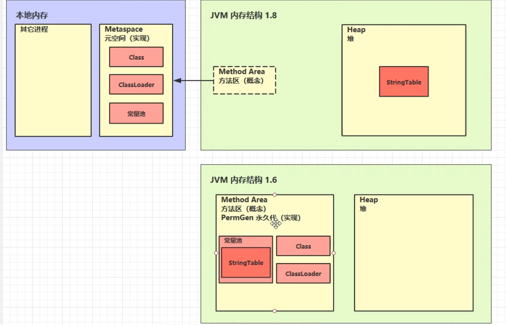


#### 2.5.5.3、StringTable垃圾回收


当内存不够，会自动进行垃圾回收，gc


#### 2.5.5.4、StringTable调优


1. 调整 `-XX:StringTableSize=桶个数`【当需要读取特别多的字符串常量时，增加桶个数，可以提升速度】
2. 考虑将字符串对象是否入池


## 2.6、直接内存


### 2.6.1、定义

Direct Memory：

- 常见于NIO操作，用于数据缓冲区
- 分配回收成本较高，但读写性能高
- 不受JVM内存回收管理


```java
public class Demo {
    // 文件地址
    private static final String FROM = "C:\\Users\\lenvoo\\Videos\\Captures\\yuanshen.mp4";
    private static final int _1Mb = 1024 * 1024;

    public static void main(String[] args) throws Exception{
        directBuffer(); // 34 ms  
        io(); // 89 ms
    }

    // NIO
    public static void directBuffer() throws FileNotFoundException {
        long startTime = System.nanoTime();
        FileChannel channel = new FileInputStream(FROM).getChannel();
        try {
            ByteBuffer byteBuffer = ByteBuffer.allocateDirect(_1Mb);
            while (true) {
                int read = channel.read(byteBuffer);
                if (read == -1) {
                    break;
                }
                byteBuffer.flip();
                // 操作
                byteBuffer.clear();
            }
        } catch (IOException e) {
            e.printStackTrace();
        }
        long end = System.nanoTime();
        System.out.println("directBuffer:用时：" + (end - startTime) / 1000000);
    }

    public static void io() throws Exception {
        long startTime = System.nanoTime();
        FileInputStream fileInputStream = new FileInputStream(FROM);
        byte[] bytes = new byte[_1Mb];
        while (true) {
            int read = fileInputStream.read(bytes);
            if (read == -1) {
                break;
            }
            // do something
        }
        long end = System.nanoTime();
        System.out.println("io:用时：" + (end - startTime) / 1000000);
    }
}
```


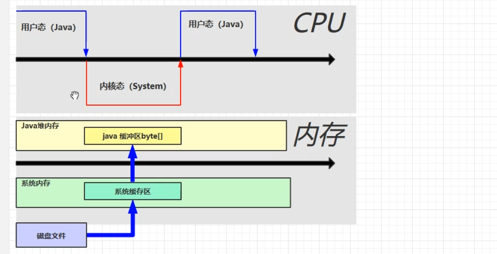


读取时，系统先将磁盘文件读到内存中的系统缓冲区，java代码不能直接访问系统缓冲区，此时，再次将代码读到java缓冲区，java代码才可以读取字节码文件【相当于读取了两遍，所以相对较慢】


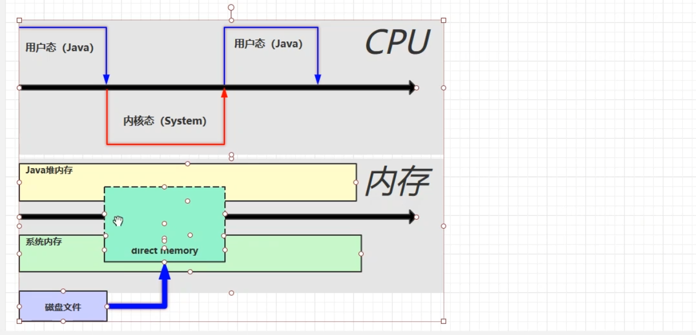


直接内存，java代码和操作系统都可以直接访问【只需要加载一遍，读取快】


### 2.6.2、直接内存溢出

```java
@Test
public void test1(){
    // java.lang.OutOfMemoryError: Direct buffer memory
    ArrayList<Object> objects = new ArrayList<>();
    int i = 0;
    try {
        while (true){
            ByteBuffer byteBuffer = ByteBuffer.allocateDirect(_1Mb);
            objects.add(byteBuffer);
            i++;
        }
    }finally {
        System.out.println(i);
    }
}
```


java.lang.OutOfMemoryError: Direct buffer memory


### 2.6.3、直接内存_释放原理

- 使用Unsafe对象完成直接内存的分配回收，并且回收需要主动调用freeMemory方法
- ByteBuffer的实现内部类，使用了Cleaner（虚引用）来检测byteBuffer对象，一旦byteBuffer对象被垃圾回收，那么ReferenceHandler线程通过Cleaner的clean方法调用freeMemory释放内存


```java
// 分配内存 Unsafe类
long base = unsafe.allocateMemory(_1GB);// base内存地址
unsafe.setMemory(base, _1GB, (byte) 0);

//释放内存
unsafe.freeMemory(base);
```


```java
ByteBuffer byteBuffer = ByteBuffer.allocateDirect(_1Mb);
// --------------------------
public static ByteBuffer allocateDirect(int capacity) {
        return new DirectByteBuffer(capacity);
    }
// --------------------------
DirectByteBuffer(int cap) {                   // package-private

        super(-1, 0, cap, cap);
        boolean pa = VM.isDirectMemoryPageAligned();
        int ps = Bits.pageSize();
        long size = Math.max(1L, (long)cap + (pa ? ps : 0));
        Bits.reserveMemory(size, cap);

        long base = 0;
        try {
            base = unsafe.allocateMemory(size);
        } catch (OutOfMemoryError x) {
            Bits.unreserveMemory(size, cap);
            throw x;
        }
        unsafe.setMemory(base, size, (byte) 0);
        if (pa && (base % ps != 0)) {
            // Round up to page boundary
            address = base + ps - (base & (ps - 1));
        } else {
            address = base;
        }
    // Cleaner是一个虚引用类型，当关联对象被gc时，会调用clean方法
    // 关联的 this ==> byteBuffer
        cleaner = Cleaner.create(this, new Deallocator(base, size, cap));
        att = null;


    }
// -----------------------------
public class Cleaner extends PhantomReference<Object>{
    // ...
    public void clean() {
        if (remove(this)) {
            try {
                this.thunk.run();
            } catch (final Throwable var2) {
                AccessController.doPrivileged(new PrivilegedAction<Void>() {
                    public Void run() {
                        if (System.err != null) {
                            (new Error("Cleaner terminated abnormally", var2)).printStackTrace();
                        }

                        System.exit(1);
                        return null;
                    }
                });
            }

        }
    }
    // ...
}
//--------------------------------
private static class Deallocator
        implements Runnable
    {

        private static Unsafe unsafe = Unsafe.getUnsafe();

        private long address;
        private long size;
        private int capacity;

        private Deallocator(long address, long size, int capacity) {
            assert (address != 0);
            this.address = address;
            this.size = size;
            this.capacity = capacity;
        }

        public void run() {
            if (address == 0) {
                // Paranoia
                return;
            }
            unsafe.freeMemory(address);
            address = 0;
            Bits.unreserveMemory(size, capacity);
        }

    }
```


### 2.6.4、禁用显示的垃圾回收

`-XX:+DisbaleExpllcitGC`

会让代码中的System.gc无效，直接内存就无法回收


# 3、垃圾回收


## 3.1、如何判断对象可以回收

### 3.1.1、引用计数法

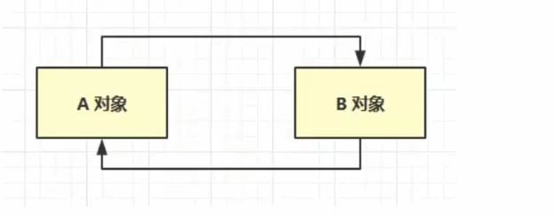

**循环引用**，导致计数不能为 0 ，不能被回收


### 3.1.2、可达性分析算法

根对象：肯定不能当成垃圾的对象


- java虚拟机中的垃圾回收器采用可达性分析来探索所有的存活对象
- 扫描堆中的对象，看是否能够沿着GC Root对象 为起点的引用链找到该对象，找不到，表示可以回收
- 哪些对象可以作为GC Root？


```
根对象是  对象  不是对象的引用

Object obj = new Object();
根对象是new Object(); 而不是 obj
```


### 3.1.3、四种引用

`强软弱虚`，`终结器引用`

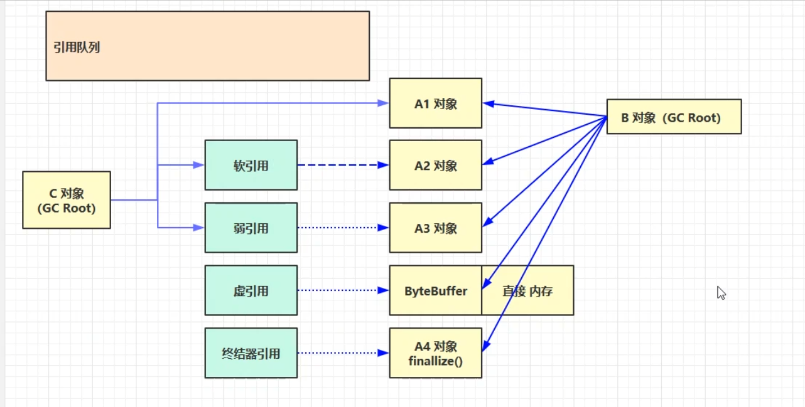


- 强引用：只有当GC root对他的引用都断开时，才会被回收
- 软引用（SoftReference）：没有强引用引用它，当垃圾回收，且内存不够时，就会被回收
- 弱引用（WeakReference）：没有强引用引用它，当垃圾回收，就会被回收
- 虚引用：虚引用对象创建时就会关联一个引用队列，当他的引用对象被回收后，虚引用对象就会进入引用队列，从而开启一个线程，调用方法
- 终结器引用：终结器引用对象创建时就会关联一个引用队列，Object::finalize，当没有强引用引用对象，该对象被回收时，终结器引用会被加入引用队列【此时，对象还没有被回收，不是立即回收，而是先将终结器引用会被加入引用队列】，此时一个线程去查看引用队列是否有终结器引用，找到其引用的对象，调用finalize()方法，下次垃圾回收才回收对象


`当软弱引用和 引用队列【ReferenceQueue】关联起来时，当他们引用的对象被回收时，他们自身也会放入引用队列中，因为他们本身也会占用一定的空间，所以可以在引用队列中将他们所占用的空间释放`


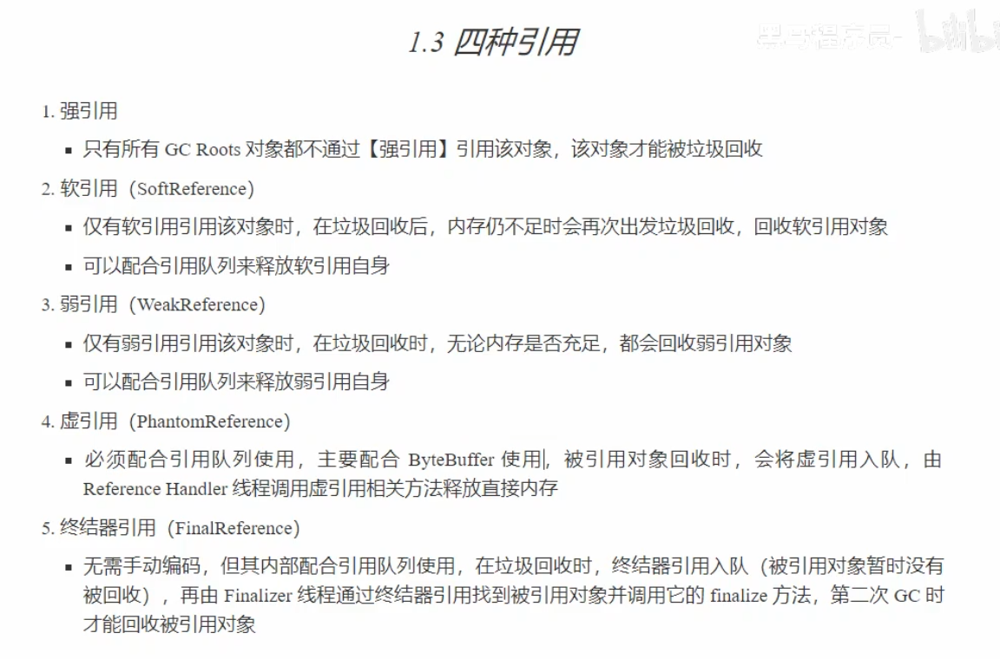


## 3.2、垃圾回收算法


### 3.2.1、标记清除

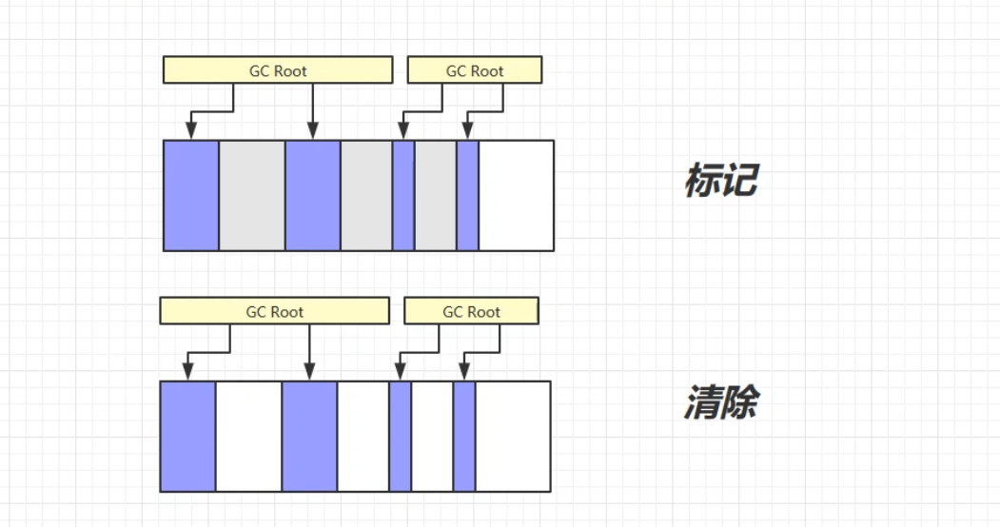


从 GC Roots 集合开始，将内存整个遍历一次，保留所有可以被 GC Roots 直接或间接引用到的对象，而剩下的对象都当作垃圾对待并回收，过程分两步;

- Mark 标记阶段：找到内存中的所有 GC Root 对象，只要是和 GC Root 对象直接或者间接相连则标记为灰色（也就是存活对象），否则标记为黑色（也就是垃圾对象）

- Sweep 清除阶段：当遍历完所有的 GC Root 之后，则将标记为垃圾的对象直接清除

`清除并不会对每个对象的字节进行 清零 操作，它只需要把 该对象占用的内存的起始和结束的地址记录下来，放在 空闲地址列表 中即可`


优点：

- 速度快

缺点：

- 容易产生内存碎片【不会对内存空间做整理工作】，如果分配了一个较大的空间，虽然整个空闲内存可以放下，但是每个碎片都不能单独放下，新对象仍然不能放下。


### 3.2.2、标记整理


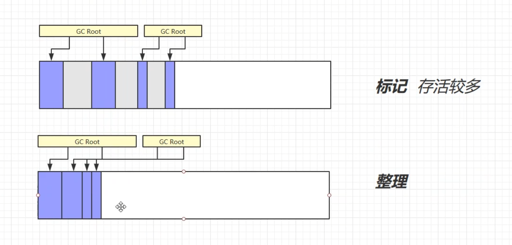


优点：

- 没有内存碎片

缺点：

- 对象整理【地址发生改变】，效率低


### 3.2.3、复制

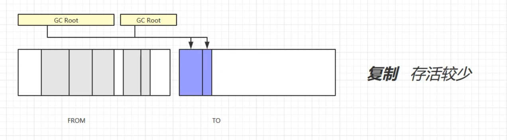

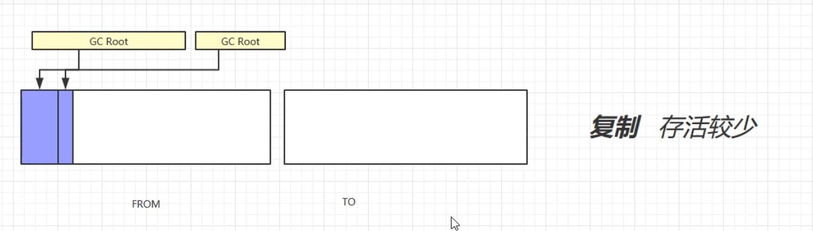


将内存分成大小相同的两份，FROM 和 TO，当清除垃圾时，将FROM中的垃圾标记，

让后将GC Root引用的对象放入TO中，再将 TO 和 FROM 交换位置


## 3.3、分代垃圾回收


- 新生代：用完就可以丢弃的对象，垃圾回收发生频繁
  - 伊甸园：
  - 幸存区 FROM：
  - 幸存区 TO：
- 老年代：长时间使用的对象，垃圾回收很久发生一次


1. 当创建一个 新对象 时，默认采用  伊甸园 空间，
2. 当伊甸园空间不够时，就会触发一个垃圾回收（Minor GC），将存活对象复制到 幸存区 TO 中【如果幸存区内存不够，基于内存担保，会直接放入老年代】，让 存活对象寿命 +1（开始是0，经历一次gc不死，+1），交换幸存区FROM 和 幸存区 TO
   - Minor gc 会引发 stop the world，会暂停其他用户线程，等垃圾回收结束，其他线程恢复运行
3. 默认当一对象寿命 超过 15（4bit），就会将该对象 从幸存区晋升到老年代
4. 当老年代空间不足时，会尝试先触发一次Minor GC，如果之后空间仍不足，会发生一次 Full GC，SWT【stop the world】的时间更长，从新生代到老年代发生整个清理


### 3.3.1、相关vm参数

| 含义               | 参数                                                       |
| ------------------ | ---------------------------------------------------------- |
| 堆初始大小         | -Xms                                                       |
| 堆最大大小         | -Xmx或-XX:MaxHeapSize=size                                 |
| 新生代大小         | -Xmn或（-XX:newSize=size + -XX:MaxNewSize=size）           |
| 幸存区比例（动态） | -XX:InitialSurvivorRatio=ratio或-XX:+UseAdaptiveSizePolicy |
| 幸存区比例         | -XX:SurvivorRatio=ratio  【default 8】                     |
| 晋升阈值           | -XX:MaxTenuringThreshold=threshold                         |
| 晋升详情           | -XX:+PrintTenuringDistribution                             |
| GC详情             | -XX:+PrintGCDetails -verbose:gc                            |
| FullGC前MinorGC    | -XX:+ScavengeBeforeFullGC                                  |


### 3.3.2、大对象_OOM

```java
private static final int _8MB = 8 * 1024 * 1024;
ArrayList<byte[]> list = new ArrayList<>();
list.add(new byte[_8MB]);
```


如果新生代容纳不下 大对象，发现如果老年代可以容纳，那么就不会触发GC，直接将对象放入 老年代。


**一个线程的OOM并不会导致java进程的异常退出**


## 3.4、垃圾回收器


### 3.4.1、串行

- 单线程
- 堆内存较小时使用，适合个人电脑

开启串行垃圾回收器：

​								`-XX:+UseSerialGC = Serial + SerialOld`

Serial ：新生代垃圾回收器，使用复制算法

SerialOld：老年代垃圾回收器， 标记整理算法


### 3.4.2、吞吐量优先

- 多线程
- 堆内存较大，需要多核CPU支持
- 让单位时间内 stop the world 时间最短【单位时间可能发生多次垃圾回收】


-XX : +UseParallelGC ~ -XX :+UseParallel0ldGC 

【1.8默认开启，只需要开启一个，另一个会自动开启】

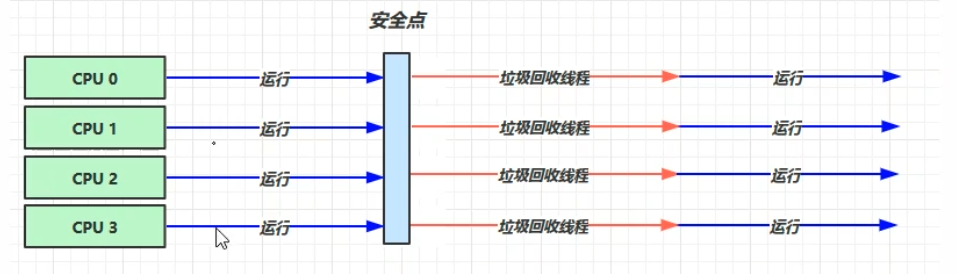


-XX :+UseAdaptiveSizePolicy  // 采用自适应的新生代大小调整

-XX:GCTimeRatio=ratio  // 调整吞吐量 `1/(1 + ration)，默认ration=99`

-XX: MaxGCPauseMillis=ms  // 最大暂停 ms 数 default 200

-XX :ParallelGCThreads=n   // GC时的线程数


### 3.4.3、响应时间优先CMS

- 多线程
- 堆内存较大，需要多核CPU支持
- 让垃圾回收时 stop the world 单次时间尽可能短 


开启响应时间优先：

​				`-XX:+UseConcMarkSweepGC ~ -XX:+UseParNewGc ~ SerialOld`

基于标记清除算法的垃圾回收

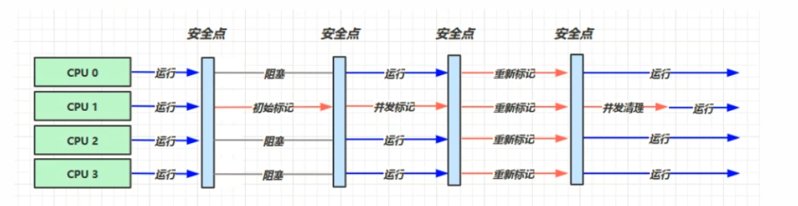


参数：

-XX:ParallelGCThreads = n ~ -XX:ConcGCThreads = threads

并行线程数，并发线程数


-XX:CMSInitiatingOccupancyFraction=percent

```
控制何时进行CMS，80 => 当堆内存占用80%时会进行CMS垃圾回收
```

-XX:+CMSScavengeBeforeRemark

```

```


```
当进行垃圾清理时，用户线程仍在工作，会产省新的垃圾，并发清理的同时，不能清理这些新垃圾，需要等到下一次GC，这些垃圾称为 浮动垃圾，因为浮动垃圾的产生，就不能像其他垃圾回收期，等到堆内存不足时再进行垃圾回收【新垃圾无处安放】，需要预留一些空间，保留浮动垃圾，堆中CMS收集器预留的内存空间装不下用户线程产生的对象垃圾会造成并发失败，从而会导致FullGC，CMS退化成SerialOld垃圾回收器，进行一次碎片整理
```


### 3.4.4、G1

定义：Garbage First

- jdk9默认


使用场景

- 同时注重吞吐量（Throughput）和低延迟，默认暂停目标是200ms
- 超大堆内存，会将堆划分为多个大小相等的Region【区域】
- 整体上是标记+整理算法，两个区域之间是复制算法


相关JVM参数

-XX:+UserG1GC

-XX:G1HeapRegionSize = size   // 设置单个区域的大小，2^n

-XX:MaxGCPauseMillis=time


#### 3.4.4.1、G1垃圾回收阶段


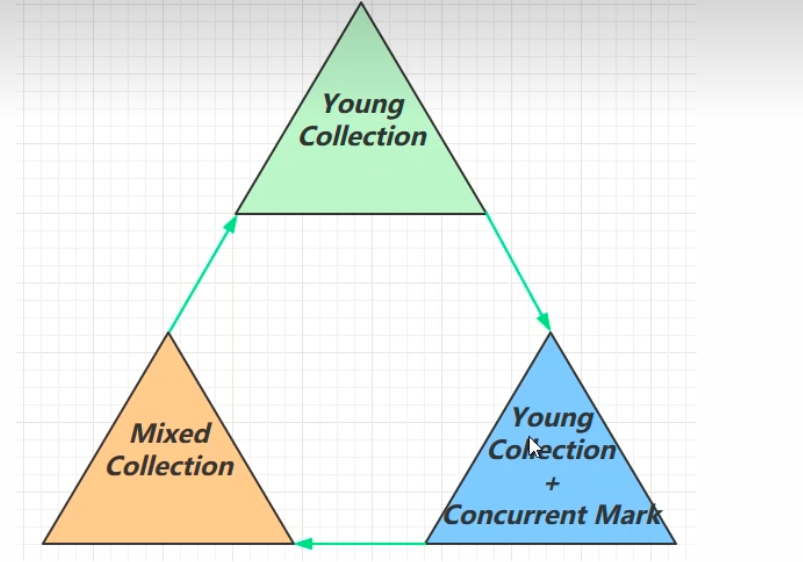


1. Yang Collection：新生代的垃圾收集
2. Yang Collection + Concurent Mark：新生代的垃圾收集 + 并发的标记
3. Mixed Collection：混合收集


#### 3.4.4.2、Yong Collection


1. 当伊甸园区主键被占满，会进行一次Yang  Collection
2. 将幸村对象复制到幸存区
3. 当新村去对象比较多，或者年龄超过15，会触发垃圾回收，幸存区的一部分对象会移到老年代


#### 3.4.4.3、Yang Collection +CM

定义：Yang Collection Concurrent Mark


- 在Yang GC是会进行GC Root 的初始标记【初始标记，标记GC Root】
- 老年代占用堆空间比例达到阈值时，进行并发标记（不会STW）

`-XX:InitiatingHeapOccupancyPercent=percent(默认45%)`


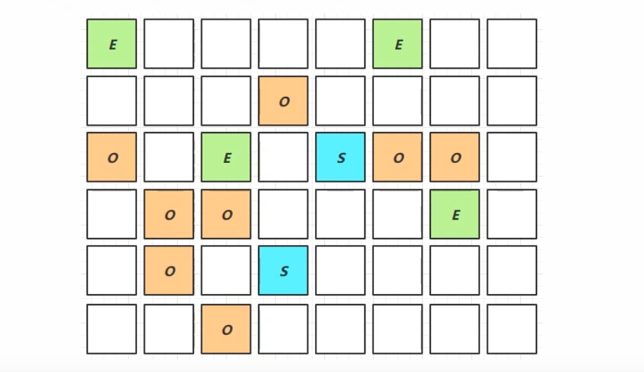


#### 3.4.4.4、Mixed Collection

会对E、S、O进行全面垃圾回收


- 最终标记（Remark）会STW
- 拷贝标记（Evacuation）会STW


`-XX:MaxGCPauseMillis=ms`


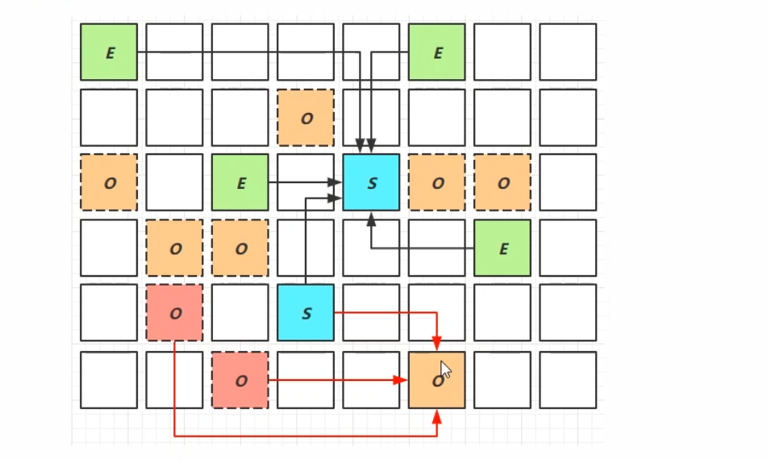


如果老年代的复制时间较长，G1会挑出价值最高的区，进行一部分的垃圾回收，达到垃圾回收的暂停时间目标

Garbage first


#### 3.4.4.5、Full GC


- SerialGC【串行】
  - 新生代内存不足时发生的垃圾收集器 minor gc
  - 老念代内存不足发生的垃圾收集器 full gc
- ParallelGC【吞吐量优先】
  - 新生代内存不足时发生的垃圾收集器 minor gc
  - 老念代内存不足发生的垃圾收集器 full gc
- CMS【响应时间优先】
  - 新生代内存不足时发生的垃圾收集器 minor gc
  - 老年代内存不足，并发失败后，才是Full GC，
- G1
  - 新生代内存不足时发生的垃圾收集器 minor gc
  - 老年代内存不足，当老年代内存达到阈值就会进行并发标记阶段和混合收集阶段，当回收速度高于浮动垃圾产生的速度时，不会进行full gc，是并发垃圾收集，当回收速度低于浮动垃圾产生的速度，并发收集失败，退化成串行收集，进行Full GC


#### 3.4.4.6、Yong Collection 跨代引用

- 新生代回收的跨代引用（老年代引用新生代）


1. 根对象有一部分在老年区，如果遍历老年代，效率很低

[JVM-卡表（Card Table）](https://www.cnblogs.com/hongdada/p/12016020.html)

2. 使用卡表（Card Table）的方法，将老年代区域进行细分，每个卡页（Card Page）大小为521byte，如果老年代其中某个对象引用了新生代的对象，那么这个对应的Card标记为 脏卡，
3. 在垃圾回收时，只需要遍历脏卡就行


#### 3.4.4.7、Remark

重新标记阶段（STW）


```
比如：初次标记后，A被标记成垃圾，但是还没有回收，此时垃圾回收线程和用户线程是并发运行的，但是在用户线程运行中，A又被引用了，但是此时垃圾回收线程标记的A是垃圾，如果后续回收掉了A，那么就会产生不可挽回的错误

所以，会对对象的引用做进一步的检测，remark
	做法：
		1、当对象的引用发生改变时，jvm会加入写屏障，会将A重新进行标记【标记为未		 处理完】，将A加入一个队列当中
		2.并发标记完后，会进行remark，此时STW，重新标记的线程会重新检测队列中的		对象，久不会将A回收掉
```


#### 3.4.4.8、JDK 8u20字符串去重

- 优点：节省了大量内存
- 缺点：略微多占用了cpu空间，新生代回收时间略微增加

`-XX:+UserStringDeduplication`

```java
String s1 = new String("hello"); //char[]{'h','e','l','l','o'}
String s2 = new String("hello"); //char[]{'h','e','l','l','o'}
```

- 将所有新分配的字符串放入一个队列
- 当新生代回收时，G1并发检查是否有字符串重复
- 如果他们值一样，让他们引用同一个char[]
- 注意，与String::intern()不一样
  - intern()关注的字符串对象
  - 而字符串去重关注的是char[]
  - 在JVM内部，使用了不同的字符串表


#### 3.4.4.9、JDK 8u40并发标记类卸载

所有对象都经过并发标记后，就能知道哪些类不再使用，当一个类加载器的所有类都不再使用，则卸载它所加载的所有类

`-XX:+ClassUnloadingWithConcurrentMark 默认启动`


#### 3.4.4.10、JDK 8u60回收巨型对象

- 当一个对象大于region的一半时，称之为巨型对象
- G1不会对巨型对象进行拷贝
- 回收时被优先考虑
- G1会跟踪老年代所有incoming引用，这样老年代incoming引用为0的巨型对象就可以在新生代垃圾回收时处理掉

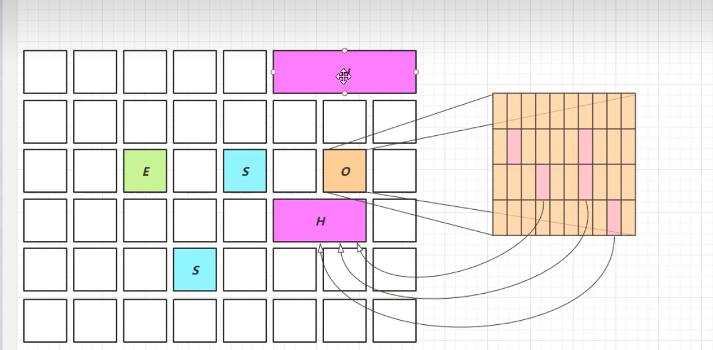


当老年代对巨型对象的引用为 0 时，新生代的垃圾回收就会回收巨型对象


#### 3.4.4.11、JDK9并发标记起始时间调整

- 并发标记必须再堆空间占满之前完成，否则退化成FullGC
- jdk 9之前需要使用 `-XX:InitiatingHeapOccupancyPerent`
- jdk 9可以动态调整
  - `-XX:InitiatingHeapOccupancyPerent`来设置初始值
  - 进行数据采样并动态调整
  - 总会添加一个安全的空挡空间


#### 3.4.4.12、JDK9 更高效的回收

https://docs.oracle.com/en/java/javase/12/gctuning


## 3.5、垃圾回收调优


### 3.5.1、调优领域

- 内存
- 锁竞争
- cpu占用
- io


### 3.5.2、确定目标

- 【低延时】还是【高吞吐量】，选择合适的回收器
- CMS，G1，ZGC
- ParallelGC


### 3.5.3、最快的GC 是不发生GC

`没有GC，也就没有STW`


- 查看FullGC前后的内存占用，考虑下面几个问题
  - 数据是不是太多？
  - 数据表示是不是太臃肿？
    - 对象图
    - 对象大小，Integer 24，int 4
  - 是否存在内存泄漏


### 3.5.4、新生代调优

- 新生代特点：
  - 所有的new操作的内存分配非常廉价
    - TLAB thread-local allocation buffer
  - 死亡对象的回收代价是 0 
  - 大部分对象用过即死
  - Minor GC 的时间远远低于 Full GC


- 新生代越大越好嘛？

`-Xmn`

```
如果新生代内存过大了，老年代的空间就少了，老年代空间少了，进行Full GC，会占用更长的时间暂停
建议：1/4 - 1/2
```


- 幸存区【保留活跃对象 + 需要晋升对象】

  - 晋升阈值配置得当，可以让长时间存活对象尽快晋升

    `-XX:MaxTenuringThreshold=threshold`  // 晋升阈值

    `-XX:+PrintTenuringDistribution` // 打印详细信息


### 3.5.5、老年代调优

以CMS为例

- CMS的老年代内存越大越好
- 先尝试不做调优，如果没有Full GC那么，否则先尝调优新生代
- 观察发生Full GC时老年代内存占用，将老年代内存预设调大1/4 - 1/3
  - `-XX:CMSInitiatingOccupancyFraction=percent`


### 3.5.6、案例

1. Full GC 和 Minor GC 频繁

```
尝试增加新生代内存，新生代内存充裕，就不会频繁的Minor GC，增大幸存区的空间增加对象晋升阈值，让声明周期较短的对象尽可能留在幸存区，让老年代的 FUll Gc不那么频繁
```


2. 请求高峰期发生Full GC，单次暂停时间长（CMS）

```
CMS在重新标记（remark）会导致CMS，暂停时间过长，应该是remark阶段问题，CMS重新标记会扫描整个堆内存，可能是新生代对象过多，建议在remark前，先对新生代做一次垃圾回收，减少垃圾数量-XX:CMSScavengBeforeRemark
```


3. 老年代充裕情况下，发生 Full GC（CMS，1.7）

```
1.7以前，永久代【方法区】的空间不足，也会导致Full GC
```


# 4、类加载与字节码技术


1. 类文件结构
2. 字节码指令
3. 编译器处理
4. 类加载阶段
5. 类加载器
6. 运行期优化


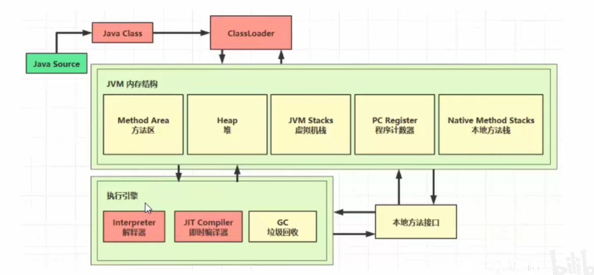


## 4.1、类文件结构

[参考文献](https://docs.oracle.com/javase/specs/jvms/se8/html/jvms-4.html)


```java
package com.dhf;

/**
 * @author 党
 * @version 1.0
 * 2022/9/16   8:18
 */
public class HelloWorld {
    public static void main(String[] args) {
        System.out.println("Hello World");
    }
}
```


HelloWorld.class 二进制字节码文件

```
00000000:  cafe babe 0000 0034 0022 0a00 0600 1409 0015 0016 0800 170a  
00000018:  0018 0019 0700 1a07 001b 0100 063c 696e 6974 3e01 0003 2829  
00000030:  5601 0004 436f 6465 0100 0f4c 696e 654e 756d 6265 7254 6162 
00000048:  6c65 0100 124c 6f63 616c 5661 7269 6162 6c65 5461 626c 6501
00000060:  0004 7468 6973 0100 144c 636f 6d2f 6468 662f 4865 6c6c 6f57
00000078:  6f72 6c64 3b01 0004 6d61 696e 0100 1628 5b4c 6a61 7661 2f6c
00000090:  616e 672f 5374 7269 6e67 3b29 5601 0004 6172 6773 0100 135b
000000a8:  4c6a 6176 612f 6c61 6e67 2f53 7472 696e 673b 0100 0a53 6f75
000000c0:  7263 6546 696c 6501 000f 4865 6c6c 6f57 6f72 6c64 2e6a 6176
000000d8:  610c 0007 0008 0700 1c0c 001d 001e 0100 0b48 656c 6c6f 2057
000000f0:  6f72 6c64 0700 1f0c 0020 0021 0100 1263 6f6d 2f64 6866 2f48
00000108:  656c 6c6f 576f 726c 6401 0010 6a61 7661 2f6c 616e 672f 4f62
00000120:  6a65 6374 0100 106a 6176 612f 6c61 6e67 2f53 7973 7465 6d01
00000138:  0003 6f75 7401 0015 4c6a 6176 612f 696f 2f50 7269 6e74 5374
00000150:  7265 616d 3b01 0013 6a61 7661 2f69 6f2f 5072 696e 7453 7472
00000168:  6561 6d01 0007 7072 696e 746c 6e01 0015 284c 6a61 7661 2f6c
00000180:  616e 672f 5374 7269 6e67 3b29 5600 2100 0500 0600 0000 0000
00000198:  0200 0100 0700 0800 0100 0900 0000 2f00 0100 0100 0000 052a
000001b0:  b700 01b1 0000 0002 000a 0000 0006 0001 0000 0008 000b 0000
000001c8:  000c 0001 0000 0005 000c 000d 0000 0009 000e 000f 0001 0009
000001e0:  0000 0037 0002 0001 0000 0009 b200 0212 03b6 0004 b100 0000
000001f8:  0200 0a00 0000 0a00 0200 0000 0a00 0800 0b00 0b00 0000 0c00
00000210:  0100 0000 0900 1000 1100 0000 0100 1200 0000 0200 13  
```


根据JVM规范，类文件结构如下：

```
 ClassFile{
	u4				magic; // 前四个字节，魔数
	u2				minor_version; // 两个字节，小版本号
	u2				major_version; // 主版本号
	u2				constant_pool_count; // 常量池
	cp_info			constant_pool[constant_pool_count-1]
	u2				access_flags; // 访问修饰
	u2				this_class; // 类信息
	u2				super_class; // 父类
	u2				interfaces_count; // 接口信息
	u2				interface[interfaces_count];
	u2				fields_count; // 变量信息
	fidld_info		fields[fields_count];
	u2				methods_count; // 方法信息
	method_info		methods[methods_count];
	u2				attributes_count; // 附加属性信息
	attribute_info	attributes[attributes_count];
}
```


### 4.1.1、魔数

0-3字节，表示它是否是【class】类型的文件

00000000：ca  fe  ba  be  // 表示是class文件

​					0000 0034 // 版本号，没有小版本，主版本0034（52，jdk8）


### 4.1.2、常量池

`太难了，就截屏了，不敲了`

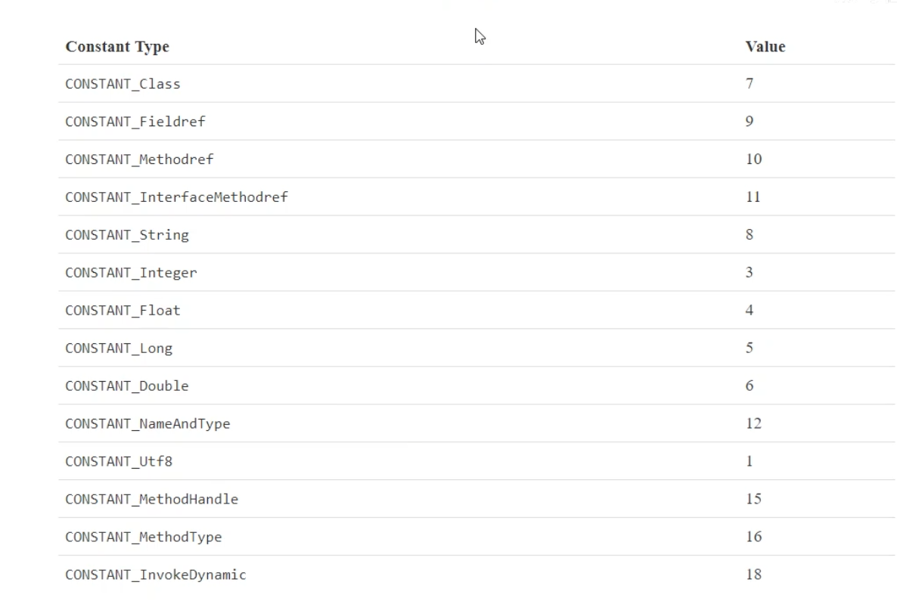


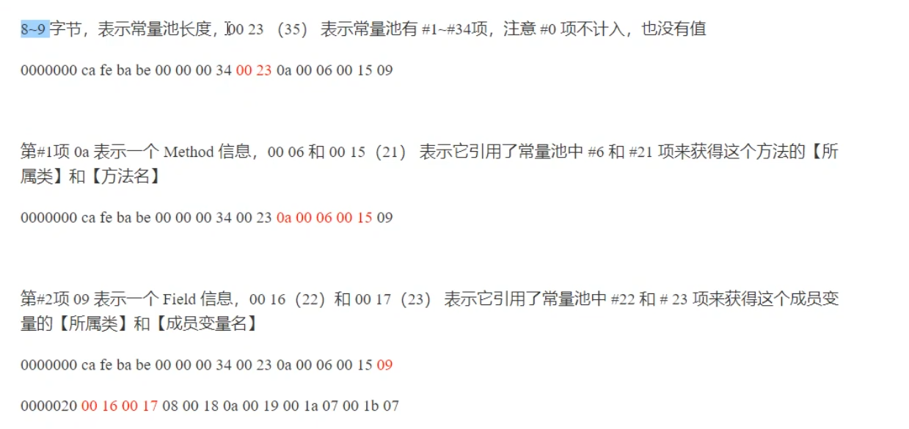

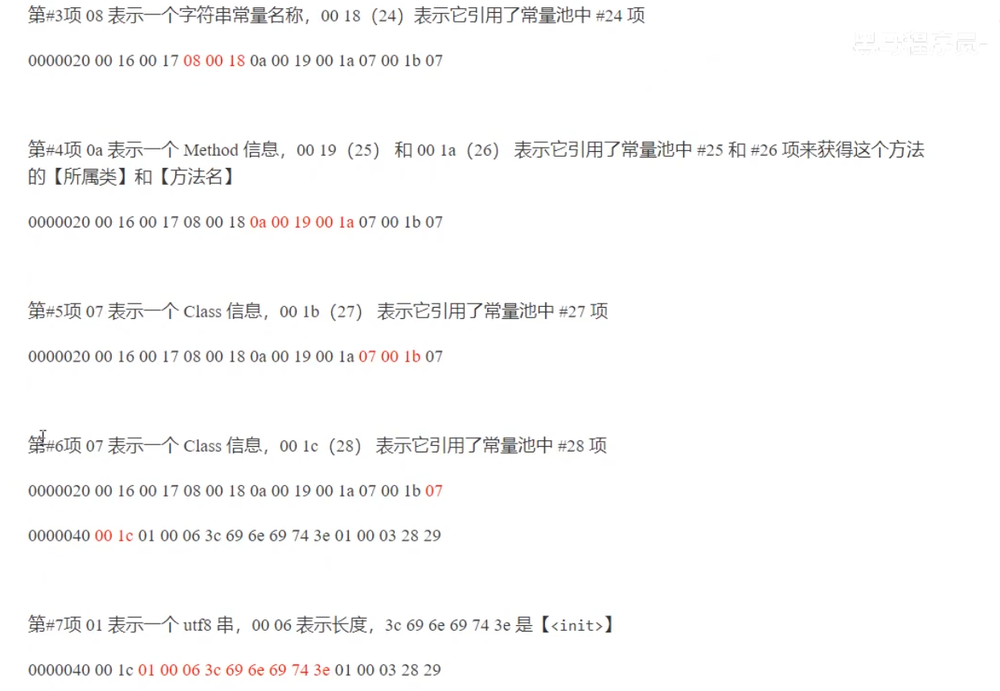


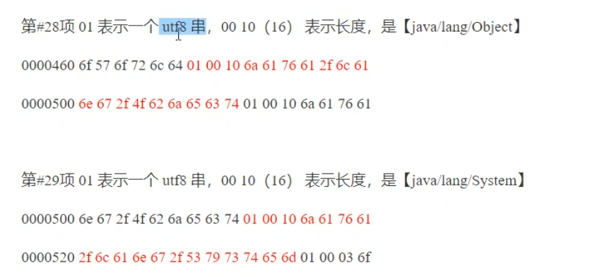


### 4.1.3、访问标识与继承信息


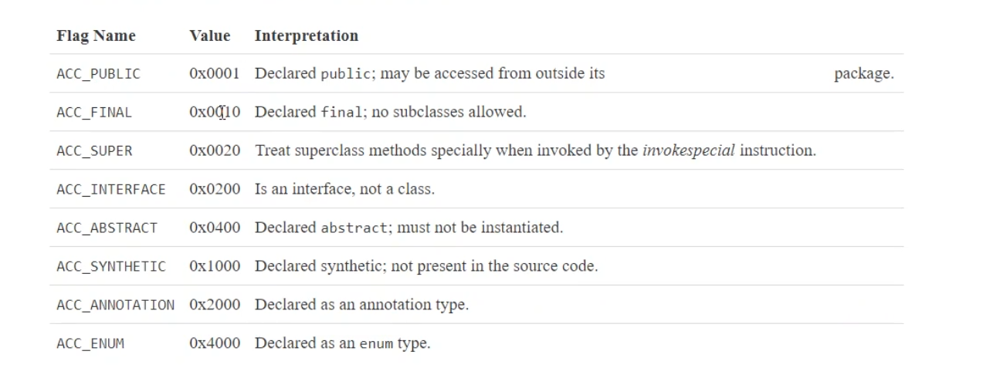


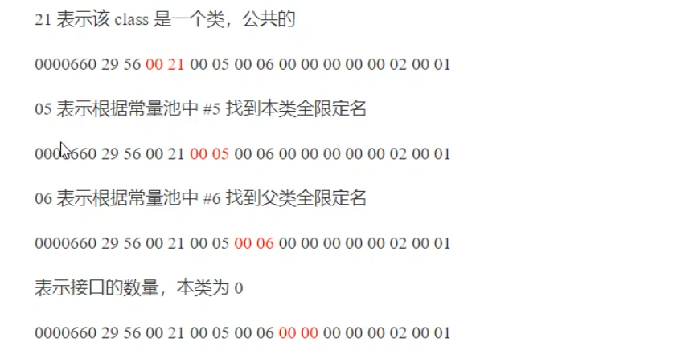


### 4.1.4、Field信息

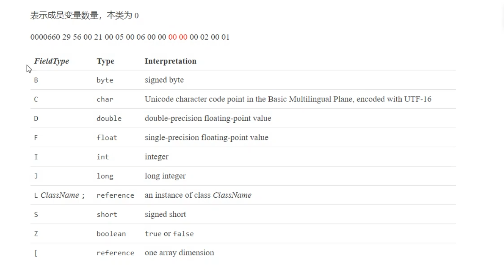


### 4.1.5、Method信息

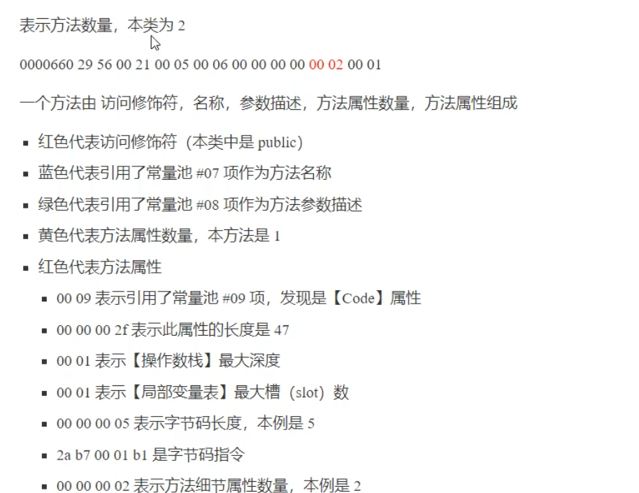

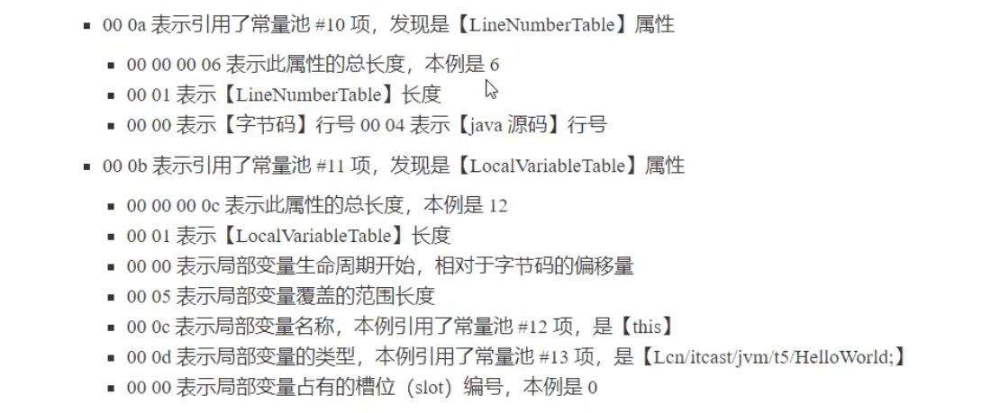


### 4.1.6、附加属性

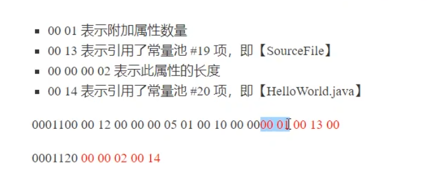


## 4.2、字节码指令


### 4.2.1、入门

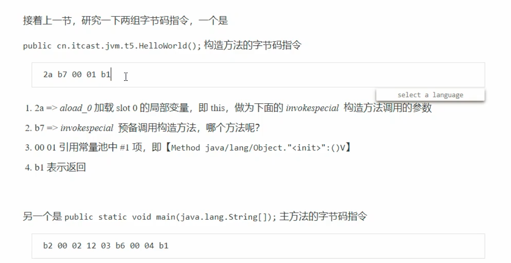


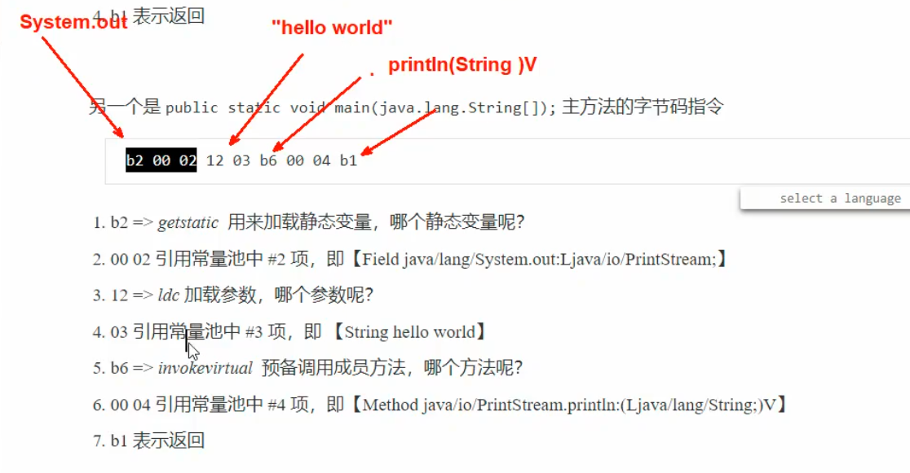


### 4.2.2、javap工具

`javap -v xx.class`

```
PS E:\java\jvm\target\classes\com\dhf> javap -v .\Demo.class
Classfile /E:/java/jvm/target/classes/com/dhf/Demo.class
  Last modified 2022-9-14; size 1702 bytes
  MD5 checksum fcff23de35fa3151eccbc31be00c18e8
  Compiled from "Demo.java"
public class com.dhf.Demo
  minor version: 0
  major version: 52
  flags: ACC_PUBLIC, ACC_SUPER
Constant pool:
   #1 = Methodref          #18.#40        // java/lang/Object."<init>":()V
   #2 = Class              #41            // java/lang/Thread
   #3 = InvokeDynamic      #0:#46         // #0:run:()Ljava/lang/Runnable;
   #4 = Methodref          #2.#47         // java/lang/Thread."<init>":(Ljava/lang/Runnable;)V
   #5 = Methodref          #2.#48         // java/lang/Thread.start:()V
   #6 = Fieldref           #49.#50        // java/lang/System.out:Ljava/io/PrintStream;
   #7 = Class              #51            // java/lang/StringBuilder
   #8 = Methodref          #7.#40         // java/lang/StringBuilder."<init>":()V
   #9 = Methodref          #2.#52         // java/lang/Thread.currentThread:()Ljava/lang/Thread;
  #10 = Methodref          #2.#53         // java/lang/Thread.getName:()Ljava/lang/String;
  #11 = Methodref          #7.#54         // java/lang/StringBuilder.append:(Ljava/lang/String;)Ljava/lang/StringBuilder;
  #12 = String             #55            //
  #13 = Methodref          #7.#56         // java/lang/StringBuilder.append:(I)Ljava/lang/StringBuilder;
  #14 = Methodref          #7.#57         // java/lang/StringBuilder.toString:()Ljava/lang/String;
  #15 = Methodref          #58.#59        // java/io/PrintStream.println:(Ljava/lang/String;)V
  #16 = Methodref          #17.#60        // com/dhf/Demo.method:()V
  #17 = Class              #61            // com/dhf/Demo
  #18 = Class              #62            // java/lang/Object
  #19 = Utf8               name
  #20 = Utf8               Ljava/lang/String;
  #21 = Utf8               <init>
  #22 = Utf8               ()V
  #23 = Utf8               Code
  #24 = Utf8               LineNumberTable
  #25 = Utf8               LocalVariableTable
  #26 = Utf8               this
  #27 = Utf8               Lcom/dhf/Demo;
  #28 = Utf8               main
  #29 = Utf8               ([Ljava/lang/String;)V
  #30 = Utf8               i
  #31 = Utf8               I
  #32 = Utf8               args
  #33 = Utf8               [Ljava/lang/String;
  #34 = Utf8               StackMapTable
  #35 = Utf8               method
  #36 = Utf8               i1
  #37 = Utf8               lambda$main$0
  #38 = Utf8               SourceFile
  #39 = Utf8               Demo.java
  #40 = NameAndType        #21:#22        // "<init>":()V
  #41 = Utf8               java/lang/Thread
  #42 = Utf8               BootstrapMethods
  #43 = MethodHandle       #6:#63         // invokestatic java/lang/invoke/LambdaMetafactory.metafactory:(Ljava/lang/invoke/MethodHandles$Lookup;Ljava/lang/String;Ljava/lang/invoke/MethodType;Ljava/lang/invoke/MethodType;Ljava/lang/invoke/MethodHandle;Ljava/lang/invoke/MethodType;)Ljava/lang/invoke/CallSite;
  #44 = MethodType         #22            //  ()V
  #45 = MethodHandle       #6:#64         // invokestatic com/dhf/Demo.lambda$main$0:()V
  #46 = NameAndType        #65:#66        // run:()Ljava/lang/Runnable;
  #47 = NameAndType        #21:#67        // "<init>":(Ljava/lang/Runnable;)V
  #48 = NameAndType        #68:#22        // start:()V
  #49 = Class              #69            // java/lang/System
  #50 = NameAndType        #70:#71        // out:Ljava/io/PrintStream;
  #51 = Utf8               java/lang/StringBuilder
  #52 = NameAndType        #72:#73        // currentThread:()Ljava/lang/Thread;
  #53 = NameAndType        #74:#75        // getName:()Ljava/lang/String;
  #54 = NameAndType        #76:#77        // append:(Ljava/lang/String;)Ljava/lang/StringBuilder;
  #55 = Utf8
  #56 = NameAndType        #76:#78        // append:(I)Ljava/lang/StringBuilder;
  #57 = NameAndType        #79:#75        // toString:()Ljava/lang/String;
  #58 = Class              #80            // java/io/PrintStream
  #59 = NameAndType        #81:#82        // println:(Ljava/lang/String;)V
  #60 = NameAndType        #35:#22        // method:()V
  #61 = Utf8               com/dhf/Demo
  #62 = Utf8               java/lang/Object
  #63 = Methodref          #83.#84        // java/lang/invoke/LambdaMetafactory.metafactory:(Ljava/lang/invoke/MethodHandles$Lookup;Ljava/lang/String;Ljava/lang/invoke/MethodType;Ljava/lang/invoke/MethodType;Ljava/lang/invoke/MethodHandle;Ljava/lang/invoke/MethodType;)Ljava/lang/invoke/CallSite;
  #64 = Methodref          #17.#85        // com/dhf/Demo.lambda$main$0:()V
  #65 = Utf8               run
  #66 = Utf8               ()Ljava/lang/Runnable;
  #67 = Utf8               (Ljava/lang/Runnable;)V
  #68 = Utf8               start
  #69 = Utf8               java/lang/System
  #70 = Utf8               out
  #71 = Utf8               Ljava/io/PrintStream;
  #72 = Utf8               currentThread
  #73 = Utf8               ()Ljava/lang/Thread;
  #74 = Utf8               getName
  #75 = Utf8               ()Ljava/lang/String;
  #76 = Utf8               append
  #77 = Utf8               (Ljava/lang/String;)Ljava/lang/StringBuilder;
  #78 = Utf8               (I)Ljava/lang/StringBuilder;
  #79 = Utf8               toString
  #80 = Utf8               java/io/PrintStream
  #81 = Utf8               println
  #82 = Utf8               (Ljava/lang/String;)V
  #83 = Class              #86            // java/lang/invoke/LambdaMetafactory
  #84 = NameAndType        #87:#91        // metafactory:(Ljava/lang/invoke/MethodHandles$Lookup;Ljava/lang/String;Ljava/lang/invoke/MethodType;Ljava/lang/invoke/MethodType;Ljava/lang/invoke/MethodHandle;Ljava/lang/invoke/MethodType;)Ljava/lang/invoke/CallSite;
  #85 = NameAndType        #37:#22        // lambda$main$0:()V
  #86 = Utf8               java/lang/invoke/LambdaMetafactory
  #87 = Utf8               metafactory
  #88 = Class              #93            // java/lang/invoke/MethodHandles$Lookup
  #89 = Utf8               Lookup
  #90 = Utf8               InnerClasses
  #91 = Utf8               (Ljava/lang/invoke/MethodHandles$Lookup;Ljava/lang/String;Ljava/lang/invoke/MethodType;Ljava/lang/invoke/MethodType;Ljava/lang/invoke/MethodHandle;Ljava/lang/invoke/MethodType;)Ljava/lang/invoke/CallSite;
  #92 = Class              #94            // java/lang/invoke/MethodHandles
  #93 = Utf8               java/lang/invoke/MethodHandles$Lookup
  #94 = Utf8               java/lang/invoke/MethodHandles
{
  public com.dhf.Demo();
    descriptor: ()V
    flags: ACC_PUBLIC
    Code:
      stack=1, locals=1, args_size=1
         0: aload_0
         1: invokespecial #1                  // Method java/lang/Object."<init>":()V
         4: return
      LineNumberTable:
        line 10: 0
      LocalVariableTable:
        Start  Length  Slot  Name   Signature
            0       5     0  this   Lcom/dhf/Demo;

  public static void main(java.lang.String[]);
    descriptor: ([Ljava/lang/String;)V
    flags: ACC_PUBLIC, ACC_STATIC
    Code:
      stack=3, locals=2, args_size=1
         0: iconst_0
         1: istore_1
         2: iload_1
         3: iconst_5
         4: if_icmpge     28
         7: new           #2                  // class java/lang/Thread
        10: dup
        11: invokedynamic #3,  0              // InvokeDynamic #0:run:()Ljava/lang/Runnable;
        16: invokespecial #4                  // Method java/lang/Thread."<init>":(Ljava/lang/Runnable;)V
        19: invokevirtual #5                  // Method java/lang/Thread.start:()V
        22: iinc          1, 1
        25: goto          2
        28: return
      LineNumberTable:
        line 14: 0
        line 15: 7
        line 17: 19
        line 14: 22
        line 19: 28
      LocalVariableTable:
        Start  Length  Slot  Name   Signature
            2      26     1     i   I
            0      29     0  args   [Ljava/lang/String;
      StackMapTable: number_of_entries = 2
        frame_type = 252 /* append */
          offset_delta = 2
          locals = [ int ]
        frame_type = 250 /* chop */
          offset_delta = 25
}
SourceFile: "Demo.java"
InnerClasses:
     public static final #89= #88 of #92; //Lookup=class java/lang/invoke/MethodHandles$Lookup of class java/lang/invoke/MethodHandles
BootstrapMethods:
  0: #43 invokestatic java/lang/invoke/LambdaMetafactory.metafactory:(Ljava/lang/invoke/MethodHandles$Lookup;Ljava/lang/String;Ljava/lang/invoke/MethodType;Ljava/lang/invoke/MethodType;Ljava/lang/invoke/MethodHandle;Ljava/lang/invoke/MethodType;)Ljava/lang/invoke/CallSite;
    Method arguments:
      #44 ()V
      #45 invokestatic com/dhf/Demo.lambda$main$0:()V
      #44 ()V
```


### 4.2.3、图解方法执行流程


#### 1）原始java代码

```java
package com.dhf.clazz;

/**
 * @author 党
 * @version 1.0
 * 2022/9/16   9:40
 * 演示 字节码指令 和 操作数栈、常量池的关系
 */
public class Demo {
    public static void main(String[] args) {
        int a = 10;
        // 0111 1111 1111 1111
        int b = Short.MAX_VALUE + 1;
        int c = a + b;
        System.out.println(c);
    }
}
```


#### 2）编译后的字节码文件

```
PS E:\java\jvm\target\classes\com\dhf\clazz> javap -v .\Demo.class
Classfile /E:/java/jvm/target/classes/com/dhf/clazz/Demo.class
  Last modified 2022-9-16; size 602 bytes
  MD5 checksum 629d5ff66331944dd2a5ccb23425e9d4
  Compiled from "Demo.java"
public class com.dhf.clazz.Demo
  minor version: 0
  major version: 52
  flags: ACC_PUBLIC, ACC_SUPER
Constant pool:
   #1 = Methodref          #7.#25         // java/lang/Object."<init>":()V
   #2 = Class              #26            // java/lang/Short
   #3 = Integer            32768
   #4 = Fieldref           #27.#28        // java/lang/System.out:Ljava/io/PrintStream;
   #5 = Methodref          #29.#30        // java/io/PrintStream.println:(I)V
   #6 = Class              #31            // com/dhf/clazz/Demo
   #7 = Class              #32            // java/lang/Object
   #8 = Utf8               <init>
   #9 = Utf8               ()V
  #10 = Utf8               Code
  #11 = Utf8               LineNumberTable
  #12 = Utf8               LocalVariableTable
  #13 = Utf8               this
  #14 = Utf8               Lcom/dhf/clazz/Demo;
  #15 = Utf8               main
  #16 = Utf8               ([Ljava/lang/String;)V
  #17 = Utf8               args
  #18 = Utf8               [Ljava/lang/String;
  #19 = Utf8               a
  #20 = Utf8               I
  #21 = Utf8               b
  #22 = Utf8               c
  #23 = Utf8               SourceFile
  #24 = Utf8               Demo.java
  #25 = NameAndType        #8:#9          // "<init>":()V
  #26 = Utf8               java/lang/Short
  #27 = Class              #33            // java/lang/System
  #28 = NameAndType        #34:#35        // out:Ljava/io/PrintStream;
  #29 = Class              #36            // java/io/PrintStream
  #30 = NameAndType        #37:#38        // println:(I)V
  #31 = Utf8               com/dhf/clazz/Demo
  #32 = Utf8               java/lang/Object
  #33 = Utf8               java/lang/System
  #34 = Utf8               out
  #35 = Utf8               Ljava/io/PrintStream;
  #36 = Utf8               java/io/PrintStream
  #37 = Utf8               println
  #38 = Utf8               (I)V
{
  public com.dhf.clazz.Demo();
    descriptor: ()V
    flags: ACC_PUBLIC
    Code:
      stack=1, locals=1, args_size=1
         0: aload_0
         1: invokespecial #1                  // Method java/lang/Object."<init>":()V
         4: return
      LineNumberTable:
        line 9: 0
      LocalVariableTable:
        Start  Length  Slot  Name   Signature
            0       5     0  this   Lcom/dhf/clazz/Demo;

  public static void main(java.lang.String[]);
    descriptor: ([Ljava/lang/String;)V
    flags: ACC_PUBLIC, ACC_STATIC
    Code:
      stack=2, locals=4, args_size=1
         0: bipush        10
         2: istore_1
         3: ldc           #3                  // int 32768
         5: istore_2
         6: iload_1
         7: iload_2
         8: iadd
         9: istore_3
        10: getstatic     #4                  // Field java/lang/System.out:Ljava/io/PrintStream;
        13: iload_3
        14: invokevirtual #5                  // Method java/io/PrintStream.println:(I)V
        17: return
      LineNumberTable:
        line 11: 0
        line 13: 3
        line 14: 6
        line 15: 10
        line 16: 17
      LocalVariableTable:
        Start  Length  Slot  Name   Signature
            0      18     0  args   [Ljava/lang/String;
            3      15     1     a   I
            6      12     2     b   I
           10       8     3     c   I
}
SourceFile: "Demo.java"
```


#### 3）常量池载入运行时常量池

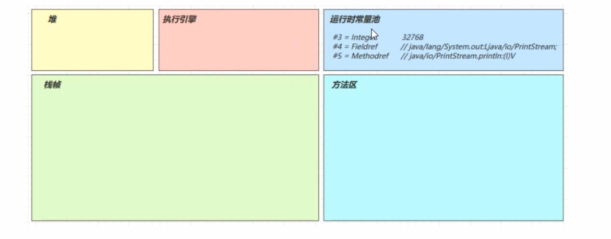

`运行时常量池是方法区【metaspace】的一部分`


#### 4）方法字节码载入方法区

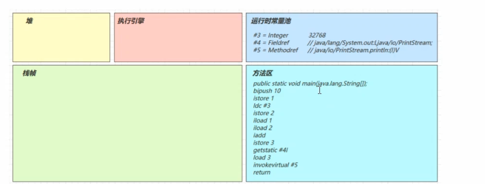


#### 5）main线程开始运行，分配栈帧内存

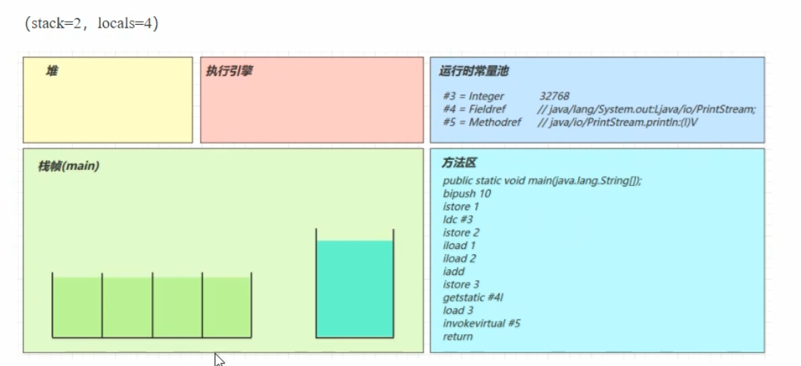


#### 6）执行引擎开始执行字节码

 **bippush  10**

- bippush将一个byte压入操作数栈（其长度会补齐4个字节），类似指令还有
- sippush将一个short压入操作数栈（其长度会补齐4个字节）
- ldc将一个int压入操作数栈
- ldc2_w将一个long压入操作数栈（分两次压，因为long是8个字节）
- 这里小的数子都是和字节码指令存在一起，超过short范围的数字存入了常量池


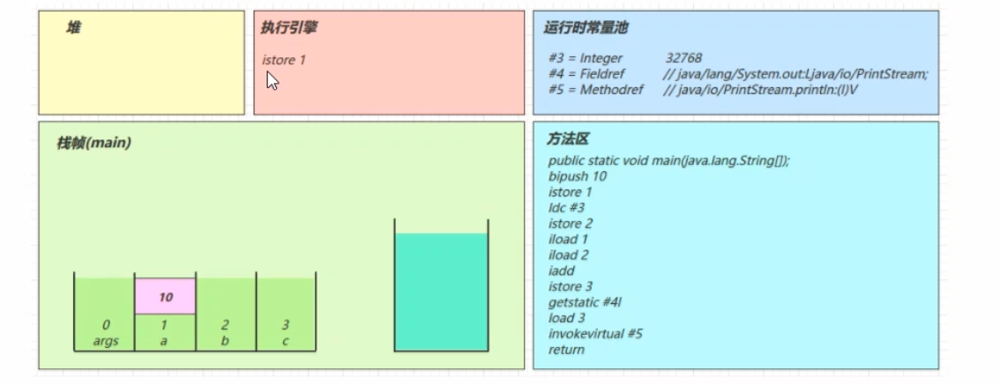


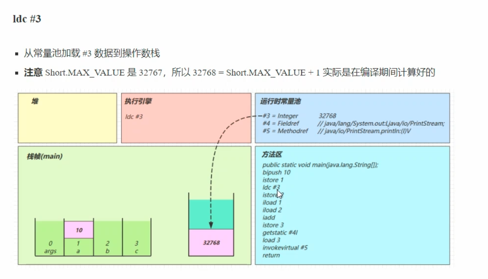


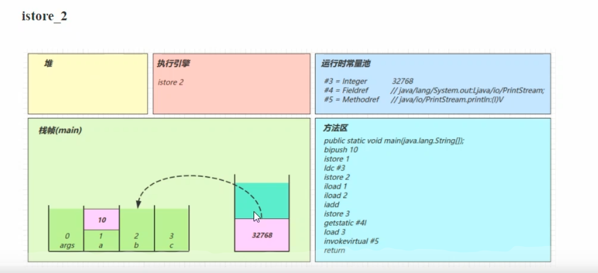

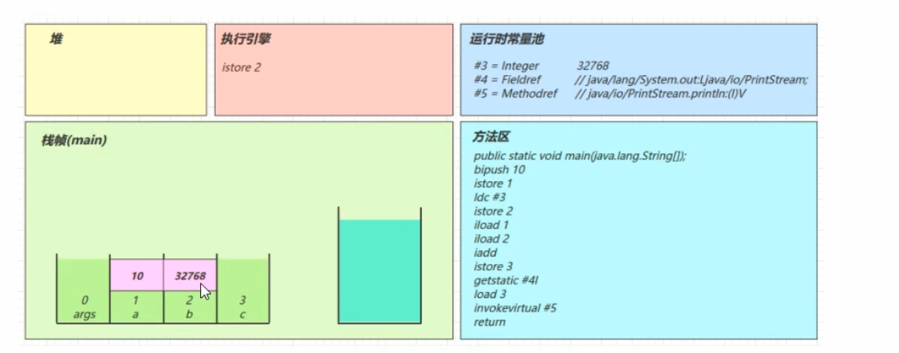


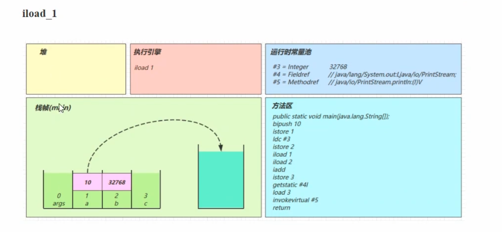


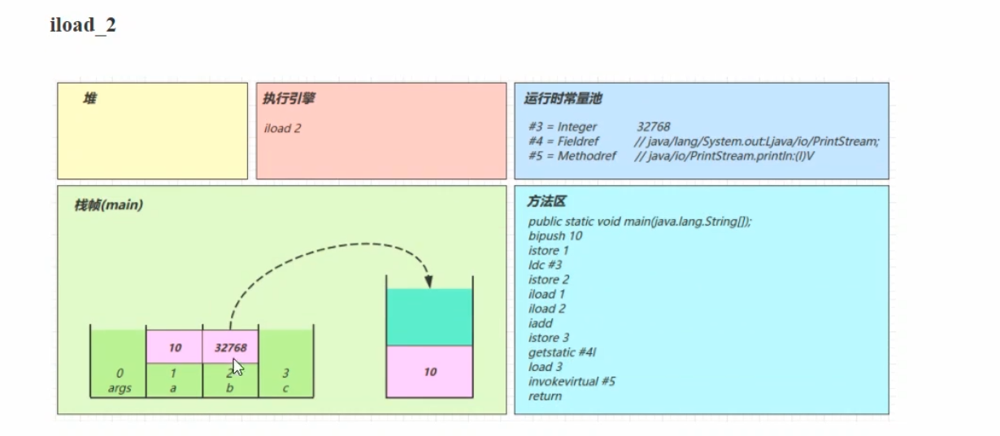


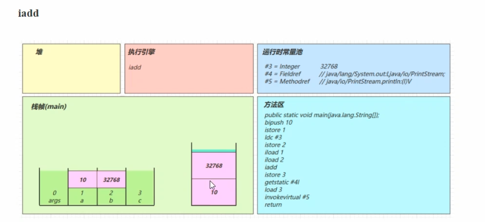

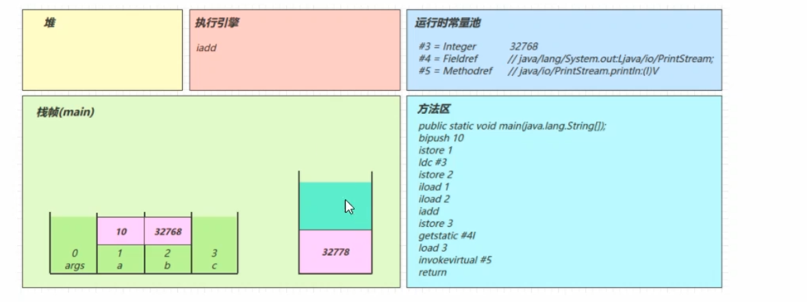


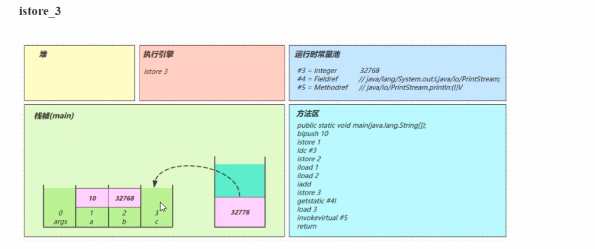

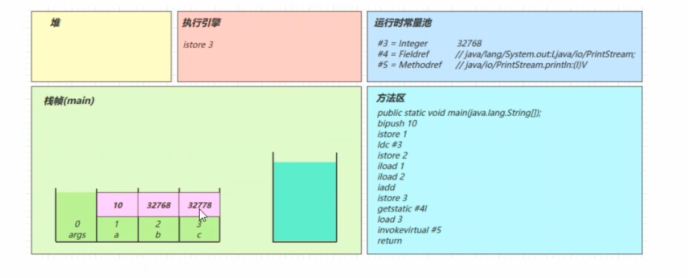


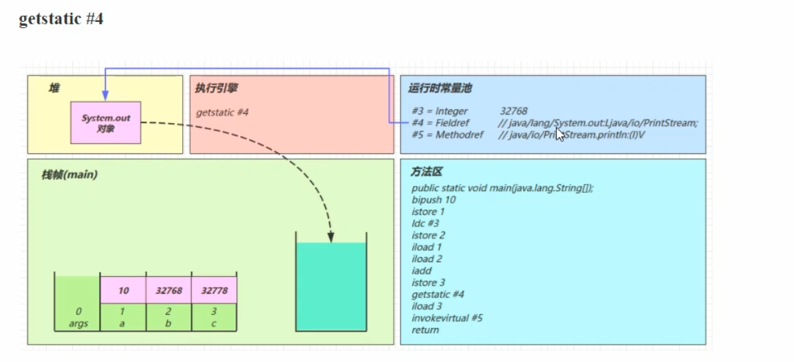

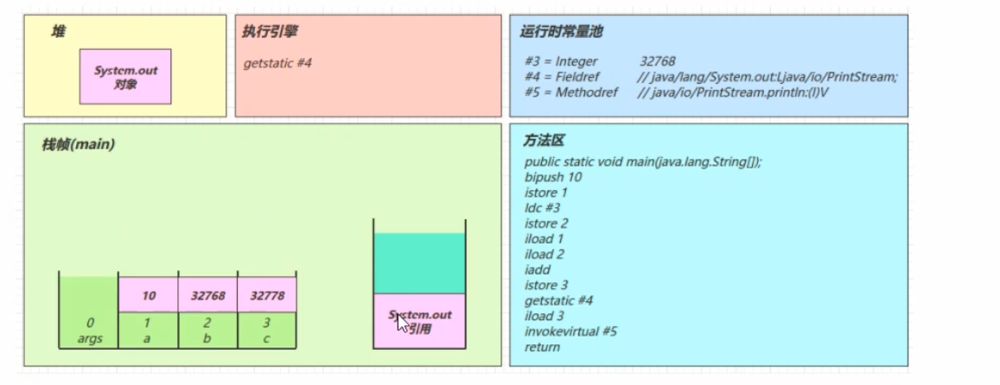


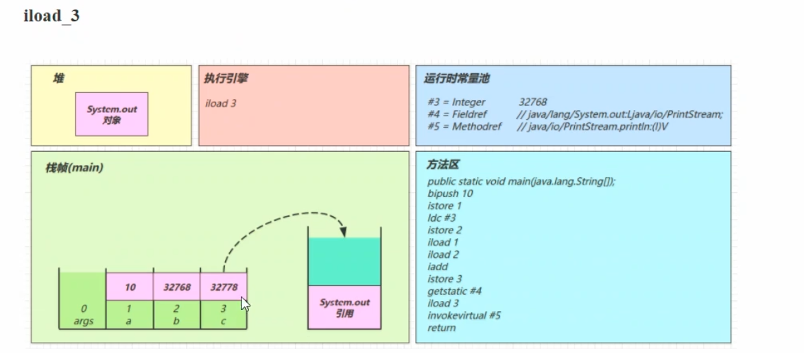

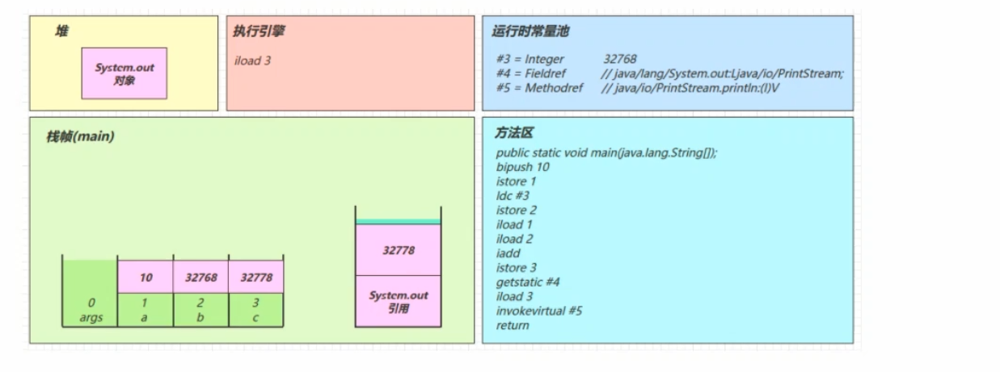


#### 7）分析a++

```java
public class Demo {
    public static void main(String[] args) {
        int a = 10;
        int b = a++ + ++a + a--;
        System.out.println(a); // 11
        System.out.println(b); // 34
    }
}
```


分析：

- 注意 iinc 指令是直接在局部变量solt【槽位】上进行运算
- a++ 和 ++a 的区别是先执行 iload 还是 先执行 iinc


a++命令，先加入操作数栈，之后再局部变量solt增加


++a，先对局部变量solt修改，然后压入操作数栈


a--


### 4.2.4、条件判断指令


说明：

1. buye，short，char，int都会按照int比较，因为操作数栈都是4字节
2. goto用来调整到指定行号的字节码


-1 到 5 之间的数 使用 iconst表示  【将 0 加载到 操作数栈】

instore_1 【将操作数栈 的 数 放入 局部变量solt中】

ifne  12【判断是否不等于 0 ，如果不等于 0 跳转到 12行】


### 4.2.5、循环控制指令


### 4.2.6、构造方法


#### 1）< cinit>()V

```java
public class Demo {
    static int i = 10;
    static {
        i = 20;
    }
    static {
        i = 30;
    }
}
```


编译器会按从上至下的顺序，收集所有static静态代码块和静态成员赋值的代码，合并为一个特殊的方法< cinit>()V :


< cinit>()V方法会在类的初始化阶段被调用


#### 2）< init>()V

```java
class demo{
    private String a = "s1";
    {
        b = 20;
    }
    private int b = 10;
    {
        a = "s2";
    }
    public demo(String a,int b){
        this.a = a;
        this.b = b;
    }
    public static void main(String[] args){
        demo demo = new demo("s3",30);
        System.out.println(demo.a); // s3
        System.out.println(demo.b); // 30
    }
}
```


编译器会按照从上到下的顺序，收集所有的{}代码和成员变量的赋值代码，形成新的构造方法，但原始的构造方法内的代码总是在最后


### 4.2.7、方法调用


### 4.2.8、多态原理

当执行 invokevirtual指令时

1. 先通过栈帧中的对象引用找到对象
2. 分析对象头，找到对象的实际Class
3. Class结构中有 vtable，他在类加载的链接阶段就已经根据方法的重写规则生成好了
4. 查表得到方法的具体地址
5. 执行方法的字节码


### 4.2.9、异常处理


#### 1）finally 练习


- 由于 finally 中的 ireturn 被插入了所有可能的流程，因此返回结构以finally为准
- 至于字节码中的第二行，似乎没啥用，看下个例子
- 跟上面的例子 finally 相比，发现没有 athrow了，这告诉我们：如果在finally中出现了return，会吞掉异常


### 4.2.10、synchronized


```java
class synDemo{
    public static void main(String[] args) {
        Object lock = new Object();
        synchronized (lock){
            System.out.println("hello");
        }
    }
}
```


```java
 public static void main(java.lang.String[]);
    descriptor: ([Ljava/lang/String;)V
    flags: ACC_PUBLIC, ACC_STATIC
    Code:
      stack=2, locals=4, args_size=1
         0: new           #2                  // class java/lang/Object
         3: dup
         4: invokespecial #1                  // Method java/lang/Object."<init>":()V
         7: astore_1 // lock 引用 -> lock
         8: aload_1 // <-lock (synchronized开始)
         9: dup // 拷贝一个lock(一个加锁，一个解锁)
        10: astore_2 // lock引用 -> slot 2
        11: monitorenter // monitorenter(lock引用，加锁)
        12: getstatic     #3 // Field java/lang/System.out:Ljava/io/PrintStream;
        15: ldc           #4  // String hello
        17: invokevirtual #5  // Method java/io/PrintStream.println:(Ljava/lang/String;)V
        20: aload_2 // <- slot 2(lock引用)
        21: monitorexit // monitorenter(lock引用，解锁)
        22: goto          30
        25: astore_3 // any -> slot 3
        26: aload_2 // <- slot 2(lock引用)
        27: monitorexit // monitorenter(lock引用。解锁)
        28: aload_3
        29: athrow
        30: return
      Exception table:
         from    to  target type
            12    22    25   any
            25    28    25   any

```


## 4.3、编译器处理

所谓的 语法糖，其实就是指java编译器把*.java源码编译为*.class字节码的过程中，自动生成和转换的一些代码，主要是为了减轻程序员的负担，算是java编译器给我们的一个额外福利（给糖吃嘛)
注意，以下代码的分析，借助了javap 工具，idea的反编译功能,idea插件jclasslib等工具。另外，编译器转换的结果直接就是class字节码，只是为了便于阅读，给出了几乎等价的java源码方式，并不是编译器还会转换出中间的java源码，切记。


### 3.1、默认构造器

```java
public class Candy1{
	
}
```

编译成class后的代码

```java
public class Candy1{
	public Candy1(){
		super(); // java/lang/Object."<init>":()V
	}
}
```


### 3.2、自动拆装箱

这个特性是 JDK 5 加入的

```java
public class Candy2{
	public static void main(String[] args){
        Integer x = 1; // 装箱
        int y = x; // 拆箱
    }
}
```

在JDK 5 之前会编译失败，需要写成

```java
public class Candy2{
	public static void main(String[] args){
        Integer x = Integer.valueOf(1);
        int y = x.intValue();
    }
}
```


显然之前版本的代码太麻烦了，需要在基本类型和包装类型之间来回转换（尤其是集合类中操作的都是包装类型)，因此这些转换的事情在DK 5以后都由编译器在编译阶段完成。即代码片段1都会在编译阶段被转换为代码片段2


### 3.3、泛型集合取值

### 1）泛型参数

泛型也是在JDK 5开始加入的特性，但java在编译泛型代码后会执行泛型擦除的动作，即泛型信息在编译为字节码之后就丢失了，实际的类型都当做了object类型来处理:

```java
public class Candy3{
    public static void main(String[] args){
        List<Integer> list = new ArrayList<>();
        list.add(10); // 实际调用 list.add(Object o);
        Integer x = list.get(0); // 实际 Object obj = list.get(int index)
    }
}
```


所以在取值时，编译器真正生产的字节码中，还要额外做一个类型转换

```java
Integer x = (Integer) list.get(0);
```


如果将x变成 int

```java
int x = ((Integer) list.get(0)).intValue();
```


### 2）泛型反射

方法体上的泛型都被擦除了，但是 <span style=color:red>LocalVariableTypeTable【局部变量类型表】</span>中的泛型并没有被擦除


可以通过反射获取**参数上**的泛型信息


### 3.4、可变参数


注意：

- 如果调用了foo()则等价于foo(new String[]{})，创建了一个空数组，而不会传递null


### 3.5、foreach循环


### 3.6、switch字符串


- 执行了两遍switch，第一遍是根据字符串的hashcode 和 equals 将字符串的转换为 byte类型，第二遍才利用byte执行进行比较
- 第一遍使用hashcode比较是为了提高效率，而使用equals是为了防止hash冲突


### 3.7、switch枚举


### 3.8、枚举类


### 3.9、try-with-resources

JDK 7  开始新增了对需要关闭的资源处理的特殊用法 try-with-resources

```java
try( 资源变量 = 创建资源对象){

} catch() {

}
```


其中资源对象需要实现AutoCloseable接口，例如InputStream、OutputStream、Connection、StatementResultset等接口都实现了AutoCloseable，使用try-with-resources可以不用写finally语句块，编译器会帮助生成关闭资源代码，例如:


```java
class TryWithResource{
    static final String FILE_PATH = "E:\\java\\jvm\\src\\main\\resources\\static\\hello.txt";
    public static void main(String[] args) {
        try (FileInputStream fileInputStream = new FileInputStream(FILE_PATH)){
            System.out.println(fileInputStream);
        }catch (IOException e){
            e.printStackTrace();
        }
    }
}
```


class文件

```java
class TryWithResource {
    static final String FILE_PATH = "E:\\java\\jvm\\src\\main\\resources\\static\\hello.txt";

    TryWithResource() {
    }

    public static void main(String[] args) {
        try {
            FileInputStream fileInputStream = new FileInputStream("E:\\java\\jvm\\src\\main\\resources\\static\\hello.txt");
            Throwable var2 = null;

            try {
                System.out.println(fileInputStream);
            } catch (Throwable var12) {
                var2 = var12;
                throw var12;
            } finally {
                if (fileInputStream != null) {
                    if (var2 != null) {
                        try {
                            fileInputStream.close();
                        } catch (Throwable var11) {
                            // 将关闭时的异常添加到 var2，不会丢失异常
                            // 作为压制异常添加
                            var2.addSuppressed(var11);
                        }
                    } else {
                        fileInputStream.close();
                    }
                }

            }
        } catch (IOException var14) {
            var14.printStackTrace();
        }

    }
}
```


### 3.10、方法重写时的桥接方法

方法重写时的返回值分为两种情况：

- 父子类返回值完全一样
- 子类返回值是父类返回值的子类


```java
class A{
    public Number m(){
        return 1;
    }
}
class B extends A{
    @Override
    // 子类返回值是 父类返回值的 子类
    public Integer m(){
        return 2;
    }
}
```


java编译器做如下处理

```java
class B extends A {
    public Integer m() {
        return 2;
    }
    // 才是真正重写了父类的方法
    public synthetic bridge Number m(){
        // 调用public Integer m()
        return m();
    }
}
// synthetic bridge 是编辑器生成的合成方法，对程序是不可见的
```


### 3.11、匿名内部类

```java
public class Candy11 {
	public static void main(String[] args){
		Runnable run = new Runnable(){
            @Override
            public void run(){
                // TODO
            }
        }
	}
}
```


转码后

```java
// 额外生成的代码
final class Candy11$1 implements Runnbale{
    Candy11$1(){
        
    }
    public void run(){
        // TODO
    }
}
```

```java
public class Candy11 {
	public static void main(String[] args){
		Runnable run = new Candy11$1();
}
```


注意
这同时解释了为什么匿名内部类引用局部变量时，局部变量必须是final的:因为在创建Candy11$1对象时，将x的值赋值给了Candy11$1对象的valz属性，所以x不应该再发生变化了，如果变化，那么valx属性没有机会再跟着一起变化


## 4.4、类加载阶段

### 4.1、加载


### 4.2、链接


### 4.3、初始化


#### 1）< cinit>()V 方法


#### 2）发生的时机


### 4.4、练习


## 4.5、类加载器


### 5.1、启动类加载器


### 5.2、扩展类加载器


### 5.3、双亲委派机制


### 5.4、线程上下类加载器


### 5.5、自定义类加载器


## 4.6、运行期优化


### 6.1、即时编译


#### 1）分层编译


