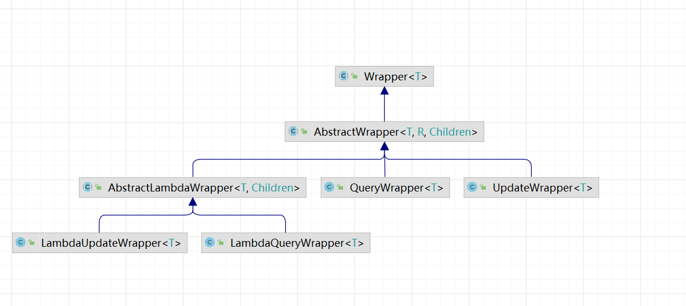
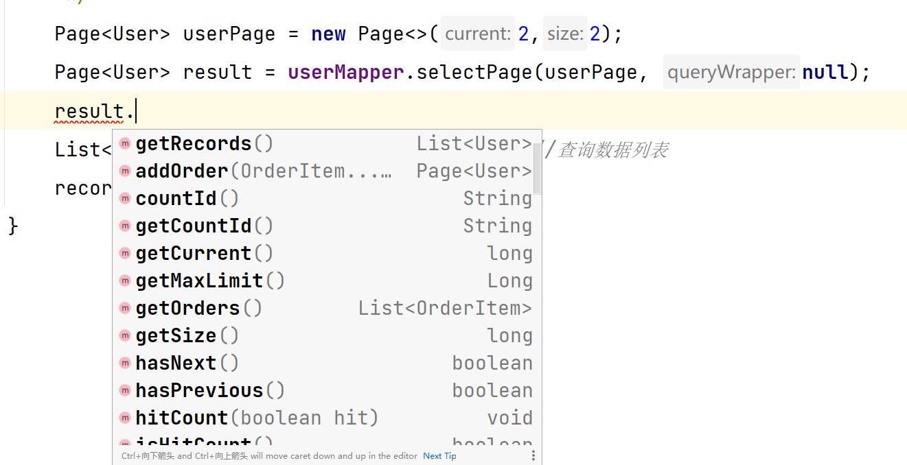
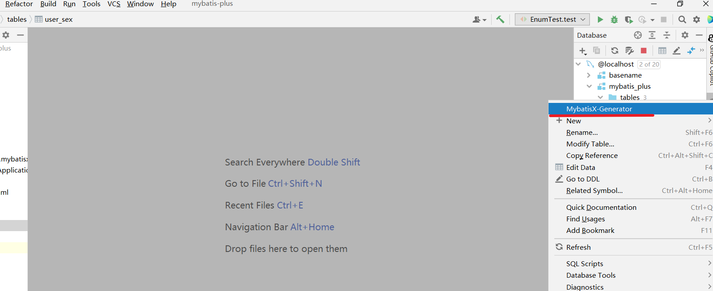
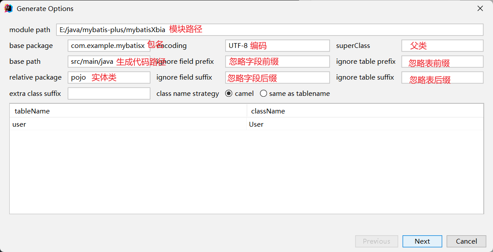
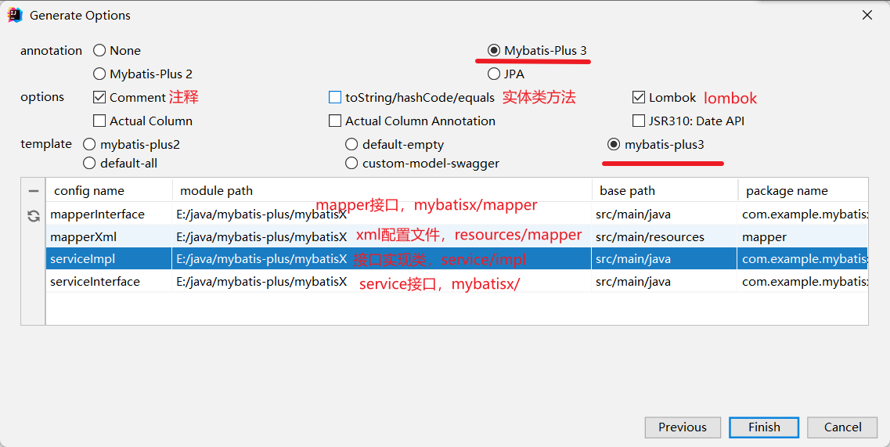
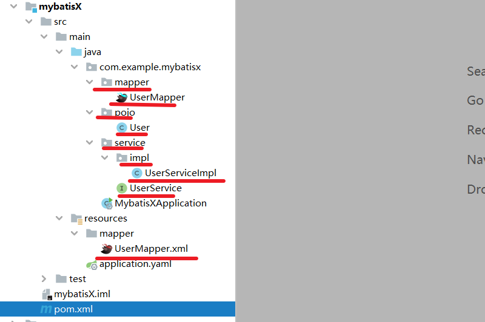
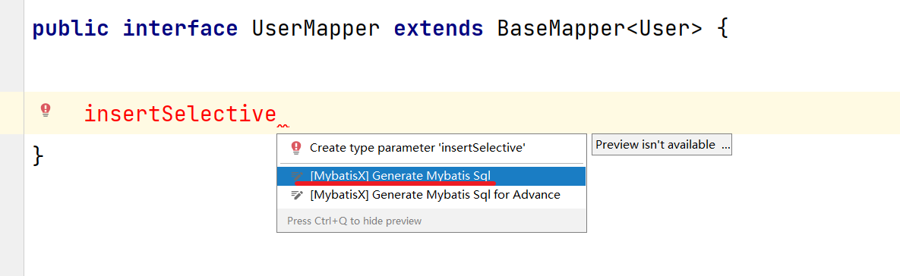
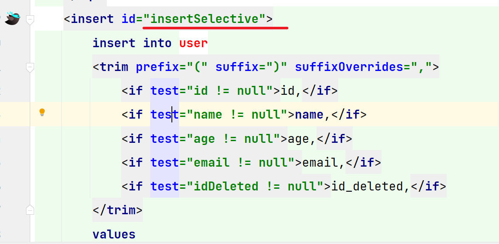

[TOC]


[在线笔记](https://www.yuque.com/docs/share/0112fd84-de5f-433b-996a-b9d9cd87dd36?# 《MyBatisPlus(SpringBoot版)--2022》)


# 1、快速开始

## 1.1、配置数据库

```sql
USE mybatis_plus;
DROP TABLE IF EXISTS user;

CREATE TABLE user
(
   id BIGINT(20) NOT NULL COMMENT '主键ID',
   name VARCHAR(30) NULL DEFAULT NULL COMMENT '姓名',
   age INT(11) NULL DEFAULT NULL COMMENT '年龄',
   email VARCHAR(50) NULL DEFAULT NULL COMMENT '邮箱',
   PRIMARY KEY (id)
);
DELETE FROM user;
INSERT INTO user (id, name, age, email) VALUES
(1, 'Jone', 18, 'test1@baomidou.com'),
(2, 'Jack', 20, 'test2@baomidou.com'),
(3, 'Tom', 28, 'test3@baomidou.com'),
(4, 'Sandy', 21, 'test4@baomidou.com'),
(5, 'Billie', 24, 'test5@baomidou.com');
```


## 1.2、依赖


```xml
<!--MyBatis-plus启动器-->
<dependency>
    <groupId>com.baomidou</groupId>
    <artifactId>mybatis-plus-boot-starter</artifactId>
</dependency>

<!--lombok用于简化实体类开发-->
<dependency>
    <groupId>org.projectlombok</groupId>
    <artifactId>lombok</artifactId>
    <optional>true</optional>
</dependency>
<!--mysql驱动-->
<dependency>
    <groupId>mysql</groupId>
    <artifactId>mysql-connector-java</artifactId>
    <version>5.1.3</version>
</dependency>
```


## 1.3、application.yaml


```yaml
server:
  port: 6060

spring:
  datasource:
    driver-class-name: com.mysql.jdbc.Driver
    username: root
    password: root
    url: jdbc:mysql://localhost:3306/mybatis_plus
    type: com.alibaba.druid.pool.DruidDataSource
```


### 1.3.1、注意

```
1、驱动类driver-class-name
spring boot 2.0(内置jdbc5驱动)，驱动类使用:
driver-class-name: com.mysql.jdbc.Driver
spring boot 2.1及以上(内置jdbc8驱动)，驱动类使用:
driver-class-name: com.mysql.cj.jdbc.Driver
否则运行测试用例的时候会有 WARN 信息

2、连接地址url
MySQL5.7版本的url:
jdbc:mysql://localhost:3306/mybatis_plus?characterEncoding=utf-8&useSSL=false
MySQL8.0版本的url:
jdbc:mysql://localhost:3306/mybatis_plus?serverTimezone=GMT%2B8&characterEncoding=utf-8&useSSL=false
否则运行测试用例报告如下错误:
java.sql.SQLException: The server time zone value 'ÖÐ1ú±ê×1⁄4ʱ1⁄4ä' is unrecognized or represents more
```


## 1.4、代码

### 1.4.1、启动类

```java
@SpringBootApplication
// 扫描mapper接口所在的包
@MapperScan("com.atguigu.mybatisplus.mapper")
public class MybatisplusApplication {

    public static void main(String[] args) {
        SpringApplication.run(MybatisplusApplication.class, args);
    }

}
```


### 1.4.2、pojo


```java
@Data
@AllArgsConstructor
@NoArgsConstructor
public class User {

    private Long id;
    private String name;
    private Integer age;
    private String email;
}
```


### 1.4.3、Mapper

```java
@Mapper
public interface UserMapper extends BaseMapper<User> {
}
```


### 1.4.4、Test

```java
@SpringBootTest
class MybatisplusApplicationTests {

    @Autowired
    private UserMapper userMapper;

    @Test
    public void testSelectList() {
        // 通过条件构造器查询一个List集合，若没有条件，则可以设置null为参数
        List<User> list = userMapper.selectList(null);
        list.forEach(System.out::println);
    }
}
```


### 1.4.5、日志

```yaml
mybatis-plus:
  configuration:
    # log.info
    log-impl: org.apache.ibatis.logging.stdout.StdOutImpl
```


# 2、基本CURD

## 2.1、BashMapper

> ```java
> 
> package com.baomidou.mybatisplus.core.conditions;
> 
> import com.baomidou.mybatisplus.core.conditions.segments.MergeSegments;
> import com.baomidou.mybatisplus.core.conditions.segments.NormalSegmentList;
> import com.baomidou.mybatisplus.core.metadata.TableFieldInfo;
> import com.baomidou.mybatisplus.core.metadata.TableInfo;
> import com.baomidou.mybatisplus.core.metadata.TableInfoHelper;
> import com.baomidou.mybatisplus.core.toolkit.*;
> 
> import java.util.Objects;
> 
> /**
>  * 条件构造抽象类
>  *
>  * @author hubin
>  * @since 2018-05-25
>  */
> @SuppressWarnings("all")
> public abstract class Wrapper<T> implements ISqlSegment {
> 
>     /**
>      * 实体对象（子类实现）
>      *
>      * @return 泛型 T
>      */
>     public abstract T getEntity();
> 
>     public String getSqlSelect() {
>         return null;
>     }
> 
>     public String getSqlSet() {
>         return null;
>     }
> 
>     public String getSqlComment() {
>         return null;
>     }
> 
>     public String getSqlFirst() {
>         return null;
>     }
> 
>     /**
>      * 获取 MergeSegments
>      */
>     public abstract MergeSegments getExpression();
> 
>     /**
>      * 获取自定义SQL 简化自定义XML复杂情况
>      * <p>
>      * 使用方法: `select xxx from table` + ${ew.customSqlSegment}
>      * <p>
>      * 注意事项:
>      * 1. 逻辑删除需要自己拼接条件 (之前自定义也同样)
>      * 2. 不支持wrapper中附带实体的情况 (wrapper自带实体会更麻烦)
>      * 3. 用法 ${ew.customSqlSegment} (不需要where标签包裹,切记!)
>      * 4. ew是wrapper定义别名,不能使用其他的替换
>      */
>     public String getCustomSqlSegment() {
>         MergeSegments expression = getExpression();
>         if (Objects.nonNull(expression)) {
>             NormalSegmentList normal = expression.getNormal();
>             String sqlSegment = getSqlSegment();
>             if (StringUtils.isNotBlank(sqlSegment)) {
>                 if (normal.isEmpty()) {
>                     return sqlSegment;
>                 } else {
>                     return Constants.WHERE + StringPool.SPACE + sqlSegment;
>                 }
>             }
>         }
>         return StringPool.EMPTY;
>     }
> 
>     /**
>      * 查询条件为空(包含entity)
>      */
>     public boolean isEmptyOfWhere() {
>         return isEmptyOfNormal() && isEmptyOfEntity();
>     }
> 
>     /**
>      * 查询条件不为空(包含entity)
>      */
>     public boolean nonEmptyOfWhere() {
>         return !isEmptyOfWhere();
>     }
> 
>     /**
>      * 查询条件为空(不包含entity)
>      */
>     public boolean isEmptyOfNormal() {
>         return CollectionUtils.isEmpty(getExpression().getNormal());
>     }
> 
>     /**
>      * 查询条件为空(不包含entity)
>      */
>     public boolean nonEmptyOfNormal() {
>         return !isEmptyOfNormal();
>     }
> 
>     /**
>      * 深层实体判断属性
>      *
>      * @return true 不为空
>      */
>     public boolean nonEmptyOfEntity() {
>         T entity = getEntity();
>         if (entity == null) {
>             return false;
>         }
>         TableInfo tableInfo = TableInfoHelper.getTableInfo(entity.getClass());
>         if (tableInfo == null) {
>             return false;
>         }
>         if (tableInfo.getFieldList().stream().anyMatch(e -> fieldStrategyMatch(entity, e))) {
>             return true;
>         }
>         return StringUtils.isNotBlank(tableInfo.getKeyProperty()) ? Objects.nonNull(ReflectionKit.getFieldValue(entity, tableInfo.getKeyProperty())) : false;
>     }
> 
>     /**
>      * 根据实体FieldStrategy属性来决定判断逻辑
>      */
>     private boolean fieldStrategyMatch(T entity, TableFieldInfo e) {
>         switch (e.getWhereStrategy()) {
>             case NOT_NULL:
>                 return Objects.nonNull(ReflectionKit.getFieldValue(entity, e.getProperty()));
>             case IGNORED:
>                 return true;
>             case NOT_EMPTY:
>                 return StringUtils.checkValNotNull(ReflectionKit.getFieldValue(entity, e.getProperty()));
>             case NEVER:
>                 return false;
>             default:
>                 return Objects.nonNull(ReflectionKit.getFieldValue(entity, e.getProperty()));
>         }
>     }
> 
>     /**
>      * 深层实体判断属性
>      *
>      * @return true 为空
>      */
>     public boolean isEmptyOfEntity() {
>         return !nonEmptyOfEntity();
>     }
> 
>     /**
>      * 获取格式化后的执行sql
>      *
>      * @return sql
>      * @since 3.3.1
>      */
>     public String getTargetSql() {
>         return getSqlSegment().replaceAll("#\\{.+?}", "?");
>     }
> 
>     /**
>      * 条件清空
>      *
>      * @since 3.3.1
>      */
>     abstract public void clear();
> }
> ```
>


## 2.2、插入

```java
@Test
void testInsert(){
    User user = new User(null,"",20,"12345@qq.com");
    int insert = userMapper.insert(user);
    log.info("插入{}条数据，影响行数{}",insert,insert);
}
```


【mybatis-plus中添加id是使用**雪花算法**计算的，不是+1】


## 2.3、删除


> ```java
> /**
>  * 根据 ID 删除
>  *
>  * @param id 主键ID
>  */
> int deleteById(Serializable id);
> 
> /**
>  * 根据 columnMap 条件，删除记录
>  *
>  * @param columnMap 表字段 map 对象
>  */
> int deleteByMap(@Param(Constants.COLUMN_MAP) Map<String, Object> columnMap);
> 
> /**
>  * 根据 entity 条件，删除记录
>  *
>  * @param queryWrapper 实体对象封装操作类（可以为 null,里面的 entity 用于生成 where 语句）
>  */
> int delete(@Param(Constants.WRAPPER) Wrapper<T> queryWrapper);
> 
> /**
>  * 删除（根据ID 批量删除）
>  *
>  * @param idList 主键ID列表(不能为 null 以及 empty)
>  */
> int deleteBatchIds(@Param(Constants.COLLECTION) Collection<? extends Serializable> idList);
> ```
>


```java
void testDel(){
    int i = userMapper.deleteById(6);//删除id为6的
    log.info("删除{}条数据，影响行数{}",i,i);
    //批量删除
    List<Integer> list = Arrays.asList(6, 7, 8);
    int i1 = userMapper.deleteBatchIds(list);
    //删除id=6 and name = '张三' and age = 20的数据
    HashMap<String, Object> map = new HashMap<>();
    map.put("id",6);
    map.put("name","张三");
    map.put("age",20);
    userMapper.deleteByMap(map);
}
```


## 2.4、update

```java
/**
 * 根据 ID 修改
 *
 * @param entity 实体对象
 */
int updateById(@Param(Constants.ENTITY) T entity);

/**
 * 根据 whereEntity 条件，更新记录
 *
 * @param entity        实体对象 (set 条件值,可以为 null)
 * @param updateWrapper 实体对象封装操作类（可以为 null,里面的 entity 用于生成 where 语句）
 */
int update(@Param(Constants.ENTITY) T entity, @Param(Constants.WRAPPER) Wrapper<T> updateWrapper);
```


```java
@Test
public void testUpdate(){
    //根据对象  id 进行修改
    // update user set name = '张三' ... where id = 6;
    User user = new User(1L, "张三", 20, "123@qq.com");
    int i = userMapper.updateById(user);
    
}
```


## 2.5、select

> ```java
> /**
>  * 根据 ID 查询
>  *
>  * @param id 主键ID
>  */
> T selectById(Serializable id);
> 
> /**
>  * 查询（根据ID 批量查询）
>  *
>  * @param idList 主键ID列表(不能为 null 以及 empty)
>  */
> List<T> selectBatchIds(@Param(Constants.COLLECTION) Collection<? extends Serializable> idList);
> 
> /**
>  * 查询（根据 columnMap 条件）
>  *
>  * @param columnMap 表字段 map 对象
>  */
> List<T> selectByMap(@Param(Constants.COLUMN_MAP) Map<String, Object> columnMap);
> 
> /**
>  * 根据 entity 条件，查询一条记录
>  *
>  * @param queryWrapper 实体对象封装操作类（可以为 null）
>  */
> T selectOne(@Param(Constants.WRAPPER) Wrapper<T> queryWrapper);
> 
> /**
>  * 根据 Wrapper 条件，查询总记录数
>  *
>  * @param queryWrapper 实体对象封装操作类（可以为 null）
>  */
> Integer selectCount(@Param(Constants.WRAPPER) Wrapper<T> queryWrapper);
> 
> /**
>  * 根据 entity 条件，查询全部记录
>  *
>  * @param queryWrapper 实体对象封装操作类（可以为 null）
>  */
> List<T> selectList(@Param(Constants.WRAPPER) Wrapper<T> queryWrapper);
> 
> /**
>  * 根据 Wrapper 条件，查询全部记录
>  *
>  * @param queryWrapper 实体对象封装操作类（可以为 null）
>  */
> List<Map<String, Object>> selectMaps(@Param(Constants.WRAPPER) Wrapper<T> queryWrapper);
> 
> /**
>  * 根据 Wrapper 条件，查询全部记录
>  * <p>注意： 只返回第一个字段的值</p>
>  *
>  * @param queryWrapper 实体对象封装操作类（可以为 null）
>  */
> List<Object> selectObjs(@Param(Constants.WRAPPER) Wrapper<T> queryWrapper);
> 
> /**
>  * 根据 entity 条件，查询全部记录（并翻页）
>  *
>  * @param page         分页查询条件（可以为 RowBounds.DEFAULT）
>  * @param queryWrapper 实体对象封装操作类（可以为 null）
>  */
> <E extends IPage<T>> E selectPage(E page, @Param(Constants.WRAPPER) Wrapper<T> queryWrapper);
> 
> /**
>  * 根据 Wrapper 条件，查询全部记录（并翻页）
>  *
>  * @param page         分页查询条件
>  * @param queryWrapper 实体对象封装操作类
>  */
> <E extends IPage<Map<String, Object>>> E selectMapsPage(E page, @Param(Constants.WRAPPER) Wrapper<T> queryWrapper);
> ```


> ```java
> @Test
> public void testSelect(){
>     //SELECT id,name,age,email FROM user WHERE id=?
>     User user = userMapper.selectById(1L);
>     System.out.println(user);
>     //SELECT id,name,age,email FROM user WHERE id IN ( ? , ? , ? )
>     List<User> users = userMapper.selectBatchIds(Arrays.asList(1L, 2L, 3L));
>     users.forEach(System.out::println);
>     //SELECT id,name,age,email FROM user WHERE name = ? AND age = ?
>     HashMap<String, Object> map = new HashMap<>();
>     map.put("name","张三");
>     map.put("age",20);
>     List<User> users1 = userMapper.selectByMap(map);
>     users1.forEach(System.out::println);
>     //SELECT id,name,age,email FROM user
>     userMapper.selectList(null).forEach(System.out::println);
> }
> ```


## 2.6、自定义功能

​	

在resource下建立mapper文件夹

在mapper下定义xml配置文件【默认】


【自定义】

```yaml
mybatis-plus:
  configuration:
    # log.info
    log-impl: org.apache.ibatis.logging.stdout.StdOutImpl
  mapper-locations: classpath:mapper/*.xml
```


```java
@Mapper
public interface UserMapper extends BaseMapper<User> {
    /**
     * 根据id查询用户信息为map集合
     * @param id
     * @return
     */
    Map<String,Object> selectMapByID(long id);
}
```


```xml
<mapper namespace="com.example.mybatisplus.mapper.UserMapper">
<!--    Map<String,Object> selectMapByID(long id);-->
    <select id="selectMapByID" resultType="map">
        select id,name,age,email from user where id = #{id}
    </select>
</mapper>
```


# 3、IService

说明:

- 通用 Service CRUD 封装[IService (opens new window)](https://gitee.com/baomidou/mybatis-plus/blob/3.0/mybatis-plus-extension/src/main/java/com/baomidou/mybatisplus/extension/service/IService.java)接口，进一步封装 CRUD 采用 `get 查询单行` `remove 删除` `list 查询集合` `page 分页` 前缀命名方式区分 `Mapper` 层避免混淆，
- 泛型 `T` 为任意实体对象
- 建议如果存在自定义通用 Service 方法的可能，请创建自己的 `IBaseService` 继承 `Mybatis-Plus` 提供的基类
- 对象 `Wrapper` 为 [条件构造器](https://baomidou.com/01.指南/02.核心功能/wrapper.html)

```
get   查询

save  添加

remove  删除

update  修改

...    ...

```


### 3.1、ServiceImpl

```java
public class ServiceImpl<M extends BaseMapper<T>, T> implements IService<T> 
```


## 3.2、自定义Service


```java
@Service
public interface UserService extends IService<User> {
}
```


```java
public class UserServiceImpl extends ServiceImpl<UserMapper, User> 
        implements UserService{
}
```


### 3.3、Service测试

> ```java
> @SpringBootTest
> @Slf4j
> public class MybatisServiceTest {
>     @Autowired
>     UserService userService;
> 
>     @Test
>     public void count(){
>         //SELECT COUNT( * ) FROM user
>         int count = userService.count();
>         log.info("总记录数{}",count);
>     }
>     @Test
>     public void saveBatch(){
>         //INSERT INTO user ( id, name, age ) VALUES ( ?, ?, ? )
>         List<User> users = new ArrayList<>();
>         users.add(new User(null,"张三",20,null));
>         users.add(new User(null,"李四",20,null));
>         boolean b = userService.saveBatch(users);
>         if (b){
>             log.info("操作成功");
>         }else {
>             log.error("操作失败");
>         }
>     }
> 
> 
> }
> ```


# 4、注解

## 4.1、@TableName


> ```
> 经过以上的测试，在使用MyBatis-Plus实现基本的CRUD时，我们并没有指定要操作的表，只是在 Mapper接口继承BaseMapper时，设置了泛型User，而操作的表为user表 
> 
> 由此得出结论，MyBatis-Plus在确定操作的表时，由BaseMapper的泛型决定，即实体类型决 定，且默认操作的表名和实体类型的类名一致
> ```


在实体类类型上添加**@TableName("t_user")**，标识实体类对应的表，即可成功执行SQL语句


> ```yaml
> mybatis-plus:
>   configuration:
>     # 配置MyBatis日志
>     log-impl: org.apache.ibatis.logging.stdout.StdOutImpl
>   # 设置MyBatis-Plus的全局配置
>   global-config:
>     db-config:
>       # 设置实体类所对应的表的统一前缀
>       table-prefix: t_
> ```


## 4.2、@TableID

> ```
> 经过以上的测试，MyBatis-Plus在实现CRUD时，会默认将id作为主键列，并在插入数据时，默认 基于雪花算法的策略生成id
> ```

### 4.2.1、问题

> ```
> 若实体类和表中表示主键的不是id，而是其他字段，例如uid，MyBatis-Plus会自动识别uid为主 键列吗？ 
> 我们实体类中的属性id改为uid，将表中的字段id也改为uid，测试添加功能
> 
> 程序抛出异常，Field 'uid' doesn't have a default value，说明MyBatis-Plus没有将uid作为主键 赋值
> ```


### 4.2.2、@TableId注解


> ```java
> @Documented
> @Retention(RetentionPolicy.RUNTIME)
> @Target({ElementType.FIELD, ElementType.ANNOTATION_TYPE})
> public @interface TableId {
> 
>     /**
>      * 字段名（该值可无）
>      */
>     String value() default "";
> 
>     /**
>      * 主键类型
>      * {@link IdType}
>      */
>     IdType type() default IdType.NONE;
> }
> ```


```java
@TableName("user")
public class User  {
    @TableId(value = "id",type = IdType.AUTO)
    //将id对应的字段标记为主键
    //@TableId(value = "uid")
    private Long id;
    private String name;
    private Integer age;
    private String email;
}
```


@TableId 将id对应的字段标记为主键

@TableId 的 **value** 属性设置表示主键的字段名【当表的字段和类的属性不同名】

@TableId 的 **Type** 属性

> ```java
> public enum IdType {
>     /**
>      * 数据库ID自增
>      * <p>该类型请确保数据库设置了 ID自增 否则无效</p>
>      */
>     AUTO(0),
>     /**
>      * 该类型为未设置主键类型(注解里等于跟随全局,全局里约等于 INPUT)
>      */
>     NONE(1),
>     /**
>      * 用户输入ID
>      * <p>该类型可以通过自己注册自动填充插件进行填充</p>
>      */
>     INPUT(2),
> 
>     /* 以下3种类型、只有当插入对象ID 为空，才自动填充。 */
>     /**
>      * 分配ID (主键类型为number或string）,
>      * 默认实现类 {@link com.baomidou.mybatisplus.core.incrementer.DefaultIdentifierGenerator}(雪花算法)
>      *
>      * @since 3.3.0
>      */
>     ASSIGN_ID(3),
>     /**
>      * 分配UUID (主键类型为 string)
>      * 默认实现类 {@link com.baomidou.mybatisplus.core.incrementer.DefaultIdentifierGenerator}(UUID.replace("-",""))
>      */
>     ASSIGN_UUID(4),
>     /**
>      * @deprecated 3.3.0 please use {@link #ASSIGN_ID}
>      */
>     @Deprecated
>     ID_WORKER(3),
>     /**
>      * @deprecated 3.3.0 please use {@link #ASSIGN_ID}
>      */
>     @Deprecated
>     ID_WORKER_STR(3),
>     /**
>      * @deprecated 3.3.0 please use {@link #ASSIGN_UUID}
>      */
>     @Deprecated
>     UUID(4);
> 
>     private final int key;
> 
>     IdType(int key) {
>         this.key = key;
>     }
> }
> ```


## 4.3、全局配置设置主键生成策略

```yaml
# 加入日志功能
mybatis-plus:
  configuration:
    log-impl: org.apache.ibatis.logging.stdout.StdOutImpl
  # 设置MyBatis-Plus的全局配置
  global-config:
    db-config:
      # 设置实体类所对应的表的统一前缀
      table-prefix: t_
      # 设置统一的主键生成策略
      id-type: auto
```


## 4.4、@TableField


```
经过以上的测试，我们可以发现，MyBatis-Plus在执行SQL语句时，要保证实体类中的属性名和表中的字段名一致 
```


### 4.4.1、情况一

```
若实体类中的属性使用的是驼峰命名风格，而表中的字段使用的是下划线命名风格 
	例如实体类属性userName，表中字段user_name 
此时MyBatis-Plus会自动将下划线命名风格转化为驼峰命名风格 
相当于在MyBatis中配置
```


### 4.4.2、情况二


```
若实体类中的属性和表中的字段不满足情况1 

例如实体类属性name，表中字段username 
此时需要在实体类属性上使用@TableField("username")设置属性所对应的字段名
```


```java
public class User  {
    @TableId(value = "id",type = IdType.AUTO)

    private Long id;
    //实体类属性为 name  表的字段名为username
    @TableField(value = "username")
    private String name;
    private Integer age;
    private String email;
}
```


**TableId设置属性和主键的关系**

**TableField设置属性和一般字段的关系**（value代表数据库中字段名）


## 4.5、@TableLogic


```java
public @interface TableLogic {

    /**
     * 默认逻辑未删除值（该值可无、会自动获取全局配置）
     */
    String value() default "";

    /**
     * 默认逻辑删除值（该值可无、会自动获取全局配置）
     */
    String delval() default "";
}
```

### 4.5.1、逻辑删除

- 物理删除：真实删除，将对应数据从数据库中删除，之后查询不到此条被删除的数据 
- **逻辑删除**：假删除，**将对应数据中代表是否被删除字段的状态修改为“被删除状态”**，之后在数据库 中仍旧能看到此条数据记录 

- 使用场景：可以进行数据恢复


### 4.5.2、实现逻辑删除


1. **数据库中创建逻辑删除状态列，设置默认值为0**（0为未删除）
2. 实体类添加逻辑属性

```java
@TableName("user")
public class User  {
    @TableId(value = "id",type = IdType.AUTO)

    private Long id;
    @TableField(value = "username")
    private String name;
    private Integer age;
    private String email;
	@TableLogic
    private Integer isDeleted;
}
```

​	3.测试

```
测试删除功能，真正执行的是修改 
UPDATE t_user SET is_deleted=1 WHERE id=? AND is_deleted=0 
测试查询功能，被逻辑删除的数据默认不会被查询 
SELECT id,username AS name,age,email,is_deleted FROM t_user WHERE is_deleted=0
```

```java
@Test
public void remove(){
    //UPDATE user SET id_deleted=1 WHERE id=? AND id_deleted=0
    boolean b = userService.removeById(1);
}
```


# 5、条件构造器和常用接口


## 5.1、Wrapper介绍




Wrapper ： **条件构造抽象类**，最顶端父类 

- AbstractWrapper ： 用于查询条件封装，生成 sql 的 where 条件 

- - QueryWrapper ： 查询条件封装 
  - UpdateWrapper ： Update 条件封装 
  - AbstractLambdaWrapper ： 使用Lambda 语法 

- - - LambdaQueryWrapper ：用于Lambda语法使用的查询Wrapper 
    - LambdaUpdateWrapper ： Lambda 更新封装Wrapper


## 5.2、QueryWrapper（查询，删除，修改）

### 	5.2.1、组装查询条件

> ```java
>  @Test
>     public void test(){//查询条件
>         // age:20-30,email!=null
>         QueryWrapper<User> queryWrapper = new QueryWrapper<>();
>         queryWrapper.between("age",20,30)
>                         .isNotNull("email");
>         List<User> users = userMapper.selectList(queryWrapper);
>         users.forEach(System.out::println);
>     }
> ```


### 5.2.2、组装排序条件

> ```java
>    //排序
>     @Test
>     public void test2(){
>         QueryWrapper<User> wrapper = new QueryWrapper<>();
>         /**
>          * @Param condition 执行条件
>          * @Param isASC 是否升序
>          * @Param columns 排序字段
>          */
> //        wrapper.orderBy(true,false,"age");
>         wrapper.orderByDesc("age") //按照age降序排序
>                 .orderByAsc("id"); //按照id升序排序
>         userMapper.selectList(wrapper).forEach(System.out::println);
>     }
> ```


### 5.2.3、组装删除条件

> ```java
> /** 组装删除条件 删除邮箱地址为null的用户信息 **/
> @Test
> public void test03() {
>     /*
>         UPDATE t_user SET is_deleted=1 WHERE is_deleted=0 AND (email IS NOT NULL)
>      */
>     QueryWrapper<User> queryWrapper = new QueryWrapper<>();
>     queryWrapper.isNull("email");
>     int result = userMapper.delete(queryWrapper);
>     System.out.println("result = " + result);
> }
> ```


### 5.2.4、条件的优先级

> ```java
> //条件优先级
>     public void test5(){
>         QueryWrapper<User> queryWrapper = new QueryWrapper<User>();
>         queryWrapper.like("name","%a%")
>                 .and(consumer->{ //@FunctionalInterface
>                    consumer.gt("age",20)
>                            .or()
>                            .isNull("email");
>                 });
>         User user = new User(null,"张三",20,null,null);
>         int update = userMapper.update(user, queryWrapper);
>         log.info("更新了{}条数据",update);
>     }
> ```


### 5.2.5、组装select字句

> ```java
> /** 组装select字句 查询用户名的用户名、年龄、邮箱信息 **/
> @Test
> public void test06() {
>     /*
>         SELECT user_name,age,email FROM t_user WHERE is_deleted=0
>      */
>     QueryWrapper<User> queryWrapper = new QueryWrapper<>();
>     queryWrapper.select("user_name", "age", "email");
>     List<Map<String, Object>> users = userMapper.selectMaps(queryWrapper);
>     users.forEach(System.out::println);
> }
> ```


### 5.2.6、实现子查询


> ```java
> /** 组装子查询 查询id小于100的用户信息**/
> @Test
> public void test07() {
>     /*
>         SELECT uid AS id,user_name AS name,age,email,is_deleted FROM t_user
>         WHERE is_deleted=0 AND (uid IN (select uid from t_user where uid <= 100))
>      */
>     QueryWrapper<User> queryWrapper = new QueryWrapper<>();
>     // uid in ( ... )
>     queryWrapper.inSql("uid", "select uid from t_user where uid <= 100");
>     List<User> list = userMapper.selectList(queryWrapper);
>     list.forEach(System.out::println);
> }
> ```


## 5.3、UpdateWapper


> ```java
> /** 使用UpdateWrapper实现修改功能 将用户名中包含a并且(年龄大于20或邮箱为null)的用户信息修改 **/
> @Test
> public void test08() {
>     /*
>         UPDATE t_user SET user_name=?,email=?
>         WHERE is_deleted=0 AND (user_name LIKE ? AND (age > ? OR email IS NULL))
>      */
>     UpdateWrapper<User> updateWrapper = new UpdateWrapper<>();
>     updateWrapper.like("user_name", "a")
>             .and(i -> i.gt("age", 20).or().isNull("email"));
>     updateWrapper.set("user_name", "小黑").set("email", "abc@atguigu.com");
>     int result = userMapper.update(null, updateWrapper);
>     System.out.println("result = " + result);
> }
> 
> ```


## 5.4、Condition条件组装


### 5.4.1、方案一

> ```
> 在真正开发的过程中，组装条件是常见的功能，而这些条件数据来源于用户输入，是可选的，因此我们在组装这些条件时，必须先判断用户是否选择了这些条件，若选择则需要组装该条件，若 
> 没有选择则一定不能组装，以免影响SQL执行的结果
> ```


> ```java
> /** 模拟开发中组装条件的情况  **/
> @Test
> public void test09() {
>     /*
>         SELECT uid AS id,user_name AS name,age,email,is_deleted FROM t_user
>         WHERE is_deleted=0 AND (user_name LIKE ? AND age <= ?)
>      */
>     String username = "a";
>     Integer ageBegin = null;
>     Integer ageEnd = 30;
>     QueryWrapper<User> queryWrapper = new QueryWrapper<>();
>     if (StringUtils.isNotBlank(username)) {
>         // isNotBlank判断某个字符串是否不为空字符串、不为null、不为空白符
>         queryWrapper.like("user_name", username);
>     }
>     if (ageBegin != null) {
>         queryWrapper.gt("age", ageBegin);
>     }
>     if (ageEnd != null) {
>         queryWrapper.le("age", ageEnd);
>     }
>     List<User> list = userMapper.selectList(queryWrapper);
>     list.forEach(System.out::println);
> }
> ```


### 5.4.2、思路二


> ```java
> /** 使用condition组装条件 **/
> @Test
> public void test10() {
>     /*
>         SELECT uid AS id,user_name AS name,age,email,is_deleted FROM t_user
>         WHERE is_deleted=0 AND (user_name LIKE ? AND age <= ?)
>      */
>     String username = "a";
>     Integer ageBegin = null;
>     Integer ageEnd = 30;
>     QueryWrapper<User> queryWrapper = new QueryWrapper<>();
>     queryWrapper.like(StringUtils.isNotBlank(username), "user_name", username)
>             .gt(ageBegin != null, "age", ageBegin)
>             .le(ageEnd != null, "age", ageEnd);
>     List<User> list = userMapper.selectList(queryWrapper);
>     list.forEach(System.out::println);
> }
> ```


## 5.5、LambdaQueryWrapper


> ```java
> /** LambdaQueryWrapper **/
> @Test
> public void test11() {
>     /*
>         SELECT uid AS id,user_name AS name,age,email,is_deleted FROM t_user
>         WHERE is_deleted=0 AND (user_name LIKE ? AND age <= ?)
>      */
>     String username = "a";
>     Integer ageBegin = null;
>     Integer ageEnd = 30;
>     //组装set子句
>     LambdaQueryWrapper<User> queryWrapper = new LambdaQueryWrapper<>();
>     //避免使用字符串表示字段，防止运行时错误
>     queryWrapper.like(StringUtils.isNotBlank(username), User::getName, username)
>             .gt(ageBegin != null, User::getAge, ageBegin)
>             .le(ageEnd != null, User::getAge, ageEnd);
>     List<User> list = userMapper.selectList(queryWrapper);
>     list.forEach(System.out::println);
> }
> ```


## 5.6、LambdaUpdateWrapper


> ```java
> /** LambdaUpdateWrapper **/
> @Test
> public void test12() {
>     /*
>         UPDATE t_user SET user_name=?,email=?
>         WHERE is_deleted=0 AND (user_name LIKE ? AND (age > ? OR email IS NULL))
>      */
>     LambdaUpdateWrapper<User> updateWrapper = new LambdaUpdateWrapper<>();
>     updateWrapper.like(User::getName, "a")
>             //lambda表达式内的逻辑优先运算
>             .and(i -> i.gt(User::getAge, 20).or().isNull(User::getEmail)); 
>     updateWrapper.set(User::getName, "小黑").set(User::getEmail, "abc@atguigu.com");
>     int result = userMapper.update(null, updateWrapper);
>     System.out.println("result = " + result);
> }
> ```


# 6、插件


## 6.1、分页插件

> MyBatis Plus自带分页插件，只要简单的配置即可实现分页功能


### 6.1.1、添加配置类

> ```java
> @Configuration
> public class MybatisPlusConfig {
>     @Bean
>     public MybatisPlusInterceptor mybatisPlusInterceptor(){
>         //配置分页插件
>         MybatisPlusInterceptor mybatisPlusInterceptor = new MybatisPlusInterceptor();
>         mybatisPlusInterceptor.addInnerInterceptor(new PaginationInnerInterceptor(DbType.MYSQL));
>         return mybatisPlusInterceptor;
>     }
> 
> 
> }
> ```


### 6.1.2、测试

> ```java
> @Test
> public void test1(){
>     /**
>      * 分页构造函数
>      *
>      * @param current 当前页
>      * @param size    每页显示条数
>      * 从第一页开始，
>      * 从   (current-1) * size + 1 开始
>      * 到   current * size 结束
>      */
>     Page<User> userPage = new Page<>(2,2);
>     Page<User> result = userMapper.selectPage(userPage, null);
>     List<User> records = result.getRecords();//查询数据列表
>     records.forEach(System.out::println);
> }
> ```





## 6.2、自定义分页


#### 6.2.1、Mapper

```java
@Mapper
public interface UserMapper extends BaseMapper<User> {
    /**
     * 根据id查询用户信息为map集合
     * @param id
     * @return
     */
    Map<String,Object> selectMapByID(@Param("id") long id);

    Page<User> selectPageByAge(@Param("page") Page<User> page,@Param("age") Integer age);
}
```


### 6.2.2、xml


```xml
<!--    Page<User> selectPageByAge(@Param("page") Page<User> page,@Param("age") Integer age);-->
    <select id="selectPageByAge" resultType="user">
        select id,name,age,email from user where age > #{age}
    </select>
```


### 6.2.3、测试


```java
@Test
public void test2(){
    Page<User> userPage = new Page<>(1,2);
    Page<User> page = userMapper.selectPageByAge(userPage, 20);
    page.getRecords().forEach(System.out::println);
}
```


## 6.3、乐观锁

### 6.3.1、场景

> ```
> 一件商品，成本价是80元，售价是100元。老板先是通知小李，说你去把商品价格增加50元。小李正在玩游戏，耽搁了一个小时。正好一个小时后，老板觉得商品价格增加到150元，价格太 高，可能会影响销量。又通知小王，你把商品价格降低30元。 
> 此时，小李和小王同时操作商品后台系统。小李操作的时候，系统先取出商品价格100元；小王也在操作，取出的商品价格也是100元。小李将价格加了50元，并将100+50=150元存入了数据库；小王将商品减了30元，并将100-30=70元存入了数据库。是的，如果没有锁，小李的操作就完全被小王的覆盖了。 
> 现在商品价格是70元，比成本价低10元。几分钟后，这个商品很快出售了1千多件商品，老板亏1万多。
> ```


### 6.3.2、乐观锁和悲观锁

> ```
> 上面的故事，如果是乐观锁，小王保存价格前，会检查下价格是否被人修改过了。如果被修改过了，则重新取出的被修改后的价格，150元，这样他会将120元存入数据库。 
> 如果是悲观锁，小李取出数据后，小王只能等小李操作完之后，才能对价格进行操作，也会保证最终的价格是120元。
> ```


### 6.3.3、模拟修改冲突

【数据库添加表】

> ```sql
> CREATE TABLE t_product
> (
> id BIGINT(20) NOT NULL COMMENT '主键ID',
> NAME VARCHAR(30) NULL DEFAULT NULL COMMENT '商品名称', price INT(11) DEFAULT 0 COMMENT '价格',
> VERSION INT(11) DEFAULT 0 COMMENT '乐观锁版本号', PRIMARY KEY (id)
> );
> ```


【添加数据】

> ```sql
> INSERT INTO t_product (id, NAME, price) VALUES (1, '外星人笔记本', 100);
> ```


### 6.3.4、实体类

> ```java
> 
> import lombok.Data;
> 
> @Data
> public class Product {
>     private Long id;
>     private String name;
>     private Integer price;
>     private Integer version;
> }
> ```


### 6.3.5、mapper

> ```java
> @Repository
> public interface ProductMapper extends BaseMapper<Product> {
> 
> }
> ```


### 6.3.6、测试


> ```java
> @SpringBootTest
> public class MyBatisPlusLockTest {
>     @Autowired
>     ProductMapper productMapper;
>     @Test
>     public void test(){
>         //小王
>         Product product = productMapper.selectById(1);
>         System.out.println(product);//100
> 
>         //小李
>         Product product1 = productMapper.selectById(1);
>         System.out.println(product1);//100
> 
>         //小王操作
>         product.setPrice(product.getPrice()+50);
>         productMapper.updateById(product);//150
> 
>         //小李操作
>         product1.setPrice(product1.getPrice()-30);
>         productMapper.updateById(product1);//70
> 
>         //最终价格
>         Product product2 = productMapper.selectById(1);
>         System.out.println(product2);//70
>     }
> }
> ```


## 6.4、乐观锁实现流程

> ```
> 数据库中添加version字段
> 取出记录时，获取当前version
> ```


> ```sql
> SELECT id,`name`,price,`version` FROM product WHERE id=1
> ```


> ```
> 更新时，version + 1，如果where语句中的version版本不对，则更新失败
> ```


> ```sql
> UPDATE product SET price=price+50, `version`=`version` + 1 WHERE id=1 AND `version`=1
> ```


## 6.5、MyBatis-Plus实现乐观锁

### 6.5.1、修改实体类

```java
@Data
public class Product {

    private Long id;
    private String name;
    private Integer price;
    @Version // 设置乐观锁版本号字段
    private Integer version;

}
```


### 6.5.2、添加乐观锁插件配置

> ```java
> @Configuration
> // 扫描mapper接口所在的包
> @MapperScan("com.atguigu.mybatisplus.mapper")
> public class myBatisPlusConfig {
> 
>     /** 添加MyBatisPlus分页插件 **/
>     @Bean
>     public MybatisPlusInterceptor mybatisPlusInterceptor() {
>         MybatisPlusInterceptor interceptor = new MybatisPlusInterceptor();
>         // 添加分页插件
>         interceptor.addInnerInterceptor(new PaginationInnerInterceptor(DbType.MYSQL));
>         // 添加乐观锁插件
>         interceptor.addInnerInterceptor(new OptimisticLockerInnerInterceptor());
>         return interceptor;
>     }
> 
> }
> ```


### 6.5.3、测试修改冲突

> ```
> 小李查询商品信息:
> SELECT id,name,price,version FROM t_product WHERE id=?
> 
> 小王查询商品信息:
> SELECT id,name,price,version FROM t_product WHERE id=? 
> 
> 小李修改商品价格，自动将version+1
> UPDATE t_product SET name=?, price=?, version=? WHERE id=? AND version=? Parameters: 外星人笔记本(String), 150(Integer), 1(Integer), 1(Long), 0(Integer) 
> 
> 小王修改商品价格，此时version已更新，条件不成立，修改失败
> UPDATE t_product SET name=?, price=?, version=? WHERE id=? AND version=? Parameters: 外星人笔记本(String), 70(Integer), 1(Integer), 1(Long), 0(Integer) 
> 
> 最终，小王修改失败，查询价格:150
> SELECT id,name,price,version FROM t_product WHERE id=?
> ```


### 6.5.4、优化流程

> ```java
> @Test
> public void testProduct01() {
>     // 1.小李查询商品价格
>     Product productLi = productMapper.selectById(1);
>     System.out.println("小李查询的商品价格:" + productLi.getPrice());
> 
>     // 2.小王查询商品价格
>     Product productWang = productMapper.selectById(1);
>     System.out.println("小王查询的商品价格:" + productWang.getPrice());
> 
>     // 3.小李商品价格+50
>     productLi.setPrice(productLi.getPrice() + 50);
>     productMapper.updateById(productLi);
> 
>     // 4.小王将商品价格-30
>     productWang.setPrice(productWang.getPrice() - 30);
>     int result = productMapper.updateById(productWang);
>     if (result == 0) {
>         // 操作失败,重试
>         Product productNew = productMapper.selectById(1);
>         productNew.setPrice(productNew.getPrice() - 30);
>         productMapper.updateById(productNew);
>     }
> 
>     // 5.老板查询商品价格
>     Product productBoss = productMapper.selectById(1);
>     System.out.println("老板查询的商品价格:" + productBoss.getPrice());
> }
> ```


# 自动填充

> ```
> 注解填充字段 @TableField(.. fill = FieldFill.INSERT) 生成器策略部分也可以配置！
> ```


> ```java
> public class User {
> 
>     // 注意！这里需要标记为填充字段
>     @TableField(fill = FieldFill.INSERT)
>     private String fillField;
> 
>     ....
> }
> ```


> ```java
> @Component
> public class Myhandler implements MetaObjectHandler {
> 
>     @Override
>     public void insertFill(MetaObject metaObject) {
>         this.setFieldValByName("creatTime",new Date(),metaObject);
>     }
> 
>     @Override
>     public void updateFill(MetaObject metaObject) {
>         this.setFieldValByName("updateTime",new Date(),metaObject);
>     }
> }
> ```


> ```java
> public enum FieldFill {
>     /**
>      * 默认不处理
>      */
>     DEFAULT,
>     /**
>      * 插入填充字段
>      */
>     INSERT,
>     /**
>      * 更新填充字段
>      */
>     UPDATE,
>     /**
>      * 插入和更新填充字段
>      */
>     INSERT_UPDATE
> }
> ```

# 7、通过枚举

> 表中的有些**字段值是固定的**，例如性别(男或女)，此时我们可以使用MyBatis-Plus的通用枚举 来实现


## 7.1、数据库添加字段sex

> sex     int     性别


## 7.2、创建通过枚举类型

> ```java
> @Getter // 因为枚举里面都是常量
> public enum SexEnum {
>     MALE(1, "男"),
>     FEMALE(2, "女");
> 
>     @EnumValue // 将注解所标识的属性的值存储到数据库中
>     private Integer sex;
>     private String sexName;
> 
>     SexEnum(Integer sex, String sexName) {
>         this.sex = sex;
>         this.sexName = sexName;
>     }
> }
> ```


## 7.3、配置扫描通过枚举


> ```yaml
> # 加入日志功能
> mybatis-plus:
>   configuration:
>     log-impl: org.apache.ibatis.logging.stdout.StdOutImpl
>   # 设置MyBatis-Plus的全局配置
>   global-config:
>     db-config:
>       # 设置实体类所对应的表的统一前缀
>       table-prefix: t_
>       # 设置统一的主键生成策略
>       id-type: auto
>   # 配置类型别名所对应的包
>   type-aliases-package: com.example.mybatisplus.pojo
>   # 扫描枚举的包
>   type-enums-package: com.example.mybatisplus.enums
> ```


## 7.4、测试

> ```java
> @SpringBootTest
> public class MyBatisPlusEnumTest {
> 
>     @Autowired
>     private UserMapper userMapper;
> 
>     @Test
>     public void test() {
>         User user = new User();
>         user.setName("admin");
>         user.setAge(33);
>         user.setSex(SexEnum.MALE);
>         int result = userMapper.insert(user);
>         System.out.println("result = " + result);
>     }
> 
> }
> ```


# 8、代码生成器


## 8.1、依赖

> ```xml
> <dependency>
>     <groupId>com.baomidou</groupId>
>     <artifactId>mybatis-plus-generator</artifactId>
>     <version>3.5.2</version>
> </dependency>
> <dependency>
>     <groupId>org.freemarker</groupId>
>     <artifactId>freemarker</artifactId>
>     <version>2.3.31</version>
> </dependency>
> ```


## 8.2、快速生成

> ```java
> public class FastAutoGeneratorTest {
>     public static void main(String[] args) {
>         // 设置我们需要创建在哪的路径
>         String path = "/Users/luxiaogen/Documents/RoadTo2w/Java/尚硅谷/MyBatisPlus-2022/demo";
>         // 这里我是mysql8 5版本可以换成 jdbc:mysql://localhost:3306/mybatis_plus?characterEncoding=utf-8&useSSL=false
>         FastAutoGenerator.create("jdbc:mysql://localhost:3306/mybatis_plus?serverTimezone=GMT%2B8&characterEncoding=utf-8&useSSL=false", "root", "root")
>                 .globalConfig(builder -> {
>                     builder.author("atguigu") // 设置作者
>                     // .enableSwagger() // 开启 swagger 模式
>                     .fileOverride() // 覆盖已生成文件
>                     .outputDir(path); // 指定输出目录
>                 })
>                 .packageConfig(builder -> {
>                     builder.parent("com.atguigu") // 设置父包名
>                             .moduleName("mybatisplus") // 设置父包模块名
>                             .pathInfo(Collections.singletonMap(OutputFile.mapperXml, path)); // 设置mapperXml生成路径
>                 })
>                 .strategyConfig(builder -> {
>                     builder.addInclude("t_user") // 设置需要生成的表名
>                             .addTablePrefix("t_", "c_"); // 设置过滤表前缀
>                 }).templateEngine(new FreemarkerTemplateEngine()) // 使用Freemarker 引擎模板，默认的是Velocity引擎模板
>                 .execute();
>     }
> }
> ```


# 9、多数据源


> ```
> 适用于多种场景:纯粹多库、 读写分离、 一主多从、 混合模式等 目前我们就来模拟一个纯粹多库的一个场景，其他场景类似 
> 
> 场景说明:
> 
> 我们创建两个库，分别为:mybatis_plus(以前的库不动)与mybatis_plus_1(新建)，将 mybatis_plus库的product表移动到mybatis_plus_1库，这样每个库一张表，通过一个测试用例 分别获取用户数据与商品数据，如果获取到说明多库模拟成功
> ```


## 9.1、创建数据库及表

> ```
> 创建数据库mybatis_plus_1和表product
> ```


> ```java
> CREATE DATABASE `mybatis_plus_1` /*!40100 DEFAULT CHARACTER SET utf8mb4 */;
> use `mybatis_plus_1`;
> CREATE TABLE product
> (
> id BIGINT(20) NOT NULL COMMENT '主键ID',
> name VARCHAR(30) NULL DEFAULT NULL COMMENT '商品名称', price INT(11) DEFAULT 0 COMMENT '价格',
> version INT(11) DEFAULT 0 COMMENT '乐观锁版本号', PRIMARY KEY (id)
> );
> ```


> ```
> 添加测试数据
> ```

> ```sql
> INSERT INTO product (id, NAME, price) VALUES (1, '外星人笔记本', 100);
> ```


> ```
> 删除mybatis_plus库product表
> ```

> ```sql
> use mybatis_plus;
> DROP TABLE IF EXISTS product;
> ```


## 9.2、依赖


> ```xml
> <!--MyBatis-plus启动器-->
> <dependency>
>     <groupId>com.baomidou</groupId>
>     <artifactId>mybatis-plus-boot-starter</artifactId>
>     <version>3.5.1</version>
> </dependency>
> 
> <!--lombok用于简化实体类开发-->
> <dependency>
>     <groupId>org.projectlombok</groupId>
>     <artifactId>lombok</artifactId>
>     <optional>true</optional>
> </dependency>
> 
> <!--mysql驱动-->
> <dependency>
>     <groupId>mysql</groupId>
>     <artifactId>mysql-connector-java</artifactId>
> </dependency>
> 
> <!--多数据源依赖-->
> <dependency>
>     <groupId>com.baomidou</groupId>
>     <artifactId>dynamic-datasource-spring-boot-starter</artifactId>
>     <version>3.5.0</version>
> </dependency>
> ```


## 9.3、配置多数据源


> ```yaml
> spring:
>   datasource:
>     # 配置数据源信息 datasource:
>     dynamic:
>     # 设置默认的数据源或者数据源组,默认值即为master
>       primary: master
>       # 严格匹配数据源,默认false.true未匹配到指定数据源时抛异常,false使用默认数据源
>       strict: false
>       datasource:
>         master:
>           url: jdbc:mysql://localhost:3306/mybatis_plus
>           driver-class-name: com.mysql.cj.jdbc.Driver
>           username: root
>           password: 'root'
>         slave_1:
>            # 我的数据库是8.0.27 5版本的可以使用jdbc:mysql://localhost:3306/mybatis_plus
>           url: jdbc:mysql://localhost:3306/mybatis_plus_1
>           driver-class-name: com.mysql.cj.jdbc.Driver
>           username: root
>           password: 'root'
> ```


## 9.4、创建用户service


> ```java
> public interface UserService extends IService<User> {
> }
> ```


> ```java
> @Service
> @DS("master") // 指定所操作的数据源
> public class UserServiceImpl extends ServiceImpl<UserMapper, User> implements UserService {
> 
> }
> ```


## 9.5、创建商品service


> ```java
> public interface ProductService extends IService<Product> {
> }
> ```


> ```java
> @Service
> @DS("slave_1") // 要操作的数据源
> public class ProductServiceImpl extends ServiceImpl<ProductMapper, Product> implements ProductService {
> }
> ```


## 9.6、测试


```java
@SpringBootTest
class MybatisPlusDatasourceApplicationTests {

    @Autowired
    private UserService userService;

    @Autowired
    private ProductService productService;

    @Test
    public void test() {
        // 测试
        System.out.println(userService.getById(1L));
        System.out.println(productService.getById(1L));
    }

}
```


# 10、MyBatisX插件


> ```
> MyBatis-Plus为我们提供了强大的mapper和service模板，能够大大的提高开发效率
> 
> 但是在真正开发过程中，MyBatis-Plus并不能为我们解决所有问题，例如一些复杂的SQL，多表 联查，我们就需要自己去编写代码和SQL语句，我们该如何快速的解决这个问题呢，这个时候可 以使用MyBatisX插件
> 
> MyBatisX一款基于 IDEA 的快速开发插件，为效率而生
> ```


## 10.1、MybatisX代码快速生成














## 10.2、MyBatisX快速实现CRUD








