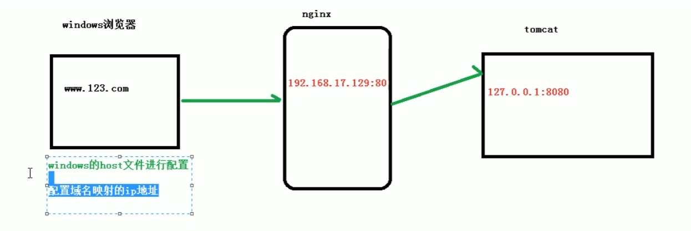
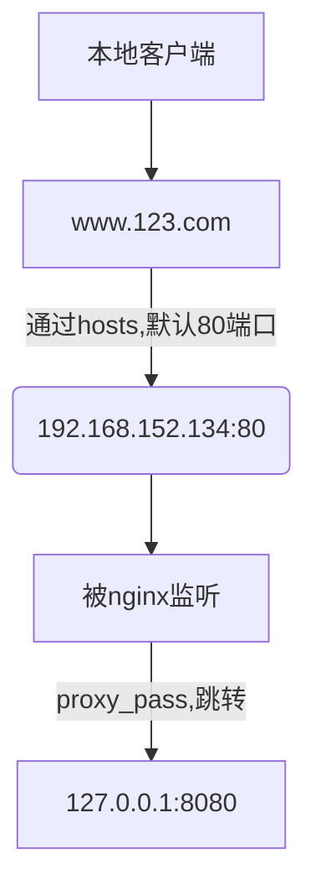
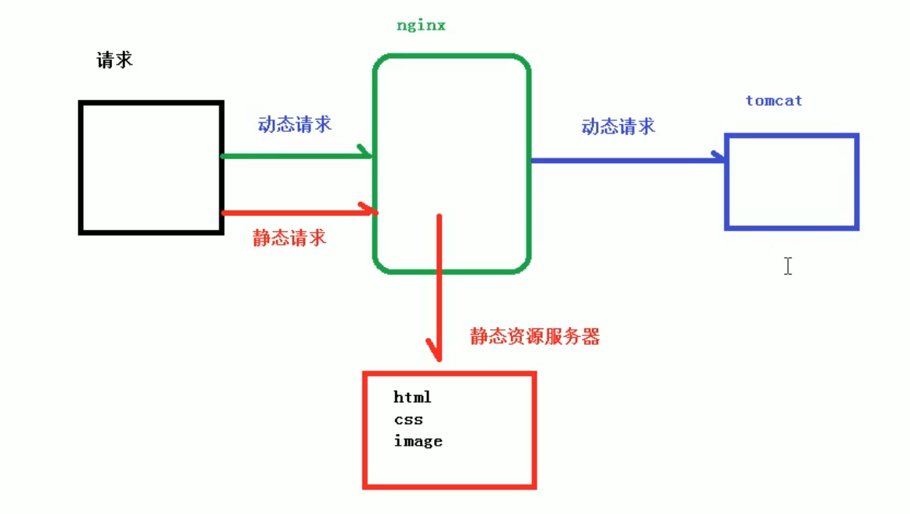
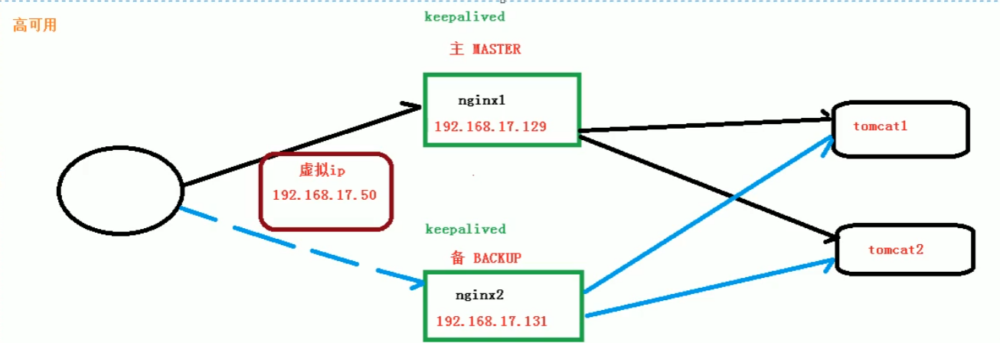

[TOC]


# 1、Nginx简介

## 1.1、什么是Nginx

```
Nginx (engine x) 是一个高性能的HTTP和反向代理web服务器，其特点是占有内存少，并发能力强，nginx专门为了性能优化而开发
```


## 1.2、Nginx作用

- 反向代理
- 负载均衡
- 动静分离
- 高可用


# 2、应用

## 2.1、正向代理

​		正向代理，意思是一个**位于客户端和原始服务器 (origin server)之间的服务器**，为了从原始服务器取得内容，客户端向代理发送一个请求并指定目标 (原始服务器)，然后代理向原始服务器转交请求并将获得的内容返回给客户端。【浏览器需要配置代理服务器】


## 2.2、反向代理

```
	反向代理，其实客户端对代理是无感知的，因为客户端不需要任何配置就可以访问，我们只需要将请求发送到反向代理服务器，由反向代理服务器去选择目标服务器获取数据后，在返回给客户端，此时反向代理服务器和目标服务器对外就是一个服务器，暴露的是代理服务器地址，隐藏了真实服务器IP地址。
```


**正向代理和反向代理：**

- 正向代理是客户端（租客）无法访问目标（房东），通过代理服务器（中介）去访问目标，**是客户端的代理，隐藏客户端ip**
- 反向代理是客户端以（租客）为自己访问到的是目标服务器（房东），实际上是一个代理服务器（房东的亲戚，朋友），**反向代理是目标服务器的代理，隐藏了真实服务器ip**


## 2.3、负载均衡

```
	将相同的应用部署到多台机器上。 解决访问统一入口问题，我们可以在集群前面增加负载均衡设备，实现流量分发。 负载均衡（Load Balance），意思是将负载（工作任务，访问请求）进行平衡、分摊到多个操作单元（服务器，组件）上进行执行。
```


## 2.4、动静分离


```
	为了加快网站的解析速度，可以把动态页面和静态页面由不同的服务器解析，加快解析速度，降低原来单个服务器的压力
```


# 3、Linux安装Nginx


| 命令                                            | 作用                 |
| ----------------------------------------------- | -------------------- |
| 在usr/local/nginx/sbin/目录下  ./nginx          | 启动nginx            |
| firewall-cmd --list-all                         | 查看防火墙开放的端口 |
| sudo firewall-cmd --add-port=80/tcp --permanent | 设置防火墙开放端口   |
| fillwall-cmd --reload                           | 防火墙重启           |


nginx配置文件

```
/usr/local/nginx/conf/nginx.conf

	server {
 36         listen       80; //默认端口
 37         server_name  localhost;
 38         
 39         #charset koi8-r;
 40         
 41         #access_log  logs/host.access.log  main;
 42         
 43         location / {
 44             root   html;
 45             index  index.html index.htm;
 46         }  

```

## 3.1、Nginx命令


【要进入/usr.local.nginx/sbin/】

| 命令              | 作用                          |
| ----------------- | ----------------------------- |
| ./nginx -v        | 查看nginx版本号               |
| ./nginx           | 启动nginx【默认80端口】       |
| ./nginx -s stop   | 关闭nginx                     |
| ./nginx -s reload | 重新加载nginx【修改配置文件】 |


## 3.2、Nginx配置文件

[nginx.conf]:nginx.conf


```
/usr/local/nginx/conf/nginx.conf
```

```conf

#user  nobody;
worker_processes  1; # nginx处理并发数量，数值越大，处理并发越多

#error_log  logs/error.log;
#error_log  logs/error.log  notice;
#error_log  logs/error.log  info;

#pid        logs/nginx.pid;


events { # 主要影响Nginx服务器与用户网络连接
    worker_connections  1024; # 最大连接数
}


http { 
    include       mime.types;
    default_type  application/octet-stream;

    #log_format  main  '$remote_addr - $remote_user [$time_local] "$request" '
    #                  '$status $body_bytes_sent "$http_referer" '
    #                  '"$http_user_agent" "$http_x_forwarded_for"';

    #access_log  logs/access.log  main;

    sendfile        on;
    #tcp_nopush     on;

    #keepalive_timeout  0;
    keepalive_timeout  65;

    #gzip  on;

    server { # 
        listen       80; # 目前监听的端口
        server_name  localhost; # 当前主机

        #charset koi8-r;

        #access_log  logs/host.access.log  main;

        location / { # 
            root   html;
            index  index.html index.htm;
        }

        #error_page  404              /404.html;

        # redirect server error pages to the static page /50x.html
        #
        error_page   500 502 503 504  /50x.html;
        location = /50x.html {
            root   html;
        }

        # proxy the PHP scripts to Apache listening on 127.0.0.1:80
        #
        #location ~ \.php$ {
        #    proxy_pass   http://127.0.0.1;
        #}

        # pass the PHP scripts to FastCGI server listening on 127.0.0.1:9000
        #
        #location ~ \.php$ {
        #    root           html;
        #    fastcgi_pass   127.0.0.1:9000;
        #    fastcgi_index  index.php;
        #    fastcgi_param  SCRIPT_FILENAME  /scripts$fastcgi_script_name;
        #    include        fastcgi_params;
        #}

        # deny access to .htaccess files, if Apache's document root
        # concurs with nginx's one
        #
        #location ~ /\.ht {
        #    deny  all;
        #}
    }


    # another virtual host using mix of IP-, name-, and port-based configuration
    #
    #server {
    #    listen       8000;
    #    listen       somename:8080;
    #    server_name  somename  alias  another.alias;

    #    location / { # 配置请求的路由，以及各种页面的处理情况。
    #        root   html;
    #        index  index.html index.htm;
    #    }
    #}


    # HTTPS server
    #
    #server {
    #    listen       443 ssl;
    #    server_name  localhost;

    #    ssl_certificate      cert.pem;
    #    ssl_certificate_key  cert.key;

    #    ssl_session_cache    shared:SSL:1m;
    #    ssl_session_timeout  5m;

    #    ssl_ciphers  HIGH:!aNULL:!MD5;
    #    ssl_prefer_server_ciphers  on;

    #    location / {
    #        root   html;
    #        index  index.html index.htm;
    #    }
    #}

}

```


# 4、Nginx配置反向代理


```
在本地访问www.123.com，通过反向代理，跳转到linux的tomcat主页
```




## 4.1、配置


编辑hosts:

```
192.168.152.134 www.123.com #域名映射
```


配置nginx.conf

```
【1】
http->server{
	servwe_name 192.168.152.134 #修改
}
【2】
http->server->location{
	#添加
	proxy_pass 127.0.0.1:8080;
}
```





```
http {
	server {
        listen       80;#监听端口
        server_name  localhost;


        location / {
            root   html;
            index  index.html index.htm;
        }
    }
    server {
        listen       9001;#监听端口
        server_name  192.168.152.134;


        location ~ /vod/ { # 匹配路径规则(包含vod)
        	proxy_pass http:xxxx:xx; #跳转目标
            root   html;
            index  index.html index.htm;
        }
    }

}

```


# 5、Nginx配置负载均衡

```
负载均衡（Load Balance），意思是将负载（工作任务，访问请求）进行平衡、分摊到多个操作单元（服务器，组件）上进行执行。
```


## 5.1、配置

```
http->
	upstream myserver{ #自行添加upstream name
		#加入服务器列表
		server 192.168.152.134:8080;
		server 192.168.152.134:8081;
		
	}
	
	server {
		listen 80; # 监听端口
		sever_name 192.168.152.134;
		
		location / {
			proxy_pass http://myserver;
			root   html;
            index  index.html index.htm;
		}
 	}
```


## 5.2、Nginx负载均衡策略

### 5.2.1、轮询（默认）

【**平均**】

```
每个请求按照时间逐一分配到不同的后端服务器，如果后端服务器down掉，九自动剔除。
```

### 5.2.2、weight

```
weight代表权重，默认为1，权重越大，分配的越多
```

```
upstream myserver{ #自行添加upstream name
		#加入服务器列表
		server 192.168.152.134:8080 weight=5;
		server 192.168.152.134:8081 weight=10;
		
	}
```


### 5.2.3、ip_hash

```
upstream myserver{ #自行添加upstream name
		#加入服务器列表
		ip_hash;
		server 192.168.152.134:8080;
		server 192.168.152.134:8081;
		
	}
```

```
每个请求按访问ip的hash结果分配，这样每个访客固定访问一个后端服务器，可以解决session问题
```


### 5.2.4、fair（第三方）

```
按照后端服务器的响应时间来分配，响应时间短的优先分配
```

```
upstream myserver{ #自行添加upstream name
		#加入服务器列表
		server 192.168.152.134:8080;
		server 192.168.152.134:8081;
		fair;
	}
```


# 6、Nginx配置动静分离

## 6.1、介绍

​		Nginx动静分离简单来说就是把**动态跟静态请求分开**,不能理解成只是单纯的把动态页面和静态页面物理分离。严格意义上说应该是动态请求跟静态请求分开，可以理解成使用Nginx处理静态页面，Tomcat处理动态页面。动静分离从目前实现角度来讲大致分为两种，
​		一种是纯粹把静态文件独立成单独的域名,放在独立的服务器上,也是目前主流推崇的方案;

​		另外一种方法就是动态跟静态文件混合在一起发布，通过nginx来分开。




​	通过location指定不同的后缀名实现不同的请求转发。通过expires参数设置，可以使浏览器缓存过期时间，减少与服务器之前的请求和流量。具体Expires定义:是给一个资源设定一个过期时间,也就是说无需去服务端验证,直接通过浏览器自身确认是否过期即可，所以不会产生额外的流量。此种方法非常适合不经常变动的资源。(如果经常更新的文件，不建议使用 Expires来缓存)，我这里设置3d，表示在这3天之内访问这个URL，发送一个请求，比对服务器该文件最后更新时间没有变化，则不会从服务器抓取，返回状态码304，如果有修改，则直接从服务器重新下载，返回状态码200。


## 6.2、配置

```
nginx.conf
```


```
http{
	server {
        listen       80;
        server_name  192.168.152.134;


        location /www/ { # 动态资源路径
            root   /data/; #root指定哪个路径为http文件服务器的根目录
            index  index.html index.htm;
        }
        location /image/ { # 静态资源路径
        	root /data/; 
        	autoindex on; #列出当前文件夹的内容
        }
}
```


# 7、Nginx配置高可用集群





## 7.1、配置准备

- 两台服务器
- 都安装nginx
- 安装keepalived


## 7.2 Keepalived配置文件

[keepalived.conf]:keepalived.conf


```
配置文件位于 /etc/keepalived/keepalived.conf
```


### 7.3 完成高可用配置（主从配置）

**修改keepalived.conf**

**检测脚本**【usr/local/src】

[nginx_check.sh]:nginx_check.sh.txt

```
#!/bin/bash
A=`ps -C nginx -no-header |wc -1`
if [ $A -eq 0];then
	/usr/local/nginx/sbin/nginx
	sleep 2
	if [ `ps -C nginx --no-header |wc -1` -eq 0];then
		killall keepalived
	fi
fi
```


【配置文件keepalived修改】

```

global_defs { # 全局定义
   notification_email {
     acassen@firewall.loc
     failover@firewall.loc
     sysadmin@firewall.loc
   }
   notification_email_from Alexandre.Cassen@firewall.loc
   smtp_server 192.168.200.1
   smtp_connect_timeout 30
   
   router_id LVS_DEVEL # 访问到主机 ：/etc/host配置
}

vrrp_script chk_http_port { # 检测脚本
	
	script "usr/local/src/nginx_check.sh" #脚本路径
	
	interval 2 # 检测脚本执行间隔
	
	weight 2 # 权重
}

vrrp_instance VI_1 { # 虚拟ip配置
    state MASTER  # 备份服务器将MASTER 改成BACKUP
    interface ens33 # 网卡
    virtual_router_id 51 #主从机的virtual_router_id必须相同
    priority 100 # 优先级，主机较大，从机较小
    advert_int 1 #判断主机是否还活着，默认y
    authentication {
        auth_type PASS
        auth_pass 1111
    }
    virtual_ipaddress { # 虚拟ip地址
        192.168.200.16 # 主从的虚拟地址相同，通过虚拟ip访问
    }
}
```


【启动keepalived和nginx】

```
systemctl start keepalived.sevice
```

```
[usr/local/nginx/sbin]./nginx
```


