[TOC]


# 1、消息队列

## 1.1、MQ的相关概念

### 1.1.1、什么是MQ

```
	MQ(message queue)，从字面意思上看，本质是个队列，FIFO 先入先出，只不过队列中存放的内容是message 而已，还是一种跨进程的通信机制，用于上下游传递消息。在互联网架构中，MQ 是一种非常常见的上下游“逻辑解耦+物理解耦”的消息通信服务。使用了 MQ 之后，消息发送上游只需要依赖 MQ，不用依赖其他服务。
```


### 1.1.2 为什么要使用MQ

【**1**】**流量销峰**

```
	举个例子，如果订单系统最多能处理一万次订单，这个处理能力应付正常时段的下单时绰绰有余，正常时段我们下单一秒后就能返回结果。但是在高峰期，如果有两万次下单操作系统是处理不了的，只能限制订单超过一万后不允许用户下单。使用消息队列做缓冲，我们可以取消这个限制，把一秒内下的订单分散成一段时间来处理，这时有些用户可能在下单十几秒后才能收到下单成功的操作，但是比不能下单的体验要好。
```

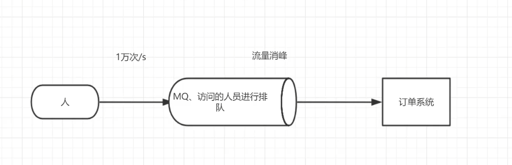


**【2】应用解耦**

```
以电商应用为例，应用中有订单系统、库存系统、物流系统、支付系统。用户创建订单后，如果耦合调用库存系统、物流系统、支付系统，任何一个子系统出了故障，都会造成下单操作异常。当转变成基于消息队列的方式后，系统间调用的问题会减少很多，比如物流系统因为发生故障，需要几分钟来修复。在这几分钟的时间里，物流系统要处理的内存被缓存在消息队列中，用户的下单操作可以正常完成。当物流系统恢复后，继续处理订单信息即可，中单用户感受不到物流系统的故障，提升系统的可用性。
```

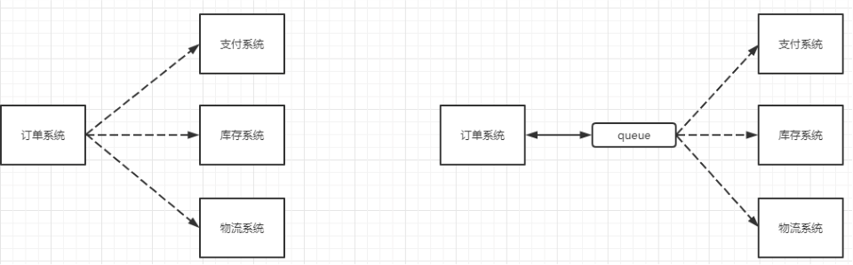


**【3】异步处理**

```
	有些服务间调用是异步的，例如 A 调用 B，B 需要花费很长时间执行，但是 A 需要知道 B 什么时候可以执行完，以前一般有两种方式，A 过一段时间去调用 B 的查询 api 查询。或者 A 提供一个 callback api，B 执行完之后调用 api 通知 A 服务。这两种方式都不是很优雅，使用消息总线，可以很方便解决这个问题，A 调用 B 服务后，只需要监听 B 处理完成的消息，当 B 处理完成后，会发送一条消息给 MQ，MQ 会将此消息转发给 A 服务。这样 A 服务既不用循环调用 B 的查询 api，也不用提供 callback api。同样 B 服务也不用做这些操作。A 服务还能及时的得到异步处理成功的消息。
```

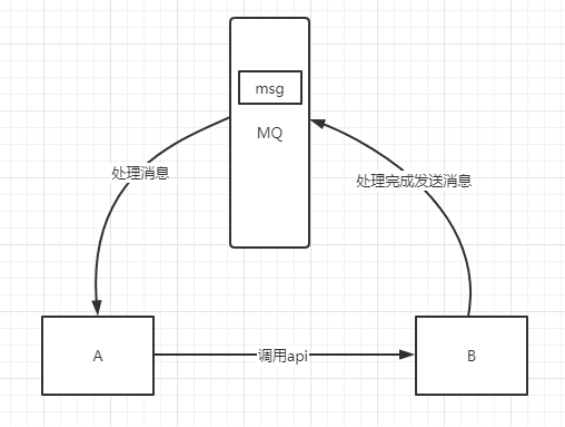


### 1.1.3、MQ的分类

**【1】ActuveMQ**

```
优点：单机吞吐量万级，时效性 ms 级，可用性高，基于主从架构实现高可用性，消息可靠性较低的概率丢失数据

缺点:官方社区现在对 ActiveMQ 5.x 维护越来越少，高吞吐量场景较少使用。
```

**【2】Kafka**

```
大数据的杀手锏，谈到大数据领域内的消息传输，则绕不开 Kafka，这款为**大数据而生**的消息中间件，以其**百万级** **TPS** 的吞吐量名声大噪，迅速成为大数据领域的宠儿，在数据采集、传输、存储的过程中发挥着举足轻重的作用。目前已经被 LinkedIn，Uber, Twitter, Netflix 等大公司所采纳。

 

优点: 性能卓越，单机写入 TPS 约在百万条/秒，最大的优点，就是吞**吐量高**。时效性 ms 级可用性非常高，kafka 是分布式的，一个数据多个副本，少数机器宕机，不会丢失数据，不会导致不可用,消费者采用 Pull 方式获取消息, 消息有序, 通过控制能够保证所有消息被消费且仅被消费一次;有优秀的第三方

Kafka Web 管理界面 Kafka-Manager；在日志领域比较成熟，被多家公司和多个开源项目使用；功能支持：功能较为简单，主要支持简单的 MQ 功能，在大数据领域的实时计算以及**日志采集**被大规模使用
```


**【3】RocketMQ**

```
RocketMQ 出自阿里巴巴的开源产品，用 Java 语言实现，在设计时参考了 Kafka，并做出了自己的一些改进。被阿里巴巴广泛应用在订单，交易，充值，流计算，消息推送，日志流式处理，binglog 分发等场景。

优点:**单机吞吐量十万级**,可用性非常高，分布式架构,**消息可以做到** **0** **丢失****,**MQ 功能较为完善，还是分布式的，扩展性好,**支持** **10** **亿级别的消息堆积**，不会因为堆积导致性能下降,源码是 java 我们可以自己阅读源码，定制自己公司的 MQ

缺点：**支持的客户端语言不多**，目前是 java 及 c++，其中 c++不成熟；社区活跃度一般,没有在 MQ核心中去实现 JMS 等接口,有些系统要迁移需要修改大量代码
```


**【4】RabbitMQ**

```
2007 年发布，是一个在 AMQP(高级消息队列协议)基础上完成的，可复用的企业消息系统，是**当前最****主流的消息中间件之一**。

 

优点:由于 erlang 语言的**高并发特性**，性能较好；**吞吐量到万级**，MQ 功能比较完备,健壮、稳定、易用、跨平台、**支持多种语言** 如：Python、Ruby、.NET、Java、JMS、C、PHP、ActionScript、XMPP、STOMP等，支持 AJAX 文档齐全；开源提供的管理界面非常棒，用起来很好用,**社区活跃度高**；更新频率相当高
```


## 1.2、RabbitMQ

### 1.2.1、RabbitMQ的概念

```
RabbitMQ 是一个消息中间件：它接受并转发消息。你可以把它当做一个快递站点，当你要发送一个包裹时，你把你的包裹放到快递站，快递员最终会把你的快递送到收件人那里，按照这种逻辑 RabbitMQ 是一个快递站，一个快递员帮你传递快件。RabbitMQ 与快递站的主要区别在于，它不处理快件而是接收，存储和转发消息数据。
```


### 1.2.3、四大核心概念

- **生产者**：产生数据发送消息的程序是生产者
- **交换机**：交换机是RabbitMQ非常重要的一个部件，一方面它接收来自生产者的消息，另一方面它将消息推送到队列当中。交换机必须确切知道如何处理它接收到的消息，是将这些消息推送到特定队列还是推送到多个队列，亦或者把消息丢弃，这个要由交换机的类型决定
- **队列**：队列是 RabbitMQ 内部使用的一种数据结构，尽管消息流经 RabbitMQ 和应用程序，但它们只能存储在队列中。队列仅受主机的内存和磁盘限制的约束，本质上是一个大的消息缓冲区。许多生产者可以将消息发送到一个队列，许多消费者可以尝试从一个队列接收数据。这就是我们使用队列的方式
- **消费者**：消费与接收具有相似的含义。消费者大多时候是一个等待接收消息的程序。请注意生产者，消费者和消息中间件很多时候并不在同一机器上。同一个应用程序既可以是生产者又是可以是消费者。


### 1.2.3、RabbitMQ核心部分

| 序号 | 核心模式           | 说明          |
| ---- | ------------------ | ------------- |
| 1    | Hello World        | 简单模式      |
| 2    | Work queues        | 工作模式      |
| 3    | Publish/Subscribe  | 发布/订阅模式 |
| 4    | Routing            | 路由模式      |
| 5    | Topics             | 主题模式      |
| 6    | Publisher Confirms | 发布确认模式  |


### 1.2.4、RabbitMQ工作原理

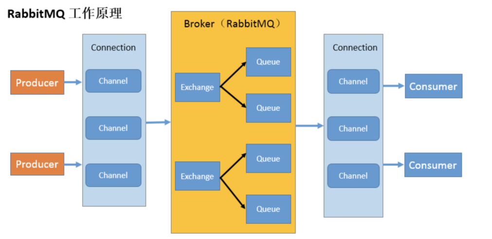

- **Broker**：接收和分发消息的应用，RabbitMQ Server 就是 Message Broker

- **Virtual host**：出于多租户和安全因素设计的，把 AMQP 的基本组件划分到一个虚拟的分组中，类似于网络中的 namespace 概念。当多个不同的用户使用同一个 RabbitMQ server 提供的服务时，可以划分出多个 vhost，每个用户在自己的 vhost 创建 exchange／queue 等

- **Connection**：publisher／consumer 和 broker 之间的 TCP 连接

- **Channel**：信道，如果每一次访问 RabbitMQ 都建立一个 Connection，在消息量大的时候建立 TCP Connection 的开销将是巨大的，效率也较低。Channel 是在 connection 内部建立的逻辑连接，如果应用程序支持多线程，通常每个 thread 创建单独的 channel 进行通讯，AMQP method 包含了 channel id 帮助客户端和 message broker 识别 channel，所以 channel 之间是完全隔离的。**Channel** **作为轻量级的****Connection** **极大减少了操作系统建立** **TCP connection** **的开销**

- **Exchange**：message 到达 broker 的第一站，根据分发规则，匹配查询表中的 routing key，分发消息到 queue 中去。常用的类型有：direct (point-to-point), topic (publish-subscribe) and fanout (multicast)

- **Queue**：消息最终被送到这里等待 consumer 取走

- **Binding**：exchange 和 queue 之间的虚拟连接，binding 中可以包含 routing key，Binding 信息被保存到 exchange 中的查询表中，用于 message 的分发依据


### 1.2.5、RabbitMQ之linux操作

| 命令                                                        | 作用             |
| ----------------------------------------------------------- | ---------------- |
| systemctl start rabbitmq-server.service                     | 启动rabbitmq     |
| systemctl stop rabbitmq-server.service                      | 关闭rabbitmq     |
| systemctl status rabbitmq-server                            | 查看rabbitmq状态 |
| systemctl stop firewalld                                    | 关闭防火墙       |
| systemctl strat firewalld                                   | 打开防火墙       |
| systemctl status firewalld                                  | 查看防火墙状态   |
|                                                             |                  |
| rabbitmqctl list_users                                      | 查看当前角色     |
| rabbitmqctl add_user **name** **password**                  | 创建账号         |
| rabbitmqctl delete_user **user**                            | 删除用户         |
| rabbitmqctl set_user_tags **user** administrator            | 设置角色为管理员 |
| rabbitmqctl set_permissions -p "/" **admin** ".*" ".*" ".*" | 设置用户权限     |
| rabbitmqctl stop_app                                        | 关闭应用         |
| rabbitmqctl reset                                           | 清除             |
| rabbitmqctl start_app                                       | 重新启动         |


# 2、Hello World（简单工作模式）


```
生产者->MQ
MQ->消费者
```


## 2.1、依赖

```
		<!--rabbitmq 依赖客户端-->
        <dependency>
            <groupId>com.rabbitmq</groupId>
            <artifactId>amqp-client</artifactId>
        </dependency>
        <!--操作文件流的一个依赖-->
        <dependency>
            <groupId>commons-io</groupId>
            <artifactId>commons-io</artifactId>
            <version>2.11.0</version>
        </dependency>
```


## 2.2 消息生产者

```java
public class Producer {
    //队列名称
    private static final String QUEUE_NAME = "one";

    //发消息
    public static void main(String[] args) throws IOException, TimeoutException {
        //创建连接工厂
        ConnectionFactory connectionFactory = new ConnectionFactory();
        connectionFactory.setHost("192.168.152.134");
        connectionFactory.setUsername("dhf");
        connectionFactory.setPassword("dhf200827");

        //创建连接
        Connection connection = connectionFactory.newConnection();
        //一个连接有多个信道，信道是发消息的
        //获取信道
        Channel channel = connection.createChannel();
        //信道连接交换机，交换机有多个队列，
        //简单连接，直接连接队列
        //创建队列
        /**
         * 创建一个队列
         * 1.队列名称
         * 2.队列里面的消息是否进行持久化（磁盘），默认内存
         * 3.该队列是否只提供一个消费者进行消费
         * 4.是否自动删除
         * 5.其他
         */
        channel.queueDeclare(QUEUE_NAME, false, false, false, null);
        //发送消息
        String message = "hello";
        /**
         * 发送消息
         * 1.发送到哪个交换机
         * 2.路由配置，本次是队列名称
         * 3.其他参数
         * 4.发送消息的消息体，byte类型
         */
        channel.basicPublish("",QUEUE_NAME,null,message.getBytes(StandardCharsets.UTF_8));

        System.out.println("消息发送完毕");
        channel.close();
        connection.close();
    }
}
```

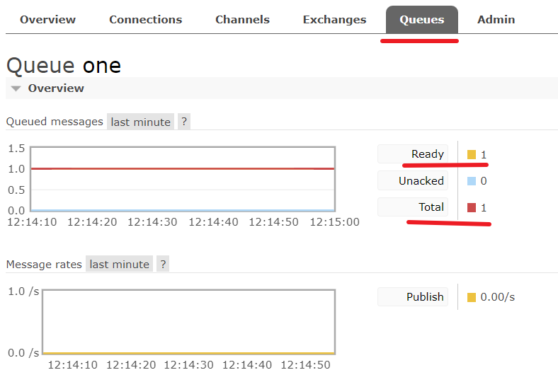


## 2.3、消费者代码


```java
public class Consumer {
    //队列名称
    private static final String QUEUE_NAME = "one";

    //接收消息
    public static void main(String[] args) throws IOException, TimeoutException {
        //创建工厂
        ConnectionFactory connectionFactory = new ConnectionFactory();
        connectionFactory.setHost("192.168.152.134");
        connectionFactory.setUsername("dhf");
        connectionFactory.setPassword("dhf200827");
        //获取连接
        Connection connection = connectionFactory.newConnection();
        //获取信道
        Channel channel = connection.createChannel();
        /**
         * 接收消息
         * 1.消费哪个队列
         * 2.消费成功后是个自动应答
         * 3.消费者消费时的回调 lambda表达式
         * 4.消费者取消消费的回调
         */
        channel.basicConsume(QUEUE_NAME, true,
                (consumerTag,message)->{//未成功消费的回调
                    byte[] body = message.getBody();//消息体
                    System.out.println(new String(body));//
                }, (message)->{//取消消费的回调
                    System.out.println("消费中断");
                });
        channel.close();
        connection.close();
    }
}

```


# 3、Work Queues（工作队列模式）

```
	工作队列(又称任务队列)的主要思想是避免立即执行资源密集型任务，而不得不等待它完成。相反我们安排任务在之后执行。我们把任务封装为消息并将其发送到队列。在后台运行的工作进程将弹出任务并最终执行作业。当有多个工作线程时，这些工作线程将一起处理这些任务。
```

## 3.1、轮训分发模式

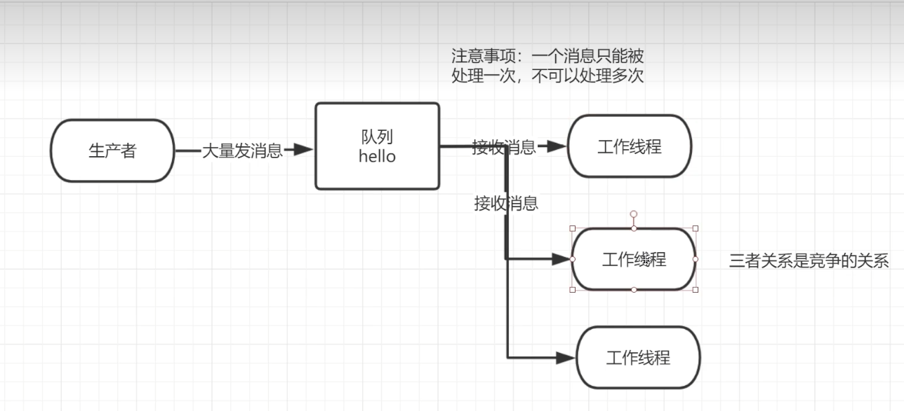


### 3.1.1、抽取工具类

```java
public class ChannelUtils {
    public static Channel getChannel(){
        ConnectionFactory connectionFactory = new ConnectionFactory();
        connectionFactory.setUsername("dhf");
        connectionFactory.setHost("192.168.152.134");
        connectionFactory.setPassword("dhf200827");
        try {
            Connection connection = connectionFactory.newConnection();
            Channel channel = connection.createChannel();
            return channel;
        }catch (Exception e){
            throw new RuntimeException(e);
        }
    }
}
```


### 3.1.2、开启工作线程

```java
public class Work01 implements Runnable{
    //队列名称
    private static final String QUEUE_NAME = "one";

    //接收消息
    public static void main(String[] args) throws IOException, TimeoutException {
        //开启多个线程
        Thread thread = new Thread(new Work01());
        Thread thread1 = new Thread(new Work01());
        thread.start();
        thread1.start();
    }

    @Override
    public void run() {
        try {
            test();
        } catch (IOException | TimeoutException e) {
            e.printStackTrace();
        }
    }
    //接收消息
    public void test() throws IOException, TimeoutException {
        String name = Thread.currentThread().getName();
        System.out.println(name+"->等待接收消息");
        //获取信道
        Channel channel = ChannelUtils.getChannel();
        //接收消息
        channel.basicConsume(QUEUE_NAME,true,(tag,message)->{
            String ms = new String(message.getBody());

            System.out.println(name+"->"+ms);
        },(message)->{
            System.out.println("取消接收消息");
        });
    }
}
```


### 3.1.3、发送大量消息


```java
public class Producer {
    //队列名称
    private static final String QUEUE_NAME = "one";

    //发消息
    public static void main(String[] args) throws IOException, TimeoutException {
        //一个连接有多个信道，信道是发消息的
        //获取信道
        Channel channel = ChannelUtils.getChannel();
        /**
         * 创建一个队列
         * 1.队列名称
         * 2.队列里面的消息是否进行持久化（磁盘），默认内存
         * 3.该队列是否只提供一个消费者进行消费
         * 4.是否自动删除
         * 5.其他
         */
        channel.queueDeclare(QUEUE_NAME, false, false, false, null);
        //发送消息
        Scanner scanner = new Scanner(System.in);
        while (scanner.hasNext()){
            String message = scanner.next();
            channel.basicPublish("",QUEUE_NAME,null,message.getBytes());
            System.out.println("消息发送完毕:->"+message);
        }

    }
}
```


## 3.2、消息应答


### 3.2.1、概念

​	消费者完成一个任务可能需要一段时间，如果其中一个消费者处理一个长的任务并仅只完成了部分突然它挂掉了，会发生什么情况。RabbitMQ 一旦向消费者传递了一条消息，便立即将该消息标记为删除。在这种情况下，突然有个消费者挂掉了，我们将丢失正在处理的消息。以及后续发送给该消费这的消息，因为它无法接收到。

为了保证消息在发送过程中不丢失，rabbitmq 引入消息应答机制，消息应答就是:**消费者在接收到消息并且处理该消息之后，告诉 rabbitmq 它已经处理了，rabbitmq 可以把该消息删除了**


### 3.2.2、自动应答

消息发送后立即被认为已经传送成功，这种模式需要在**高吞吐量和数据传输安全性方面做权衡**,因为这种模式如果消息在接收到之前，消费者那边出现连接或者 channel 关闭，那么消息就丢失了,当然另一方面这种模式消费者那边可以传递过载的消息，**没有对传递的消息数量进行限制**，当然这样有可能使得消费者这边由于接收太多还来不及处理的消息，导致这些消息的积压，最终使得内存耗尽，最终这些消费者线程被操作系统杀死，**所以这种模式仅适用在消费者可以高效并以某种速率能够处理这些消息的情况下使用**。


### 3.2.3、消息应答方法

- Channel.basicAck(用于肯定确认)
  - RabbitMQ 已知道该消息并且成功的处理消息，可以将其丢弃了

- Channel.basicNack(用于否定确认)
- Channel.basicReject(用于否定确认)


### 3.2.4、 Multiple解释

​	**手动应答**的好处是可以批量应答并且减少网络拥堵

```
void basicAck(long deliveryTag, boolean multiple)


multiple 的 true 和 false 代表不同意思
true 代表批量应答 channel 上未应答的消息

比如说 channel 上有传送 tag 的消息 5,6,7,8 当前 tag 是 8 那么此时5-8 的这些还未应答的消息都会被确认收到消息应答
false 同上面相比

只会应答 tag=8 的消息 5,6,7 这三个消息依然不会被确认收到消息应答

```

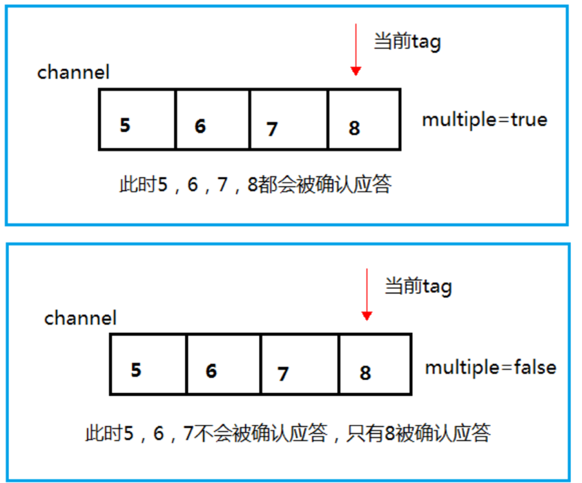


### 3.2.5、消息自动重新入队

​		如果消费者由于某些原因失去连接(其通道已关闭，连接已关闭或 TCP 连接丢失)，导致消息未发送 ACK 确认，RabbitMQ 将了解到消息未完全处理，并将对其重新排队。如果此时其他消费者可以处理，它将很快将其重新分发给另一个消费者。这样，即使某个消费者偶尔死亡，也可以确保不会丢失任何消息。


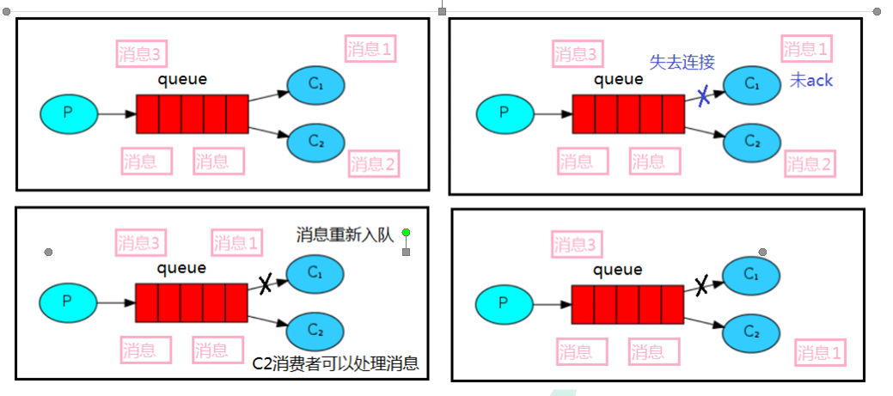


### 3.2.6、消息手动应答代码

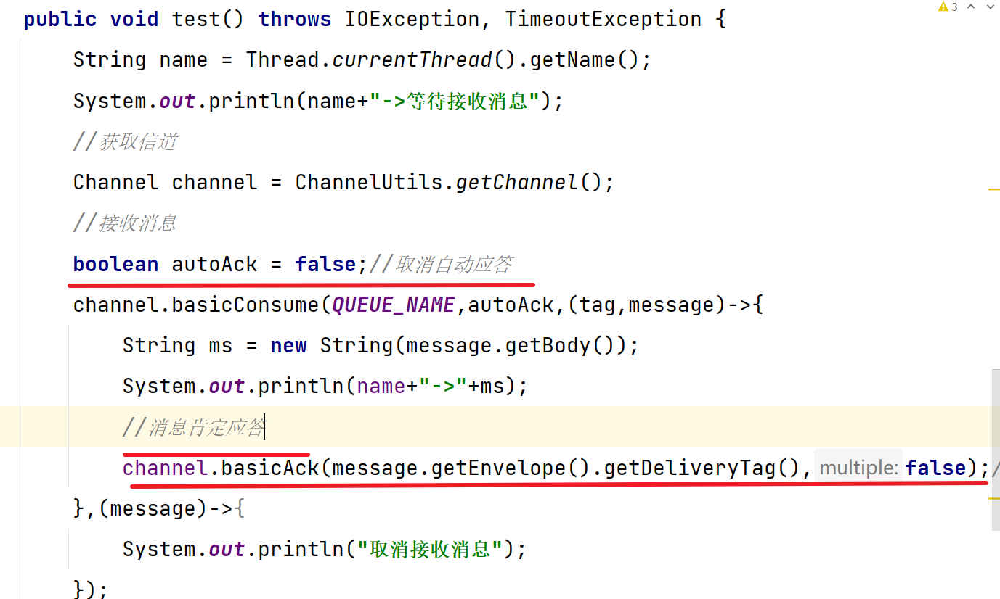


## 3.3、RabbitMQ持久化

### 3.3.1、概念

​		刚刚我们已经看到了如何处理任务不丢失的情况，但是如何保障当 RabbitMQ 服务停掉以后消息生产者发送过来的消息不丢失。默认情况下 RabbitMQ 退出或由于某种原因崩溃时，它忽视队列和消息，除非告知它不要这样做。确保消息不会丢失需要做两件事：**我们需要将队列和消息都标记为持久化**。


### 3.3.2、队列持久化

```java
/**
         * 创建一个队列
         * 1.队列名称
         * 2.队列里面的消息是否进行持久化（磁盘），默认内存
         * 3.该队列是否只提供一个消费者进行消费
         * 4.是否自动删除
         * 5.其他
         */
        boolean durable = true;//队列持久化
        channel.queueDeclare(QUEUE_NAME, durable, false, false, null);
```

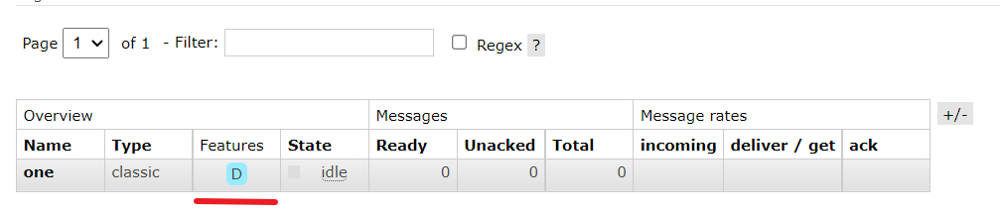


### 3.3.3、消息持久化

```java
/**
         * 发送消息
         * 1.发送到哪个交换机
         * 2.路由配置，本次是队列名称
         * 3.其他参数
         * 4.发送消息的消息体，byte类型
         */
        //MessageProperties.PERSISTENT_TEXT_PLAIN消息持久化
        channel.basicPublish("",QUEUE_NAME, 
                MessageProperties.PERSISTENT_TEXT_PLAIN,
                message.getBytes(StandardCharsets.UTF_8));
```


### 3.3.4、不公平分发

​		在最开始的时候我们学习到 RabbitMQ 分发消息采用的轮训分发，但是在某种场景下这种策略并不是很好，比方说有两个消费者在处理任务，其中有个消费者 1 处理任务的速度非常快，而另外一个消费者 2处理速度却很慢，这个时候我们还是采用轮训分发的化就会到这处理速度快的这个消费者很大一部分时间处于空闲状态，而处理慢的那个消费者一直在干活，这种分配方式在这种情况下其实就不太好，但是RabbitMQ 并不知道这种情况它依然很公平的进行分发

```java
//为了避免这种情况，我们可以设置参数 channel.basicQos(1);
//消费者
channel.basicQos(1);
```


### 3.3.5 预取值

​		本身消息的发送就是异步发送的，所以在任何时候，channel 上肯定不止只有一个消息，另外来自消费者的手动确认本质上也是异步的。因此这里就存在一个未确认的消息缓冲区，因此希望开发人员能**限制此缓冲区的大小，以避免缓冲区里面无限制的未确认消息问题**。这个时候就可以通过使用 basic.qos 方法设置“预取计数”值来完成的。**该值定义通道上允许的未确认消息的最大数量**。一旦数量达到配置的数量，RabbitMQ 将停止在通道上传递更多消息，除非至少有一个未处理的消息被确认，例如，假设在通道上有未确认的消息 5、6、7，8，并且通道的预取计数设置为 4，此时 RabbitMQ 将不会在该通道上再传递任何消息，除非至少有一个未应答的消息被 ack。比方说 tag=6 这个消息刚刚被确认 ACK，RabbitMQ 将会感知这个情况到并再发送一条消息。消息应答和 QoS 预取值对用户吞吐量有重大影响。通常，增加预取将提高向消费者传递消息的速度。**虽然自动应答传输消息速率是最佳的，但是，在这种情况下已传递但尚未处理的消息的数量也会增加，从而增加了消费者的** **RAM** **消耗**(随机存取存储器)应该小心使用具有无限预处理的自动确认模式或手动确认模式，消费者消费了大量的消息如果没有确认的话，会导致消费者连接节点的内存消耗变大，所以找到合适的预取值是一个反复试验的过程，不同的负载该值取值也不同 100 到 300 范围内的值通常可提供最佳的吞吐量，并且不会给消费者带来太大的风险。预取值为 1 是最保守的。当然这将使吞吐量变得很低，特别是消费者连接延迟很严重的情况下，特别是在消费者连接等待时间较长的环境中。对于大多数应用来说，稍微高一点的值将是最佳的。

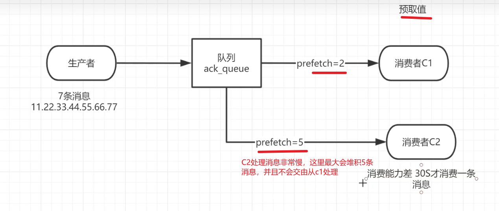

# 4、发布确认

## 4.1、发布确认原理

​		生产者将信道设置成 confirm 模式，一旦信道进入 confirm 模式，**所有在该信道上面发布的消息都将会被指派一个唯一的 ID**(从 1 开始)，一旦消息被投递到所有匹配的队列之后，broker就会发送一个确认给生产者(包含消息的唯一 ID)，这就使得生产者知道消息已经正确到达目的队列了，如果消息和队列是可持久化的，那么确认消息会在将消息写入磁盘之后发出，broker 回传给生产者的确认消息中 delivery-tag 域包含了确认消息的序列号，此外 broker 也可以设置basic.ack 的 multiple 域，表示到这个序列号之前的所有消息都已经得到了处理。

confirm 模式最大的好处在于他是异步的，一旦发布一条消息，生产者应用程序就可以在等信道返回确认的同时继续发送下一条消息，当消息最终得到确认之后，生产者应用便可以通过回调方法来处理该确认消息，如果 RabbitMQ 因为自身内部错误导致消息丢失，就会发送一条 nack 消息，生产者应用程序同样可以在回调方法中处理该 nack 消息。

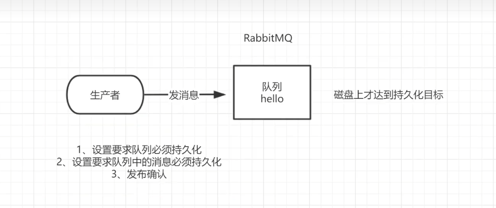


## 4.2、发布确认策略

### 4.2.1、发布确认开启

```java
//生产者
channel.confirmSelect();//开启发布确认模式
```


### 4.2.2、单个发布确认

​		

​	这是一种简单的确认方式，它是一种**同步确认发布**的方式，也就是发布一个消息之后只有它被确认发布，后续的消息才能继续发布,
waitForConfirmsOrDie(long)这个方法只有在消息被确认的时候才返回，如果在指定时间范围内这个消息没有被确认那么它将抛出异常

​	这种确认方式有一个最大的缺点就是:**发布速度特别的慢，**因为如果没有确认发布的消息就会阻塞所有后续消息的发布，这种方式最多提供每秒不超过数百条发布消息的吞吐量。当然对于某些应用程序来说这可能已经足够了。

```java
//单个确认模式
    @Test
    public void test1() throws IOException, InterruptedException {
        //获取信道
        Channel channel = ChannelUtils.getChannel();
        //设置确认模式
        channel.confirmSelect();
        //队列名称
        String queueName = UUID.randomUUID().toString();
        //创建队列(持久化)
        channel.queueDeclare(queueName, true, false, false, null);
        long start = System.currentTimeMillis();
        //发送消息
        for (int i = 0;i < MESSAGE_COUNT;i++) {
            String message = "hello world=>" + i;
            //交换机为null，表示不使用交换机
            //消息持久化
            channel.basicPublish("", queueName, MessageProperties.PERSISTENT_TEXT_PLAIN, message.getBytes());
            //单个消息就马上确认
            boolean b = channel.waitForConfirms();
            if (b){
                System.out.println("消息发送成功");
            }
        }
        long end = System.currentTimeMillis();
        System.out.println("发送消息耗时：" + (end - start));
    }
```


### 4.2.3、批量确认模式

​		上面那种方式非常慢，与单个等待确认消息相比，先发布一批消息然后一起确认可以极大地提高吞吐量，当然这种方式的缺点就是:**当发生故障导致发布出现问题时，不知道是哪个消息出现问题**了，我们必须将整个批处理保存在内存中，以记录重要的信息而后重新发布消息。当然这种方案仍然是同步的，也一样阻塞消息的发布。

```java
@Test
    public void test2() throws IOException, InterruptedException {
        //获取信道
        Channel channel = ChannelUtils.getChannel();
        //设置确认模式
        channel.confirmSelect();
        //队列名称
        String queueName = UUID.randomUUID().toString();
        //创建队列(持久化)
        channel.queueDeclare(queueName, true, false, false, null);
        long start = System.currentTimeMillis();
        //发送消息
        for (int i = 1;i <= MESSAGE_COUNT;i++) {
            String message = "hello world=>" + i;
            //交换机为null，表示不使用交换机
            //消息持久化
            channel.basicPublish("", queueName, MessageProperties.PERSISTENT_TEXT_PLAIN, message.getBytes());
            //批量确认
            if (i % 100 == 0){ //一百条确认一次
                boolean b = channel.waitForConfirms();
                if (b){
                    System.out.println("消息发送成功");
                }
            }
        }
        long end = System.currentTimeMillis();
        System.out.println("发送消息耗时：" + (end - start));
    }
```


### 4.2.4、异步批量确认

​		异步确认虽然编程逻辑比上两个要复杂，但是性价比最高，无论是可靠性还是效率都没得说，他是利用回调函数来达到消息可靠性传递的，这个中间件也是通过函数回调来保证是否投递成功，下面就让我们来详细讲解异步确认是怎么实现的。

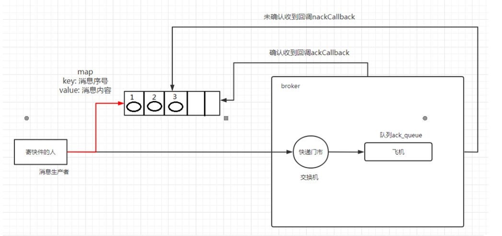


```java
@Test
    public void test3() throws IOException, InterruptedException {
        //获取信道
        Channel channel = ChannelUtils.getChannel();
        //设置确认模式
        channel.confirmSelect();
        //队列名称
        String queueName = UUID.randomUUID().toString();
        //创建队列(持久化)
        channel.queueDeclare(queueName, true, false, false, null);
        long start = System.currentTimeMillis();
        //准备消息的监听器，用于监听消息确认
        //消息成功回调函数
        ConfirmCallback ackCallback = (long deliveryTag, boolean multiple)->{

        };
        //消息失败回调函数
        /**
         * 参数：
         * 1、消息的deliveryTag：消息的标识符
         * 2、multiple：是否是批量确认
         */
        ConfirmCallback nackCallback = (long deliveryTag, boolean multiple)->{
            //消息失败，重新发送
            try {
                channel.basicReject(deliveryTag, false);
            } catch (IOException e) {
                e.printStackTrace();
            }
        };
        /**
         * 异步确认模式，消息确认时，会调用相应的回调函数
         * @param ackCallback 消息成功回调函数
         * @param nackCallback 消息失败回调函数
         */
        channel.addConfirmListener(ackCallback,nackCallback);

        //发送消息
        for (int i = 1;i <= MESSAGE_COUNT;i++) {
            String message = "hello world=>" + i;
            //交换机为null，表示不使用交换机
            //消息持久化
            channel.basicPublish("", queueName, MessageProperties.PERSISTENT_TEXT_PLAIN, message.getBytes());
        }
        long end = System.currentTimeMillis();
        System.out.println("发送消息耗时：" + (end - start));
    }
```


### 4.2.5 、如何处理异步未确认消息

- 将发送的消息使用线程安全的map记录下来
- 收到成功接收就删除序号
- 失败就做自己需要的操作

```java
//异步确认
    @Test
    public void test3() throws IOException, InterruptedException {
        //获取信道
        Channel channel = ChannelUtils.getChannel();
        //设置确认模式
        channel.confirmSelect();
        //队列名称
        String queueName = UUID.randomUUID().toString();
        //创建队列(持久化)
        channel.queueDeclare(queueName, true, false, false, null);
        long start = System.currentTimeMillis();
        /**
         * 一个线程安全有序的哈希表，用于高并发的情况
         * 1、将序号与消息进行关联
         * 2、当消息确认时，将序号从哈希表中移除
         * 3、支持高并发（多线程）
         */
        ConcurrentSkipListMap<Long,Object> listMap = new ConcurrentSkipListMap<>();

        //准备消息的监听器，用于监听消息确认
        //消息成功回调函数
        ConfirmCallback ackCallback = (long deliveryTag, boolean multiple)->{
            System.out.println("接收到消息确认，message：" + listMap.get(deliveryTag));

            //【2】确认接收，删除
            listMap.remove(deliveryTag);
        };
        //消息失败回调函数
        /**
         * 参数：
         * 1、消息的deliveryTag：消息的标识符
         * 2、multiple：是否是批量确认
         */
        ConfirmCallback nackCallback = (long deliveryTag, boolean multiple)->{
            System.err.println("未接收到消息确认，deliveryTag：" + deliveryTag );
            //消息失败，重新发送
            Object o = listMap.get(deliveryTag);
            System.out.println("重新发送消息：" + o);
            try {
                channel.basicReject(deliveryTag, false);
            } catch (IOException e) {
                e.printStackTrace();
            }
        };
        /**
         * 异步确认模式，消息确认时，会调用相应的回调函数
         * @param ackCallback 消息成功回调函数
         * @param nackCallback 消息失败回调函数
         */
        channel.addConfirmListener(ackCallback,nackCallback);

        //发送消息
        for (long i = 1L; i <= MESSAGE_COUNT; i++) {
            String message = "hello world=>" + i;
            //交换机为null，表示不使用交换机
            //消息持久化
            channel.basicPublish("", queueName, MessageProperties.PERSISTENT_TEXT_PLAIN, message.getBytes());
            //【1】记录要发送的消息
            listMap.put(i, message);
        }
        long end = System.currentTimeMillis();
        System.out.println("发送消息耗时：" + (end - start));
    }
```


### 4.2.6、3 种发布确认速度对比

- 单独发布消息

​		同步等待确认，简单，但吞吐量非常有限。批量发布消息

- 批量同步等待确认，

  ​	简单，合理的吞吐量，一旦出现问题但很难推断出是那条消息出现了问题。

- 异步处理【*****************】：

  ​     最佳性能和资源使用，在出现错误的情况下可以很好地控制，但是实现起来稍微难些


# 5、交换机


​		在上一节中，我们创建了一个工作队列。我们假设的是工作队列背后，每个任务都恰好交付给一个消费者(工作进程)。在这一部分中，我们将做一些完全不同的事情-我们将消息传达给多个消费者。这种模式称为 ”发布/订阅”.

```
一个队列中的消息，不能被消费两次，就算多个线程，他们也是平均分或者非公平分配
```

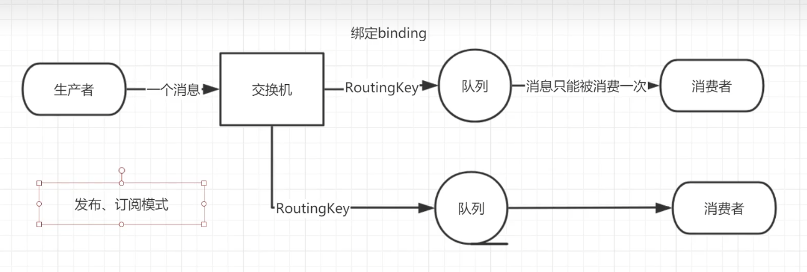


# 5.1、Exchanges

### 5.1.1、Exchanges概念

​		RabbitMQ 消息传递模型的核心思想是: **生产者生产的消息从不会直接发送到队列**。实际上，通常生产者甚至都不知道这些消息传递传递到了哪些队列中。

​		相反，**生产者只能将消息发送到交换机(exchange)**，交换机工作的内容非常简单，一方面它接收来自生产者的消息，另一方面将它们推入队列。交换机必须确切知道如何处理收到的消息。是应该把这些消息放到特定队列还是说把他们到许多队列中还是说应该丢弃它们。这就的由交换机的类型来决定。


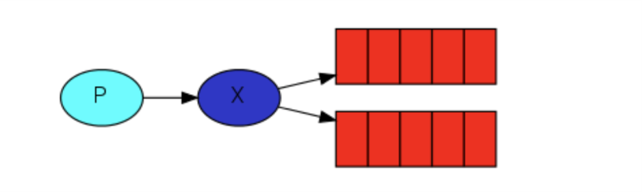

### 5.1.2、Exchanges类型

- direct直接类型
- topic主题类型
- headers标题类型
- fanout扇出类型


### 5.1.3、无名exchanges

```java
		/**
         * 发送消息
         * 1.发送到哪个交换机
         * 2.路由配置，本次是队列名称
         * 3.其他参数
         * 4.发送消息的消息体，byte类型
         */
        //MessageProperties.PERSISTENT_TEXT_PLAIN消息持久化
        channel.basicPublish("",QUEUE_NAME,
                MessageProperties.PERSISTENT_TEXT_PLAIN,
                message.getBytes(StandardCharsets.UTF_8));
```

```
第一个参数是交换机的名称。空字符串表示默认或无名称交换机：消息能路由发送到队列中其实是由 routingKey(bindingkey)绑定 key 指定的，如果它存在的话
```


## 5.2、临时队列

​		之前的章节我们使用的是具有特定名称的队列。队列的名称我们来说至关重要-我们需要指定我们的消费者去消费哪个队列的消息。

​		每当我们连接到 Rabbit 时，我们都需要一个全新的空队列，为此我们可以创建一个具有**随机名称的队列**，或者能让服务器为我们选择一个随机队列名称那就更好了。其次**一旦我们断开了消费者的连接，队列将被自动删除。**


创建临时队列的方式如下:

```
String queueName = channel.queueDeclare().getQueue();
```


## 5.3、绑定binding

```
binding 其实是 exchange 和 queue 之间的桥梁，它告诉我们 exchange 和那个队列进行了绑定关系。比如说下面这张图告诉我们的就是 X 与 Q1 和 Q2 进行了绑定
```


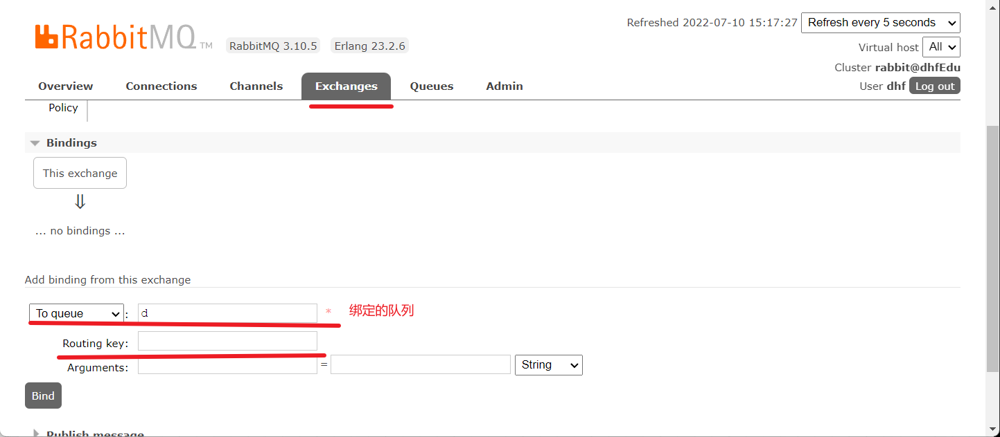


## 5.4、Fanout交换机（发布订阅模式）

### 5.4.1、Fanout介绍

```
Fanout 这种类型非常简单。正如从名称中猜到的那样，它是将接收到的所有消息广播到它知道的所有队列中。系统中默认有些 exchange 类型
```

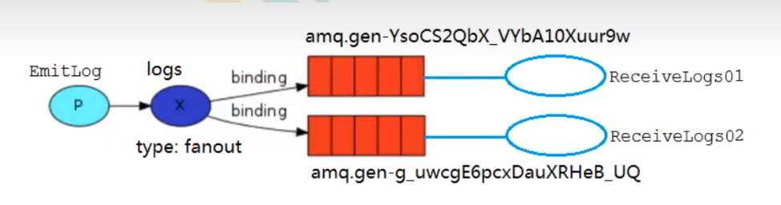


### 5.4.2、代码

```java
/**
 * @author 党
 * @version 1.0
 * 2022/7/10   15:22
 * 接收方 01
 */
public class Customer01 {
    private static final String EXCHANGE_NAME = "logs";
    public static void main(String[] args) throws IOException {
        //获取信道
        Channel channel = ChannelUtils.getChannel();
        /**
         * 声明交换机
         * @param exchange the name of the exchange
         * @param type the exchange type
         */
        channel.exchangeDeclare(EXCHANGE_NAME, BuiltinExchangeType.FANOUT);
        //声明队列，临时队列
        String queue = channel.queueDeclare().getQueue();
        /**
         * 绑定交换机和信道
         * @param queue the name of the queue
         * @param exchange the name of the exchange
         * @param routingKey the routing key to use for the binding
         */
        channel.queueBind(queue,EXCHANGE_NAME,"");
        System.out.println("等待接收消息");
        //接收消息
        channel.basicConsume(queue,true,
                (consumerTag, message) ->{
                    byte[] body = message.getBody();
                    System.out.println(consumerTag+"=>"+new String(body));
        },(consumerTag, message)->{
                    System.err.println(consumerTag+"=>"+message);
        });
    }
}
```


```java
/**
 * @author 党
 * @version 1.0
 * 2022/7/10   15:34
 * 生产者
 */
public class Producer {
    private static final String EXCHANGE_NAME = "logs";

    public static void main(String[] args) throws Exception{
        //获取信道
        Channel channel = ChannelUtils.getChannel();
        //获取交换机
        channel.exchangeDeclare(EXCHANGE_NAME, BuiltinExchangeType.FANOUT);
        //发送消息
        Scanner scanner = new Scanner(System.in);
        Hashtable<Long, Object> hashtable = new Hashtable<>();
        //添加监听器
        channel.addConfirmListener((long deliveryTag, boolean multiple)->{
            hashtable.remove(deliveryTag);
        },(long deliveryTag, boolean multiple)->{

        });
        long count = 0;
        while (scanner.hasNext()){
            String message = scanner.next();
            //发送
            channel.basicPublish(EXCHANGE_NAME,"",null,message.getBytes());
            hashtable.put(count++,message);
            System.out.println("==>"+message);
        }
    }
}
```


## 5.5、Direct exchange（直接交换机）


### 5.5.1、Direct介绍

​		例如我们希望将日志消息写入磁盘的程序仅接收严重错误(errros)，而不存储哪些警告(warning)或信息(info)日志消息避免浪费磁盘空间。Fanout 这种交换类型并不能给我们带来很大的灵活性-它只能进行无意识的广播，在这里我们将使用 direct 这种类型来进行替换，这种类型的工作方式是，消息只去到它绑定的routingKey 队列中去。

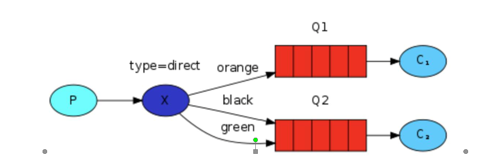


​		在上面这张图中，我们可以看到 X 绑定了两个队列，绑定类型是 direct。队列 Q1 绑定键为 orange，队列 Q2 绑定键有两个:一个绑定键为 black，另一个绑定键为 green.

​		在这种绑定情况下，生产者发布消息到 exchange 上，绑定键为 orange 的消息会被发布到队列Q1。绑定键为 blackgreen 和的消息会被发布到队列 Q2，其他消息类型的消息将被丢弃

### 5.5.2、多重绑定

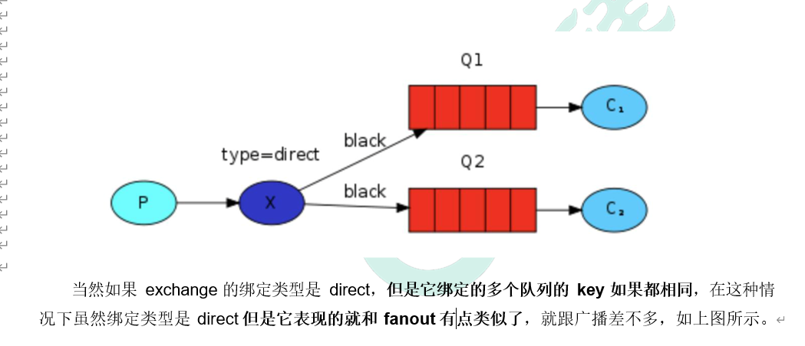


### 5.5.3、代码

```java
/**
 * @author 党
 * @version 1.0
 * 2022/7/10   16:00
 * 消费者
 */
public class Customer01 {
    private static final String EXCHANGE_NAME = "direct_log";

    public static void main(String[] args) throws Exception{
        System.out.println("Customer01等待接收消息");
        Channel channel = ChannelUtils.getChannel();
        channel.exchangeDeclare(EXCHANGE_NAME, BuiltinExchangeType.DIRECT);
        //队列
        String queue = channel.queueDeclare().getQueue();
        //绑定
        channel.queueBind(queue,EXCHANGE_NAME,"Customer01");
        //接收消息
        channel.basicConsume(queue,true,(consumerTag, message) ->{
            byte[] body = message.getBody();
            System.out.println("=>"+new String(body));
        },(consumerTag, sig) -> {

        } );

    }
}
```

【生产者是否绑定无所谓】

```java
/**
 * @author 党
 * @version 1.0
 * 2022/7/10   15:55
 * 生产者
 */
public class Producer {
    private static final String EXCHANGE_NAME = "direct_log";
    public static void main(String[] args) throws Exception{
        //获取信道
        Channel channel = ChannelUtils.getChannel();
        /**
         * 获取交换机
         * @param exchange the name of the exchange
         * @param type the exchange type
         */
        channel.exchangeDeclare(EXCHANGE_NAME, BuiltinExchangeType.DIRECT);
        Scanner scanner = new Scanner(System.in);
        while (scanner.hasNext()){
            String message = scanner.next();
            if (message.length()>5){
                //发送消息
                channel.basicPublish(EXCHANGE_NAME,"Customer02",null,message.getBytes());
            }else {
                channel.basicPublish(EXCHANGE_NAME,"Customer01",null,message.getBytes());
            }
            System.out.println("==>"+message);
        }

    }
}
```


## 5.6、Topic（主题交换机）


### 5.6.1、问题

```
direct可以绑定多个，但是同时只可以发送一个，不能既发送info又发送error
```

### 5.6.2、Topic的要求

​		发送到类型是 topic 交换机的消息的 routingkey 不能随意写，必须满足一定的要求，它**必须是一个单词列表，以点号分隔开**。这些单词可以是任意单词，比如说："stock.usd.nyse", "nyse.vmw", "quick.orange.rabbit".这种类型的。当然这个单词列表最多不能超过 255 个字节。

​		在这个规则列表中，其中有两个替换符是大家需要注意的

​			**(星号)可以代替一个单词**

​			**#(井号)可以替代零个或多个单词**


### 5.6.3、Topic匹配案例

​	下图绑定关系如下

​		Q1-->绑定的是

​				中间带 orange 带 3 个单词的字符串(*****.orange.*) 

​		Q2-->绑定的是

​				最后一个单词是 rabbit 的 3 个单词(*****.*.rabbit)

​				第一个单词是 lazy 的多个单词(lazy.#)

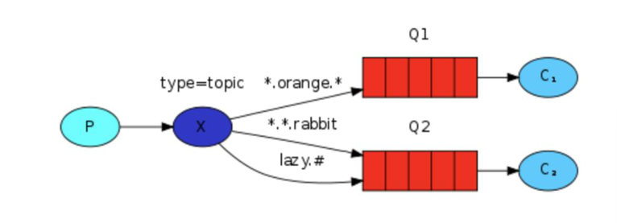

上图是一个队列绑定关系图，我们来看看他们之间数据接收情况是怎么样的

 

|                          |                    |
| ------------------------ | ------------------ |
| quick.orange.rabbit      | 被队列 Q1Q2 接收到 |
| lazy.orange.elephant     | 被队列 Q1Q2 接收到 |
| quick.orange.fox         | Q1,                |
| lazy.brown.fox           | Q2                 |
| lazy.pink.rabbit         | Q2                 |
| quick.brown.fox          | 丢弃               |
| quick.orange.male.rabbit | 丢弃               |
| lazy.orange.male.rabbit  | Q2                 |


当队列绑定关系是下列这种情况时需要引起注意

​		**当一个队列绑定键是#,那么这个队列将接收所有数据，就有点像 fanout 了**

​		**如果队列绑定键当中没有#和\*出现，那么该队列绑定类型就是 direct 了**


### 5.6.4、代码


```java
/**
 * @author 党
 * @version 1.0
 * 2022/7/11   10:47
 * 生产者
 */
public class Producer {
    public static final String EXCHANGE_NAME = "topic_exchange";

    public static void main(String[] args) throws Exception {
        //获取信道
        Channel channel = ChannelUtils.getChannel();
        //声明交换机
        channel.exchangeDeclare(EXCHANGE_NAME, BuiltinExchangeType.TOPIC);
        Hashtable<String, String> hashtable = new Hashtable<>();
        hashtable.put("quick.orange.rabbit","01 + 02");
        hashtable.put("lazy.orange.elephant","01 + 02");
        hashtable.put("quick.orange.fox","01");
        hashtable.put("lazy.brown.fox","02");
        //发送消息
        for (String routingKey : hashtable.keySet()) {
            channel.basicPublish(EXCHANGE_NAME, routingKey, null, hashtable.get(routingKey).getBytes());
            System.out.println(" [x] Sent '" + routingKey + "':'" + hashtable.get(routingKey) + "'");
        }

    }
}
```


```java
/**
 * @author 党
 * @version 1.0
 * 2022/7/11   10:46
 * 消费者
 */
public class Customer01 {
    public static final String EXCHANGE_NAME = "topic_exchange";

    public static void main(String[] args) throws Exception {
        //获取信道
        Channel channel = ChannelUtils.getChannel();
        System.out.println("等待接收");
        //声明交换机
        channel.exchangeDeclare(EXCHANGE_NAME, BuiltinExchangeType.TOPIC);
        //声明队列
        String queue = channel.queueDeclare().getQueue();
        //绑定
        channel.queueBind(queue, EXCHANGE_NAME, "*.orange.*");
        //接收消息
        channel.basicConsume(queue, true, (consumerTag, message) -> {
            byte[] body = message.getBody();
            System.out.println(" [x] Received '" + new String(body) + "'");
        },(consumerTag, sig) -> {

        });
    }
}
```


# 6、死信队列

## 6.1、死信概念

​		先从概念解释上搞清楚这个定义，死信，顾名思义就是无法被消费的消息，字面意思可以这样理解，一般来说，producer 将消息投递到 broker 或者直接到 queue 里了，consumer 从 queue 取出消息进行消费，但某些时候由于特定的**原因导致** **queue** **中的某些消息无法被消费**，这样的消息如果没有后续的处理，就变成了死信，有死信自然就有了死信队列。


​		应用场景:为了保证订单业务的消息数据不丢失，需要使用到 RabbitMQ 的死信队列机制，当消息消费发生异常时，将消息投入死信队列中.还有比如说: 用户在商城下单成功并点击去支付后在指定时间未支付时自动失效

## 6.2、死信的来源

- 消息 TTL 过期 

- 队列达到最大长度(队列满了，无法再添加数据到 mq 中)

- 消息被拒绝(basic.reject 或 basic.nack)并且 requeue=false.


## 6.3、死信代码


### 6.3.1、死信结构

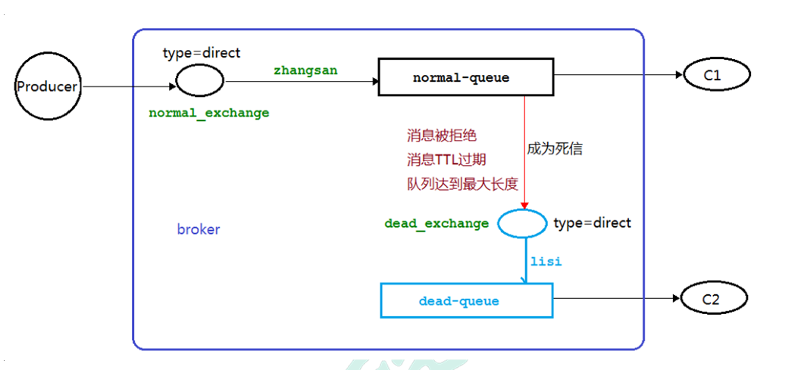


### 6.3.2、消息TTL过期

【生产者】

```java
/**
 * @author 党
 * @version 1.0
 * 2022/7/11   11:11
 * @since JDK 1.8
 * 生产者
 * 生产者只需要发送到普通交换机就行了
 */
public class Producer {
    //普通交换机
    public static final String EXCHANGE_NAME = "ttl_exchange";

    public static void main(String[] args) throws Exception{
        //获取信道
        Channel channel = ChannelUtils.getChannel();
        //交换机已经存在，可以不用声明
        //设置消息的TTL
        AMQP.BasicProperties properties = new AMQP.BasicProperties.Builder()
                .expiration("5000") //5000 ms => 5s
                .build();

        //发送消息
        for (int i = 0; i < 10; i++) {
            String message = "message" + i;
            channel.basicPublish(EXCHANGE_NAME, "", properties, message.getBytes());
        }
    }
}
```

【普通消费者】

```java
/**
 * @author 党
 * @version 1.0
 * 2022/7/11   11:11
 * @since JDK 1.8
 * 消费者01
 */
public class Consumer01 {
    //普通交换机
    public static final String EXCHANGE_NAME = "ttl_exchange";
    //死信交换机
    public static final String DEAD_EXCHANGE_NAME = "dead_exchange";
    //普通队列
    public static final String QUEUE_NAME = "ttl_queue";
    //死信队列
    public static final String DEAD_QUEUE_NAME = "dead_queue";
    public static void main(String[] args) throws Exception{
        Channel channel = ChannelUtils.getChannel();
        System.out.println("消费者启动");
        //声明交换机
        channel.exchangeDeclare(EXCHANGE_NAME, BuiltinExchangeType.DIRECT);
        //声明死信交换机
        channel.exchangeDeclare(DEAD_EXCHANGE_NAME, BuiltinExchangeType.DIRECT);

        Map<String, Object> arguments = new HashMap<>();
        //过期时间 毫秒，也可以在生产者设置
//        arguments.put("x-message-ttl", 50000);
        //正常队列设置死信交换机
        arguments.put("x-dead-letter-exchange", DEAD_EXCHANGE_NAME);
        //死信routingKey
        arguments.put("x-dead-letter-routing-key", "dead_routing_key");
        //声明队列
        channel.queueDeclare(QUEUE_NAME, false, false, false, arguments);
        //绑定交换机和队列
        channel.queueBind(QUEUE_NAME, EXCHANGE_NAME, "");

        //声明死信队列
        channel.queueDeclare(DEAD_QUEUE_NAME, false, false, false, null);
        //绑定死信交换机和队列
        channel.queueBind(DEAD_QUEUE_NAME, DEAD_EXCHANGE_NAME, "dead_routing_key");
        //接收
        channel.basicConsume(QUEUE_NAME,true, (consumerTag, message) -> {
            byte[] body = message.getBody();
            System.out.println("接收到消息：" + new String(body));
        },(consumerTag, sig) -> {

        });

    }
}
```


【死信消费者】

```java
/**
 * @author 党
 * @version 1.0
 * 2022/7/11   14:31
 * 接收死信队列消息
 */
public class Customer02 {
    public static final String DEAD_QUEUE_NAME = "dead_queue";
    public static void main(String[] args) throws Exception{
        Channel channel = ChannelUtils.getChannel();
        channel.basicConsume(DEAD_QUEUE_NAME,true, (consumerTag, message) -> {
            byte[] body = message.getBody();
            System.out.println("接收到消息：" + new String(body));
        }, (consumerTag, sig) -> {

        });
    }
}
```


### 6.3.3、队列到达最大长度


【生产者】

```java
/**
 * @author 党
 * @version 1.0
 * 2022/7/11   11:11
 * @since JDK 1.8
 * 生产者
 * 生产者只需要发送到普通交换机就行了
 */
public class Producer {
    //普通交换机
    public static final String EXCHANGE_NAME = "ttl_exchange";

    public static void main(String[] args) throws Exception{
        //获取信道
        Channel channel = ChannelUtils.getChannel();
        //交换机已经存在，可以不用声明
        //发送消息
        for (int i = 0; i < 10; i++) {
            String message = "message" + i;
            channel.basicPublish(EXCHANGE_NAME, "length", null, message.getBytes());
        }
    }
}
```


【消费者】

```java
/**
 * @author 党
 * @version 1.0
 * 2022/7/11   11:11
 * @since JDK 1.8
 * 消费者01
 */
public class Consumer01 {
    //普通交换机
    public static final String EXCHANGE_NAME = "ttl_exchange";
    //死信交换机
    public static final String DEAD_EXCHANGE_NAME = "dead_exchange";
    //普通队列
    public static final String QUEUE_NAME = "length_queue";

    public static void main(String[] args) throws Exception{
        Channel channel = ChannelUtils.getChannel();
        System.out.println("消费者启动");
        /**
         * 交换机不声明，已经存在
         */
        Map<String, Object> arguments = new HashMap<>();
        //正常队列设置死信交换机
        arguments.put("x-dead-letter-exchange", DEAD_EXCHANGE_NAME);
        //死信routingKey
        arguments.put("x-dead-letter-routing-key", "dead_routing_key");
        //消息最大长度，超过的，进入死信队列
        arguments.put("x-max-length", 6);
        //声明队列
        channel.queueDeclare(QUEUE_NAME, false, false, false, arguments);
        //绑定交换机和队列
        channel.queueBind(QUEUE_NAME, EXCHANGE_NAME, "length");
        /**
         * 死信交换机和死信队列已经绑定
         */
        //接收
        channel.basicConsume(QUEUE_NAME,true, (consumerTag, message) -> {
            byte[] body = message.getBody();
            System.out.println("接收到消息：" + new String(body));
        },(consumerTag, sig) -> {

        });

    }
}
```


### 6.3.4、消息被拒


【生产者】

```java
/**
 * @author 党
 * @version 1.0
 * 2022/7/11   11:11
 * @since JDK 1.8
 * 生产者
 * 生产者只需要发送到普通交换机就行了
 */
public class Producer {
    //普通交换机
    public static final String EXCHANGE_NAME = "ttl_exchange";

    public static void main(String[] args) throws Exception{
        //获取信道
        Channel channel = ChannelUtils.getChannel();
        //发送消息
        for (int i = 0; i < 10; i++) {
            String message = "message" + i;
            channel.basicPublish(EXCHANGE_NAME, "refuse", null, message.getBytes());
        }
    }
}
```


【消费者】

```java
/**
 * @author 党
 * @version 1.0
 * 2022/7/11   11:11
 * @since JDK 1.8
 * 消费者01
 */
public class Consumer01 {
    //普通交换机
    public static final String EXCHANGE_NAME = "ttl_exchange";
    //死信交换机
    public static final String DEAD_EXCHANGE_NAME = "dead_exchange";
    //普通队列
    public static final String QUEUE_NAME = "refuse_queue";

    public static void main(String[] args) throws Exception{
        Channel channel = ChannelUtils.getChannel();
        System.out.println("消费者启动");
        /**
         * 交换机不声明，已经存在
         */
        Map<String, Object> arguments = new HashMap<>();
        //正常队列设置死信交换机
        arguments.put("x-dead-letter-exchange", DEAD_EXCHANGE_NAME);
        //死信routingKey
        arguments.put("x-dead-letter-routing-key", "dead_routing_key");
        //声明队列
        channel.queueDeclare(QUEUE_NAME, false, false, false, arguments);
        //绑定交换机和队列
        channel.queueBind(QUEUE_NAME, EXCHANGE_NAME, "refuse");
        /**
         * 死信交换机和死信队列已经绑定
         */
        //拒收，必须取消自动应答
        channel.basicConsume(QUEUE_NAME,false,(consumerTag, message) -> {
            String s = new String(message.getBody());
            if (s.equals("message1")){
                System.err.println("拒收message1");
                /**
                 *  @param deliveryTag the tag from the received
                 *  @param multiple true to reject all messages up to and including
                 *  @param requeue 如果被拒绝的消息应该重新排队，而不是丢弃/死信，则为true
                 */
                channel.basicNack(message.getEnvelope().getDeliveryTag(),false,false);
            }else {
                //应答
                channel.basicAck(message.getEnvelope().getDeliveryTag(),false);
            }
        },(consumerTag, sig) -> {

        });

    }
}
```


# 7、延时队列

## 7.1、延时队列概念

​		延时队列,队列内部是有序的，最重要的特性就体现在它的延时属性上，延时队列中的元素是希望在指定时间到了以后或之前取出和处理，简单来说，延时队列就是用来存放需要在指定时间被处理的元素的队列。


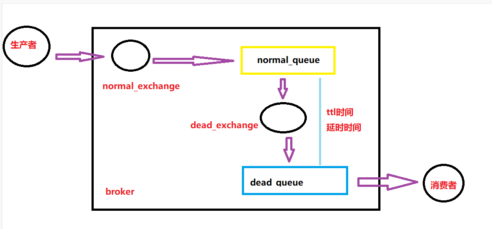


## 7.2、延时队列使用场景


- 订单在十分钟内未支付自动取消
- 新创建的店铺，如果在十天内都没有上传过商品，自动发送消息提醒
- 用户注册成功后，如果三天内没有登录则进行短信提醒
- 用户发起退款，如果三天内没有处理通知相关人员
- 预定会议后，需要在预定时间点前十分钟通知各个会员人员参与


​		这些场景都有一个特点，需要在某个事件发生之后或者之前的指定时间点完成某一项任务，如：发生订单生成事件，在十分钟之后检查该订单支付状态，然后将未支付的订单进行关闭；看起来似乎使用定时任务，一直轮询数据，每秒查一次，取出需要被处理的数据，然后处理不就完事了吗？如果数据量比较少，确实可以这样做，比如：对于“如果账单一周内未支付则进行自动结算”这样的需求，如果对于时间不是严格限制，而是宽松意义上的一周，那么每天晚上跑个定时任务检查一下所有未支付的账单，确实也是一个可行的方案。但对于数据量比较大，并且时效性较强的场景，如：“订单十分钟内未支付则关闭“，短期内未支付的订单数据可能会有很多，活动期间甚至会达到百万甚至千万级别，对这么庞大的数据量仍旧使用轮询的方式显然是不可取的，很可能在一秒内无法完成所有订单的检查，同时会给数据库带来很大压力，无法满足业务要求而且性能低下。


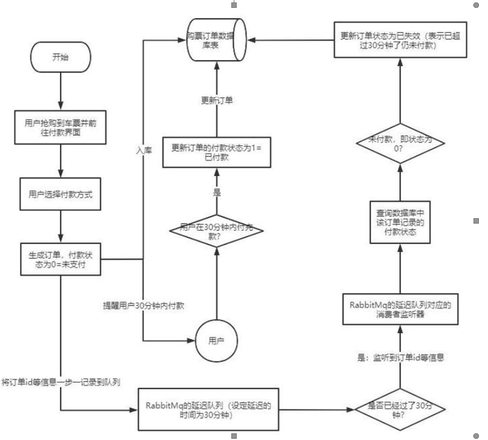


## 7.3、RabbitMQ 中的TTL


### 7.3.1、消息的TTL

```

```


### 7.3.2、队列的TTL


### 7.3.3、两者区别

​		如果设置了队列的 TTL 属性，那么一旦消息过期，就会被队列丢弃(如果配置了死信队列被丢到死信队列中)，而第二种方式，消息即使过期，也不一定会被马上丢弃，因为**消息是否过期是在即将投递到消费者之前判定的**，如果当前队列有严重的消息积压情况，则已过期的消息也许还能存活较长时间；另外，还需要注意的一点是，如果不设置 TTL，表示消息永远不会过期，如果将 TTL 设置为 0，则表示除非此时可以直接投递该消息到消费者，否则该消息将会被丢弃。

​		前一小节我们介绍了死信队列，刚刚又介绍了 TTL，至此利用 RabbitMQ 实现延时队列的两大要素已经集齐，接下来只需要将它们进行融合，再加入一点点调味料，延时队列就可以新鲜出炉了。想想看，延时队列，不就是想要消息延迟多久被处理吗，TTL 则刚好能让消息在延迟多久之后成为死信，另一方面，成为死信的消息都会被投递到死信队列里，这样只需要消费者一直消费死信队列里的消息就完事了，因为里面的消息都是希望被立即处理的消息。


## 7.4、队列TTL

### 7.4.1、代码架构图


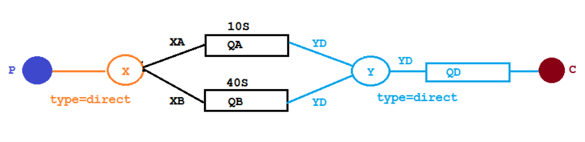


### 7.4.2、配置类代码


```java
/**
 * @author 党
 * @version 1.0
 * 2022/7/12   9:13
 *
 */
@Configuration
public class TTLQueueConfig {
    //普通交换机1
    private static final String X_EXCHANGE = "X";
    //死信交换机
    private static final String Y_DEAD_EXCHANGE = "Y";
    //普通队列1
    private static final String QUEUE_A = "QA";
    //普通队列2
    private static final String QUEUE_B = "QB";
    //死信队列
    private static final String DEAD_QUEUE = "QD";

    //声明普通交换机x
    @Bean(name = X_EXCHANGE)
    public DirectExchange exchange(){
        return new DirectExchange(X_EXCHANGE);
    }
    @Bean(name = Y_DEAD_EXCHANGE)
    public DirectExchange dead_exchange(){
        return new DirectExchange(Y_DEAD_EXCHANGE);
    }
    //队列
    @Bean(name = QUEUE_A)
    public Queue queue_a(){
        HashMap<String, Object> arguments = new HashMap<>();
        //设置死信交换机
        arguments.put("x-dead-letter-exchange",Y_DEAD_EXCHANGE);
        //设置RoutingKey
        arguments.put("x-dead-letter-routing-key","YD");
        //设置ttl,10s
        arguments.put("x-message-ttl",10000);
        return QueueBuilder.durable(QUEUE_A)
                .withArguments(arguments)
                .build();
    }
    @Bean(name = QUEUE_B)
    public Queue queue_b(){
        HashMap<String, Object> arguments = new HashMap<>();
        //设置死信交换机
        arguments.put("x-dead-letter-exchange",Y_DEAD_EXCHANGE);
        //设置RoutingKey
        arguments.put("x-dead-letter-routing-key","YD");
        //设置ttl,20s
        arguments.put("x-message-ttl",20000);
        return QueueBuilder.durable(QUEUE_B)
                .withArguments(arguments)
                .build();
    }
    //死信队列
    @Bean(name = DEAD_QUEUE)
    public Queue dead_queue(){
        return QueueBuilder.durable(DEAD_QUEUE)
                .build();
    }
    //绑定
    @Bean
    public Binding queueA_X(@Qualifier(X_EXCHANGE) DirectExchange directExchange,
                            @Qualifier(QUEUE_A) Queue queue){
        return BindingBuilder.bind(queue).to(directExchange).with("XA");
    }
    //绑定
    @Bean
    public Binding queueB_X(@Qualifier(X_EXCHANGE) DirectExchange directExchange,
                            @Qualifier(QUEUE_B) Queue queue){
        return BindingBuilder.bind(queue).to(directExchange).with("XB");
    }
    @Bean
    public Binding binding(@Qualifier(DEAD_QUEUE) Queue queue,
                           @Qualifier(Y_DEAD_EXCHANGE) DirectExchange directExchange){
        return BindingBuilder.bind(queue).to(directExchange).with("YD");

    }


}
```


### 7.4.3、生产者代码

```java
/**
 * @author 党
 * @version 1.0
 * 2022/7/12   9:45
 * 生产者
 */
@Slf4j
@RequestMapping("ttl")
@RestController
public class Procter {
    @Autowired
    private RabbitTemplate rabbitTemplate;
    @RequestMapping(value = "/sendMessage",
    params = {"message"})
    //发消息
    public void sendMessage(String message){
        log.info("当前时间：{},发送一条信息给两个 TTL 队列:{}", new Date(), message);
        /**
         * @Param exchange 交换机
         * @Param routingKey
         * @Param object 消息内容
         */
        rabbitTemplate.convertAndSend("X", "XA", "消息来自 ttl 为 10S 的队列:  "+message);
        rabbitTemplate.convertAndSend("X", "XB", "消息来自 ttl 为 20S 的队列:  "+message);
    }
}
```


### 7.4.4、消费者代码

```java
/**
 * @author 党
 * @version 1.0
 * 2022/7/12   9:52
 * 消费者，消费者是通过监听获取
 */
@Slf4j
@RestController
public class Customer {

    //接收消息，监听QD队列
    @RabbitListener(queues = "QD")
    public void receive(Message message, Channel channel){
        byte[] body = message.getBody();
        String msg = new String(body);
        log.info("当前时间：{}，收到死信队列消息：{}", new Date(),msg);
    }
}
```


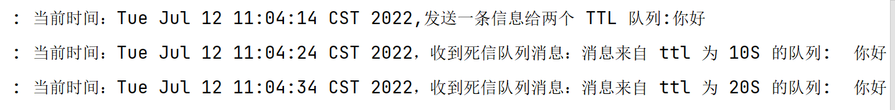


## 7.5、延时队列优化


### 7.5.1、代码框架图

​		在这里新增了一个队列 QC,绑定关系如下,该队列不设置 TTL 时间

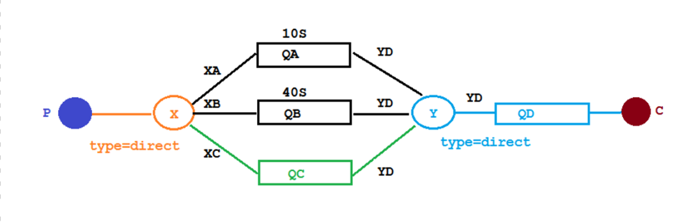


### 7.5.2、配置文件

```java
//优化，增加一个单独的队列，不设置ttl，在发送消息的时候决定ttl
private static final String QUEUE_C = "AC";
@Bean(name = QUEUE_C)
public Queue queue(){
    HashMap<String, Object> arguments = new HashMap<>();
    //设置死信交换机
    //设置死信交换机
    arguments.put("x-dead-letter-exchange",Y_DEAD_EXCHANGE);
    //设置RoutingKey
    arguments.put("x-dead-letter-routing-key","YD");
    return QueueBuilder.durable(QUEUE_C)
            .withArguments(arguments)
            .build();
}
//绑定
@Bean
public Binding bindingC(@Qualifier(QUEUE_C) Queue queue,
                       @Qualifier(X_EXCHANGE) DirectExchange directExchange){
    return BindingBuilder.bind(queue).to(directExchange).with("XC");
}
```


### 7.5.3、生产者

```java
@RequestMapping(value = "/sendMessageTime",
        params = {"message"})
//发消息
public void sendMessageTime(String message,String time){

    log.info("当前时间：{},发送一条信息给两个 TTL 队列:{}", new Date(), message);
    /**
     * @Param exchange 交换机
     * @Param routingKey
     * @Param object 消息内容
     */
    rabbitTemplate.convertAndSend("X", "XA", "消息来自 ttl 为 10S 的队列:  "+message);
    rabbitTemplate.convertAndSend("X", "XB", "消息来自 ttl 为 20S 的队列:  "+message);
    rabbitTemplate.convertAndSend("X", "XC", message, correlationData ->{
        correlationData.getMessageProperties().setExpiration(time);
        return correlationData;
    });
}
```


### 7.5.4、基于死信的延时队列存在的问题

```
RabbitMQ只会检查第一个消息是否过期，如果过期则丢到死信队列，如果第一个消息的延时时间很长，而第二个消息的延时时长很短，第二个消息并不会优先执行
```


## 7.6、RabbitMQ插件实现延迟队列


```
插件
rabbitmq-delayed-message-exchange
```


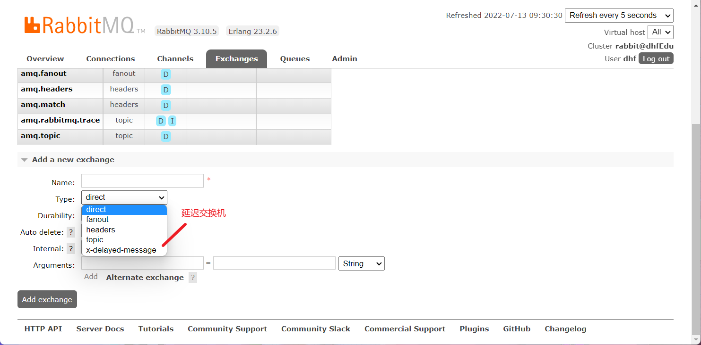


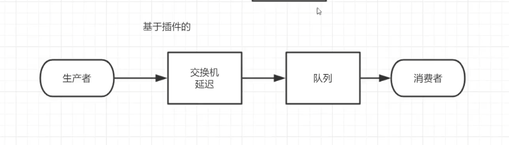


### 7.6.1、代码架构


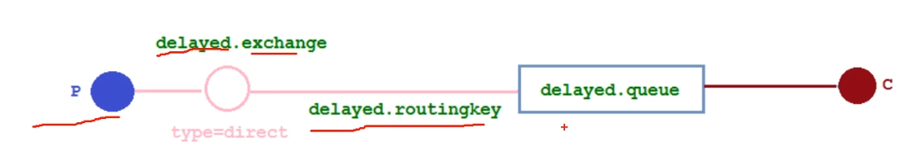


### 7.6.2、配置类


```java
@Configuration
public class RabbitConfig {
    //定义延时交换机
    private static final String DELAYED_EXCHANGE = "delayed_exchange";
    //延时队列
    private static final String DELAYED_QUEUE = "delayed_queue";
    private static final String DELAYED_ROUTING_KEY = "delayed_routing_key";

    @Bean //自定义类型交换机
    public CustomExchange delayedExchange(){
        Map<String, Object> args = new HashMap<>();
        //自定义交换机的类型
        args.put("x-delayed-type", "direct");
        /**
         * @Param String name
         * @Param String type 交换机类型
         * @param boolean durable 持久化
         * @Param boolean autoDelete 自动删除
         */
        return new CustomExchange(DELAYED_EXCHANGE, "x-delayed-message", true, false, args);
    }


    @Bean(name = DELAYED_QUEUE)
    public Queue queue(){
        return QueueBuilder.durable(DELAYED_QUEUE).build();
    }

    @Bean
    public Binding binding(@Autowired Queue queue,
                           @Qualifier("delayedExchange") CustomExchange exchange){
        return BindingBuilder.bind(queue).to(exchange).with(DELAYED_ROUTING_KEY).noargs();
    }
}
```


### 7.6.3、生产者


```java
@Slf4j
@Controller
public class Procter {
    private static final String DELAYED_EXCHANGE = "delayed_exchange";
    @Autowired
    RabbitTemplate rabbitTemplate;
    //基于插件的延时队列
    @RequestMapping("/test/send")
    public void sendMessage(String message,Integer time){
        log.info("当前时间{}，发送一条时长{}毫秒信息到延迟交换机:{}",
                new Date(),time,message);
        //发送
        rabbitTemplate.convertAndSend(DELAYED_EXCHANGE,"delayed_routing_key",message,msg->{
          msg.getMessageProperties().setDelay(time);
          return msg;
        });
    }
}
```


### 7.6.4、消费者

```java
@Slf4j
@Controller
public class Customer {
    //延时队列
    private static final String DELAYED_QUEUE = "delayed_queue";
    @RabbitListener(queues = DELAYED_QUEUE)
    public void listen(Message message){
        byte[] body = message.getBody();
        String msg = new String(body);
        log.info("当前时间{},收到消息{}",new Date(),msg);
    }
}
```


## 7.7、总结

​		延时队列在需要延时处理的场景下非常有用，使用 RabbitMQ 来实现延时队列可以很好的利用RabbitMQ 的特性，如：消息可靠发送、消息可靠投递、死信队列来保障消息至少被消费一次以及未被正确处理的消息不会被丢弃。另外，通过 RabbitMQ 集群的特性，可以很好的解决单点故障问题，不会因为单个节点挂掉导致延时队列不可用或者消息丢失。

​		当然，延时队列还有很多其它选择，比如利用 Java 的 DelayQueue，利用 Redis 的 zset，利用 Quartz或者利用 kafka 的时间轮，这些方式各有特点,看需要适用的场景


# 8、发布确认高级

​		

​		在生产环境中由于一些不明原因，导致 rabbitmq 重启，在 RabbitMQ 重启期间生产者消息投递失败，导致消息丢失，需要手动处理和恢复。于是，我们开始思考，如何才能进行 RabbitMQ 的消息可靠投递呢？特别是在这样比较极端的情况，RabbitMQ 集群不可用的时候，无法投递的消息该如何处理呢:


## 8.1、发布确认


### 8.1.1、确认机制方案

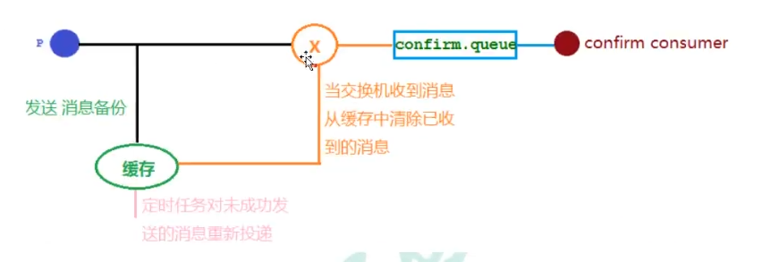


### 8.1.2、代码架构图


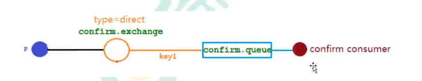


### 8.1.3、配置文件

```
spring.rabbitmq.publisher-confirm-type=correlated
```


### 8.1.4、配置类

```java
@Configuration
public class RabbitConfig {
    public static final String CONFIRM_EXCHANGE = "CONFIRM_EXCHANGE";
    public static final String CONFIRM_QUEUE = "CONFIRM_QUEUE";
    public static final String CONFIRM_ROUTING_KEY = "CONFIRM_ROUTING_KEY";
    @Bean //交换机
    public DirectExchange directExchange(){
        return new DirectExchange(CONFIRM_EXCHANGE);
    }
    @Bean
    public Queue queue(){
        return QueueBuilder.durable(CONFIRM_QUEUE).build();
    }
    @Bean
    public Binding binding(@Autowired Queue queue,
                           @Qualifier("directExchange") DirectExchange exception){
        return BindingBuilder.bind(queue).to(exception).with(CONFIRM_ROUTING_KEY);
    }
}
```


### 8.1.5、回调接口【解决交换机收不到消息】

```java
@Slf4j
@Component
public class MyConfirmCallback implements RabbitTemplate.ConfirmCallback {
    //注入rabbitTemplate
    @Autowired
    RabbitTemplate rabbitTemplate;
    //被@PostConstruct修饰的方法会在服务器加载Servlet的时候运行
    //Constructor(构造方法) -> @Autowired(依赖注入) -> @PostConstruct(注释的方法)
    @PostConstruct
    public void init(){
        rabbitTemplate.setConfirmCallback(this);
    }
    /***
     * 交换机确认回调的方法
     * @param correlationData 回调消息id及消息
     * @param ack 收到消息true，没有收到false
     * @param cause 成功null，失败->失败原因
     */
    @Override
    public void confirm(CorrelationData correlationData, boolean ack, String cause) {
        String id = correlationData!=null?correlationData.getId():"";
        if (ack){//成功

            log.info("交换机收到消息:id={}",id);
        }else {
            log.info("交换机未收到消息:id={},原因为{}",id,cause);
        }
    }
}
```


**ConfirmCallback接口是RabbitTemplate内部的接口，创建该接口的实现类后，必须要将其注入到RabbitTemplate内部，通过一下方法注入**

```java
@Autowired
RabbitTemplate rabbitTemplate;
//被@PostConstruct修饰的方法会在服务器加载Servlet的时候运行
//Constructor(构造方法) -> @Autowired(依赖注入) -> @PostConstruct(注释的方法)
@PostConstruct
public void init(){
    rabbitTemplate.setConfirmCallback(this);
}
```


### 8.1.6、生产者

```java
@Slf4j
@RequestMapping("/test")
@Controller
public class Procter {
    @Autowired
    RabbitTemplate rabbitTemplate;


    @RequestMapping("/sendMessage")
    public void sendMessage(String msg) {
        int id = new Date().getMinutes();
        CorrelationData correlationData = new CorrelationData(id+"");

        log.info("当前时间{},消息内容:{}", new Date(), msg);
        rabbitTemplate.convertAndSend(
                RabbitConfig.CONFIRM_EXCHANGE,
                RabbitConfig.CONFIRM_ROUTING_KEY,
                msg,
                correlationData
        );
    }
}
```

## 8.2、回退消息（找不到路由）


### 8.2.1、Mandatory参数

​		**在仅开启了生产者确认机制的情况下，交换机接收到消息后，会直接给消息生产者发送确认消息**，**如果发现该消息不可路由，那么消息会被直接丢弃，此时生产者是不知道消息被丢弃这个事件的**。那么如何让无法被路由的消息帮我想办法处理一下？最起码通知我一声，我好自己处理啊。通过设置 mandatory 参数可以在当消息传递过程中不可达目的地时将消息返回给生产者。


### 8.2.2、消息生产者代码


​	**回退接口**

RabbitTemplate.ReturnCallback

```yaml
publisher-returns: true # 消息回退
```

#### 8.2.2.1、配置类


```java
@Slf4j
@Component
public class MyConfirmCallback implements RabbitTemplate.ConfirmCallback,RabbitTemplate.ReturnsCallback {
    //注入rabbitTemplate
    @Autowired
    RabbitTemplate rabbitTemplate;
    //被@PostConstruct修饰的方法会在服务器加载Servlet的时候运行
    //Constructor(构造方法) -> @Autowired(依赖注入) -> @PostConstruct(注释的方法)
    @PostConstruct
    public void init(){
        //确认发布
        rabbitTemplate.setConfirmCallback(this);
        //注入消息回退
        rabbitTemplate.setReturnsCallback(this);
    }
    /***
     * 交换机确认回调的方法
     * @param correlationData 回调消息id及消息
     * @param ack 收到消息true，没有收到false
     * @param cause 成功null，失败->失败原因
     */
    @Override
    public void confirm(CorrelationData correlationData, boolean ack, String cause) {
        String id = correlationData!=null?correlationData.getId():"";
        if (ack){//成功

            log.info("交换机收到消息:id={}",id);
        }else {
            log.info("交换机未收到消息:id={},原因为{}",id,cause);
        }
    }

    //消息不可达目的地时，进行回退

    @Override
    public void returnedMessage(ReturnedMessage returnedMessage) {
        String exchange = returnedMessage.getExchange();
        byte[] body = returnedMessage.getMessage().getBody();
        String msg = new String(body);
        String replyText = returnedMessage.getReplyText();
        log.info("路由{},消息{},原因{}",exchange,msg,replyText);
    }
}
```


#### 8.2.1.2、生产者


```java
@Slf4j
@RequestMapping("/test")
@Controller
public class Procter {
    @Autowired
    RabbitTemplate rabbitTemplate;


    @RequestMapping("/sendMessage")
    public void sendMessage(String msg) {
        int id = new Date().getMinutes();
        CorrelationData correlationData = new CorrelationData(id+"");

        log.info("当前时间{},消息内容:{}", new Date(), msg);
        rabbitTemplate.convertAndSend(
                RabbitConfig.CONFIRM_EXCHANGE,
                RabbitConfig.CONFIRM_ROUTING_KEY+"1",
                msg,
                correlationData
        );
    }
}
```


## 8.3、备份交换机


​		有了 mandatory 参数和回退消息，我们获得了对无法投递消息的感知能力，有机会在生产者的消息无法被投递时发现并处理。但有时候，我们并不知道该如何处理这些无法路由的消息，最多打个日志，然后触发报警，再来手动处理。而通过日志来处理这些无法路由的消息是很不优雅的做法，特别是当生产者所在的服务有多台机器的时候，手动复制日志会更加麻烦而且容易出错。而且设置 mandatory 参数会增加生产者的复杂性，需要添加处理这些被退回的消息的逻辑。如果既不想丢失消息，又不想增加生产者的复杂性，该怎么做呢？前面在设置死信队列的文章中，我们提到，可以为队列设置死信交换机来存储那些处理失败的消息，可是这些不可路由消息根本没有机会进入到队列，因此无法使用死信队列来保存消息。在 RabbitMQ 中，有一种备份交换机的机制存在，可以很好的应对这个问题。什么是备份交换机呢？备份交换机可以理解为 RabbitMQ 中交换机的“备胎”，当我们为某一个交换机声明一个对应的备份交换机时，就是为它创建一个备胎，当交换机接收到一条不可路由消息时，将会把这条消息转发到备份交换机中，由备份交换机来进行转发和处理，通常备份交换机的类型为 Fanout ，这样就能把所有消息都投递到与其绑定的队列中，然后我们在备份交换机下绑定一个队列，这样所有那些原交换机无法被路由的消息，就会都进入这个队列了。当然，我们还可以建立一个报警队列，用独立的消费者来进行监测和报警


### 8.3.1、代码架构图


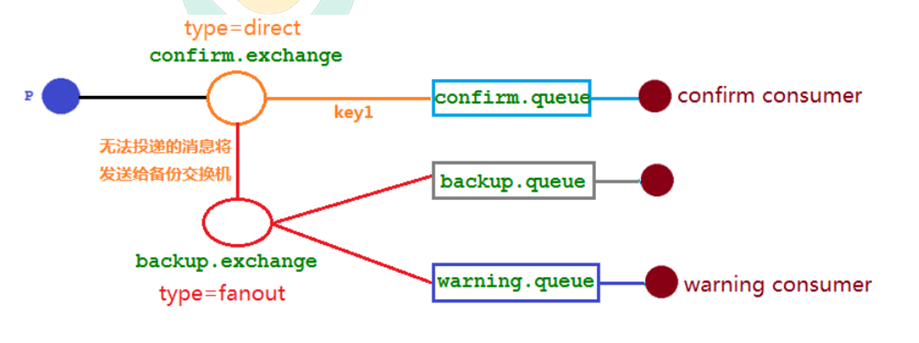


### 8.3.2、修改配置类


```java
@Configuration
public class RabbitConfig {
    //主交换机
    public static final String EXCHANGE = "MASTER_EXCHANGE";
    //备份交换机
    public static final String BACKUP_EXCHANGE = "BACKUP_EXCHANGE";
    //普通队列
    public static final String QUEUE = "MASTER_QUEUE";
    //备份队列
    public static final String BACKUP_QUEUE = "BACKUP_QUEUE";
    //警告队列
    public static final String WARRING_QUEUE = "WARRING_QUEUE";
    //routingKey
    public static final String EX_QU_Key = "key";

    @Bean(name = EXCHANGE)
    public DirectExchange directExchange(){
        HashMap<String, Object> arguments = new HashMap<>();
        /**
         * 将直接交换机和扇出交换机（备份交换机）进行联系
         */
        arguments.put("alternate-exchange",BACKUP_EXCHANGE);
        return  ExchangeBuilder.directExchange(EXCHANGE).durable(true).withArguments(arguments).build();
    }
    //备份交换机
    @Bean(name = BACKUP_EXCHANGE)
    public FanoutExchange backupExchange(){
        return new FanoutExchange(BACKUP_EXCHANGE);
    }
    @Bean(name = QUEUE)
    public Queue queue(){
        return QueueBuilder.durable(QUEUE).build();
    }
    @Bean(name = BACKUP_QUEUE)
    public Queue backUpQueue(){
        return QueueBuilder.durable(BACKUP_QUEUE).build();
    }
    @Bean(name = WARRING_QUEUE)
    public Queue warringQueue(){
        return QueueBuilder.durable(WARRING_QUEUE).build();
    }

    @Bean
    public Binding binding(@Qualifier(EXCHANGE) DirectExchange directExchange,
                           @Qualifier(QUEUE) Queue queue){
        return BindingBuilder.bind(queue).to(directExchange).with(EX_QU_Key);

    }
    //备份交换机个备份队列
    @Bean
    public Binding binding2(@Qualifier(BACKUP_EXCHANGE) FanoutExchange fanoutExchange,
                            @Qualifier(BACKUP_QUEUE) Queue queue){
        return BindingBuilder.bind(queue).to(fanoutExchange);

    }
    //备份交换机和报警队列
    @Bean
    public Binding binding3(@Qualifier(BACKUP_EXCHANGE) FanoutExchange fanoutExchange,
                            @Qualifier(WARRING_QUEUE) Queue queue){
        return BindingBuilder.bind(queue).to(fanoutExchange);
    }

}
```


### 8.3.3、报警消费者

```java
@Controller
@Slf4j
public class WarningCustomer {

    @RabbitListener(queues = RabbitConfig.WARRING_QUEUE)
    public void warring(Message message){
        byte[] body = message.getBody();
        String msg = new String(body);
        log.info("报警发现不可路由消息:{}",msg);
    }
}
```


### 8.3.4、普通消费者


```java
@Slf4j
@Controller
public class Customer{

    @RabbitListener(queues = RabbitConfig.QUEUE)
    public void con(Message message){
        log.info("接收到消息{}",message);
    }
}
```


### 8.3.5、生产者

```java
@Slf4j
@Controller
public class Pro {
    @Autowired
    RabbitTemplate rabbitTemplate;

    @RequestMapping("/backExchange")
    public void backExchange(@RequestParam("message")String message,
                             @RequestParam(value="key",required = false,defaultValue = "") String key) {
        log.info("发送消息{}", message);
        if (key.equals("")){
            key = RabbitConfig.EX_QU_Key;
        }
        rabbitTemplate.convertAndSend(
                RabbitConfig.EXCHANGE,
                key,
                message
        );
    }
}
```


​		mandatory 参数与备份交换机可以一起使用的时候，如果两者同时开启，消息究竟何去何从？谁优先级高，经过上面结果显示答案是**备份交换机优先级高**。


# 9、RabbitMQ其他

## 9.1、幂等性

### 9.1.1、概念


​		用户对于同一操作发起的一次请求或者多次请求的结果是一致的，不会因为多次点击而产生了副作用。举个最简单的例子，那就是支付，用户购买商品后支付，支付扣款成功，但是返回结果的时候网络异常，此时钱已经扣了，用户再次点击按钮，此时会进行第二次扣款，返回结果成功，用户查询余额发现多扣钱了，流水记录也变成了两条。在以前的单应用系统中，我们只需要把数据操作放入事务中即可，发生错误立即回滚，但是再响应客户端的时候也有可能出现网络中断或者异常等等


### 9.1.2、消息重复消费


​		消费者在消费 MQ 中的消息时，MQ 已把消息发送给消费者，消费者在给 MQ 返回 ack 时网络中断，故 MQ 未收到确认信息，该条消息会重新发给其他的消费者，或者在网络重连后再次发送给该消费者，但实际上该消费者已成功消费了该条消息，造成消费者消费了重复的消息。


### 9.1.3、解决思路


​		MQ 消费者的幂等性的解决一般使用全局 ID 或者写个唯一标识比如时间戳 或者 UUID 或者订单消费者消费 MQ 中的消息也可利用 MQ 的该 id 来判断，或者可按自己的规则生成一个全局唯一 id，每次消费消息时用该 id 先判断该消息是否已消费过。


### 9.1.4、消费端的幂等性保障

​		在海量订单生成的业务高峰期，生产端有可能就会重复发生了消息，这时候消费端就要实现幂等性，这就意味着我们的消息永远不会被消费多次，即使我们收到了一样的消息。业界主流的幂等性有两种操作:a.唯一 ID+指纹码机制,利用数据库主键去重, b.利用 redis 的原子性去实现


### 9.1.5、唯一ID+指纹码机制

​		指纹码:我们的一些规则或者时间戳加别的服务给到的唯一信息码,它并不一定是我们系统生成的，基本都是由我们的业务规则拼接而来，但是一定要保证唯一性，然后就利用查询语句进行判断这个 id 是否存在数据库中,优势就是实现简单就一个拼接，然后查询判断是否重复；劣势就是在高并发时，如果是单个数据库就会有写入性能瓶颈当然也可以采用分库分表提升性能，但也不是我们最推荐的方式。


### 9.1.6、Redis原子性

​		利用 redis 执行 setnx 命令，天然具有幂等性。从而实现不重复消费


## 9.2、优先级队列


### 9.2.1、使用场景


​		在我们系统中有一个**订单催付**的场景，我们的客户在天猫下的订单,淘宝会及时将订单推送给我们，如果在用户设定的时间内未付款那么就会给用户推送一条短信提醒，很简单的一个功能对吧，但是，tmall商家对我们来说，肯定是要分大客户和小客户的对吧，比如像苹果，小米这样大商家一年起码能给我们创造很大的利润，所以理应当然，他们的订单必须得到优先处理，而曾经我们的后端系统是使用 redis 来存放的定时轮询，大家都知道 redis 只能用 List 做一个简简单单的消息队列，并不能实现一个优先级的场景，所以订单量大了后采用 RabbitMQ 进行改造和优化,如果发现是大客户的订单给一个相对比较高的优先级，否则就是默认优先级


### 9.2.2、如何添加

#### 9.2.2.1、控制台添加

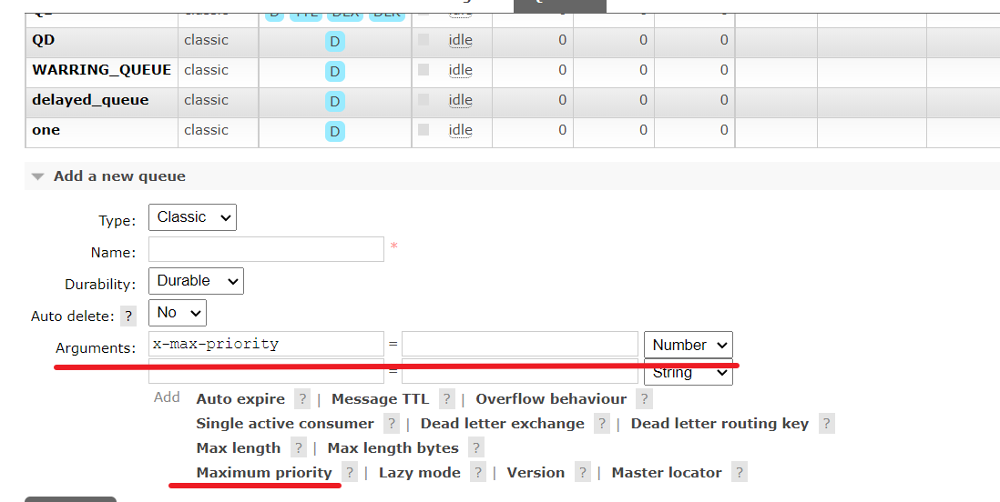


**优先级可选择  0 - 255**

**实际工作中 使用 0 - 10**

#### 9.2.2.2、代码中添加

【设置队列优先级】

```java
Map<String, Object> params = new HashMap(); 
params.put("x-max-priority", 10);
channel.queueDeclare("hello", true, false, false, params);

```

boot

```java
	@Bean(name = QUEUE)
    public Queue queue(){
//        return QueueBuilder.durable(QUEUE).build();
        HashMap<String, Object> arguments = new HashMap<>();
        arguments.put("x-max-priority",10);
        return QueueBuilder.durable().withArguments(arguments).build();
    }
```

【设置消息优先级】

**在发送消息时，确定**

```java
rabbitTemplate.convertAndSend(
            RabbitConfig.EXCHANGE,
            key,
            message,
            msg->{//设置优先级
                MessageProperties messageProperties = msg.getMessageProperties();
                messageProperties.setPriority(5);
                return msg;
            }
    );
}
```


【非boot】

```java
AMQP.BasicProperties properties = new AMQP.BasicProperties.Builder()
        .expiration("5000") //5000 ms => 5s
        .priority(5) //设置消息优先级
        .build();
//发送消息
for (int i = 0; i < 10; i++) {
    String message = "message" + i;
    channel.basicPublish(EXCHANGE_NAME, "", properties, message.getBytes());
}
```


​		**要让队列实现优先级需要做的事情有如下事情:队列需要设置为优先级队列，消息需要设置消息的优先级，消费者需要等待消息已经发送到队列中才去消费因为，这样才有机会对消息进行排序**

==》先将所有消息放入队列中，再消费


## 9.3、惰性队列


### 9.3.1、使用场景

​		RabbitMQ 从 3.6.0 版本开始引入了惰性队列的概念。惰性队列会尽可能的将消息存入磁盘中，而在消费者消费到相应的消息时才会被加载到内存中，它的一个重要的设计目标是能够支持更长的队列，即支持更多的消息存储。当消费者由于各种各样的原因(比如消费者下线、宕机亦或者是由于维护而关闭等)而致使长时间内不能消费消息造成堆积时，惰性队列就很有必要了。

 		默认情况下，当生产者将消息发送到 RabbitMQ 的时候，队列中的消息会尽可能的存储在内存之中，这样可以更加快速的将消息发送给消费者。即使是持久化的消息，在被写入磁盘的同时也会在内存中驻留一份备份。当 RabbitMQ 需要释放内存的时候，会将内存中的消息换页至磁盘中，这个操作会耗费较长的时间，也会阻塞队列的操作，进而无法接收新的消息。虽然 RabbitMQ 的开发者们一直在升级相关的算法，但是效果始终不太理想，尤其是在消息量特别大的时候。


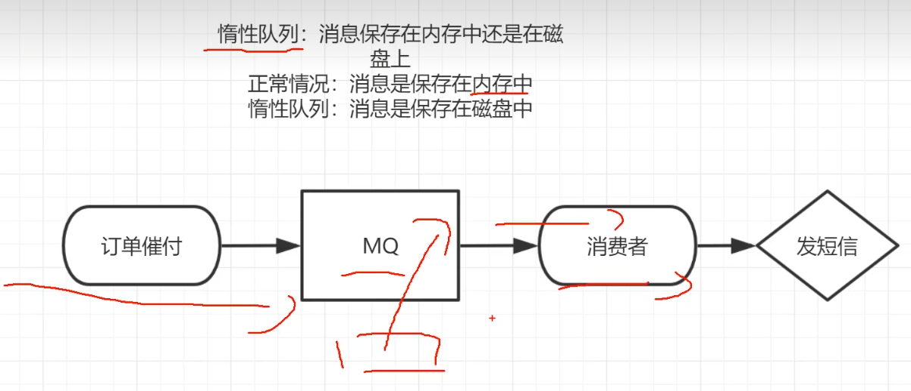


### 9.3.2、两种模式


​		队列具备两种模式：default 和 lazy。默认的为 default 模式，在 3.6.0 之前的版本无需做任何变更。lazy模式即为惰性队列的模式，可以通过调用 channel.queueDeclare 方法的时候在参数中设置，也可以通过Policy 的方式设置，如果一个队列同时使用这两种方式设置的话，那么 Policy 的方式具备更高的优先级。如果要通过声明的方式改变已有队列的模式的话，那么只能先删除队列，然后再重新声明一个新的。

​		在队列声明的时候可以通过“x-queue-mode”参数来设置队列的模式，取值为“default”和“lazy”。下面示例中演示了一个惰性队列的声明细节：


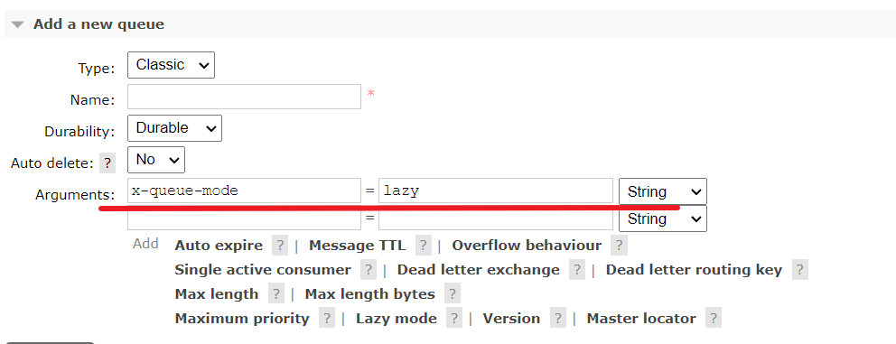


```java
Map<String, Object> args = new HashMap<String, Object>(); 
args.put("x-queue-mode", "lazy"); 
channel.queueDeclare("myqueue", false, false, false, args);
```


```java
	@Bean(name = QUEUE)
    public Queue queue(){
//        return QueueBuilder.durable(QUEUE).build();
        HashMap<String, Object> arguments = new HashMap<>();
        arguments.put("x-max-priority",10); //优先级
        arguments.put("x-queue-mode", "lazy"); //惰性队列
        return QueueBuilder.durable().withArguments(arguments).build();
    }
```


# 10、RabbitMQ集群【查看word】


## 10.1、clustering

### 10.1.1、使用集群的原因


​		最开始我们介绍了如何安装及运行 RabbitMQ 服务，不过这些是单机版的，无法满足目前真实应用的要求。如果 RabbitMQ 服务器遇到内存崩溃、机器掉电或者主板故障等情况，该怎么办？单台 RabbitMQ服务器可以满足每秒 1000 条消息的吞吐量，那么如果应用需要 RabbitMQ 服务满足每秒 10 万条消息的吞吐量呢？购买昂贵的服务器来增强单机 RabbitMQ 务的性能显得捉襟见肘，搭建一个 RabbitMQ 集群才是解决实际问题的关键.


### 10.1.2、搭建步骤


```
1.修改 3 台机器的主机名称
	vim /etc/hostname

2.配置各个节点的 hosts 文件，让各个节点都能互相识别对方
	vim /etc/hosts
		IP node1
		ip node2
		ip node3

3.以确保各个节点的 cookie 文件使用的是同一个值
	在 node1 上执行远程操作命令
 scp /var/lib/rabbitmq/.erlang.cookie root@node2:/var/lib/rabbitmq/.erlang.cookie 
 scp /var/lib/rabbitmq/.erlang.cookie root@node3:/var/lib/rabbitmq/.erlang.cookie
 
4.启动 RabbitMQ 服务,顺带启动 Erlang 虚拟机和 RbbitMQ 应用服务(在三台节点上分别执行以下命令)
 	rabbitmq-server -detached
 	
5.在节点 2 执行
	rabbitmqctl stop_app
	(rabbitmqctl stop 会将 Erlang 虚拟机关闭，
	rabbitmqctl stop_app 只关闭 RabbitMQ 服务)
	rabbitmqctl reset
	rabbitmqctl join_cluster rabbit@node1
	rabbitmqctl start_app(只启动应用服务) 
	
6.在节点 3 执行
	rabbitmqctl stop_app 
	rabbitmqctl reset
	rabbitmqctl join_cluster rabbit@node2 
	rabbitmqctl start_app

7.集群状态
	rabbitmqctl cluster_status
	
8.需要重新设置用户
	创建账号
		rabbitmqctl add_user admin 123
	设置用户角色
		rabbitmqctl set_user_tags admin administrator
	设置用户权限
		rabbitmqctl set_permissions -p "/" admin ".*" ".*" ".*"
		
9.解除集群节点(node2 和 node3 机器分别执行)
	rabbitmqctl stop_app 
	rabbitmqctl reset rabbitmqctl 
	start_app rabbitmqctl cluster_status
	rabbitmqctl forget_cluster_node rabbit@node2(node1 机器上执行)

```


## 10.2、镜像队列

​		如果 RabbitMQ 集群中只有一个 Broker 节点，那么该节点的失效将导致整体服务的临时性不可用，并且也可能会导致消息的丢失。可以将所有消息都设置为持久化，并且对应队列的 durable 属性也设置为 true，但是这样仍然无法避免由于缓存导致的问题：因为消息在发送之后和被写入磁盘井执行刷盘动作之间存在一个短暂却会产生问题的时间窗。通过 publisherconfirm 机制能够确保客户端知道哪些消息己经存入磁盘，尽管如此，一般不希望遇到因单点故障导致的服务不可用。

​		引入镜像队列(Mirror Queue)的机制，可以将队列镜像到集群中的其他 Broker 节点之上，如果集群中的一个节点失效了，队列能自动地切换到镜像中的另一个节点上以保证服务的可用性。


### 10.2.1、搭建步骤

​		


​	**查看word**


## 10.3   **Haproxy+Keepalive** **实现高可用负载均衡**


## 10.4、Federation Exchange


## 10.5、Federation Queue


## 10.6、Shovel


