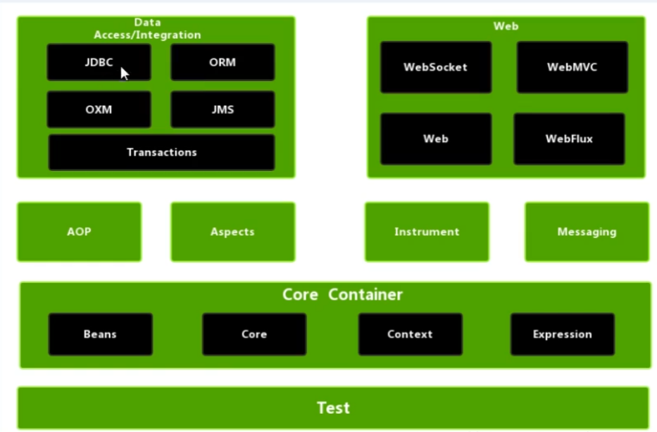
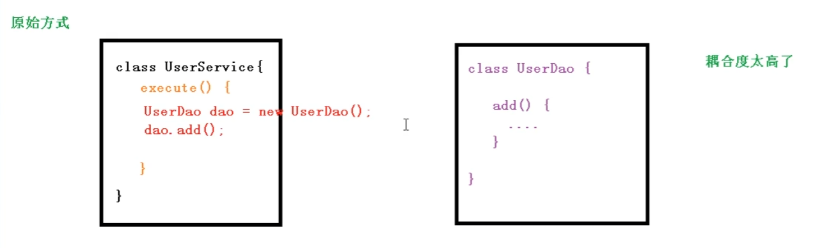
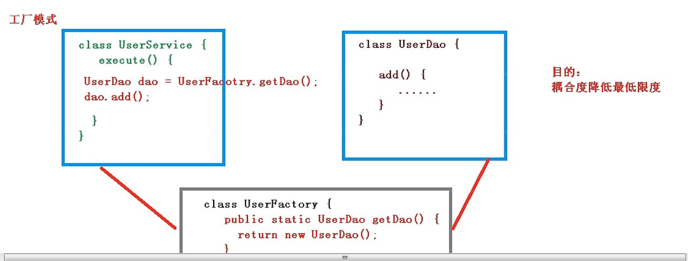
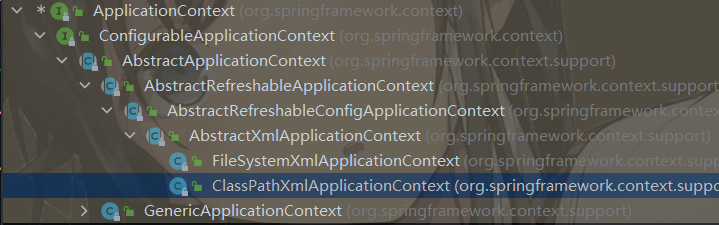
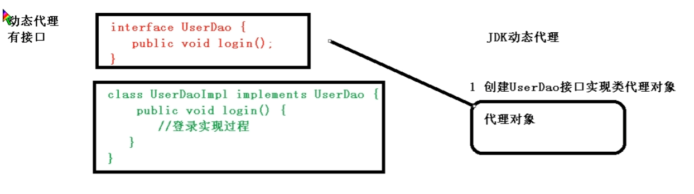
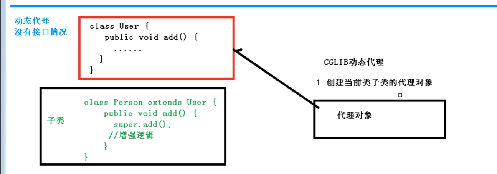
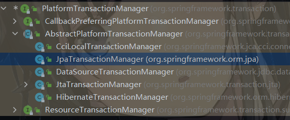
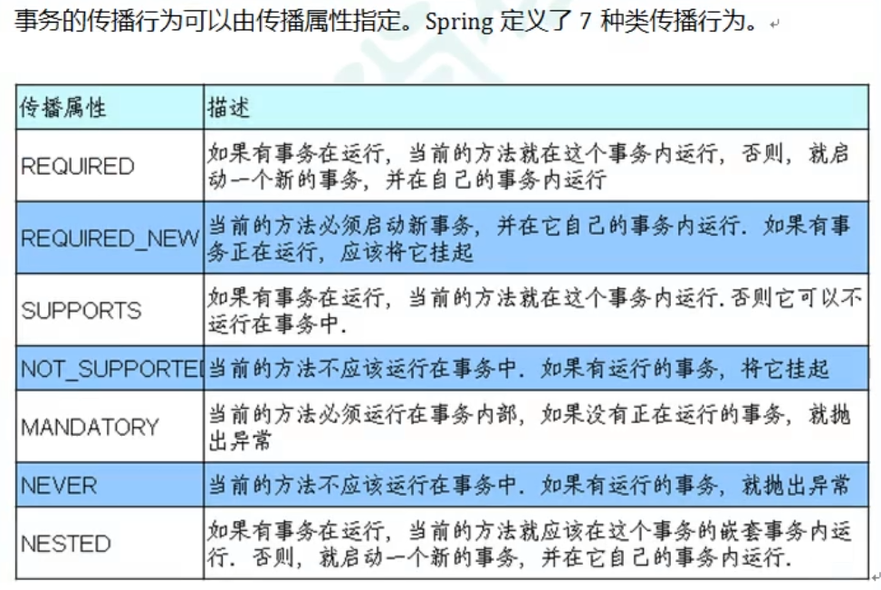
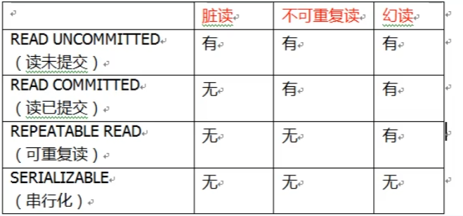

# Spring5框架

## 0注解

```
IOC
	创建Bean对象
	(1)@Component 普通组件
	(2)@Service 【service层】业务层组件
	(3)@Controller 【web层】控制器组件
	(4)@Repository 【dao层】持久层组件
	
	属性注入
	//定义dao属性
	//@Autowired //根据类型进行注入
    //不需要set方法
	//@Qualifier(value="userDaoImpl") //根据名称进行注入
	//一个接口如果有多个实现类,根据名称注入
	//@Resource //根据类型注入
    @Resource(name = "userDaoImpl")//根据名称注入
	private UserDao userDao;
	
	完全注解开发
	 //配置类
        @Configuration //作为配置类，替换xml文件
        @ComponentScan(basePackages = "com.local.spring5.ioc.annotation")//开启组件扫描
        public class SpringConfig {
        }
	
AOP
	@Aspect //表示生成代理对象
	@EnableAspectJAutoProxy(proxyTargetClass = true) //开启AOP功能
```


## 1.Spring

```

1. Spring是轻量级的开源的 J2E 应用程序框架

2. 目的：解决企业应用开发的复杂性

3. Spring框架主要由七部分组成，分别是 Spring Core、 Spring AOP、 Spring ORM、 Spring DAO、Spring Context、 Spring Web和 Spring Web MVC。【核心AOP，IOC】
	(1)IOC: 控制反转,把创建对象过程交给Spring管理
	(2)Aop：面向切面,不修改源代码进行功能增强

4.Spring特点：
	(1)方便解耦，简化开发【IOC】
	(2)AOP编程的支持
	(3)方便程序的测试
	(4)方便和其他框架进行整合
	(5)方便进行事务操作
	(6)降低API开发难度
	(7)Java源码是经典学习范例
	
```



```

演示spring

1.导入jar包

2.创建普通类
public class User {
    public String name;
    public void add(){
        System.out.println("add");
    }
}

3.创建配置文件xml(bean标签)
<?xml version="1.0" encoding="UTF-8"?>
<beans xmlns="http://www.springframework.org/schema/beans"
       xmlns:xsi="http://www.w3.org/2001/XMLSchema-instance"
       xsi:schemaLocation="http://www.springframework.org/schema/beans http://www.springframework.org/schema/beans/spring-beans.xsd">
    <!--配置User对象-->
    <bean id="User" class="com.local.spring5.User"></bean>
</beans>

4.测试代码编写
    @Test
    public void testAdd(){
        //1.加载spring配置文件
        ApplicationContext context = new ClassPathXmlApplicationContext("bean1.xml");
        //2.获取配置创建的对象(里面是xml文件id的值)
        User user = context.getBean("User",User.class);
        user.add();//调用方法
        User user1 = (User)context.getBean("User");
        user1.add();
    }
```

## 2.IOC容器

#### （1）IOC底层原理

```
1.什么是IOC
    控制反转（Inversion of Control，缩写为IoC），是面向对象编程中的一种设计原则，可以用来减低计算机代码之间的耦合度。其中最常见的方式叫做依赖注入（Dependency Injection，简称DI），还有一种方式叫“依赖查找”（Dependency Lookup）。通过控制反转，对象在被创建的时候，由一个调控系统内所有对象的外界实体将其所依赖的对象的引用传递给它。也可以说，依赖被注入到对象中
    (1)控制反转，把对象创建和对象之间的调用过程，交给Spring进行管理
    (2)使用IOC目的，为了耦合度降低

2.IOC底层原理
	(1) xml解析
	(2) 工厂设计模式
	(3) 反射

```






##### IOC原理

```
1. xml配置文件，配置创建的对象
<bean id="" class=" "  ></bean>

2. service类和dao类，创建工厂类
class Factory{
  public static Userdao get(){
  	String classValue = class属性值;//dom4j解析xml
  	Class clazz = Class.forName(classValue);
  	//通过反射创建
  	return (UserDao)class.getConstructor().newInstance();
  }
}
```

##### IOC（接口）

```
1. IOC思想基于IOC容器完成，IOC容器底层就是对象工厂

2. Spring提供了IOC容器实现两种方式【两种接口】
  (1) BeanFactory ：IOC容器基本实现，是Spring内部使用的接口
  特点：加载配置文件时，不会创建对象，在使用时才创建对象
  
  (2) ApplicationContext ：BeanFactory接口的子接口，提供了更多更强大的功能，一般面向开发人员
  特点：加载配置文件时就会把配置文件对象进行创建
  
3. ApplicationContext结构【实现类】
```



```
主要实现类:
  (1)FileSystemXmlApplicationContext【盘路径】
  (2)ClassPathXmlApplicationContext【类路径】
  
```


#### （2）IOCBean管理

```
1. 什么是Bean管理
  (0) Spring创建对象和注入属性

  (1) Spring创建对象
  (2) Spring注入属性
  
2. Bean管理操作有两种方式
  (1) 基于xml配置文件方式实现
  (2) 基于注解方式实现
```


#### （3）IOC操作Bean管理(基于xml)

```
1. 基于xml方式创建对象
<bean id="" class="com.***"></bean>
  (1) 在Spring配置文件中，使用bean标签，标签里添加属性
  (2). bean标签中的属性:
     {1}id属性：给该对象起别名，唯一标识
     {2}class属性：创建对象所在类的全路径
     {3}name属性：类似id，区别name属性可以加特殊字符【比如/】
  
  (3). 创建对象的时候,默认执行无参构造方法

2.基于xml方式注入属性
  (1)DI，依赖注入，注入属性【创建对象的基础上】
  【】第一种注入方式：set方式注入
  【】第二种注入方式：有参构造注入
  
  
  (2)xml配置属性注入【set方法】
  <!--配置User对象-->
    <bean id="User" class="com.local.spring5.bean.User">
    </bean>
    <bean id="User_set" class="com.local.spring5.bean.User">
        <!--使用property完成属性注入-->
        <property name="name" value="张三"/>
        <property name="age" value="20"/>
    </bean>
  
  
```

```java
@Test
//set方法属性注入
public void test2(){
    ClassPathXmlApplicationContext context = new ClassPathXmlApplicationContext("bean1.xml");
    //完成属性的注入
    User user = context.getBean("User_set", User.class);
    System.out.println(user);//User{name=张三,age=20}
    }
```

##### p名称空间注入

```
<beans xmlns="http://www.springframework.org/schema/beans"
       xmlns:xsi="http://www.w3.org/2001/XMLSchema-instance"
       xmlns:p="http://www.springframework.org/schema/p"
       xsi:schemaLocation="http://www.springframework.org/schema/beans http://www.springframework.org/schema/beans/spring-beans.xsd">
       <bean id="User_p" class="com.local.spring5.bean.User" p:name="张三" p:age="20"></bean>
  
</beans>
```

```java
@Test
public void test3(){
    ClassPathXmlApplicationContext context = new ClassPathXmlApplicationContext("bean1.xml");
    //完成属性的注入
    User user = context.getBean("User_p", User.class);
    System.out.println(user);
}
```

```xml
【】第二种注入方式：有参构造注入
<!--有参构造注入属性-->
    <bean id="UserByConstructor" class="com.local.spring5.bean.User">
        <constructor-arg name="name" value="张三"/>
        <constructor-arg name="age" value="20"/>
    </bean>
```

```java
@Test
//有参构造注入属性
public void test3(){
    ApplicationContext context = new ClassPathXmlApplicationContext("bean1.xml");
    User user_constructor = context.getBean("UserByConstructor", User.class);
    System.out.println(user_constructor);//User{name='张三', age=20}
}
```

##### IOC操作Bean管理（xml注入其他类型属性）

```
1. 字面量
  (1)空值null
  	<property name="name">
  	   <null/>
  	</property>
  (2)属性值包含特殊符号
  	1.将<>进行转义 &lt;&gt;
  	2.<![CDATA[...]]>
  	<property name="name">
  		<value>
  			<![CDATA[...]]>
  		</value>
  	</property>
```

##### 注入属性--外部Bean

```xml
(1) 创建service和dao两个对象

(2) service调用dao中的方法【service持有dao对象】

(3) xml配置
<bean id="userDao" class="com.local.spring5.dao.Impl.UserDaoImpl"></bean>

    <bean id="userService" class="com.local.spring5.service.UserService">
        <!--    注入属性
        name属性：类里面属性名称
        ref属性：创建userDao对象bean标签的id值-->
        <property name="userDao" ref="userDao"></property>
    </bean>
```


##### 注入属性--内部Bean和 级联赋值

```
(1) 一对多关系：部门和员工
//员工
class Employee
	String name;
	Dept dept;
//部门
class Dept
	String dname;
	String depton;
```

```xml
<!--内部bean注入-->
    <bean id="Employee" class="com.local.spring5.bean.Employee">
        <property name="name" value="张三"></property>
        <property name="dept">
            <bean id="Dept" class="com.local.spring5.bean.Dept">
                <property name="dname">
                    <value>开发部</value>
                </property>
                <property name="depton" value="001"/>
            </bean>
        </property>
    </bean>
```

##### 注入属性--级联赋值

```xml
<!--在外部bean基础上赋值-->
<!--级联赋值-->

<!--级联赋值-->
    <bean id="emp" class="com.local.spring5.bean.Employee">
        <property name="name" value="张三"></property>
        <property name="dept" ref="dept"/>
        <property name="dept.depton" value="001"/><!--需要get方法-->
    </bean>
    <bean id="dept" class="com.local.spring5.bean.Dept">
        <property name="dname" value="安保部"></property>
    </bean>
```

##### IOC操作输入集合属性

```
1 注入数组类型属性

2 注入List集合类型属性

3 注入Map集合属性

4. 注入set集合属性
```

```xml
<?xml version="1.0" encoding="UTF-8"?>
<beans xmlns="http://www.springframework.org/schema/beans"
       xmlns:xsi="http://www.w3.org/2001/XMLSchema-instance"
       xsi:schemaLocation="http://www.springframework.org/schema/beans http://www.springframework.org/schema/beans/spring-beans.xsd">
<!--    集合类型属性的注入-->
    <bean id="student" class="com.local.spring5.bean.Student">
<!--        数组属性注入-->
        <property name="books">
            <list>
                <value>Java</value>
                <value>C++</value>
                <value>Python</value>
            </list>
        </property>
<!--        list结合属性注入-->
        <property name="score">
            <list>
                <value>90</value>
                <value>80</value>
                <value>70</value>
            </list>
        </property>
<!--        Map类型属性注入-->
        <property name="map">
            <map>
                <entry key="Java" value="90"/>
                <entry key="C++" value="80"/>
                <entry key="Python" value="70"/>
            </map>
        </property>
<!--        set结合注入-->
        <property name="set">
            <set>
                <value>MySQL</value>
                <value>Oracle</value>
            </set>
        </property>
<!--        List<Date>-->
        <property name="dateList">
            <list>
                <ref bean="date1"/>
                <ref bean="date2"/>
            </list>
        </property>
    </bean>
    <bean id="date1" class="java.util.Date"/>
    <bean id="date2" class="java.util.Date">
        <constructor-arg name="year" value="2022"/>
        <constructor-arg name="month" value="5"/>
        <constructor-arg name="date" value="8"/>
    </bean>
</beans>
```

##### 集合操作

```xml
<?xml version="1.0" encoding="UTF-8"?>
<beans xmlns="http://www.springframework.org/schema/beans"
       xmlns:xsi="http://www.w3.org/2001/XMLSchema-instance"
       xmlns:util="http://www.springframework.org/schema/util"
       xsi:schemaLocation="http://www.springframework.org/schema/beans http://www.springframework.org/schema/beans/spring-beans.xsd
                           http://www.springframework.org/schema/util http://www.springframework.org/schema/util/spring-util.xsd">
    <!--名称空间引入-->
    
</beans>
```

```xml
<!--名称空间引入-->
    <!--1.提取list集合类型属性注入-->
    <util:list id="bookList">
        <value>《Spring Boot实战》</value>
        <value>《Java基础》</value>
    </util:list>
    <!--2.注入-->
    <bean id="bookListBean" class="com.local.spring5.bean.Student">
        <property name="books" ref="bookList"/>
    </bean>
```


##### IOC操作Bean管理（FactoryBean）

```
1. Spring中有两种类型的Bean，一种普通bean，另一种工厂bean(FactoryBean)

2. 普通Bean，在配置文件中定义bean类型就是返回类型

3. 工厂bean，在配置文件定义bean可以和返回类型不一样

【第一步】创建类，让这个类为工厂bean，实现接口FactoryBean
【第二部】实现接口里面的方法，在实现的方法中返回bean类型
```

```java
package com.local.spring5.factoryBean;

import com.local.spring5.bean.Student;
import org.springframework.beans.factory.FactoryBean;

/**
 * @author 党
 * @version 1.0
 * 2022/5/10   12:10
 */
public class StudentFactory implements FactoryBean<Student> {
    private StudentFactory(){}
    //定义返回Bean
    @Override
    public Student getObject() throws Exception {
        return new Student();
    }

    @Override
    public Class<?> getObjectType() {
        return null;
    }

    @Override
    public boolean isSingleton() {
        return FactoryBean.super.isSingleton();
    }
}

```

```xml
<bean id="stuFac" class="com.local.spring5.factoryBean.StudentFactory"/>
```

```java
//工厂bean
@Test
public void test9() {
    ApplicationContext context = new ClassPathXmlApplicationContext("bean_factory.xml");
    Student stuFac = context.getBean("stuFac", Student.class);
    System.out.println(stuFac);
}
```

##### Bean作用域

<div>
    1.在spring中，设置创建的bean实例是单实例还是多实例</div>

```java
public void test9() {
    ApplicationContext context = new ClassPathXmlApplicationContext("bean_factory.xml");
    Student stuFac = context.getBean("stuFac", Student.class);
    Student stuFac1 = context.getBean("stuFac", Student.class);
    System.out.println(stuFac1==stuFac);//true
}//默认情况下是单实例对象
```

<div>3.设置单实例还是多实例，bean标签的scope属性</div>

```xml
scope值
1. 默认值  singleton 表示单实例
2. prototype 多实例

<bean scope="prototype" id="stuFac" class="com.local.spring5.factoryBean.StudentFactory"/>
```

<div>singleton和prototype区别</div>

```
【1】singleto 单实例 prototype 多实例
【2】设置scope是singleto时，在加载spring配置文件时候就会创建单实例对象
【3】设置scope是prototype时，在调用getBean方法时，才创建多实例对象
```

```
scope其他值

request：创建对象放入request域中【请求】
session：创建对象放入session域中【会话】
```

##### Bean生命周期

```
【1】生命周期
	(1)从对象创建到对象销毁的过程

【2】bean生命周期
	(1)通过构造器创建bean对象(无参构造器)
	(2)为bean的属性设置值和对其他bean引用(调用set方法)
	(3)调用bean的初始化方法(需要进行配置)
	(4)bean可以使用了(对象获取)
	(5)当容器关闭后，调用bean的销毁方法(配置)
```

```java
package com.local.spring5.bean;

/**
 * @author 党
 * @version 1.0
 * 2022/5/10   12:42
 */
public class Orders {
    private String name;
    public Orders(){
        System.out.println("Orders的无参构造方法");
    }
    public String getName() {
        return name;
    }

    public void setName(String name) {
        System.out.println("Orders的setName方法");
        this.name = name;
    }
    //初始化方法
    public void init(){
        System.out.println("Orders的init方法");
    }
    //销毁方法
    public void destroy(){
        System.out.println("Orders的destroy方法");
    }
}
```

```xml
<bean id="orders" class="com.local.spring5.bean.Orders"
    init-method="init" destroy-method="destroy">
        <property name="name" value="life"/>
    </bean>
```

```java
//bean生命周期
    @Test
    public void test10() {
        ClassPathXmlApplicationContext context = new ClassPathXmlApplicationContext("bean_life.xml");
        Orders order = context.getBean("orders", Orders.class);
        //手动销毁bean
        context.close();
        //Orders的无参构造方法
        //Orders的setName方法
        //Orders的init方法
        //Orders的destroy方法
    }
```

```
【3】bean的后置处理器，bean处理器7步

	(1)通过构造器创建bean对象(无参构造器)
	(2)为bean的属性设置值和对其他bean引用(调用set方法)
	
	【3-】把bean实例传递给bean后置处理器的方法[postProcessBeforeInitialization]
	
	(3)调用bean的初始化方法(需要进行配置)
	
	【3+】把bean实例传递给bean后置处理器的方法[postProcessAfterInitialization]
	
	(4)bean可以使用了(对象获取)
	(5)当容器关闭后，调用bean的销毁方法(配置)
```

```
【4】创建后置处理器
	(1)创建 类 实现 BeanPostProcessor 接口
```

```java
public class BeanPost implements BeanPostProcessor {
    @Override
    public Object postProcessBeforeInitialization(Object bean, String beanName) throws BeansException {
        System.out.println("初始化之前");
        return bean;
    }
    @Override
    public Object postProcessAfterInitialization(Object bean, String beanName) throws BeansException {
        System.out.println("初始化之后");
        return bean;
    }
}
```

```
(2)配置文件
```

```xml
<bean id="orders2" class="com.local.spring5.bean.Orders"
      init-method="init" destroy-method="destroy">
    <property name="name" value="life"/>
</bean>
<!--添加后置处理器
当前文件中所有都会配置-->
<bean id="beanPost" class="com.local.spring5.bean.BeanPost"/>
```

```java
@Test
public void test11() {
    ClassPathXmlApplicationContext context = new ClassPathXmlApplicationContext("bean_life.xml");
    Orders order = context.getBean("orders2", Orders.class);
    //手动销毁bean
    context.close();
    //Orders的无参构造方法
    //Orders的setName方法
    //初始化之前
    //Orders的init方法
    //初始化之后
    //使用Orders
    //Orders的destroy方法
}
```

##### Bean管理（xml自动装配）

```
1. 什么是自动装配
  【1】根据指定装配规则(属性名或者属性类型)，Spring自动将匹配的属性值进行注入
 
```

```xml
<!--自动装配
bean的autowire属性
byName根据名称注入，注入bean的id值和类属性名称一样
byType根据属性类型注入-->
<bean autowire="byName" id="employee" class="com.local.spring5.bean.Employee"/>
<bean id="dept" class="com.local.spring5.bean.Dept">
    <constructor-arg name="depton" value="0001"/>
    <constructor-arg name="dname" value="安保部"/>
</bean>
```

```java
@Test
public void test12() {
    ClassPathXmlApplicationContext context = new ClassPathXmlApplicationContext("bean_auto.xml");
    Employee employee = context.getBean("employee", Employee.class);
    System.out.println(employee);
    //Employee{name='null', dept=Dept{depton='0001', dname='安保部'}}
}
```

##### Bean操作外部属性文件

```xml
<!--Druid-->
    <bean id="dataSource" class="com.alibaba.druid.pool.DruidDataSource">
        <property name="driverClassName" value="com.mysql.jdbc.Driver"/>
        <property name="url" value="jdbc:mysql://localhost:3306/study"/>
        <property name="username" value="root"/>
        <property name="password" value="root"/>
    </bean>
    <!--引入外部properties属性文件-->
    <!--1.更改命名空间-->
<!--    2.引入外部属性文件-->
    <context:property-placeholder location="classpath:resource/properties/jdbc.properties"/>
<!--    3.配置连接池-->
    <bean id="dataSource2" class="com.alibaba.druid.pool.DruidDataSource">
<!--        ${key}-->
        <property name="driverClassName" value="${driverClassName}"/>
        <property name="url" value="${url}"/>
        <property name="username" value="${username}"/>
        <property name="password" value="${password}"/>
    </bean>
```


#### （4）IOC操作Bean管理(基于注解)

```
【1】 什么是注解
  	(1)注解是代码特殊标记，格式：@注解名称(属性名称=属性值,属性名称=属性值..)
  	(2)使用注解：注解作业在 类，属性，方法上面
  	(3)注解目的：简化xml配置

【2】 Spring针对Bean管理创建对象提供注解
	(1)@Component 
	(2)@Service 【service层】
	(3)@Controller 【web层】
	(4)@Repository 【dao层】
***以上4个注解功能一样，都可以用来创建bean实例

【3】基于注解方式实现对象创建
	1 引入依赖 spring-aop  jar
	
	2 开启组件扫描
	<!--开启组件扫描
    如果扫描多个包，使用逗号隔开-->
    <context:component-scan base-package="com.local.spring5.ioc.annotation" />
    
    3 创建类，在类上添加注解
```

```java
@Component(value = "userService")
//<bean id="",class=""/>
//id等价于value
//注解中value属性值可以不写,默认类名首字母小写
public class UserService {
    public void addUser() {
        System.out.println("addUser");
    }
}
```

```java
@Test
    public void test1() {
        ClassPathXmlApplicationContext context = new ClassPathXmlApplicationContext("resource/annotation/bean.xml");
        UserService userService = context.getBean("userService", UserService.class);
        userService.addUser();
    }
```

```xml
【4】开启组件扫描配置
<!--扫描组件
    使用默认的 filter 扫描包中所有内容-->
    <context:component-scan base-package="com.local.spring5.ioc.annotation" />

    <!--实例一-->
    <!--不使用默认的 filters 扫描
    默认的 filters 扫描包中的所有内容-->
    <context:component-scan base-package="com.local.spring5.ioc.annotation" use-default-filters="false">
<!--        只扫描annotation 中的 Component注解 -->
        <context:include-filter type="annotation" expression="org.springframework.stereotype.Component"/>
    </context:component-scan>

    <!--实例二-->
    <!--使用默认的 filters 扫描所有-->
    <context:component-scan base-package="com.local.spring5.ioc.annotation">
<!--        不扫描annotation 中的 Component注解 -->
        <context:exclude-filter type="annotation" expression="org.springframework.stereotype.Component"/>
    </context:component-scan>

```

##### 注解方式，属性注入

```
1 提供的注解
  【1】@AutoWired 根据属性类型进行注入
  1. 创建service【service】和dao【Repository】对象，添加注解
  2. 在service注入dao对象，在service类添加dao属性，在属性上添加【AutoWired】注解
  
```

```java
public class UserService {
    //定义dao属性
    @Autowired //根据类型进行注入
    //不需要set方法
    private UserDao userDao;

    public void add() {
        System.out.println("UserService.add()");
        userDao.add();
    }
}
```

```
  【2】@Qualifier 根据属性名称进行注入
  Qualifier注解的使用和上面AutoWired一起使用
```

```java
public class UserService {
    //定义dao属性
    @Autowired //根据类型进行注入
    //不需要set方法
    @Qualifier(value="userDaoImpl") //根据名称进行注入
    /*一个接口如果有多个实现类,根据名称注入*/
    private UserDao userDao;

    public void add() {
        System.out.println("UserService.add()");
        userDao.add();
    }
}
```

```
【3】@Resource 可以根据类型注入也可以根据名称注入
 
```

```java
public class UserService {
    //定义dao属性
//    @Autowired //根据类型进行注入
//    //不需要set方法
//    @Qualifier(value="userDaoImpl") //根据名称进行注入
//    /*一个接口如果有多个实现类,根据名称注入*/

//    @Resource //根据类型注入
    @Resource(name = "userDaoImpl")//根据名称注入
    private UserDao userDao;

    public void add() {
        System.out.println("UserService.add()");
        userDao.add();
    }
}
```

```
【4】@Value 注入普通类型属性
```

```java
@Value(value = "张三")//普通类型属性注入
    private String name;
    public void add() {
        System.out.println("UserService.add()");
        System.out.println(name);
        userDao.add();
    }
```

##### 完全注解开发

```java
【1】创建配置类，替换xml

        //配置类
        @Configuration //作为配置类，替换xml文件
        @ComponentScan(basePackages = "com.local.spring5.ioc.annotation")//开启组件扫描
        public class SpringConfig {
        }
```

```java
【2】编写测试类
//完全注解开发
    @Test
    public void test3(){
        ApplicationContext context = new AnnotationConfigApplicationContext(SpringConfig.class);
        context.getBean("userService",UserService.class).add();
    }
```

## 3.Aop

#### AOP概念

```
    在软件业，AOP为Aspect Oriented Programming的缩写，意为：面向切面编程，通过预编译方式和运行期间动态代理实现程序功能的统一维护的一种技术。AOP是OOP的延续，是软件开发中的一个热点，也是Spring框架中的一个重要内容，是函数式编程的一种衍生范型。利用AOP可以对业务逻辑的各个部分进行隔离，从而使得业务逻辑各部分之间的耦合度降低，提高程序的可重用性，同时提高了开发的效率。
    
【1】什么是AOP
	1 面向切面编程，利用AOP可以对业务逻辑的各个部分进行隔离，从而使得业务逻辑各部分之间的耦合度降低，提高程序的可重用性，同时提高了开发的效率。
	2 不通过修改源代码方式，往主干功能中添加新功能
```


#### AOP底层原理

```
【1】使用动态代理
    1 有接口的清空，使用JDK动态代理
    【创建接口类代理对象，增强类的方法】
    
    2 没有接口，使用CGLIB动态代理
```






#### AOP（JDK动态代理）

```
class Proxy
【1】调用newProxyInstance(ClassLoader loader, 类<?>[] interfaces, InvocationHandler h)
第一个参数：类加载器
第二个参数：增强方法所在的类，这个类实现的接口，支持多个接口
第三个参数：实现这个接口，创建代理对象，写增强的方法

```

```java
public class JDKProxy {
    public static void main(String[] args) {
        //创建接口实现类的代理对象
        Class[] interfacez = new Class[]{UserDao.class};
        UserDao userDao = new UserDaoImpl();
        //得到代理对象
        UserDao o = (UserDao)Proxy.newProxyInstance(JDKProxy.class.getClassLoader(), interfacez, new UserDaoProxy(userDao));
        int add = o.add(1, 2);
        System.out.println(add);
    }
}
class UserDaoProxy implements InvocationHandler{
    //创建谁的代理对象，把谁传进来
    private Object obj;
    public UserDaoProxy(Object obj){
        this.obj = obj;
    }

    //增强的逻辑
    @Override
    public Object invoke(Object proxy, Method method, Object[] args) throws Throwable {
        //方法之前
        System.out.println(method.getName()+"方法开始执行"+ Arrays.toString(args));
        //被增强的方法
        Object res = method.invoke(obj, args);//反射
        //方法之后
        System.out.println("方法之后"+obj.toString());
        return res;
    }
}
```

#### AOP（术语）

```
【1】 连接点
	类中哪些方法可以被增强，这些方法称为连接点

【2】 切入点
	实际真正被增强的方法
	
【3】 通知(增强)
	(1)实际增强的逻辑部分称为通知  (增强)
	(2)通知有多种类型
	* 前置通知 //方法之前执行
	* 后置通知 //方法之后执行
	* 环绕通知 //方法之前之后都执行
	* 异常通知 //方法异常执行
	* 最终通知 //afterReturning 有异常不执行
	
【4】 切面
	(1) 把通知应用到切入点的过程
	
```

#### AOP操作（准备）

```
【1】Spring框架柱一般基于AspectJ实现AOP操作
	(1)什么是AspectJ
	* AspectJ 不是Spring组成部分，独立AOP框架，一般把AspectJ和Spring框架一起使用，进行AOP操作
	
【2】基于AspectJ实现AOP操作
	(1)基于xml配置文件
	(2)基于注解方式(使用)
	
【3】在项目共工程引入依赖

【4】切入点表达式
	(1) 切入点表达式作用，指代对哪个类里面哪个方法进行增强
	(2)语法结构
	execution([权限修饰符] [返回类型] [类全路径] [方法名称] [参数列表])
	权限修饰符 可以写 * ,所有方法 * ,参数(..) 返回类型可以不写
	对包中的所有类,所有方法进行增强
	execution(* com.local.spring5.* *(..))
```

#### AOP操作（AspectJ注解）

```
【1】创建一个类，被增强类
【2】创建增强类(编写增强逻辑)
	不通的方法，代表不通的增强逻辑
【3】进行通知的配置
	(1)开启注解扫描
	(2)使用注解，创建User，UserProxy对象
	(3)在增强类添加注解@Aspect
	(3)在spring配置文件中开启生成代理对象

【4】配置不通类型的通知
	(1)在增强类的里面，在作为通知方法上面添加通知类型注解，并写上切入点表达式
```

#### AOP操作（AspectJ配置文件）

```
<!--    开启注解扫描-->
    <context:component-scan base-package="com.local.spring5.aop.JAspectJ.annotation"/>
<!--    开启AspectJ生成代理对象-->
    <aop:aspectj-autoproxy/>
```

```java
//被增强类
@Component(value = "user")
public class User {
    public void add(){
        System.out.println("add...");
    }
}
```

```java
@Component("userProxy")
@Aspect //表示生成代理对象
//增强类
public class UserProxy {
    @Before("execution(* com.local.spring5.aop.JAspectJ.annotation.User.add())")
    public void before(){
        System.out.println("前置通知");
    }
    @Around(value = "execution(* com.local.spring5.aop.JAspectJ.annotation.User.add())")
    public void around(ProceedingJoinPoint proceedingJoinPoint) throws Throwable {
//        System.out.println("环绕通知");
        System.out.println("环绕之前");

        //被增强的方法
        proceedingJoinPoint.proceed();

        System.out.println("环绕之后");
    }
}
```

```java
@Test
public void test1(){
    ClassPathXmlApplicationContext context = new ClassPathXmlApplicationContext("resource/xml/bean.xml");
    User user = context.getBean("user", User.class);
    user.add();
}
//环绕之前
//前置通知
//add...
//环绕之后
//后置通知
//返回通知

```

```java
【5】公共切入点抽取
	//相同切入点抽取
    @Pointcut("execution(* com.local.spring5.aop.JAspectJ.annotation.User.add())")
    public void pointcut() {

    }

    @Before("pointcut()")
    public void before() {
        System.out.println("前置通知");
    }

【6】多个增强类对同一个方法进行增强，设置增强类优先级
    (1)在增强类上面添加@Order(值)，值越小优先级越高
@Component("userProxy")
@Aspect //表示生成代理对象
@Order(1)
public class UserProxy
    
@Component //创建对象
@Aspect //表示生成代理对象
@Order(2) //指定生成代理对象的顺序
public class PersonProxy
```


#### AOP操作（AspectJ配置文件）

```
【1】
创建一个增强类，一个被增强类

【2】
配置文件中创建两个对象

【3】在spring创建切入点
```

```xml
<!--    创建对象-->
    <bean id="book" class="com.local.spring5.aop.JAspectJ.xml.Book"/>
    <bean id="bookProxy" class="com.local.spring5.aop.JAspectJ.xml.BookProxy"/>
<!--    配置切入点设置-->
    <aop:config>
<!--        切入点-->
        <aop:pointcut id="p" expression="execution(* com.local.spring5.aop.JAspectJ.xml.Book.buy(..))"/>
<!--        配置切面-->
        <aop:aspect ref="bookProxy">
<!--            增强在具体的方法上-->
            <aop:before method="before" pointcut-ref="p"/>
        </aop:aspect>
    </aop:config>
```

```java
//被增强类
public class Book {
    public void buy() {
        System.out.println("buy...");
    }
}
```

```java
//增强类
public class BookProxy {
    public void before(){
        System.out.println("before");
    }
}
```

```java
public void test(){
    ClassPathXmlApplicationContext context = new ClassPathXmlApplicationContext("resource/xml/AspectJ_xml.xml");
    Book book = context.getBean("book",Book.class);
    book.buy();
    //before
    //buy...
}
```


#### AOP完全注解开发

```java
@Configuration //配置类
@ComponentScan //开启注解扫描
@EnableAspectJAutoProxy(proxyTargetClass = true) //开启AOP功能
public class SpringConfig {
}
```


## 4.JdbcTemplate

#### 1.JdbcTemplate概念

```xml
1. 什么是JdbcTemplate
	【1】Spring框架对JDBC进行封装，使用JdbcTemplate方便实习对数据库操作


2 准备工作
	【1】引入相关依赖spring-tx,spring-jdbc,druid,mysql-connect,spring-orm
	【2】在spring配置文件配置druid配置xml文件
	【3】配置DruidTemplate
	<!--    配置druid连接池-->
<!--    1.引入外部文件-->
    <context:property-placeholder location="classpath:resource/properties/jdbc.properties"/>
    <bean id="druidDataSource" class="com.alibaba.druid.pool.DruidDataSource">
        <property name="driverClassName" value="${driverClassName}"/>
        <property name="url" value="${url}"/>
        <property name="username" value="${username}"/>
        <property name="password" value="${password}"/>
    </bean>
<!--    创建JdbcTemplate实例-->
    <bean id="jdbcTemplate" class="org.springframework.jdbc.core.JdbcTemplate">
<!--        注入DateSource-->
        <property name="dataSource" ref="druidDataSource"/>
    </bean>
```

```
【4】创建Service，dao类，在dao中注入jdbcTemplate对象

1.开启组件扫描
2.service中持有dao对象
3.dao注入jdbcTemplate
```

```java
public class BookDaoImpl implements BookDao {
    //注入JdbcTemplate,在xml配置文件中
    @Autowired
    @Qualifier("jdbcTemplate")
    private JdbcTemplate jdbcTemplate;
}
```

```java
public class BookService {
    @AutoWired
    @Qualifier("bookDaoImpl")
    private BookDao bookDao;
}
```

#### JdbcTemplate操作

```xml
【1】引入相关的jar包
【2】配置xml文件
<!--    配置druid连接池-->
<!--    1.引入外部文件-->
    <bean id="druidDataSource" class="com.alibaba.druid.pool.DruidDataSource">
        <property name="driverClassName" value="com.mysql.jdbc.Driver"/>
        <property name="url" value="jdbc:mysql://localhost:3306/study"/>
        <property name="username" value="root"/>
        <property name="password" value="root"/>
    </bean>
<!--    创建JdbcTemplate实例-->
    <bean id="jdbcTemplate" class="org.springframework.jdbc.core.JdbcTemplate">
<!--        注入DateSource，使用set方法注入-->
        <property name="dataSource" ref="druidDataSource"/>
    </bean>

<!--    开启组件扫描-->
    <context:component-scan base-package="com.local.spring5.JdbcTemplate"/>
```

```
【3】xml配置JdbcTemplate对象，注入dateSource
【4】创建service和dao类，dao类持有JdbcTemplate对象
```

```java
public class DeptDaoImpl implements DeptDao {
    //注入JdbcTemplate,在xml配置文件中
    @Autowired
    @Qualifier("jdbcTemplate")
    private JdbcTemplate jdbcTemplate;

    public int add(Dept dept){
        String sql = "insert into dept values(?,?,?)";
        return jdbcTemplate.update(sql, dept.getDepton(), dept.getDname(), dept.getLoc());
    }
}
```

```java
@Component(value = "deptService")
public class DeptService {
    @Autowired
    @Qualifier("deptDaoImpl")
    private DeptDao deptDao;
    public void add(Dept dept){
        int add = deptDao.add(dept);
        System.out.println("添加了"+add+"条数据");
    }
}
```

```java
public class TestDemo {
    private static DeptService deptService;
    static {
        ClassPathXmlApplicationContext context = new ClassPathXmlApplicationContext("resource/xml/jdbcTemplate.xml");
        deptService = context.getBean("deptService", DeptService.class);
    }
    @Test
    public void addDept() {
        deptService.add(new Dept(11,"开发部","开发部"));
    }
    @Test
    public void delete(){
        deptService.delete(11);
    }

}
```

#### JdbcTemplate查询

##### 1. 单个数据

```java
jdbcTemplate.quertForObject()

public Object queryCount() {
        String sql="select count(*) from dept";
        Integer integer = jdbcTemplate.queryForObject(sql, Integer.class);
        return integer;
    }
```


##### 2.单行记录

```java
<T> T queryForObject(String var1, RowMapper<T> var2, @Nullable Object... var3)

RowMapper<T>是一个接口，完成数据的封装


public Object queryForOne(Integer depton){
        String sql="select * from dept where depton=?";
        return jdbcTemplate.queryForObject(sql,new BeanPropertyRowMapper<Dept>(Dept.class),depton);
    }
```


##### 3. 多行记录

```java
<T> T query(String var1, RowMapper<T> var2, @Nullable Object... var3)


public List<Dept> queryForList() {
        String sql = "select * from dept";
        return jdbcTemplate.query(sql, new BeanPropertyRowMapper<>(Dept.class));
    }
```


#### JdbcTemplate批量操作

```
【1】批量操作就是操作表中的多条数据

batchUpdate(String sql, List<Object[]> batchArgs)
```

```java
@Component("deptDaoImpl")
public class DeptDaoImpl implements DeptDao {
    //注入JdbcTemplate,在xml配置文件中
    @Autowired
    @Qualifier("jdbcTemplate")
    private JdbcTemplate jdbcTemplate;

    public int add(Dept dept){
        String sql = "insert into dept values(?,?,?)";
        return jdbcTemplate.update(sql, dept.getDepton(), dept.getDname(), dept.getLoc());
    }
    @Override
    public int delete(Integer depton) {
        String sql="delete from dept where depton=?";
        return jdbcTemplate.update(sql,depton);
    }
    //查询单个数据
    @Override
    public Object queryCount() {
        String sql="select count(*) from dept";
        Integer integer = jdbcTemplate.queryForObject(sql, Integer.class);
        return integer;
    }
    //查询单个对象
    public Object queryForOne(Integer depton){
        String sql="select * from dept where depton=?";
        return jdbcTemplate.queryForObject(sql, new BeanPropertyRowMapper<>(Dept.class),depton);
    }
    //多个对象查询
    public List<Dept> queryForList() {
        String sql = "select * from dept";
        return jdbcTemplate.query(sql, new BeanPropertyRowMapper<>(Dept.class));
    }

    //======================批量操作
    //批量添加
    public void batchAdd(List<Object[]> list){
        jdbcTemplate.batchUpdate("insert into dept values(?,?,?)",list);
    }
    //批量删除
    public int[] batchDelete(List<Object[]> list){
        int[] ints = jdbcTemplate.batchUpdate("delete from dept where depton=?", list);
        return ints;
    }
    //批量更新
    public int[] batchUpdate(List<Object[]> batchArgs){
        int[] ints = jdbcTemplate.batchUpdate("update dept set dname=?,loc=? where depton=?", batchArgs);
        return ints;
    }

}
```


## 5.事务管理


#### 事务概念

```
【1】什么是事务
	1. 是数据库操作的最基本单元，逻辑上的一组操作，要么都成功，要么都失败
	2. 事务特性（ACID）
		原子性：不可分割，都成功 / 都失败
		一致性：操作前后总量不变
		隔离性：多事务操作不会产生影响
		持久性：事务提交后对数据库的影响是永久的
		
```


#### 事务操作（环境）

```java
@Component
public class UserDaoImpl implements UserDao {
    @Autowired
    @Qualifier("jdbcTemplate")
    private JdbcTemplate jdbcTemplate;
    public int updateMoney(Integer money, String name) {
        return jdbcTemplate.update("update t_user set money = money + ? where name = ?", money, name);
    }
}


@Component
public class UserService {
    @Autowired
    @Qualifier("userDaoImpl")
    private UserDao userDao;
    //转账
    public void accountMoney(){
        //lucy少100元
        userDao.updateMoney(-100,"lucy");

        //jack多100元
        userDao.updateMoney(100,"jack");
    }
}

```


#### Spring事务管理介绍

```
【1】事务添加到JavaEE三层结构里面的Service层( 业务逻辑层 )

【2】Spring进行事务管理操作方式
	(1)编程式事务管理 和  声明式事务管理
	
【3】声明是管理事务
	(1)基于注解方式
	(2)基于xml配置文件方式

【4】Spring进行声明式事务管理，底层使用AOP原理

【5】Spring事务管理API
	(1) 提供一个接口，代表事务管理器PlatformTransactionManager
	(2) 实现类：
```



```
Jdbc框架使用 DataSourceTransactionManager
```


#### 事务操作（注解方式）

```
【1】xml配置事务管理器，注入dataSource

<bean id="dataSourceTransactionManager" class="org.springframework.jdbc.datasource.DataSourceTransactionManager">
        <property name="dataSource" ref="dataSource"/>
    </bean>
    
 【2】开启事务注解
 引入tx命名空间
 <tx:annotation-driven transaction-manager="dataSourceTransactionManager"/>
 
 【3】在service类上面添加事务注解
 
 (1)@Transactional 可以在类上或者方法上
 (2)类上代表所有方法加事务
```


#### 事务操作（声明式事务管理参数配置）

```
【1】在service类上添加注解@Transactional，在这个注解上可以配置事务相关参数

@Transactional
```

```java
public @interface Transactional {
   String value() default "";
   @AliasFor("value")
   String transactionManager() default "";
    //1.事务传播行为
   Propagation propagation() default Propagation.REQUIRED;
    //2.隔离离别
   Isolation isolation() default Isolation.DEFAULT;
    //3.超时时间
   int timeout() default TransactionDefinition.TIMEOUT_DEFAULT;
   //4.是否只读
    boolean readOnly() default false;
   Class<? extends Throwable>[] rollbackFor() default {};
   //5.回滚
    String[] rollbackForClassName() default {};
   Class<? extends Throwable>[] noRollbackFor() default {};
   //6.不回滚
    String[] noRollbackForClassName() default {};
}
```

```
【1】propagation：事务传播行为
	(1)多事务方法直接进行调用，这个过程中事务如何处理
```



```
【2】isolation 事务隔离级别 
(1)问题：脏读 ， 不可重复度 ， 幻读
	脏读：一个未提交事务读取到另一个未提交事务
	不可重复度：一个未提交事务读取到另一个已提交事务修改了的数据
	幻读：一个未提交事务读取到另一个已提交事务添加了的数据
```



```
【4】timeout 超时时间
	(1)设置事务在多久时间内提交，如果不提交就回滚
	(2)默认值是 -1 ,不超时
	
【5】readOnly 是否只读
	(1) 读：查询操作
	(2) 写：添加，修改，删除操作
	(3) 默认：false
	
【6】rollbackForClassName：回滚
	设置出现哪些异常进行事务回滚

【6】noRollbackForClassName
	设置出现哪些异常不进行回滚
```


#### 事务操作（声明式事务管理xml）

```
1. 在Spring配置文件中进行配置
第一步配置事务管理器

第二部配置通知

第三步配置切入点和切面
```

```xml
<!-- Transaction Manager -->
    <bean id="dataSource" class="com.alibaba.druid.pool.DruidDataSource">
        <property name="driverClassName" value="com.mysql.jdbc.Driver"/>
        <property name="url" value="jdbc:mysql://localhost:3306/spring5"/>
        <property name="username" value="root"/>
        <property name="password" value="root"/>
    </bean>
<!--    1.配置事务管理-->
    <bean id="dataSourceTransactionManager" class="org.springframework.jdbc.datasource.DataSourceTransactionManager">
        <property name="dataSource" ref="dataSource"/>
    </bean>

<!--    2.配置通知-->
    <tx:advice id="txAdvice">
<!--        配置事务相关参数-->
        <tx:attributes>
<!--            指定哪种规则的方法上添加事务-->
<!--           以insert开头的添加事务 -->
            <tx:method name="insert*" propagation="REQUIRED" isolation="REPEATABLE_READ"/>
            <tx:method name="update*" propagation="REQUIRED"/>
        </tx:attributes>
    </tx:advice>

<!--    配置切入点和切面-->
    <aop:config>
<!--        配置切入点-->
        <aop:pointcut id="cut" expression="execution(* com.local.spring5.Transaction.service.UserService.*(..))"/>
<!--        配置切面  advice-ref通知-->
        <aop:advisor advice-ref="txAdvice" pointcut-ref="cut"/>
    </aop:config>
```


#### 完全注解开发（声明式事务管理）

```
【1】配置类
```

```java
@Configuration //配置类
@ComponentScan(basePackages = "com.local.spring5.Transaction") //组件扫描
@EnableTransactionManagement //开启事务管理

public class SpringConfig {
    //创建数据库连接池
    @Bean
    public DruidDataSource druidDataSource(){
        DruidDataSource dataSource = new DruidDataSource();
        dataSource.setUrl("jdbc:mysql://localhost:3306/spring5");
        dataSource.setUsername("root");
        dataSource.setPassword("root");
        dataSource.setDriverClassName("com.mysql.jdbc.Driver");
        return dataSource;
    }
    @Bean
    //创建JdbcTemplate
    public JdbcTemplate jdbcTemplate(DataSource dataSource){
        JdbcTemplate jdbcTemplate = new JdbcTemplate();
        jdbcTemplate.setDataSource(dataSource);
        return jdbcTemplate;
    }
    @Bean
    //创建事务管理器，会自动找到dataSource注入
    public DataSourceTransactionManager dataSourceTransactionManager(DataSource dataSource){
        DataSourceTransactionManager dataSourceTransactionManager = new DataSourceTransactionManager();
        dataSourceTransactionManager.setDataSource(dataSource);
        return dataSourceTransactionManager;
    }
}
```


## 6.Spring5新特性


```
【1】Spring5整个框架 基于java8，运行时兼容JDK9，不建议的类删除

【2】Spring5框架自带了通用的日志封装
	（1）Spring5移除了Log4jConfigListener，官方建议Log4j2
	（2）Spring5框架整合了Log4j2
```

```
第一步 引入jar包

第二步 log4j2.xml(固定名称)[放到src目录下]
```

```xml
<?xml version="1.0" encoding="UTF-8"?>
<!--日志级别以及优先级排序:OFF > FATAL > ERROR > WARN > DEBUG > TRACE > ALL -->
<!--configuration后面的status用于设置log4j2自身内部的信息输出，可以不设置，当设置成trace时，可以看到log4j2内部各种详细输出-->
<configuration status="INFO">
<!--    先定义所有的appender-->
    <appenders>
<!--        输出日志信息控制台-->
        <console name="console" target="System.out">
<!--            控制日志输出的模式-->
            <PatternLayout pattern="%d{yyyy-MM-dd HH:mm:ss} %-5p [%t] %c{1}: %m%n" />
        </console>
    </appenders>
<!--    然后定义logger，只要定义了logger并引入的appender，appender才会生效-->
<!--    root：用于指定项目的根日志，如果没有单独指定logger，则会使用root作为默认的日志输出-->
    <loggers>
        <root level="info">
            <appender-red ref="console" />
        </root>
    </loggers>

</configuration>
```

#### 手动输出日志

```java
//演示log4j2的使用
public class LogDemo {
    private static final Logger log = LoggerFactory.getLogger(LogDemo.class);
    //手动输出日志
    public static void main(String[] args) {
        log.debug("hello debug");
        log.error("hello error");
    }
}
```


#### Spring5核心容器支持@Nullable注解

```
【1】@Nullable注解可以使用在方法，属性，参数上面，表示可以为空
【2】用在方法上，表示返回值可以为null
【3】参数上面，表示参数可以为null
【3】用在属性上，表示属性可以为null
```


#### Spring5核心容器支持函数式式风格

```
public void testGenericApplicationContext(){
        //创建GenericApplicationContext对象·
        GenericApplicationContext context = new GenericApplicationContext();
        //注册调用context方法进行注册
        context.refresh();//清空
        context.registerBean(User.class,()-> new User());
        //获取在spring中注册的对象
        User bean = (User)context.getBean("com.local.spring5.Transaction.pojo.User");
        context.registerBean("user1",User.class,()-> new User());
        User user1 = context.getBean("user1", User.class);
    }
```


#### Spring5支持整合JUnit5

```java
【1】引入Spring中相关的依赖spring-test
【2】创建测试类
@RunWith(SpringJUnit4ClassRunner.class) //单元测试框架
@ContextConfiguration("classpath:resource/xml/bean1.xml") //加载配置文件
public class Jtest4 {
    @Autowired
    private User user;
    
    @Test
    public void test(){
        System.out.println(user);
    }
}

```


#### Spring5    SpringWebFlux

##### 1.介绍


##### 2. 响应式编程


##### 3.WebFlux执行流程和核心API


##### 4.SpringWebFlux （基于注解）


##### 5.SpringWebFlux（基于函数式编程）


