[TOC]


## 一、cloud组件说明

| 组件功能     | 不推荐（停更，可用） | 推荐                                     |
| ------------ | -------------------- | ---------------------------------------- |
| 服务注册中心 | Eureka               | Zookeeper，Consul，Nacos                 |
| 服务调用     | Feign                | OpenFeign                                |
| 负载均衡     | Ribbon               | LoadBalancer                             |
| 服务降级     | Hystrix              | resilience6j，Sentienl（alibaba)（推荐） |
| 服务网关     | Zuul                 | Gateway                                  |
| 服务配置     | Config               | Nacos（alibaba）                         |
| 服务总线     | Bus                  | Nacos                                    |


## 二、RestTemplate

### 2.1、注入

```java
@Configuration
public class ApplicationContextConfig {
    @Bean
    public RestTemplate getRestTemplate(){
        return new RestTemplate();
    }
}
```


### 2.2、服务间调用

```java
@Autowired
private RestTemplate restTemplate;
private String url = "http://localhost:8001/payment/";

@GetMapping("/create")
public Result create(@RequestBody Payment payment) {
    return restTemplate.postForObject(url + "payment/create", payment, Result.class); // 发送post请求
}

@GetMapping("/getPaymentById/{id}")
public Result getPaymentById(@PathVariable String id) {
    return restTemplate.getForObject(url + "payment/getPaymentById/" + id, Result.class); // 发送get请求
}
```


## 三、Eureka

### 3.1、服务治理

Spring Cloud封装了Netflix 公司开发的[Eureka](https://fanyi.baidu.com/#en/zh/eureka)模块来实现服务治理
		在传统的rpc远程调用框架中，管理每个服务与服务之间依赖关系比较复杂，管理比较复杂，所以需要使用服务治理，**管理服务于服务之间依赖关系**，可以实现服务调用、负载均衡、容错等，实现服务发现与注册。


### 3.2、服务支持与发现

​		Eureka采用了CS的设计架构，Eureka Server作为服务注册功能的服务器，它是服务注册中心。而系统中的其他微服务，使用Eureka的客户端连接到 Eureka Sever并维持心跳连接。这样系统的维护人员就可以通过Eureka Server来监控系统中各个微服务是否正常运行。
​		在服务注册与发现中，有一个注册中心。当服务器启动的时候，会把当前自己服务器的信息比如服务地址通讯地址等以别名方式注册到注册中心上。另一方(消费者服务提供者)，以该别名的方式去注册中心上获取到实际的服务通讯地址，然后再实现本地RPC调用RPC远程调用框架核心设计思想:在于注册中心，因为使用注册中心管理每个服务与服务之间的一个依赖关系(服务治理概念)。在任何rpc远程框架中，都会有一个注册中心(存放服务地址相关信息(接口地址)


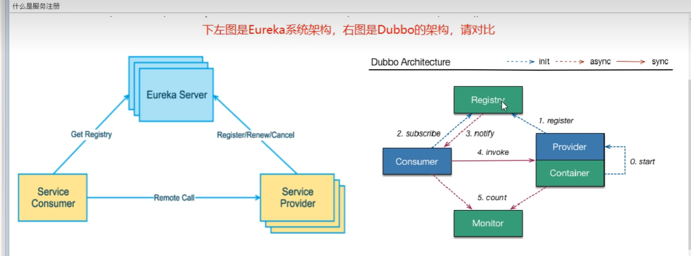


### 3.3、Eureka组件：Eureka Service 和 Eureka Client

**Eureka Server**提供服务注册服务
		各个微服务节点通过配置启动后，会在EurekaServer中进行注册，这样EurekaServer中的服务注册表中将会存储所有可用服务节点的信息，服务节点的信息可以在界面中直观看到。
**EurekaClient**通过注册中心进行访问
		是一个Java客户端，用于简化Eureka Server的交互，客户端同时也具备一个内置的、使用轮询(round-robin)负载算法的负载均衡器。在应用启动后，将会向Eureka Server发送心跳(默认周期为30秒)。如果Eureka Server在多个心跳周期内没有接收到某个节点的心跳， EurekaServer将会从服务注册表中把这个服务节点移除（默认90秒)


```xml
<!--  eureka-server-->
<dependency>
<groupId>org.springframework.cloud</groupId>
<artifactId>spring-cloud-starter-netflix-eureka-server</artifactId>
<version>3.1.3</version>
</dependency>

<!-- eureka-client-->
<dependency>
<groupId>org.springframework.cloud</groupId>
<artifactId>spring-cloud-starter-netflix-eureka-client</artifactId>
<version>3.1.3</version>
</dependency>
```


### 3.4、Eureka服务端

#### 3.4.1、依赖关系

```xml
<!--  boot-->
<dependency>
    <groupId>org.springframework.boot</groupId>
    <artifactId>spring-boot-dependencies</artifactId>
    <!-- <version>2.2.2.RELEASE</version>-->
    <version>2.7.3</version>
    <type>pom</type>
    <scope>import</scope>
</dependency>
<!--   springCloud-->
<dependency>
    <groupId>org.springframework.cloud</groupId>
    <artifactId>spring-cloud-dependencies</artifactId>
    <!-- <version>Hoxton.SR1</version>-->
    <version>2021.0.3</version>
    <type>pom</type>
    <scope>import</scope>
</dependency>
<dependency>
    <groupId>com.alibaba.cloud</groupId>
    <artifactId>spring-cloud-alibaba-dependencies</artifactId>
    <version>2.2.8.RELEASE</version>
    <type>pom</type>
    <scope>import</scope>
</dependency>
```


#### 3.4.2、依赖

```xml
<dependencies>
    <dependency>
        <groupId>org.springframework.cloud</groupId>
        <artifactId>spring-cloud-starter-netflix-eureka-server</artifactId> <!--服务端依赖-->
    </dependency>
    <dependency>
        <groupId>org.springframework.boot</groupId>
        <artifactId>spring-boot-starter-web</artifactId>
    </dependency>
</dependencies>
```


#### 3.4.3、application.yaml

```yaml
server:
  port: 7001

Eureka:
  instance: # 实例
    hostname: localhost # eureka服务端实例名称
  client:
    # false 表示 不注册 服务中心自己
    register-with-eureka: false
    # false 标识自己端是服务中心，维护服务实例，不需要检索服务
    fetch-registry: false
    service-url:
      # 设置与 Eureka Service 交互的地址查询服务和注册服务都依赖这个地址
      defaultZone: http://${eureka.instance.hostname}:${server.port}/eureka/
```


#### 3.4.4、SpringBootApplication

```java
@SpringBootApplication(exclude = {DataSourceAutoConfiguration.class})
@EnableEurekaServer // 服务注册中心
public class EurekaApplication {
    public static void main(String[] args) {
        SpringApplication.run(EurekaApplication.class, args);
    }
}
```


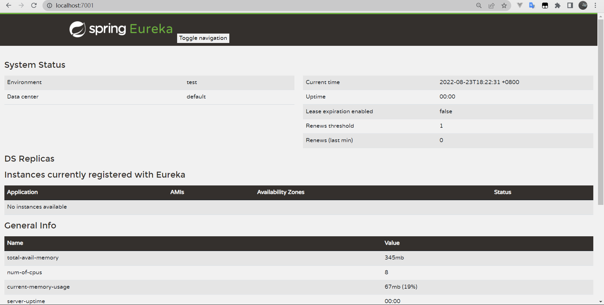


### 3.5、Eureka客户端

#### 3.5.1、依赖


```xml
<dependency>
    <groupId>org.springframework.cloud</groupId>
    <artifactId>spring-cloud-starter-netflix-eureka-client</artifactId>
</dependency>
```


#### 3.5.2、application.yaml

```xml
Eureka:
  client:
    # 将自己注册进 EurekaService 默认 true
    register-with-eureka: true
    # 是否从 Eureka抓取已有注册信息
    fetch-registry: true
    service-url:
      defaultZone: http://localhost:7001/eureka
```


#### 3.5.3、SpringBootApplication

```java
@SpringBootApplication
@EnableEurekaClient
public class PaymentApplication {
    public static void main(String[] args) {
        SpringApplication.run(PaymentApplication.class, args);
    }
}
```


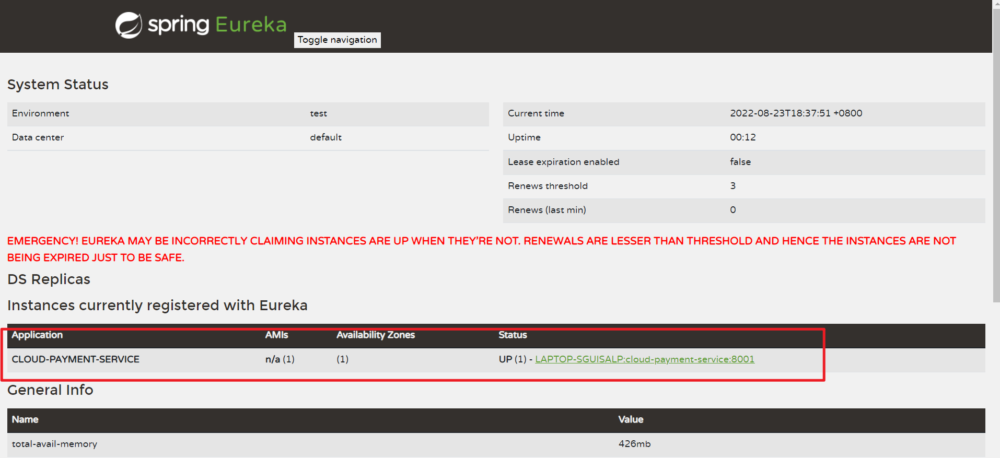


### 3.6、Eureka集群配置 Service

原理：互相注册，互相守望


#### 3.6.1、新建Eureka Service

#### 3.6.2、修改映射文件 hosts

```
127.0.0.1 eureka7001.com
127.0.0.1 eureka7002.com
```

#### 3.6.3、yaml

7001

```yaml
Eureka:
  instance: # 实例
    hostname: eureka7001.com
#    hostname: localhost # eureka服务端实例名称
  client:
    # false 表示 不注册 服务中心自己
    register-with-eureka: false
    # false 标识自己端是服务中心，维护服务实例，不需要检索服务
    fetch-registry: false
    service-url:
      # 设置与 Eureka Service 交互的地址查询服务和注册服务都依赖这个地址
      defaultZone: http://eureka7002.com:7002/eureka/ # 互相注册
```


7002

```yaml
Eureka:
  instance: # 实例
    hostname: eureka7002.com # eureka服务端实例名称
  client:
    # false 表示 不注册 服务中心自己
    register-with-eureka: false
    # false 标识自己端是服务中心，维护服务实例，不需要检索服务
    fetch-registry: false
    service-url:
      # 设置与 Eureka Service 交互的地址查询服务和注册服务都依赖这个地址
      defaultZone: http://eureka7001.com:7001/eureka/ # 互相注册
```


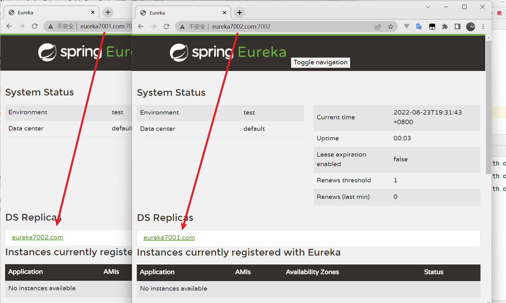


### 3.7、Eureka 集群 Client


```yaml
defaultZone: http://localhost:7001/eureka,http://localhost:7002/eureka  # 集群
```


### 3.8、服务提供者集群

```
创建 cloud-provider-payment8002
```

#### 3.8.1、yaml

**与 `cloud-provider-payment8001`服务名称一样**


#### 3.8.2、客户端修改

url 修改

```java
public class OrderController {
    @Autowired
    private RestTemplate restTemplate;
//    private final String url = "http://localhost:8001/payment/"; // 单机根据 ip:port
    private final String url = "http://CLOUD-PAYMENT-SERVICE/payment/"; // 集群后要使用服务名
```


RestTemplate修改 开启负载均衡（默认轮询）

```java
@Bean
@LoadBalanced 
public RestTemplate getRestTemplate(){
    return new RestTemplate();
}
```

#### 3.8.2、启动


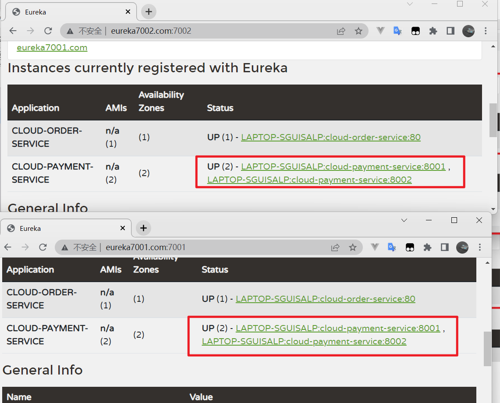


客户端第一次请求

```json
{
	"code": 200,
	"message": "查询成功",
	"data": {
		"port": "8001",
		"payment": {
			"id": 1001,
			"serial": "first"
		}
	}
}
```

第二次请求

```json
{
	"code": 200,
	"message": "查询成功",
	"data": {
		"port": "8002",
		"payment": {
			"id": 1001,
			"serial": "first"
		}
	}
}
```


### 3.9、信息完善

#### 3.9.1、修改主机名

```yaml
Eureka:
  instance:
    instance-id: payment8002 # 实例id 主机名称
  client:
    # 将自己注册进 EurekaService 默认 true
    register-with-eureka: true
    # 是否从 Eureka抓取已有注册信息
    fetch-registry: true
    service-url:
      defaultZone: http://localhost:7001/eureka,http://localhost:7002/eureka  # 集群
#      defaultZone: http://localhost:7001/eureka
```

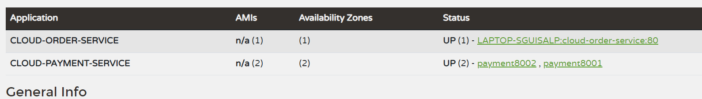


#### 3.9.2、显示ip

```yaml
Eureka:
  instance:
    instance-id: payment8002
    prefer-ip-address: true # 访问路径可以显示ip
```

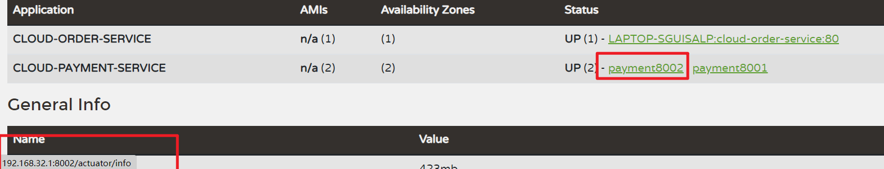


### 3.10、服务发现Discovery

对于注册进Eureka中的微服务，可以通过服务发现来获取该服务的信息


#### 3.10.1、修改服务提供者的Controller

```java
@GetMapping("/discovery")
    public Result discovery(){
        List<String> services = discoveryClient.getServices(); // 获取所以服务
        List<ServiceInstance> instances = discoveryClient.getInstances("CLOUD-PAYMENT-/SERVICE");
        for (ServiceInstance instance : instances){
            instance.getHost();
            instance.getPort();
            instance.getServiceId();
            instance.getUri();
        }
        return Result.ok().setDate("service",services).setDate("instances",(instances));
    }
```


#### 3.10.2、@EnableDiscoveryClient


### 3.11、Eureka自我保护

#### 3.11.1、什么是自我保护

如果某个服务再某个时刻不可用了，Eureka不会立即将服务清除，


​		默认情况下，如果EurekaServer在一定时间内没有接收到某个微服务实例的心跳，EurekaServer将会注销该实例(默认90秒)。但是当网络分区故障发生(延时、卡顿、拥挤)时，微服务与EurekaServer之间无法正常通信，以上行为可能变得非常危险了——因为微服务本身其实是健康的，**此时本不应该注销这个微服务**。Eureka通过“自我保护模式”来解决这个问题——当EurekaServer节点在短时间内丢失过多客户端时(可能发生了网络分区故障)，那么这个节点就会进入自我保护模式。

​		综上，自我保护模式是一种应对网络异常的安全保护措施。它的架构哲学是宁可同时保留所有微服务（健康的微服务和不健康的微服务都会保留）也不盲目注销任何健康的微服务。使用自我保护模式，可以让Eureka集群更加的健壮、稳定。


#### 3.11.2、禁止自我保护

Eureka Service

```
server:
    # 关闭自我保护，服务不可用，立即剔除
    enable-self-preservation: false
```


## 四、Zookeeper

- Zookeeper是一个分布式协调工具，可以实现注册中心功能

- Zookeeper服务器取代Eureka服务器 

- Zookeeper服务器一般安装在Linux系统上

### 4.1、创建服务提供者

```
cloud-provider-payment8004
```


#### 4.1.1、pom

```xml
<dependencies>
    <dependency>
        <groupId>org.springframework.boot</groupId>
        <artifactId>spring-boot-starter-web</artifactId>
    </dependency>
    <dependency>
        <groupId>org.springframework.boot</groupId>
        <artifactId>spring-boot-starter-actuator</artifactId>
    </dependency>
    <!--  speing 整合 zookeeper 客户端 -->
    <dependency>
        <groupId>org.springframework.cloud</groupId>
        <artifactId>spring-cloud-starter-zookeeper-discovery</artifactId>
        <exclusions>
            <!-- 排除调本身的zookeeper-->
            <exclusion>
                <groupId>org.apache.zookeeper</groupId>
                <artifactId>zookeeper</artifactId>
            </exclusion>
        </exclusions>
    </dependency>
    <!--  引入对应版本 zookeeper-->
    <dependency>
        <groupId>org.apache.zookeeper</groupId>
        <artifactId>zookeeper</artifactId>
        <version>3.8.0</version>
    </dependency>
    <dependency>
        <groupId>org.springframework.boot</groupId>
        <artifactId>spring-boot-devtools</artifactId>
    </dependency>
    <dependency>
        <groupId>org.projectlombok</groupId>
        <artifactId>lombok</artifactId>
    </dependency>
    <dependency>
        <groupId>org.springframework.boot</groupId>
        <artifactId>spring-boot-starter-test</artifactId>
    </dependency>
</dependencies>
```


#### 4.1.2、yaml

```yaml
server:
  port: 8004
spring:
  application:
    name: cloud-payment8004
  cloud:
    zookeeper:
      connect-string: 192.168.152.134:2181 # ip : port
```


#### 4.1.3、启动类

```java
@SpringBootApplication
@EnableDiscoveryClient //该注解用于向使用consul或者zookeeper作为注册中心时注册服务
public class Payment8004 {
    public static void main(String[] args) {
        SpringApplication.run(Payment8004.class, args);
    }
}
```

#### 4.1.4、@EnableDiscoveryClient

@EnableDiscoveryClient和@EnableEurekaClient共同点就是：都是能够让注册中心能够发现，扫描到改服务。

不同点：@EnableEurekaClient只适用于Eureka作为注册中心，@EnableDiscoveryClient 可以是其他注册中心。

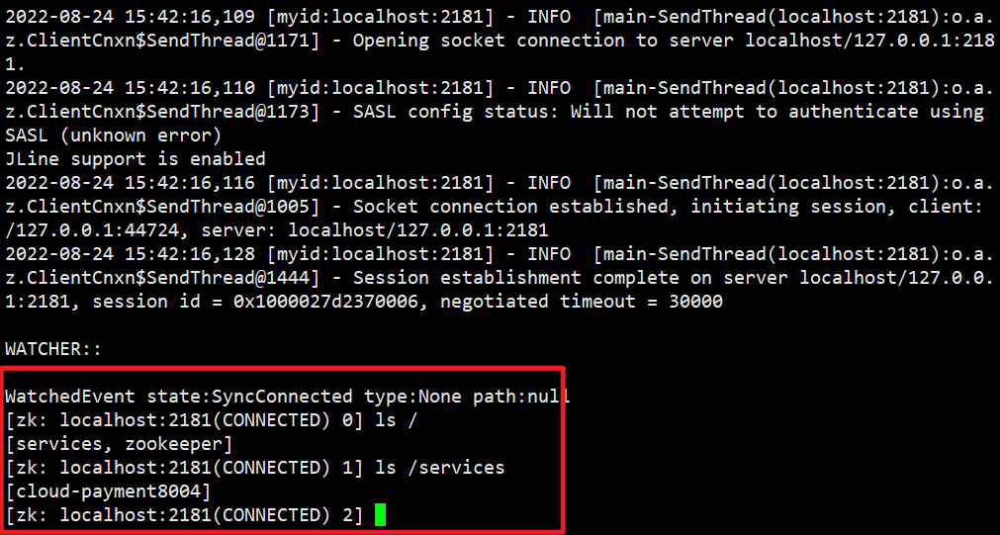


### 4.2、查看详情（使用客户端工具prettyZoo）

`get /services/cloud-payment8004/c26558d2-19f3-41ac-880b-12623cd5ed58`

```json
{
  "name" : "cloud-payment8004",
  "id" : "c26558d2-19f3-41ac-880b-12623cd5ed58",
  "address" : "LAPTOP-SGUISALP",
  "port" : 8004,
  "sslPort" : null,
  "payload" : {
    "@class" : "org.springframework.cloud.zookeeper.discovery.ZookeeperInstance",
    "id" : "cloud-payment8004",
    "name" : "cloud-payment8004",
    "metadata" : {
      "instance_status" : "UP"
    }
  },
  "registrationTimeUTC" : 1661326727539,
  "serviceType" : "DYNAMIC",
  "uriSpec" : {
    "parts" : [ {
      "value" : "scheme",
      "variable" : true
    }, {
      "value" : "://",
      "variable" : false
    }, {
      "value" : "address",
      "variable" : true
    }, {
      "value" : ":",
      "variable" : false
    }, {
      "value" : "port",
      "variable" : true
    } ]
  }
}
```


### 4.3、zookeeper和Eureka

```
Eureka具有自我保护机制    保证 ap（可用性）
zookeeper不具有保护机制   保证 cp（一致性）
```


### 4.4、服务消费者

#### 4.4.1、pom

`同8004`

#### 4.4.2、yaml

```yaml
server:
  port: 80

spring:
  application:
    name: cloud-consumerZk-order80
  cloud:
    zookeeper:
      connect-string: 192.168.152.134:2181 # ip : port
```

#### 4.4.3、controller

```java
@RestController
public class OrderController {
    @Autowired
    private RestTemplate restTemplate;
    private final String URL = "http://cloud-payment8004/";
    @GetMapping("/payment/zk")
    public String payment(){
        return restTemplate.getForObject(URL+"payment/zk",String.class);
    }
}
```


#### 4.4.4、测试

```
[zk: localhost:2181(CONNECTED) 5] ls /services 
[cloud-consumerZk-order80, cloud-payment8004]
```


## 五、Consul

### 5.1、Consul简介

​		Consul是一套开源的分布式服务发现和配置管理系统，由HashiCorp 公司用**Go**语言开发。
​		提供了微服务系统中的服务治理、配置中心、控制总线等功能。这些功能中的每一个都可以根据需要单独使用，也可以一起使用以构建全方位的服务网格，总之Consul提供了一种完整的服务网格解决方案。
​		它具有很多优点。包括:基于raft 协议，比较简洁;支持健康检查,同时支持HTTP和DNS 协议支持跨数据中心的WAN集群提供图形界面跨平台，支持Linux、Mac、Windows

- 服务发现：http，dns
- 健康监测：http，tcp，docker，shell
- kv存储
- 多数据中心
- 可视化web界面

### 5.2、consul启动

`consul启动，consul agent -dev 只能本机访问`

`consul agent -dev -client 0.0.0.0 -ui可以远程访问`

`在8500端口访问`

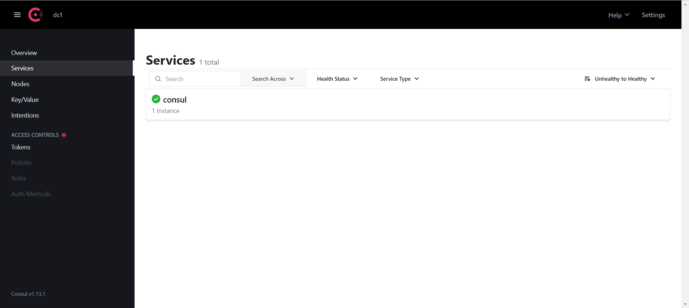


### 5.3、服务提供者

#### 5.3.1、pom

```xml
<dependencies>
    <dependency>
        <groupId>org.springframework.boot</groupId>
        <artifactId>spring-boot-starter-web</artifactId>
    </dependency>
    <dependency>
        <groupId>org.springframework.boot</groupId>
        <artifactId>spring-boot-starter-actuator</artifactId>
    </dependency>
    <!--  spring 整合 consul 客户端 -->
    <dependency>
        <groupId>org.springframework.cloud</groupId>
        <artifactId>spring-cloud-starter-consul-discovery</artifactId>
    </dependency>
    <dependency>
        <groupId>org.springframework.boot</groupId>
        <artifactId>spring-boot-devtools</artifactId>
    </dependency>
</dependencies>
```

#### 5.3.2、yaml

```yaml
server:
  port: 8006
spring:
  application:
    name: cloud-consul-payment8006
  cloud:
    consul:
      host: 192.168.152.134
      port: 8500
      discovery:
        service-name: ${spring.application.name}
#        hostname: 192.168.152.134
```


#### 5.3.3、测试

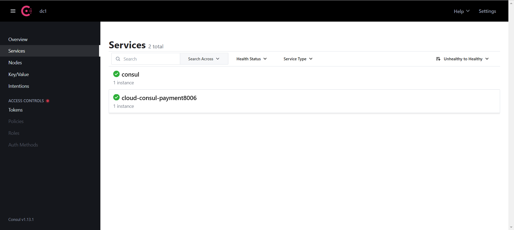


### 5.4、服务消费者


同上


### 5.5、三个注册中心异同点

| 组件名    | 语言 | cap          | 服务健康检查 | 对外暴露接口 |
| --------- | ---- | ------------ | ------------ | ------------ |
| Eureka    | java | ap（可用性） | 可配支持     | HTTP         |
| Zookeeper | java | cp（一致性） | 支持         | 客户端       |
| Consul    | go   | cp           | 支持         | HTTP/DNS     |


## 六、Ribbon负载均衡服务调用


### 6.1、什么是Ribbon

​		Spring Cloud Ribbon是基于Netflix Ribbon实现的一套客户端负载均衡的工具。
​		简单的说，Ribbon是Netflix发布的开源项目，主要功能是提供客户端的软件负载均衡算法和服务调用。Ribbon客户端组件提供一系列完善的配置项如连接超时，重试等。简单的说，就是在配置文件中列出Load Balancer(简称LB)后面所有的机器，Ribbon会自动的帮助你基于某种规则(如简单轮询，随机连接等）去连接这些机器。我们很容易使用Ribbon实现自定义的负载均衡算法。


### 6.2、LB负载均衡


**LB负载均衡(Load Balance)是什么**
简单的说就是将用户的请求平摊的分配到多个服务上，从而达到系统的HA(高可用)。常见的负载均衡有软件Nginx，LVS，硬件F5等。


**Ribbon本地负载均衡客户端VS Nginx服务端负载均衡区别**
Nginx是服务器负载均衡，客户端所有请求都会交给nginx，然后由nginx实现转发请求。即负载均衡是由服务端实现的。
Ribbon本地负载均衡，在调用微服务接口时候，会在注册中心上获取注册信息服务列表之后缓存到VM本地，从而在本地实现RPC远程服务调用技术。


- 集中式LB：即在服务的消费方和提供方之间使用独立的LB设施(可以是硬件，如F5,也可以是软件，如nginx),由该设施负责把访问请求通过某种策略转发至服务的提供方;
- 进程内LB：将LB逻辑集成到消费方，消费方从服务注册中心获知有哪些地址可用，然后自己再从这些地址中选择出一个合适的服务器。Ribbon就属于进程内LB，它只是一个类库，集成于消费方进程，消费方通过它来获取到服务提供方的地址。


### 6.3、演示

**Ribbon是一个软负载均衡的客户端组件，可以和其他客户端使用**

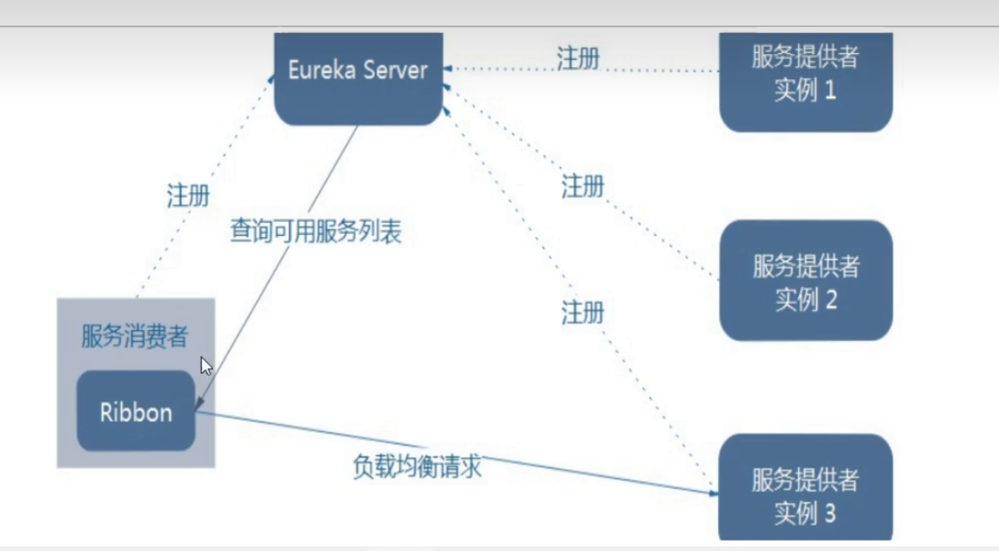


**Ribbon工作步骤**

1. 选择一个Eureka Server，会优先选择负载较少的Eureka Server
2. 根据用户指定的策略，从server取到的服务注册列表中选择一个地址


#### 6.3.1、依赖

```xml
<dependency>
    <groupId>org.springframework.cloud</groupId>
    <artifactId>spring-cloud-starter-netflix-ribbon</artifactId>
</dependency>

<!--旧版的eureka-client子带的ribbon依赖，但是ribbon停更后，新版的eureka-client将ribbon换成loadbalancer-->
```


### 6.4、Ribbon核心组件IRule，自带策略

IRule：根据特定算法从服务列表中选取一个要访问的服务


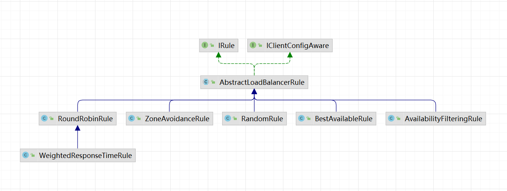

常见

1. RoundRobinRule：轮询
2. RandomRule：随机
3. RetryRule：先安装RoundRobinRule获取服务，服务失败，会在指定时间内进行重试，获取可用服务
4. WeightdResponseTimeRule：对RoundRobinRule的扩展，响应速度越快，权重越大
5. BestAvailableRule：会先过滤掉由于多次访问故障而处于断路器跳闸状态的服务，然后选择一个并发量最小的服务
6. AvailabilityFilteringRule：先过滤掉故障实例，再选择并发较小的实例
7. ZoneAvoidanceRule：默认规则,复合判断server所在区域的性能和server的可用性选择服务器


### 6.5、Ribbon负载均衡策略的替换

官方文档明确给出了警告:
这个自定义配置类**不能**放在@ComponentScan所扫描的当前包下以及子包下，
否则我们自定义的这个配置类就会被所有的Ribbon客户端所共享，达不到**特殊化定制**的目的了。

策略配置

```java
@Configuration
public class LBRule {
    public IRule iRule(){
        return new RandomRule(); // 随机
    }
}
```

启动类

```java
@SpringBootApplication(exclude = {DataSourceAutoConfiguration.class})
@EnableEurekaClient
@RibbonClient(name="CLOUD-PAYMENT-SERVICE", configuration = LBRule.class)
public class OrderApplication {
    public static void main(String[] args) {
        SpringApplication.run(OrderApplication.class, args);
    }
}
```


### 6.6、Ribbon负载均衡原理

负载均衡：轮询

```
rest接口第几次请求 % 服务器集群总数量 = 实际调用服务器位置下标
每次服务重启后，rest接口计数从 1 开始
```


```java
@Component
public class MyLb implements LoadBalancer {
    private AtomicInteger atomicInteger = new AtomicInteger(0);

    public final int getAndIncrement() {
        int current;
        int next;
        do {
            current = this.atomicInteger.getAndIncrement();
            next = current >= Integer.MAX_VALUE ? 0 : current + 1;
        } while (!atomicInteger.compareAndSet(current,next));
        return next;
    }

    @Override
    public ServiceInstance instances(List<ServiceInstance> serviceInstanceList) {
        int index = getAndIncrement() % serviceInstanceList.size(); // 得到下标

        return serviceInstanceList.get(index); // 返回实例
    }
}
```


```java
@Autowired
private DiscoveryClient discoveryClient;
@Autowired
private MyLb loadBalancer;
public Object testLoadBalancer(){
    // 根据服务名获取服务
    List<ServiceInstance> instances = discoveryClient.getInstances("CLOUD-PAYMENT-SERVICE");
    // 负载均衡得到服务
    ServiceInstance serviceInstance = loadBalancer.instances(instances);
    URI uri = serviceInstance.getUri();
    Object forObject = restTemplate.getForObject(uri, Object.class);
    return forObject;
}
```


## 七、OpenFeign服务接口调用


### 7.1、简介

​		Feign是一个声明式WebService客户端。使用Feign能让编写Web Service客户端更加简单。
​		它的使用方法是定义一个服务接口然后在上面添加注解。Feign也支持可拔插式的编码器和解码器。Spring Cloud对Feign进行了封装，使其支持了Spring MVC标准注解和HttpMessageConverters。Feign可以与Eureka和Ribbon组合使用以支持负载均衡

**Feign能干什么**
		Feign旨在使编写Java Http客户端变得更容易。
		前面在使用Ribon+RestTemplate时，利用RestTemplate对http请求的封装处理，形成了一套模版化的调用方法。但是在实际开发中，由于对服务依赖的调用可能不止一处，往往一个接口会被多处调用，所以通常都会针对每个微服务自行封装一些客户端类来包装这些依赖服务的调用。所以，Feign在此基础上做了进一步封装，由他来帮助我们定义和实现依赖服务接口的定义。在Feign的实现下，我们只需创建一个接口并使用注解的方式来配置它(以前是Dao接口上面标注Mapper注解,现在是一个微服务接口上面标注一个Feign注解即可)，即可完成对服务提供方的接口绑定，简化了使用Spring cloud Ribbon时，自动封装服务调用客户端的开发量。
**Feign集成了Ribbon（新版是loadbalancer）**
		利用Ribbon维护了Payment的服务列表信息，并且通过轮询实现了客户端的负载均衡。而与Ribbon不同的是，通过feign只需要定义服务绑定接口且以声明式的方法，优雅而简单的实现了服务调用


### 7.2、依赖

```xml
<dependency>
    <groupId>org.springframework.cloud</groupId>
    <artifactId>spring-cloud-starter-openfeign</artifactId>
</dependency>
```


### 7.3、服务调用

```
cloud-openfeign-order8080
```


#### 7.3.1、pom

```xml
<dependencies>
    <dependency>
        <groupId>org.springframework.boot</groupId>
        <artifactId>spring-boot-starter-web</artifactId>
    </dependency>
    <dependency>
        <groupId>org.springframework.boot</groupId>
        <artifactId>spring-boot-starter-actuator</artifactId>
    </dependency>
    <dependency>
        <groupId>org.springframework.cloud</groupId>
        <artifactId>spring-cloud-starter-openfeign</artifactId>
    </dependency>
    <dependency>
        <groupId>org.springframework.cloud</groupId>
        <artifactId>spring-cloud-starter-netflix-eureka-client</artifactId>
    </dependency>
    <dependency>
        <groupId>org.springframework.boot</groupId>
        <artifactId>spring-boot-devtools</artifactId>
    </dependency>
</dependencies>
```


#### 7.3.2、yaml

```yaml
server:
  port: 8080
spring:
  application:
    name: cloud-openfeign-order8080

eureka:
  client:
    service-url:
      defaultZone: http://eureka7001.com:7001/eureka,http://eureka7002.com:7002/eureka
```

#### 7.3.3、启动类

```java
@SpringBootApplication
@EnableEurekaClient
@EnableFeignClients
public class Order8080 {
    public static void main(String[] args) {
        SpringApplication.run(Order8080.class,args);
    }
}
```


#### 7.3.4、FeignClient

```java
@Component
@FeignClient(name = "CLOUD-PAYMENT-SERVICE")
public interface PaymentService {
    @GetMapping("/payment/payment/create")
    Result create(@RequestBody Payment payment);
    @GetMapping("/payment/payment/getPaymentById/{id}")
    Result getPaymentById(@PathVariable(value = "id") String id);
}
```


#### 7.3.5、controller

```java
@RestController
public class OrderController {
    @Autowired
    private PaymentService paymentService;
    @GetMapping("/getPaymentById/{id}")
    public Result getPaymentById(@PathVariable String id){
        return paymentService.getPaymentById(id);
    }
    @GetMapping("/create")
    public Result create(@RequestBody Payment payment){
        return paymentService.create(payment);
    }
}
```


### 7.4、openfeign超时控制

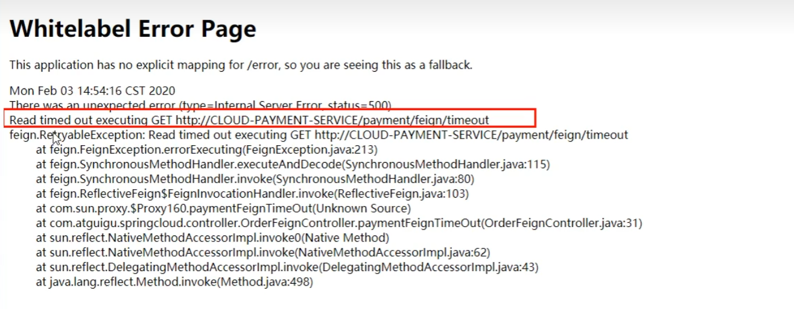

`openfeign默认等待 1s 超时报错`

Ribbon设置超时时间（新版本不可用）

```yaml
ribbon:
  # 建立连接所用时间
  ConnectTimeout: 5000
  # 建立连接后，服务器读取到可用资源使用时间
  ReadTimeout: 5000
```

Feign设置超时时间

```yaml
feign:
  client:
    config:
      default:
        read-timeout: 5000
        connect-timeout: 5000 # 单位毫秒
```


### 7.5、openfeign日志打印

```
@Configuration
public class FeignLogConfig {
	@Bean
    Logger.Level feignLoggerLevel(){
        return Logger.Level.FULL; // 日志打印级别
    }
}
```


```yaml
logging:
  level:
    # feign日志以那个级别监测哪个接口
    com.dhf.feignClient.PaymentService: debug
```


## 八、Hystrix断路器

### 8.1、介绍

​		Hystrix是一个用于处理分布式系统的延迟和容错的开源库，在分布式系统里，许多依赖不可避免的会调用失败，比如超时、异常等，Hystrix能够保证在一个依赖出问题的情况下，不会导致整体服务失败，避免级联故障，以提高分布式系统的弹性。
​		"断路器”本身是一种开关装置，当某个服务单元发生故障之后，通过断路器的故障监控（类似熔断保险丝)，向调用方返回一个符合预期的、可处理的备选响应(FallBack)，而不是长时间的等待或者抛出调用方无法处理的异常这样就保证了服务调用方的线程不会被长时间、不必要地占用，从而避免了故障在分布式系统中的蔓延，乃至雪崩。


- 服务降级
- 服务熔断
- 实时监控
- 限流，隔离。。。


### 8.2、概念

#### 8.2.1、服务降级Fallback

- 程序运行异常
- 超时
- 服务熔断也会触发服务降级
- 线程池/信号量打满也会导致服务降级


#### 8.2.2、服务熔断break

达到最大访问量后，直接拒绝访问，然后服务降级并返回有好提示

​	服务降级=>服务熔断=>恢复链路

#### 8.2.3、服务限流flowlimit

秒杀高并发等操作，严禁一窝蜂的过来拥挤，大家排队，一秒钟N个，有序进行


### 8.3、服务提供者

```
cloud-hystrix-payment8001
```


#### 8.3.1、pom

```xml
<dependencies>
    <dependency>
        <groupId>org.springframework.cloud</groupId>
        <artifactId>spring-cloud-starter-netflix-hystrix</artifactId>
        <version>2.2.10.RELEASE</version>
    </dependency>
    <dependency>
        <groupId>org.springframework.cloud</groupId>
        <artifactId>spring-cloud-starter-netflix-eureka-client</artifactId>
    </dependency>
    <dependency>
        <groupId>org.springframework.boot</groupId>
        <artifactId>spring-boot-starter-web</artifactId>
    </dependency>
    <!--  健康监测 -->
    <dependency>
        <groupId>org.springframework.boot</groupId>
        <artifactId>spring-boot-starter-actuator</artifactId>
    </dependency>

    <dependency>
        <groupId>org.springframework.boot</groupId>
        <artifactId>spring-boot-devtools</artifactId>
    </dependency>
    <dependency>
        <groupId>org.projectlombok</groupId>
        <artifactId>lombok</artifactId>
    </dependency>
    <dependency>
        <groupId>com.example</groupId>
        <artifactId>cloud-util</artifactId>
        <version>0.0.1-SNAPSHOT</version>
    </dependency>
</dependencies>
```


#### 8.3.2、yaml

```yaml
server:
  port: 8001

spring:
  application:
    name: cloud-hystrix-payment8001

eureka:
  client:
    service-url:
      defauleZone: http://eureka7001.com:7001,http://eureka7002.com:7002
    fetch-registry: true
    register-with-eureka: true
```


#### 8.3.3、主启动


```java
@SpringBootApplication
@EnableEurekaClient
public class Payment8001 {
    public static void main(String[] args) {
        SpringApplication.run(Payment8001.class,args);
    }
}
```


### 8.4、服务消费者


#### 8.4.1、pom

```xml
<dependencies>
    <dependency>
        <groupId>org.springframework.boot</groupId>
        <artifactId>spring-boot-starter-web</artifactId>
    </dependency>
    <dependency>
        <groupId>org.springframework.boot</groupId>
        <artifactId>spring-boot-starter-actuator</artifactId>
    </dependency>
    <dependency>
        <groupId>org.springframework.cloud</groupId>
        <artifactId>spring-cloud-starter-netflix-eureka-client</artifactId>
    </dependency>
    <dependency>
        <groupId>org.springframework.boot</groupId>
        <artifactId>spring-boot-devtools</artifactId>
    </dependency>
    <dependency>
        <groupId>org.springframework.cloud</groupId>
        <artifactId>spring-cloud-starter-netflix-hystrix</artifactId>
        <version>2.2.10.RELEASE</version>
    </dependency>
    <dependency>
        <groupId>org.springframework.cloud</groupId>
        <artifactId>spring-cloud-starter-openfeign</artifactId>
    </dependency>
</dependencies>
```


#### 8.4.2、yaml

```yaml
server:
  port: 8080

eureka:
  client:
    service-url:
      defaultZone: http://eureka7001.com:7001/eureka,http://eureka7002.com:7002/eureka
    register-with-eureka: true
    fetch-registry: true
feign:
  client:
    config:
      read-timeout: 5000
      connect-timeout: 5000
```


#### 8.4.3、service

```java
@Component
@FeignClient(name = "CLOUD-HYSTRIX-PAYMENT8001")
public interface PaymentService {
    @GetMapping("/paymentInfo")
    public String paymentInfo(Integer id);
    @GetMapping("/err")
    public String error();
}
```


### 8.5服务降级fallback


#### 8.5.1、服务提供者 @HystrixCommand 与 @EnableHystrix

[ Hystrix中所有Command/Property/HystrixProperty属性解读大全](https://blog.csdn.net/qq_42554719/article/details/113620281)

查看下面类

```java
class HystrixCommandProperties
```

业务类

```java
@HystrixCommand(fallbackMethod = "errorHandler",commandProperties = {
        @HystrixProperty(name = "execution.isolation.thread.timeoutInMilliseconds",value = "3000")
}) // 该方法执行时间在 3s 以内，正常访问，否则走 errorHandler
public String error() {
    double v = Math.random() * 6; // [0,6)
    int time = (int) v;
    try {
        TimeUnit.SECONDS.sleep(time);
    } catch (InterruptedException e) {
        e.printStackTrace();
    }
    return Thread.currentThread().getName() + " " + time;
}

public String errorHandler() {
    return this.getClass() + " error出错了";
}
```

启动类

启动类增加**@EnableCircuitBreaker**注解，但是@EnableCircuitBreaker注解已经过期了

最新注解**@EnableHystrix**

```java
@SpringBootApplication
@EnableEurekaClient
//@EnableCircuitBreaker
@EnableHystrix
public class Payment8001 {
    public static void main(String[] args) {
        SpringApplication.run(Payment8001.class,args);
    }
}
```


#### 8.5.2 消费者服务降级

一般服务降级设置在客户端


```java
@HystrixCommand(fallbackMethod = "errorHandler",commandProperties = {
        @HystrixProperty(name = "execution.isolation.thread.timeoutInMilliseconds",value = "1500")
})
@GetMapping("/err")
public String err(){
    return paymentService.error();
}
public String errorHandler(){
    return "对方系统繁忙，请稍后再试";
}
```


```java
@SpringBootApplication
@EnableEurekaClient
@EnableFeignClients
@EnableHystrix
public class Order8080 {
    public static void main(String[] args) {
        SpringApplication.run(Order8080.class, args);
    }
}
```


```
问题：
代码冗余，每个接口都有一个服务降级
```


#### 8.5.3、全局服务降级

```java
@RestController
@DefaultProperties(defaultFallback = "Global_Fallback") // 全局服务降级
public class OrderController {
    public String Global_Fallback(){
        return "对方系统繁忙，请稍后再试GLOBAL";
    }
    @Autowired
    private PaymentService paymentService;
    @GetMapping("/paymentInfo")
    @HystrixCommand // 不用指明 使用哪个方法 自动使用全局异常
    public String paymentInfo( Integer id){
        int i = 10 / 0;
        return paymentService.paymentInfo(id);
    }
    @HystrixCommand(fallbackMethod = "errorHandler",commandProperties = {
            @HystrixProperty(name = "execution.isolation.thread.timeoutInMilliseconds",value = "1500")
    })
    @GetMapping("/err")
    public String err(){
        return paymentService.error();
    }
    public String errorHandler(){
        return "对方系统繁忙，请稍后再试";
    }
}
```


#### 8.5.4、服务降级FeignFallback

FeignFallback，当服务端宕机不可用时，服务降级

```java
@Component
@FeignClient(name = "CLOUD-HYSTRIX-PAYMENT8001",fallback = PaymentServiceImpl.class)
public interface PaymentService {
    @GetMapping("/paymentInfo")
    public String paymentInfo(@RequestParam("id")Integer id);
    @GetMapping("/err")
    public String error();
}
```


```java
@Component
public class PaymentServiceImpl implements PaymentService {
    @Override
    public String paymentInfo(Integer id) {
        return "出错了，请稍后再试";
    }
    @Override
    public String error() {
        return "出错了，请稍后再试";
    }
}
```

```yaml
feign:
  circuitbreaker: # 断路器
    enabled: true # default true
```


### 8.6、服务熔断

熔断机制概述
		熔断机制是应对雪崩效应的一种微服务链路保护机制。当扇出链路的某个微服务出错不可用或者响应时间太长时，会进行服务的降级，进而熔断该节点微服务的调用，快速返回错误的响应信息。
		当检测到该节点微服务调用响应正常后，恢复调用链路。
在Spring Cloud框架里，熔断机制通过Hystrix实现。Hystrix会监控微服务间调用的状况，
当失败的调用到一定阈值，缺省是5秒内20次调用失败，就会启动熔断机制。熔断机制的注解是**@HystrixCommand**。


这个简单的断路器避免了在电路断开时发出保护呼叫，但当情况恢复正常时需要外部干预来重置它。对于建筑物中的电路断路器，这是一个合理的方法，但是对于软件断路器，我们可以让断路器自己检测底层呼叫是否再次工作。我们可以通过在适当的时间间隔后再次尝试受保护的调用来实现这种自重置行为，并在成功时重置断路器。

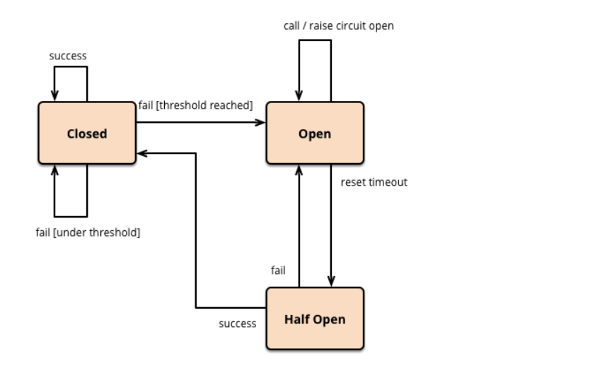


#### 8.6.1、服务调用者


```java
//======================================服务熔断=========================
@HystrixCommand(fallbackMethod = "paymentCircuitBreakerFallback", commandProperties = {
      	@HystrixProperty(name = "circuitBreaker.enabled", value = "true"), // 是否开启断路器
  	   //如果滚动时间窗(默以10秒)内仅收到了10个请求，即使这9个请求都失败了， 断路器也不会打开。
        @HystrixProperty(name = "circuitBreaker.requestVolumeThreshold", value = "10"), // 最少请求次数
        //该属性用来没置当断路器打开之后的休眠时间窗。休眠时间窗结束之后,会将断路器置为"半开”状态，尝试熔断的请求命令
        @HystrixProperty(name = "circuitBreaker.sleepWindowInMilliseconds", value = "10000"), // 时间窗口期
       // 如果错误请求数的百分比超过 60,就把断路器没置为”打开”状态，否则就设置为"关闭”状态。
        @HystrixProperty(name = "circuitBreaker.errorThresholdPercentage",value = "60") // 失败率达到多少跳闸
})
@GetMapping("/paymentCircuitBreaker")
public String paymentCircuitBreaker(Integer id) {
    if (id < 0) {
        throw new RuntimeException("id不能为负数");
    }
    UUID uuid = UUID.randomUUID();
    return Thread.currentThread().getName() + " " + uuid;
}

public String paymentCircuitBreakerFallback(Integer id) {
    return "id不能为负数，请重试";
}
```


开启服务熔断后，当失败次数过多，即使路径正确，仍会返回 错误


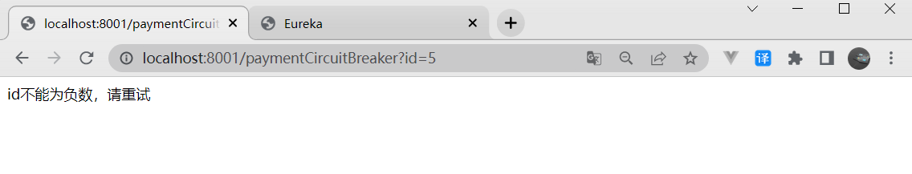

当窗口期度过后，慢慢又可以成功访问

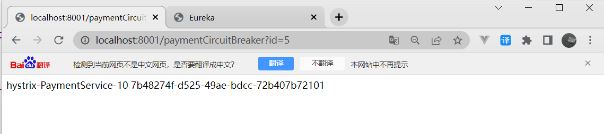


### 8.7、服务监控hystrixDashboard

```
cloud-hystrixDashboard-9001
```


#### 8.7.1、pom

```xml
<dependencies>
    <!-- hystrix图形化操作界面 -->
    <dependency>
        <groupId>org.springframework.cloud</groupId>
        <artifactId>spring-cloud-starter-netflix-hystrix-dashboard</artifactId>
        <version>2.2.10.RELEASE</version>
    </dependency>
    <dependency>
        <groupId>org.springframework.boot</groupId>
        <artifactId>spring-boot-starter-web</artifactId>
    </dependency>
    <dependency>
        <groupId>org.springframework.boot</groupId>
        <artifactId>spring-boot-starter-actuator</artifactId>
    </dependency>
    <dependency>
        <groupId>org.springframework.boot</groupId>
        <artifactId>spring-boot-devtools</artifactId>
    </dependency>
</dependencies>
```


#### 8.7.2、yaml

```yaml
server:
  port: 9001

hystrix:
  dashboard:
    proxy-stream-allow-list: localhost
```


#### 8.7.3、主启动 @EnableHystrixDashboard

```java
@SpringBootApplication
@EnableHystrixDashboard
public class HystrixDashboard {
    public static void main(String[] args) {
        SpringApplication.run(HystrixDashboard.class, args);
    }
}
```


访问：http://localhost:9001/hystrix


在8001服务端添加

```java
@SpringBootApplication
@EnableEurekaClient
//@EnableCircuitBreaker
@EnableHystrix
public class Payment8001 {
    public static void main(String[] args) {
        SpringApplication.run(Payment8001.class,args);
    }

    /**
     * 此配置为了服务监控而配置，与服务容错本身无关、
     * ServletRegistrationBean因为springboot的默认路径不是"/hystrix.stream"
     * 要在自己的项目里配置上下面的servlet就可以了
     * @return
     */
    @Bean
    public ServletRegistrationBean getServlet(){
        HystrixMetricsStreamServlet streamServlet = new HystrixMetricsStreamServlet();
        ServletRegistrationBean<Servlet> registrationBean = new ServletRegistrationBean<>(streamServlet);
        registrationBean.setLoadOnStartup(1);
        registrationBean.addUrlMappings("/hystrix.stream");
        registrationBean.setName("HystrixMetricsStreamServlet");
        return registrationBean;
    }
}
```


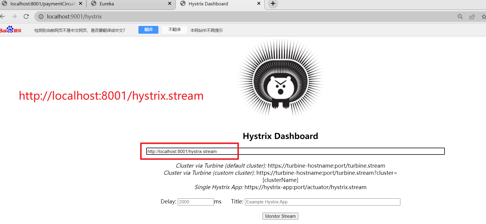

```
http://localhost:8001/hystrix.stream
```

Delay:2000 ms,  TiTle:  T3

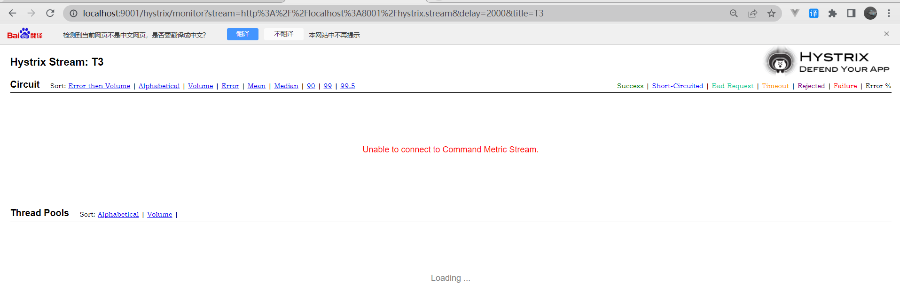

访问 8001端口

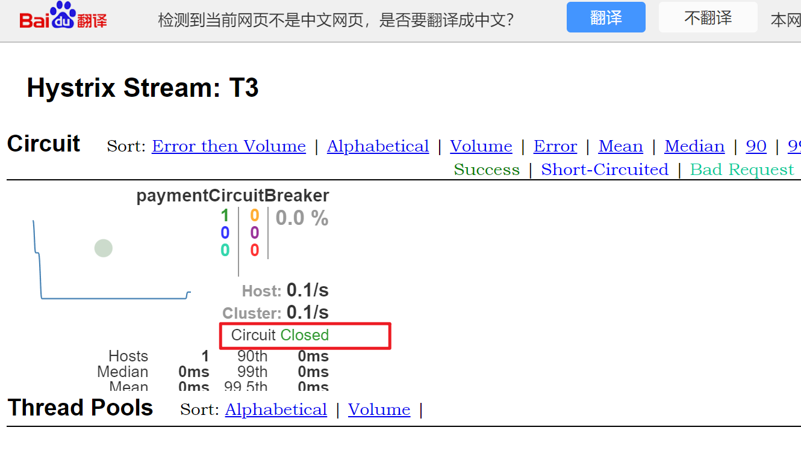

多次错误：

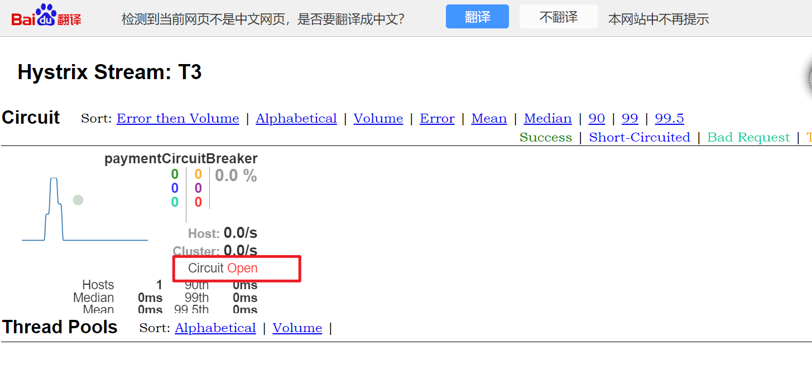


## 九、GateWay网关


### 9.1、简介

​		SpringCloud Gateway作为Spring Cloud生态系统中的网关，目标是替代Zuul，在Spring Cloud 2.0以上版本中，没有对新版本的Zuul 2.0以上最新高性能版本进行集成，仍然还是使用的Zuul 1.x非Reactor模式的老版本。而为了提升网关的性能，SpringCloud Gateway是基于WebFlux框架实现的，而WebFlux框架底层则使用了高性能的Reactor模式通信框架Netty.

​		Spring Cloud Gateway的目标提供统一的路由方式且基于Filter链的方式提供了网关基本的功能，例如:安全，监控/指标，和限流。


**功能**：

- 反向代理
- 鉴权
- 流量监控
- 熔断
- 日志监控
- 。。。。。。


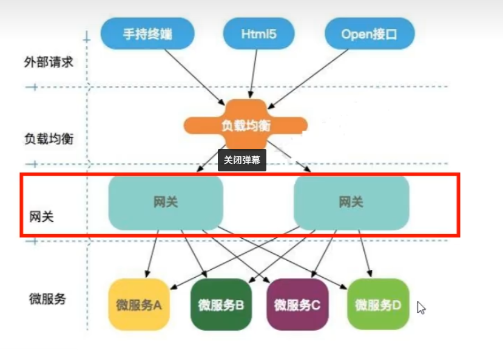

### 9.2、三大核心概念

- 路由Route：路由是构建网关的基本模块，它由ID，目标URI，一系列的断言和过滤器组成，如果断言为true则匹配该路由
- 断言Predicate：
- 过滤器Filter：指的是Spring框架中GatewayFilter的实例，使用过滤器，可以在请求被路由前或者之后对请求进行修改。


web请求，通过一些匹配条件，定位到真正的服务节点。并在这个转发过程的前后，进行一些精细化控制。predicate就是我们的匹配条件;而filter，就可以理解为一个无所不能的拦截器。有了这两个元素，再加上目标uri，就可以实现一个具体的路由了


### 9.3、gateway工作流程

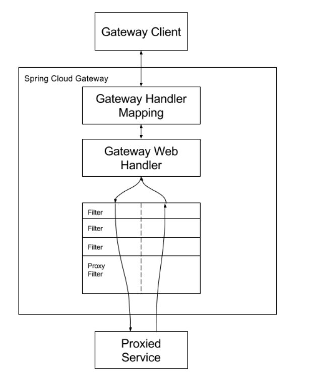

客户端向springcloudgateway发出请求。如果网关处理程序映射确定请求与路由匹配，则将其发送到网关Web处理程序。此处理程序通过特定于请求的筛选器链运行请求。过滤器被虚线分开的原因是过滤器可以在发送代理请求之前和之后运行逻辑。执行所有“预”过滤器逻辑。然后发出代理请求。发出代理请求后，运行“post”过滤器逻辑。


### 9.4、coding

```
cloud-gateway-gateway9527
```


#### 9.4.1、pom

```xml
<dependencies>
    <dependency>
        <groupId>org.springframework.cloud</groupId>
        <artifactId>spring-cloud-starter-gateway</artifactId>
    </dependency>
    <dependency>
        <groupId>org.springframework.boot</groupId>
        <artifactId>spring-boot-starter-web</artifactId>
    </dependency>
    <dependency>
        <groupId>org.springframework.boot</groupId>
        <artifactId>spring-boot-starter-actuator</artifactId>
    </dependency>
    <dependency>
        <groupId>org.springframework.cloud</groupId>
        <artifactId>spring-cloud-starter-netflix-eureka-client</artifactId>
    </dependency>
    <dependency>
        <groupId>org.springframework.boot</groupId>
        <artifactId>spring-boot-devtools</artifactId>
    </dependency>
</dependencies>
```


#### 9.4.2、yaml

```yaml
server:
  port: 9527

eureka:
  instance:
    instance-id: gateway9527
  client:
    service-url:
      defaultZone: http://eureka7001.com:7001/eureka,http://eureka7002:7002/eureka
    register-with-eureka: true
    fetch-registry: true

spring:
  application:
    name: cloud-gateway-gateway9527
  cloud:
    gateway:
      routes:
        - id: payment_8001 # 路由id，无固定规则，但要求唯一，建议配合服务名
          uri: http://localhost:8001 # 匹配后，提供服务的路由地址
          predicates:
            - Path=/payment/payment/create # 断言，匹配后提供服务的路由地址
        - id: payment_8001_route2
#          uri: lb://CLOUD-PAYMENT-SERVICE # 使用服务名 配置
          uri: http://localhost:8001
          predicates:
            - Path=/payment/payment/payment/discovery # 断言，匹配后提供服务的路由地址
      discovery:
        # locator需要打开，不然通过 lb://.. 方式请求不到
        locator:
          enabled: true

```

##### 9.4.2.1、代码配置

```java
@Configuration
public class GateWayConfig {
    @Bean
    public RouteLocator customRouteLocator(RouteLocatorBuilder routeLocatorBuilder){
        RouteLocatorBuilder.Builder routes = routeLocatorBuilder.routes();
        routes.route("route1",r -> r.path("/guonei").
                uri("http://news.baidu.com")).build();
        // http://localhost:9527/guonei => http://news.baidu.com/guonei
        return routes.build();
    }
}
```


#### 9.4.3、主启动

```java
@SpringBootApplication
@EnableEurekaClient
public class GateWay9527 {
    public static void main(String[] args) {
        SpringApplication.run(GateWay9527.class,args);
    }
}
```


### 9.5、gateway常用 Predicate

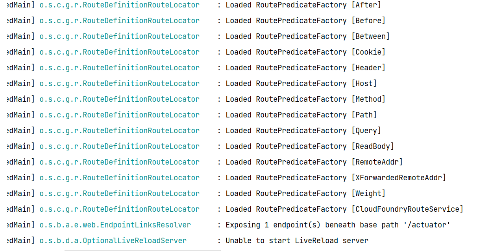


https://docs.spring.io/spring-cloud-gateway/docs/current/reference/html/#gateway-request-predicates-factories

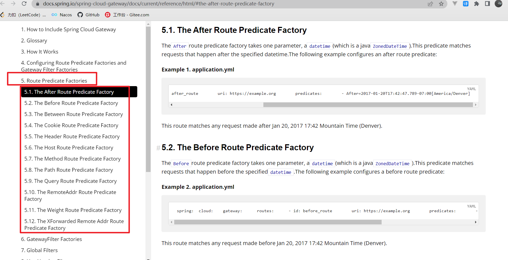


### 9.6、gateway常用filter

> ```
> filter可以在请求被路由前后对请求进行修改
> ```

https://docs.spring.io/spring-cloud-gateway/docs/current/reference/html/#gatewayfilter-factories


https://docs.spring.io/spring-cloud-gateway/docs/current/reference/html/#global-filters


#### 9.6.1、自定义过滤器

```java
@Component
public class MyGlobalFilter implements GlobalFilter, Ordered {
    @Override
    public Mono<Void> filter(ServerWebExchange exchange, GatewayFilterChain chain) {
        ServerHttpRequest request = exchange.getRequest();
        String username = request.getQueryParams().getFirst("username");
        if (StringUtils.isEmpty(username)){
            System.out.println("用户名为空,非法用户");
            exchange.getResponse().setStatusCode(HttpStatus.BAD_REQUEST); // 设置响应头
            return exchange.getResponse().setComplete();
        }
        return chain.filter(exchange);
    }

    @Override
    public int getOrder() { // 优先级，数值越小，优先级越高
        // int HIGHEST_PRECEDENCE = -2147483648;
        // int LOWEST_PRECEDENCE = 2147483647;
        return 0;
    }
}
```


## 十、springCloud Config  分布式配置中心

​		微服务意味着要将单体应用中的业务拆分成一个个子服务，每个服务的粒度相对较小，因此系统中会出现大量的服务。由于每个服务都需要必要的配置信息才能运行，所以—套集中式的、动态的配置管理设施是必不可少的。

SpringCloud提供了ConfigServer来解决这个问题,


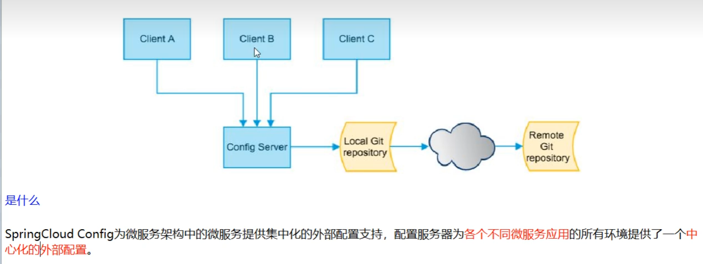


springCloud Config分为服务端和客户端两部分

- 服务端称为分布式配置中心。他是一个独立的微服务应用，用来连接配置服务器并为客户端提供获取配置信息，加密/解密等访问接口
- 客户端则是通过指定配置中心来管理应用资源，以及业务相关的配置内容，并在启动时从配置中心获取和加载配置信息配置服务器默认采用git来存储配置信息，这样就有助于对环境配置进行版本管理，并且可以通过git客户端工具来方便的管理和访问配置内容


### 10.1、Service config

1. 在git上新建仓库，springCloud-config，可以使用gitee，访问快点
2. git clone 到本地
3. 新建配置中心模块 `cloud-config-service3344`


#### 10.1.1、pom文件

```xml
<dependencies>
    <dependency>
        <groupId>org.springframework.cloud</groupId>
        <artifactId>spring-cloud-config-server</artifactId>
    </dependency>
    <dependency>
        <groupId>org.springframework.cloud</groupId>
        <artifactId>spring-cloud-starter-netflix-eureka-client</artifactId>
    </dependency>
    <dependency>
        <groupId>org.springframework.boot</groupId>
        <artifactId>spring-boot-starter-web</artifactId>
    </dependency>
    <dependency>
        <groupId>org.springframework.boot</groupId>
        <artifactId>spring-boot-starter-actuator</artifactId>
    </dependency>
    <dependency>
        <groupId>org.springframework.boot</groupId>
        <artifactId>spring-boot-devtools</artifactId>
    </dependency>
</dependencies>
```

#### 10.1.2、yaml

```yaml
server:
  port: 3344
spring:
  application:
    name: cloud-config
  cloud:
    config:
      server:
        git:
          uri: https://gitee.com/dang-huifeng/springCloud-config.git # git 地址
          search-paths: # 搜索目录
            - springCloud-config
          username: 1049334207@qq.com
          password: dhf200827
          default-label: master
      label: master # 读取分支
eureka:
  instance:
    instance-id: cloud-config-center3344
  client:
    fetch-registry: true
    register-with-eureka: true
    service-url:
      defaultZone: http://eureka7001.com:7001/eureka
```


#### 10.1.3、主启动类

```java
@SpringBootApplication
@EnableEurekaClient
@EnableConfigServer
public class Config3344 {
    public static void main(String[] args) {
        SpringApplication.run(Config3344.class,args);
    }
}
```


#### 10.1.4、其他配置

1. 修改host文件，增加映射`127.0.0.1 cloud-config.com`
2. 访问：`http://cloud-config.com:3344/master/cloud-config-dev.yaml`


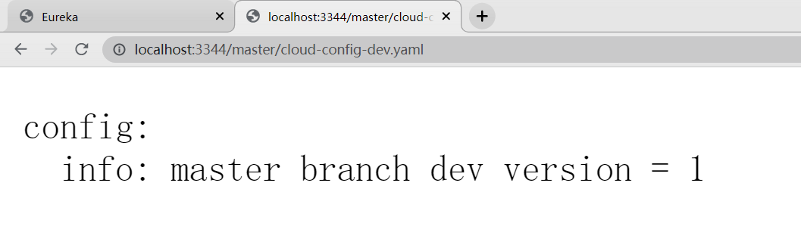

访问方式：

- /{lable}/{application}-{profile}.yml  

  `http://cloud-config.com:3344/master/cloud-config-dev.yaml`

- /{application}-{profile}.yml

  `http://cloud-config.com:3344/cloud-config-dev.yaml`

- /{application}/{profile}/[/{lable}]   **json**

  `http://cloud-config.com:3344/cloud-config/dev`


### 10.2、Config Client

```
cloud-config-client3355
```


#### 10.2.1、pom

```xml
<dependencies>
        <dependency>
            <groupId>org.springframework.cloud</groupId>
            <artifactId>spring-cloud-starter-bootstrap</artifactId>
        </dependency>
        <dependency>
            <groupId>org.springframework.boot</groupId>
            <artifactId>spring-boot-starter-web</artifactId>
        </dependency>
        <dependency>
            <groupId>org.springframework.boot</groupId>
            <artifactId>spring-boot-starter-actuator</artifactId>
        </dependency>
        <dependency>
            <groupId>org.springframework.cloud</groupId>
            <artifactId>spring-cloud-starter-netflix-eureka-client</artifactId>
        </dependency>
        <dependency>
            <groupId>org.springframework.cloud</groupId>
            <artifactId>spring-cloud-config-client</artifactId>
        </dependency>
        <dependency>
            <groupId>org.springframework.boot</groupId>
            <artifactId>spring-boot-devtools</artifactId>
        </dependency>
    </dependencies>
```


#### 10.2.2、bootstrap.yaml

applicaiton.ym1是用户级的资源配置项

bootstrap.yml是系统级的，优先级更加高
Spring Cloud会创建一个“Bootstrap Context”，作为Spring应用的Application Context'的父上下文。初始化的时候，BootstrapContext负责从外部源加载配置属性并解析配置。这两个上下文共享一个从外部获取的Environment。
'Bootstrap属性有高优先级，默认情况下，它们不会被本地配置覆盖。Bootstrap context和Application Context有着不同的约定，所以新增了一个bootstrap.yml'文件，保证Bootstrap Context‘和'Application Context'配置的分离。
要将Client模块下的application.yml文件改为bootstrap.yml,这是很关键的，
因为bootstrap.yml是比application.yml先加载的。bootstrap.yml优先级高于application.yml


```yaml
server:
  port: 3355
spring:
  application:
    name: config-client
  cloud:
    config:
      label: master # 分支名称
      name: cloud-config # 配置文件名称
      profile: dev # 环境
      uri: http://localhost:3344 # 配置中心地址
      # http://localhost:3344/{lable}/{name}-{profile}.yaml
      # http://localhost:3344/master/cloud-config-dev.yaml
eureka:
  client:
    service-url:
      defaultZone: http://eureka7001.com:7001/eureka
```


#### 10.2.3、主启动

```java
@SpringBootApplication
@EnableEurekaClient
public class Client3355 {
    public static void main(String[] args) {
        SpringApplication.run(Client3355.class, args);
    }
}
```


#### 10.2.4、业务类

```java
@RestController
public class ClientController {
    @Value("${config.info}")
    private String info;
    @GetMapping("/")
    public String hello(){
        return info;
    }
}
```


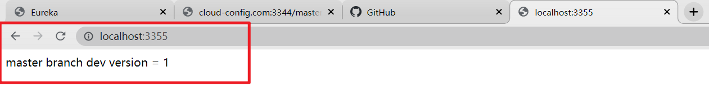


### 10.3、分布式配置动态刷新


在git上修改配置文件后，发现服务端很快就发生了改变，但是客户端没有发生同步，只能将客户端进行重启或者重新加载

#### 10.3.1、客户端修改

**暴露监控端点**

```yaml
# 动态刷新，暴露监控端点
management:
  endpoints:
    web:
      exposure:
        include: "*"
```


**@RefreshScope标签**

```java
@RestController
@RefreshScope // 刷新注解
public class ClientController {
    @Value("${config.info}")
    private String info;
    @GetMapping("/")
    public String hello(){
        return info;
    }
}
```


需要发送一个post请求刷新3355，才可以刷新

http://localhost:3355/actuator/refresh

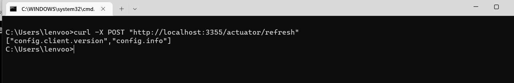


## 十一、消息总线SpringCloud Bus

配置中心问题

- 假如有多个微服务客户端，每个微服务都要执行一次post请求？
- 可否广播，一次通知，处处生效
- 大范围的自动刷新


```
Bus支持两种消息代理：Rabbitmq和kafka

Spring Cloud Bus是用来将分布式系统的节点与轻量级消息系统链接起来的框架
```

https://docs.spring.io/spring-cloud-bus/docs/current/reference/html/#quick-start

### 11.1、介绍

**什么是总线：**

​		在微服务架构的系统中，通常会使用轻量级的消息代理来构建一个共用的消息主题，并让系统中所有微服务实例都连接上来。由于该主题中产生的消息会被所有实例监听和消费，所以称它为消息总线。在总线上的各个实例，都可以方便地广播─些需要让其他连接在该主题上的实例都知道的消息。

基本原理：

​		ConfigClient实例都监听MQ中同一个topic(默认是springCloudBus)。当一个服务刷新数据的时候，它会把这个信息放入到Topic中，这样其它监听同一Topic的服务就能得到通知，然后去更新自身的配置。


### 11.2、Bus全局广播刷新

添加 `cloud-config-client3366`服务

```
现在：
	service：cloud-config-service3344
	client:cloud-config-client3366, cloud-config-client3355
```


**设计思想：**

1. 利用消息总线触发一个客户端/bus/refresh，而刷新所有客户端

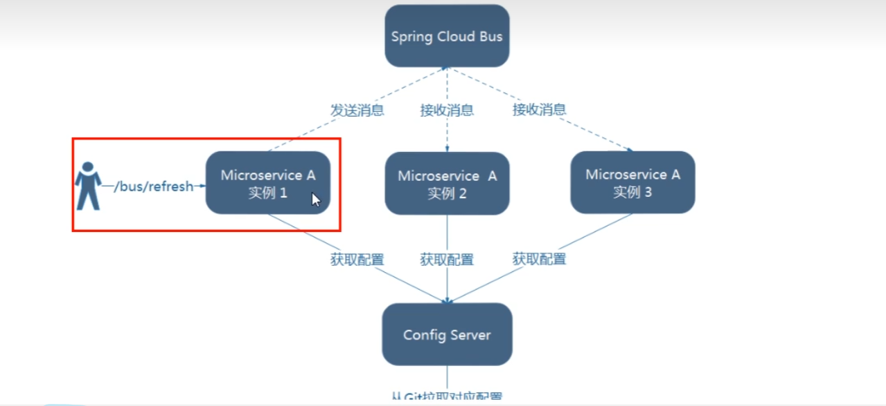

  2.利用消息总线触发一个服务端CondifServer的/bus/refresh端点，而刷新所有客户端的		配置

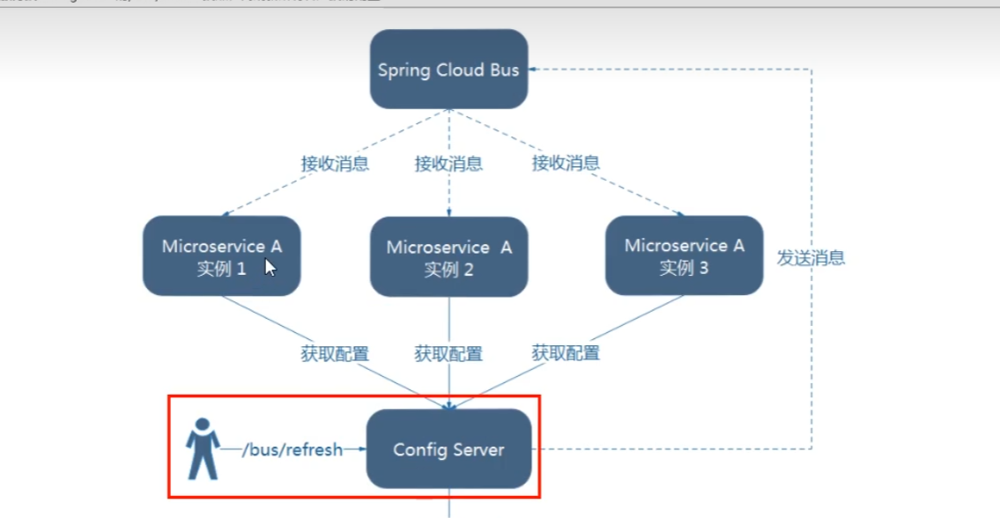

使用服务端取刷新客户端更加合适：

1. 破坏了微服务的单一性，因为微服务本身是业务模块，他本不应该承担配置刷新的职责
2. 破坏了微服务结点的对等性
3. 有一定的局限性，微服务迁移地址发生变化


#### 11.2.1、为微服务添加消息总线支持


Server添加消息总线支持

```xml
<!--   消息总线 bus + rabbitmq-->
<dependency>
    <groupId>org.springframework.cloud</groupId>
    <artifactId>spring-cloud-starter-bus-amqp</artifactId>
</dependency>
```


```yaml
server:
  port: 3344
spring:
  application:
    name: cloud-config
  cloud:
    config:
      server:
        git:
          uri: https://gitee.com/dang-huifeng/springCloud-config.git # git 地址
          search-paths: # 搜索目录
            - springCloud-config
          username: 1049334207@qq.com
          password: dhf200827
          default-label: master
      label: master # 读取分支
  rabbitmq:
    host: centos.com
    port: 5672
    password: dhf200827
    username: danghf
eureka:
  instance:
    instance-id: cloud-config-center3344
  client:
    fetch-registry: true
    register-with-eureka: true
    service-url:
      defaultZone: http://eureka7001.com:7001/eureka
# rabbitmq相关配置，暴露bus刷新配置的端点
management:
  endpoints:
    web:
      exposure:
        include: busrefresh
```


Client配置消息总线

```yaml
server:
  port: 3355
spring:
  application:
    name: config-client
  cloud:
    config:
      label: master # 分支名称
      name: cloud-config # 配置文件名称
      profile: dev # 环境
      uri: http://localhost:3344 # 配置中心地址
      # http://localhost:3344/{lable}/{name}-{profile}.yaml
      # http://localhost:3344/master/cloud-config-dev.yaml
  rabbitmq:
    host: centos.com
    port: 5672
    password: dhf200827
    username: danghf
eureka:
  client:
    service-url:
      defaultZone: http://eureka7001.com:7001/eureka

# 动态刷新，暴露监控端点
management:
  endpoints:
    web:
      exposure:
        include: "*"
```


此时变更后只需要刷新3343，其他微服务都会刷新

`curl -X POST "http://localhost:3344/actuator/busrefresh"`


### 11.2、Bus动态刷新定点通知


> ```
> curl -X POST "http://localhost:3344/actuator/busrefresh/{destinations}"
> ```


以运行在3355端口上的config-client（服务名称）为例

curl -X POST “http://localhost:3344/actuator/busrefresh/config-client:3355”

**注意：**

**是服务名称：spring.application.name，不是实例id**

**路径区分大小写，eureka默认的服务名称是大写的**


## 十二、SpringCloud Stream 消息驱动


**屏蔽底层消息中间件的差异,降低切换成本，统一消息的编程模型**

[官方文档](https://spring.io/projects/spring-cloud-stream#learn)

### 12.1、介绍

官方定义Spring Cloud Stream是一个构建消息驱动微服务的框架。
应用程序通过inputs或者outputs来与Spring Cloud Stream中binder对象交互。
通过我们配置来binding(绑定)，而Spring Cloud Stream 的binder对象负责与消息中间件交互。所以，我们只需要搞清楚如何与Spring Cloud Stream交互就可以方便使用消息驱动的方式。
通过使用Spring lntegration来连接消息代理中间件以实现消息事件驱动。
Spring Cloud Stream为一些供应商的消息中间件产品提供了个性化的自动化配置实现，引用了发布-订阅、消费组、分区的三个核心概念。

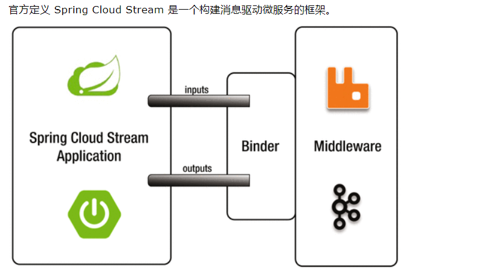

目前仅支持：**RabbitMQ**，**APache Kafka**

[Binder](https://docs.spring.io/spring-cloud-stream/docs/current/reference/html/)

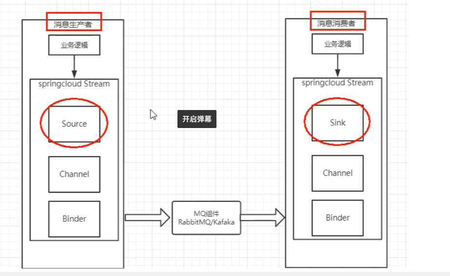

### 12.2、stream常用注解简介

- Binder：很方便的连接中间件，屏蔽差异
- Channel：信道
- Source和Sink：简单的可理解为参照对象是Spring Cloud Stream自身，从Stream发布消息就是输出，接受消息就是输入。
- @Input：标识输入信道，通过该输入信道收到的消息进入应用程序
- @Output：标识输出信道，发布的消息将通过该信道离开应用程序
- StreamListener：监听队列，用于消费者的队列的消息接收
- EnableBinding：将信道channel和交换机Exchange绑定在一起


### 12.3、消息驱动之生产者

`cloud-steam-producter8801`

#### 12.3.1、pom

```xml
<dependencies>
    <dependency>
        <groupId>org.springframework.boot</groupId>
        <artifactId>spring-boot-starter-web</artifactId>
    </dependency>
    <dependency>
        <groupId>org.springframework.boot</groupId>
        <artifactId>spring-boot-starter-actuator</artifactId>
    </dependency>
    <dependency>
        <groupId>org.springframework.boot</groupId>
        <artifactId>spring-boot-devtools</artifactId>
    </dependency>
    <dependency>
        <groupId>org.springframework.cloud</groupId>
        <artifactId>spring-cloud-starter-netflix-eureka-client</artifactId>
    </dependency>
    <dependency>
        <groupId>org.springframework.cloud</groupId>
        <artifactId>spring-cloud-starter-stream-rabbit</artifactId>
    </dependency>
</dependencies>
```


#### 12.3.2、yaml

```yaml
server:
  port: 8801
spring:
  application:
    name: cloud-stream-producter
  rabbitmq:
    host: centos.com
    password: dhf200827
    username: danghf
    port: 5672
  cloud:
    stream:
      binders: # 配置绑定的rabbitmq的服务信息 Map<String, BinderProperties> binders
        rabbit_1: # 是定义的名称，用于binding整合
          type: rabbit # 服务组件类型
          environment: # 设置rabbit相关的环境配置 Map<String,Object>
            spring:
              rabbitmq:
                host: centos.com
                password: dhf200827
                username: danghf
                port: 5672
      bindings: # 服务的整合处理 Map<String, BindingProperties> bindings
        output-out-0: # 通道名称，表示生产者，name-out/in-数字
          destination: topicExchange # 表示使用的exchange名称
          connect-type: application/json # 设置消息的类型，文本：text/plain，json：application/json
          binder: rabbit_1  # 设置要绑定的消息服务的具体设置
eureka:
  instance:
    instance-id: producter8801
  client:
    service-url:
      defaultZone: http://eureka7001.com:7001/eureka,http://eureka7002.com:7002/eureka
```


#### 12.3.3、启动类

```java
@SpringBootApplication
@EnableEurekaClient
public class Producer8801 {
    public static void main(String[] args) {
        SpringApplication.run(Producer8801.class,args);
    }
}
```


#### 12.3.4、业务类

Service

```java
public interface IMessageService {
    public String send(String message);
}
```

Impl

已过时

```java
@EnableBinding(Source.class) // 消息推送的管道，消息发送者
public class IMessageServiceImpl implements IMessageService {
    @Resource
    private MessageChannel output; // 消息发生管道
    @Override
    public String send(String message) {
        output.send(MessageBuilder.withPayload(message).build());
        System.out.println("output 发送: " + message);
        return null;
    }
```

没过时的：

```java
package com.dhf.service.impl;

import org.springframework.integration.support.MessageBuilder;
@Service
public class IMessageServiceImpl implements IMessageService {
    @Autowired
    private StreamBridge streamBridge;

    @Override
    public String send(String message) {
        // output-out-0 yaml文件，信道全名称
        streamBridge.send("output-out-0", MessageBuilder.withPayload(message).build());
        System.out.println("output 发送: " + message);
        return null;
    }
}
```


Controller

```java
@RestController
public class ProdController {
    @Autowired
    private IMessageService messageService;
    @GetMapping("/send")
    public String sendMessage(String message){
        return messageService.send(message);
    }
}
```

### 12.4、消息驱动之消费者

`cloud-streram-consumer8802`,`cloud-streram-consumer8803`


#### 12.4.1、pom

```xml
<dependencies>
    <dependency>
        <groupId>org.springframework.boot</groupId>
        <artifactId>spring-boot-starter-web</artifactId>
    </dependency>
    <dependency>
        <groupId>org.springframework.boot</groupId>
        <artifactId>spring-boot-starter-actuator</artifactId>
    </dependency>
    <dependency>
        <groupId>org.springframework.boot</groupId>
        <artifactId>spring-boot-devtools</artifactId>
    </dependency>
    <dependency>
        <groupId>org.springframework.cloud</groupId>
        <artifactId>spring-cloud-starter-netflix-eureka-client</artifactId>
    </dependency>
    <dependency>
        <groupId>org.springframework.cloud</groupId>
        <artifactId>spring-cloud-starter-stream-rabbit</artifactId>
    </dependency>
</dependencies>
```


#### 12.4.2、yaml

```yaml
server:
  port: 8802
spring:
  application:
    name: cloud-stream-comsumer
  rabbitmq:
    host: centos.com
    password: dhf200827
    username: danghf
    port: 5672
  cloud:
    stream:
      binders: # rabbitmq配置
        rabbitmq-0:
          type: rabbitmq
          environment:
            spring:
              rabbitmq:
                host: centos.com
                password: dhf200827
                username: danghf
                port: 5672
      bindings: # 绑定信息
        input-in-0: # 通道名称，input，消费者, 格式：name-in/out-数字
          destination: topicExchange # 交换机名称
          content-type: application/json
          binder: rabbitmq-0 # 绑定的rabbit名称
eureka:
  instance:
    instance-id: consumer8802
  client:
    service-url:
      defaultZone: http://eureka7001.com:7001/eureka,http://eureka7002.com:7002/eureka
```


#### 12.4.3、业务类

过时的：

```java
@RestController
@EnableBinding(Sink.class)
public class ConController {
    @StreamListener(Sink.INPUT)
    public void message(Message<String> message) { // 无返回类型
        System.out.println(message.getPayload());
    }
}
```

没过时的

```java
@Controller
public class ConController {
    @Bean(name = "input") // input-in-0 yaml文件信道名称
    Consumer<String> consumer() {
        return str -> System.out.println("消息：" + str);
    }
}
```


### 12.5、Stream之消息重复消费与持久化


#### 12.5.1、重复消费

`开启新的消费者8803`

```yaml
server:
  port: 8803
spring:
  application:
    name: cloud-stream-consumer8803
  cloud:
    stream:
      bindings: # 没有配置binder使用默认的rabbitmq
        input-in-0:
          destination: topicExchange
          content-type: application/json
  rabbitmq:
    host: centos.com
    password: dhf200827
    username: danghf
    port: 5672
eureka:
  instance:
    instance-id: consumer8803
  client:
    service-url:
      defaultZone: http://eureka7001.com:7001/eureka
```


使用8801去发送消息：

发现：8802和8803都接收到同一份消息，一个消息被消费了两次

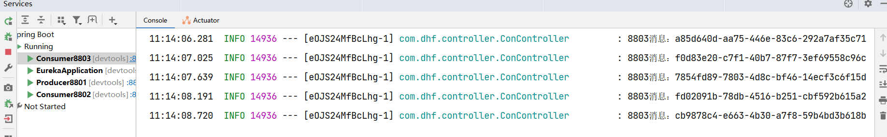


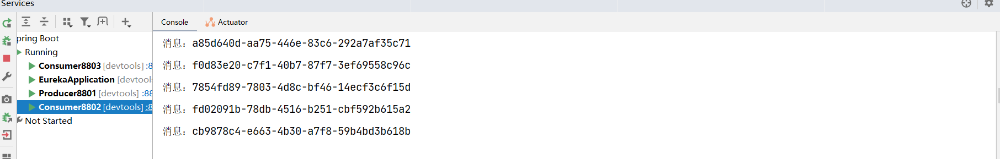


**注意在Stream中处于同一个group中的多个消费者是竞争关系，就能够保证消息只会被其中一个应用消费一次。不同组是可以全面消费的(重复消费)**

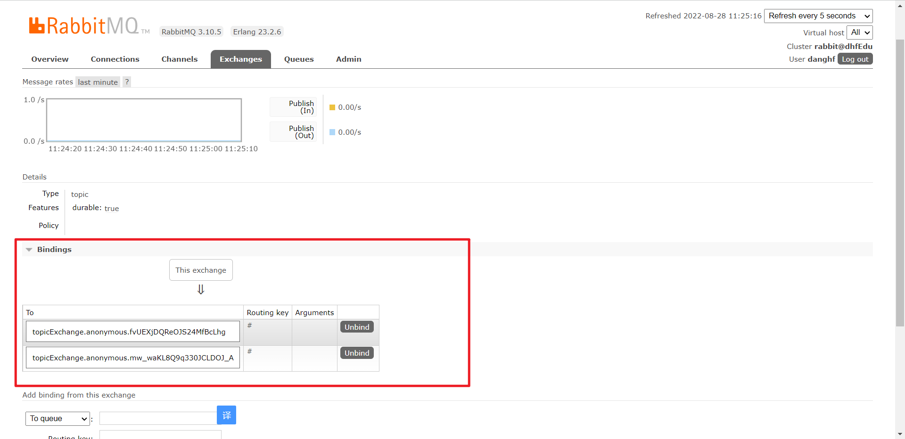

`默认是绑定多个队列，fanout模式`

解决思路：

每个组一个队列，交换机将消息发送到多个队列，但是每个组内只能消费一次，变成直接交换机


```yaml
group: group8802
```

```yaml
group: group8803
```

此时队列名称变成组名了

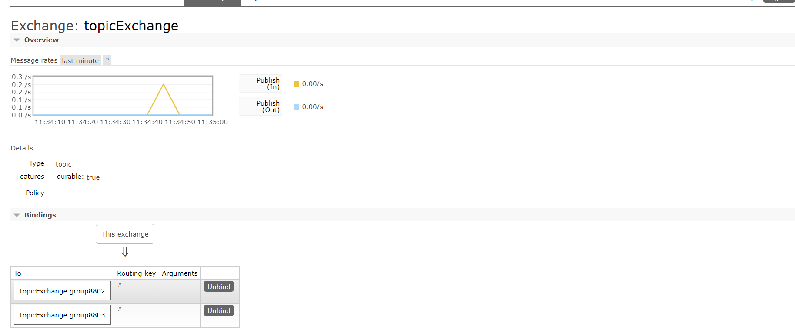

`同一个小组内消息默认轮询消费`

#### 12.5.2、消息持久化

停掉8802和8803

删掉8802的分组group，【不删8803的】

此时8801进行消息的多次发送消息后

启动8802和8803

发现：

- 8802后台没有打印消息
- 8803后台打印出消息【开启分组后，默认支持持久化】


## 十三、SpringCloud Sleuth分布式请求链路跟踪


### 13.1、问题

在微服务框架中，一个由客户端发起的请求在后端系统中会经过多个不同的的服务节点调用来协同产生最后的请求结果，每—个前段请求都会形成一条复杂的分布式服务调用链路，链路中的任何一环出现高延时或错误都会引起整个请求最后的失败。


### 13.2、搭建链路监控

`centsos /usr/local/zipkin_jar`

运行`java -jar zipkin-server-2.23.4-exec.jar  `，开启zipkin

访问`9411`端口

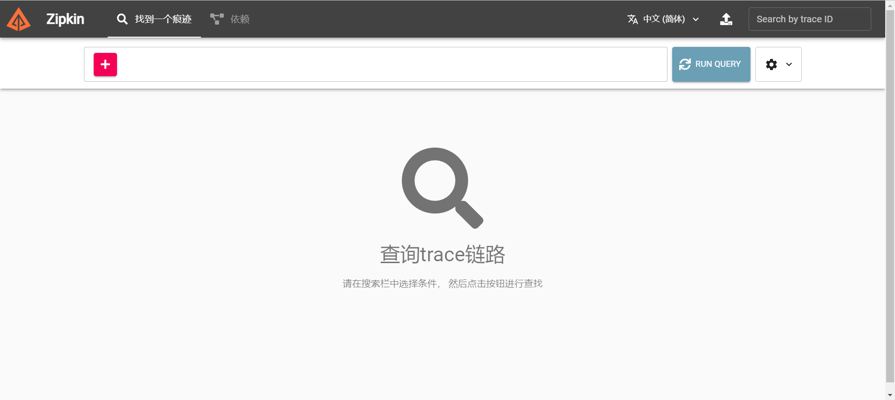


### 13.3、demo

在8001和80端修改配置

```xml
<dependency>
    <groupId>org.springframework.cloud</groupId>
    <artifactId>spring-cloud-starter-zipkin</artifactId>
    <version>2.2.8.RELEASE</version>
</dependency>
```

```yaml
spring:
  application:
    name: cloud-hystrix-payment8001
  zipkin:
    base-url: http://centos.com:9411 # zipkin地址
  sleuth:
    sampler:
      probability: 1 # 采集率，0-1之间，1表示全部采集
```


开启服务：7001，8001，80

80=>调用8001的服务

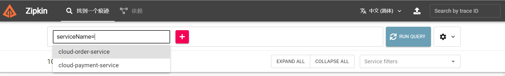

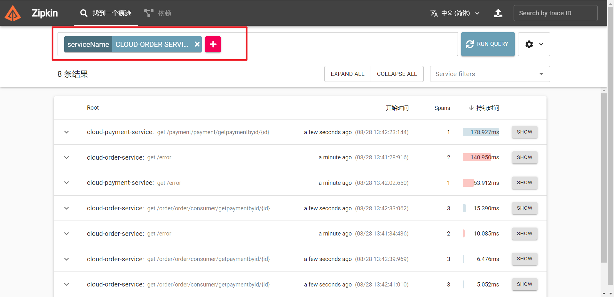


## 十四、SpringCloud Alibaba

官网：

[springcloud](https://spring.io/projects/spring-cloud-alibaba)

[github](https://github.com/alibaba/spring-cloud-alibaba/blob/2.2.x/README-zh.md)

## 十五：Nacos服务注册和配置中心

`nacos = eureka + config + bus`

nacos：一个更易于构建云原生应用的动态服务发现、配置管理和服务管理平台。

### 15.1、nacos之服务注册中心

[nacos-discovery](https://spring-cloud-alibaba-group.github.io/github-pages/2021/en-us/index.html#_spring_cloud_alibaba_nacos_discovery)

#### 15.1.1、服务提供者注册

`alibaba-nacos-producer9001`，`alibaba-nacos-producer9002`


**POM**

```xml
<dependencies>
    <dependency>
        <groupId>org.springframework.boot</groupId>
        <artifactId>spring-boot-starter-web</artifactId>
    </dependency>
    <dependency>
        <groupId>org.springframework.boot</groupId>
        <artifactId>spring-boot-starter-actuator</artifactId>
    </dependency>
    <dependency>
        <groupId>org.springframework.boot</groupId>
        <artifactId>spring-boot-devtools</artifactId>
    </dependency>
    <!--  nacos 服务发现-->
    <dependency>
        <groupId>com.alibaba.cloud</groupId>
        <artifactId>spring-cloud-starter-alibaba-nacos-discovery</artifactId>
    </dependency>
</dependencies>
```


**Yaml**

```yaml
server:
  port: 9001
spring:
  application:
    name: nacos-producer
  cloud:
    nacos:
      discovery:
        server-addr: centos.com:8848
management:
  endpoints:
    web:
      exposure:
        include: "*"
```


**启动类**

```java
@SpringBootApplication
@EnableDiscoveryClient
public class Pro9001 {
    public static void main(String[] args) {
        SpringApplication.run(Pro9001.class,args);
    }
}
```


**业务类**

```java
@RestController
public class ProController {
    @Value("${server.port}")
    private String port;

    @GetMapping("/hello")
    public String hello(){
        return "hello nacos discovery in port " + port;
    }
}
```


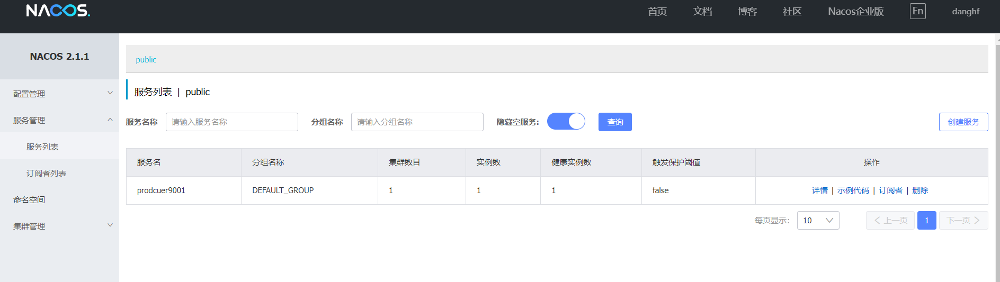


启动多个消费者后【不需要配置实例名，服务名一样就好】

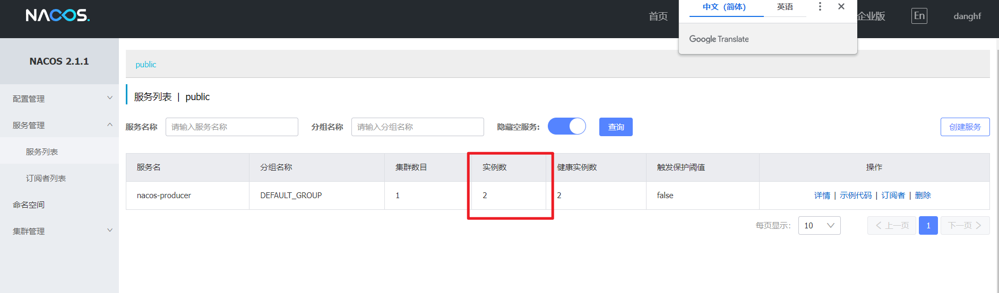

#### 15.1.2、服务消费者注册

`alibaba-nacos-consumer8080`


**YAML**

```yaml
server:
  port: 8080
spring:
  application:
    name: nacos-consumer
  cloud:
    nacos:
      server-addr: centos.com:8848
management:
  endpoints:
    web:
      exposure:
        include: "*"
```


**POM**

```xml
<dependencies>
    <dependency>
        <groupId>org.springframework.boot</groupId>
        <artifactId>spring-boot-starter-web</artifactId>
    </dependency>
    <dependency>
        <groupId>org.springframework.boot</groupId>
        <artifactId>spring-boot-starter-actuator</artifactId>
    </dependency>
    <dependency>
        <groupId>org.springframework.boot</groupId>
        <artifactId>spring-boot-devtools</artifactId>
    </dependency>
    <dependency>
        <groupId>com.alibaba.cloud</groupId>
        <artifactId>spring-cloud-starter-alibaba-nacos-discovery</artifactId>
        <exclusions>
            <exclusion>
                <groupId>org.springframework.cloud</groupId>
                <artifactId>spring-cloud-starter-netflix-ribbon</artifactId>
            </exclusion>
        </exclusions>
    </dependency>
    <dependency>
        <groupId>org.springframework.cloud</groupId>
        <artifactId>spring-cloud-starter-openfeign</artifactId>
    </dependency>
    <dependency>
        <groupId>org.springframework.cloud</groupId>
        <artifactId>spring-cloud-starter-loadbalancer</artifactId>
    </dependency>
</dependencies>
```


**启动类**

```java
@SpringBootApplication
@EnableDiscoveryClient
@EnableFeignClients
public class Con8080 {
    public static void main(String[] args) {
        SpringApplication.run(Con8080.class,args);
    }
}
```


**client**

```java
@Component
@FeignClient(name = "nacos-producer")
public interface ProClient {
    @GetMapping("/hello")
    String hello();
}
```


**controller**

```java
@RestController
public class ConController {
    @Autowired
    private ProClient proClient;
    @GetMapping("/hello")
    public String hello(){
        return proClient.hello();
    }
}
```


### 15.2、各种服务中心注册对比

| 组件名    | 语言 | cap          | 服务健康检查 | 对外暴露接口 |
| --------- | ---- | ------------ | ------------ | ------------ |
| Eureka    | java | ap（可用性） | 可配支持     | HTTP         |
| Zookeeper | java | cp（一致性） | 支持         | 客户端       |
| Consul    | go   | cp           | 支持         | HTTP/D       |
| Nacos     |      | cp+ap        |              |              |

` 集群默认支持的是CAP原则中的AP原则，但是也可切换为CP原则`

Nacos支持AP个CP模式切换


### 15.3、Nacos作为服务配置中心

#### 15.3.1、基础配置

`alibaba-config-nacos-client3377`

 **POM**

```xml
<dependencies>
    <!--  nacos config-->
    <dependency>
        <groupId>org.springframework.cloud</groupId>
        <artifactId>spring-cloud-starter-alibaba-nacos-config</artifactId>
        <version>0.9.0.RELEASE</version>
    </dependency>
    <dependency>
        <groupId>org.springframework.boot</groupId>
        <artifactId>spring-boot-starter-web</artifactId>
    </dependency>
    <dependency>
        <groupId>org.springframework.boot</groupId>
        <artifactId>spring-boot-starter-actuator</artifactId>
    </dependency>
    <dependency>
        <groupId>com.alibaba.cloud</groupId>
        <artifactId>spring-cloud-starter-alibaba-nacos-discovery</artifactId>
    </dependency>
    <dependency>
        <groupId>org.springframework.boot</groupId>
        <artifactId>spring-boot-devtools</artifactId>
    </dependency>
</dependencies>
```


**bootstrap.yaml**

```yaml
server:
  port: 3377
spring:
  application:
    name: nacos-config
  cloud:
    nacos:
      discovery:
        server-addr: centos.com:8848
      config:
        server-addr: centos.com:8848 # nacos作为配置中心
        file-extension: yaml # 指定yaml格式的配置
# dataID
# ${spring.application.name}-${spring.profile.active}.${spring.cloud.nacos.config.file-extension}
# nacos-config-dev.yaml 加载的是这个yaml文件
```


**application.yaml**

```yaml
spring:
  profiles:
    active: dev # 发开环境
```


**主启动**

```java
@SpringBootApplication
@EnableDiscoveryClient
public class NacosConfig3377 {
    public static void main(String[] args) {
        SpringApplication.run(NacosConfig3377.class,args);
    }
}
```


**controller**

```java
@RestController
@RefreshScope
public class ConfigController {
    @Value("${config.info}")
    private String config;
    @GetMapping("/")
    public String hello(){
        return config;
    }
}
```


在 Nacos Spring Cloud 中，`dataId` 的完整格式如下：

`${prefix}-${spring.profiles.active}.${file-extension}`

- `prefix` 默认为 `spring.application.name` 的值，也可以通过配置项 `spring.cloud.nacos.config.prefix`来配置。
- `spring.profiles.active` 即为当前环境对应的 profile，详情可以参考 [Spring Boot文档](https://docs.spring.io/spring-boot/docs/current/reference/html/boot-features-profiles.html#boot-features-profiles)。 **注意：当 `spring.profiles.active` 为空时，对应的连接符 `-` 也将不存在，dataId 的拼接格式变成 `${prefix}.${file-extension}`**

- `file-exetension` 为配置内容的数据格式，可以通过配置项 `spring.cloud.nacos.config.file-extension` 来配置。目前只支持 `properties` 和 `yaml` 类型。
- 通过 Spring Cloud 原生注解 `@RefreshScope` 实现配置自动更新：


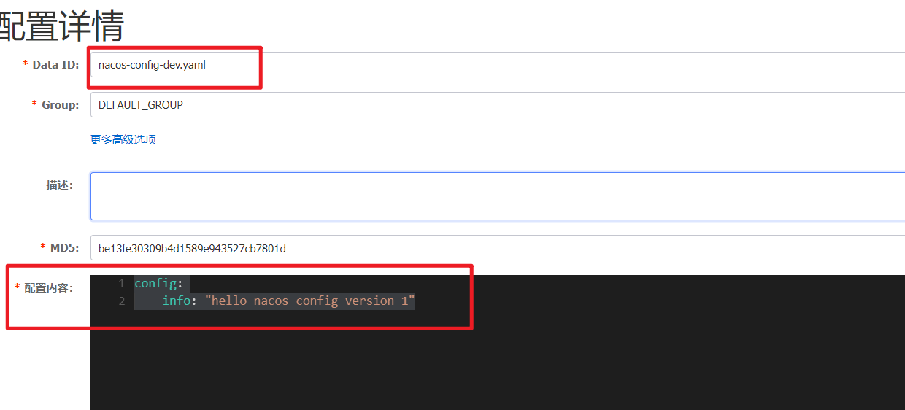

Data ID必须是xxxx.yaml不能是.yml


访问：`http://localhost:3377/`

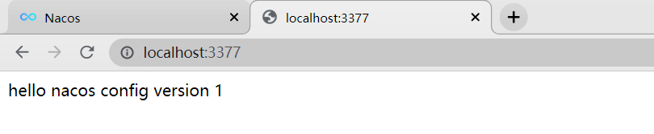


```
当配置文件更新后，服务也会自动更新，@RefreshScope
```


#### 15.3.2、分类配置

Namespace + Group + Data ID


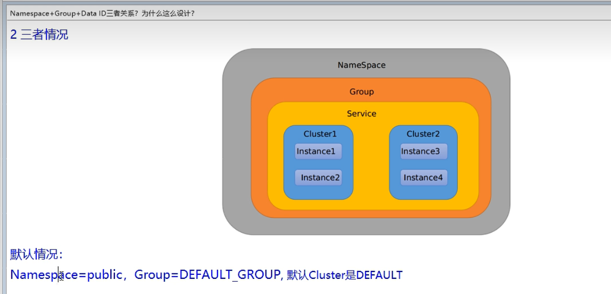


Namespace主要用来实现隔离

比如多个开发环境，每个Namespace之间是隔离的

Service就是微服务;一个Service可以包含多个Cluster(集群)，Nacos默认Cluster是DEFAULT,Cluster是对指定微服务的一个虚拟划分。比方说为了容灾，将Service微服务分别部署在了杭州机房和广州机房，这时就可以给杭州机房的Service微服务起一个集群名称(HZ) ,给广州机房的Service微服务起一个集群名称(GZ)，还可以尽量让同一个机房的微服务互相调用，以提升性能。


**Data ID方案**

通过设置spring.profile.active来切换不同的环境，读取不同的配置文件


**Group分组方案**

```yaml
spring:
  application:
    name: nacos-config
  cloud:
    nacos:
      discovery:
        server-addr: centos.com:8848
      config:
        server-addr: centos.com:8848 # nacos作为配置中心
        file-extension: yaml # 指定yaml格式的配置
        group: DEFAULT_GROUP # default DEFAULT_GROUP
```


**Namespace方案**


```yaml
spring:
  application:
    name: nacos-config
  cloud:
    nacos:
      discovery:
        server-addr: centos.com:8848
      config:
        server-addr: centos.com:8848 # nacos作为配置中心
        file-extension: yaml # 指定yaml格式的配置
#        group: DEFAULT_GROUP
#        namespace: # namespace ID
```


### 15.4、Nacos集群和持久化配置（重要）

[文档](https://nacos.io/zh-cn/docs/deployment.html)

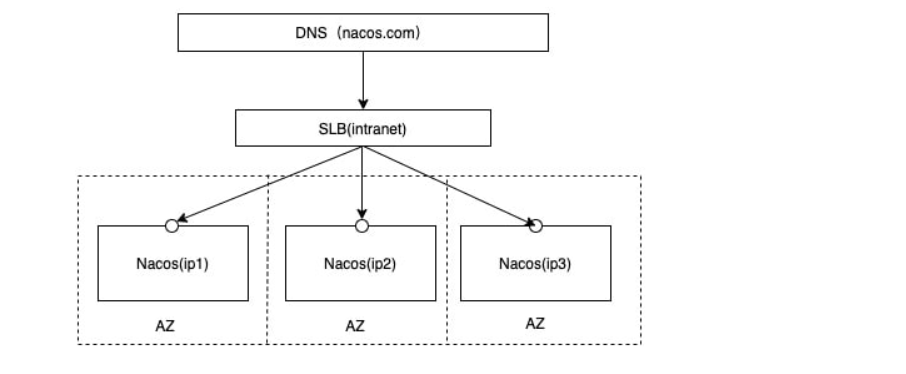

Nacos本身自带一个嵌入式数据库，所以在不配置mysql的情况下，Nacos本身仍然会将配置文件等持久化，保存到自带的嵌入式数据库，如果Nacos集群，每个Nacos使用自己的配置文件，就会发送数据冲突，数据一致性等问题，所以采用集中式存储支持集群化部署，目前只支持mysql数据库

https://nacos.io/zh-cn/docs/deployment.html


- 在 /conf/cluster.conf中配置集群 ip：port
- nginx配置
- 参考[文档](http://c.biancheng.net/springcloud/nacos.html)

## 十六、Sentinel实现熔断与限流


[官网](https://github.com/alibaba/Sentinel/releases)下载jar包

[官方文档](https://sentinelguard.io/zh-cn/docs/logs.html)

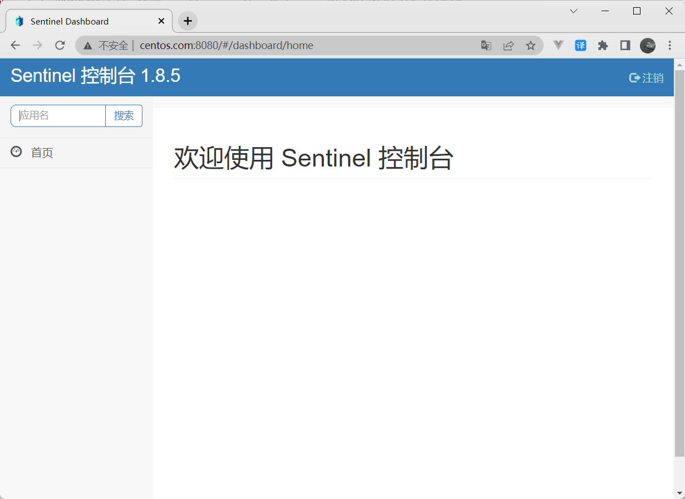


### 16.1、初始化演示

`alibaba-sentinel-service8401`

#### 16.1.1、pom

```xml
<dependencies>
        <dependency>
            <groupId>org.springframework.boot</groupId>
            <artifactId>spring-boot-starter-web</artifactId>
        </dependency>
        <dependency>
            <groupId>org.springframework.boot</groupId>
            <artifactId>spring-boot-starter-actuator</artifactId>
        </dependency>
        <dependency>
            <groupId>org.springframework.boot</groupId>
            <artifactId>spring-boot-devtools</artifactId>
        </dependency>
        <dependency>
            <groupId>com.alibaba.cloud</groupId>
            <artifactId>spring-cloud-starter-alibaba-nacos-discovery</artifactId>
            <exclusions>
                <exclusion>
                    <groupId>org.springframework.cloud</groupId>
                    <artifactId>spring-cloud-starter-netflix-ribbon</artifactId>
                </exclusion>
            </exclusions>
        </dependency>
        <dependency>
            <groupId>org.springframework.cloud</groupId>
            <artifactId>spring-cloud-starter-openfeign</artifactId>
        </dependency>
        <dependency>
            <groupId>org.springframework.cloud</groupId>
            <artifactId>spring-cloud-loadbalancer</artifactId>
        </dependency>
        <dependency>
            <groupId>com.alibaba.csp</groupId>
            <artifactId>sentinel-datasource-nacos</artifactId>
        </dependency>
        <dependency>
            <groupId>com.alibaba.cloud</groupId>
            <artifactId>spring-cloud-starter-alibaba-sentinel</artifactId>
        </dependency>
    </dependencies>
```


#### 16.1.2、yaml

```yaml
server:
  port: 8401
spring:
  application:
    name: sentinel-service
  cloud:
    nacos:
      discovery:
        server-addr: centos.com:8848
    sentinel:
      transport:
        dashboard: centos.com:8080
        # 默认8791端口，加入端口被占用，会自动 +1 扫描
        port: 8791
management:
  endpoints:
    web:
      exposure:
        include: "*"
```


#### 16.1.3、controller

```java
@SpringBootApplication
@EnableDiscoveryClient
public class SentinelMain {
    public static void main(String[] args) {
        SpringApplication.run(SentinelMain.class,args);
    }
}
```

```java
@RestController
public class FlowController {
    @GetMapping("/testA")
    public String testA(){
        return "hello  testA";
    }
    @GetMapping("/testB")
    public String testB(){
        return "hello  testB";
    }
}
```


`sentinel使用的懒加载机制，只有当你访问过后，才可以被检测到`

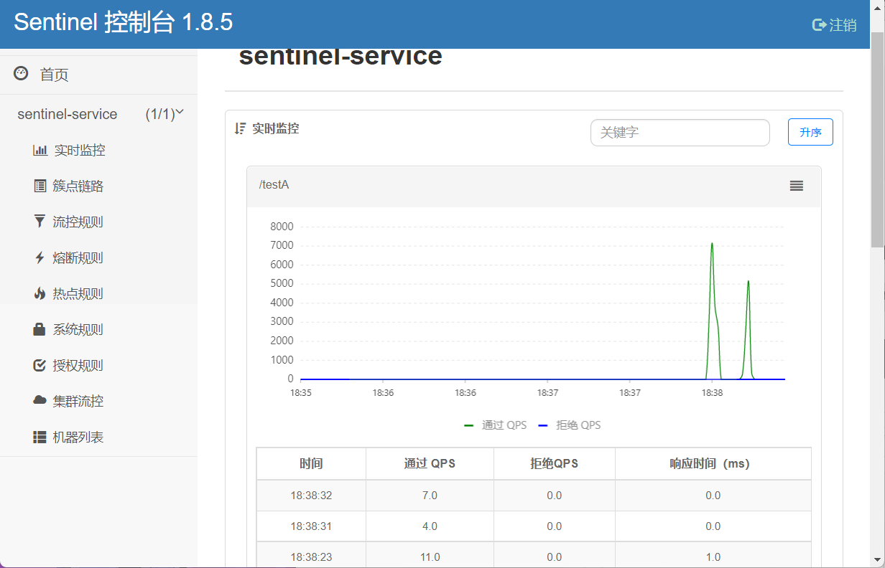


### 16.2、流控规则

#### 16.2.1、基本介绍

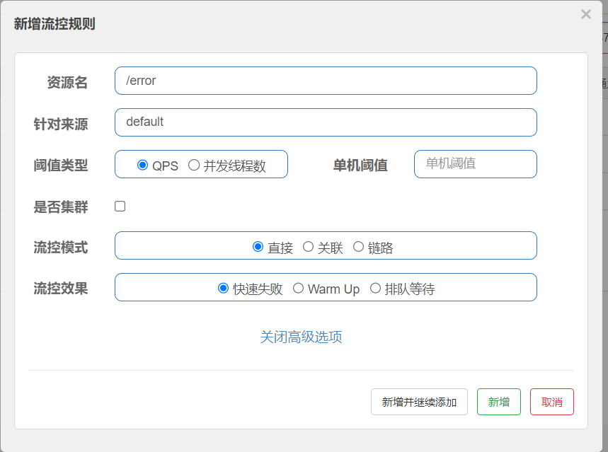


- 资源名：唯一名称，默认请求路径
- 针对来源：sentinel可以针对调用者进行限流，填写微服务名。默认default（不区分来源）
- 阈值类型/单机阈值：
  - QPS（每秒的请求数量）：当调用改api的QPS达到阈值的时候，进行限流
  - 线程数：当调用改api的线程数达到阈值的时候，进行限流
- 是否集群：不需要集群
- 流控模式：
  - 直接：当api达到限流条件时，直接限流
  - 关联：当关联的资源达到阈值时，就限流自己**【A调用B，当B达到阈值，就限流A】**
  - 链路：只记录指定链路上的流量（指定资源从入口资源进来的流量，如果达到阈值，就进行限流）【api级别的针对来源】
- 流控效果：
  - 快速失败：直接失败，抛异常
  - Warm Up：根据codeFactor（加载冷因子，默认3）的值，从阈值/codeFactor，经过预热时长，才达到设置的QPS阈值【令牌桶算法】
  
    - 【**大白话来讲，刚开始把 阈值调低，不要让过多的请求访问服务器，导致冲垮服务器，先让服务器一点一点处理，再慢慢加量。经典的例子：一个好久没运动的人，你刚开始让他跑10圈，他可能会累死，但是你给他一个预热时间，比如 第一天跑 2圈，第三天跑 3 圈，第四天跑4圈，以此类推...**
  
      **默认coldFactor为3，即请求QPS从(threshold / 3)开始，经多少预热时长才逐渐升至设定的QPS阈值。**
  
      **如下案例，阀值为10，预热时长设置5秒。**
  
      **系统初始化的阀值为10 / 3约等于3，即阀值刚开始为3，然后过了 5秒后阀值才慢慢升高恢复到10**
    - 】
  - 排队等待：匀速排队，让请求以匀速的速度通过，阈值类型必须设置为QPS，否则无效【漏桶算法】


### 16.3、sentinel熔断降级

[官方文档](https://sentinelguard.io/zh-cn/docs/circuit-breaking.html)

Sentinel 提供以下几种熔断策略：

- 慢调用比例 (`SLOW_REQUEST_RATIO`)：选择以慢调用比例作为阈值，需要设置允许的慢调用 RT（即最大的响应时间），请求的响应时间大于该值则统计为慢调用。当单位统计时长（`statIntervalMs`）内请求数目大于设置的最小请求数目，并且慢调用的比例大于阈值，则接下来的熔断时长内请求会自动被熔断。经过熔断时长后熔断器会进入探测恢复状态（HALF-OPEN 状态），若接下来的一个请求响应时间小于设置的慢调用 RT 则结束熔断，若大于设置的慢调用 RT 则会再次被熔断。
- 异常比例 (`ERROR_RATIO`)：当单位统计时长（`statIntervalMs`）内请求数目大于设置的最小请求数目，并且异常的比例大于阈值，则接下来的熔断时长内请求会自动被熔断。经过熔断时长后熔断器会进入探测恢复状态（HALF-OPEN 状态），若接下来的一个请求成功完成（没有错误）则结束熔断，否则会再次被熔断。异常比率的阈值范围是 `[0.0, 1.0]`，代表 0% - 100%。
- 异常数 (`ERROR_COUNT`)：当单位统计时长内的异常数目超过阈值之后会自动进行熔断。经过熔断时长后熔断器会进入探测恢复状态（HALF-OPEN 状态），若接下来的一个请求成功完成（没有错误）则结束熔断，否则会再次被熔断。


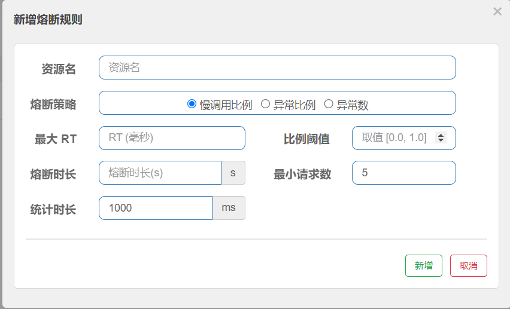


### 16.4、热点key限流

[官方文档](https://sentinelguard.io/zh-cn/docs/parameter-flow-control.html)

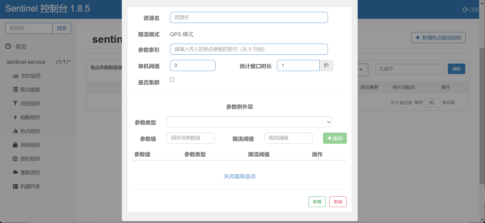


何为热点？热点即经常访问的数据。很多时候我们希望统计某个热点数据中访问频次最高的 Top K 数据，并对其访问进行限制。比如：

- 商品 ID 为参数，统计一段时间内最常购买的商品 ID 并进行限制
- 用户 ID 为参数，针对一段时间内频繁访问的用户 ID 进行限制

热点参数限流会统计传入参数中的热点参数，并根据配置的限流阈值与模式，对包含热点参数的资源调用进行限流。热点参数限流可以看做是一种特殊的流量控制，仅对包含热点参数的资源调用生效。

#### 16.4.1、配置

很简单：自己配，都是中文

```java
@GetMapping("/hotKey")
    @SentinelResource(value = "hotKey",blockHandler = "deal_hotKey") // 自定义一个处理异常方法
    // sentinel 资源名 为  /hotkey( mapping )  或者  hotkey( @SentinelResource )
    public String hotKey(@RequestParam(value = "p1",required = false) String p1,
                         @RequestParam(value = "p2",required = false)String p2){
        return "#********************  hotKey  *********************#";
    }
    public String deal_hotKey(@RequestParam(value = "p1",required = false) String p1,
                              @RequestParam(value = "p2",required = false)String p2,
                              BlockException blockException){
        return "请稍后再试，hotKeyException";
    }
```

**注意**：

- 上述接口有两个参数，p1和p2，但是他们都不是必须的（required = false），你可以选则带或不带参数，**but，无论什么情况，p1永远是第一个参数，索引为0，哪怕你不带p1参数，只带p2参数，那么p2还是第二个参数，而不是第一个**


#### 16.4.2、配置例外项


```
我们期望p1参数当它是某个特殊值时，它的限流值和平时不一样特例
假如当p1的值等于5时，它的阈值可以达到200
```


**@SentinelResource主管配置出错，业务出错还是报异常**


### 16.5、sentinel系统规则

[官方文档](https://sentinelguard.io/zh-cn/docs/system-adaptive-protection.html)

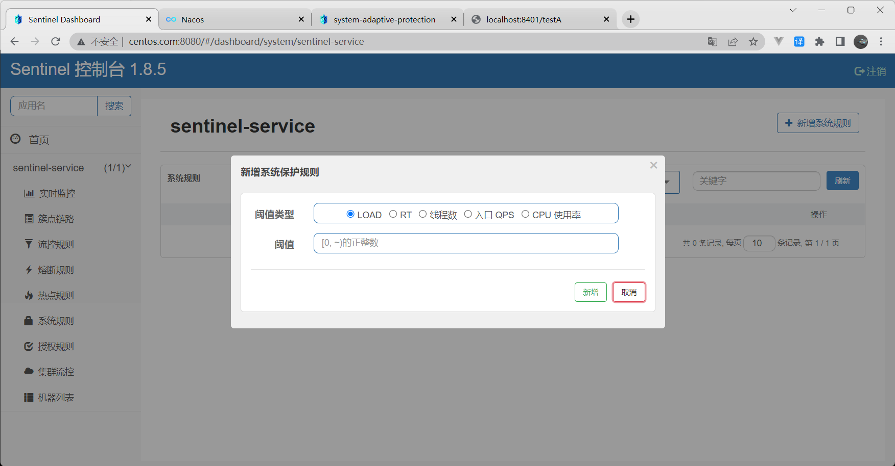


系统规则支持以下的阈值类型：

- **Load**（仅对 Linux/Unix-like 机器生效）：当系统 load1 超过阈值，且系统当前的并发线程数超过系统容量时才会触发系统保护。系统容量由系统的 `maxQps * minRt` 计算得出。设定参考值一般是 `CPU cores * 2.5`。
- **CPU usage**（1.5.0+ 版本）：当系统 CPU 使用率超过阈值即触发系统保护（取值范围 0.0-1.0）。
- **RT**：当单台机器上所有入口流量的平均 RT 达到阈值即触发系统保护，单位是毫秒。
- **线程数**：当单台机器上所有入口流量的并发线程数达到阈值即触发系统保护。
- **入口 QPS**：当单台机器上所有入口流量的 QPS 达到阈值即触发系统保护。


### 16.6、@SentinelResource注解

[官方文档](https://sentinelguard.io/zh-cn/docs/annotation-support.html)

#### 16.6.1、初识

```java
@RestController
public class SenResController {
    @GetMapping("/byResource")
    @SentinelResource(value = "get",blockHandler = "get_handler")
    public String get(){
        return "按照资源名限流";
    }
    public String get_handler(BlockException e){
        return "被限流了" + e.toString();
    }
}
```


**注意**：

sentinel本身会使用url作为资源名，但是在@SentinelResource（value = “value”,blockHandler=“block”）注解下，会的得到一个新的资源名，资源名为value属性的值，而其中的blockhandler降级方法支队资源名为value的资源生效，对getMapping（/url）不生效，getMapper()如果出现限流，还是会使用默认的限流`Blocked by Sentinel (flow limiting)`，

比如：GetMapping(“/url”)，@SentinelResource(value = “url”,blockhandler = “handler”),

对 /url设置的的流控是不能触发handler方法，只有对 url 设置的流控才能触发handler方法，**但是**，某些流控只能设置 url 而不能设置 /url ，比如热点key


#### 16.6.2、加深

**问题**：

1. 系统默认的，没有体现我们自己的业务要求。
2. 依照现有条件，我们自定义的处理方法又和业务代码耦合在一块，不直观。
3. 每个业务方法都添加一个兜底的，那代码膨胀加剧。
4. 全局统—的处理方法没有体现。


全局异常统一处理

```java
/**
 * @author 党
 * @version 1.0
 * 2022/9/2   16:36
 * 定义限流处理类
 */
public class CustomerBlockHandler {
    public static String handlerException(BlockException e){
        return "全局异常处理 ---- 1";
    }
    public static String handlerException2(BlockException e){
        return "全局异常处理 ---- 2";
    }
}
```

```java
@GetMapping("/test")
@SentinelResource(value = "test",blockHandlerClass = CustomerBlockHandler.class, blockHandler = "handlerException2")
public String test(){
    return "test";
}
```


### 16.7、sentinel服务熔断

`sentinel整合 ribbon + openfeign + fallback`

服务提供者：9004，9003

服务消费者：8084

9004/9003

```java
@RestController
public class MController {
    @Value("${server.port}")
    private String port;
    public static String[] arr = new String[3];
    static {
        arr[0] = "str : 0";
        arr[1] = "str : 1";
        arr[2] = "str : 2";
    }
    @GetMapping("/get/{id}")
    public String get(@PathVariable int id){
        return arr[id] + " forward " + port;
    }
}
```

客户端：8084

```java
@RestController
public class ConController {
    @Autowired
    private ServerClient serverClient;
    @GetMapping("/get/{id}")
    @SentinelResource(value = "get")
    public String get(@PathVariable String id){
        return serverClient.get(id);
    }
}
```

时刻记得移除ribbon依赖，使用loadbalancer做负载均衡

如果@SentinelResource，没有配置任何（fallback，handler）就会使用默认的异常，


- **fallback**，fallback只会处理业务异常
- **blockHandler**，blockHandler只负责sentinel控制台配置
- **exceptionsToIgnore**，忽略异常


### 16.8、sentinel持久化规则


将sentinel配置保存到 nacos 中


添加依赖

```xml
<dependency>
    <groupId>com.alibaba.csp</groupId>
    <artifactId>sentinel-datasource-nacos</artifactId>
</dependency>
```


配置yaml

```yaml
server:
  port: 8084
spring:
  application:
    name: alibaba-client
  cloud:
    sentinel:
      transport:
        dashboard: centos.com:8080
        port: 8791
      datasource:
        ds1:
          nacos:
            server-addr: centos.com:8848
            dataId: ${spring.application.name}
            groupId:  DEFAULT_GROUP
            data-type: json
            rule-type: flow
    nacos:
      discovery:
        server-addr: centos.com:8848
management:
  endpoints:
    web:
      exposure:
        include: "*"
```


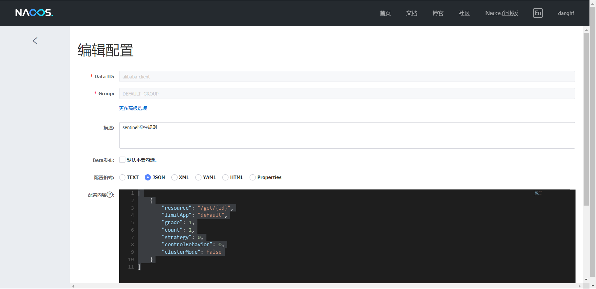

```yaml
[
    {
        "resource": "/get/{id}",
        "limitApp": "default",
        "grade": 1,
        "count": 2,
        "strategy": 0,
        "controlBehavior": 0,
        "clusterMode": false
    }
]
```

resource：资源名。
limitApp：来源应用。
grade：阈值类型。0 表示线程数，1 表示是QPS。
count：单机阈值。
strategy：流控模式。0 表示直接，1 表示关联，2 表示链路。
controlBehavior：流控效果。0 表示快速失败，1 表示Warm up，2 表示排队等待。
clusterMode：是否集群。false 表示否，true 表示是。


`启动完成后，sentinel会检查到nacos中的配置规则`

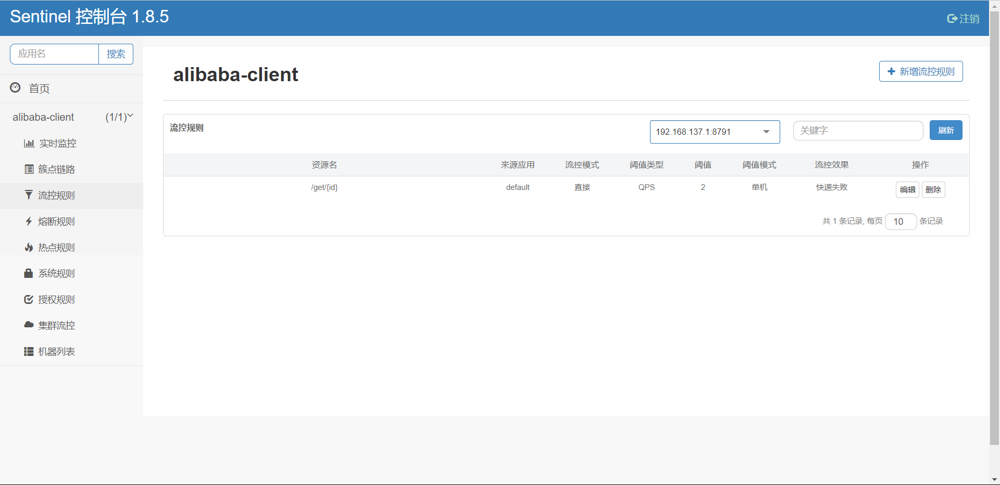


## 十七、分布式事务Alibaba Seata


### 17.1、分布式事务问题由来


`一次业务操作需要跨多个数据源或需要跨多个系统进行远程调用，就会产生分布式事务问题`

- 多数据源


### 17.2、分布式事务过程

[github](https://github.com/seata/seata)

[官方文档](https://seata.io/zh-cn/docs/overview/what-is-seata.html)

分布式事务处理过程的 1 ID + 3 组件模型

- Transaction lD XID：全局唯一的事务ID
- Transaction Coordinator（TC）：事务协调者，维护全局和分支事务的状态，驱动全局事务提交或回滚。
- Transaction Manager（TM）： 事务管理器，定义全局事务的范围，开始全局事务、提交或回滚全局事务。
- Resource Manager（RM）： 资源管理器，管理分支事务处理的资源，与TC交谈以注册分支事务和报告分支事务的状态，并驱动分支事务提交或回滚。

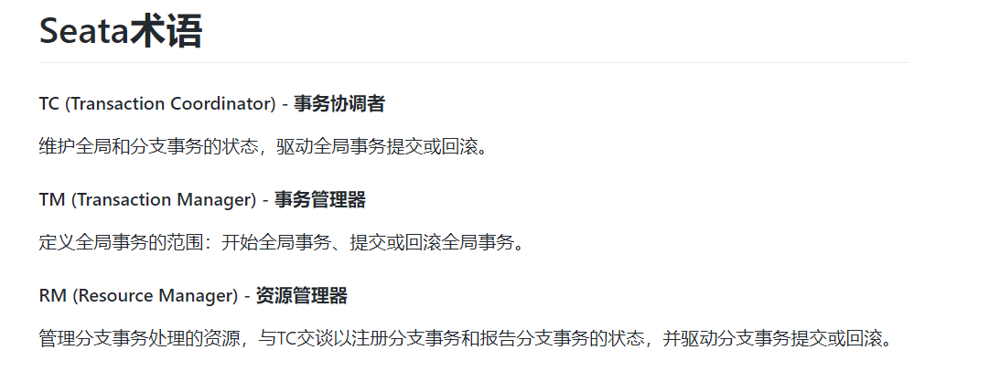


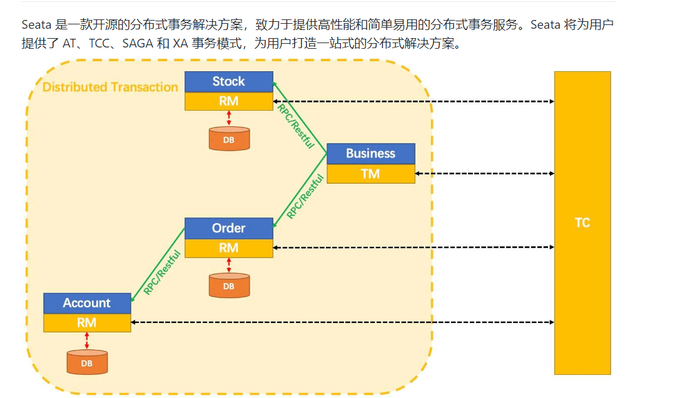


**处理过程**：

1. TM向TC申请开启一个全局事务，全局事务创建成功并生成一个全局唯一的XID
2. XID在微服务调用链路的上下文中传播;
3. RM向TC注册分支事务，将其纳入XID对应全局事务的管辖
4. TM向TC发起针对XID的全局提交或回滚决议;
5. TC调度XID下管辖的全部分支事务完成提交或回滚请求。


### 17.3、seata配置

按照seata/conf.application.example.yml 配置 application.yml

[文档](https://www.jianshu.com/p/37c3640284cc)

### 17.4、数据库准备

```
三个微服务
	订单服务
	库存服务
	账户服务
  用户下单时，在订单服务中创建一个订单，然后远程调用库存服务，减少库存，在通过远程调用减少账户余额，最后修改订单服务状态已完成
```


建立三个数据库

seata_account，seata_order，seata_storage

分别建立表

t_account，t_order，t_storage

按照三个库分别建回滚日志表

```sql
-- 注意此处0.3.0+ 增加唯一索引 ux_undo_log
CREATE TABLE `undo_log` (
  `id` bigint(20) NOT NULL AUTO_INCREMENT,
  `branch_id` bigint(20) NOT NULL,
  `xid` varchar(100) NOT NULL,
  `context` varchar(128) NOT NULL,
  `rollback_info` longblob NOT NULL,
  `log_status` int(11) NOT NULL,
  `log_created` datetime NOT NULL,
  `log_modified` datetime NOT NULL,
  `ext` varchar(100) DEFAULT NULL,
  PRIMARY KEY (`id`),
  UNIQUE KEY `ux_undo_log` (`xid`,`branch_id`)
) ENGINE=InnoDB AUTO_INCREMENT=1 DEFAULT CHARSET=utf8;
```


### 17.5、微服务

`下订单->减库存->扣余额->改状态`

`seata-order`

#### 17.5.1、pom

```xml
<?xml version="1.0" encoding="UTF-8"?>
<project xmlns="http://maven.apache.org/POM/4.0.0"
         xmlns:xsi="http://www.w3.org/2001/XMLSchema-instance"
         xsi:schemaLocation="http://maven.apache.org/POM/4.0.0 http://maven.apache.org/xsd/maven-4.0.0.xsd">
    <parent>
        <artifactId>springcloud</artifactId>
        <groupId>com.example</groupId>
        <version>0.0.1-SNAPSHOT</version>
    </parent>
    <modelVersion>4.0.0</modelVersion>

    <artifactId>seata-order</artifactId>

    <properties>
        <maven.compiler.source>8</maven.compiler.source>
        <maven.compiler.target>8</maven.compiler.target>
    </properties>
    <dependencies>
        <dependency>
            <groupId>org.springframework.boot</groupId>
            <artifactId>spring-boot-starter-web</artifactId>
        </dependency>
        <dependency>
            <groupId>org.springframework.boot</groupId>
            <artifactId>spring-boot-starter-actuator</artifactId>
        </dependency>
        <dependency>
            <groupId>org.springframework.boot</groupId>
            <artifactId>spring-boot-devtools</artifactId>
        </dependency>
        <dependency>
            <groupId>com.alibaba.cloud</groupId>
            <artifactId>spring-cloud-starter-alibaba-nacos-discovery</artifactId>
            <exclusions>
                <exclusion>
                    <groupId>org.springframework.cloud</groupId>
                    <artifactId>spring-cloud-starter-netflix-ribbon</artifactId>
                </exclusion>
            </exclusions>
        </dependency>
        <dependency>
            <groupId>com.alibaba.cloud</groupId>
            <artifactId>spring-cloud-starter-alibaba-seata</artifactId>
        </dependency>
        <dependency>
            <groupId>org.springframework.cloud</groupId>
            <artifactId>spring-cloud-starter-openfeign</artifactId>
            <exclusions>
                <exclusion>
                    <groupId>org.springframework.cloud</groupId>
                    <artifactId>spring-cloud-openfeign-core</artifactId>
                </exclusion>
            </exclusions>
        </dependency>
        <dependency>
            <groupId>org.springframework.cloud</groupId>
            <artifactId>spring-cloud-openfeign-core</artifactId>
            <version>2.2.6.RELEASE</version>
        </dependency>

        <dependency>
            <groupId>org.springframework.cloud</groupId>
            <artifactId>spring-cloud-starter-netflix-ribbon</artifactId>
            <version>2.2.6.RELEASE</version>
        </dependency>
        <dependency>
            <groupId>mysql</groupId>
            <artifactId>mysql-connector-java</artifactId>
        </dependency>
        <dependency>
            <groupId>com.alibaba</groupId>
            <artifactId>druid-spring-boot-starter</artifactId>
        </dependency>
        <dependency>
            <groupId>org.springframework.boot</groupId>
            <artifactId>spring-boot-starter-jdbc</artifactId>
        </dependency>
        <dependency>
            <groupId>com.baomidou</groupId>
            <artifactId>mybatis-plus-boot-starter</artifactId>
        </dependency>
        <!--  mybatis 多数据源配置-->
        <dependency>
            <groupId>com.baomidou</groupId>
            <artifactId>dynamic-datasource-spring-boot-starter</artifactId>
            <version>3.5.2</version>
        </dependency>
    </dependencies>
</project>
```


#### 17.5.2、yaml

```yaml
server:
  port: 2001

spring:
  application:
    name: seata-order-service
  cloud:
    nacos:
      discovery:
        server-addr: centos.com:8848
        group: SEATA_GROUP # 要与 seata 相同
  datasource:
    dynamic: # 多数据源配置
      primary: mysql1
      strict: true #严格匹配数据源,默认false. true未匹配到指定数据源时抛异常,false使用默认数据源
      datasource:
        mysql1:
          driver-class-name: com.mysql.jdbc.Driver
          url: jdbc:mysql://centos.com:3306/seata_order
          username: seata
          password: seata
          type: com.alibaba.druid.pool.DruidDataSource
        mysql2:
          driver-class-name: com.mysql.jdbc.Driver
          url: jdbc:mysql://centos.com:3306/seata_storage
          username: seata
          password: seata
          type: com.alibaba.druid.pool.DruidDataSource
        mysql3:
          driver-class-name: com.mysql.jdbc.Driver
          url: jdbc:mysql://centos.com:3306/seata_account
          username: seata
          password: seata
          type: com.alibaba.druid.pool.DruidDataSource


mybatis-plus:
  mapper-locations: classpath:mapper/*.xml
  configuration:
    log-impl: org.apache.ibatis.logging.stdout.StdOutImpl
    map-underscore-to-camel-case: true

seata:
  service:
    vgroup-mapping:
      default_tx_group: default
    grouplist:
      seata-server: centos.com:8091
      default: centos.com:8091
  config:
    type: nacos
    nacos:
      data-id: seataServer.properties
      server-addr: centos.com:8848
      group: SEATA_GROUP
      username: danghf
      password: dhf200827
  tx-service-group: my_test_tx_group # seata配置文件没有配置，用这个默认的
```


#### 17.5.3、启动问题


```
java.lang.ClassNotFoundException: org.springframework.cloud.openfeign.ribbon.CachingSpringLoadBalancerFactor
```

```
解决方法：找不到CachingSpringLoadBalancerFactor，这个东西在spring-cloud-openfeign-core2.26中存在，但是3版本后剔除了，

```

```xml
<dependency>
    <groupId>org.springframework.cloud</groupId>
    <artifactId>spring-cloud-starter-openfeign</artifactId>
    <exclusions>
        <exclusion>
            <groupId>org.springframework.cloud</groupId>
            <artifactId>spring-cloud-openfeign-core</artifactId>
        </exclusion>
    </exclusions>
</dependency>
<dependency>
    <groupId>org.springframework.cloud</groupId>
    <artifactId>spring-cloud-openfeign-core</artifactId>
    <version>2.2.6.RELEASE</version>
</dependency>
同时引入ribbon 2.2.6
```


#### 17.5.4、说明

我这里配置多数据源，故意抛出RuntimeException观察是否发生回滚


```
艹、配置出问题，暂时弄不好
```


### 17.6、seata补充

Seata 是一款开源的分布式事务解决方案，致力于提供高性能和简单易用的分布式事务服务。Seata 将为用户提供了 **AT、TCC、SAGA 和 XA** 事务模式，为用户打造一站式的分布式解决方案。

`默认是AT`


#### 17.6.1、AT模式

**一阶段加载**

在第一阶段，Seata会拦截业务SQL

1、解析SQL语句，找到业务SQL要更新的业务数据，在业务数据被更新前，将其保存成“before image”，

2、执行业务SQL，更新业务数据，在业务数据更新后

3、将其保存成“after image”，最后生成行锁

以上操作全部在一个数据库事务内完成，这样保证了这一阶段操作的原子性


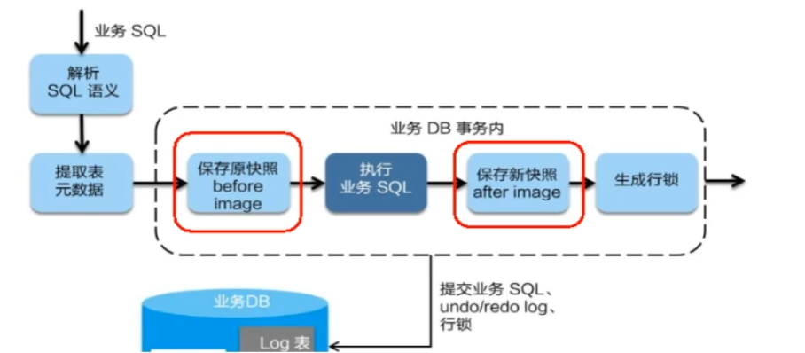


**二阶段提交**

二阶段如果是顺利提交的话

因为业务sql在一阶段已经提交到数据库，所以Seata框架只要将一阶段的快照数据和行锁清除，完成数据清理即可


**三阶段回滚**

二阶段如果是回滚的话，Seata就要回滚一阶段已经执行的业务SQL，还原业务数据

回滚方式使用的“before image”还原业务数据，但在还原前要首先检验脏写，对比数据库“当前业务数据”和“after image”，如果两份数据完全一致就说明没有脏写，可以还原业务数据，如果不一致就说明又脏写，需要人工处理

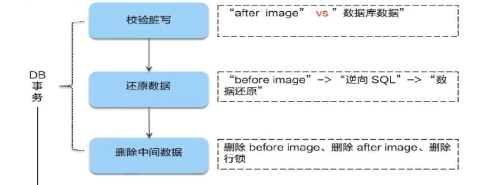


