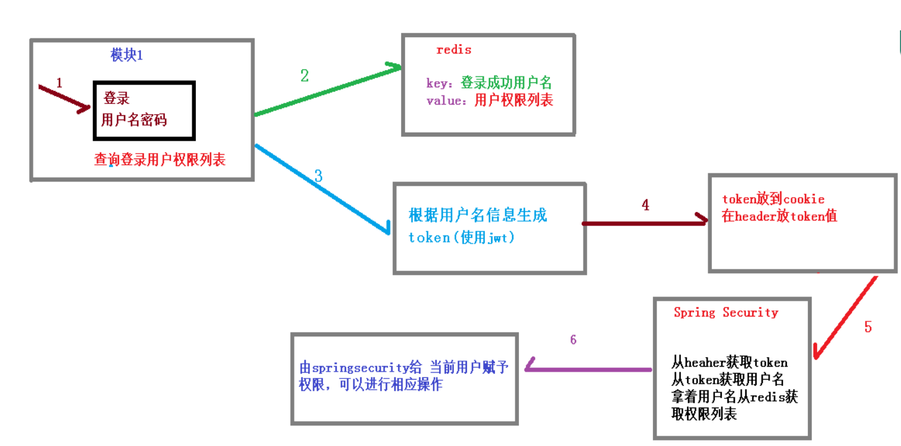
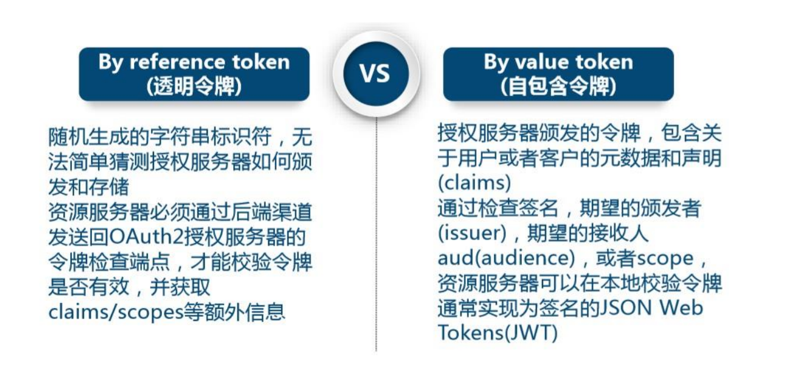
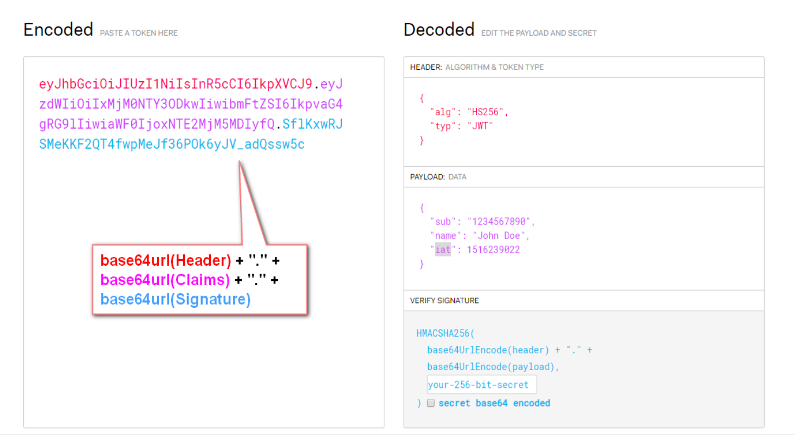
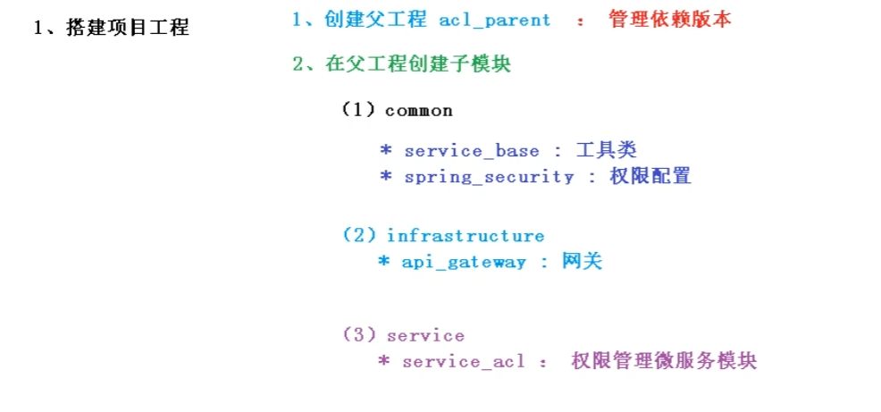

[TOC]


# 1、SpringSecurity 框架介绍

​		Spring 是非常流行和成功的 Java 应用开发框架，Spring Security 正是 Spring 家族中的成员。Spring Security 基于 Spring 框架，提供了一套 Web 应用安全性的完整解决方案。
​		正如你可能知道的关于安全方面的两个主要区域是“认证”和“授权”（或者访问控制），一般来说，Web 应用的安全性包括**用户认证（Authentication）**和**用户授权（Authorization）**两个部分，这两点也是 Spring Security 重要核心功能。
​	（1）**用户认证**指的是：验证某个用户是否为系统中的合法主体，也就是说用户能否访问该系统。用户认证一般要求用户提供用户名和密码。系统通过校验用户名和密码来完成认证过程。通俗点说就是系统认为用户是否能登录
​	（2）**用户授权**指的是验证某个用户是否有权限执行某个操作。在一个系统中，不同用户所具有的权限是不同的。比如对一个文件来说，有的用户只能进行读取，而有的用户可以进行修改。一般来说，系统会为不同的用户分配不同的角色，而每个角色则对应一系列的权限。通俗点讲就是系统判断用户是否有权限去做某些事情。


# 2、SpringSecurity 入门案例

## 2.1、依赖

```xml
<dependency>
    <groupId>org.springframework.boot</groupId>
    <artifactId>spring-boot-starter-security</artifactId>
</dependency>
```


## 2.2、Controller

```java
/**
 * @author 党
 * @version 1.0
 * 2022/7/12   13:56
 */
@RequestMapping("/test")
@RestController
public class TestController {
    @RequestMapping("/hello")
    public String hello(){
        return "hello security";
    }
}
```


## 2.3、页面展示


```
默认账号是user

密码：控制台=>Using generated security password: f2d283c3-a68d-455b-a168-cf66b32792da
```


## 2.4、SpringSecurity 基本原理

​	**SpringSecurity 本质是一个过滤器链：**
​	**从启动是可以获取到过滤器链：**


代码底层流程：重点看三个过滤器：

**FilterSecurityInterceptor**：

​		是一个方法级的权限过滤器, 基本位于过滤链的最底部。

**ExceptionTranslationFilter**：

​		是个异常过滤器，用来处理在认证授权过程中抛出的异常

**UsernamePasswordAuthenticationFilter** ：

​		对/login 的 POST 请求做拦截，校验表单中用户名，密码。


## 2.5、UserDetailsService接口

​		当什么也没有配置的时候，账号和密码是由 Spring Security 定义生成的。而在实际项目中账号和密码都是从数据库中查询出来的。 所以我们要通过自定义逻辑控制认证逻辑。
​		**如果需要自定义逻辑时，只需要实现 UserDetailsService 接口即可。接口定义如下：**

【Server层】

```java
public interface UserDetailsService {
	UserDetails loadUserByUsername(String username) throws UsernameNotFoundException;

}
```

【pojo层】

```java
public interface UserDetails extends Serializable {

	// 表示获取登录用户所有权限
	Collection<? extends GrantedAuthority> getAuthorities();
    // 表示获取密码
    String getPassword();
    // 表示获取用户名
    String getUsername();
    // 表示判断账户是否过期
    boolean isAccountNonExpired();
    // 表示判断账户是否被锁定
    boolean isAccountNonLocked();
    // 表示凭证{密码}是否过期
    boolean isCredentialsNonExpired();
    // 表示当前用户是否可用
    boolean isEnabled();

}
```

【**校验过程**】

```
自定义 过滤器 继承   UsernamePasswordAuthenticationFilter
重写	
public Authentication attemptAuthentication(HttpServletRequest request, HttpServletResponse response)方法【校验】

重写  successfulAuthentication  成功

重写 unsuccessfulAuthentication  失败


```


## 2.6、PasswordEncoder接口

【**对密码进行加密**】

```java
// 表示把参数按照特定的解析规则进行解析
String encode(CharSequence rawPassword);
// 表示验证从存储中获取的编码密码与编码后提交的原始密码是否匹配。如果密码匹配，则返回 true；如果不匹配，则返回 false。第一个参数表示需要被解析的密码。第二个参数表示存储的密码。
boolean matches(CharSequence rawPassword, String encodedPassword);
// 表示如果解析的密码能够再次进行解析且达到更安全的结果则返回 true，否则返回false。默认返回 false。
default boolean upgradeEncoding(String encodedPassword) {
return false;
}
```


实现类：

​	**BCryptPasswordEncoder**


```java
@Test
public void test01(){
//
创建密码解析器
BCryptPasswordEncoder bCryptPasswordEncoder = new
BCryptPasswordEncoder();
//
对密码进行加密
String atguigu = bCryptPasswordEncoder.encode("atguigu");
//
打印加密之后的数据
System.out.println("加密之后数据：\t"+atguigu);
//
判断原字符加密后和加密之前是否匹配
boolean result = bCryptPasswordEncoder.matches("atguigu", atguigu);
//
打印比较结果
System.out.println("比较结果：\t"+result);
}

```


# 3、Security Web 权限方案


## 3.1、设置登录系统的账号、密码

### 3.1.1、配制文件

```yaml
spring:
  security:
    user:
      name: dhf
      password: dhf200827
```


### 3.1.2、通过配置类

```java
@Configuration
public class SecurityConfig extends WebSecurityConfigurerAdapter {
    @Override
    protected void configure(AuthenticationManagerBuilder auth) throws Exception{
        //加密
        BCryptPasswordEncoder passwordEncoder = new BCryptPasswordEncoder();
        //加密
        String encode = passwordEncoder.encode("dhf200827");
        //添加账户，密码
        auth.inMemoryAuthentication().withUser("danghf").password(encode).roles("");
    }
    @Bean//加密必须放入PasswordEncoder对象，默认没有，不然怎么解码
    public PasswordEncoder passwordEncoder(){
        return new BCryptPasswordEncoder();
    }

}
```


### 3.1.3、自定义编写实现类

【实现UserDateilsService接口】

```java
@Service("userDetailsService")
public class UserService implements UserDetailsService {
    private final String USERNAME = "danghf";
    private final String PASSWORD = "dhf200827";
    @Override
    public UserDetails loadUserByUsername(String username) throws UsernameNotFoundException {
        //通过username获取一个UserDetails
        //...查数据库，获取账号密码
        //User实现了userDetails接口
        // select password form user where username = username
        //
        String password = new BCryptPasswordEncoder().encode(PASSWORD);
        //权限集合
        List<GrantedAuthority> authorities =
                AuthorityUtils.commaSeparatedStringToAuthorityList("role");
        return new User(USERNAME, password, authorities);
    }
}
```


【配置】

```java
@Configuration
public class SecurityConfigTest extends WebSecurityConfigurerAdapter {
    @Autowired
    UserDetailsService userDetailsService;
    @Override
    protected void configure(AuthenticationManagerBuilder auth) throws Exception {
        auth.userDetailsService(userDetailsService).passwordEncoder(passwordEncoder());
    }
    @Bean
    public PasswordEncoder passwordEncoder(){
        return new BCryptPasswordEncoder();
    }

}
```


## 3.2、查询数据库完成登录

### 3.2.1、application.yaml

```yaml
server:
  port: 8080
spring:
  datasource:
    url: jdbc:mysql://localhost:3306/security
    username: root
    password: root
    driver-class-name: com.mysql.jdbc.Driver

mybatis-plus:
  configuration:
    aggressive-lazy-loading: true
  mapper-locations: classpath:mapper/**/*.xml
```


### 3.2.2、 pojo

```java
@Data
@AllArgsConstructor
@NoArgsConstructor
@ToString
public class User {
    private Integer id;
    private String username;
    private String password;

}
```


### 3.2.3、mapper

```java
@Mapper
public interface UserMapper {
    @Select("select * from users where username = #{username}")
    User getUserByUsername(@Param("username") String username);
}
```


### 3.2.4、service


```java
@Service
public class UserService implements UserDetailsService {
    @Autowired
    UserMapper mapper;
    @Override
    public UserDetails loadUserByUsername(String username) throws UsernameNotFoundException {
        User user = mapper.getUserByUsername(username);
        if (user!=null){
            BCryptPasswordEncoder passwordEncoder = new BCryptPasswordEncoder();
            String encode = passwordEncoder.encode(user.getPassword());
            List<GrantedAuthority> authorities = AuthorityUtils.commaSeparatedStringToAuthorityList("role");

            return new org.springframework.security.core.userdetails.User(
                    username,encode,authorities
            );
        }else {
            throw new UsernameNotFoundException("用户未找到");
        }
    }
}
```


## 3.3、自定义登录页面


【配置】

```java
@Configuration
public class SecurityConfig extends WebSecurityConfigurerAdapter {
    @Autowired
    UserDetailsService userDetailsService;

    @Override
    protected void configure(AuthenticationManagerBuilder auth) throws Exception {
        auth.userDetailsService(userDetailsService).passwordEncoder(passwordEncoder());
    }

    @Override
    protected void configure(HttpSecurity http) throws Exception {
        //配置没有访问权限
        http.exceptionHandling().accessDeniedPage("/unlogin.html");
        http.formLogin()
                .loginPage("/login.html") //登录页面
                .loginProcessingUrl("/user/login") //页面提交地址
                .defaultSuccessUrl("/hello").permitAll() //成功后跳转
                .and()
                .authorizeRequests() //请求批注
                .antMatchers("/","/index").permitAll()//不需要权限
                .antMatchers("/hello").hasAuthority("admin")//需要权限
                // 多个权限
                .antMatchers("/d","/a").hasAnyAuthority("admin","role")
                .antMatchers("/hello").hasRole("admin")//需要角色
                // 多个角色
                .antMatchers("/a","/b").hasAnyRole("admin","role")
                .anyRequest().authenticated() //剩余请求，登陆后访问
                .and()
                .csrf().disable(); //关闭csrf防护
    }

    @Bean
    public PasswordEncoder passwordEncoder() {
        return new BCryptPasswordEncoder();
    }
}
```


【登录页面】

```html
<body>
    <form method="post" action="/user/login">
        <table border="1">
            <tr>
                <td>用户名</td>
                <td><input type="text" name="username"></td>
            </tr>
            <tr>
                <td>密码</td>
                <td><input type="password" name="password"></td>
            </tr>
            <tr>
                <input type="submit" value="login">
            </tr>
        </table>
    </form>
</body>
```


## 3.4、基于权限访问控制


### 3.4.1、hasAuthority方法

**如果当前的主体具有指定的权限，则返回 true,否则返回 false**

【配置类】

```java
@Override
    protected void configure(HttpSecurity http) throws Exception {
        //配置没有访问权限
        http.exceptionHandling().accessDeniedPage("/unlogin.html");
        http.formLogin()
                .loginPage("/login.html") //登录页面
                .loginProcessingUrl("/user/login") //页面提交地址
                .defaultSuccessUrl("/hello").permitAll() //成功后跳转
                .and()
                .authorizeRequests() //请求批注
                .antMatchers("/","/index").permitAll()//不需要权限
                .antMatchers("/hello").hasAuthority("admin")//需要权限
                // 多个权限
                .antMatchers("/d","/a").hasAnyAuthority("admin","role")
                .antMatchers("/hello").hasRole("admin")//需要角色
                // 多个角色，用户拥有任何一个角色都可以访问
                .antMatchers("/a","/b").hasAnyRole("admin","role")
                .anyRequest().authenticated() //剩余请求，登陆后访问
                .and()
                .csrf().disable(); //关闭csrf防护
    }
```


【UserDetailsService】

```java
@Service
public class UserService implements UserDetailsService {
    @Autowired
    UserMapper mapper;
    @Override
    public UserDetails loadUserByUsername(String username) throws UsernameNotFoundException {
        User user = mapper.getUserByUsername(username);
//        QueryWrapper<User> wrapper = new QueryWrapper<User>().eq("username",username);
//        User user1 = mapper.selectOne(wrapper);
        if (user!=null){
            BCryptPasswordEncoder passwordEncoder = new BCryptPasswordEncoder();
            String encode = passwordEncoder.encode(user.getPassword());
            List<GrantedAuthority> authorities;
            if (user.getUsername().equals("admin")){
                // 赋予 admin 权限和  admin角色 ，角色需要 ROLE_前缀
                 authorities = AuthorityUtils.commaSeparatedStringToAuthorityList("admin,ROLE_admin");
            }else {
                authorities = AuthorityUtils.commaSeparatedStringToAuthorityList("");
            }

            return new org.springframework.security.core.userdetails.User(
                    username,encode,authorities
            );
        }else {
            throw new UsernameNotFoundException("用户未找到");
        }
    }
}
```


### 3.4.2、hasAnyAuthority方法

**用于允许多个权限访问**

**只要满足某个权限就可以访问**

```java
用于多个权限
.antMatchers("/test/hello").hasAuthority("admin,manager") //admin和manager都可以访问
```


### 3.4.3、hasRole方法

**如果用户具备给定角色就允许访问,否则出现 403。
如果当前主体具有指定的角色，则返回 true。**

【配置类】

```java
.antMatchers("/test/hello").hasRole("admin") // 在hasRole方法中，变成 ROLE_admin
```


【service】

```java
List<GrantedAuthority> authorities = AuthorityUtils.commaSeparatedStringToAuthorityList("admin,ROLE_admin");
```


### 3.4.3、hasAnyRole方法


**类似hasRole()**

**满足任意角色**


## 3.5、自定义403页面


```java
@Override
    protected void configure(HttpSecurity http) throws Exception {
        //配置没有访问权限
        http.exceptionHandling().accessDeniedPage("/unlogin.html");
        http.formLogin()
                .loginPage("/login.html") //登录页面
                .loginProcessingUrl("/user/login") //页面提交地址
                .defaultSuccessUrl("/hello").permitAll() //成功后跳转
                .and()
                .authorizeRequests() //请求批注
                .antMatchers("/","/index").permitAll()//不需要权限
                .antMatchers("/hello").hasAuthority("admin")//需要权限
                // 多个权限
                .antMatchers("/d","/a").hasAnyAuthority("admin","role")
                .antMatchers("/hello").hasRole("admin")//需要角色
                // 多个角色，用户拥有任何一个角色都可以访问
                .antMatchers("/a","/b").hasAnyRole("admin","role")
                .anyRequest().authenticated() //剩余请求，登陆后访问
                .and()
                .csrf().disable(); //关闭csrf防护
    }
```


## 3.6、注解使用

### 3.6.1、@Secured

判断是否具有角色，另外需要注意的是这里匹配的字符串需要添加前缀 “**ROLE_**”

使用注解要先开启注解功能

```java
@EnableGlobalMethodSecurity(securedEnabled = true)
```

```java
public @interface Secured {

   /**
    * Returns the list of security configuration attributes (e.g. ROLE_USER,ROLE_ADMIN).
    * @return String[] The secure method attributes
    */
   String[] value();

}
```

【**在控制器上使用注解**】控制器上的就是路径


```java
	@RequestMapping("/Secured")
    @Secured({"ROLE_ADMIN","ROLE_ALL"})
    public String test(){
        return "@Secured 角色注解";
    }
```


【**在登陆时，为用户添加权限，角色**】

```java
@Service
public class UserService implements UserDetailsService {
    @Autowired
    UserMapper userMapper;
    @Override
    public UserDetails loadUserByUsername(String username) throws UsernameNotFoundException {
        User user = userMapper.getUser(username);
        if (user!=null){
            BCryptPasswordEncoder encoder = new BCryptPasswordEncoder();
            String encode = encoder.encode(user.getPassword());
            //权限
            List<GrantedAuthority> authorities;
            if (username.equals("admin")){
                // 角色
                authorities = AuthorityUtils.commaSeparatedStringToAuthorityList("ROLE_admin");
            }else {
                authorities = AuthorityUtils.commaSeparatedStringToAuthorityList("");
            }
            return new org.springframework.security.core.userdetails.User(
                    username,
                    encode,
                    authorities
            );
        }
        return null;
    }
}
```


### 3.6.2、@PreAuthorize

**开启注解功能**

```java
@EnableGlobalMethodSecurity(prePostEnabled = true)
```


```java
public @interface PreAuthorize {

   /**
    * @return the Spring-EL expression to be evaluated before invoking the protected
    * method
    */
   String value();

}
```


@PreAuthorize：注解适合进入方法前的权限验证，@PreAuthorize可以将登录用户的roles/premissons参数传到方法


【**Service**】

```java
authorities = AuthorityUtils.commaSeparatedStringToAuthorityList("LUCY");
//用户拥有LUCY权限
```


```java
@RequestMapping("/PreAuthorize")
@ResponseBody
@PreAuthorize("hasAuthority('LUCY')")
public String test2(){
    return "@PreAuthorize 注解";
}
```


### 3.6.3、@PostAuthorize

**开启注解功能**

```java
@EnableGlobalMethodSecurity(prePostEnabled = true)
```


```java
public @interface PostAuthorize {

   /**
    * @return the Spring-EL expression to be evaluated after invoking the protected
    * method
    */
   String value();

}
```


在方法执行之后在校验

```java
@RequestMapping("/PostAuthorize")
@PostAuthorize("hasRole('ROLE_ADMIN')")
public String test3(){
    System.err.println("PostAuthorize.......");
    return "PostAuthorize 注解";
}
```


**没有权限的人照样可以执行方法，可以看见控制台输出，但是在返回时检验权限，没有权限，403**


### 3.6.4、@PostFilter

```java
public @interface PostFilter {

   /**
    * @return the Spring-EL expression to be evaluated after invoking the protected
    * method
    */
   String value();

}
```

**权限验证之后对数据进行过滤，留下用户名为admin的数据**

```java
@RequestMapping("/PostFilter")
@ResponseBody
@PostFilter("filterObject.username == 'admin'")
public String test4(){
    List<User> users = new ArrayList<>();
    users.add(new User());
    users.add(new User());
    return "";
}
```


### 3.6.5、@PreFilter

**对传入方法的数据进行过滤**


## 3.7、用户注销


### 9.7.1、在配置类中添加退出映射地址


```java
http.logout().logoutUrl("/login").logoutSuccessUrl("/test/hello").permitAll();


/login ==> 设置退出的地址 随意写
/test/hello ==> 退出后跳转的位置
```


## 3.8、基于数据库的  记住（自动登录）


### 3.8.1、创建表

```sql
CREATE TABLE `persistent_logins` (
`username` varchar(64) NOT NULL,
`series` varchar(64) NOT NULL,
`token` varchar(64) NOT NULL,
`last_used` timestamp NOT NULL DEFAULT CURRENT_TIMESTAMP ON UPDATE
CURRENT_TIMESTAMP,
PRIMARY KEY (`series`)
) ENGINE=InnoDB DEFAULT CHARSET=utf8;
```


### 3.8.2、配置类


```java
@Configuration
public class SecurityConfig extends WebSecurityConfigurerAdapter {
    //注入数据源
    @Resource
    public DataSource dataSource;
    @Bean
    public PersistentTokenRepository persistentTokenRepository(){
        JdbcTokenRepositoryImpl jdbcTokenRepository = new JdbcTokenRepositoryImpl();
        jdbcTokenRepository.setDataSource(dataSource);
        //自动创建表，,第一次执行会创建，以后要执行就要删除掉！
//        jdbcTokenRepository.setCreateTableOnStartup(true);
        return jdbcTokenRepository;
    }


    @Autowired
    UserService userService;
    @Override
    protected void configure(AuthenticationManagerBuilder auth) throws Exception {
        auth.userDetailsService(userService).passwordEncoder(passwordEncoder());
    }
    @Bean
    public PasswordEncoder passwordEncoder(){
        return new BCryptPasswordEncoder();
    }

    @Override
    protected void configure(HttpSecurity http) throws Exception {
//        http.rememberMe()
//                .tokenRepository(persistentTokenRepository())
//                .tokenValiditySeconds(60) //有效时长 单位 s
//                .userDetailsService(userService);

        //用户注销
        http.logout().logoutUrl("/logout").logoutSuccessUrl("/").permitAll();
        //自定义403
//        http.exceptionHandling().accessDeniedPage("/unlogin.html");
        http.formLogin()
                .loginPage("/login.html")
                .loginProcessingUrl("/user/login")
                .defaultSuccessUrl("/").permitAll() // 登录成功
                .and()
                .authorizeRequests()
                .and()
                .csrf().disable(); //关闭csrf防护
    }
}

```


### 3.8.3、登录页面


```html
<!DOCTYPE html>
<html lang="en" xmlns:th="http://www.thymeleaf.org">
<head>
    <meta charset="UTF-8">
    <title>Title</title>
</head>
<body>
    <form th:action="@{/user/login}" method="post">
        用户名：<input type="text" name="username"><br>
        密 码：<input type="password" name="password"><br>
        <!--name是固定的-->
        记住：<input type="checkbox" name="remember-me" th:title="记住密码">
        <input type="submit" value="login">
    </form>
</body>
</html>
```


## 3.9、CSRF


​		跨站请求伪造（英语：Cross-site request forgery），也被称为 one-click
attack 或者 session riding，通常缩写为 CSRF 或者 XSRF， 是一种挟制用户在当前已登录的 Web 应用程序上执行非本意的操作的攻击方法。跟跨网站脚本（XSS）相比，XSS利用的是用户对指定网站的信任，CSRF 利用的是网站对用户网页浏览器的信任。跨站请求攻击，简单地说，是攻击者通过一些技术手段欺骗用户的浏览器去访问一个自己曾经认证过的网站并运行一些操作（如发邮件，发消息，甚至财产操作如转账和购买商品）。由于浏览器曾经认证过，所以被访问的网站会认为是真正的用户操作而去运行。这利用了 web 中用户身份验证的一个漏洞：简单的身份验证只能保证请求发自某个用户的浏览器，却不能保证请求本身是用户自愿发出的。从 Spring Security 4.0 开始，默认情况下会启用 CSRF 保护，以防止 CSRF 攻击应用程序，Spring Security CSRF 会针对 PATCH，POST，PUT 和 DELETE 方法进行防护。


# 4、微服务权限方案


## 4.1、什么是微服务


**1、微服务由来** 

微服务最早由 Martin Fowler 与 James Lewis 于 2014 年共同提出，微服务架构风格是一种使用一套小服务来开发单个应用的方式途径，每个服务运行在自己的进程中，并使用轻量级机制通信，通常是 HTTP API，这些服务基于业务能力构建，并能够通过自动化部署机制来独立部署，这些服务使用不同的编程语言实现，以及不同数据存储技术，并保持最低限度的集中式管理。

**2、微服务优势** 

（1）微服务每个模块就相当于一个单独的项目，代码量明显减少，遇到问题也相对来说比较好解决。

（2）微服务每个模块都可以使用不同的存储方式（比如有的用 redis，有的用 mysql等），数据库也是单个模块对应自己的数据库。

（3）微服务每个模块都可以使用不同的开发技术，开发模式更灵活。

**3、微服务本质** 

（1）微服务，关键其实不仅仅是微服务本身，而是系统要提供一套基础的架构，这种架构使得微服务可以独立的部署、运行、升级，不仅如此，这个系统架构还让微服务与微服务之间在结构上“松耦合”，而在功能上则表现为一个统一的整体。这种所谓的“统一的整体”表现出来的是统一风格的界面，统一的权限管理，统一的安全策略，统一的上线过程，统一的日志和审计方法，统一的调度方式，统一的访问入口等等。

（2）微服务的目的是有效的拆分应用，实现敏捷开发和部署。


## 4.2、微服务认证与授权实现思路


### 1、认证授权过程分析

（1）如果是基于 Session，那么 Spring-security 会对 cookie 里的 sessionid 进行解析，找到服务器存储的 session 信息，然后判断当前用户是否符合请求的要求。

（2）如果是 token，则是解析出 token，然后将当前请求加入到 Spring-security 管理的权限信息中去




如果系统的模块众多，每个模块都需要进行授权与认证，所以我们选择基于 token 的形式进行授权与认证，用户根据用户名密码认证成功，然后获取当前用户角色的一系列权限值，并以用户名为 key，权限列表为 value 的形式存入 redis 缓存中，根据用户名相关信息生成 token 返回，浏览器将 token 记录到 cookie 中，每次调用 api 接口都默认将 token 携带到 header 请求头中，Spring-security 解析 header 头获取 token 信息，解析 token 获取当前用户名，根据用户名就可以从 redis 中获取权限列表，这样 Spring-security 就能够判断当前请求是否有权限访问


### 2、权限管理数据模型


```sql
# Host: localhost  (Version 5.7.19)
# Date: 2019-11-18 15:49:15
# Generator: MySQL-Front 6.1  (Build 1.26)


#
# Structure for table "acl_permission"
#

CREATE TABLE `acl_permission` (
  `id` char(19) NOT NULL DEFAULT '' COMMENT '编号',
  `pid` char(19) NOT NULL DEFAULT '' COMMENT '所属上级',
  `name` varchar(20) NOT NULL DEFAULT '' COMMENT '名称',
  `type` tinyint(3) NOT NULL DEFAULT '0' COMMENT '类型(1:菜单,2:按钮)',
  `permission_value` varchar(50) DEFAULT NULL COMMENT '权限值',
  `path` varchar(100) DEFAULT NULL COMMENT '访问路径',
  `component` varchar(100) DEFAULT NULL COMMENT '组件路径',
  `icon` varchar(50) DEFAULT NULL COMMENT '图标',
  `status` tinyint(4) DEFAULT NULL COMMENT '状态(0:禁止,1:正常)',
  `is_deleted` tinyint(1) unsigned NOT NULL DEFAULT '0' COMMENT '逻辑删除 1（true）已删除， 0（false）未删除',
  `gmt_create` datetime DEFAULT NULL COMMENT '创建时间',
  `gmt_modified` datetime DEFAULT NULL COMMENT '更新时间',
  PRIMARY KEY (`id`),
  KEY `idx_pid` (`pid`)
) ENGINE=InnoDB DEFAULT CHARSET=utf8mb4 COMMENT='权限';

#
# Data for table "acl_permission"
#

INSERT INTO `acl_permission` VALUES ('1','0','全部数据',0,NULL,NULL,NULL,NULL,NULL,0,'2019-11-15 17:13:06','2019-11-15 17:13:06'),('1195268474480156673','1','权限管理',1,NULL,'/acl','Layout',NULL,NULL,0,'2019-11-15 17:13:06','2019-11-18 13:54:25'),('1195268616021139457','1195268474480156673','用户管理',1,NULL,'user/list','/acl/user/list',NULL,NULL,0,'2019-11-15 17:13:40','2019-11-18 13:53:12'),('1195268788138598401','1195268474480156673','角色管理',1,NULL,'role/list','/acl/role/list',NULL,NULL,0,'2019-11-15 17:14:21','2019-11-15 17:14:21'),('1195268893830864898','1195268474480156673','菜单管理',1,NULL,'menu/list','/acl/menu/list',NULL,NULL,0,'2019-11-15 17:14:46','2019-11-15 17:14:46'),('1195269143060602882','1195268616021139457','查看',2,'user.list','','',NULL,NULL,0,'2019-11-15 17:15:45','2019-11-17 21:57:16'),('1195269295926206466','1195268616021139457','添加',2,'user.add','user/add','/acl/user/form',NULL,NULL,0,'2019-11-15 17:16:22','2019-11-15 17:16:22'),('1195269473479483394','1195268616021139457','修改',2,'user.update','user/update/:id','/acl/user/form',NULL,NULL,0,'2019-11-15 17:17:04','2019-11-15 17:17:04'),('1195269547269873666','1195268616021139457','删除',2,'user.remove','','',NULL,NULL,0,'2019-11-15 17:17:22','2019-11-15 17:17:22'),('1195269821262782465','1195268788138598401','修改',2,'role.update','role/update/:id','/acl/role/form',NULL,NULL,0,'2019-11-15 17:18:27','2019-11-15 17:19:53'),('1195269903542444034','1195268788138598401','查看',2,'role.list','','',NULL,NULL,0,'2019-11-15 17:18:47','2019-11-15 17:18:47'),('1195270037005197313','1195268788138598401','添加',2,'role.add','role/add','/acl/role/form',NULL,NULL,0,'2019-11-15 17:19:19','2019-11-18 11:05:42'),('1195270442602782721','1195268788138598401','删除',2,'role.remove','','',NULL,NULL,0,'2019-11-15 17:20:55','2019-11-15 17:20:55'),('1195270621548568578','1195268788138598401','角色权限',2,'role.acl','role/distribution/:id','/acl/role/roleForm',NULL,NULL,0,'2019-11-15 17:21:38','2019-11-15 17:21:38'),('1195270744097742849','1195268893830864898','查看',2,'permission.list','','',NULL,NULL,0,'2019-11-15 17:22:07','2019-11-15 17:22:07'),('1195270810560684034','1195268893830864898','添加',2,'permission.add','','',NULL,NULL,0,'2019-11-15 17:22:23','2019-11-15 17:22:23'),('1195270862100291586','1195268893830864898','修改',2,'permission.update','','',NULL,NULL,0,'2019-11-15 17:22:35','2019-11-15 17:22:35'),('1195270887933009922','1195268893830864898','删除',2,'permission.remove','','',NULL,NULL,0,'2019-11-15 17:22:41','2019-11-15 17:22:41'),('1195349439240048642','1','讲师管理',1,NULL,'/edu/teacher','Layout',NULL,NULL,0,'2019-11-15 22:34:49','2019-11-15 22:34:49'),('1195349699995734017','1195349439240048642','讲师列表',1,NULL,'list','/edu/teacher/list',NULL,NULL,0,'2019-11-15 22:35:52','2019-11-15 22:35:52'),('1195349810561781761','1195349439240048642','添加讲师',1,NULL,'create','/edu/teacher/form',NULL,NULL,0,'2019-11-15 22:36:18','2019-11-15 22:36:18'),('1195349876252971010','1195349810561781761','添加',2,'teacher.add','','',NULL,NULL,0,'2019-11-15 22:36:34','2019-11-15 22:36:34'),('1195349979797753857','1195349699995734017','查看',2,'teacher.list','','',NULL,NULL,0,'2019-11-15 22:36:58','2019-11-15 22:36:58'),('1195350117270261762','1195349699995734017','修改',2,'teacher.update','edit/:id','/edu/teacher/form',NULL,NULL,0,'2019-11-15 22:37:31','2019-11-15 22:37:31'),('1195350188359520258','1195349699995734017','删除',2,'teacher.remove','','',NULL,NULL,0,'2019-11-15 22:37:48','2019-11-15 22:37:48'),('1195350299365969922','1','课程分类',1,NULL,'/edu/subject','Layout',NULL,NULL,0,'2019-11-15 22:38:15','2019-11-15 22:38:15'),('1195350397751758850','1195350299365969922','课程分类列表',1,NULL,'list','/edu/subject/list',NULL,NULL,0,'2019-11-15 22:38:38','2019-11-15 22:38:38'),('1195350500512206850','1195350299365969922','导入课程分类',1,NULL,'import','/edu/subject/import',NULL,NULL,0,'2019-11-15 22:39:03','2019-11-15 22:39:03'),('1195350612172967938','1195350397751758850','查看',2,'subject.list','','',NULL,NULL,0,'2019-11-15 22:39:29','2019-11-15 22:39:29'),('1195350687590748161','1195350500512206850','导入',2,'subject.import','','',NULL,NULL,0,'2019-11-15 22:39:47','2019-11-15 22:39:47'),('1195350831744782337','1','课程管理',1,NULL,'/edu/course','Layout',NULL,NULL,0,'2019-11-15 22:40:21','2019-11-15 22:40:21'),('1195350919074385921','1195350831744782337','课程列表',1,NULL,'list','/edu/course/list',NULL,NULL,0,'2019-11-15 22:40:42','2019-11-15 22:40:42'),('1195351020463296513','1195350831744782337','发布课程',1,NULL,'info','/edu/course/info',NULL,NULL,0,'2019-11-15 22:41:06','2019-11-15 22:41:06'),('1195351159672246274','1195350919074385921','完成发布',2,'course.publish','publish/:id','/edu/course/publish',NULL,NULL,0,'2019-11-15 22:41:40','2019-11-15 22:44:01'),('1195351326706208770','1195350919074385921','编辑课程',2,'course.update','info/:id','/edu/course/info',NULL,NULL,0,'2019-11-15 22:42:19','2019-11-15 22:42:19'),('1195351566221938690','1195350919074385921','编辑课程大纲',2,'chapter.update','chapter/:id','/edu/course/chapter',NULL,NULL,0,'2019-11-15 22:43:17','2019-11-15 22:43:17'),('1195351862889254913','1','统计分析',1,NULL,'/statistics/daily','Layout',NULL,NULL,0,'2019-11-15 22:44:27','2019-11-15 22:44:27'),('1195351968841568257','1195351862889254913','生成统计',1,NULL,'create','/statistics/daily/create',NULL,NULL,0,'2019-11-15 22:44:53','2019-11-15 22:44:53'),('1195352054917074946','1195351862889254913','统计图表',1,NULL,'chart','/statistics/daily/chart',NULL,NULL,0,'2019-11-15 22:45:13','2019-11-15 22:45:13'),('1195352127734386690','1195352054917074946','查看',2,'daily.list','','',NULL,NULL,0,'2019-11-15 22:45:30','2019-11-15 22:45:30'),('1195352215768633346','1195351968841568257','生成',2,'daily.add','','',NULL,NULL,0,'2019-11-15 22:45:51','2019-11-15 22:45:51'),('1195352547621965825','1','CMS管理',1,NULL,'/cms','Layout',NULL,NULL,0,'2019-11-15 22:47:11','2019-11-18 10:51:46'),('1195352856645701633','1195353513549205505','查看',2,'banner.list','',NULL,NULL,NULL,0,'2019-11-15 22:48:24','2019-11-15 22:48:24'),('1195352909401657346','1195353513549205505','添加',2,'banner.add','banner/add','/cms/banner/form',NULL,NULL,0,'2019-11-15 22:48:37','2019-11-18 10:52:10'),('1195353051395624961','1195353513549205505','修改',2,'banner.update','banner/update/:id','/cms/banner/form',NULL,NULL,0,'2019-11-15 22:49:11','2019-11-18 10:52:05'),('1195353513549205505','1195352547621965825','Bander列表',1,NULL,'banner/list','/cms/banner/list',NULL,NULL,0,'2019-11-15 22:51:01','2019-11-18 10:51:29'),('1195353672110673921','1195353513549205505','删除',2,'banner.remove','','',NULL,NULL,0,'2019-11-15 22:51:39','2019-11-15 22:51:39'),('1195354076890370050','1','订单管理',1,NULL,'/order','Layout',NULL,NULL,0,'2019-11-15 22:53:15','2019-11-15 22:53:15'),('1195354153482555393','1195354076890370050','订单列表',1,NULL,'list','/order/list',NULL,NULL,0,'2019-11-15 22:53:33','2019-11-15 22:53:58'),('1195354315093282817','1195354153482555393','查看',2,'order.list','','',NULL,NULL,0,'2019-11-15 22:54:12','2019-11-15 22:54:12'),('1196301740985311234','1195268616021139457','分配角色',2,'user.assgin','user/role/:id','/acl/user/roleForm',NULL,NULL,0,'2019-11-18 13:38:56','2019-11-18 13:38:56');

#
# Structure for table "acl_role"
#

CREATE TABLE `acl_role` (
  `id` char(19) NOT NULL DEFAULT '' COMMENT '角色id',
  `role_name` varchar(20) NOT NULL DEFAULT '' COMMENT '角色名称',
  `role_code` varchar(20) DEFAULT NULL COMMENT '角色编码',
  `remark` varchar(255) DEFAULT NULL COMMENT '备注',
  `is_deleted` tinyint(1) unsigned NOT NULL DEFAULT '0' COMMENT '逻辑删除 1（true）已删除， 0（false）未删除',
  `gmt_create` datetime NOT NULL COMMENT '创建时间',
  `gmt_modified` datetime NOT NULL COMMENT '更新时间',
  PRIMARY KEY (`id`)
) ENGINE=InnoDB DEFAULT CHARSET=utf8;

#
# Data for table "acl_role"
#

INSERT INTO `acl_role` VALUES ('1','普通管理员',NULL,NULL,0,'2019-11-11 13:09:32','2019-11-18 10:27:18'),('1193757683205607426','课程管理员',NULL,NULL,0,'2019-11-11 13:09:45','2019-11-18 10:25:44'),('1196300996034977794','test',NULL,NULL,0,'2019-11-18 13:35:58','2019-11-18 13:35:58');

#
# Structure for table "acl_role_permission"
#

CREATE TABLE `acl_role_permission` (
  `id` char(19) NOT NULL DEFAULT '',
  `role_id` char(19) NOT NULL DEFAULT '',
  `permission_id` char(19) NOT NULL DEFAULT '',
  `is_deleted` tinyint(1) unsigned NOT NULL DEFAULT '0' COMMENT '逻辑删除 1（true）已删除， 0（false）未删除',
  `gmt_create` datetime NOT NULL COMMENT '创建时间',
  `gmt_modified` datetime NOT NULL COMMENT '更新时间',
  PRIMARY KEY (`id`),
  KEY `idx_role_id` (`role_id`),
  KEY `idx_permission_id` (`permission_id`)
) ENGINE=InnoDB DEFAULT CHARSET=utf8 COMMENT='角色权限';

#
# Data for table "acl_role_permission"
#

INSERT INTO `acl_role_permission` VALUES ('1196301979754455041','1','1',1,'2019-11-18 13:39:53','2019-11-18 13:39:53'),('1196301979792203778','1','1195268474480156673',1,'2019-11-18 13:39:53','2019-11-18 13:39:53'),('1196301979821563906','1','1195268616021139457',1,'2019-11-18 13:39:53','2019-11-18 13:39:53'),('1196301979842535426','1','1195269143060602882',1,'2019-11-18 13:39:53','2019-11-18 13:39:53'),('1196301979855118338','1','1195269295926206466',1,'2019-11-18 13:39:53','2019-11-18 13:39:53'),('1196301979880284161','1','1195269473479483394',1,'2019-11-18 13:39:53','2019-11-18 13:39:53'),('1196301979913838593','1','1195269547269873666',1,'2019-11-18 13:39:53','2019-11-18 13:39:53'),('1196301979926421506','1','1196301740985311234',1,'2019-11-18 13:39:53','2019-11-18 13:39:53'),('1196301979951587330','1','1195268788138598401',1,'2019-11-18 13:39:53','2019-11-18 13:39:53'),('1196301980014501889','1','1195269821262782465',1,'2019-11-18 13:39:53','2019-11-18 13:39:53'),('1196301980035473410','1','1195269903542444034',1,'2019-11-18 13:39:53','2019-11-18 13:39:53'),('1196301980052250626','1','1195270037005197313',1,'2019-11-18 13:39:53','2019-11-18 13:39:53'),('1196301980077416450','1','1195270442602782721',1,'2019-11-18 13:39:53','2019-11-18 13:39:53'),('1196301980094193665','1','1195270621548568578',1,'2019-11-18 13:39:53','2019-11-18 13:39:53'),('1196301980119359489','1','1195268893830864898',1,'2019-11-18 13:39:53','2019-11-18 13:39:53'),('1196301980136136706','1','1195270744097742849',1,'2019-11-18 13:39:53','2019-11-18 13:39:53'),('1196301980249382913','1','1195270810560684034',1,'2019-11-18 13:39:53','2019-11-18 13:39:53'),('1196301980270354434','1','1195270862100291586',1,'2019-11-18 13:39:53','2019-11-18 13:39:53'),('1196301980287131649','1','1195270887933009922',1,'2019-11-18 13:39:53','2019-11-18 13:39:53'),('1196301980303908866','1','1195349439240048642',1,'2019-11-18 13:39:53','2019-11-18 13:39:53'),('1196301980320686082','1','1195349699995734017',1,'2019-11-18 13:39:53','2019-11-18 13:39:53'),('1196301980345851905','1','1195349979797753857',1,'2019-11-18 13:39:53','2019-11-18 13:39:53'),('1196301980362629121','1','1195350117270261762',1,'2019-11-18 13:39:53','2019-11-18 13:39:53'),('1196301980383600641','1','1195350188359520258',1,'2019-11-18 13:39:53','2019-11-18 13:39:53'),('1196301980408766465','1','1195349810561781761',1,'2019-11-18 13:39:53','2019-11-18 13:39:53'),('1196301980421349378','1','1195349876252971010',1,'2019-11-18 13:39:53','2019-11-18 13:39:53'),('1196301980438126593','1','1195350299365969922',1,'2019-11-18 13:39:53','2019-11-18 13:39:53'),('1196301980450709506','1','1195350397751758850',1,'2019-11-18 13:39:53','2019-11-18 13:39:53'),('1196301980501041153','1','1195350612172967938',1,'2019-11-18 13:39:53','2019-11-18 13:39:53'),('1196301980517818370','1','1195350500512206850',1,'2019-11-18 13:39:53','2019-11-18 13:39:53'),('1196301980538789889','1','1195350687590748161',1,'2019-11-18 13:39:53','2019-11-18 13:39:53'),('1196301980622675970','1','1195350831744782337',1,'2019-11-18 13:39:53','2019-11-18 13:39:53'),('1196301980639453186','1','1195350919074385921',1,'2019-11-18 13:39:53','2019-11-18 13:39:53'),('1196301980660424705','1','1195351159672246274',1,'2019-11-18 13:39:53','2019-11-18 13:39:53'),('1196301980677201922','1','1195351326706208770',1,'2019-11-18 13:39:53','2019-11-18 13:39:53'),('1196301980698173441','1','1195351566221938690',1,'2019-11-18 13:39:53','2019-11-18 13:39:53'),('1196301980714950658','1','1195351020463296513',1,'2019-11-18 13:39:53','2019-11-18 13:39:53'),('1196301980723339266','1','1195351862889254913',1,'2019-11-18 13:39:53','2019-11-18 13:39:53'),('1196301980744310786','1','1195351968841568257',1,'2019-11-18 13:39:53','2019-11-18 13:39:53'),('1196301980761088001','1','1195352215768633346',1,'2019-11-18 13:39:53','2019-11-18 13:39:53'),('1196301980777865217','1','1195352054917074946',1,'2019-11-18 13:39:53','2019-11-18 13:39:53'),('1196301980794642434','1','1195352127734386690',1,'2019-11-18 13:39:53','2019-11-18 13:39:53'),('1196301980811419650','1','1195352547621965825',1,'2019-11-18 13:39:53','2019-11-18 13:39:53'),('1196301980828196865','1','1195353513549205505',1,'2019-11-18 13:39:53','2019-11-18 13:39:53'),('1196301980844974082','1','1195352856645701633',1,'2019-11-18 13:39:53','2019-11-18 13:39:53'),('1196301980861751298','1','1195352909401657346',1,'2019-11-18 13:39:53','2019-11-18 13:39:53'),('1196301980886917122','1','1195353051395624961',1,'2019-11-18 13:39:53','2019-11-18 13:39:53'),('1196301980928860162','1','1195353672110673921',1,'2019-11-18 13:39:53','2019-11-18 13:39:53'),('1196301980954025986','1','1195354076890370050',1,'2019-11-18 13:39:53','2019-11-18 13:39:53'),('1196301980970803201','1','1195354153482555393',1,'2019-11-18 13:39:53','2019-11-18 13:39:53'),('1196301980987580418','1','1195354315093282817',1,'2019-11-18 13:39:53','2019-11-18 13:39:53'),('1196305293070077953','1','1',1,'2019-11-18 13:53:03','2019-11-18 13:53:03'),('1196305293099438081','1','1195268474480156673',1,'2019-11-18 13:53:03','2019-11-18 13:53:03'),('1196305293120409602','1','1195268616021139457',1,'2019-11-18 13:53:03','2019-11-18 13:53:03'),('1196305293153964034','1','1195269143060602882',1,'2019-11-18 13:53:03','2019-11-18 13:53:03'),('1196305293183324162','1','1195269295926206466',1,'2019-11-18 13:53:03','2019-11-18 13:53:03'),('1196305293212684290','1','1195269473479483394',1,'2019-11-18 13:53:03','2019-11-18 13:53:03'),('1196305293237850114','1','1195269547269873666',1,'2019-11-18 13:53:03','2019-11-18 13:53:03'),('1196305293271404545','1','1196301740985311234',1,'2019-11-18 13:53:03','2019-11-18 13:53:03'),('1196305293485314049','1','1195268788138598401',1,'2019-11-18 13:53:03','2019-11-18 13:53:03'),('1196305293506285569','1','1195269821262782465',1,'2019-11-18 13:53:03','2019-11-18 13:53:03'),('1196305293527257089','1','1195269903542444034',1,'2019-11-18 13:53:03','2019-11-18 13:53:03'),('1196305293552422914','1','1195270037005197313',1,'2019-11-18 13:53:03','2019-11-18 13:53:03'),('1196305293565005825','1','1195270442602782721',1,'2019-11-18 13:53:03','2019-11-18 13:53:03'),('1196305293594365954','1','1195270621548568578',1,'2019-11-18 13:53:03','2019-11-18 13:53:03'),('1196305293611143169','1','1195268893830864898',1,'2019-11-18 13:53:03','2019-11-18 13:53:03'),('1196305293627920385','1','1195270744097742849',1,'2019-11-18 13:53:03','2019-11-18 13:53:03'),('1196305293657280513','1','1195349439240048642',1,'2019-11-18 13:53:03','2019-11-18 13:53:03'),('1196305293674057729','1','1195349699995734017',1,'2019-11-18 13:53:03','2019-11-18 13:53:03'),('1196305293690834946','1','1195349979797753857',1,'2019-11-18 13:53:03','2019-11-18 13:53:03'),('1196305293716000770','1','1195350117270261762',1,'2019-11-18 13:53:03','2019-11-18 13:53:03'),('1196305293736972290','1','1195350188359520258',1,'2019-11-18 13:53:03','2019-11-18 13:53:03'),('1196305293749555202','1','1195349810561781761',1,'2019-11-18 13:53:03','2019-11-18 13:53:03'),('1196305293766332417','1','1195349876252971010',1,'2019-11-18 13:53:03','2019-11-18 13:53:03'),('1196305293795692546','1','1195350299365969922',1,'2019-11-18 13:53:03','2019-11-18 13:53:03'),('1196305293812469762','1','1195350397751758850',1,'2019-11-18 13:53:03','2019-11-18 13:53:03'),('1196305293837635586','1','1195350612172967938',1,'2019-11-18 13:53:03','2019-11-18 13:53:03'),('1196305293858607106','1','1195350500512206850',1,'2019-11-18 13:53:03','2019-11-18 13:53:03'),('1196305293875384322','1','1195350687590748161',1,'2019-11-18 13:53:03','2019-11-18 13:53:03'),('1196305293892161538','1','1195350831744782337',1,'2019-11-18 13:53:03','2019-11-18 13:53:03'),('1196305293950881794','1','1195350919074385921',1,'2019-11-18 13:53:03','2019-11-18 13:53:03'),('1196305293976047617','1','1195351159672246274',1,'2019-11-18 13:53:03','2019-11-18 13:53:03'),('1196305294127042561','1','1195351326706208770',1,'2019-11-18 13:53:03','2019-11-18 13:53:03'),('1196305294156402690','1','1195351566221938690',1,'2019-11-18 13:53:03','2019-11-18 13:53:03'),('1196305294177374209','1','1195351862889254913',1,'2019-11-18 13:53:03','2019-11-18 13:53:03'),('1196305294194151425','1','1195351968841568257',1,'2019-11-18 13:53:03','2019-11-18 13:53:03'),('1196305294223511554','1','1195352215768633346',1,'2019-11-18 13:53:03','2019-11-18 13:53:03'),('1196305294240288770','1','1195352054917074946',1,'2019-11-18 13:53:03','2019-11-18 13:53:03'),('1196305294248677377','1','1195352127734386690',1,'2019-11-18 13:53:03','2019-11-18 13:53:03'),('1196305294248677378','1','1195352547621965825',1,'2019-11-18 13:53:03','2019-11-18 13:53:03'),('1196305294319980546','1','1195353513549205505',1,'2019-11-18 13:53:03','2019-11-18 13:53:03'),('1196305294319980547','1','1195352856645701633',1,'2019-11-18 13:53:03','2019-11-18 13:53:03'),('1196305294319980548','1','1195352909401657346',1,'2019-11-18 13:53:03','2019-11-18 13:53:03'),('1196305294378700802','1','1195353051395624961',1,'2019-11-18 13:53:03','2019-11-18 13:53:03'),('1196305294378700803','1','1195353672110673921',1,'2019-11-18 13:53:03','2019-11-18 13:53:03'),('1196305294458392577','1','1195354076890370050',1,'2019-11-18 13:53:03','2019-11-18 13:53:03'),('1196305294483558402','1','1195354153482555393',1,'2019-11-18 13:53:03','2019-11-18 13:53:03'),('1196305294500335618','1','1195354315093282817',1,'2019-11-18 13:53:03','2019-11-18 13:53:03'),('1196305566656139266','1','1',1,'2019-11-18 13:54:08','2019-11-18 13:54:08'),('1196305566689693698','1','1195268474480156673',1,'2019-11-18 13:54:08','2019-11-18 13:54:08'),('1196305566706470913','1','1195268616021139457',1,'2019-11-18 13:54:08','2019-11-18 13:54:08'),('1196305566740025346','1','1195269143060602882',1,'2019-11-18 13:54:08','2019-11-18 13:54:08'),('1196305566756802561','1','1195269295926206466',1,'2019-11-18 13:54:08','2019-11-18 13:54:08'),('1196305566781968385','1','1195269473479483394',1,'2019-11-18 13:54:08','2019-11-18 13:54:08'),('1196305566811328514','1','1195269547269873666',1,'2019-11-18 13:54:08','2019-11-18 13:54:08'),('1196305566828105730','1','1196301740985311234',1,'2019-11-18 13:54:08','2019-11-18 13:54:08'),('1196305566853271554','1','1195268788138598401',1,'2019-11-18 13:54:08','2019-11-18 13:54:08'),('1196305566878437378','1','1195269821262782465',1,'2019-11-18 13:54:08','2019-11-18 13:54:08'),('1196305566895214593','1','1195269903542444034',1,'2019-11-18 13:54:08','2019-11-18 13:54:08'),('1196305566916186113','1','1195270037005197313',1,'2019-11-18 13:54:08','2019-11-18 13:54:08'),('1196305566949740546','1','1195270442602782721',1,'2019-11-18 13:54:08','2019-11-18 13:54:08'),('1196305566966517761','1','1195270621548568578',1,'2019-11-18 13:54:08','2019-11-18 13:54:08'),('1196305566991683585','1','1195268893830864898',1,'2019-11-18 13:54:08','2019-11-18 13:54:08'),('1196305567012655106','1','1195270744097742849',1,'2019-11-18 13:54:08','2019-11-18 13:54:08'),('1196305567029432322','1','1195270810560684034',1,'2019-11-18 13:54:08','2019-11-18 13:54:08'),('1196305567042015233','1','1195270862100291586',1,'2019-11-18 13:54:08','2019-11-18 13:54:08'),('1196305567100735490','1','1195270887933009922',1,'2019-11-18 13:54:08','2019-11-18 13:54:08'),('1196305567117512705','1','1195349439240048642',1,'2019-11-18 13:54:08','2019-11-18 13:54:08'),('1196305567142678530','1','1195349699995734017',1,'2019-11-18 13:54:08','2019-11-18 13:54:08'),('1196305567155261442','1','1195349979797753857',1,'2019-11-18 13:54:08','2019-11-18 13:54:08'),('1196305567172038658','1','1195350117270261762',1,'2019-11-18 13:54:08','2019-11-18 13:54:08'),('1196305567188815873','1','1195350188359520258',1,'2019-11-18 13:54:08','2019-11-18 13:54:08'),('1196305567218176001','1','1195349810561781761',1,'2019-11-18 13:54:08','2019-11-18 13:54:08'),('1196305567234953217','1','1195349876252971010',1,'2019-11-18 13:54:08','2019-11-18 13:54:08'),('1196305567251730434','1','1195350299365969922',1,'2019-11-18 13:54:08','2019-11-18 13:54:08'),('1196305567272701954','1','1195350397751758850',1,'2019-11-18 13:54:08','2019-11-18 13:54:08'),('1196305567289479170','1','1195350612172967938',1,'2019-11-18 13:54:08','2019-11-18 13:54:08'),('1196305567310450690','1','1195350500512206850',1,'2019-11-18 13:54:08','2019-11-18 13:54:08'),('1196305567327227905','1','1195350687590748161',1,'2019-11-18 13:54:08','2019-11-18 13:54:08'),('1196305567448862722','1','1195350831744782337',1,'2019-11-18 13:54:08','2019-11-18 13:54:08'),('1196305567478222850','1','1195350919074385921',1,'2019-11-18 13:54:08','2019-11-18 13:54:08'),('1196305567495000065','1','1195351159672246274',1,'2019-11-18 13:54:08','2019-11-18 13:54:08'),('1196305567520165889','1','1195351326706208770',1,'2019-11-18 13:54:08','2019-11-18 13:54:08'),('1196305567541137409','1','1195351566221938690',1,'2019-11-18 13:54:08','2019-11-18 13:54:08'),('1196305567570497538','1','1195351862889254913',1,'2019-11-18 13:54:08','2019-11-18 13:54:08'),('1196305567587274754','1','1195351968841568257',1,'2019-11-18 13:54:08','2019-11-18 13:54:08'),('1196305567604051970','1','1195352215768633346',1,'2019-11-18 13:54:08','2019-11-18 13:54:08'),('1196305567633412098','1','1195352054917074946',1,'2019-11-18 13:54:08','2019-11-18 13:54:08'),('1196305567683743745','1','1195352127734386690',1,'2019-11-18 13:54:08','2019-11-18 13:54:08'),('1196305567721492481','1','1195352547621965825',1,'2019-11-18 13:54:08','2019-11-18 13:54:08'),('1196305567742464002','1','1195353513549205505',1,'2019-11-18 13:54:08','2019-11-18 13:54:08'),('1196305567771824129','1','1195352856645701633',1,'2019-11-18 13:54:08','2019-11-18 13:54:08'),('1196305567792795650','1','1195352909401657346',1,'2019-11-18 13:54:08','2019-11-18 13:54:08'),('1196305567809572866','1','1195353051395624961',1,'2019-11-18 13:54:08','2019-11-18 13:54:08'),('1196305567843127298','1','1195353672110673921',1,'2019-11-18 13:54:08','2019-11-18 13:54:08'),('1196305567868293122','1','1195354076890370050',1,'2019-11-18 13:54:08','2019-11-18 13:54:08'),('1196305567885070338','1','1195354153482555393',1,'2019-11-18 13:54:08','2019-11-18 13:54:08'),('1196305567910236162','1','1195354315093282817',1,'2019-11-18 13:54:08','2019-11-18 13:54:08'),('1196312702601695234','1','1',0,'2019-11-18 14:22:29','2019-11-18 14:22:29'),('1196312702652026881','1','1195268474480156673',0,'2019-11-18 14:22:29','2019-11-18 14:22:29'),('1196312702668804098','1','1195268616021139457',0,'2019-11-18 14:22:29','2019-11-18 14:22:29'),('1196312702698164226','1','1195269143060602882',0,'2019-11-18 14:22:29','2019-11-18 14:22:29'),('1196312702723330049','1','1195269295926206466',0,'2019-11-18 14:22:29','2019-11-18 14:22:29'),('1196312702744301569','1','1195269473479483394',0,'2019-11-18 14:22:29','2019-11-18 14:22:29'),('1196312702765273089','1','1195269547269873666',0,'2019-11-18 14:22:29','2019-11-18 14:22:29'),('1196312702790438913','1','1196301740985311234',0,'2019-11-18 14:22:29','2019-11-18 14:22:29'),('1196312702945628161','1','1195268788138598401',0,'2019-11-18 14:22:29','2019-11-18 14:22:29'),('1196312702970793985','1','1195269821262782465',0,'2019-11-18 14:22:29','2019-11-18 14:22:29'),('1196312703000154114','1','1195269903542444034',0,'2019-11-18 14:22:29','2019-11-18 14:22:29'),('1196312703025319938','1','1195270037005197313',0,'2019-11-18 14:22:29','2019-11-18 14:22:29'),('1196312703046291458','1','1195270442602782721',0,'2019-11-18 14:22:29','2019-11-18 14:22:29'),('1196312703063068673','1','1195270621548568578',0,'2019-11-18 14:22:29','2019-11-18 14:22:29'),('1196312703084040193','1','1195268893830864898',0,'2019-11-18 14:22:29','2019-11-18 14:22:29'),('1196312703113400321','1','1195270744097742849',0,'2019-11-18 14:22:29','2019-11-18 14:22:29'),('1196312703134371842','1','1195270810560684034',0,'2019-11-18 14:22:30','2019-11-18 14:22:30'),('1196312703159537665','1','1195270862100291586',0,'2019-11-18 14:22:30','2019-11-18 14:22:30'),('1196312703184703490','1','1195270887933009922',0,'2019-11-18 14:22:30','2019-11-18 14:22:30'),('1196312703209869313','1','1195349439240048642',0,'2019-11-18 14:22:30','2019-11-18 14:22:30'),('1196312703230840834','1','1195349699995734017',0,'2019-11-18 14:22:30','2019-11-18 14:22:30'),('1196312703251812354','1','1195349979797753857',0,'2019-11-18 14:22:30','2019-11-18 14:22:30'),('1196312703272783873','1','1195350117270261762',0,'2019-11-18 14:22:30','2019-11-18 14:22:30'),('1196312703293755394','1','1195350188359520258',0,'2019-11-18 14:22:30','2019-11-18 14:22:30'),('1196312703327309826','1','1195349810561781761',0,'2019-11-18 14:22:30','2019-11-18 14:22:30'),('1196312703348281345','1','1195349876252971010',0,'2019-11-18 14:22:30','2019-11-18 14:22:30'),('1196312703365058561','1','1195350299365969922',0,'2019-11-18 14:22:30','2019-11-18 14:22:30'),('1196312703386030082','1','1195350397751758850',0,'2019-11-18 14:22:30','2019-11-18 14:22:30'),('1196312703440556034','1','1195350612172967938',0,'2019-11-18 14:22:30','2019-11-18 14:22:30'),('1196312703486693378','1','1195350500512206850',0,'2019-11-18 14:22:30','2019-11-18 14:22:30'),('1196312703511859202','1','1195350687590748161',0,'2019-11-18 14:22:30','2019-11-18 14:22:30'),('1196312703654465537','1','1195350831744782337',0,'2019-11-18 14:22:30','2019-11-18 14:22:30'),('1196312703683825665','1','1195350919074385921',0,'2019-11-18 14:22:30','2019-11-18 14:22:30'),('1196312703700602882','1','1195351159672246274',0,'2019-11-18 14:22:30','2019-11-18 14:22:30'),('1196312703717380098','1','1195351326706208770',0,'2019-11-18 14:22:30','2019-11-18 14:22:30'),('1196312703738351618','1','1195351566221938690',0,'2019-11-18 14:22:30','2019-11-18 14:22:30'),('1196312703759323137','1','1195351020463296513',0,'2019-11-18 14:22:30','2019-11-18 14:22:30'),('1196312703776100353','1','1195351862889254913',0,'2019-11-18 14:22:30','2019-11-18 14:22:30'),('1196312703792877570','1','1195351968841568257',0,'2019-11-18 14:22:30','2019-11-18 14:22:30'),('1196312703830626305','1','1195352215768633346',0,'2019-11-18 14:22:30','2019-11-18 14:22:30'),('1196312703843209217','1','1195352054917074946',0,'2019-11-18 14:22:30','2019-11-18 14:22:30'),('1196312703868375041','1','1195352127734386690',0,'2019-11-18 14:22:30','2019-11-18 14:22:30'),('1196312703889346561','1','1195352547621965825',0,'2019-11-18 14:22:30','2019-11-18 14:22:30'),('1196312703901929473','1','1195353513549205505',0,'2019-11-18 14:22:30','2019-11-18 14:22:30'),('1196312703918706689','1','1195352856645701633',0,'2019-11-18 14:22:30','2019-11-18 14:22:30'),('1196312703952261121','1','1195352909401657346',0,'2019-11-18 14:22:30','2019-11-18 14:22:30'),('1196312703973232642','1','1195353051395624961',0,'2019-11-18 14:22:30','2019-11-18 14:22:30'),('1196312703990009857','1','1195353672110673921',0,'2019-11-18 14:22:30','2019-11-18 14:22:30'),('1196312704048730114','1','1195354076890370050',0,'2019-11-18 14:22:30','2019-11-18 14:22:30'),('1196312704069701633','1','1195354153482555393',0,'2019-11-18 14:22:30','2019-11-18 14:22:30'),('1196312704094867457','1','1195354315093282817',0,'2019-11-18 14:22:30','2019-11-18 14:22:30');

#
# Structure for table "acl_user"
#

CREATE TABLE `acl_user` (
  `id` char(19) NOT NULL COMMENT '会员id',
  `username` varchar(20) NOT NULL DEFAULT '' COMMENT '微信openid',
  `password` varchar(32) NOT NULL DEFAULT '' COMMENT '密码',
  `nick_name` varchar(50) DEFAULT NULL COMMENT '昵称',
  `salt` varchar(255) DEFAULT NULL COMMENT '用户头像',
  `token` varchar(100) DEFAULT NULL COMMENT '用户签名',
  `is_deleted` tinyint(1) unsigned NOT NULL DEFAULT '0' COMMENT '逻辑删除 1（true）已删除， 0（false）未删除',
  `gmt_create` datetime NOT NULL COMMENT '创建时间',
  `gmt_modified` datetime NOT NULL COMMENT '更新时间',
  PRIMARY KEY (`id`),
  UNIQUE KEY `uk_username` (`username`)
) ENGINE=InnoDB DEFAULT CHARSET=utf8mb4 COMMENT='用户表';

#
# Data for table "acl_user"
#

INSERT INTO `acl_user` VALUES ('1','admin','96e79218965eb72c92a549dd5a330112','admin','',NULL,0,'2019-11-01 10:39:47','2019-11-01 10:39:47'),('2','test','96e79218965eb72c92a549dd5a330112','test',NULL,NULL,0,'2019-11-01 16:36:07','2019-11-01 16:40:08');

#
# Structure for table "acl_user_role"
#

CREATE TABLE `acl_user_role` (
  `id` char(19) NOT NULL DEFAULT '' COMMENT '主键id',
  `role_id` char(19) NOT NULL DEFAULT '0' COMMENT '角色id',
  `user_id` char(19) NOT NULL DEFAULT '0' COMMENT '用户id',
  `is_deleted` tinyint(1) unsigned NOT NULL DEFAULT '0' COMMENT '逻辑删除 1（true）已删除， 0（false）未删除',
  `gmt_create` datetime NOT NULL COMMENT '创建时间',
  `gmt_modified` datetime NOT NULL COMMENT '更新时间',
  PRIMARY KEY (`id`),
  KEY `idx_role_id` (`role_id`),
  KEY `idx_user_id` (`user_id`)
) ENGINE=InnoDB DEFAULT CHARSET=utf8;

#
# Data for table "acl_user_role"
#

INSERT INTO `acl_user_role` VALUES ('1','1','2',0,'2019-11-11 13:09:53','2019-11-11 13:09:53');

```


## 4.3、jwt介绍

### 1、访问令牌类型





### 2、JWT的组成

一个典型的jwt




```
该对象为一个很长的字符串，字符之间通过"."分隔符分为三个子串。
每一个子串表示了一个功能块，总共有以下三个部分：JWT 头、有效载荷和签名

JWT 头
JWT 头部分是一个描述 JWT 元数据的 JSON 对象，通常如下所示。
{
"alg": "HS256",
"typ": "JWT"
}
在上面的代码中，alg 属性表示签名使用的算法，默认为 HMAC SHA256（写为 HS256）；
typ 属性表示令牌的类型，JWT 令牌统一写为 JWT。最后，使用 Base64 URL 算法将上述
JSON 对象转换为字符串保存。

有效载荷
有效载荷部分，是 JWT 的主体内容部分，也是一个 JSON 对象，包含需要传递的数据。 JWT
指定七个默认字段供选择。
iss：发行人
exp：到期时间
sub：主题
aud：用户
nbf：在此之前不可用
iat：发布时间
jti：JWT ID 用于标识该 JWT
除以上默认字段外，我们还可以自定义私有字段，如下例：
{
"sub": "1234567890",
"name": "Helen",
"admin": true
}
请注意，默认情况下 JWT 是未加密的，任何人都可以解读其内容，因此不要构建隐私信息字段，存放保密信息，以防止信息泄露。
JSON 对象也使用 Base64 URL 算法转换为字符串保存。

签名哈希
签名哈希部分是对上面两部分数据签名，通过指定的算法生成哈希，以确保数据不会被篡改。
首先，需要指定一个密码（secret）。该密码仅仅为保存在服务器中，并且不能向用户公开。然后，使用标头中指定的签名算法（默认情况下为 HMAC SHA256）根据以下公式生成签名。
HMACSHA256(base64UrlEncode(header) + "." + base64UrlEncode(claims), secret)
在计算出签名哈希后，JWT 头，有效载荷和签名哈希的三个部分组合成一个字符串，每个
部分用"."分隔，就构成整个 JWT 对象。

Base64URL 算法
如前所述，JWT 头和有效载荷序列化的算法都用到了 Base64URL。该算法和常见 Base64 算法类似，稍有差别。
作为令牌的 JWT 可以放在 URL 中（例如 api.example/?token=xxx）。 Base64 中用的三个
字符是"+"，"/"和"="，由于在 URL 中有特殊含义，因此 Base64URL 中对他们做了替换：
"="去掉，"+"用"-"替换，"/"用"_"替换，这就是 Base64URL 算法。
```


## 4.4、项目创建




### 查看springSecurity_code


